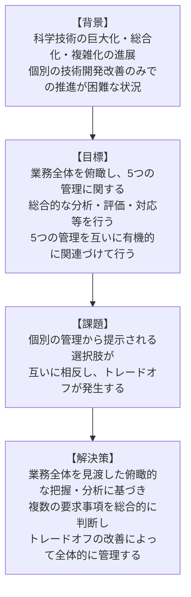
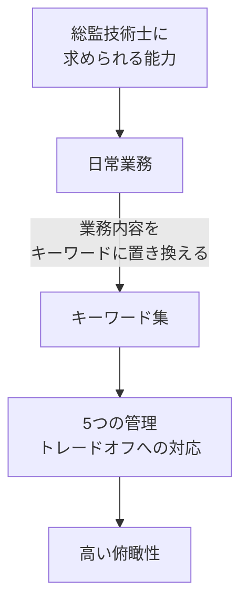
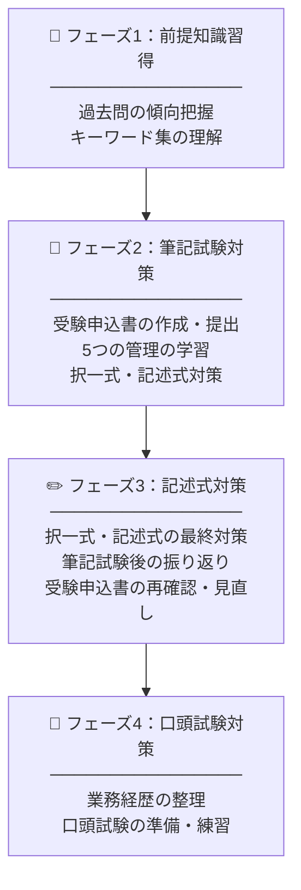
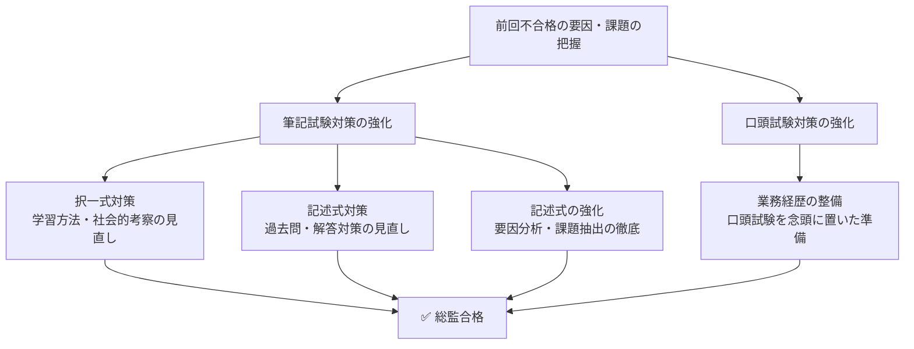

# 第1章 技術士試験（総合技術監理部門）に着実に合格するために

---

## 1.2 総監の全体像を掴もう

総監に合格するには、まず「総監とは何か？」をしっかり理解する必要があります。

総監が必要とされる背景、総監の目標、課題及び解決策を、図表1.5に示します。

---

### 図表1.5 総監の背景、目標、課題及び解決策

---

これはキーワード集の「1. 総合技術監理」を要約したものです。科学技術の巨大化・複雑化を背景として、一般部門における個別技術だけでは対応できない、総合的な課題解決のために総監が必要であるということです。

目標に掲げられた「5つの管理に関する総合的な分析・評価・判断」と、解決策にある「トレードオフの改善」が特徴的かつ重要なポイントといえます。

5つの管理は、**経済性管理**、**安全管理**、**人的資源管理**、**情報管理**、**社会環境管理**です。各管理の特性（目指す方向性）や管理技術の範囲を図表1.6に示します。

---

### 図表1.6 5つの管理の特性と管理技術の範囲

> 中心に **総合技術管理** を置き、5つの管理が連携する構造

| 管理区分 | 目指す方向性 | 主な管理技術 |
|:---|:---|:---|
| **経済性管理** | 品質・コストのバランス（生産性の向上） | 事業企画、品質の管理、工程管理、原価管理、設備管理・管理会計、計画・管理の数理的手法 |
| **人的資源管理** | 能力向上（能力発揮・生産性向上） | 人の行動と組織、労働関係法と労務管理、人材開発 |
| **情報管理** | 情報の活用・情報セキュリティの確保 | 情報分析と情報活用、コミュニケーション技術、情報通信技術動向、情報セキュリティ |
| **安全管理** | 安全性の確保・リスクの低減 | 安全の概念、安全に関するリスクマネジメント、災害・事故の未然防止、システム安全工学手法 |
| **社会環境管理** | 外部環境負荷の低減 | 地球的規模の環境問題、環境保全と社会的責任、環境管理活動、組織の社会的責任 |

---

管理技術は品質・コストの調整（生産性の向上）、人的資源管理は人の活用（能力向上・能力発揮）、情報管理は情報の活用（安全性向上）、安全管理は安全性の確保（リスクの低減）、社会環境管理は外部環境負荷の低減といった目指す方向性があります。

---

### 図表1.7 トレードオフのイメージ例

> ※ 原書はイラスト（人物の綱引き図）のため、内容をテキストで再現します。

| 対立の場面 | 一方の管理 | 他方の管理 |
|:---|:---|:---|
| 土木工事の安全設備 | **経済性管理**：コスト重視・工期厳守 | **安全管理**：安全性の確保 |
| 情報漏洩とベテラン活用 | **人的資源管理**：人の能力を活用（ベテランに任せたい） | **情報管理**：情報セキュリティの確保（情報漏洩リスク） |
| エネルギーの安定供給 | **社会環境管理**：外部環境負荷の低減（電力消費リスクの軽減） | **経済性管理**：品質確保・コスト監視（エネルギーの安定供給） |

---

### 図表1.8 5つの管理とトレードオフ

| | 人的資源管理 | 情報管理 | 安全管理 | 社会環境管理 |
|:---|:---|:---|:---|:---|
| **経済性管理** | 能力向上の仕組みを作るとコストアップ | 情報基盤整備でコストアップ、モチベーション低下 | 安全確保しようとするとコストアップ | 環境負荷抑制を行うにはコストアップ |
| **人的資源管理** | ― | 仕組みをつくるとコストアップ、モチベーションに影響 | 安全確保を万全にすると若手の経験機会が失われる | 環境負荷抑制を万全にすると若手の経験機会が失われる |
| **情報管理** | ― | ― | 安全確保を万全にすると情報量が増大し管理が困難 | 環境状況把握に必要な情報量が増大 |
| **安全管理** | ― | ― | ― | 環境負荷抑制と安全確保が相反する場面がある |

---

総監における課題解決では、業務全体を見渡した俯瞰的な把握・分析に基づき、複数の要求事項を総合的に判断し、管理間のトレードオフの改善を互いに有機的に関連づけて行うことになります。

例えば、経済性管理と安全管理のトレードオフの改善策として、現場のプロジェクトにおいてコストの確保（経済性管理）と安全の確保（安全管理）が求められる場合、情報管理を活用して現場の調査を行い、費用対効果の高い安全機器を採用したりします。

---

## 1.3 着実に総監合格するための5つのヒント

### 1.3.1 勉強を始める前に知っておきたい、一般部門との違い

総監受験者の多くは、一般部門の合格歴を持っていますが、一般部門での勉強対策と同じイメージで進めるとなかなか合格できないことが多いのです。そのため、総監部門と一般部門の違いを理解する必要があります。

一般部門では学会誌や学会長等から情報入手が容易です。一方、総監部門では対応する学会や団体が存在しないため、**キーワード集**が唯一の公式情報源となります。

5つの管理のキーワード集の内容は、択一式問題の対応はもちろんのこと、記述式問題の対応に際しても参考情報となります。

また、関係省庁のホームページには、分野白書（情報通信白書、国土交通白書（ものづくり白書）、環境白書など）があり、さまざまな情報源となります。

---

### 図表1.9 総監部門と一般部門の比較

| | 総監部門 | 一般部門 |
|:---|:---|:---|
| **学協会** | 無し | 有り |
| **白書** | 無し | 有り |
| **出題（業務内容の詳細）** | ①対象業務：技術士法１・２条を踏まえた業務 ②問題：総監の視点を含む業務 ③解決策：管理間のトレードオフの調整方（業務経験や技術を生かして） | ①対象業務：技術士法１・２条を踏まえた業務 ②問題：技術者では対応困難な事象発生 ③解決策：問題解決のための課題達行策（業務経験や技術を生かして） |
| **筆記試験** | Ⅰ必須科目（択一式）：40問・全解答 Ⅰ－２必須科目（記述式）：600字×5以内 | Ⅱ－１選択科目：2問中1問解答 600字×3枚 Ⅱ－２選択科目：1問解答 600字×2枚 Ⅲ選択科目：2問中1問解答 600字×3枚 |
| **口頭試験** | ①総監技術士として必要な専門知識・論及び応用能力 ②体系及び応用能力 ③技術者倫理 ④継続研さん | ①コミュニケーション・リーダーシップ ②評価・マネジメント ③技術者倫理 ④継続研さん |
| **試験時間** | 筆記：2時間 口頭：20分（延長10分の場合もあり） | 筆記：3時間30分 口頭：20分（延長10分の場合もあり） |

> ※ 一般部門における「問題」→ 総監部門における「課題」と表記しています。

---

### 1.3.2 合格者が実践する択一式と記述式のバランス

総監試験にあたり、筆記試験の択一式と記述式の学習のバランスが求められます。筆記試験は択一式・記述式の合計で60%以上の得点が必要です。

#### 図表1.10 合格パターン例

| パターン | 択一式 | 記述式 | 合計 | 判定 |
|:---:|:---:|:---:|:---:|:---:|
| ① | 60% | 60% | 60% | ✅ 合格 |
| ② | 45% | 75% | 60% | ✅ 合格 |
| ③ | 75% | 45% | 60% | ⚠️ 口頭試験リスクが高い |

> 択一式が60%を大きく下回って合格するパターン（②）は稀です。また③は口頭試験で内容について詳しく問われるリスクが高いため、**バランス良く勉強することを推奨します**。

---

### 1.3.3 合格者が実践すべきことは

試験対策として、日常業務においてはもちろんのこと、特に**5つの管理間のトレードオフの発生**に対して解決策を重視・実践してください。さらに総監技術士のキーワード集にある用語を日常業務の内容に当てはめてみることで、記述式問題の練習にもなり、着実に合格に近づくでしょう。

#### 図表1.11 日常業務における総監の実践イメージ

---

### 1.3.4 合格者が実践した1年間の過ごし方

総監部門の受験は一般部門と同様、受験申込書提出から合格発表まで約1年間にわたります。多くの総監合格者は、この1年間を漫然と過ごすのではなく、やるべきことを細分化してメリハリをつけて臨んでいます。

各フェーズで行うべきことを整理しておくことが重要です。

#### 図表1.12 総監受験の4フェーズ

---

### 1.3.5 再受験対策について

総監試験の合格率は一般部門に比べて低いことから、再受験をする受験生も多く、再受験する場合は、前回の不合格要因を自己分析し課題抽出を行うことが重要です（図表1.13）。特に記述式に対する評価（B、C）について、本書第4章を参考に要因分析と課題を抽出し、さらに対策を検討することで、次回受験時の合格の可能性を高められるでしょう。

#### 図表1.13 総監再受験における方策例

---

*（本文書は書籍スキャンからの文字起こしです。図の一部は読み取り精度の制約により、原文と異なる場合があります。）*
