# 第1章 経済性管理

経済性は、技術士にとって欠かせない判断基準となりますので、経済性管理は重要な知識分野である点は間違いありません。経済性管理で扱う内容はとても広いですが、この章では、事業企画、品質管理、工程管理、原価管理、財務会計、設備管理、計画・管理の数理的手法に分けて説明を行います。

---

## 1. 事業企画

事業企画は、具体的な事業のアイデアを発掘し、事業計画を練り上げる業務をいいますが、そのために用いられる手法として次のものがあります。

### （1）フィージビリティスタディ

**フィージビリティスタディ**は、事業やプロジェクトの実現可能性がどの程度の確かさかを事前に調査する業務ですが、フィージビリティスタディで実施する調査の内容には次のようなものがあります。

1. 事業の目的に沿って事業規模などの事業のフレームを具体化する
2. **市場調査**を行い、事業化した場合における需要予測をする
3. 予備的な設計によって、事業に要する概略の期間やコストを予測する
4. 事業の収支や資金の調達方法を検討する

販売の機会損失をなくし、不良在庫が発生しないようにするためには、**需要予測**が適切に行われなければなりません。需要予測のモデルとして、次に示すような統計的な予測方法があります。

#### (a) 移動平均法

**移動平均法**は、指定された過去の期間の需要実績データを平均することによって需要を予測する手法です。移動平均法では、期間を1単位ずつずらして平均値を計算していきます。例えば、「4月〜6月」、「5月〜7月」などの期間の平均値をそれぞれ計算します。移動平均法で移動平均を計算する期間を長くすると、需要変動が小さくなるため、季節変動などの需要差が見えにくくなります。逆に、移動平均を計算する期間を長くすると、需要変動の動きが小さく見えるため、直近の変化をとらえるのが遅くなりますので、需要の変化を遅れて追う結果になります。

#### (b) 指数平滑法

**指数平滑法**は、需要予測を行うのに、前期の実績値と前期の予測値に重み付けをして次期の予測をする方法です。これを式で表すと次のようになります。なお、αは平滑化係数（0≦α≦1）といいます。

> ある期間の需要 ＝ α × 前期実績値 ＋ （1 − α）前期予測値  
> 　　　　　　　 ＝ 前期予測値 ＋ α（前期実績値 − 前期予測値）

この式を見るとわかるとおり、αを1に近づけると前期の実績値重視の予測になります。

フィージビリティの結果は、事業化の意思決定をする人や組織、資金を融資する組織において重要な判断材料となります。

### （2）事業投資計画

企業が投資を行う場合には、**事業投資計画**を策定し、その事業の**事業投資評価**をする必要があります。しかし、投資を行う時期と回収を行う時期には時間的なずれがありますので、それぞれの貨幣価値が違います。具体的には、金利を考えれば、今日の支払い額は明日の支払い額よりも価値が高いという考え方になります。その考えをベースにして、将来のキャッシュ・フローを現在の価値に換算する手法が現在価値法になります。**現在価値**（PV：Present Value）の計算は次の式を用いて行います。

$$PV = \frac{Mt}{(1+r)^t}$$

> Mt：今から t 年後の支払い額　／　r：年間利率（割引率）

#### (a) 正味現在価値法〔NPV（Net Present Value）法〕

**正味現在価値法**は、投資費用と将来獲得できる現金流入額を比較して、その差額である正味現在価値（V）がプラスであれば、投資を行うと判断する手法です。初期投資額を I、利子率を r、現金が流入すると期待できる期間を n 年、t 年後の正味現金流入額を Ct とすると、正味現在価値（V）は次の式で表されます。

$$V = \frac{C_1}{1+r} + \frac{C_2}{(1+r)^2} + \frac{C_3}{(1+r)^3} + \cdots + \frac{C_n}{(1+r)^n} - I$$

#### (b) 回収期間法

**回収期間法**とは、毎年の正味現金流入額によって、投資額が何年で回収できるかを計算する手法で、年間の回収金額が決定できれば、簡単に計算できます。結果は回収年数で出ますので、その年数が短いほど投資効果が高いと判断します。この場合にも、金利（r）を考慮して、n 年後の元利合計（S）を計算する必要があります。元利合計（S）を、現在の資金額（I）と均等資金年額（M）を使った式で表すと次のようになります。

$$S = I(1+r)^n = M + M(1+r) + M(1+r)^2 + \cdots + M(1+r)^{n-1}$$

この式から、均等資金年額（M）を求める式は、次のようになります。

$$M = I \cdot \frac{r(1+r)^n}{(1+r)^n - 1}$$

#### (c) 投資利益率法（ROI：Return on Investment）

**投資利益率法**とは、投資によって得られる利益額が投下した資本に対してどれだけの率になっているかを見るもので、下記の式で表せます。

$$投資利益率(ROI) = \frac{利益額}{投資額} \times 100 \, [\%]$$

複数年の利益を考える場合には、平均利益額を計算して利益額とします。

$$平均利益額 = \frac{1年目の利益額 + \cdots + n年目の利益額}{n}$$

投資利益率 ＞ 平均借入率　となれば、採算性のある投資であるといえます。

### （3）事業評価

**事業評価**とは、個別事業等を対象にして、費用に見合った効果が得られているのかどうかなどを、事前に評価するものです。必要に応じて、事後（期中、終了時など）に検証を行う場合もあります。

#### (a) 費用便益分析

**費用便益分析**は、公共政策の効果を貨幣額で表示し、それを投入した費用と比較して評価する分析手法で、直接的効果（内部経済効果）を対象としています。

#### (b) 費用効用分析

効用とは、満足の度合いを数量的に表したもので、効用関数は効用を数値に置き換える数学モデルですが、**費用効用分析**は、主観的な満足の度合いを表す指標ですので、すべての対象で貨幣価値などに換算できるわけではありません。

#### (c) アウトプット指標

**アウトプット指標**とは、行政活動の成果を評価する指標で、具体的な行政活動を実際にどの程度行ったかを示す指標のことです。具体的には、道路整備の延長距離や討論会の開催回数などの数値で表します。

#### (d) アウトカム指標

**アウトカム指標**は、成果物によってどれだけ成果が上がったかを示す指標で、具体的には、渋滞がどの程度緩和されたかなどで示します。対象によって、貨幣価値や数値だけではなく、効率などの指標でも表します。

#### (e) インプット指標

**インプット指標**は、投入するヒト、モノ、金、情報などの資源量を表す指標で、主に予算額が用いられます。

### （4）設計管理

設計管理にはさまざまな手法が用いられますので、そういった用語を次に示します。

1. **信頼性設計**：与えられた条件下で、規定の期間中、必要とされる機能を満たすようにすることを目的とした設計をいいます。
2. **保全性設計**：故障や異常を素早く検出・診断して、短時間で修復できるよう顧慮した設計をいいます。
3. **コンカレントエンジニアリング**：下流の業務担当者（詳細設計などの実施部隊）を基本設計段階からチームに参画させて、工期の短縮を図る手法をいいます。
4. **デザインレビュー**：製品の生産から廃棄に至るまでのライフサイクルの設計計画のアウトプットと導出プロセスに対して、品質特性の観点から、妥当性や問題点の摘出を行う組織的な審査をいいます。
5. **デザインイン**：メーカーが取引先の部品メーカーなどと製品の開発段階から共同して開発していく手法をいいます。
6. **フロントローディング**：初期の工程のうちに、後工程で発生しそうな問題の検討や改善に前倒しで集中的に取り組み、品質の向上や工期の短縮を図る手法をいいます。

### （5）マーケティングにおける指標

マーケティングやビジネスにおいては、さまざまな指標が使われています。

1. **重要目標達成指標（KGI）**：KGI（Key Goal Indicator）は、企業などが最終的に目指すゴールについて、達成度合いを定量的に測る指標です。具体的には、企業として「売上20％アップ」などの指標を設定して、その達成度を測る際などに用います。
2. **重要業績評価指標（KPI）**：KPI（Key Performance Indicator）は、上記に示した KGI が最終的なゴールを表すのに対して、中間ゴールや最終的な目標を小さな目標に分解して、目指す指標をいいます。具体的には、部署や担当者別に集客率や売上アップ率、購買単価低減率などの目標を設定し、最終的に KGI の達成を目指すための指標などになります。
3. **重要成功要因（KSF）**：KSF（Key Success Factor）は、上記の KGI や KPI が数値化して測れるような指標であるのに対して、事業を成功させるために必要な要因を言語化したものです。KSF を洗い出す際には、最終的に目指すゴールである KGI を決めることから始めます。具体的には、売上アップ○%のために何をすべきか検討して、「新規顧客獲得のスピードアップを図る」というような KSF を設定するなど、数値目標を達成するために必要な要因を言語化します。

### （6）民間資金等の活用による公共施設等の整備等の促進に関する法律（PFI法）

**PFI**（Private Finance Initiative）とは、公共施設等の建設、維持管理、運営等を民間の資金、経営能力および技術的能力を活用して行う手法です。方式として、次のようなものがあります。

- **BTO方式**：民間事業者の資金で建設（Build）し、完成後に所有権を移転（Transfer）し、民間事業者が維持管理（Operate）する方式です。
- **BOT方式**：民間事業者の資金で建設（Build）し、民間事業者が維持管理（Operate）し、事業終了後に所有権を移転（Transfer）する方式です。
- **コンセッション方式**：施設の所有権を公共主体が有したまま、施設の運営権が民間事業者に設定される方式です。

PFI事業における最も重要な概念の一つに **VFM**（Value For Money）がありますが、VFM は、一定の支払い（Money）に対して最も価値の高いサービス（Value）を供給するという考え方のことです。VFM は、従来の方式と比べて、PFI の方が同等またはそれ以上のサービスができていて、総事業費をどれだけ削減できるかを示す割合になります。

PFI 事業においてリスクが顕在化した場合の追加的支出の分担については、あらかじめ具体的かつ明確に規定することが重要だとされています。

#### (a) リスクを分担する者

下記の2つの能力とリスクが顕在化する場合のその責めに帰すべき事由の有無に応じて、公共施設等の管理者等と選定事業者間で、リスクを分担する者を検討する。

- リスクの顕在化をより小さな費用で防ぎ得る対応能力
- リスクが顕在化するおそれが高い場合に追加的支出を極力小さくし得る対応能力

#### (b) リスクの分担方法

- ⓐ 公共施設等の管理者等あるいは選定事業者のいずれかが全てを負担
- ⓑ 双方が一定の分担割合で負担
- ⓒ 一定額まで一方が負担し、それを超えた場合にはⓐやⓑの方法で負担
- ⓓ 一定額まで双方が一定の分担割合で負担し、それを超えた場合にはⓐの方法で負担

#### (c) リスク分担の検討

リスク分担の検討に当たっては、リスクが選定事業ごとに異なるものであり、個々の選定事業に即してその内容を評価し検討することが基本となります。

#### (d) 不可抗力へのリスク

天災等の不可抗力に起因するリスクについては、選定事業の実施に影響を与えることから、その場合の追加的支出の分担のあり方や事業期間の延長についてあらかじめ検討し、できる限り協定等で取り決めておくことが望ましいとされています。

#### (e) 物価変動等のリスク

物価の変動、金利の変動、為替レートの変動、税制の変更等は、選定事業者の費用増加や利益減少の原因となり得ることから、変動等の選定事業に与える影響の程度を勘案して、分担のあり方についてあらかじめ検討し、できる限り協定等で取り決めておくことが望ましいとしています。

### （7）プロジェクトマネジメント

プロジェクトマネジメントについては、アメリカの PMI（Project Management Institute）が作成している、**PMBOK**（Project Management Body of Knowledge）が事実上の世界標準となっています。PMBOK ガイド第7版では、「プロジェクトとは、独自のプロダクト、サービス、所産を創造するために実施する有期性のある業務」と定義しています。

プロジェクトマネジメントについては、PMBOK ガイド第7版では、「プロジェクトの要求事項を満たすため、知識、スキル、ツールおよび技法をプロジェクト活動へ適用すること」と定義しています。PMBOK ガイド第7版では、下記の8つのプロジェクト・パフォーマンス領域を定めています。

1. デリバリー
2. 開発アプローチとライフサイクル
3. 計画
4. プロジェクト作業
5. 測定
6. ステークホルダー
7. チーム
8. 不確かさ

プロジェクトには多くのプロセスが存在するため、それらのコーディネーションを行うことが最も重要ですが、それらプロセスを全体的な面からのみ捉えているだけでは、実際に適切なマネジメントは行えません。

プロジェクトをコントロールしやすくするために、プロジェクトをいくつかの「フェーズ」に分割し、フェーズごとに成果物を定義する手法がとられます。スコープを目に見える形にするための詳細の作業内容を形にしていく方法として、**作業分解**があります。その結果作成される階層的な作業分解結果が、「ワークブレークダウンストラクチャー」（**WBS**：Work Breakdown Structure）です。WBS は、プロジェクトに含まれる作業項目をツリー構造で表したものです。

---

## 2. 品質管理

**品質管理**（広義）は、品質方針と品質目標を設定し、それを達成するために、品質計画、品質管理（狭義）、品質保証、品質改善という4つの活動を行うことです。なお、ここでいう品質とは、顧客が求める**要求品質**、顧客の要求品質を形にする**設計品質**、要求品質や設計品質に対する適合度を示す**製造品質**などのすべてを含むものとします。

### （1）品質方針と品質目標

**品質方針**は、トップマネジメントによって正式に表明された、組織としての品質に関わる全般的な方向付けをいいます。一方、**品質目標**は、品質に関する目標で、品質方針の展開という意味での目標と、製品やプロジェクトの目標の2つがあります。

### （2）品質計画

**品質計画**は、品質目標の設定と目標を達成するための計画を立案するプロセスです。具体的には、トップマネジメントから示される組織全体としての品質方針を部門ごとの品質方針に展開し、これに基づいて部門ごとの品質計画を策定します。品質計画は固定的なものではなく、活動が進んでいく段階で見直しを行うべきものと考える必要があります。

### （3）品質管理（狭義）

**品質管理**（狭義）は、品質要求事項を満たすことに焦点を合わせて、さまざまな技法を実施するプロセスです。具体的には、QC活動などの仕組みや QC 手法を利用して、品質要求を満たすことに焦点をおいた活動が行われます。

#### (a) QC7つ道具

**QC7つ道具**は、主に数値データを扱うことに適しているとされており、次のものがあります。

1. **層別**：たくさんのものを、特定の特徴によっていくつかの層に分けることです。
2. **パレート図**：イタリア人経済学者のパレートが考案した経済学の法則に、「世の中の富の8割以上は、人口の2割以下にあたる人によって握られている」という法則があります。この法則を品質管理に当てはめて、「不適合の原因の8割以上は、発生原因の2割以下の特定原因によって引き起こされている」とする考え方を使ったグラフを**パレート図**といいます。このことから、2割に当たる特定要因を解消することで、ほとんどの不適合は解決されると考え、特定要因の改善について集中的に費用をかければ、多くの不適合が改善されるので、効果的な改善ができます。パレート図はその特定要因を図示するもので、通常ヒストグラム（柱状グラフ）を用いて表されます。
3. **特性要因図**：**特性要因図**とは、魚の骨ダイアグラムとも呼ばれ、各種の要因によって引き起こされる現象を魚の骨の形状に示し、要因を分析し判断を行う手法です（p.49、7節（4）(b)参照）。
4. **ヒストグラム**：データをいくつかの区間に分けて、その区間に存在するデータの度数を柱状グラフで表したものです。
5. **散布図**：**散布図**とは、2種類のデータを横軸と縦軸におき、その関係をグラフ上にプロットすることによって、そのプロットされた点の集中傾向から、全体の傾向を想定していく手法です。
6. **グラフ・管理図**：品質の安定性を評価するために、必要に応じて、各種のグラフや管理限界線を持つ管理図が用いられます。
7. **チェックシート**：チェックシートとは、業務の主要なポイントとなる事象を予め列記しておき、その結果が良いか悪いか、または完了か未完了かなどのチェックを入れて、確認をするリストのことです。

#### (b) 新QC7つ道具

**新QC7つ道具**は、主に言語データを扱うことに適しているとされており、次のものがあります。

1. **連関図**：連関図とは、原因や結果などの項目を抽出して、それらの因果関係を矢印で示した図のことです。
2. **系統図**：系統図とは、目的やゴールなどの目標を決め、そこに達するまでの手段等を樹枝状に表現した図をいいます。
3. **マトリックス図**：マトリックス図とは、2つの要素を行と列に表し、それらの関係を表現した二次元の表をいいます。
4. **過程決定計画図**：過程決定計画図とは、対策のステップを表現したフローチャートをいいます（p.50、7節（4）(c)参照）。
5. **アローダイアグラム**：アローダイアグラムとは、作業を矢印で表した日程計画表をいいます。
6. **親和図**：親和図は、言語データをグループ分けして、整理・分類した図をいいます（p.49、7節（4）(b)参照）。
7. **マトリックスデータ解析**：マトリックスデータ解析とは、複数のデータを解析することによって、グラフなどで傾向がわかるようにした図です。

#### (c) 正規分布

信頼性においては、確率の考え方を適用する場面が多くありますが、そのような場合に問題として出題しやすいのが、正規分布になります。**正規分布**は統計では広く使われる確率分布で、**図表1.1** に示すように、平均値（μ）を中心として左右対称の形状をしています。

正規分布の形状については、平均（μ）と標準偏差（σ）によって決ってきます。この場合には、正規分布を N(μ, σ²) で表します。平均μからのずれが ±σ 以下の範囲に X が含まれる確率は 68.3 %、±2σ 以下の範囲に X が含まれる確率が 95.4 %、±3σ 以下（6σ）の範囲に X が含まれる確率は 99.7 % となります。

---

**図表 1.1　正規分布**

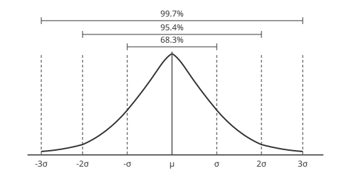

---

製品は管理図の管理限界内で異常を発見し、規格値で合否判定を行うのが理想です。**管理限界**として規格限度（6σ）が用いられていますが、管理限界は規格値よりも小さくする必要があります。定められた規格限度（6σ など）で製品を生産できる能力を表す指標として**工程能力指数**があり、次の式で表せます。

$$工程能力指数 = \frac{（公差上限値）-（公差下限値）}{標準偏差（6\sigma など）}$$

この式から、工程能力指数は、品質特性の測定値のばらつき（標準偏差）が小さいほど大きくなります。また、工程能力指数が高い場合は不良品が少ないという状況を表しています。

#### (d) 検査

設計や計画の段階で安全性をいくら考慮していても、そのとおりの製品やシステムが完成できなければ、問題は解決しません。そのために、さまざまな段階において検査が行われます。検査の目的は、その部品やサブシステムに内在する問題を、後の工程に先送りしないために行うものです。プラントなどの重要施設に用いる製品やシステムについては、不適合品の混入が認められないことから**全数検査**が行われますが、量産品などのある程度の不適合品の混入が認められる場合には、抜取検査などの方法が取られています。**抜取検査**の基本的な考え方としては、サンプルを抽出して、その解析結果をロット判定基準と比較して、ロット単位で合否を判定します。そのため、ロットからサンプルをランダムに抜き取ることができる必要があります。

### （4）品質保証

**品質マネジメントシステム**は、基本的には国際規格である **ISO 9000 シリーズ**に則って実施されます。ISO 9000 シリーズは、顧客や社会などが求めている一貫した製品・サービスの提供と、顧客満足（CS）の向上を実現するための品質マネジメントシステムの要求事項を規定しています。

ISO 9001：2015 では、プロセスの結果であるアウトプットには製品とサービスの2つがあり、製品のなかにはハードウェア、ソフトウェア、素材製品の3つのカテゴリがあるとしています。また、ISO 9001：2015 では、組織が将来なりたいビジョンや、組織は何をするべきかという使命、ビジョンや使命を達成するために何をするかの方針を示した戦略を新たに加えています。さらに、目標が達成された成功を、組織が持続的に達成することも品質マネジメントの目的と考えています。このように、あらゆるプロセスで **PDCAサイクル**が適用されています。

**品質保証**は、要求事項を満たすことについての信頼性を顧客に与えることに焦点を合わせた活動を行うプロセスです。**品質保証活動**は、企画、開発・設計、生産準備、生産、流通、販売・サービス、廃棄・リサイクルなど、すべての生産活動の段階に関係します。

### （5）品質改善

**品質改善**は、品質の不良をなくし、よりよい品質の製品を生み出していくための能力を高めることに焦点を合わせた活動を行うプロセスです。品質の不良には、一般的に、設計品質の不良、工程管理問題に起因する不良、製品品質の不良の3つがあります。

### （6）消費者保護

消費者保護を実践するためには、開発・設計段階、生産段階、販売・サービス段階で欠陥を発生させないための対策を検討する必要があります。

製品事故を防ぐために、危害が発生するおそれがある製品を指定し、技術基準に適合した製品に**製品安全**（PS）マークの表示が義務付けられています。製品安全マークには次のようなものがあります。

1. **PSCマーク**：消費生活用製品安全法
2. **PSEマーク**：電気用品安全法
3. **PSTGマーク**：ガス事業法
4. **PSPGマーク**：液化石油ガスの保安の確保及び取引の適正化に関する法律

### （7）顧客満足（CS）

消費者に満足する製品を購入してもらうためには、まず消費者の要求に合致した品質の製品を提供することですが、それに加えて、買っていただいた商品のメンテナンスや購入後の情報提供を行う**アフターサービス**を実施する必要があります。さらに、見込み客の購買意欲を高めるための**ビフォアサービス**も重要ですが、アフターサービスは、次回購入のためのビフォアサービスでもあります。なお、サービスには次のような特性があります。

1. **無形性**：サービスには、形がありませんし、触れたりすることもできません。
2. **同時性**：サービスは、顧客との共同作業で行われ、サービスの提供と消費が同時に行われる同時性がありますし、起こったことを元に戻すこともできません。
3. **変動性**：サービスの需要は、季節や週の曜日、時間帯によって変動しますので、タイミングによっては同じスタッフでもサービスの品質が変動します。
4. **消滅性**：サービスは、サービスの終了とともに消滅しますので、在庫として持つこともできません。

---

## 3. 工程管理

JIS Z 8141 の生産管理という用語の定義で、**生産管理**とは、「財・サービスの生産に関する管理活動」とされていますが、その備考として次の内容が示されており、工程管理の説明がなされています。

- 備考1：具体的には、所定の品質 Q・原価 C・数量及び納期 D で生産するため、又は Q・C・D に関する最適化を図るため、人、物、金、情報を駆使して、需要予測、生産計画、生産実施、生産統制を行う手続き及びその活動
- 備考2：狭義には、生産工程における生産統制を意味し、工程管理ともいう。

生産管理における評価尺度を表す用語に **PQCDSME** がありますが、それらが意味するところは次のとおりです。

1. P：生産性（Productivity）
2. Q：品質（Quality）
3. C：コスト（Cost）
4. D：納期（Delivery）
5. S：安全性（Safety）
6. M：意欲（Morale）
7. E：環境（Environment）

### （1）総合生産計画

**総合生産計画**は、生産計画の最初に行われるものですので、**大日程計画**とも言い換えることもできます。総合生産計画の目的は、需要予測量と生産能力を合理的に均衡させることです。均衡させるためには、需要予測量を満足するために必要な労働力、在庫、残業、外注の各量を求めます。それらを使って、生産量と生産すべき時期の計画を作成します。その際には、コストの最小化を図るだけではなく、雇用の安定化や在庫の適正化などが重要な要素となってきます。

総合生産計画を作成する際は、需要変動に対する対応が重要となります。計画を立案する際に考えられる需要変動に対して調整する方法には、大きく分けて**生産能力調整**の方法と**需要平準化**の方法があります。

### （2）生産方式

#### (a) ジャストインタイム（JIT）生産方式

**ジャストインタイム**は、JIS Z 8141 で、「すべての工程が、後工程の要求に合わせて、必要な物を、必要なときに、必要な量だけ生産（供給）する生産方式」と定義されています。JIT 生産方式のねらいは、中間仕掛品の滞留や工程の遊休などが生じないようにすることです。ジャストインタイムを実現するには、**平準化生産**をすることが重要となります。平準化生産は、JIS Z 8141 で、「需要の変動に対して、生産を適応させるために、最終組立工程の生産品種と生産量を平準化した生産方式」と定義されています。

ジャストインタイムは、後工程で使った量を前工程から引き取る方式であるため、**プルシステム**ともいいます。プルシステムは、JIS Z8141 で、「後工程から引き取られた量を補充するためにだけ、生産活動を行う管理方式」と定義されています。これに対して、「あらかじめ定められたスケジュールに従い、生産活動を行う管理方式」を、JIS Z 8141 では**プッシュシステム**と定義しています。

JIT 生産方式の基本となるのは**かんばん方式**ですが、かんばん方式は、JIS Z 8141 で、「トヨタ生産システムにおいて、後工程引き取り方式を実現する際に、かんばんと呼ばれる作業指示票を利用して生産指示、運搬指示をする仕組み」と定義しています。なお、「かんばん」には、「生産指示かんばん」と「引き取りかんばん」があります。

#### (b) サプライチェーンマネジメント

**サプライチェーンマネジメント**は、JIS Z 8141 では、「材料供給から生産、流通、販売に至る物又はサービスの供給連鎖をネットワークで結び、販売情報、需要情報などを部門間又は企業間でリアルタイムに共有することによって、経営業務全体のスピード及び効率を高めながら顧客満足を実現する経営コンセプト」と定義されています。サプライチェーンマネジメントの目標は、キャッシュフローマネジメントを実現するとともに、最新の情報技術と制約理論などの管理技術に基づいて、業務の全体最適化を図ることです。サプライチェーンマネジメントの基本的な考え方となるのが、**制約条件の理論**（TOC：Theory of Constraints）で、ボトルネックとなっている工程を継続的に改善して、全体システムのパフォーマンスの向上を実現するものです。

なお、サプライチェーンにおいては、**ブルウィップ効果**という、ある製品に対するサプライチェーンにおいて、参加する各企業（パートナー企業）がそれぞれ需要を予測しながら発注していく場合、川下から川上に段階がさかのぼるにしたがい、需要予測量の変動が増幅していく現象が生じる場合があります。

サプライチェーンマネジメントを見直す動きの方向性として、次のようなポイントがあります。

1. 部素材調達先の多様化
2. 生産拠点の分散化
3. 部品の標準化
4. サプライチェーンの可視化

### （3）基準生産計画と資材所要量計画

**基準生産計画**（MPS：Master Product Schedule）は、総合生産計画によって生産する製品全体の生産計画を、最終的に製品アイテム単位に分解することがその機能といえます。

**資材所要量計画**（MRP：Material Requirements Planning）は、ある一定期間に生産する計画の製品の部品展開をして、必要な部品を必要な時期に、必要な量購入または製造する計画を立てる手法をいいます。資材所要量計画による個々の部品や原材料の生産量や購入量の決定を行うための情報として、**構成部品表**（BOM：Bill of Material）、リードタイム、手持在庫量、受入確定量などがあります。

資材所要量計画システムは、受注から納入までの一連の業務を処理する、**統合業務システム**（ERP：Enterprise Resource Planning）に組み込まれています。なお、統合業務システムは、生産管理だけではなく、会計・財務管理、販売管理、人事管理までを含んでいます。なお、原材料の調達から、製品の設計・開発、生産、運用、保守に至るまでのすべての情報を電子化して、コンピュータで一元管理する **CALS**（生産・調達・運用支援統合情報システム）も活用されています。

### （4）手順計画

**手順計画**は、JIS Z 8141 で、「製品を生産するにあたり、その製品の設計情報から、必要作業、工程順序、作業順序、作業条件を決める活動」と定義されています。手順計画の目的としては、次の3つがあります。

- ⒜ 総作業時間の短縮を目指した最適な生産方式の決定
- ⒝ 作業や品質を安定させる生産方式の標準化
- ⒞ 作業時間を平準化させるための作業分担の適正化

**標準時間**は、JIS Z 8141 で、「その仕事に適性をもち、習熟した作業者が、所定の作業条件のもとで、必要な余裕をもち、正常な作業ペースによって仕事を遂行するために必要とされる時間」と定義されています。標準時間の構成は、**図表1.2** のようになります。

---

**図表 1.2　標準時間**

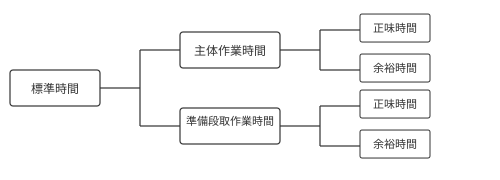

---

手順計画を作成する場合に、実現手段の主要素として次の**生産の4M**があります。

- MAN（人）
- MACHINE（機械）
- MATERIAL（材料）
- METHOD（方法）

### （5）負荷計画

**負荷計画**とは、JIS Z8141 で、「生産部門又は職場ごとに課す仕事量、すなわち、生産負荷を計算し、これを計画期間全体にわたって各職場に割り付ける活動」と定義されています。なお、負荷計画は、「工数計画」または「余力計画」ともいわれます。**負荷計画の目的**は、**負荷工数と能力工数の調整を行い、納期を確保すること**です。負荷工数と能力工数は、次のような式で求められます。

**（a）労働時間基準**

- 負荷工数 ＝ 標準作業時間 × 生産数 ＋ 段取り時間
- 能力工数 ＝ 就業時間 × （1 − 間接作業率）× 作業者数 × 出勤率

**（b）機械運転時間基準**

- 負荷工数 ＝ 標準加工時間 × 生産数 ＋ 段取り時間
- 能力工数 ＝ 運転時間 × （1 − 故障率）× 機械台数

**（c）負荷率**

$$負荷率 = \frac{負荷工数}{能力工数} \times 100 \, [\%]$$

**（d）能力調整**

- 対策能力 ＝ 所要能力 − 保有能力
- 所要能力 ＞ 保有能力のとき：対策 → 残業、休日出勤、他からの応援、外注化など
- 所要能力 ＜ 保有能力のとき：対策 → 就業時間短縮、人員削減、他への応援、外注業務の内製化など

**負荷平準化**における手法としては、**山積み・山くずし法**があります。また、計画通りの生産を実現するためには、**リードタイム**（加工時間＋段取り時間＋停滞時間＋移動時間＋作業時間）を安定化させることが重要です。

### （6）工数見積り

負荷計画を行うためには、各作業の工数見積りが行われなければなりません。工数見積りには下記の方法が用いられます。

#### (a) 類推見積り

**類推見積り**は、過去に実施した類似の作業実績のデータを使って行う見積りです。

#### (b) パラメトリック見積り

**パラメトリック見積り**は、係数見積りとも呼ばれ、過去のデータをもとに得られたパラメーター（係数）を使って行う見積りです。

#### (c) 三点見積り

**三点見積り**は、作業期間を悲観的な見積（P）と最も可能性がある見積（M）、楽観的な見積（O）の3種類行い、それらを加重平均して現実的な作業期間を算出する方法で、その計算式は次のようになります。

$$三点見積法 = \frac{（P + 4M + O）}{6}$$

### （7）PERT

**PERT**（Program Evaluation and Review Technique）は、1950年代にアメリカ海軍がミサイル開発プロジェクトのために開発したスケジューリング手法で、それぞれの工程の所要時間からネットワーク図を作成していきます。

---

**図表 1.3　某プロジェクトの作業とその関係**

| 作業名 | 所要時間 | 先行作業 |
|:---:|:---:|:---:|
| A | 2 | なし |
| B | 5 | なし |
| C | 7 | A, B |
| D | 4 | A, B |
| E | 1 | D |
| F | 6 | B |

---

この例で、ネットワーク図をガントチャートとアローダイアグラムで表すと、**図表1.4** のようになります。

---

**図表 1.4　某プロジェクトのガントチャートとアローダイアグラム**

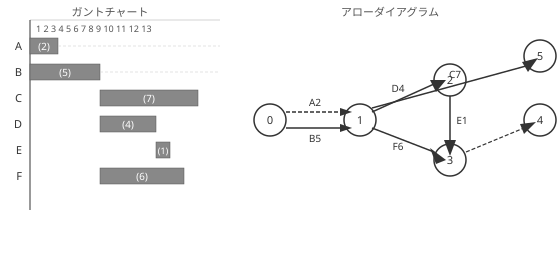

---

### （8）CPM

**CPM**（Critical Path Method）は、1950年代に建設計画を行う目的で作成された手法で、スケジュールのフレキシビリティを重視して考えられた工程管理手法です。第一に、計画されたネットワーク作業の作業順序どおり（前進計算）に、最短作業期間を計算していき、最も早い開始日（最早開始日）と最も早い終了日（最早終了日）を計算から求めます。次に、作業順序の逆（後退計算）で、最も遅い開始日（最遅開始日）と最も遅い終了日（最遅終了日）を計算します。それらの差によってフロートを計算して、どのネットワーク作業がスケジュール上でフレキシビリティを持っているか、またはクリティカルパスであるかを判断する手法です（**図表1.5** 参照）。

---

**図表 1.5　クリティカルパス法**

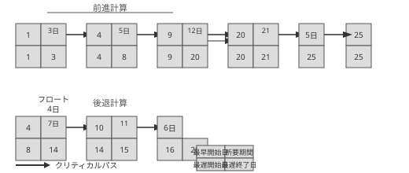

---

**フロート**とは最早開始日と最遅開始日の差で、結果としてプロジェクトの終了日を遅らせることがなく、当該作業を遅らせることができる余裕日のことです。プロジェクト全体の余裕日を**トータルフロート**と呼ぶこともあります。また、2つの作業関係だけを取り上げて、継続作業を遅らせることなく先行作業を遅らせることができる余裕日を、**フリーフロート**と呼ぶこともあります。また、**クリティカルパス**とは、プロジェクトのスケジュール上で、フロートがゼロ以下になっている作業チェーンのことをいいます。特にマイナスになっている場合は、スケジュールどおり作業を終わらせることができないことを意味していますので、必ず改善が必要となります。

### （9）生産統制

**生産統制**とは、日程計画にしたがって製造工程が正常に運営されているかを監視し、遅延が発生しそうな場合には、速やかに対策を講じるといった生産計画を達成するための進度管理全般をいいます。

#### (a) 現品管理

**現品管理**は、JIS Z 8141 で、「資材、仕掛品、備品などの物について運搬・移動や停滞・保管の状況を管理する活動」と定義されています。現品管理は、現品の経済的な処理と数量や所在の確実な把握を目的としています。

#### (b) 余力管理

**余力管理**は、JIS Z 8141 で、「各工程又は個々の作業者について、現在の負荷状態と現有能力とを把握し、現在どれだけの余力又は不足があるかを検討し、作業の再配分を行って能力と負荷を均衡させる活動」と定義されています。なお、「余力」とは、能力と負荷との差をいいます。余力管理の目的は、作業者や設備の能力と負荷を調整して、待ち時間を減らし、過負荷を防止することにあります。なお、余力管理は工数管理ともいわれます。

#### (c) 進捗管理

**進捗管理**は、JIS Z 8141 で、「仕事の進行状況を把握し、日々の仕事の進み具合を調整する活動」と定義されています。進捗管理は、**進度管理**や**納期管理**ともいわれ、日程計画に基づく生産活動の実行を統制することです。

### （10）改善活動

改善活動は、業務を見直して今よりも良くしていく活動で、次のような言葉が使われています。

1. **5S**：整理、整頓、清掃、清潔、しつけ
2. **ECRSの原則**：下記の頭文字をとったものです。
   - Eliminate（排除）：不要な作業を排除する
   - Combine（結合）：別々の工程を1つにする
   - Rearrange（順序入れ替え）：作業順序を再構成する
   - Simplify（簡素化）：業務の簡素化を図る
3. **3M**：ムリ、ムラ、ムダ

### （11）開発プロセス

製品やシステムを開発する際には、さまざまな手法が使われています。

#### (a) ウォーターフォール型開発

**ウォーターフォール型**は、要件定義→基本設計→詳細設計→コーディング→単体テスト→結合テスト→システムテストのように、上流工程から下流工程へ順番に開発を進めていく手法です。

#### (b) V字型モデル

ウォーターフォール型は、要件定義→基本設計→詳細設計→コーディング→単体テスト→結合テスト→システムテストと進む開発モデルですが、**V字型モデル**は、コーディングから後の作業を折り返して、詳細設計の内容を単体テストで、基本設計の内容を結合テストで、要件定義の内容をシステムテストで確認する手法です。

#### (c) スパイラル型開発

**スパイラル型**は機能ごとに要件定義→設計→開発→テストを繰り返し、完成度を徐々に上げていく手法であるので、やり直しは最小限になります。

#### (d) アジャイル型開発

**アジャイル型**は、小さい機能単位で計画→設計→実装→テストの繰り返しで開発を進めていく手法ですので、ユーザーや顧客のフィードバックを取り入れることができます。

#### (e) イテレーティブ型開発

イテレーティブとは「反復」という意味ですので、**イテレーティブ型**は、計画→設計→実装→テストを繰り返し行う開発手法です。

---

## 4. 原価管理

**原価管理**では、標準原価を設定して、実際にかかった原価と比較して、その差異を分析し、適切な対策を講じて原価を低減することが目的となります。原価管理には、大きく分けて、仕様を決定する際に行われる原価企画と、仕様決定後に行われる原価維持と原価改善があります。

### （1）原価企画

**原価企画**とは、広義には、新製品などの開発において、企画段階で製品のライフサイクルにわたる目標原価を設定して、全社的な活動によって、目標を達成させる活動です。また、狭義には、製品開発において目標原価を達成させる管理活動で、次のようなプロセスが実施されます。

1. 製品企画段階で、製品のコンセプトと目標利益を明確にする
2. 定められた目標利益から、それを実現するために**目標原価**を設定する
3. 目標原価は、製品の機能を構成する単位として、構造ごと、部品ごとに行う
4. 設計段階で、原価低減の検討を行い、設計変更と修正を繰り返す
5. 製造へ移行する際に、仕様変更への対応や製造開始後の改善策の検討を行う

### （2）原価計算

**原価計算**は、企業などの活動を行うために消費される経営資源の消費額を認識および測定する方法で、財務諸表の作成や、販売価格の算出、原価管理、利益管理、経営意思決定などのために活用されます。原価計算の種類にはいくつかありますが、そのうちのいくつかを下記に示します。

#### (a) 標準原価計算

**標準原価**は、原価管理や原価低減の標準となる原価で、標準原価と実際原価との差異を分析することで、その差異への対策を考えて実行することにより、原価低減を実現します。そのため、標準原価は、実際に原価低減が期待できる範囲である必要があります。

#### (b) 実際原価計算

**実際原価計算**では、実績を基に原価を計算しますが、大きくは次の3つのステップで計算されます。

1. **費目別原価計算**：勘定科目の費用を、材料費、労務費、経費に分類し、それぞれをさらに、直接費と間接費に分類します。
2. **部門別原価計算**：費目別原価計算で分類された費用を、組織上の製造部門費に配賦します。
3. **製品別原価計算**：直接材料費、直接労務費、直接経費、製造部門費を、製品別に原価計算します。

#### (c) 予定原価計算

**予定原価計算**は、前年の実績などを基に、1つの製品を製造するのに予想される予定単価や予定消費量などを設定して算出します。そのため、合理的な予定原価の算出方法は、過去の実際原価から予定原価を設定する方法になります。

### （3）活動基準原価計算（ABC）

**活動基準原価計算**（ABC：Activity Based Costing）は、活動ごとに発生した原価を正しく把握して振り分ける原価計算の方法です。伝統的な原価計算では、多量生産品に間接費を多く配賦するため、少量生産品には製造間接費が少なく配賦されるという、製造間接費の製品別の配賦方法の問題がありますが、活動基準原価計算は、間接費を適切に製品に負担させるので、伝統的な原価計算と比べると、少量生産品に製造間接費を多く配賦する結果になります。なお、活動基準原価計算は、金融業やサービス業でも利用されています。

活動基準原価計算では、製品にかかっているコストを正確に把握するために、間接費の配賦計算をできるだけ実態に合わせる必要があります。その配賦基準を**コストドライバー**といいます。コストドライバーの例として、部品数、段取り回数、検査回数、仕様書枚数、開発者数などがありますが、コストドライバーを割り当てる基準として、下記の2つの方法があります。

1. 資源（リソース）ドライバー：各活動が消費した資源のコストを活動ごとに割り当てる基準
2. 活動（アクティビティ）ドライバー：各製品やサービスが消費した活動を各製品やサービスに割り当てる基準

### （4）管理会計

企業会計は、財務会計と管理会計に大別されますが、**管理会計**は、組織の経営層が経営判断を行うために活用されるものです。管理会計の分析手法の1つに、**損益分岐点分析**があります。**損益分岐点**とは、総収益と総費用が一致し、損益発生の分かれ目となる売上高をいいます。それをグラフで示すと**図表1.6** のようになります。

---

**図表 1.6　損益分岐点**

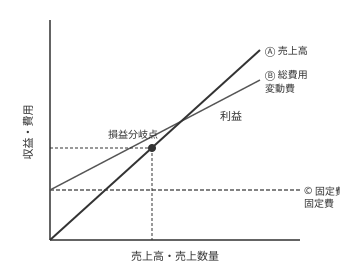

---

損益分岐点売上高 ＝ 変動費 ＋ 固定費 ＝ 変動費率 × 販売数量 ＋ 固定費

なお、**変動費**とは、売上高や販売数量などの増減に応じて比例的に変化する費用で、具体的には材料費、外注費、販売手数料などがあります。また、**固定費**は、売上高や販売数量などの増減に関係なく総額で一定期間変化なく発生する費用で、家賃、人件費、リース料、水道光熱費などがあります。

損益分岐点分析を行うために重要となるのが、限界利益になります。限界利益は次の式で表せます。

> **限界利益 ＝ 売上 − 変動費 ＝ 固定費 ＋ 利益**

これを図で表したものが**図表1.7** になります。

---

**図表 1.7　売上高と限界利益**

| | 変動費 | 変動費 |
|:---:|:---:|:---:|
| **売上高** | **限界利益** | 固定費 |
| | | 利益 |

---

図表1.6のグラフを見るとわかるとおり、固定費が増加したり変動費率が上がった場合、および販売単価を下げたりした場合は、損益分岐点はグラフの右側に移動します。

### （5）マテリアルフローコスト会計（MFCA）

**マテリアルフローコスト会計**は、製造プロセスにおいて、製品を製造するために要したマテリアル（原材料、副資材、エネルギー等）のうち、ロスとなったマテリアルを無駄なコストとして算出する会計手法です。算出されたコストを「負の製品コスト」として明確化し、経営者に対して廃棄物削減を動機付ける点にマテリアルフローコスト会計の特徴があります。

---

## 5. 財務会計

前項で示したとおり、企業会計は、財務会計と管理会計に大別されます。**財務会計**とは、企業などの組織が株主や債権者、関係官庁などの外部利害関係者に財務情報を提供するためのものです。

### （1）財務諸表

**財務諸表**とは、投資家などの企業外部の利害関係者に、企業の財政状況などに関する情報を開示するために定期的に作成される書類で、具体的には、貸借対照表、損益計算書、キャッシュ・フロー計算書、利益処分計算書などがあります。

財務諸表は、**企業会計原則**に基づいて作成されるべきとされていますが、企業会計原則の一般原則は次のように定められています。

> **企業会計原則　一般原則**
> 1. **真実性の原則**：企業会計は、企業の財政状態及び経営成績に関して、真実な報告を提供するものでなければならない。
> 2. **正規の簿記の原則**：企業会計は、すべての取引につき、正規の簿記の原則に従って、正確な会計帳簿を作成しなければならない。
> 3. **資本利益区別の原則**：資本取引と損益取引とを明瞭に区別し、特に資本剰余金と利益剰余金とを混同してはならない。
> 4. **明瞭性の原則**：企業会計は、財務諸表によって、利害関係者に対し必要な会計事実を明瞭に表示し、企業の状況に関する判断を誤らせないようにしなければならない。
> 5. **継続性の原則**：企業会計は、その処理の原則及び手続を毎期継続して適用し、みだりにこれを変更してはならない。
> 6. **保守主義の原則**：企業の財政に不利な影響を及ぼす可能性がある場合には、これに備えて適当に健全な会計処理をしなければならない。
> 7. **単一性の原則**：株主総会提出のため、信用目的のため、租税目的のため等種々の目的のために異なる形式の財務諸表を作成する必要がある場合は、それらの内容は、信頼しうる会計記録に基づいて作成されたものであって、政策の考慮のために事実の真実な表示をゆがめてはならない。

### （2）貸借対照表（B/S）

**貸借対照表**（B/S）は、一定時点（通常は決算日）における資産、負債、資本の財政状態を表すもので、組織の健全性を分析する基礎資料となるものです。貸借対照表はバランスシート（B/S）ともいい、**図表1.8** に示すように、借方と貸方を一致させるように作成します。

---

**図表 1.8　貸借対照表**

| **借方** | **貸方** |
|:---:|:---:|
| **資産** | **負債** |
| 流動資産① | 流動負債⑤ |
| 固定資産 | 固定負債⑥ |
| 　有形固定資産② | **純資産（資本）** |
| 　無形固定資産③ | 株主資本 |
| 　投資その他の資産④ | その他の包括利益累計額 |
| 繰延資産 | 新株予約権 |

---

以上のうち、①〜⑥の具体例を下記に示します。

1. **流動資産**：現金及び預金、受取手形及び売掛金、リース債権及びリース投資資産、有価証券、商品及び製品、仕掛品、原材料及び貯蔵品、繰延税金資産など
2. **有形固定資産**：建物及び構築物、機械装置及び運搬具、土地、リース資産、建設仮勘定など。なお、「建物及び構築物」の中には**減価償却費**が含まれますが、減価償却費は費用でありながら支出を伴わないため、その分が内部に留保される効果が生じます。
3. **無形固定資産**：のれん、リース資産など
4. **投資その他の資産**：投資有価証券、長期貸付金、退職給付に係る資産、繰延税金資産など
5. **流動負債**：支払手形及び買掛金、短期借入金、リース債務、未払法人税等、繰延税金負債、資産除去債務など
6. **固定負債**：社債、長期借入金、リース債務、繰延税金負債、退職給付に係る負債、資産除去債務など

### （3）損益計算書（P/L）

**損益計算書**（P/L）は、一定期間（通常は1年の会計期間）における収益、費用、利益の内容を、経営成績として明らかにするもので、**図表1.9** の項目を公表します。

---

**図表 1.9　損益計算書**

| 項目 | 備考 |
|:---|:---|
| 売上高 | 1年間でどのくらい売ったか |
| 売上原価 | 材料や仕入れなどに使った費用 |
| 売上総利益 | 粗利＝売上高−売上原価 |
| 販売費及び一般管理費 | 広告宣伝費や営業人件費など |
| 営業利益 | 売上総利益から販売費を引いた利益 |
| 営業外収益 | 本業以外で得た利益 |
| 営業外費用 | 本業以外にかかった費用 |
| 経常利益 | 営業利益に営業外の損益を足し引きした利益 |
| 特別利益 | 想定外の一時的な利益 |
| 特別損失 | 想定外の一時的な損失 |
| 税引前当期純利益 | 経常利益に想定外の損益を足し引きした利益 |
| 法人税等 | 納税額 |
| 当期純利益 | 税引き前当期純利益から税金を引いて残った利益 |

---

### （4）キャッシュ・フロー計算書（C/F）

**キャッシュ・フロー計算書**（C/F）とは、企業の会計期間におけるキャッシュ・インフロー（収入）とキャッシュ・アウトフロー（支出）が、営業活動、投資活動、財務活動に区分して記載される計算書で、**図表1.10** に示す項目を公表します。

---

**図表 1.10　キャッシュ・フロー計算書**

| 項目 | 備考 |
|:---|:---|
| 営業キャッシュ・フロー（営業活動によるキャッシュ・フロー） | 本業によって上がってくるキャッシュ（営業収入、減価償却費※1、原材料費等の支出、人件費の支出など） |
| 投資キャッシュ・フロー（投資活動によるキャッシュ・フロー） | 設備や有価証券への投資や売却により増減するキャッシュ（有価証券の取得支出・売却収入、有形固定資産の取得支出・売却収入、投資有価証券取得支出・売却収入など） |
| 財務キャッシュ・フロー（財務活動によるキャッシュ・フロー） | 借金や返済によって増減するキャッシュ（短期借入の収入・返済支出、長期借入の収入・返済支出、社債発行収入・債還支出など） |
| 現金及び現金同等物に関わる換算差額 | 為替による差損益 |
| 現金及び現金同等物の増減額 | 1年間で現金が全体でどれだけ増減したか |
| 現金及び現金同等物の期首残高 | 1年前の現金の額 |
| 現金及び現金同等物の期末残高 | 1年たった後の現金の額 |

※1：減価償却費は、「非現金支出費用」であるため、利益に加え戻されて記載される。

---

なお、自由に使える現金がどれだけあるかを示す指標として**フリー・キャッシュ・フロー**があります。

> フリー・キャッシュ・フロー  
> ＝「営業キャッシュ・フロー」＋「投資キャッシュ・フロー」  
> 注：製造業などで固定資産の投資が多い場合には、「投資キャッシュ・フロー」がマイナス値となります。

なお、キャッシュ・フローの増減の考え方は**図表1.11** のとおりです。

---

**図表 1.11　キャッシュ・フローの増減**

| 項目 | 増減項目 |
|:---|:---|
| 営業キャッシュ・フロー | 売上債権の増加（−）、減少（＋）、棚卸資産の増加（−）、減少（＋）、購入債務の増加（＋）、減少（−） |
| 投資キャッシュ・フロー | 固定資産の増加（−）、減少（＋）、有価証券の増加（＋）、減少（−） |
| 財務キャッシュ・フロー | 長期借入金の増加（＋）、減少（−）、増資（＋）、自社株買い（−）、配当金支払い（−） |

---

## 6. 設備管理

設備やシステムの故障率は、その設備やシステムを使用した時間によっても変化していきますので、時期に合わせた設備管理が求められます。一般的に、機器やシステムは導入初期に高い故障率を示しますので、その期間を**初期故障期**と呼んでいます。その期間を過ぎると、故障率はある一定値以下に収まりますので、その期間を**偶発故障期**と呼んでいます。さらに、機器やシステムが長く使われた後には、劣化によって再び故障率が増加していきます。その期間を**摩耗故障期**と呼んでいます。そのような現象を図で表すと、**図表1.12** のようになりますが、その形状から、この現象を**バスタブカーブ**と呼んでいます。

---

**図表 1.12　バスタブカーブ**

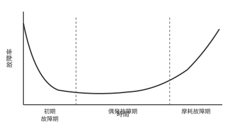

---

設備やシステムにおいては、その保全が事故や故障の予防に大きな効果をもたらします。保全の役割は基本的に2つあり、最初が、設備やシステムの機能を適切に維持する役割で、次が、システムに発生した故障や欠陥を修復するという役割になります。

### （1）設備管理

設備管理を行う際には設備総合効率を用います。**設備総合効率**については、JIS Z8141 で言葉の定義がなされており、「設備の使用効率の度合いを表す指標」と示されており、次の式を用います。

> **設備総合効率 ＝ 時間稼働率 × 性能稼働率 × 良品率**

設備総合効率を上げるには、次のような方策があります。

1. 設備故障から復旧までの時間を減らすなどして設備の停止時間を減らして時間稼働率を上げる。
2. 稼働時間内の加工数を増やすなどして性能稼働率を上げる。
3. 不適合品の発生数を減らすなどして良品率を上げる。

### （2）設備計画

**設備計画**は、経営戦略の一環として、事業計画に基づいて策定されるものです。設備計画において策定される設備計画を目的別に分類すると、下記の4つになります。

1. 老朽化した設備を取り替える取替投資
2. 生産能力の拡大を図る拡張投資
3. 原価引き下げや性能アップを図る製品投資
4. リスク減少投資や厚生投資などの戦略的投資

設備計画の経済性手法としては、「資金回収期間法」、「原価比較法」、「投資利益率法」がありますが、異なる時点での資金の収支を比較する必要があるため、等価換算して計算をする必要があります。

### （3）設備保全

保全については、JIS Z 8141 で言葉の定義がなされており、「故障の排除及び設備を正常・良好な状態に保つ活動の総称」と示されています。その備考に、保全活動を分類すると、**図表1.13** のようになると説明されています。

---

**図表 1.13　JIS Z 8141 に示された保全活動の体系**

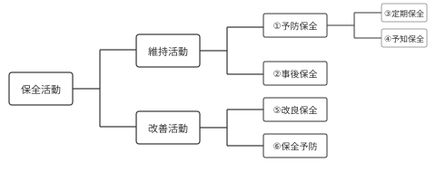

---

また、それぞれの保全活動の意味は次のように説明されています。

1. **予防保全**：故障に至る前に寿命を推定して、故障を未然に防止する方式の保全
2. **事後保全**：設備に故障が発見された段階でその故障を取り除く方式の保全
3. **定期保全**：従来の故障記録、保全記録の評価から周期を決め、周期ごとに行う保全方式
4. **予知保全**：設備の劣化傾向を設備診断技術などによって管理し、故障に至る前の最適な時期に最善の対策を行う予防保全の方式
5. **改良保全**：故障が起こりにくい設備への改善、又は性能向上を目的とした保全活動
6. **保全予防**：設備、系、ユニット、アッセンブリ、部品などについて、計画・設計段階から過去の保全実績は情報を用いて不良や故障に関する事項を予知・予測し、これらを排除するための対策を織り込む活動

また、これら以外に、JIS Z 8141 および JIS Z 8115 では、次のような保全も示されています。

- ⓐ **日常保全**：設備の性能劣化を防止する機能を担った日常的な活動。劣化進行速度をゆるやかにするための日常的な諸活動の総称（JIS Z 8141）
- ⓑ **経時保全**：アイテムが予定の累積動作時間に達したとき、行う予防保全（JIS Z 8115）
- ⓒ **状態監視保全**：状態監視に基づく予防保全（JIS Z 8115）
- ⓓ **時間計画保全**：定められた時間計画に従って遂行される予防保全（JIS Z 8115）

なお、事後保全においては、次のような対応の方法があります。

- Ⓐ **緊急保全**：重要な設備やシステムで、通常は予防保全で故障が発生しないように注意しているものが、突発的に故障した際に直ちに行う保全
- Ⓑ **通常事後保全**：仮に故障しても代替機などが用意されていて、代替できる設備やシステムに対して、故障後に行う保全

---

## 7. 計画・管理の数理的手法

計画・管理においては、さまざまな手法が用いられますので、その中からいくつかを紹介します。

### （1）シミュレーション

現実の問題では、不確定要素が含まれる場合が多くありますので、そのまま検討しようとするとコストや時間がかかってしまいます。その場合に用いられるのが、コンピュータを使って模擬的なモデルを再現する**シミュレーション**です。シミュレーションには、微分方程式や差分方程式等で表現されるモデルを扱う**連続型シミュレーション**や、特定のイベントの生起によって引き起こされる、待ち行列タイプ等のモデルを扱う**離散型シミュレーション**などがあります。

シミュレーションにはいろいろな方法がありますが、業務管理で最も一般的に利用されるのが、**モンテカルロ・シミュレーション**です。モンテカルロ・シミュレーションの名称は、モナコの都市モンテカルロに由来しています。その手法は、乱数や物理的にランダムなメカニズムを使った実験によって、数学的な近似解を求めるために行われるコンピュータシミュレーションの1つです。このシミュレーションで精度の高い近似解を求めるには、シミュレーションの試行回数を大幅に増加させなければなりませんので、高速のコンピュータが必要となり、多くの費用がかかるのが欠点となります。しかし、スケジュールのような、それほど高い精度を必要としない事項のシミュレーションを実施するには適した手法です。モンテカルロ・シミュレーションの結果は、**図表1.14** のグラフに示すような、作業が完了する可能性のカーブとして示されます。

---

**図表 1.14　モンテカルロ・シミュレーション結果（例）**

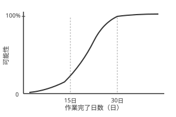

---

### （2）最適化手法

最適化手法として**数理計画法**がありますが、数理計画法は、ある変数に関する目的関数を最大または最小にする最適化の手法です。与えられた条件は制約条件、最大化または最小化すべき関数を目的関数といいます。制約条件が線形不等式または線形等式、目的関数が線形関数である問題を**線形計画問題**といいます。変数が連続的なものは2次元平面上のグラフを描くことにより容易に最適解を求めることができます。一方、テレビや自動車などの製品の生産計画などの場合には、生産量が整数値でなければなりませんので、そういった問題は**整数計画問題**となり、解くのが難しくなります。

また、他の個人の満足を減じることなしには、どの個人の満足を増加することができないような状態を**パレート最適**といいます。複数の目的関数を最大化または最小化するような**多目的最適化**ではパレート最適を考える必要ができます。その場合の最良解の決定は意思決定者の選好によらざるを得なくなります。

### （3）階層化意思決定法（AHP）

**階層化意思決定法**（AHP：Analytic Hierarchy Process）は、階層的な構造を使って代替案の評価を行う手法で、複数の階層の評価要因の重要度係数と評価値を使って代替案を定量的に評価して、意思決定をする手法です。**図表1.15** では、2階層の要因で3つの案を検討する例を示します。

図表1.15 で、W₁、W₂、W₁₁、W₁₂、W₂₁、W₂₂ は重要度係数で、W₁＋W₂＝1、W₁₁＋W₁₂＝1、W₂₁＋W₂₂＝1 でなければなりません。また、A₁、A₂、B₁、B₂、C₁、C₂ などは評価値になります。これらの数字を使って、個々の案の総合評価値を求めます。図表1.15 の例の A 案の総合評価値（Sa）は次の式で求められます。

$$Sa = W_1W_{11}A_1 + W_1W_{12}A_2 + W_2W_{21}A_3 + W_2W_{22}A_4$$

---

**図表 1.15　階層化意思決定法（AHP）**

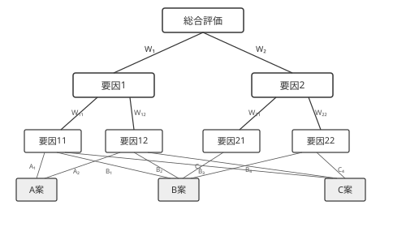

---

この式からわかるとおり、階層化意思決定法は、いくつかの代替案についての複数の評価基準に対して一対比較行列を作成し、その重要度を数値化して最も望ましい代替案を決める手法です。また、複数の人間が連携して意思決定をする場合には、重要度係数を統合したり、評点を相談したりして決めるなどの方法によって、階層化意思決定法を使用することができます。

### （4）問題解決手法

総合技術監理が必要な業務においては、俯瞰的視点から総合的な判断を求められる場面が多くなります。そのため、担当者には問題解決能力が求められますので、問題解決手法に関する知識が必要です。そういった手法のうちから、いくつかを下記に示します。

#### (a) デルファイ法

**デルファイ法**とは収束アンケート法とも呼ばれており、複数の専門家に対して何回か同じテーマについてアンケートを繰り返し行う方法で、最終的に回答が収束していくことを利用した手法です。デルファイ法には匿名性があるため、特定の関係者の影響力が排除できるというメリットを持っています。具体的な手順は次の通りです。

1. 優れた複数の専門家を選び、予測テーマについて個別にアンケートを実施する
2. アンケート結果を集計する
3. その結果を、アンケートに回答してくれた専門家にフィードバックする
4. 再度同じテーマについて、同じ専門家にアンケートを行う

以後、②〜④を繰り返し実施します。この手順を図示すると、**図表1.16** のようになります。

こういったアンケートを繰り返し行う方法で、回答がある方向や特定の事項に収束していくことを利用し、調査事項の予測を行います。デルファイ法は、共同判断型の技術予測として広く用いられており、通常は、3回のアンケートで結果がまとまることが多いといわれています。

---

**図表 1.16　デルファイ法**

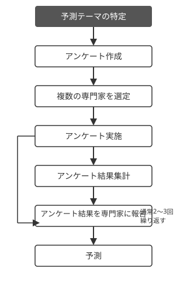

---

#### (b) ブレインストーミング法

**ブレインストーミング法**は、創造性を開発するための集団的思考技術の1つです。あるテーマに対して、グループの参加者がくつろいだ雰囲気の中で自由奔放にアイデアを出し合うことが重要となりますので、下記の4つのルールがあります。

1. 他の人のアイデアを批判しない
2. 自由奔放なアイデアを歓迎する
3. 質よりも多くのアイデアを出す
4. 他人のアイデアを活用して発展させる

具体的なブレインストーミングの手法として、少人数のグループで話し合いながら情報を抽出し、分類・構造化していく、「集団情報構造化法」が広く用いられています。この手法は、問題点を明らかにするというだけではなく、グループメンバーのコミュニケーション能力を高める効果も持っています。

ブレインストーミング法で出されたアイデアを整理していく際に用いられる手法として特性要因図があります。**特性要因図**は、**魚の骨ダイアグラム**とも呼ばれ、各種の要因によって引き起こされる現象を、**図表1.17** のような魚の骨の形状に示し、その結果から要因を分析して判断を行う手法です。

また、ブレインストーミング法で抽出された言語データを、それらの親和性によって統合し、グループに分けて整理・分類する手法として、**図表1.18** に示す**親和図**があります。「親和図」は、混とんとした問題の構造や要因を明らかにして、問題を解決する手法といえます。

---

**図表 1.17　特性要因図例**

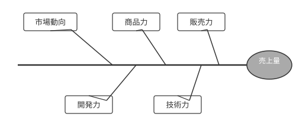

---

**図表 1.18　親和図**

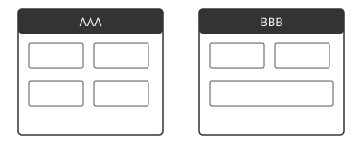

---

#### (c) 過程決定計画図

**過程決定計画図**（PDPC：Process Decision Program Chart）は、問題解決のための手順を有向グラフの形に表したもので、危機的状況に陥ったとき、将来起こり得ると考える重要な局面と、その結果を可能な範囲で想定し、それらの局面や結果が生じる過程を矢印線で示すことによって、要所云々で的確な判断ができるようにあらかじめ準備をするための手法です。過程決定計画図の例を**図表1.19**に示します。

---

**図表 1.19　過程決定計画図例**

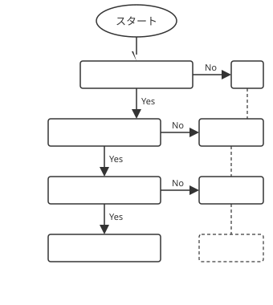

---

#### (d) ゲーム理論

**ゲーム理論**は、意思決定をする主体が複数存在する状況を数学的に取り扱う方法論で、ゲームにおけるプレイヤーの行動様式をモデルにしたものです。ゲーム理論は、想定するプレイヤーの行動様式の違いにより、**非協力ゲーム**と**協力ゲーム**とに大きく分けることができます。非協力ゲームは、プレイヤー間の話し合いがなくそれぞれ独立に戦略を決定するか、話し合いがあったとしても拘束力がない状態を扱うものです。一方、協力ゲームは、プレイヤー間に話し合いがあることが前提で、話し合いで得られた合意に拘束力がある状態を扱います。

#### (e) VE（バリューエンジニアリング）

**VE**（Value Engineering）とは、製品やサービスの価値を、果たすべき機能とそれにかけるコストの関係で把握して価値の向上を図る手法をいいますので、VEにおける価値は、「価値＝機能÷コスト」というモデルで表現されます。VEにおける機能は、使用機能（効果、性能など）と魅力機能（デザイン、色彩など）に分類することができ、機能は一般に、その働きは何かであるので、「…を…する」（照明機能例：部屋を明るくする）という表現で定義されます。なお、VEの基本ステップは、**機能定義→機能評価→代替案作成**となります。
