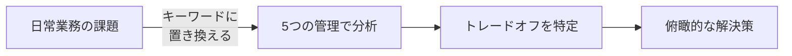
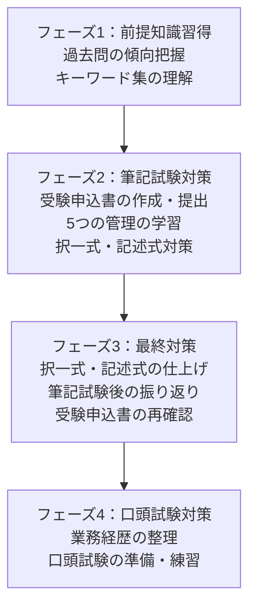
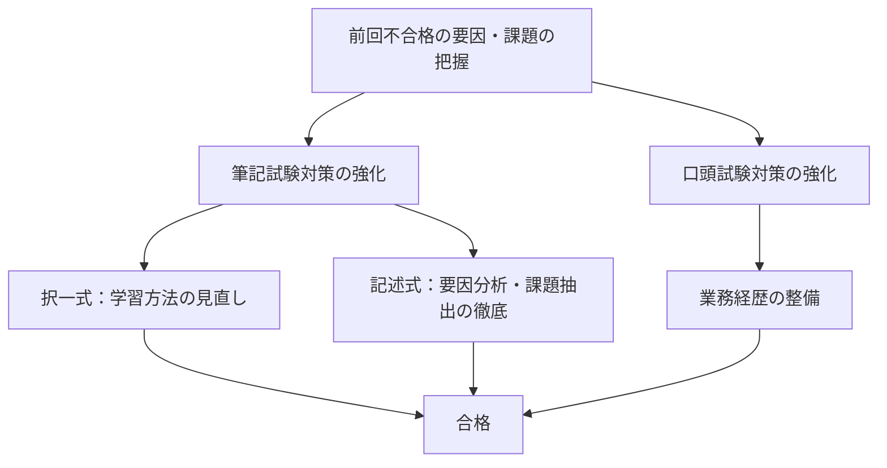

# 総合技術監理部門 合格戦略

総監試験の合格率は一般部門より低く、一般部門と同じ感覚で臨むと苦戦する受験者が多い。本記事では、総監特有の「トレードオフ思考」の具体像と、合格者が実践する学習戦略を整理する。

総監の基本概念（5つの管理技術・試験構成）については[試験ガイド](/docs/pe-comprehensive-management-exam-index)を参照。

## トレードオフの具体像

総監の本質は、5つの管理間で発生するトレードオフを俯瞰的に把握し、総合的に判断・調整する能力にある。択一式でも記述式でも、この視点が繰り返し問われる。

以下は、管理間の対立が生じる典型的な場面である。

| 対立の場面 | 一方の管理 | 他方の管理 |
|:---|:---|:---|
| 土木工事の安全設備 | **経済性管理**: コスト重視・工期厳守 | **安全管理**: 安全性の確保 |
| 情報漏洩とベテラン活用 | **人的資源管理**: ベテランに任せたい | **情報管理**: 情報セキュリティの確保 |
| エネルギーの安定供給 | **社会環境管理**: 環境負荷の低減 | **経済性管理**: エネルギーの安定供給 |

### 5管理間トレードオフのマトリクス

5つの管理のあらゆる組み合わせでトレードオフが発生しうる。以下のマトリクスは、各管理間で生じる典型的な対立構造を示す。

| | 人的資源管理 | 情報管理 | 安全管理 | 社会環境管理 |
|:---|:---|:---|:---|:---|
| **経済性管理** | 能力向上の仕組みを作るとコストアップ | 情報基盤整備でコストアップ | 安全確保しようとするとコストアップ | 環境負荷抑制を行うにはコストアップ |
| **人的資源管理** | — | 情報管理の仕組み導入でモチベーションに影響 | 安全確保を万全にすると若手の経験機会が失われる | 環境負荷抑制を万全にすると若手の経験機会が失われる |
| **情報管理** | — | — | 安全確保を万全にすると情報量が増大し管理が困難 | 環境状況把握に必要な情報量が増大 |
| **安全管理** | — | — | — | 環境負荷抑制と安全確保が相反する場面がある |

### トレードオフ改善の考え方

業務全体を見渡した俯瞰的な把握・分析に基づき、複数の要求事項を総合的に判断し、管理間のトレードオフを改善する。

たとえば、経済性管理と安全管理のトレードオフでは、**情報管理を活用**して現場調査を行い、費用対効果の高い安全機器を採用するといったアプローチが考えられる。ある管理間の対立を、第三の管理の視点から解決する——これが総監の記述式で求められる思考パターンである。

## 一般部門との違い

総監受験者の多くは一般部門の合格者だが、試験の性質が根本的に異なる。最大の違いは、一般部門には対応する学協会・白書があるのに対し、総監は**キーワード集が唯一の公式情報源**である点にある。

| | 総監部門 | 一般部門 |
|:---|:---|:---|
| **学協会** | なし | あり |
| **白書** | なし（関係省庁HPが情報源） | あり |
| **出題の視点** | 5管理の統合・トレードオフの調整 | 専門技術による問題解決 |
| **筆記試験** | 択一式40問 + 記述式600字×5枚 | 選択科目3問（600字×計8枚） |

<Callout type="tip" title="一般部門からの切り替えポイント">
一般部門では「専門技術の深さ」が問われるが、総監では「管理技術の広さと統合力」が問われる。専門的に正しい解決策でも、他の管理への影響を考慮していなければ総監では不十分とみなされる。
</Callout>

## 択一式と記述式のバランス

筆記試験は択一式・記述式の合計で60%以上の得点が必要である。どちらかに偏った対策ではリスクが高い。

- **パターン1（理想）**: 択一式60% + 記述式60% → 合計60% → 合格
- **パターン2（記述式偏重）**: 択一式45% + 記述式75% → 合計60% → 合格可能だが稀
- **パターン3（択一式偏重）**: 択一式75% + 記述式45% → 合計60%でも、口頭試験で記述内容を深く問われるリスクが高い

択一式が60%を大きく下回っての合格は稀であり、**バランスよく対策すること**が合格への最短経路となる。

## 日常業務での実践

試験対策は机上の学習だけでは不十分である。日常業務において5つの管理間のトレードオフの発生に注目し、解決策を意識することが記述式対策に直結する。

具体的には、キーワード集の用語を日常業務の内容に当てはめてみることで、記述式問題で求められる「総監の視点による分析・提言」の練習になる。

## 4フェーズ学習計画

受験申込から合格発表まで約1年間。合格者は、この期間をフェーズに分けてメリハリをつけている。

1. **フェーズ1（前提知識習得）** — 過去問の傾向を把握し、キーワード集を通読する。総監の全体像を掴む段階
2. **フェーズ2（筆記試験対策）** — 受験申込書を作成しつつ、5つの管理の学習を本格化。択一式・記述式の両方を並行して対策する
3. **フェーズ3（最終対策）** — 筆記試験直前の仕上げ。試験後は受験申込書を再確認し、口頭試験に備える
4. **フェーズ4（口頭試験対策）** — 業務経歴を総監の視点で整理し、口頭試験の練習を行う

## 再受験対策

総監の合格率は低く、再受験者も多い。再受験する場合は、前回の不合格要因を自己分析し、課題を抽出することが最も重要である。

特に記述式の評価（B・C判定）について、要因分析と課題抽出を行い、対策を明確にする。

- **択一式が不十分だった場合** — 学習方法の見直し、社会動向への関心を高める
- **記述式が不十分だった場合** — 過去問での解答練習、トレードオフの分析・提言の練習を強化
- **口頭試験で不合格だった場合** — 業務経歴を総監の視点で整備し直す

