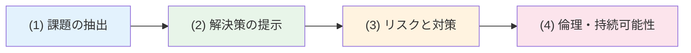
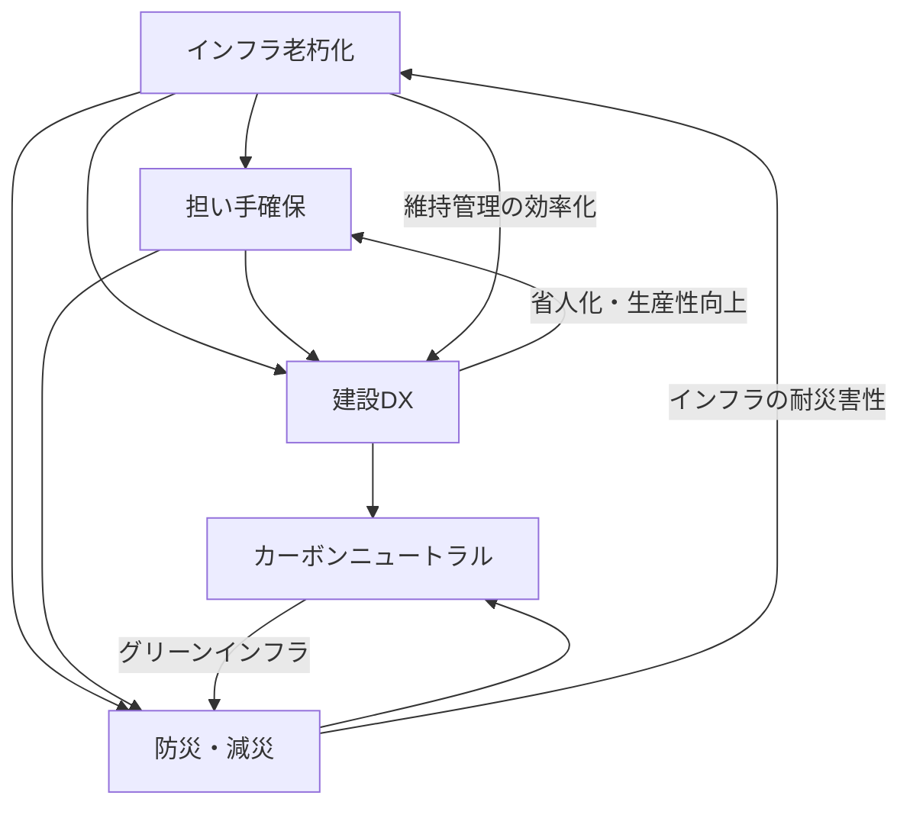

# 技術士二次試験 建設部門 記述対策の基本

## 1. 二次試験の概要

### 1.1 技術士二次試験とは

技術士二次試験は、技術士法に基づく国家試験であり、科学技術に関する高度な専門的応用能力を有するかどうかを判定するために行われる。建設部門は最も受験者数が多い部門であり、社会資本整備に携わる技術者にとって重要な資格である。

2019年度（令和元年度）の試験制度改正により、択一式が廃止され **全問記述式** に回帰した。これにより、技術的知識だけでなく、**課題を多面的に分析し、論理的に記述する力** が合否を左右するようになった。

### 1.2 受験資格

技術士二次試験を受験するには、以下のいずれかの要件を満たす必要がある。

| 区分 | 要件 |
|---|---|
| 技術士補として | 技術士補として、指導技術士の下で **4年** を超える実務経験 |
| 修習技術者として（指導者あり） | 修習技術者として、指導者の下で **4年** を超える実務経験 |
| 修習技術者として（指導者なし） | 修習技術者として **7年** を超える実務経験 |

:::note[修習技術者とは]
技術士第一次試験の合格者、または指定された教育課程（JABEE認定課程）の修了者のことをいう。
:::

### 1.3 試験の構成

二次試験は **筆記試験** と **口頭試験** の2段階で構成される。筆記試験に合格した者のみが口頭試験に進む。

#### 筆記試験の科目構成

| 科目 | 問題 | 試験時間 | 配点 | 内容 |
|---|---|:---:|:---:|---|
| **必須科目** | 問題I | 2時間 | 40点 | 建設部門全般にわたる専門知識、応用能力、問題解決能力、課題遂行能力 |
| **選択科目** | 問題II-1 | 3時間30分 | 20点 | 選択科目に関する専門知識 |
| | 問題II-2 | （II-1と合算） | 20点 | 選択科目に関する応用能力 |
| | 問題III | （II-1と合算） | 20点 | 選択科目に関する問題解決能力、課題遂行能力 |

:::tip[合格基準]
各科目で **60%以上** の得点が必要。必須科目・選択科目のいずれかが60%未満であれば不合格となる。
:::

#### 建設部門の選択科目（11科目）

建設部門では、以下の11科目から1科目を選択する。

1. 土質及び基礎
2. 鋼構造及びコンクリート
3. 都市及び地方計画
4. 河川、砂防及び海岸・海洋
5. 港湾及び空港
6. 電力土木
7. 道路
8. 鉄道
9. トンネル
10. 施工計画、施工設備及び積算
11. 建設環境

### 1.4 合格率の推移

建設部門の筆記試験合格率は概ね **10〜15%** 程度で推移しており、全21部門の中でも難関とされている。口頭試験の合格率は **80〜90%** 程度であるが、筆記試験合格者のみが対象であるため油断はできない。

:::caution[筆記試験が最大の関門]
二次試験全体の最終合格率は **10%前後** であり、筆記試験をいかに突破するかが合格の鍵となる。
:::

---

## 2. 必須科目（問題I）の構成と書き方

### 2.1 必須科目の全体像

必須科目は、**建設部門全般** に関わるテーマについて、600字詰め答案用紙 **3枚** 以内で記述する。問題文は1つのテーマに対して、(1)〜(4) の **4つの設問** で構成されている。

この4問構成は、技術士に求められるコンピテンシーを順序立てて問う形式となっており、以下のような流れで回答する。

### 2.2 設問(1)：多面的な課題の抽出

#### 問われていること

与えられたテーマに対し、技術者としての立場で **多面的な観点から3つ程度の課題** を抽出し、それぞれの観点を明記したうえで、課題の内容を述べる。

#### 書き方のポイント

1. **観点を明確に分ける**
   - 「技術面」「社会面」「制度面」のように、異なる切り口で課題を整理する
   - 同じ観点から複数の課題を挙げると「多面的」と評価されにくい
   - 例：「安全性の観点」「経済性の観点」「環境・持続可能性の観点」

2. **課題と問題点を区別する**
   - 「問題点」= 現状の困りごと（例：橋梁の老朽化が進行している）
   - 「課題」= 問題点を解決するために取り組むべきこと（例：予防保全型メンテナンスへの転換）
   - 設問で求められているのは **課題** であり、問題点の羅列にならないよう注意する

3. **番号と見出しを付ける**
   - 「課題1：○○の観点から△△」のように番号付きの見出しを設け、採点者が構造を把握しやすくする

:::tip[答案用紙の配分目安]
設問(1) は 600字詰め答案用紙 **約1枚**（600字程度）が目安。3つの課題をそれぞれ150〜200字で簡潔にまとめる。
:::

### 2.3 設問(2)：最重要課題の解決策

#### 問われていること

設問(1) で挙げた課題のうち、**最も重要と考える課題を1つ選び**、その理由を述べたうえで、**複数の解決策** を具体的に示す。

#### 書き方のポイント

1. **最重要とする理由を明記する**
   - 「○○が最も重要と考える。なぜなら〜」と、選定理由を1〜2文で簡潔に述べる
   - 他の課題との比較で重要性を示すと説得力が増す

2. **解決策は3つ程度を具体的に**
   - 各解決策に見出しを付け、内容を具体的に記述する
   - 抽象的な方向性だけでなく、**具体的な技術や手法の名称** を挙げる
   - 例：「ICT施工の活用」→「3Dマシンコントロール技術を導入し、丁張の省略と施工精度の向上を図る」

3. **専門知識を示す**
   - 技術士としての高度な専門性を示すために、最新の技術動向や国の施策との関連を盛り込む

:::tip[答案用紙の配分目安]
設問(2) は答案用紙 **約1枚**（600字程度）。最重要課題の選定理由に100字程度、解決策3つにそれぞれ150〜170字程度を配分する。
:::

### 2.4 設問(3)：リスクと対策

#### 問われていること

設問(2) で示した解決策を実行する際に生じうる **リスク（波及効果・懸念事項）** と、それへの **対策** を述べる。

#### 書き方のポイント

1. **解決策に起因するリスクを挙げる**
   - 解決策とは無関係なリスク（例：地震や台風）ではなく、**解決策を実行したからこそ生じるリスク** を考える
   - 例：「ICT施工を導入すると → 初期投資が大きく中小企業の参入が困難になる」

2. **リスクと対策をセットで記述する**
   - リスクを1〜2つ挙げ、それぞれに対策を具体的に述べる
   - 対策は実現可能なものとし、技術的な裏付けがあることが望ましい

3. **新たなリスクの連鎖に注意する**
   - 対策を講じた結果、さらなるリスクが生じる場合は、その点にも言及すると高評価につながる

:::tip[答案用紙の配分目安]
設問(3) は答案用紙 **半分程度**（300字程度）。リスク・対策を1〜2セット記述する。
:::

### 2.5 設問(4)：技術者倫理と持続可能性

#### 問われていること

上記の業務遂行にあたり、**技術者としての倫理** や **社会の持続可能性** の観点から、どのように行動すべきかを述べる。

#### 書き方のポイント

1. **技術者倫理の3原則を意識する**
   - **公衆の安全・健康・福利の最優先**（最重要）
   - **持続可能性の確保**
   - **技術者としての信用保持**（公正・誠実な行動）

2. **具体的な行動に落とし込む**
   - 「倫理を遵守する」だけでは不十分
   - 例：「技術的な不確実性がある場合、関係者に対してリスク情報を開示し、意思決定に必要な判断材料を提供する」
   - 例：「短期的なコスト削減よりも長期的なインフラの安全性を優先し、ライフサイクルコストの観点から最適解を提案する」

3. **持続可能性との関連を示す**
   - SDGsやカーボンニュートラルへの貢献について触れる
   - 将来世代のインフラ利用を考慮した提言を行う

:::tip[答案用紙の配分目安]
設問(4) は答案用紙 **半分程度**（300字程度）。倫理と持続可能性のそれぞれについて150字程度で記述する。
:::

### 2.6 設問配分のまとめ

600字詰め答案用紙3枚（合計1,800字）の配分目安を以下に示す。

| 設問 | 内容 | 目安字数 | 用紙枚数 |
|:---:|---|:---:|:---:|
| (1) | 多面的な課題の抽出（3つ） | 約600字 | 約1枚 |
| (2) | 最重要課題と解決策（3つ） | 約600字 | 約1枚 |
| (3) | リスクと対策 | 約300字 | 約半枚 |
| (4) | 技術者倫理・持続可能性 | 約300字 | 約半枚 |
| | **合計** | **約1,800字** | **3枚** |

:::caution[用紙を埋める]
答案用紙は **最低でも各枚の6割以上** を埋めること。空白が多いと、知識・能力が不十分と判断される可能性がある。3枚目は最後まで書き切ることを目標とする。
:::

---

## 3. 選択科目（問題II・III）の対策

### 3.1 問題II-1：専門知識を問う問題

#### 出題形式

選択科目に関する専門知識を問う問題。4問中 **1問を選択** し、600字詰め答案用紙 **1枚** 以内で解答する。

#### 対策のポイント

- 選択科目の **基本的な技術用語や概念** を正確に説明できるようにする
- 最新の技術基準・指針の改定内容を把握する
- **定義→特徴→適用場面→留意点** の順で構成すると、漏れなく記述できる

:::note[問題II-1 の構成例]
「○○について、その概要と特徴を述べ、適用にあたっての留意点を説明せよ。」
→ 600字で①概要（150字）、②特徴（200字）、③留意点（250字）程度に配分する。
:::

### 3.2 問題II-2：応用能力を問う問題

#### 出題形式

選択科目に関する応用能力を問う問題。2問中 **1問を選択** し、600字詰め答案用紙 **2枚** 以内で解答する。実務的な状況設定のもと、業務手順や留意点を問われることが多い。

#### 対策のポイント

- **業務の手順を論理的に示す**：調査→計画→設計→施工→維持管理の流れを意識する
- **関係者との調整** を含める：発注者・施工者・住民・関係機関との連携について触れる
- **具体的な数値や基準** を引用して専門性を示す

### 3.3 問題III：問題解決能力を問う問題

#### 出題形式

選択科目に関する課題に対して、問題解決能力と課題遂行能力を問う問題。2問中 **1問を選択** し、600字詰め答案用紙 **3枚** 以内で解答する。

問題IIIの設問構成は **必須科目（問題I）と類似** しており、多面的な課題抽出→解決策→リスク→倫理の流れで出題されることが多い。

#### 対策のポイント

- 必須科目と同じ4問構成のフレームワークを適用する
- ただし、**選択科目の専門性に特化した内容** を求められる点が異なる
- 建設部門全体のマクロな視点（必須科目）と、選択科目固有のミクロな視点（問題III）を使い分ける

### 3.4 選択科目の配分まとめ

| 問題 | 内容 | 用紙枚数 | 選択 |
|---|---|:---:|:---:|
| II-1 | 専門知識 | 1枚 | 4問中1問 |
| II-2 | 応用能力 | 2枚 | 2問中1問 |
| III | 問題解決能力 | 3枚 | 2問中1問 |

---

## 4. 答案作成のコツ

### 4.1 論文構成の基本原則

#### PREP法を意識する

記述式の答案では、結論を先に述べ、理由・具体例で補強する **PREP法** が有効である。

| 要素 | 内容 | 例 |
|---|---|---|
| **P**oint（結論） | 最も伝えたいことを先に述べる | 「最も重要な課題は○○である」 |
| **R**eason（理由） | なぜそう考えるかを説明する | 「なぜなら△△だからである」 |
| **E**xample（具体例） | 具体的な技術や事例を示す | 「例えば□□技術を活用し〜」 |
| **P**oint（結論の再確認） | 結論を再度まとめる | 「以上より○○が最優先である」 |

#### 見出しと番号を活用する

- 見出しや番号を使って答案を構造化する
- 採点者は大量の答案を短時間で読むため、**一目で構造がわかる答案** が高評価につながる
- 例：「1. ○○の観点」「(1) △△」「① □□」のように階層を使い分ける

### 4.2 600字答案用紙の使い方

600字詰め答案用紙（24字×25行）を効果的に使うための実践的なポイントを示す。

1. **改行と段落を適切に使う**
   - 項目が変わるたびに改行する
   - ただし、空行を入れすぎると文字数が不足する

2. **1文を短くする**
   - 1文は40〜60字程度を目安とする
   - 長文は読みにくく、論旨が不明確になりやすい

3. **具体的な技術名称を入れる**
   - 抽象的な表現にとどめず、固有の技術名や基準名を記述する
   - 「新技術を活用する」ではなく「BIM/CIMを活用して三次元モデルによる施工シミュレーションを行う」

4. **枚数の9割以上を埋める**
   - 指定枚数に対して空白が多いと減点対象となる可能性がある
   - 3枚指定であれば、最低でも2枚半以上を埋めることを目標とする

### 4.3 時間配分の目安

#### 必須科目（問題I）：2時間

| 作業 | 時間 | 内容 |
|---|:---:|---|
| 問題文の読解・構成検討 | 15分 | テーマの把握、課題の洗い出し、答案構成の骨子作成 |
| 設問(1) 記述 | 30分 | 3つの課題を記述 |
| 設問(2) 記述 | 30分 | 解決策を記述 |
| 設問(3)(4) 記述 | 30分 | リスク・倫理を記述 |
| 見直し | 15分 | 誤字脱字、論理の一貫性を確認 |

#### 選択科目（問題II + III）：3時間30分

| 作業 | 時間 | 内容 |
|---|:---:|---|
| 問題選択・構成検討 | 20分 | 3問分の問題選択と骨子作成 |
| II-1 記述 | 30分 | 1枚分の記述 |
| II-2 記述 | 50分 | 2枚分の記述 |
| III 記述 | 70分 | 3枚分の記述 |
| 見直し | 20分 | 全体の整合性確認 |

---

## 5. 近年の出題テーマ傾向

### 5.1 必須科目の主要テーマ

2019年度以降の必須科目では、国土交通白書や社会資本整備重点計画で取り上げられるテーマが繰り返し出題されている。主要テーマは以下の5つに大別できる。

#### (1) インフラ老朽化と維持管理

高度経済成長期に集中的に整備された社会資本が一斉に老朽化を迎える中、**予防保全型メンテナンス** への転換が求められている。

- キーワード：予防保全、事後保全からの転換、アセットマネジメント、長寿命化計画、定期点検、新技術を活用した点検・診断

#### (2) 防災・減災と国土強靱化

気候変動に伴う水災害の激甚化・頻発化を背景に、**流域治水** の推進やインフラの耐災害性向上が重要テーマとなっている。

- キーワード：流域治水、国土強靱化基本計画、気候変動適応策、事前防災、BCP（事業継続計画）、複合災害

#### (3) 建設DX（デジタルトランスフォーメーション）

建設現場の生産性向上を目的とした **i-Construction** の推進と、デジタル技術の活用が問われている。

- キーワード：i-Construction、BIM/CIM、ICT施工、3Dマシンコントロール、ドローン測量、遠隔臨場、デジタルツイン

#### (4) 担い手確保と働き方改革

建設業の就業者数の減少と高齢化が進行する中、**担い手の確保・育成** と **働き方改革** が喫緊の課題となっている。

- キーワード：週休2日制、工期の適正化、適正な賃金水準、建設キャリアアップシステム（CCUS）、女性・若年者の入職促進、技能労働者の処遇改善

#### (5) カーボンニュートラルと環境配慮

2050年カーボンニュートラルの実現に向けて、建設分野における **脱炭素化** の取組が求められている。

- キーワード：グリーンインフラ、再生可能エネルギー、低炭素型コンクリート、省CO2施工、建設副産物のリサイクル、Eco-DRR

### 5.2 テーマ間の関連性

上記の5つのテーマは独立しているわけではなく、相互に関連している。出題では複数のテーマが組み合わされることも多い。

### 5.3 答案での活用法

これらのテーマに対して、以下の準備をしておくことが有効である。

1. **各テーマについて3つの課題を準備する** — 設問(1) で多面的な課題を即座に挙げられるようにする
2. **各課題に対する解決策を3つ準備する** — 設問(2) で具体的な技術名称を含む解決策を記述できるようにする
3. **解決策に伴うリスクを想定する** — 設問(3) で的確なリスク分析ができるようにする
4. **テーマ間の関連を把握する** — 複合テーマの出題にも対応できるようにする

:::tip[効果的な学習方法]
国土交通白書、社会資本整備重点計画、インフラ長寿命化基本計画などの政策文書から、上記テーマに関連するキーワードと数値目標を整理しておくと、答案に説得力が生まれる。
:::

---

## 6. 関連コンテンツ

本サイト内の以下のページが、技術士二次試験の学習に役立つ。

### 施工管理の基礎知識

- [施工管理の概要](/docs/general/construction-management/overview/construction-management-overview) — 施工管理の定義、三大管理（品質・原価・工程）、PDCAサイクル
- [施工計画の概説](/docs/general/construction-management/construction-plan/construction-planning-overview) — 施工計画の立案手順、事前調査
- [品質管理の概説](/docs/general/construction-management/quality-management/quality-management-overview) — 品質管理の定義、ISO規格体系
- [工程管理の概説](/docs/general/construction-management/project-management/process-management-overview) — ネットワーク工程表、クリティカルパス
- [安全管理の概説](/docs/general/construction-management/safety-management/labor-safety-law-overview) — 労働安全衛生法の概要

### 土木一般の専門知識

- [土工の概要](/docs/general/civil-general/earthwork/earthwork-overview) — 土工の基本、切土・盛土・軟弱地盤対策
- [コンクリートの概要](/docs/general/civil-general/concrete/concrete-overview) — コンクリートの性質、配合設計、品質管理
- [基礎工の概要](/docs/general/civil-general/foundation/foundation-overview) — 直接基礎、杭基礎、地盤調査
- [測量の基礎](/docs/general/civil-general/surveying/surveying-basics) — 測量の基本、水準測量、写真測量

### 関係法令

- [関係法令の概要](/docs/general/construction-management/related-laws/01-compliance-overview) — 建設業法、労働基準法、道路法、河川法等
- [建設業法](/docs/general/construction-management/related-laws/03-construction-business-act) — 建設業の許可、技術者制度
