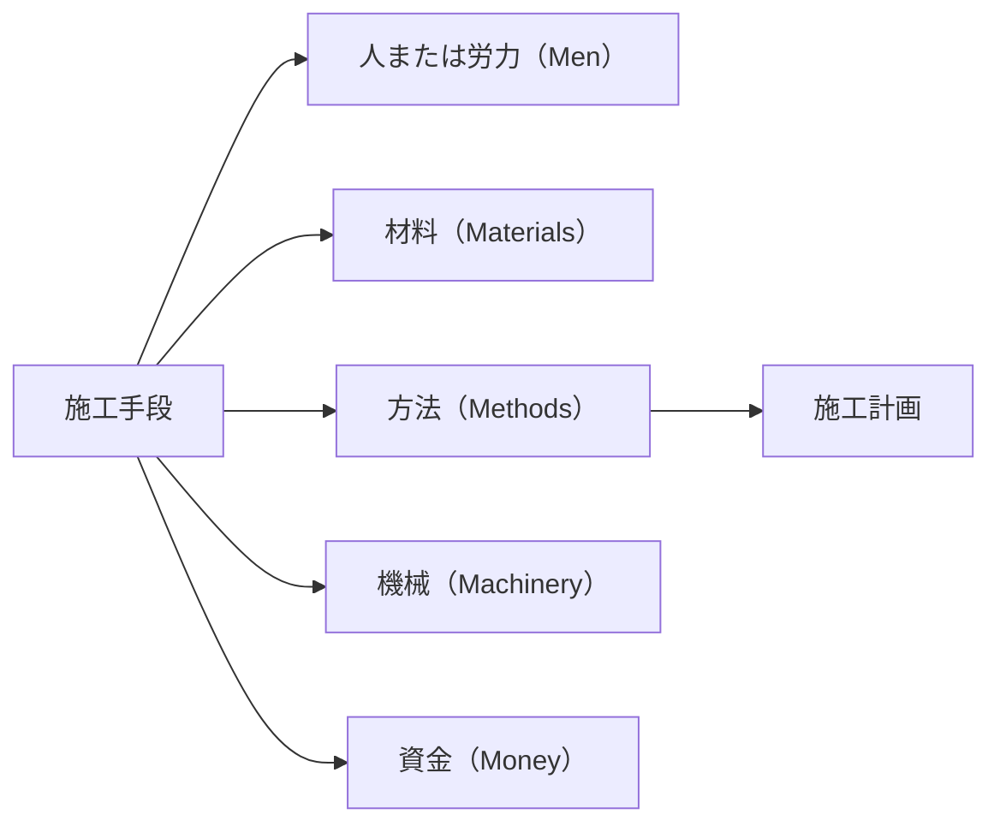
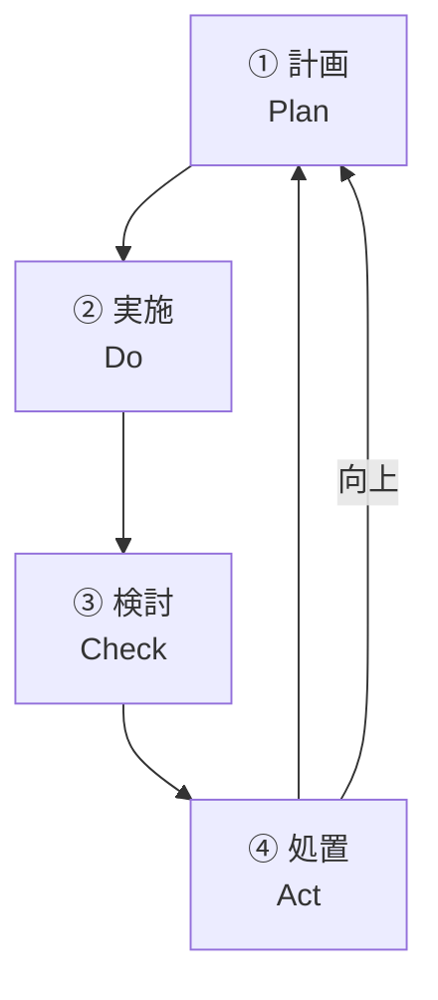

## 施工管理の位置づけ

### 建設事業と施工管理

ある建設事業が企画され、実際に供用されるまでの一般的なプロセスは、図 1.1 に示すようなものである。

第一段階の調査・計画、第二段階のうち設計・積算は、発注者自らがコンサルタントなどを活用して実施する。第三段階の発注は、官公庁の場合、発注者自ら行う。第三段階のうち施工・内部検査・引渡は、工事を受注した請負者が実施する。なお、第三段階では、発注者も所定の工事目的物が築造されているかどうかを確認する立場から、施工段階で気づいたことを指摘したり助言することがある。以上を経て、第四段階の発注者による供用・維持管理に入る。

建設工事の施工管理とは、このプロセスの第三段階において、施工者が所定の品質の工事目的物を発注者に引き渡すまでに必要とされる管理技術のことである。

図 1.1　建設事業のプロセスと工事施工管理

### 施工管理とは

建設工事の特徴は、生産環境の整った工場で製品を大量に生産する製造業と異なり、一つ一つ異なる現場（場所）で、さまざまな環境と用途に応じた多種多様な構造物を個別に築造することにある。また、現場において作り直しが容易にできない、気象や天候の影響を受ける、規模が大小さまざまである、多くの職種と下請作業がある、過去の施工経験が非常に重要である、などの特性を持っている。

こうした建設工事で築造される構造物の良否は、その築造過程における管理方法に大きく左右されるため、築造過程の管理が極めて重要な意味を持つ。工場における製品の製造管理が「生産管理」と呼ばれるのに対して、建設工事の場合は「施工管理」と呼ばれる。

:::note[施工管理の定義]

**施工管理**とは、「目的構造物を所定の期間内に、所定の予算内で、所定の品質を満足するように築造するために、一定の施工手段を用いて、施工のための計画を立て（**施工計画**）、計画が所定の工程に沿って進捗しているかどうかを管理し（**工程管理**）、施工した構造物が所定の形状や性能を有しているかどうかを管理する（**品質管理**）などの建設工事の施工に関する管理の総称」である。

:::

なお、施工手段とは、図 1.2 に示す 5 つの手段（5M）である。

図 1.2　5つの施工手段

以上の定義からわかるように、施工管理の目的は、**品質**（より良く）、**価格**（より安く）、**工期**（より早く）の 3 要素に集約されている。

また、図 1.1 に示すように、工事施工に関する施工管理には、施工管理の**三大管理**と呼ばれる**品質管理**、**原価管理**、**工程管理**や社会的制約に基づく管理などがある。社会的制約に基づく管理は、安全管理、労務管理、環境保全管理などの法令を遵守するために必要な管理であるが、近年では、前述の三大管理に加え、安全管理が非常に重要になってきている。

さらに、工事施工から工事完成の間に行う内部検査も、施工管理のひとつとして挙げることができる。

なお、施工管理においては、その過程において、品質、価格、工期の 3 要素などに関連して、所定の結果が得られないおそれがあると判明した場合は、直ちにその原因を追求し、工事の見直しや改善を図り、所期の結果が得られるよう絶えず監視しながら、計画にフィードバックする必要がある。

## 主な施工管理の内容

工事の施工と施工管理の内容は図 1.1 に示したとおりであるが、本節では、技術的に特に重要な管理項目について、簡単に説明する。

### 施工計画

設計図および工事仕様書などに基づき、施工に関する種々の制約の中で、施工手段を組み合わせて目的とする構造物を築造するために作成する計画のことである。**施工計画**は、**安全・労務・環境保全**などの社会的制約を満足しつつ、施工の 3 要素である**品質**、**価格**、**工期**を最も効率よく満足するものでなくてはならない。

### 工程管理

施工計画に基づいて工事が進捗するよう、工事の細部にわたり工程を管理することである。特定の工事部分の進捗が早すぎたり遅すぎたりする場合は、原因を調査して対策を立て、工事全体が工期内に効率よく完成するように管理しなければならない。

### 品質管理（出来形管理）

目的とする構造物の形状や性能が、設計図および工事仕様書に定められた品質に合致するかどうかを管理することであり、試験や品質管理基準などを用いて行われる。このうち、特に、形状・寸法の管理に関するものを出来形管理という。

### 原価管理

材料費、労務費およびその他の現場経費を詳細に記録・整理し、当初予定した原価と実際に要した原価の差異を比較分析し、その原因を調査して必要な対策をとるなど、工事を経済的に施工できるように費用を管理することをいう。

### 安全管理

工事実施にあたり、労働者や第三者に危害を加えないように、工事現場の整理整頓、施工計画の安全面からの検討、安全施設の整備および安全教育の徹底などを図ることである。事故を起こした場合の社会的影響などを考えると、極めて重要な管理である。

### 環境保全管理

工事が周辺の自然環境や生活環境などに及ぼす影響を最小限に抑制するために行う管理であり、法律や条例などによって規制された基準を遵守しなければならない。これらに関する事前調査を行うとともに、所管の官公署への届出や関係機関との連絡・協議を実施する。環境保全管理は、工事を円滑に実施するうえで重要な管理であり、騒音、振動、水質や建設廃棄物や建設副産物の処理などの管理がある。

### その他の管理

施工管理には、上記に述べた管理事項のほかに、**労務管理**、**資材管理**、**設備管理**などの管理がある。これらすべての施工管理が適切に実施されることによって、品質、価格、工期の 3 要素において満足のいく工事目的物が完成されることになる。

## 施工管理の手順

施工管理は、施工計画、工程管理、品質管理、原価管理、安全管理、環境保全管理などの管理項目からなるが、これらを的確に実施するための一般的な手順の基本はすべて共通である。それを表したものが、図 1.3 である。施工管理は、**計画**、**実施**、**検討**、**処置**の 4 つの段階をサイクル的に繰り返し実行することによって適切に実施される。

この四つの段階は、**P-D-C-A サイクル**と呼ばれ、整理すると次のようになる。

| 段階 | 内容 | 英語 |
|---|---|---|
| 第 1 段階 | **計画**を立てる | Plan |
| 第 2 段階 | 計画に基づき**実施**する | Do |
| 第 3 段階 | 実施した結果と計画を**比較**して**検討**する | Check |
| 第 4 段階 | 検討した結果をもとに、**適切な処置**を施す | Act |

なお、第 4 段階において是正処置のみでは対応できない場合は、当初の計画そのものを修正し、修正した計画をもとに、再度上記の 4 段階のサイクルを繰り返すことになる。

図 1.3　施工管理のサイクル

施工管理はこのようにして実施されるが、まず**第 1 段階の計画**において重要なことは、安全の確保は当然の前提として、品質、原価、工程の面で優れた計画を練り上げるとともに、第 2 段階の実施における強度などの目標値や第 3 段階の比較検討時の判断根拠となる基準を適切に設定しておくことである。

**第 2 段階の実施**において重要なことは、設計図などにのっとり適切に施工するとともに、目標に対して実際の施工状態がどうなっているかを容易に判断できるようなデータを、正確に調査記録しておくことである。

**第 3 段階の検討**において重要なことは、調査記録したデータを工学的見地から適切に判断し、施工管理上の問題の所在を明確にすることである。

**第 4 段階の処置**において重要なことは、第 3 段階における判断結果に基づき、必要な修正を施すための方策について幅広く検討することである。過去における類似の工事の施工実績などのデータに基づき、最小の費用で最大の効果が得られるよう、工学的に最も適切な処置方法を見つけ出すことが求められる。

施工管理は、このサイクルの繰返しにより適正に実施されるものである。その良し悪しは、施工管理に関係する現場管理者の総合的な知識や経験などに大きく左右されるので、現場の施工管理者は常日頃からありとあらゆる機会を利用して、知識と経験の蓄積に努めなければならない。

## 三大管理の相互関係

品質管理、原価管理、工程管理の 3 つが施工管理における三大管理であることは、「施工管理の位置づけ」で述べたとおりであるが、それらが目的とする「より早く」「より良く」「より安く」は、お互いに相反する。これらの一般的な相互関係を概念的に表したものが、図 1.4 である。

図 1.4　工程・品質・原価の相互関係

### 工程と原価の関係

図 1.4 の曲線 a に示すように、工程（施工速度）を早めると、単位時間の施工量が増えて原価は安くなっていくが、さらに工程を早めると原価は上昇傾向に転じる。このように、施工速度には、一般に、採算面での**最適な速度（最適工期）**がある。

例えば、施工能力に余裕がある場合は施工速度を上げることにより工期が短縮されて、人件費やリース料が節約され原価は下がるが、さらに速度を上げ突貫工事をしようとすると人員を増やしたりリース料の高い機械に変更しなければならず、原価は上がる。

### 品質と原価の関係

曲線 b に示すように、一般に、品質の良くないものは安くできるが、**品質を良くするにしたがって原価も高くなる**。例えば、より安全側のコンクリート強度を得ようと思えば、セメント量を増やすことになり、原価は上がる。

### 品質と工程の関係

曲線 c に示すように、一般に、**品質の良いものを施工しようとすると工程（施工速度）は遅くなり**、品質を下げると工程は早くなる。例えば、コンクリート構造物の出来形管理の精度を上げようとすると、型枠の組立て精度を上げなければならず、設置や精度の確認に要する時間が増える。また、地盤の圧密度の品質を上げようとすれば、労力や時間が当然かかることになり、原価の上昇にもつながる。
