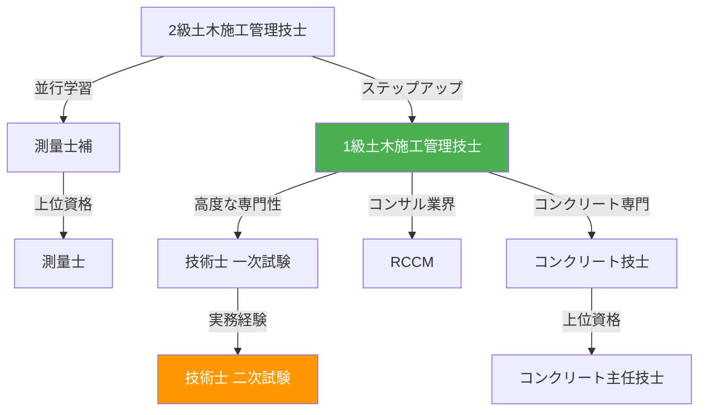

# 土木系資格試験ガイド

土木分野の主要な資格試験の概要と、doboku-note 内の対策コンテンツへのリンクを集約したポータルページです。試験の難易度や受験資格に応じて、自分に合った資格を選びましょう。

| 資格 | 難易度 | 受験資格 | 試験時期 |
|---|---|---|---|
| [1級土木施工管理技士](#1級土木施工管理技士) | ★★★★ | 実務経験要 | 7月（1次）/ 10月（2次） |
| [2級土木施工管理技士](#2級土木施工管理技士) | ★★★ | 17歳以上（1次） | 6月（前期1次）/ 10月（後期） |
| [技術士（建設部門）](#技術士建設部門) | ★★★★★ | 制限なし（1次）/ 実務経験要（2次） | 11月（1次）/ 7月（2次） |
| [RCCM](#rccm) | ★★★★ | 実務経験要 | 11月 |
| [コンクリート技士/主任技士](#コンクリート技士主任技士) | ★★★〜★★★★ | 実務経験要 | 11月 |
| [測量士/測量士補](#測量士測量士補) | ★★★〜★★★★ | 制限なし | 5月 |

---

## 1級土木施工管理技士

土木工事の施工管理を行うための国家資格。公共工事の現場に配置する**監理技術者**の要件として広く求められ、土木系資格の中でも最も受験者数が多い。

### 試験構成

| 検定 | 形式 | 試験時間 | 合格基準 |
|---|---|---|---|
| 第1次検定 | 四肢択一（マークシート）96問中65問解答 | 午前2時間30分 + 午後2時間 | 得点60%以上 |
| 第2次検定 | 記述式 | 2時間45分 | 得点60%以上 |

### 試験日程・合格率

- **第1次検定**: 例年7月上旬（合格率 約50〜60%）
- **第2次検定**: 例年10月上旬（合格率 約25〜35%）
- **実施機関**: [全国建設研修センター](https://www.jctc.jp/)

### 対策コンテンツ

#### 第1次検定

- **[試験対策ガイド](/docs/exam-guide)** --- 出題傾向分析・得点戦略・分野別重点ポイント
  - [出題傾向と得点戦略](/docs/general/exam-guide/strategy)
  - [土工の要点](/docs/general/exam-guide/earthwork-key-points)
  - [コンクリート工の要点](/docs/general/exam-guide/concrete-key-points)
  - [四大管理の要点](/docs/general/exam-guide/four-management)
  - [法規の要点](/docs/general/exam-guide/law-key-points)
- **[第1次試験問題集](/docs/exam-questions)** --- 平成26〜令和2年度の過去問（問題A・B）

#### 第2次検定

- **[第2次試験問題集](/docs/exam-questions-2)** --- 分野別の過去問と基礎知識
  - [施工経験記述](/docs/general/exam-questions-2/experience-writing/guide)
  - [土工](/docs/general/exam-questions-2/earthwork/past-problems)
  - [コンクリート工](/docs/general/exam-questions-2/concrete/past-problems)
  - [施工計画](/docs/general/exam-questions-2/construction-plan/past-problems)
  - [品質管理](/docs/general/exam-questions-2/quality-management/past-problems)

#### 学習用テキスト

- **[土木一般テキスト](/docs/civil-general)** --- 土工・建設機械・コンクリート・基礎工・測量・解体
- **[施工管理テキスト](/docs/construction-management)** --- 施工計画・工程管理・品質管理・安全管理・環境管理・関連法規

---

## 2級土木施工管理技士

1級と同じく土木工事の施工管理に関する国家資格。**主任技術者**としての要件を満たし、1級へのステップアップとして位置づけられる。

### 試験構成

| 検定 | 形式 | 試験時間 | 合格基準 |
|---|---|---|---|
| 第1次検定 | 四肢択一（マークシート）61問中40問解答 | 2時間10分 | 得点60%以上 |
| 第2次検定 | 記述式 | 2時間 | 得点60%以上 |

### 試験日程・合格率

- **第1次検定（前期）**: 例年6月上旬（合格率 約55〜70%）
- **第1次検定・第2次検定（後期）**: 例年10月下旬（合格率: 1次 約55〜70% / 2次 約35〜45%）
- **実施機関**: [全国建設研修センター](https://www.jctc.jp/)

### 対策コンテンツ

出題範囲は1級と重なる部分が多いため、以下のコンテンツが学習に活用できます。

- **[土木一般テキスト](/docs/civil-general)** --- 土工・コンクリート・基礎工など基礎知識
- **[施工管理テキスト](/docs/construction-management)** --- 施工計画・品質管理・安全管理・法規

:::info
2級土木施工管理技士に特化した過去問・対策ガイドは**準備中**です。
:::

---

## 技術士（建設部門）

技術者として最高峰の国家資格。高度な専門知識と応用能力、さらに技術者倫理が問われる。建設コンサルタント業務の管理技術者要件として必須であり、キャリアアップに直結する。

### 試験構成

| 試験 | 形式 | 科目 | 試験時間 |
|---|---|---|---|
| 一次試験 | 五肢択一（マークシート） | 基礎科目・適性科目・専門科目 | 計4時間 |
| 二次試験（筆記） | 記述式（論文） | 必須科目I + 選択科目II・III | 計5時間30分 |
| 二次試験（口頭） | 面接 | 業務経歴・技術的体験 | 約20分 |

### 試験日程・合格率

- **一次試験**: 例年11月下旬（合格率 約30〜45%）
- **二次試験（筆記）**: 例年7月中旬（合格率 約10〜15%）
- **二次試験（口頭）**: 例年12〜1月（筆記合格者のうち約80〜90%が合格）
- **実施機関**: [日本技術士会](https://www.engineer.or.jp/)

### 対策コンテンツ

- **[技術士試験対策（建設部門）](/docs/pe-exam)**
  - [一次試験ガイド](/docs/general/pe-exam/primary-guide) --- 試験概要・科目構成・得点戦略
  - [土質及び基礎](/docs/general/pe-exam/soil-foundation) --- 専門科目の要点整理
  - [コンクリート](/docs/general/pe-exam/concrete-points) --- 専門科目の要点整理
  - [河川、砂防及び海岸・海洋](/docs/general/pe-exam/river-erosion) --- 専門科目の要点整理
  - [二次試験ガイド](/docs/general/pe-exam/secondary-guide) --- 筆記試験の対策法・論文構成

---

## RCCM

**シビルコンサルティングマネージャ（Registered Civil Engineering Consulting Manager）** の略称。建設コンサルタント業務における管理技術者・照査技術者の資格要件のひとつ。技術士に比べて取得しやすく、建設コンサルタント業界で広く活用される。

### 試験構成

| 試験科目 | 形式 | 内容 |
|---|---|---|
| 問題I | 択一式 | 業務関連法制度・技術基準 |
| 問題II | 記述式（論文） | 管理技術力（業務計画・照査等） |
| 問題III | 択一式 | 専門技術知識（選択部門） |
| 問題IV-1 | 記述式 | 技術的課題と解決策 |
| 問題IV-2 | 記述式 | 業務経歴と技術的所見 |

### 試験日程・合格率

- **試験日**: 例年11月上旬（合格率 約40〜50%）
- **実施機関**: [建設コンサルタンツ協会](https://www.jcca.or.jp/)

### 対策コンテンツ

- **[RCCM試験対策ガイド](/docs/general/rccm-exam/rccm-guide)**

:::note
RCCM対策コンテンツは現在拡充中です。技術士対策コンテンツの多くはRCCM学習にも活用できます。
:::

---

## コンクリート技士/主任技士

コンクリートの製造・施工・検査・管理に関する技術力を認定する民間資格。コンクリート技士は実務レベルの知識、主任技士はより高度な計画・管理能力が求められる。公共工事の品質確保の観点から評価が高い。

### 試験構成

| 資格 | 形式 | 試験時間 |
|---|---|---|
| コンクリート技士 | 四肢択一 + 記述（小論文1問） | 3時間 |
| コンクリート主任技士 | 四肢択一 + 記述（小論文2問） | 3時間30分 |

### 試験日程・合格率

- **試験日**: 例年11月下旬
- **合格率**: コンクリート技士 約25〜30% / 主任技士 約10〜15%
- **実施機関**: [日本コンクリート工学会](https://www.jci-net.or.jp/)

### 対策コンテンツ

コンクリート分野の学習には以下のコンテンツが活用できます。

- **[土木一般テキスト コンクリート編](/docs/civil-general/concrete)** --- コンクリートの材料・性質・配合設計・施工・品質検査

:::info
コンクリート技士/主任技士に特化した対策コンテンツは**準備中**です。
:::

---

## 測量士/測量士補

測量法に基づく国家資格。測量士は測量計画の作成、測量士補は測量士の作成した計画に従い測量業務を行う。測量業者には営業所ごとに測量士の配置が義務付けられている。

### 試験構成

| 資格 | 形式 | 試験科目 | 試験時間 |
|---|---|---|---|
| 測量士 | 択一式 + 記述式 | 測量法規・多角測量・水準測量・地形測量・写真測量・地図編集・応用測量 | 午前2時間30分 + 午後2時間30分 |
| 測量士補 | 五肢択一（28問） | 測量法規・多角測量・水準測量・地形測量・写真測量・地図編集・応用測量 | 3時間 |

### 試験日程・合格率

- **試験日**: 例年5月中旬
- **合格率**: 測量士 約10〜15% / 測量士補 約30〜40%
- **実施機関**: [国土地理院](https://www.gsi.go.jp/)

### 対策コンテンツ

測量分野の学習には以下のコンテンツが活用できます。

- **[土木一般テキスト 測量編](/docs/civil-general/surveying)** --- 測量の基礎・距離角度測量・水準測量・地形測量と写真測量

:::info
測量士/測量士補に特化した対策コンテンツは**準備中**です。
:::

---

## 資格取得の学習ロードマップ

土木系資格は互いに出題範囲が重複しているため、段階的に取得するのが効率的です。

:::tip 学習のポイント
- **土工・コンクリート・施工管理**の3分野は多くの資格で共通して出題されるため、[土木一般テキスト](/docs/civil-general)と[施工管理テキスト](/docs/construction-management)を軸に学習すると効率的です。
- 1級土木施工管理技士の学習で蓄えた知識は、技術士一次試験やRCCMの専門科目にも直結します。
:::
