## 第1節 通則

### 1. 適用範囲

本章は、河川において行う堤防の設計についての考え方を示すものである。

なお、堤防は原則として盛土により築造するものとする。

### 2. 適用基準等

表1-2-1 適用基準等

### 3. 堤防の種類

堤防とは、河川の流水の氾濫を防ぐ目的をもって、土砂・石礫等によって造られた河川構造物である。河川の特性と堤防の目的に応じて堤防の造り方も異なり、一般に土でつくられる土堤、コンクリートや矢板等で設けられる特殊堤、破堤による甚大な被害を軽減するために設けられる高規格堤防（スーパー堤防）等の種類がある。

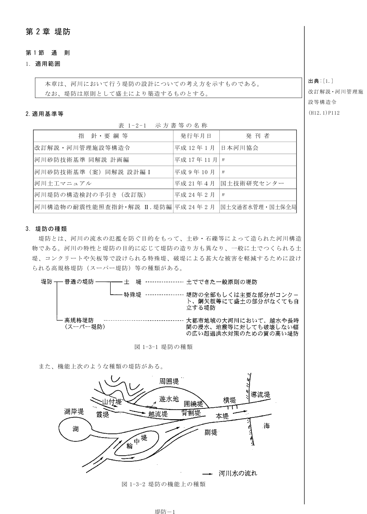

図1-3-1 堤防の種類

また、機能上次のような種類の堤防がある。

図1-3-2 堤防の機能上の種類

### 4. 堤防設計の基本

#### 4-1 堤防の原則

堤防は、護岸、水制その他これらに類する施設と一体として、計画高水位（高潮区間にあっては、計画高潮位）以下の水位の流水の通常の作用に対して安全な構造とするものとする。

> **（解 説）**
>
> 河川改修工事は、計画の対象となる洪水流量（計画高水流量）を定め、それ以下の洪水に対して氾濫原を防御するために行うものである。いわば河川改修工事は、計画高水流量以下の洪水に限って計画河道の中に押し込めようとするものである。すなわち、堤防は、計画高水位以下の水位の流水の通常の作用に対して安全であるよう設置されるものであるといえる。
>
> なお、高規格堤防においては、「本章第3節高規格堤防」に示すとおり、高規格堤防設計水位に対し安全となるように設計するものである。

#### 4-2 完成堤防の定義

完成堤防とは、計画高水位に対して必要な高さと断面を有し、さらに必要に応じ護岸（のり覆工、根固め工等）等を施したものをいう。

> **（解 説）**
>
> 河川管理施設等構造令（以下構造令という）における堤防に関する基準は、堤内地盤より 0.6m 以上のものについて定められており、この基準でも 0.6m 未満の盛土はこの節を適用しないものとする。
>
> 堤防の高さ、および断面については計画高水位を対象に築造されるが、一般に堤防は土でできているので越流や浸透に対して十分な配慮が必要である。したがって、余裕高が必要であり、また、浸透等に耐える安定した断面形状と構造が必要である。さらに流勢に対して侵食による破壊を防ぐためには必要に応じて護岸（のり覆工に根固め等を備えたもの）等を設け、堤防の土羽部分は芝等で被覆する。

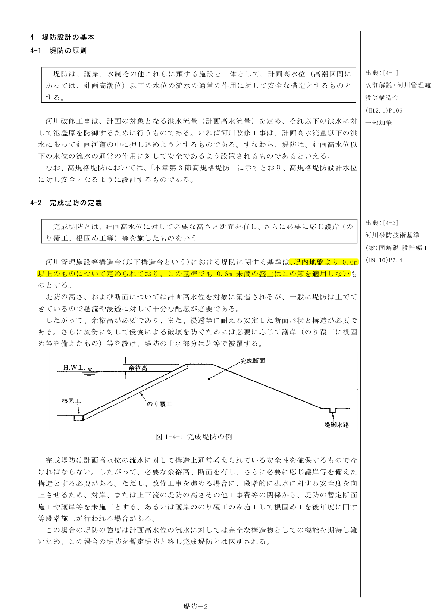

図1-4-1 完成堤防の例

> **（解 説）**
>
> 完成堤防は計画高水位の流水に対して構造上通常考えられている安全性を確保するものでなければならない。したがって、必要な余裕高、断面を有し、さらに必要に応じ護岸等を備えた構造とする必要がある。ただし、改修工事を進める場合に、段階的に洪水に対する安全度を向上させるため、対岸、または上下流の堤防の高さその他工事費等の関係から、堤防の暫定断面施工や護岸等を未施工とする、あるいは護岸ののり覆工のみ施工して根固め工を後年度に回す等段階施工が行われる場合がある。
>
> この場合の堤防の強度は計画高水位の流水に対しては完全な構造物としての機能を期待し難いため、この場合の堤防を暫定堤防と称し完成堤防とは区別される。

#### 4-3 堤防の性能と機能

流水が河川外に流出することを防止するために設ける堤防は、計画高水位（高潮区間にあっては計画高潮位、暫定堤防にあっては、「構造令 第32条」に定める水位）以下の水位の流水の通常の作用に対して安全な構造となるよう設計するものとする。

また、平水時における地震の作用に対して、地震により壊れても浸水による二次災害を起こさないことを原則として耐震性を評価し、必要に応じて対策を行うものとする。

> **（解 説）**
>
> 河川管理施設等構造令による「流水」には、河川の流水の浸透水が含まれるので、流水の通常の作用とは、洗掘作用のほか、浸透作用も考える必要があり、土堤を原則とする堤防は、これらの作用に対して安全な構造とする必要がある。洗掘作用は、一般的に局所的現象として発生する場合が多いため、河川の蛇行特性、河床変動特性等について検討のうえ、洗掘作用に対する堤防保護の必要性を判断しなければならない。したがって、高規格堤防を除く一般の堤防は、計画高水位以下の水位の流水の通常の作用に対して安全な構造となるよう耐浸透性および耐侵食性について設計する必要がある。
>
> 地震については、これまで土堤には一般に地震に対する安全性は考慮されていない。これは、地震と洪水が同時に発生する可能性が少なく、地震による被害を受けても、土堤であるため復旧が比較的容易であり、洪水や高潮の来襲の前に復旧すれば、堤防の機能は最低限度確保することができることから、頻繁に発生する洪水に対しての防御が優先であるという考え方によるものである。しかし、堤内地が低いゼロメートル地帯等では、地震時の河川水位や堤防沈下の程度によっては、被害を受けた河川堤防を河川水が越流し、二次的に甚大な浸水被害へと波及する恐れがあるため、浸水による二次災害の可能性がある河川堤防では、土堤についても地震力を考慮することが必要である。

表1-4-1 堤防の安全性に求める機能と外力

| 作用 | 確保すべき機能 | 安全性に係る外力 |
|---|---|---|
| 降雨および流水 | 耐浸透 | 降雨および流水の浸透 |
| 流水 | 耐侵食 | 流水による流体力 |
| 地震 | 必要に応じて耐震 | 地震動による液状化、慣性力 |

## 第2節 土堤（標準）

### 1. 適用

本章は、河川において施工する堤防のうち、土堤の設計についての標準を示すものである。

### 2. 堤防の構造

#### 2-1 堤防各部の名称

堤防各部の名称は図2-2-1のとおり。

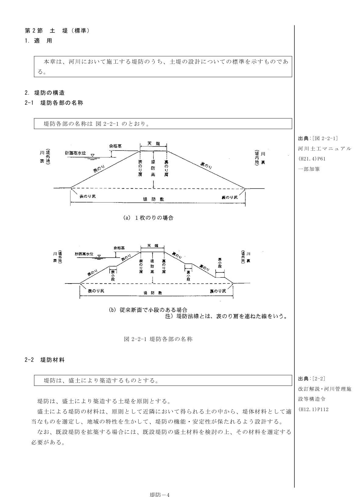

図2-2-1 堤防各部の名称

#### 2-2 堤防材料

堤防は、盛土により築造するものとする。

> **（解 説）**
>
> 堤防は、盛土により築造する土堤を原則とする。盛土による堤防の材料は、原則として近隣において得られる土の中から、堤体材料として適当なものを選定し、地域の特性を生かして、堤防の機能・安定性が保たれるよう設計する。
>
> なお、既設堤防を拡築する場合には、既設堤防の盛土材料を検討の上、その材料を選定する必要がある。

#### 2-3 堤防の形状

堤防を計画するときの断面および形状は、「構造令」ならびに「河川砂防技術基準（案）設計編」によるものとする。

**(1) 堤防の高さ**

**a. 堤防の余裕高**

堤防（計画高水流量を定めない湖沼の堤防を除く）の高さは、計画高水流量に応じ、計画高水位に次の表の下欄に掲げる値を加えた値以上とするものとする。

ただし、堤防に隣接する堤内の土地の地盤高（以下「堤内地盤高」という。）が計画高水位より高く、かつ、地形の状況等により治水上の支障がないと認められる区間にあっては、この限りでない。

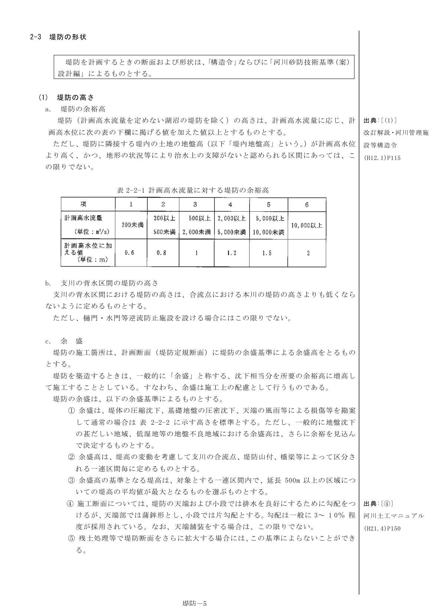

表2-2-1 計画高水流量に対する堤防の余裕高

**b. 支川の背水区間の堤防の高さ**

支川の背水区間における堤防の高さは、合流点における本川の堤防の高さよりも低くならないように定めるものとする。ただし、樋門・水門等逆流防止施設を設ける場合にはこの限りでない。

**c. 余盛**

堤防の施工箇所は、計画断面（堤防定規断面）に堤防の余盛基準による余盛高をとるものとする。

> **（解 説）**
>
> 堤防を築造するときは、一般的に「余盛」と称する、沈下相当分を所要の余裕高に増高して施工することとしている。すなわち、余盛は施工上の配慮として行うものである。

堤防の余盛は、以下の余盛基準によるものとする。

1. 余盛は、堤体の圧縮沈下、基礎地盤の圧密沈下、天端の風雨等による損傷等を勘案して通常の場合は表2-2-2に示す高さを標準とする。ただし、一般的に地盤沈下の甚だしい地域、低湿地等の地盤不良地域における余盛高は、さらに余裕を見込んで決定するものとする。
2. 余盛高は、堤高の変動を考慮して支川の合流点、堤防山付、橋梁等によって区分される一連区間毎に定めるものとする。
3. 余盛高の基準となる堤高は、対象とする一連区間内で、延長500m以上の区域についての堤高の平均値が最大となるものを選ぶものとする。
4. 施工断面については、堤防の天端および小段では排水を良好にするために勾配をつけるが、天端部では蒲鉾形とし、小段では片勾配とする。勾配は一般に3～10%程度が採用されている。なお、天端舗装をする場合は、この限りでない。
5. 残土処理等で堤防断面をさらに拡大する場合には、この基準によらないことができる。

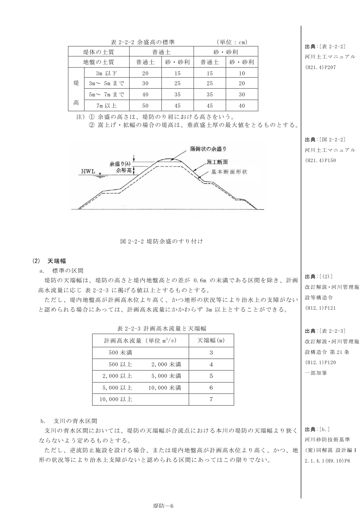

表2-2-2 余盛高の標準（単位：cm）

図2-2-2 堤防余盛のすり付け

**(2) 天端幅**

**a. 標準の区間**

堤防の天端幅は、堤防の高さと堤内地盤高との差が0.6mの未満である区間を除き、計画高水流量に応じ表2-2-3に掲げる値以上とするものとする。

ただし、堤内地盤高が計画高水位より高く、かつ地形の状況等により治水上の支障がないと認められる場合にあっては、計画高水流量にかかわらず3m以上とすることができる。

表2-2-3 計画高水流量と天端幅

| 計画高水流量（m³/s） | 天端幅（m） |
|---|---|
| 500未満 | 3 |
| 500以上 2,000未満 | 4 |
| 2,000以上 5,000未満 | 5 |
| 5,000以上 10,000未満 | 6 |
| 10,000以上 | 7 |

**b. 支川の背水区間**

支川の背水区間においては、堤防の天端幅が合流点における本川の堤防の天端幅より狭くならないよう定めるものとする。ただし、逆流防止施設を設ける場合、または堤内地盤高が計画高水位より高く、かつ、地形の状況等により治水上支障がないと認められる区間にあってはこの限りでない。

**c. 高規格堤防の天端幅**

高規格堤防の天端幅については、「本章第3節高規格堤防」による。

**d. 計画高水流量を定めない湖沼の天端幅**

計画高水流量を定めない湖沼の堤防については、堤防の高さ、および構造並びに背後地の状況を考慮して、3m以上の適切な値とする。

**(3) 管理用通路**

堤防には、河川の巡視、洪水前の水防活動・消防活動、緊急車両の円滑な通行を図る等のために、次に定める構造の管理用通路を設けるものとする。

1. 幅員は3m以上で堤防の天端幅以下の適切な値とすること。
2. ただし、都市部の河川を中心に管理用通路を原則として4m以上とすることが望ましい。
3. 建築限界は、図2-2-3に示すところによること。

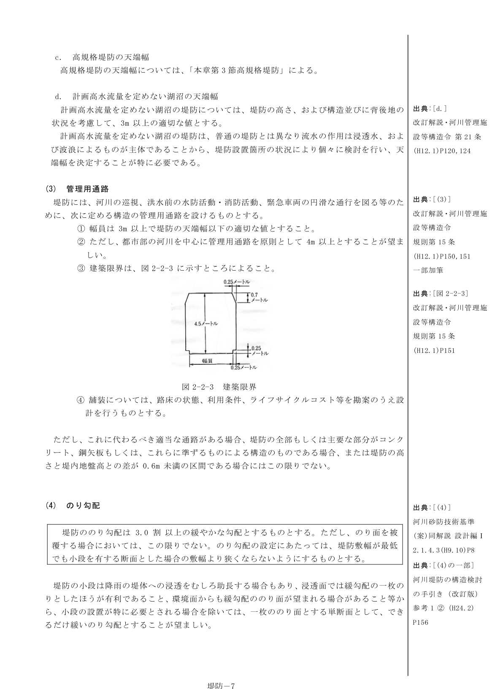

図2-2-3 建築限界

4. 舗装については、路床の状態、利用条件、ライフサイクルコスト等を勘案のうえ設計を行うものとする。

ただし、これに代わるべき適当な通路がある場合、堤防の全部もしくは主要な部分がコンクリート、鋼矢板もしくは、これらに準ずるものによる構造のものである場合、または堤防の高さと堤内地盤高との差が0.6m未満の区間である場合にはこの限りでない。

**(4) のり勾配**

堤防ののり勾配は3.0割以上の緩やかな勾配とするものとする。ただし、のり面を被覆する場合においては、この限りでない。のり勾配の設定にあたっては、堤防敷幅が最低でも小段を有する断面とした場合の敷幅より狭くならないようにするものとする。

> **（解 説）**
>
> 堤防の小段は降雨の堤体への浸透をむしろ助長する場合もあり、浸透面では緩勾配の一枚のりとしたほうが有利であること、環境面からも緩勾配ののり面が望まれる場合があること等から、小段の設置が特に必要とされる場合を除いては、一枚ののり面とする単断面として、できるだけ緩いのり勾配とすることが望ましい。

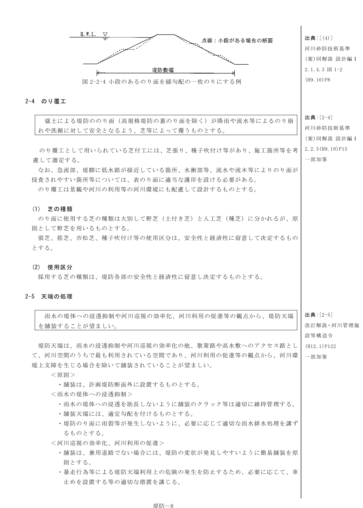

図2-2-4 小段のあるのり面を緩勾配の一枚のりにする例

#### 2-4 のり覆工

盛土による堤防ののり面（高規格堤防の裏のり面を除く）が降雨や流水等によるのり崩れや洗掘に対して安全となるよう、芝等によって覆うものとする。

> **（解 説）**
>
> のり覆工として用いられている芝付工には、芝張り、種子吹付け等があり、施工箇所等を考慮して選定する。
>
> なお、急流部、堤脚に低水路が接近している箇所、水衝部等、流水や流木等によりのり面が侵食されやすい箇所等については、表のり面に適当な護岸を設ける必要がある。のり覆工は景観や河川の利用等の河川環境にも配慮して設計するものとする。

**(1) 芝の種類**

のり面に使用する芝の種類は大別して野芝（土付き芝）と人工芝（種芝）に分かれるが、原則として野芝を用いるものとする。張芝、筋芝、市松芝、種子吹付け等の使用区分は、安全性と経済性に留意して決定するものとする。

**(2) 使用区分**

採用する芝の種類は、堤防各部の安全性と経済性に留意し決定するものとする。

#### 2-5 天端の処理

雨水の堤体への浸透抑制や河川巡視の効率化、河川利用の促進等の観点から、堤防天端を舗装することが望ましい。

> **（解 説）**
>
> 堤防天端は、雨水の浸透抑制や河川巡視の効率化の他、散策路や高水敷へのアクセス路として、河川空間のうちで最も利用されている空間であり、河川利用の促進等の観点から、河川環境上支障を生じる場合を除いて舗装されていることが望ましい。
>
> - 舗装は、計画堤防断面外に設置するものとする。
> - 雨水の堤体への浸透を助長しないように舗装のクラック等は適切に維持管理する。
> - 舗装天端には、適宜勾配を付けるものとする。
> - 堤防のり面に雨裂等が発生しないように、必要に応じて適切な雨水排水処理を講ずるものとする。
> - 舗装は、兼用道路でない場合には、堤防の変状が発見しやすいように簡易舗装を原則とする。
> - 暴走行為等による堤防天端利用上の危険の発生を防止するため、必要に応じて、車止めを設置する等の適切な措置を講じる。

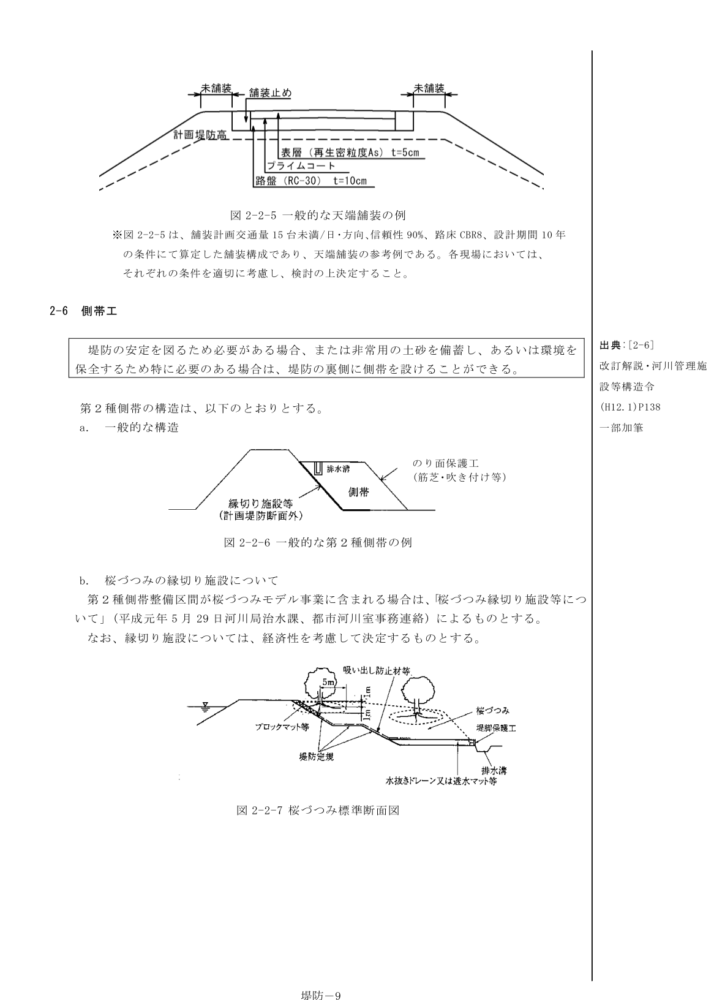

図2-2-5 一般的な天端舗装の例

#### 2-6 側帯工

堤防の安定を図るため必要がある場合、または非常用の土砂を備蓄し、あるいは環境を保全するため特に必要のある場合は、堤防の裏側に側帯を設けることができる。

第2種側帯の構造は、以下のとおりとする。

**a. 一般的な構造**

図2-2-6 一般的な第2種側帯の例

**b. 桜づつみの縁切り施設について**

第2種側帯整備区間が桜づつみモデル事業に含まれる場合は、「桜づつみ縁切り施設等について」(平成元年5月29日河川局治水課、都市河川室事務連絡)によるものとする。なお、縁切り施設については、経済性を考慮して決定するものとする。

図2-2-7 桜づつみ標準断面図

#### 2-7 堤防付属施設

堤防の付属施設には、堤防脚部を保護する堤脚保護工等、または巡視・点検等維持管理や河川空間利用としてのアクセスを容易とするものとして、坂路、階段等を設置するものとする。

なお、これら施設の設置にあたっては、バリアフリー等に配慮するとともに、環境の保全にも配慮した構造とする。

**(1) 堤脚保護工**

堤内背後地の利用状況を考慮して、堤脚保護のため川裏の堤脚部に設置する。堤脚保護工は、のり留工または水路等を設け境界工と兼ねることがある。

この川裏の堤脚部に設けるのり留工は、堤体内の浸透水および雨水の排水に支障を与えないとともに、堤体材料の微粒子が吸い出されることのないよう、特に配慮した構造とするものとする。

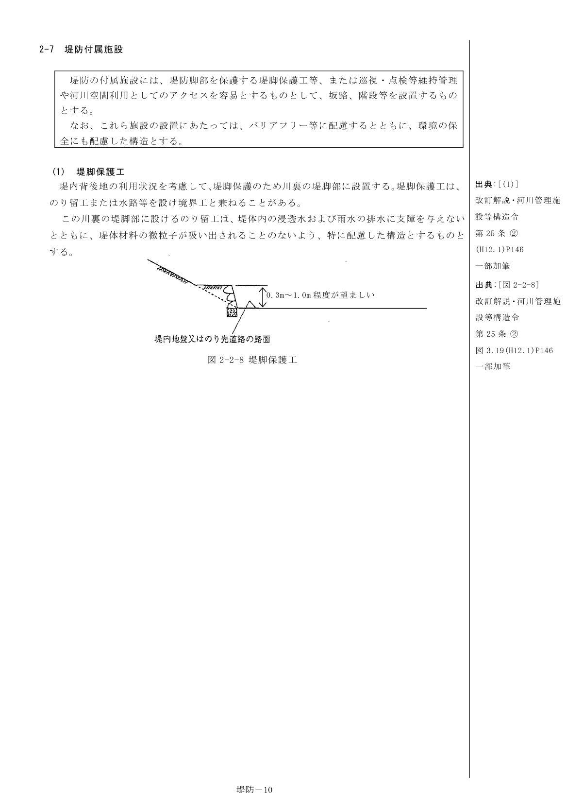

図2-2-8 堤脚保護工

**(2) 坂路**

坂路の設置は以下の事柄を考慮して設置するものとする。

1. 堤外に設ける坂路は、狭窄部等治水上の支障となる箇所には、原則として設けてはならない。
2. 堤外に設ける坂路は、堤防天端から下流に向かって下りるようにし、幅員も最小必要限度に押さえ、勾配も普通6～10%程度とし、できる限り流水の支障とならないようにするものとする。
3. 環境整備地区や河川敷利用者の多いところでは、地形の状況や地域の意向を踏まえ、構造等について特に配慮するものとする。なお、バリアフリー化を図る場合は、その用途に応じて勾配等を検討するものとする。
4. 坂路部からののり勾配は、原則として本堤ののり勾配と同一とする。
5. 坂路は必ず計画堤防断面外に拡幅して設置し、のり面と坂路の接する部分には、のり留工（堤体保護工、法面保護工）を設置することとする。
6. 坂路の路面は、アスファルトまたはコンクリート舗装を施し、片勾配とし降雨等による洗掘から保護することが望ましい。
7. 橋梁、堰等の工作物の付近は極力避けること。
8. 坂路と堤体の間に空き地がある場合は水溜まりとならないように盛土を行い、平場は特定の用途（駐車場）に供する構造としないこと。

図2-2-9 坂路構造図

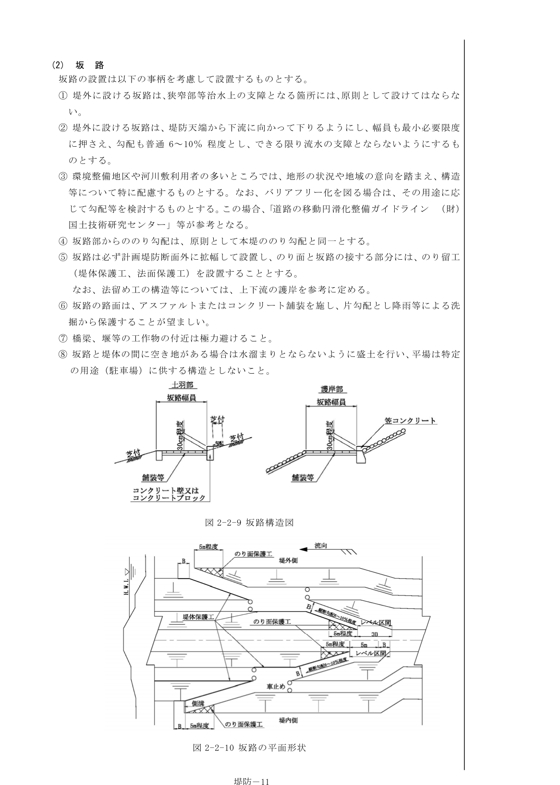

図2-2-10 坂路の平面形状

**(3) 階段**

階段の設置は以下の事柄を考慮して設置するものとする。

1. 階段は必要に応じ川表、川裏に設置するものとする。
2. 環境整備地区や河川敷利用者の多いところでは、地形の状況や地域の意向を踏まえ、構造等について特に配慮するものとする。なお、バリアフリー化を図る場合には、幅員構成、勾配と蹴上げ高さの関係、手すりの設置等を考慮するものとする。
3. 川表に設ける場合は、計画堤防ののり面、または現状堤防ののり面に沿って設けるものとし、川裏に設ける場合には、計画断面外ののり面に設けることを原則とする。
4. 設置場所が土羽堤防の場合の川表にあっては、乱流等によりのり面洗掘がおこらないように施設の両端から1.0m以上の範囲において、のり面保護を行うことを原則とする。
5. 階段の幅員Wは、2m以上とする。
6. なお、覆土等を行う河岸における階段では、周辺の環境や景観に配慮して、間伐材等を使用すること等も考慮すること。

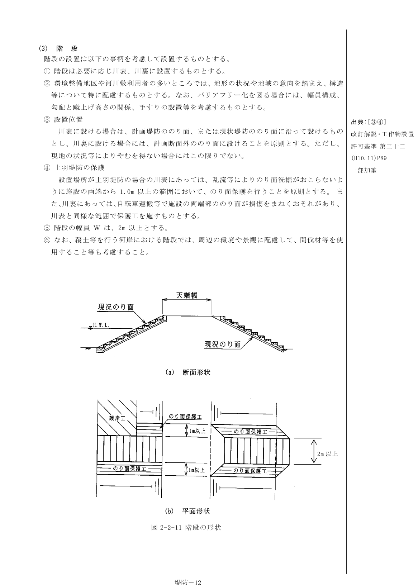

図2-2-11 階段の形状

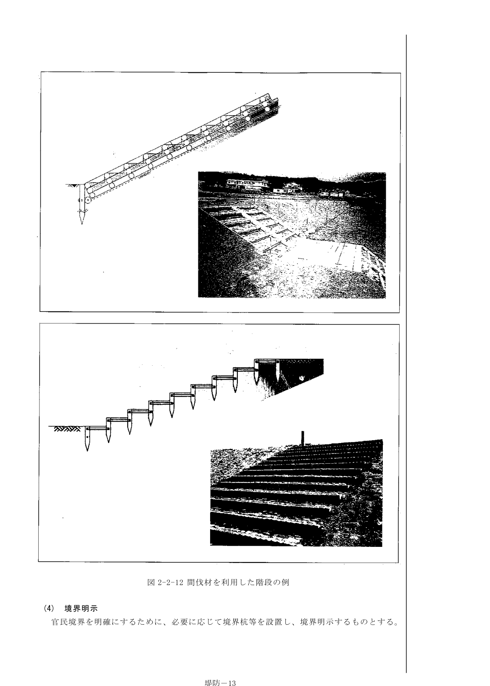

図2-2-12 間伐材を利用した階段の例

**(4) 境界明示**

官民境界を明確にするために、必要に応じて境界杭等を設置し、境界明示するものとする。

{/* 図・表のページ対応表
図1-3-1 堤防の種類 → k02-fig-01.png（P2）
図1-3-2 堤防の機能上の種類 → k02-fig-02.png（P2）
図1-4-1 完成堤防の例 → k02-fig-03.png（P3）
図2-2-1 堤防各部の名称 → k02-fig-04.png（P5）
図2-2-2 堤防余盛のすり付け → k02-fig-05.png（P7）
図2-2-3 建築限界 → k02-fig-06.png（P8）
図2-2-4 小段のあるのり面を緩勾配の一枚のりにする例 → k02-fig-07.png（P9）
図2-2-5 一般的な天端舗装の例 → k02-fig-08.png（P10）
図2-2-6 一般的な第2種側帯の例 → k02-fig-09.png（P10）
図2-2-7 桜づつみ標準断面図 → k02-fig-10.png（P10）
図2-2-8 堤脚保護工 → k02-fig-11.png（P11）
図2-2-9 坂路構造図 → k02-fig-12.png（P12）
図2-2-10 坂路の平面形状 → k02-fig-13.png（P12）
図2-2-11 階段の形状 → k02-fig-14.png（P13）
図2-2-12 間伐材を利用した階段の例 → k02-fig-15.png（P14）
表1-2-1 適用基準等 → k02-tbl-01.png（P2）
表2-2-1 計画高水流量に対する堤防の余裕高 → k02-tbl-02.png（P6）
表2-2-2 余盛高の標準 → k02-tbl-03.png（P7）
*/}
