## 第1節 基本事項

### 1. 定義

床止めとは、河床の洗掘を防いで河道の勾配等を安定させ、河川の縦断または横断形状を維持するために、河川を横断して設ける施設をいう。

> **（解 説）**
>
> 構造令では、床固めも含めて床止めと称することとしている。したがって、砂防工学の分野でいう「床固め」についても、河川法の適用区間に設ける場合は、構造令の適用がある。

### 2. 分類

構造的には、落差がある床止めを「落差工」、落差がないか又はあっても極めて小さい床止めを「帯工」と呼んでいる。

> **（解 説）**
>
> 目的別に分類すれば、砂防を目的とするものと単に河床の安定を目的とするものに大別される。前者は、縦侵食を防止して河床を安定させることによって、河床堆積の再移動、河岸の決壊等を防止するものである。後者については、(1)河床勾配を緩和するためのもの（一般に落差工となる）、(2)乱流を防止し、流向を定めるためのもの（落差工となる場合が多い）、(3)河床の洗掘または低下を防止するためのもの（一般に帯工となる）に分けられる。

### 3. 適用基準等

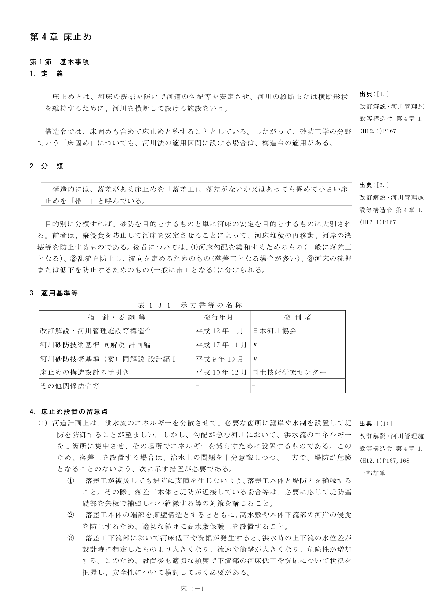

表1-3-1 示方書等の名称

### 4. 床止め設置の留意点

**(1)** 河道計画上は、洪水流のエネルギーを分散させて、必要な箇所に護岸や水制を設置して堤防を防御することが望ましい。しかし、勾配が急な河川において、洪水流のエネルギーを1箇所に集中させ、その場所でエネルギーを減らすために設置するものである。このため、落差工を設置する場合は、治水上の問題を十分意識しつつ、一方で、堤防が危険となることのないよう、次に示す措置が必要である。

1. 落差工が被災しても堤防に支障を生じないよう、落差工本体と堤防とを絶縁すること。その際、落差工本体と堤防が近接している場合等は、必要に応じて堤防基礎部を矢板で補強しつつ絶縁する等の対策を講じること。
2. 落差工本体の端部を擁壁構造とするとともに、高水敷や本体下流部の河岸の侵食を防止するため、適切な範囲に高水敷保護工を設置すること。
3. 落差工下流部において河床低下や洗掘が発生すると、洪水時の上下流の水位差が設計時に想定したものより大きくなり、流速や衝撃が大きくなり、危険性が増加する。このため、設置後も適切な頻度で下流部の河床低下や洗掘について状況を把握し、安全性について検討しておく必要がある。

**(2)** 床止めは、一般に、上下流で落差を生じさせたり、床止め本体上で浅い水深の流れを生じさせ、流水の連続性を断ち、魚類の遡上等を妨げる。このため、床止めは、河床等の安定を図る上でやむを得ない場合に限って設置することを基本とする。やむを得ず床止めを設置する場合は、魚道を設置したり、床止め本体を緩傾斜型の構造とする等の対策を講じる必要がある。

## 第2節 落差工（標準）

### 1. 落差工の設置

#### 1-1 設置位置

落差工の設置位置は、河道の平面形状や、落差工を設置したことによる流況の変化等を十分検討して定めるものとする。

> **（解 説）**
>
> 落差工の設置位置は、設置後の流況変化という観点から、望ましいと考えられる設置箇所の河道特性を整理すると以下のようである。
>
> 1. 砂州が形成されるような河道で、蛇行が小さく砂州が移動する場合には、砂州が落差工を乗り越えて移動するので落差工の上下流で大きな局所洗掘を生じないように、なるべく直線河道であるところに設置する。
> 2. 蛇行がある程度あり砂州の移動が生じる場合は、横断形状がほぼ長方形断面となる地点になるべく設置する。長方形断面の位置は低水路の法線形状や砂州の形成条件によって変わるので、横断測量結果よりその位置を判断する。
> 3. 落差工は、偏流等が生じることの少ない堤防法線と低水路法線ができるだけ平行な箇所へ設置することが望ましい。
> 4. 落差工は、洪水時の周辺部での激しい流れを考慮して、山つき箇所、堤内地盤高の高い箇所がある場合には、その地点を掘り込み河道部等を選んで設置することが望ましい。
> 5. 合流点付近に落差工を設置する必要のある場合は、合流点の直近に設置するのではなく、やや上流側へ設置し、洪水時に魚が待避できる空間を確保できるようにすることが望ましい。

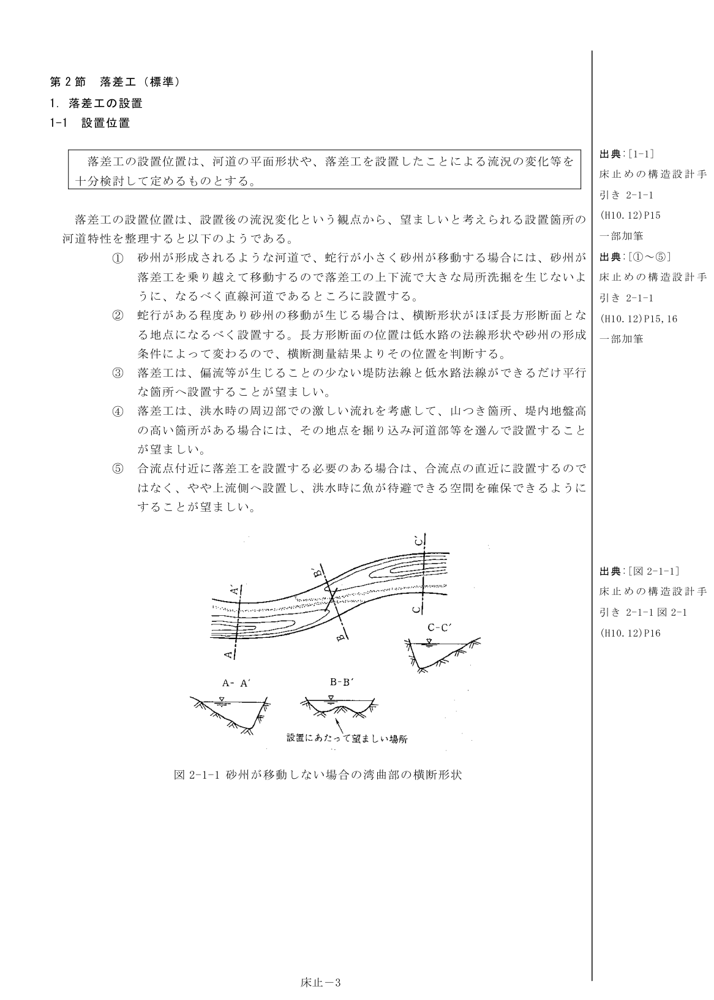

図2-1-1 砂州が移動しない場合の湾曲部の横断形状

#### 1-2 設計の手順

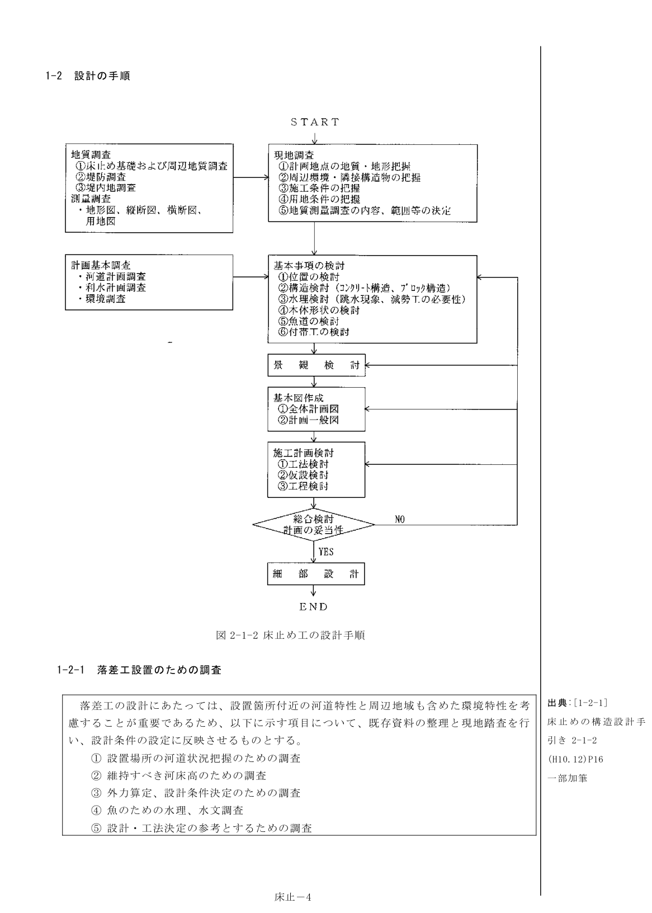

図2-1-2 床止め工の設計手順

##### 1-2-1 落差工設置のための調査

落差工の設計にあたっては、設置箇所付近の河道特性と周辺地域も含めた環境特性を考慮することが重要であるため、以下に示す項目について、既存資料の整理と現地踏査を行い、設計条件の設定に反映させるものとする。

1. 設置場所の河道状況把握のための調査
2. 維持すべき河床高のための調査
3. 外力算定、設計条件決定のための調査
4. 魚のための水理、水文調査
5. 設計・工法決定の参考とするための調査

##### 1-2-2 天端高

落差工の天端高は、計画河床高（設定河床高）と一致させることを基本とし、一般に落差工上・下流の河床の落差は 2m 以内とする。

落差工天端高・落差の設定にあたっては、落差工上下流の河岸および河川内構造物が安全であるかどうか、落差工上下流における河床変動量を勘案するものとする。

> **（解 説）**
>
> 落差工では、流水の落下に伴い、その上流では低下背水により流速の縦断分布を生じ、落差工に近い河床での掃流力が増大する（図2-1-3参照）。このため、落差工上流では、掃流力のバランスが崩れて河床低下を生じ、掃流力のバランスに対応した河床になって低下が落ち着く。
>
> この現象は、急流河川では小さく、緩流河川では大きく現れる傾向にある。したがって、落差工上流側の河床が本体天端より低下することに十分留意して、落差や上流河道の構造物を設計することが重要である。

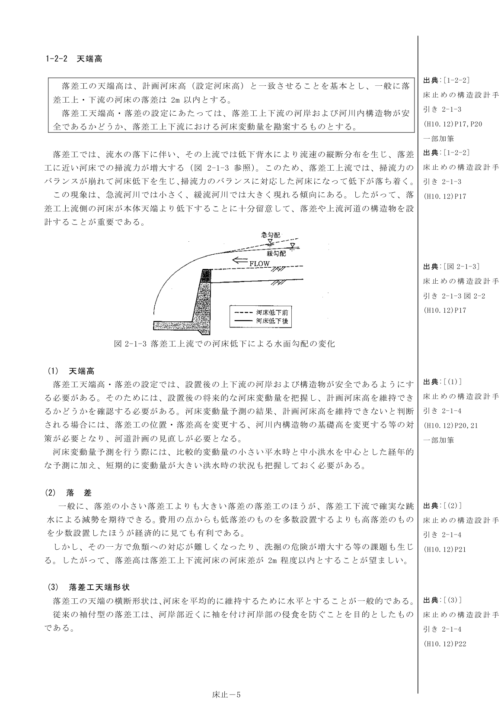

図2-1-3 落差工上流での河床低下による水面勾配の変化

**(1) 天端高**

落差工天端高・落差の設定では、設置後の上下流の河岸および構造物が安全であるようにする必要がある。そのためには、設置後の将来的な河床変動量を把握し、計画河床高を維持できるかどうかを確認する必要がある。河床変動量予測の結果、計画河床高を維持できないと判断される場合には、落差工の位置・落差高を変更する、河川内構造物の基礎高を変更する等の対策が必要となり、河道計画の見直しが必要となる。

河床変動量予測を行う際には、比較的変動量の小さい平水時と中小洪水を中心とした経年的な予測に加え、短期的に変動量が大きい洪水時の状況も把握しておく必要がある。

**(2) 落差**

一般に、落差の小さい落差工よりも大きい落差の落差工のほうが、落差工下流で確実な跳水による減勢を期待できる。費用の点からも低落差のものを多数設置するよりも高落差のものを少数設置したほうが経済的に見ても有利である。

しかし、その一方で魚類への対応が難しくなったり、洗掘の危険が増大する等の課題も生じる。したがって、落差高は落差工上下流河床の河床差が 2m 程度以内とすることが望ましい。

**(3) 落差工天端形状**

落差工の天端の横断形状は、河床を平均的に維持するために水平とすることが一般的である。従来の袖付型の落差工は、河岸部近くに袖を付け河岸部の侵食を防ぐことを目的としたものである。

> **（解 説）**
>
> この形状は砂防河川で一般的に用いられるものであり、落差工の袖の部分を突出させ、水制のように流路を渓流の流心付近に固定することを目的としたものである。
>
> 砂防河川と異なり比較的河床勾配が緩い河川区間に落差工を設置する場合は、このような袖部を設けると、流れを絞り込むことで落差工上下流の河床変動を大きくしたり、大きな局所洗掘を生じさせる恐れがある。このため落差工天端を水平にし、落差工周辺での流れを横断方向に平滑化することが望ましい。
>
> ただし、平水時のみお筋の安定を図り、上下流の連続性を確保するためには、河道の形状に応じて天端形状を工夫する必要がある。例えば、落差工天端高の一部は、魚道設置のために洪水時に問題が生じない範囲で切欠きを設けてもよい。

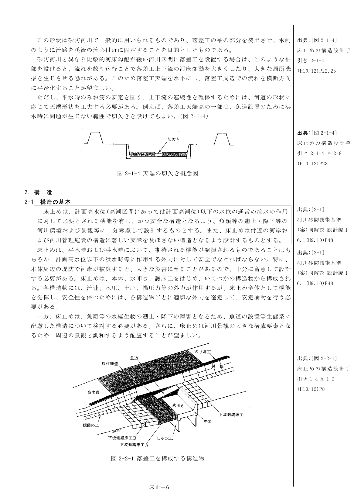

図2-1-4 天端の切欠き概念図

### 2. 構造

#### 2-1 構造の基本

床止めは、計画高水位（高潮区間にあっては計画高潮位）以下の水位の通常の流水の作用に対して必要とされる機能を有し、かつ安全な構造となるよう、魚類等の遡上・降下等の河川環境および景観等に十分考慮して設計するものとする。また、床止めは付近の河岸および河川管理施設の構造に著しい支障を及ぼさない構造となるよう設計するものとする。

> **（解 説）**
>
> 床止めは、平水時および洪水時において、期待される機能が発揮されるものであることはもちろん、計画高水位以下の洪水時等に作用する外力に対して安全でなければならない。特に、本体周辺の堤防や河岸が被災すると、大きな災害に至ることがあるので、十分に留意して設計する必要がある。
>
> 床止めは、本体、水叩き、護床工をはじめ、いくつかの構造物から構成される。各構造物には、流速、水圧、土圧、揚圧力等の外力が作用するが、床止め全体として機能を発揮し、安全性を保つためには、各構造物ごとに適切な外力を選定して、安定検討を行う必要がある。
>
> 一方、床止めは、魚類等の水棲生物の遡上・降下の障害となるため、魚道の設置等生態系に配慮した構造について検討する必要がある。さらに、床止めは河川景観の大きな構成要素となるため、周辺の景観と調和するよう配慮することが望ましい。

図2-2-1 落差工を構成する構造物

#### 2-2 本体

床止め本体の形状、構造は、河道特性、落差部の流れ、景観、魚類の移動等を考慮して決定するものとする。また、端部の処理等によって床止め全体が安全な構造となるように決定するものとする。

**(1) 平面形状**

落差工の平面形は直線型、折線型、曲線型、斜線型に分けることができるが、設置する河道の特性や環境的な観点も含めて総合的に比較検討を行って選定する。

図2-2-2 落差工の平面形状

**(2) 縦断形状**

落差工の本体縦断形状は直壁型と緩傾斜型に分けることができる。選定にあたっては、設置する河道の特性を十分に踏まえ、環境的な観点も含めた総合的な比較検討を行うことが望ましい。また、下流側の水叩きおよび護床工は、魚類等の生息に配慮して下流側の河床より低く設定し、本体下流部を水褥池とすることが望ましい。

- **a. 直壁型：** 本体下流のり勾配が5分（1:0.5）より急な形式である。
- **b. 緩傾斜型：** 本体下流ののり勾配を1:10程度よりゆるくし、落差をある程度の延長をもって処理した形式であり、本体表面に適切な処理を施すことで、魚類等の遡上効果に望ましい構造とすることが可能である。

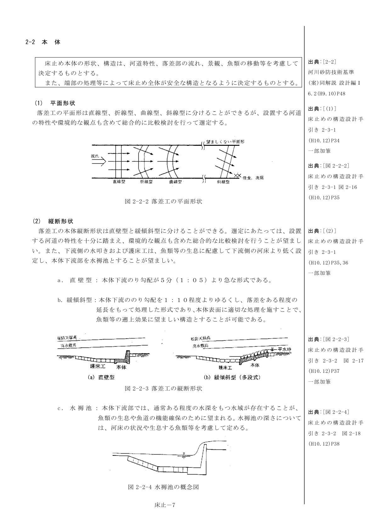

図2-2-3 落差工の縦断形状

- **c. 水褥池：** 本体下流部では、通常ある程度の水深をもつ水域が存在することが、魚類の生息や魚道の機能確保のために望まれる。水褥池の深さについては、河床の状況や生息する魚類等を考慮して定める。

図2-2-4 水褥池の概念図

**(3) 構造型式**

落差工の構造型式は、コンクリート構造と屈とう性構造とがある。構造型式の選定にあたっては、環境（生態系、景観等）や維持管理の容易さに配慮するとともに、経済性、施工性、安全性、耐久性等にも配慮すべきである。

**a. コンクリート構造**

本体をコンクリート構造物とした型式であり、落差工の一般的な構造型式である。コンクリート構造には、分離式構造と一体式構造とがある（図2-2-5参照）。分離式構造は、本体と水叩きを分離し、本体にかかる重力により、土圧、水圧等の外力に対する安定を保つ型式である。一体式構造は、本体・水叩きを鉄筋コンクリートで一体化した型式である。

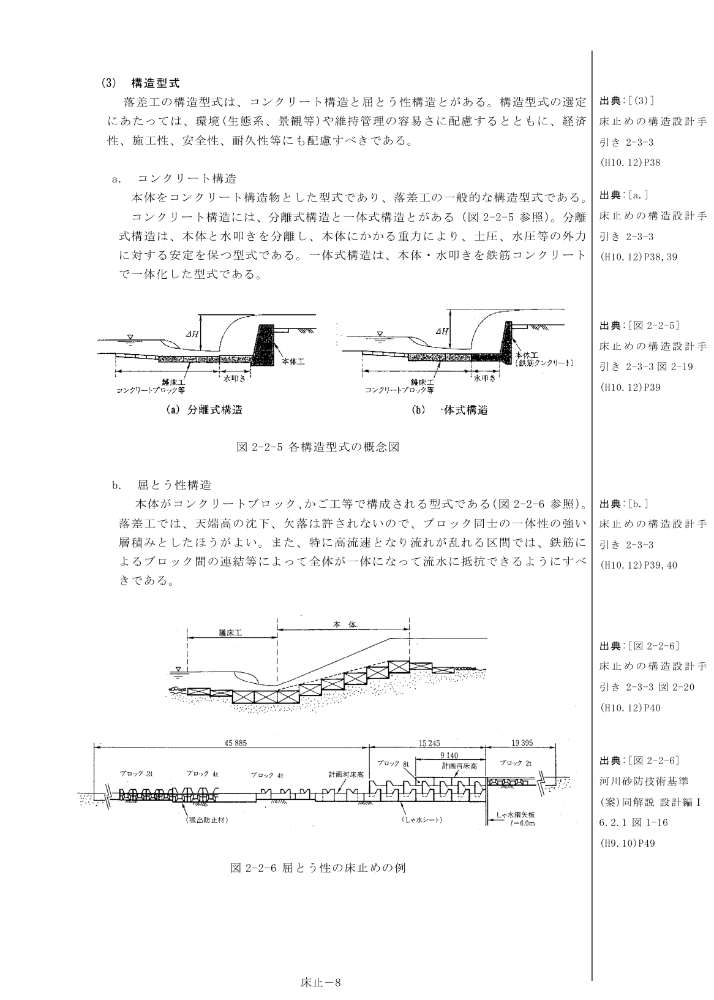

図2-2-5 各構造型式の概念図

**b. 屈とう性構造**

本体がコンクリートブロック、かご工等で構成される型式である（図2-2-6参照）。落差工では、天端高の沈下、欠落は許されないので、ブロック同士の一体性の強い層積みとしたほうがよい。また、特に高流速となり流れが乱れる区間では、鉄筋によるブロック間の連結等によって全体が一体になって流水に抵抗できるようにすべきである。

図2-2-6 屈とう性の床止めの例

#### 2-3 水叩き

水叩きは、コンクリート構造を標準とする。また、水叩きは本体を越流する水の侵食作用および下面から働く揚圧力に耐えうる構造として設計するものとする。

> **（解 説）**
>
> 床止めの被災形態としては、本体、水叩き等の下部でのパイピング現象による地盤支持力の低下、流水や転石による水叩きへの直接衝撃、流水による下流部の洗掘および堤体下部からの吸出し、揚圧力に起因する移動等が考えられる。したがって、水叩きは、洗掘等を防げる長さと揚圧力に耐える重量（厚さ）を有するものでなければならない。

#### 2-4 護床工

護床工は、床止め上下流での局所洗掘の防止等のために必要な長さと構造を有するものとし、原則として屈とう性を有する構造として設計するものとする。河状等を考慮して必要がないと認められる場合を除き、原則として床止め本体の上下流には、護床工を設けるものとする。

> **（解 説）**
>
> 護床工の工種は、床止め上下流の河床勾配、落差、洪水時の流速、平水時の流況による生態への影響、河床の地質等を勘案して選定するものとする。

#### 2-5 遮水工

遮水工は、原則として鋼矢板構造またはコンクリート構造のカットオフとし、上下流の水位差で生じる恐れのある揚圧力やパイピング作用を減殺しうる構造として設計するものとする。

> **（解 説）**
>
> 遮水工は、上下流の水位差で生じる恐れのある揚圧力やパイピング作用を減殺するために設けるものである。ただし、基盤が強固でパイピング作用により本体の安全性に問題のない場合等には、遮水工を設けなくてもよい。

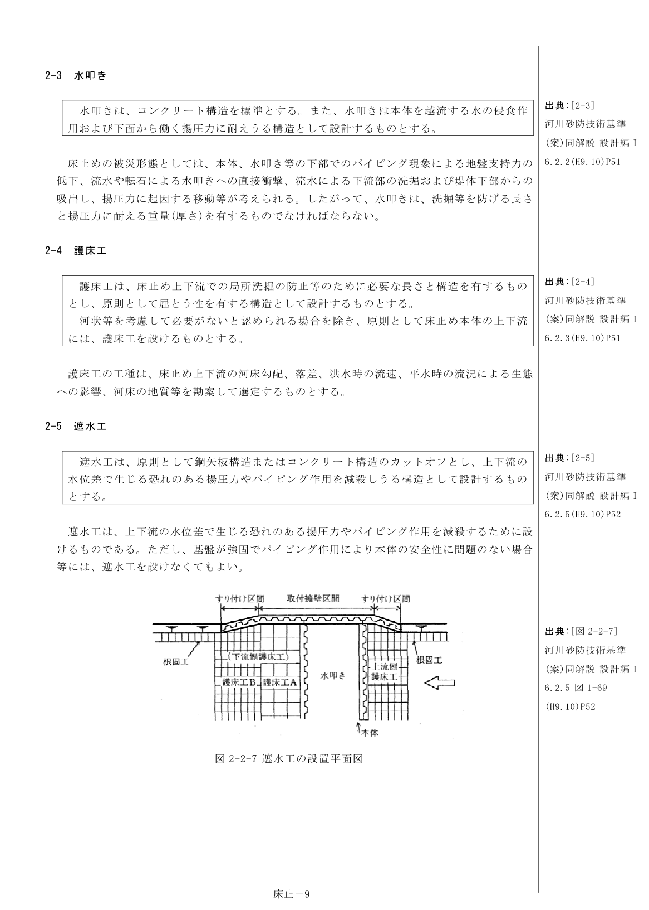

図2-2-7 遮水工の設置平面図

#### 2-6 取付擁壁・護岸

取付擁壁・護岸は、流水の作用より堤防または河岸を保護しうる構造とし、河川環境にも配慮して設計するものとする。

> **（解 説）**
>
> 床止めからの越流落下水により跳水が発生する取付区間では、特に流水の乱れが激しく、河岸部に強いせん断力が発生する。また、高水敷からの落込流による河岸侵食の恐れもあるため、この区間では強固な河岸防護工として取付擁壁を設置する必要がある。

**(1) 取付擁壁**

**a. 設置範囲**

取付擁壁の設置範囲は、下流側では跳水の発生区間を原則とする。また、上流側については、低下背水による流速増に対する安全を見込み、本体より5m程度上流までを設置範囲とすることが望ましい。

**b. 構造**

取付擁壁の構造は、堤防の機能を損なわないように自立構造を原則とする。床止め本体および水叩きと取付擁壁との接合部は絶縁し、擁壁の基礎は水叩きや護床工の底面より1m程度低い所に設けるほか、護床工下流の擁壁および護岸前面には根固工を設ける等により洗掘に備える必要がある。

取付擁壁ののり面形状は、周辺の景観等を考慮して直壁とはせず、斜面形状とする等の工夫を図ることが望ましい。

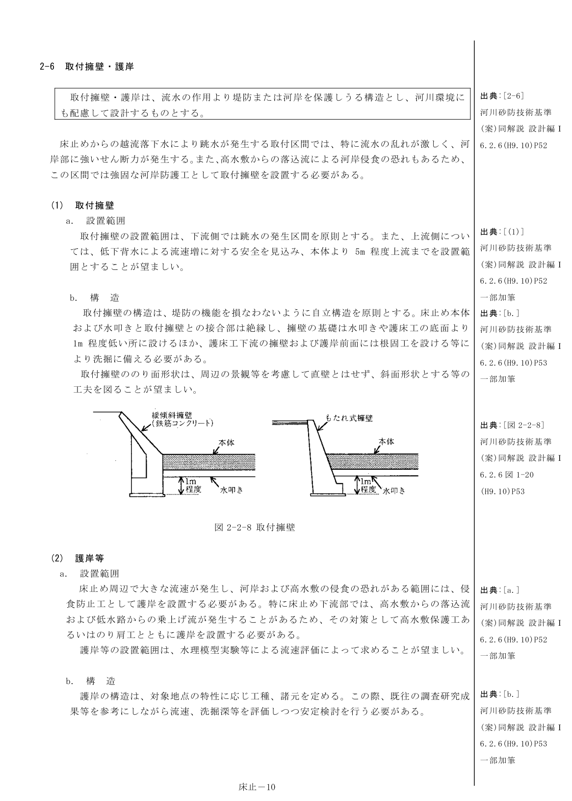

図2-2-8 取付擁壁

**(2) 護岸等**

**a. 設置範囲**

床止め周辺で大きな流速が発生し、河岸および高水敷の侵食の恐れがある範囲には、侵食防止工として護岸を設置する必要がある。特に床止め下流部では、高水敷からの落込流および低水路からの乗上げ流が発生することがあるため、その対策として高水敷保護工あるいはのり肩工とともに護岸を設置する必要がある。

護岸等の設置範囲は、水理模型実験等による流速評価によって求めることが望ましい。

**b. 構造**

護岸の構造は、対象地点の特性に応じ工種、諸元を定める。この際、既往の調査研究成果等を参考にしながら流速、洗掘深等を評価しつつ安定検討を行う必要がある。

#### 2-7 高水敷保護工

高水敷保護工は、流水の作用による高水敷の洗掘を防止しうる構造として設計するものとする。

> **（解 説）**
>
> 床止めの被災原因の1つに高水敷の侵食があげられる。これは、高水敷から低水路へ落ち込む流れや、逆に乗り上げる流れ等の床止め周辺の局所流によって生じるものである。特に、このような流れが強くなることが予想される場所では、のり肩工、高水敷保護工を設置して高水敷を保護する必要がある。
>
> 高水敷保護工の敷設範囲は、落差工の上下流護床工の位置までの長さが必要である。幅については、砂利河川の高水敷は全幅が望ましく、砂河川においても10m程度以上は必要と考えられる。また、上下流の護床工のさらに上下流に設置される護岸には、のり肩を保護するのり肩工を設ける。その幅については護岸の天端工の幅としてよい。
>
> なお、高水敷に落差ができる場合は別途検討を行うものとする。

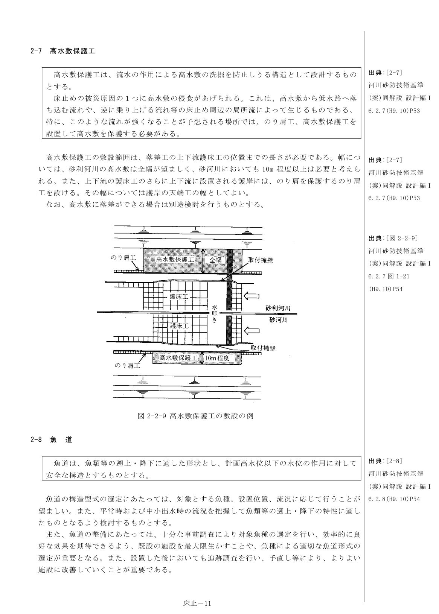

図2-2-9 高水敷保護工の敷設の例

#### 2-8 魚道

魚道は、魚類等の遡上・降下に適した形状とし、計画高水位以下の水位の作用に対して安全な構造とするものとする。

> **（解 説）**
>
> 魚道の構造型式の選定にあたっては、対象とする魚種、設置位置、流況に応じて行うことが望ましい。また、平常時および中小出水時の流況を把握して魚類等の遡上・降下の特性に適したものとなるよう検討するものとする。
>
> また、魚道の整備にあたっては、十分な事前調査により対象魚種の選定を行い、効率的に良好な効果を期待できるよう、既設の施設を最大限生かすことや、魚種による適切な魚道形式の選定が重要となる。また、設置した後においても追跡調査を行い、手直し等により、よりよい施設に改善していくことが重要である。
>
> 具体的な魚道の型式選定や設計方法等については「魚道のはなし」（中村俊六）、「魚道の設計」（ダム水源地センター）、「魚にやさしい川のかたち」（水野信彦）、「最新 魚道の設計」（ダム水源地環境整備センター）、「多自然型魚道マニュアル」（ドイツ水資源・農業土木協会）等の文献が参考となる。

#### 2-9 基礎工

基礎は、上部荷重を良質な地盤に安全に伝達する構造として設計するものとする。

> **（解 説）**
>
> 床止め本体の基礎は、直接基礎、杭基礎が一般的である。

### 3. 設計

#### 3-1 本体

床止め本体は、自重、静水圧、揚圧力、地震時慣性力、土圧等を考慮して、所定の安全率が確保されるように設計するものとする。本体はコンクリート構造を標準とし、鉄筋コンクリート構造の場合は本体と水叩きを一体として設計し、重力式構造の場合は本体と水叩きとは分離して設計を行うものとする。

##### 3-1-1 本体の構造型式

落差工には、鉄筋により本体と水叩きを一体化した一体式構造と、本体と水叩きを分離する分離式構造がある。

本体の安定計算には水叩き長が必要となる。このため、まず水叩き長を決定し、その後安定計算を行ったほうが合理的であると考えられる。

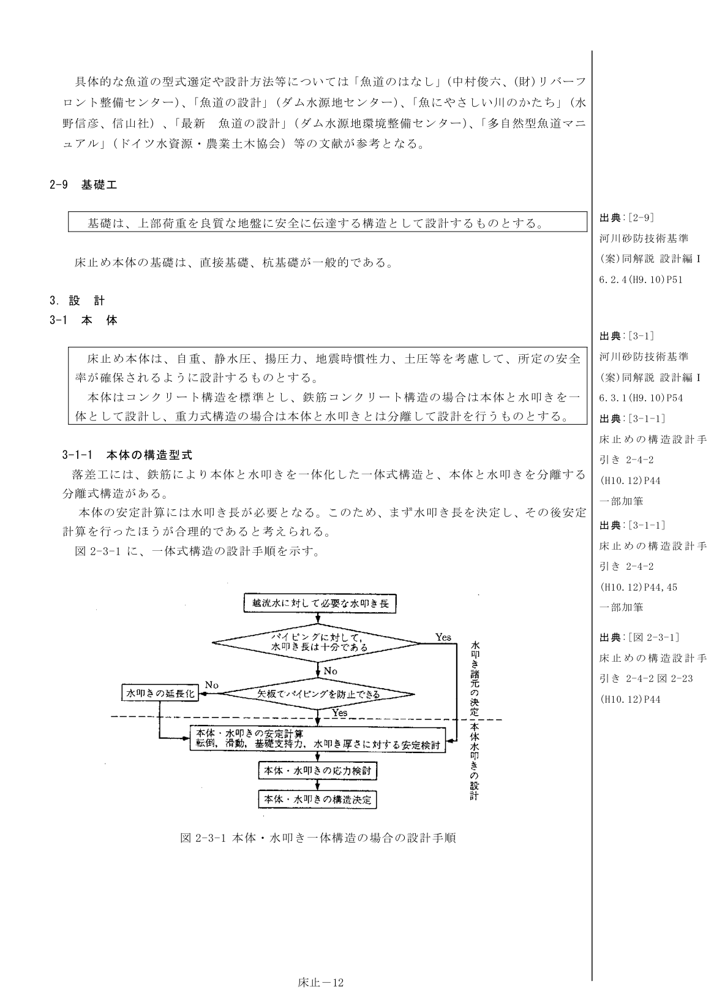

図2-3-1 本体・水叩き一体構造の場合の設計手順

##### 3-1-2 断面形

天端幅は、床止め付近の河床材料、土砂流下形態等を考慮して決定するものとする。

**(1) 型式と断面形**

直壁式の落差工の本体は、矩形または台形の断面形状が一般的に用いられている。落差があまり大きくない場合には、遊泳力の大きな魚や吸盤を有する魚等が、本体を直接遡上できる場合もあるので、必要に応じて天端の下流側の肩に丸みを付ける、のり面を流水がはく離しない程度に緩くする、等の工夫を行うことが望ましい。

**(2) 天端幅**

天端幅は主に滑動等に対する安定性から設定される。ただし、転石が多い河川に設置する場合は、流出土砂による衝撃に耐えられるとともに、通過土砂の摩耗に対して考慮する必要がある。

**(3) 本体端部の形状**

床止め本体が被災しても堤防は安全であるように、一般に床止め本体と堤防とは絶縁する。ただし、急流河川では、床止め本体の両端を堤防表のり尻まで嵌入させ、堤防とは矢板で絶縁し、仮に床止めが被災しても堤防に影響が及ばないようにすることが必要である。

なお、単断面で河床勾配が 1/100 程度の急流の掘込河道の場合には、安全のため床止め本体を河岸等に嵌入させてもよい。

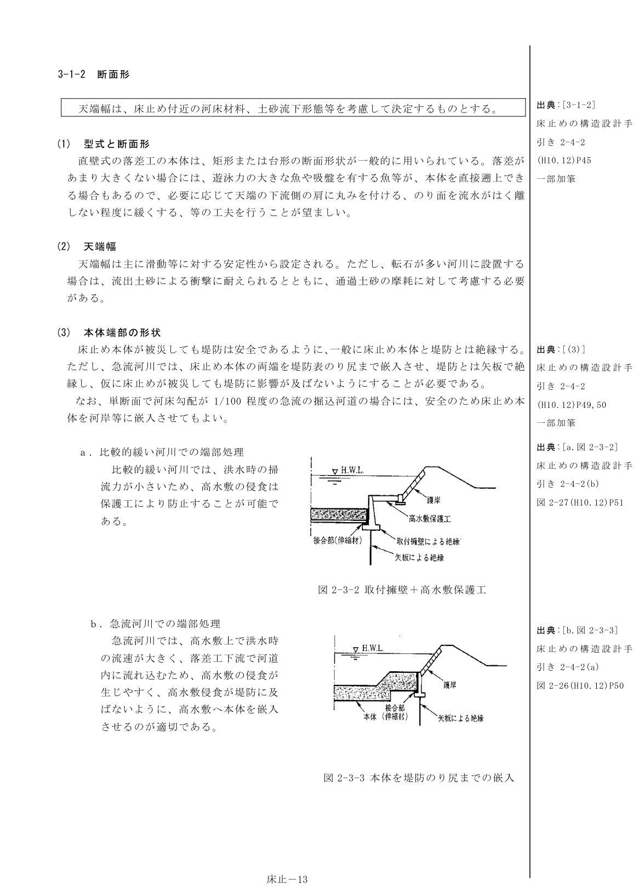

図2-3-2 取付擁壁＋高水敷保護工 / 図2-3-3 本体を堤防のり尻までの嵌入

##### 3-1-3 本体の安定計算

落差工は、転倒、滑動、地盤支持力に対して所要の安全性が確保されるよう設計を行う。

> **（解 説）**
>
> 本体工の安定計算においては、直接基礎の場合は滑動および地盤支持力について検討し、杭基礎の場合は杭の鉛直支持力と水平支持力について検討する。

**(1) 設計荷重**

設計荷重としては、自重、土圧、静水圧、揚圧力、地震時慣性力を考慮しなくてはならない。

図2-3-4 落差工の常時における荷重状態

**(2) 安全率**

基礎の地盤支持力、および本体工、取付擁壁の転倒、滑動に対しては、常時（平水時、洪水時）、地震時のそれぞれについて検討し、表2-3-1に示す安全率が確保される必要がある。ただし、地震時慣性力と洪水時における水圧は、同時には作用しないものと考える。

表2-3-1 安全率

なお、本体の基礎を杭基礎とする場合については、許容水平変位量と杭の許容曲げ応力度により設計を行う。

##### 3-1-4 基礎

基礎は、上部荷重を良質な地盤に安全に伝達できる構造として設計するものとする。

> **（解 説）**
>
> 落差工の基礎は、直接基礎、杭基礎が一般的である。直接基礎は、地盤が良好な岩、砂礫または砂等の場所で、十分な地耐力が得られる場合に採用される。

#### 3-2 水叩き

水叩きは、本体を越流する水や転石による直接衝撃による構造物の破損を防ぎ、揚圧力に対して安全な長さおよび構造とするものとする。

> **（解 説）**
>
> 水叩きの設計において、以下に基本的な考え方を示す。
>
> 1. 水叩き上では、常時ある程度の水深を確保し、魚の移動阻害となりにくい形状としたほうがよい。
> 2. 水叩き長は、越流水が落ち込む範囲を考慮した長さとしたほうがよい。
> 3. 水叩きは、流水や転石の落下衝撃に耐えられるよう、コンクリート構造としたほうがよい。

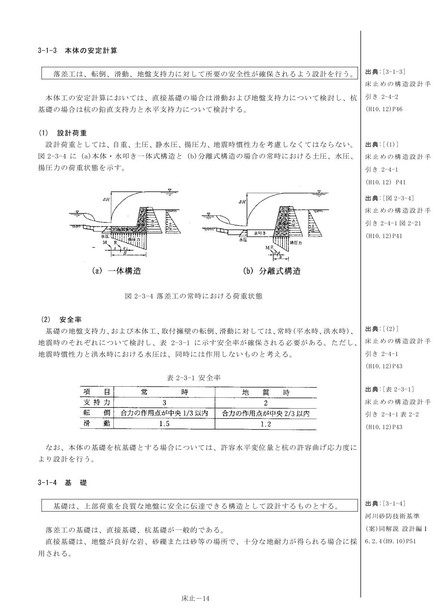

図2-3-5 水叩きの概念図

#### 3-3 遮水工

床止めの遮水工は、原則として鋼矢板構造またはコンクリート構造のカットオフとし、上下流の水位差で生じる恐れのある揚圧力やパイピング作用を減殺し得る構造として設計するものとする。

> **（解 説）**
>
> 遮水工は、上下流の水位差で生じる恐れのある揚圧力やパイピング作用を減殺するために設けるものである。
>
> 遮水工の根入れ長は、レインの式により算出する。

図2-3-6 レインの式の図

表2-3-2 クリープ比C

#### 3-4 護床工

護床工は、落差工上下流で生じる局所洗掘の防止や、高流速の減勢のために必要な長さおよび構造とし、魚類等の生息にも配慮して設計する。

**a. 下流側護床工**

下流側護床工は、洪水の作用に対して以下の点に留意し設置する。

1. 落差工下流側の護床工は、洪水時の水理現象（跳水およびその後の流れの乱れ）を考慮して、下流護床工A、Bの二つの区間に分けて考える。
2. 護床工Aの設置区間は、高流速で流れが乱れる区間であるため、構造としては、コンクリート構造もしくは護床ブロックが連結された構造とするのが望ましい。
3. 護床工Bの設置区間は、予測しきれないような上下流の河床変動に追随できるよう屈とう性構造とすることが望ましい。

> **（解 説）**
>
> 従来、下流側護床工天端高は下流側河床高と一致させていたが、以下に示すような魚等の生態系に及ぼす問題が指摘されている。
>
> 1. 下流側で河床低下が発生した場合、水が護床工中に伏流するために魚が遡上できなくなる。
> 2. 護床工を河床と水平に敷設するために、平常の水深が浅くなり魚が遡上できる水深を確保できない。

**b. 上流側護床工**

上流側護床工は、落差工直上流で生じる渦による洗掘を防ぐために設置することが望ましい。構造は、河床変動に追随できるように、屈とう性構造とすべきである。また、落差工上流の河床低下に対応できるように、上流に向けて下向きに勾配を付ける等の対応をとることが望ましい。

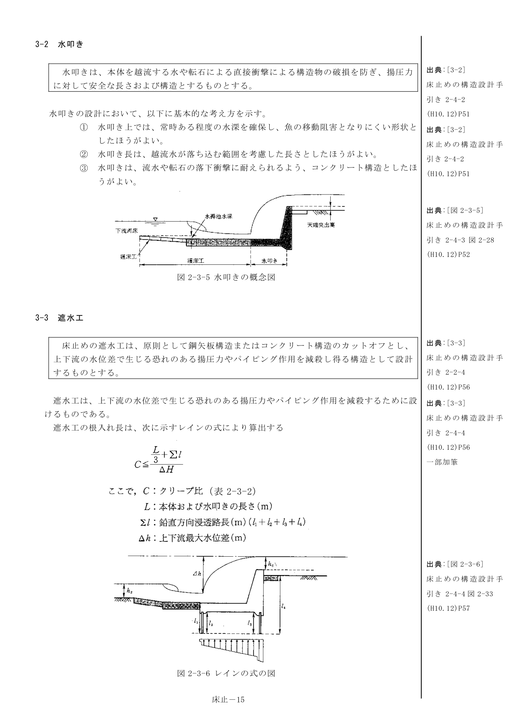

図2-3-7 護床工の概念図

#### 3-5 高水敷保護工・のり肩工

高水敷保護工・のり肩工は、高水敷から低水路へ落ち込む流れと、乗り上げる流れによって生じる洗掘現象を防止できる構造として設計する。

> **（解 説）**
>
> 床止めを複断面河道に設置する場合、落差工下流で高水敷から低水路へ落ち込む流れや、低水路から高水敷へ乗り上がる流れにより、のり肩部、高水敷が洗掘を受ける可能性がある。このため、洗掘を受ける可能性がある箇所には、高水敷保護工、のり肩工を設置するものとする。
>
> なお、ここでは高水敷部分のすり付けのために落差を設ける場合は対象としていない。落差が生じる場合は、下流側は水叩き部となるため、落下水の衝撃に耐える構造となるよう別途検討が必要である。

#### 3-6 屈とう性構造

屈とう性構造の落差工とは、コンクリートブロック等を使用して作られるものをいい、設置にあたっては、特に流水によるブロック等の安定性や、ブロック間からの土砂移動の防止に配慮して変形を防ぐとともに、落差工上の水深確保が困難となることが考えられるため、魚道を設置する等、魚等の移動のしやすさに十分配慮するものとする。

> **（解 説）**
>
> 屈とう性構造の落差工として、コンクリートブロックを使用する場合、コンクリートブロックの移動や吸出しにより変形を生じ、著しい機能低下や環境の悪化を生じるので、以下の点を十分検討する必要がある。
>
> 1. ブロック重量の算定については、乱れを伴う高流速の流れに対応できるように決定する必要がある。
> 2. ブロック下部におけるパイピング現象防止に対しては、仮想斜面勾配をクリープ比の逆数より緩くする等をして対応することができる。
> 3. ブロックの下に吸出し防止材を敷設する等をし、土砂が吸出されてブロックが沈下し、破壊されないようにする必要がある。
> 4. ブロック下の土砂が移動しないよう、ブロックおよびブロック間に栗石等の間詰めを行う。
> 5. 流水が伏流しやすいため、魚の上下流の移動に配慮する必要がある場合にはブロック間の水密性を高くするか、魚道の設置を別途考慮する。

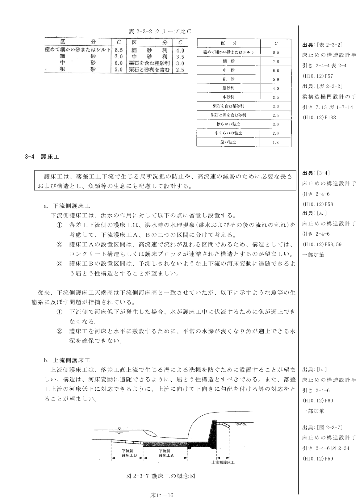

図2-3-8 ブロック構造による落差工の模式図

## 第3節 帯工（標準）

### 1. 帯工の設置

帯工は、みお筋の移動しやすい河川において、洗掘に対して橋脚、護岸等の河川構造物が安全であるように流れの集中を防止して洗掘を軽減するために設置される構造物である。

#### 1-1 本体天端

帯工の天端は水平とし、帯工上での流れを平準化して流水の集中を抑制し、それによって洗掘現象の低減効果を期待するものである。

> **（解 説）**
>
> 魚ののぼりやすさに配慮すれば、帯工天端を水平とした場合に平水時に水深を確保できなかったり、みお筋部では落差ができる場合があり、魚が上下流に移動できなくなる危険性があるため、注意を要する。
>
> 天端高は、洪水時の河積を確保しつつ、洗掘現象を極力低減させることができる高さとすべきであり、天端高は現況河床では低水路平均河床高、将来計画河道では計画における河積を確保できる河床高が目安となる。ただし、現況河道において狭窄部のため流下能力が不足している箇所や、湾曲部は、洪水時の河積確保を目的とし、平均河床高よりも低く天端高を設定する場合もある。したがって、天端高は河道特性を踏まえ、適宜検討を行い設定することが望ましい。

#### 1-2 平面形状

帯工の平面形は直線型を原則とする。

> **（解 説）**
>
> 帯工の平面形を曲線型、折線型とした場合、帯工下流で流れが河道の中心に集中し、洗掘が生じやすく、洗掘箇所の下流は堆積箇所となる。この箇所で分散した流れは河岸へ向かうため、河岸防御の観点からは、直線型としたほうがよい。

#### 1-3 縦断形状

帯工の縦断形状は、洗掘を防止できるような形状、配置とする必要がある。

> **（解 説）**
>
> 通常帯工が設置されるような河道では、河床が平坦でなく、砂州の動きにより起伏がある形態となっている。したがって、帯工天端は横断的に突出、埋没した箇所が生じる。また、設置場所の河道特性によって、突出、埋没する位置が洪水ごとに変化することになる。このような状態により、帯工の縦断形状は、横断的にどの箇所が突出しても安全である形状としたほうがよい。

#### 1-4 構造

帯工は、屈とう性があり、補修および改修が容易な構造としたほうがよい。

> **（解 説）**
>
> 帯工本体の形式としては、コンクリート構造物とする型式と、屈とう性を有するコンクリートブロック等を用いた簡易的な型式とがある。構造型式の選定は、以下の考え方に留意して決定するのがよい。
>
> 1. 帯工は、河岸防御、橋脚保護等のために、洗掘を防止することを目的として設置される構造物である。
> 2. 河道の状態が経年的に変化することや、将来的な河道計画の見直し等を考慮すると、帯工はコンクリート構造の永久構造物として設計するよりは、簡易的な構造とし、河床変動の状況に応じて改修していくのが合理的と考えられる。
> 3. 将来河床低下が発生し、帯工下流で落差が発生する場合は、そのときに落差工へ改築すればよく、帯工は仮設的なものと考えるべきである。
> 4. 帯工の本体は、簡易的な構造としたほうがよい。ただし、簡易的な構造であっても、流体力に対して安定であるべきである。
> 5. 急流河川において、本体を屈とう性とした構造では洪水時の流速に対して安全を確保できない場合、コンクリート構造として設計する方がよい。
> 6. コンクリート構造とする場合は、上下流で局所洗掘を発生させる危険性があるため、護床工により上下流河床との緩衝区間を設けたほうがよい。
> 7. コンクリートブロック等の屈とう性構造では、魚の移動という観点からは透過性であることが問題となる。平水時には水が伏流し、魚が移動するための水深を帯工天端で確保できない危険性がある。したがって、帯工本体部には必要に応じて遮水工を設けたほうがよい。

**(1) 屈とう性構造の設計**

構造的には、本体、護床工の区分はない。ただし、縦断的にブロック敷設範囲の中央部には、水平となる区間を設けるべきである。この水平区間の長さについては、特に決まりはない。通常は4～6m程度確保すればよいと考えられる。また、コンクリートブロックは、洪水時の流速に耐え得るようなブロックの種類、重量、積み方とする必要がある。

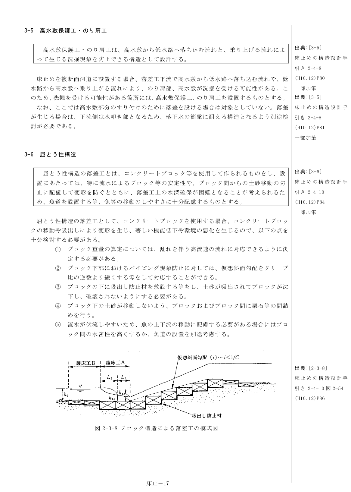

図3-1-1 屈とう性構造の帯工縦断図

**(2) コンクリート構造の設計**

コンクリート構造では、天端幅は0.5m程度を最小とし、主に滑動等に対する安定性から設定するものとする。本体の根入れは、最深河床高よりも1m以上行ったほうがよい。

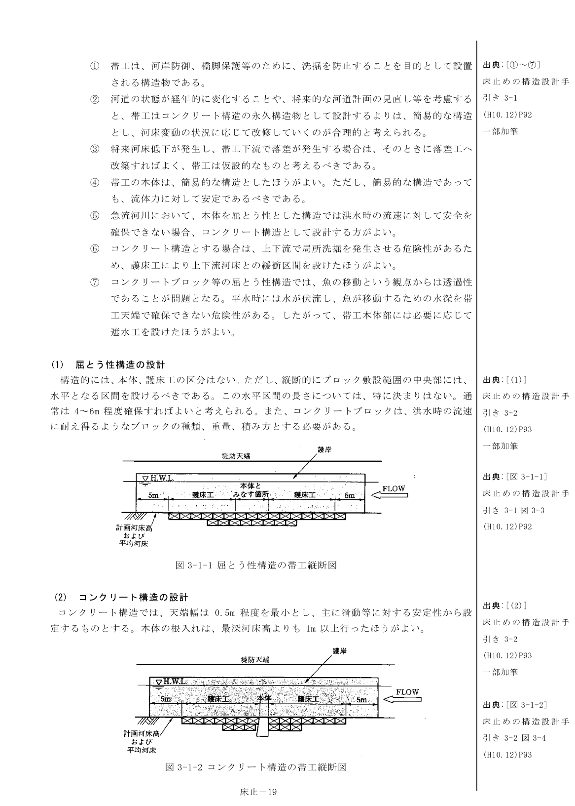

図3-1-2 コンクリート構造の帯工縦断図

### 2. 護床工

#### 2-1 護床工の考え方

帯工には、本体のみでは上下流河床となじむ緩衝区間がないために、本体が被災を受ける危険性があり、この緩衝区間での河床変動に追随できるような屈とう性構造の護床工を設置する。

> **（解 説）**
>
> 屈とう性構造の材料としては、コンクリートブロック、ふとんかご等がある。ふとんかご等のかご類を設置する場合は、経年的な劣化や摩耗および洪水時の流水の作用に対して、耐久性をあらかじめ考慮しておくものとする。

### 3. 護岸

洪水時には、みお筋に沿った主流が帯工上で分散した流れとなり、分散した流れの一部は河岸へ向かう。また、帯工下流で河床低下が発生した場合、洪水流速が増大するので、河岸を保護するための護岸を設置する。

> **（解 説）**
>
> 帯工の設置により必要となる護岸の敷設範囲は、帯工上下流の護床工からさらに5m程度長く設置する。

{/* <!-- 図・表のページ対応表
=== 第4章 床止め ===
[図]
k04-fig-01.png: 図2-1-1 砂州が移動しない場合の湾曲部の横断形状 (p4)
k04-fig-02.png: 図2-1-2 床止め工の設計手順 (p5)
k04-fig-03.png: 図2-1-3 落差工上流での河床低下による水面勾配の変化 (p6)
k04-fig-04.png: 図2-1-4 天端の切欠き概念図 (p7)
k04-fig-05.png: 図2-2-1 落差工を構成する構造物 (p7)
k04-fig-06.png: 図2-2-2 落差工の平面形状 (p8)
k04-fig-07.png: 図2-2-3 落差工の縦断形状 (p8)
k04-fig-08.png: 図2-2-4 水褥池の概念図 (p8)
k04-fig-09.png: 図2-2-5 各構造型式の概念図 (p9)
k04-fig-10.png: 図2-2-6 屈とう性の床止めの例 (p9)
k04-fig-11.png: 図2-2-7 遮水工の設置平面図 (p10)
k04-fig-12.png: 図2-2-8 取付擁壁 (p11)
k04-fig-13.png: 図2-2-9 高水敷保護工の敷設の例 (p12)
k04-fig-14.png: 図2-3-1 本体・水叩き一体構造の場合の設計手順 (p13)
k04-fig-15.png: 図2-3-2/図2-3-3 本体端部の形状 (p14)
k04-fig-16.png: 図2-3-4 落差工の常時における荷重状態 (p15)
k04-fig-17.png: 図2-3-5 水叩きの概念図 (p16)
k04-fig-18.png: 図2-3-6 レインの式の図 (p16)
k04-fig-19.png: 図2-3-7 護床工の概念図 (p17)
k04-fig-20.png: 図2-3-8 ブロック構造による落差工の模式図 (p18)
k04-fig-21.png: 図3-1-1 屈とう性構造の帯工縦断図 (p20)
k04-fig-22.png: 図3-1-2 コンクリート構造の帯工縦断図 (p20)

[表]
k04-tbl-01.png: 表1-3-1 示方書等の名称 (p2)
k04-tbl-02.png: 表2-3-1 安全率 (p15)
k04-tbl-03.png: 表2-3-2 クリープ比C (p17)
--> */}
