## 第1節 基本事項

### 1. 適用範囲

> 海岸計画は、海岸災害の防止、海岸域の利用、海岸環境の保全を目的に、「海岸法 第23条」に規定する海岸整備計画を都道府県知事が作成し、主務大臣に提出ないし関係海岸管理者と協議する際に必要な事項を定めるものであり、本章は、海岸保全区域における海岸保全施設の設計についての概要を示すものである。

### 2. 適用基準等

表1-2-1 示方書等の名称

| 指針・要綱等 | 発行年月日 | 発刊者 |
|---|---|---|
| 海岸保全施設の技術上の基準・同解説 | 平成16年6月 | 海岸保全施設技術研究会 |
| 河川砂防技術基準 同解説 計画編 | 平成17年11月 | 日本河川協会 |
| 河川砂防技術基準（案）同解説 設計編II | 平成9年10月 | 〃 |
| 緩傾斜堤の設計の手引き | 平成18年1月 | 全国海岸協会 |
| 人工リーフ設計の手引き | 平成16年3月 | 〃 |

### 3. 設計のフローチャート

各種海岸保全施設の詳細設計にいたる一般的な設計のフローチャートとして図1-3-1 に示す。

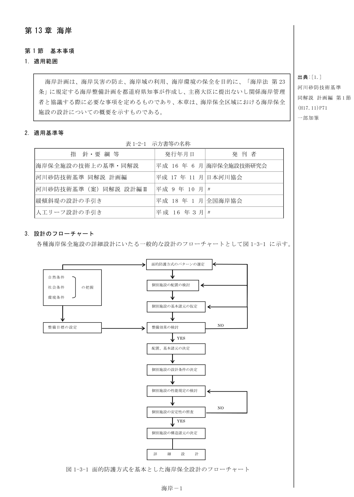

図1-3-1 面的防護方式を基本とした海岸保全設計のフローチャート

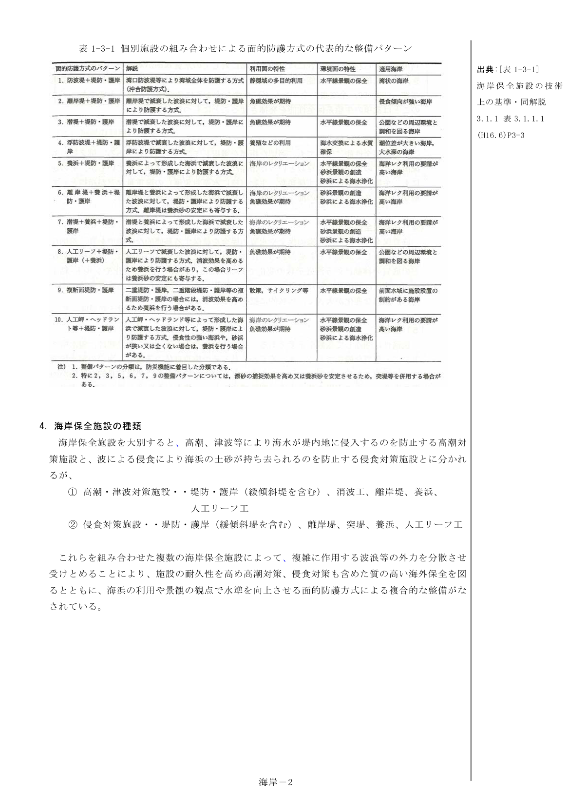

表1-3-1 個別施設の組み合わせによる面的防護方式の代表的な整備パターン

### 4. 海岸保全施設の種類

海岸保全施設を大別すると、高潮、津波等により海水が堤内地に侵入するのを防止する高潮対策施設と、波による侵食により海浜の土砂が持ち去られるのを防止する侵食対策施設とに分かれる。

1. **高潮・津波対策施設** — 堤防・護岸（緩傾斜堤を含む）、消波工、離岸堤、養浜、人工リーフ工
2. **侵食対策施設** — 堤防・護岸（緩傾斜堤を含む）、離岸堤、突堤、養浜、人工リーフ工

これらを組み合わせた複数の海岸保全施設によって、複雑に作用する波浪等の外力を分散させ受けとめることにより、施設の耐久性を高め高潮対策、侵食対策も含めた質の高い海岸保全を図るとともに、海浜の利用や景観の観点で水準を向上させる面的防護方式による複合的な整備がなされている。

### 5. 海岸保全施設の設計にあたっての留意事項

> 海岸保全施設の配置に当たっては、施設の機能が十分発揮されるように効果的に配置するように努めるものとする。また、設計に当たっては、自然環境の保全及び景観に留意するものとし、できるだけ海岸の水質保全機能、生態系保全機能及び底質保全機能に配慮するものとする。合わせて、海岸の利用に配慮した工法を選択するものとする。

**(1) 面的防護方式の検討**

面的防護方式は、護岸、砂浜、離岸堤、潜堤・人工リーフ等の海岸保全施設を面的な広がりをもって適切に配置することにより、波浪等の外力を沖合から徐々に弱めながら海岸を防御する方式である。面的防護方式は二重、三重の防護方式を採用しているため、一つの防護施設の破壊が直ちに背後地の大災害につながらないという利点を有する。

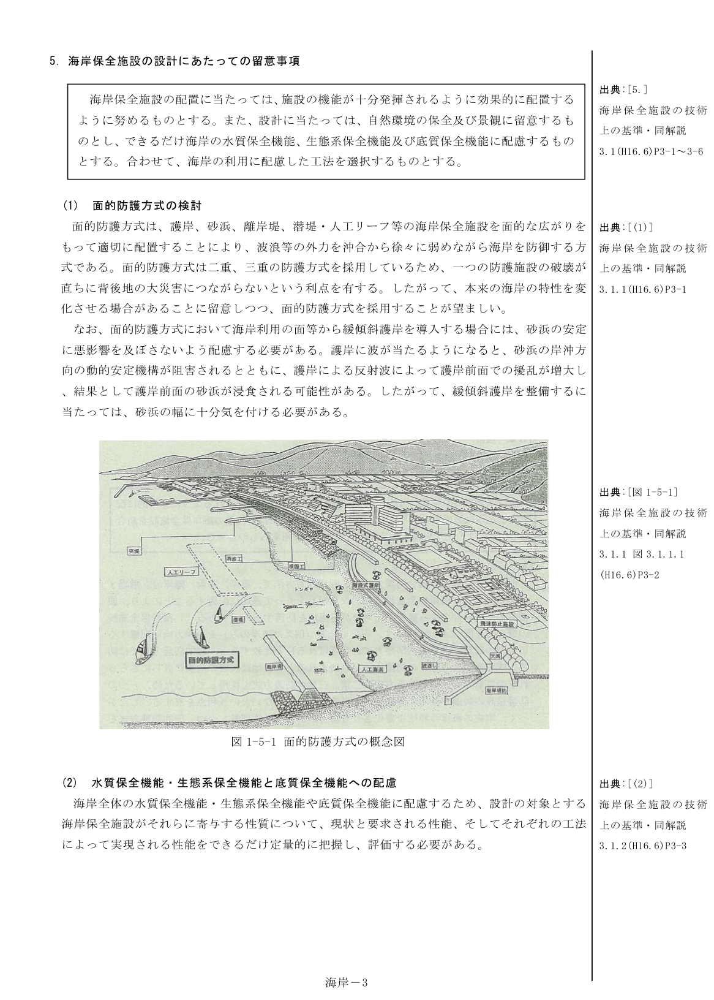

図1-5-1 面的防護方式の概念図

**(2) 水質保全機能・生態系保全機能と底質保全機能への配慮**

海岸全体の水質保全機能・生態系保全機能や底質保全機能に配慮するため、設計の対象とする海岸保全施設がそれらに寄与する性質について、現状と要求される性能、そしてそれぞれの工法によって実現される性能をできるだけ定量的に把握し、評価する必要がある。

**(3) 景観への配慮**

快適性に関連して景観が重要である。その海岸の持つ本来の開放感や美しさを損なわないことや、施設の本来の機能美を考慮すること、背後地を含めた広域的な景観に配慮することなどが必要である。

**(4) 利便性と快適性**

海岸においては様々な利用形態があり、それぞれの利用について、利便性や快適性は異なり、また対象とする人によっても異なることに注意する必要がある。

**(5) 利用者の安全**

海岸の利用は、基本的には自由使用であり、自己責任において誰でも自由に利用することができる。公衆の利用を前提とする場合、あるいは想定される場合には、海岸保全施設が厳しい自然条件の下に置かれることに留意し、海岸保全施設に起因する事故が発生しないように、利用者の安全に十分配慮して設計する。

**(6) 性能規定**

性能規定においては、「目的」、「機能」、「性能」及び「照査法」を定めることが必要である。ここで、「機能」とは、例えば、高潮又は津波による海水の浸入を防止し、波浪による越波を減少させるといった施設が担うべき働きのことであり、「性能」とは、これらの機能の実現に寄与する施設の能力のことである。

## 第2節 堤防および護岸（標準）

### 1. 定義

> ここで堤防とは、現地盤を盛土、またはコンクリート打設等によって増高し、高潮、津波による海水の侵入を防止し、波浪による越波を減少させるとともに、陸域が侵食されるのを防止する施設をいい、護岸は構造物の天端高が現地盤より低い場合をいう。

### 2. 型式

> 堤防および護岸の型式には、表のり勾配、構造、使用材料等により種々考えられるが、選定にあたっては、水理的条件、基礎地盤の土質、築堤材料、用地条件、利用状況、施工期間等を総合的に検討し、安全かつ機能的な型式を選定しなければならない。

表2-2-1 堤防および護岸の型式

| 型式 | 表のり勾配 | 堤防および護岸に共通する型式 | 主として護岸に用いられる型式 |
|---|---|---|---|
| 傾斜堤 | 1:1.0～1:3.0 | 石張り式、コンクリートブロック張り式、コンクリート被覆式等 | 捨石式、捨ブロック式等 |
| 緩傾斜堤 | 1:3.0より緩 | コンクリートブロック張り式 | — |
| 直立堤 | 1:1.0より急 | 石積み式、重力式、扶壁式等 | 突型式（L型式を含む）、ケーソン式、コンクリートブロック積み式、セル式、矢板式、石砕式等 |
| 混成堤 | 上部1:1.0より急、下部1:1.0より緩等 | 上記の組合わせ | 上記の組合わせ |

### 3. 堤防および護岸各部の名称とその機能

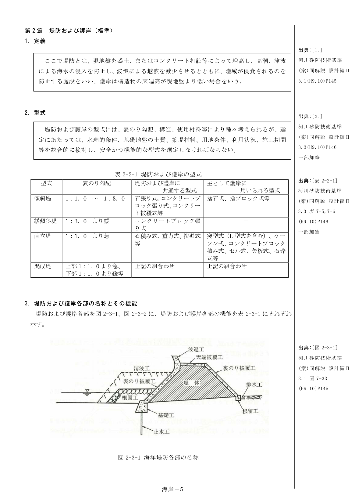

図2-3-1 海洋堤防各部の名称

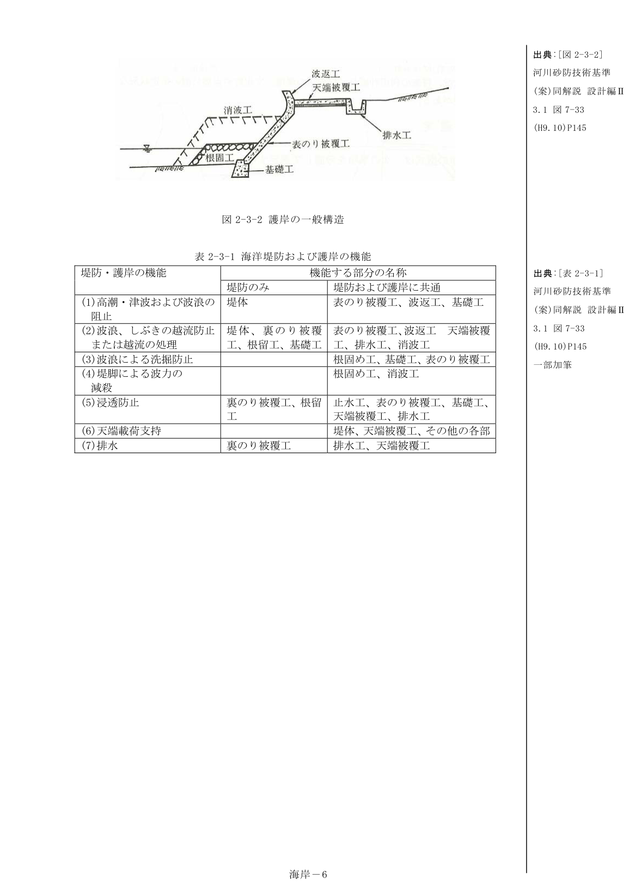

図2-3-2 護岸の一般構造

表2-3-1 海洋堤防および護岸の機能

### 4. 設計手順

> 堤防及び護岸の設計に当たっては、所定の機能が発揮されるよう、堤防及び護岸の型式、天端高、天端幅、法勾配及び法線を定めるものとする。

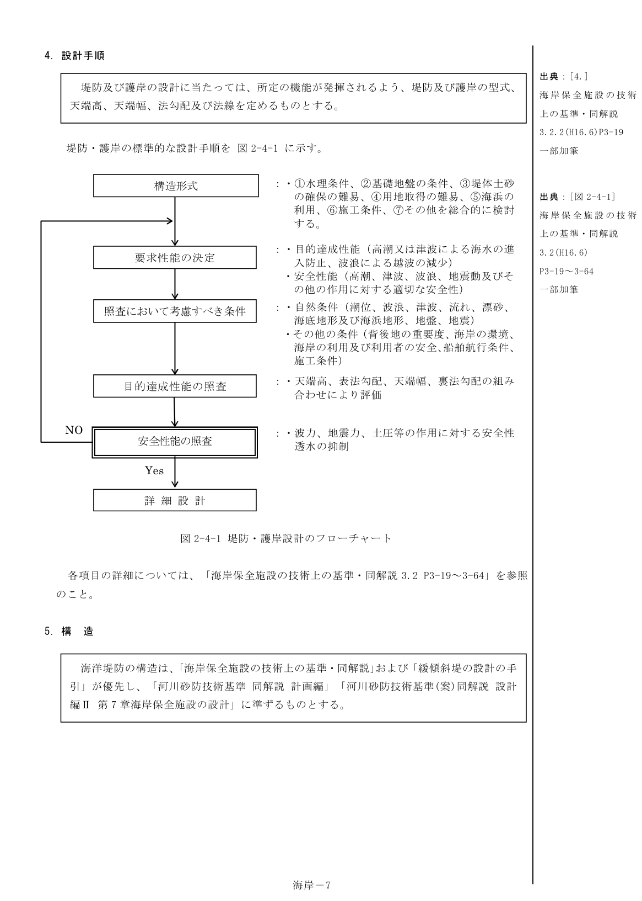

図2-4-1 堤防・護岸設計のフローチャート

各項目の詳細については、「海岸保全施設の技術上の基準・同解説3.2 P3-19～3-64」を参照のこと。

### 5. 構造

> 海洋堤防の構造は、「海岸保全施設の技術上の基準・同解説」および「緩傾斜堤の設計の手引」が優先し、「河川砂防技術基準 同解説 計画編」「河川砂防技術基準(案)同解説 設計編II 第7章海岸保全施設の設計」に準ずるものとする。

## 第3節 突堤（標準）

### 1. 定義

> 突堤は、主として沿岸漂砂が卓越する海岸において、海岸から細長く突出して設けられるものであり、沿岸漂砂を制御することによって汀線の維持あるいは前進をはかることを目的とした構造物である。

### 2. 型式

> 突堤の型式は、原則として透過性および横断面形状を検討し選定するものとする。

**(1) 透過性による分類**

突堤は、透過型と不透過型に大別でき、一般に用いられている構造の種類は表3-2-1 のとおりである。

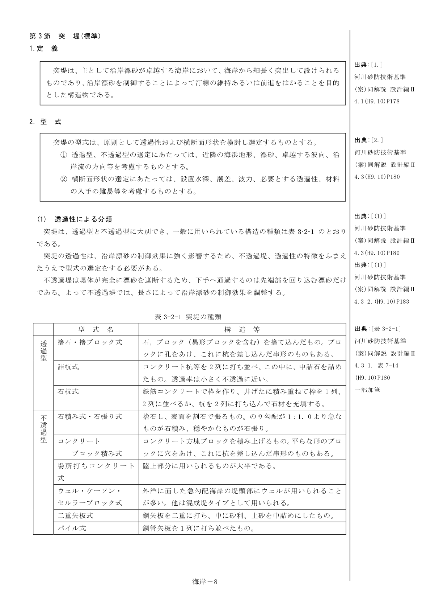

表3-2-1 突堤の種類

**(2) 横断面形による分類**

表3-2-2 横断面形による突堤の分類

| 横断面形 | 斜面勾配 | 突堤の分類 |
|---|---|---|
| 直立型 | 鉛直～1:1.0 | 石積み式、コンクリートブロック積み式、ケーソン式、セルラーブロック式、ウェル式、石枠式 等 |
| 傾斜型 | 1:1.0より穏やか | 石張り式、捨石式、捨ブロック式 等 |

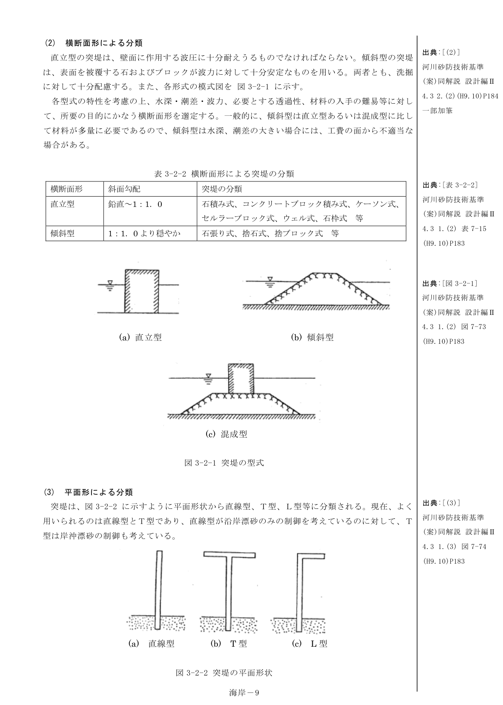

図3-2-1 突堤の型式

**(3) 平面形による分類**

突堤は、平面形状から直線型、T型、L型等に分類される。現在、よく用いられるのは直線型とT型であり、直線型が沿岸漂砂のみの制御を考えているのに対して、T型は岸沖漂砂の制御も考えている。

図3-2-2 突堤の平面形状

**(4) ヘッドランド工法**

ヘッドランド工法は、大規模な突堤や離岸堤等の海岸構造物によって静的あるいは動的に安定な海浜を形成する工法、およびヘッド部付突堤等の人工岬によってポケットビーチ的に安定な海浜を形成する工法である。

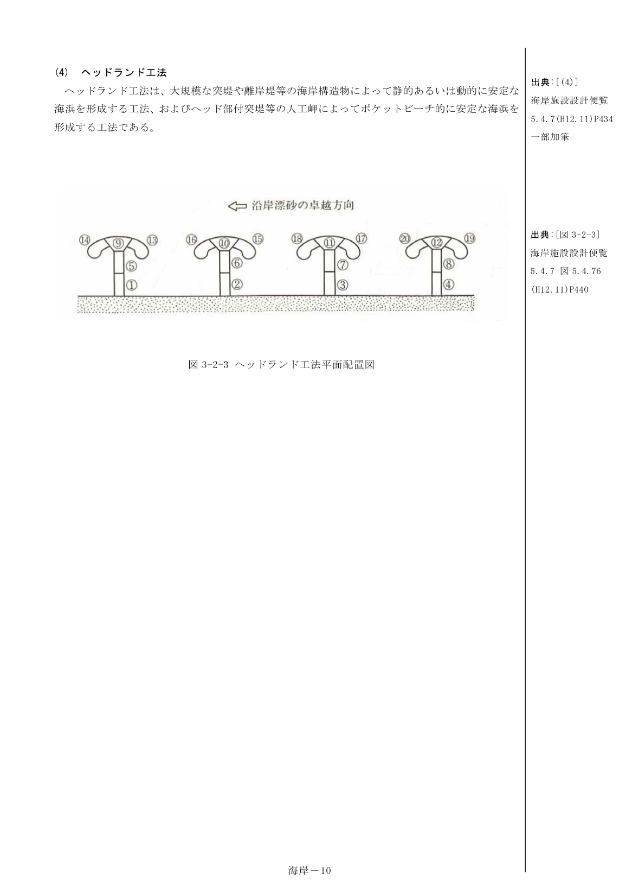

図3-2-3 ヘッドランド工法平面配置図

### 3. 設計手順

> 突堤の設計に当たっては、所定の機能が発揮されるよう、突堤の型式、天端高、長さ及び方向並びに突堤相互の間隔を定めるものとする。

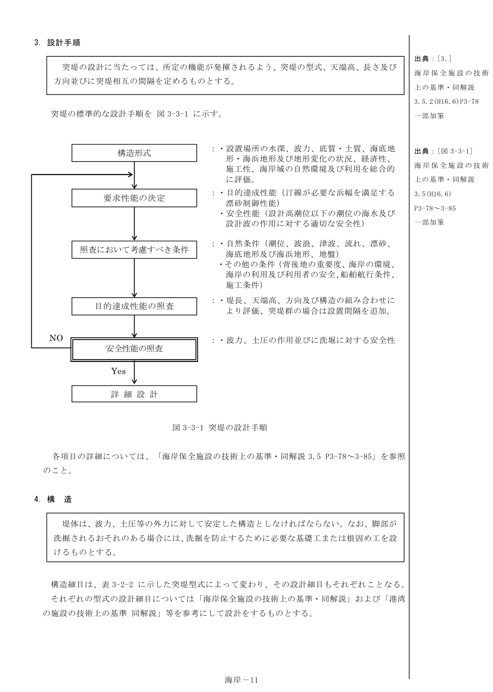

図3-3-1 突堤の設計手順

各項目の詳細については、「海岸保全施設の技術上の基準・同解説3.5 P3-78～3-85」を参照のこと。

### 4. 構造

> 堤体は、波力、土圧等の外力に対して安定した構造としなければならない。なお、脚部が洗掘されるおそれのある場合には、洗掘を防止するために必要な基礎工または根固め工を設けるものとする。

構造細目は、表3-2-2 に示した突堤型式によって変わり、その設計細目もそれぞれことなる。それぞれの型式の設計細目については「海岸保全施設の技術上の基準・同解説」および「港湾の施設の技術上の基準 同解説」等を参考にして設計をするものとする。

## 第4節 離岸堤（標準）

### 1. 基本事項

#### 1-1 定義

> 離岸堤は、汀線から離れた沖側に、汀線にほぼ平行に設置される構造物であり、消波、または波高減衰を目的とするもの、その背後に砂を貯え侵食防止や海浜の造成をはかることを目的とするものがある。

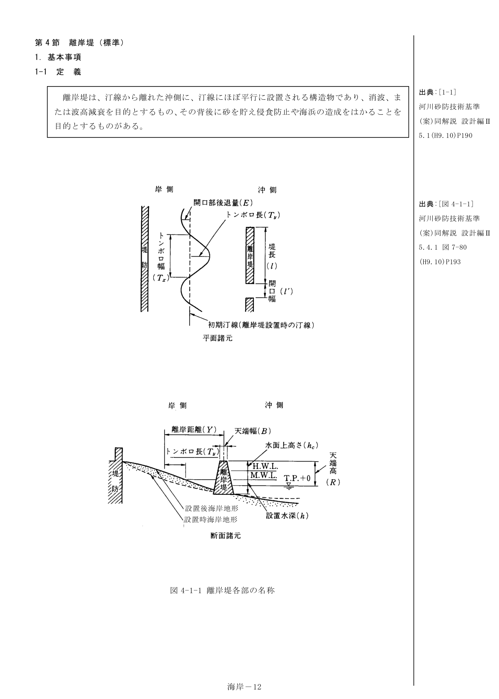

図4-1-1 離岸堤各部の名称

#### 1-2 離岸堤の機能

> 離岸堤の機能としては、次のもの等が挙げられる。
>
> 1. 入射波のエネルギーを減勢させる。
> 2. 波高の減衰効果により、波形勾配を小さくして、侵食型から堆積型の波に変える。
> 3. 波高の減衰効果により、沿岸漂砂量を減少させる。
> 4. 上記の効果により、トンボロを発生させて海浜の造成を図る。

図4-1-2 トンボロが形成される状態の例

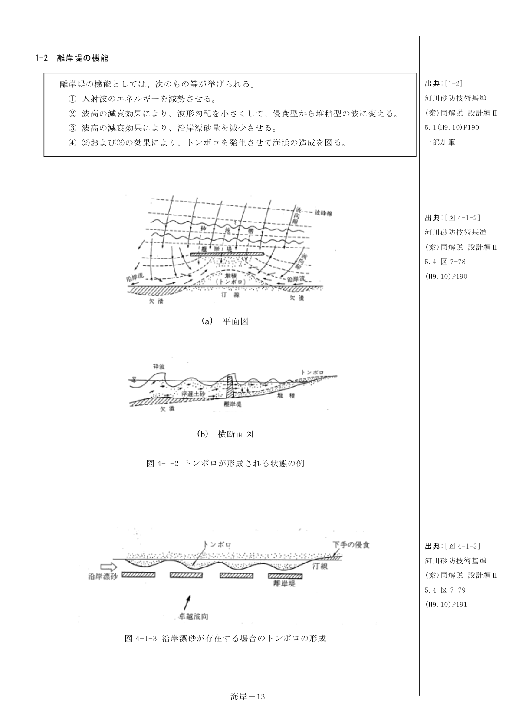

図4-1-3 沿岸漂砂が存在する場合のトンボロの形成

### 2. 型式の選定

> 離岸堤の型式の選定にあたっては、突堤に準ずるものとする。

### 3. 設計手順

> 離岸堤の設計に当たっては、所定の機能が発揮されるよう、離岸堤の型式、天端高、天端幅、長さ及び汀線からの距離並びに離岸堤相互の間隔を定めるものとする。

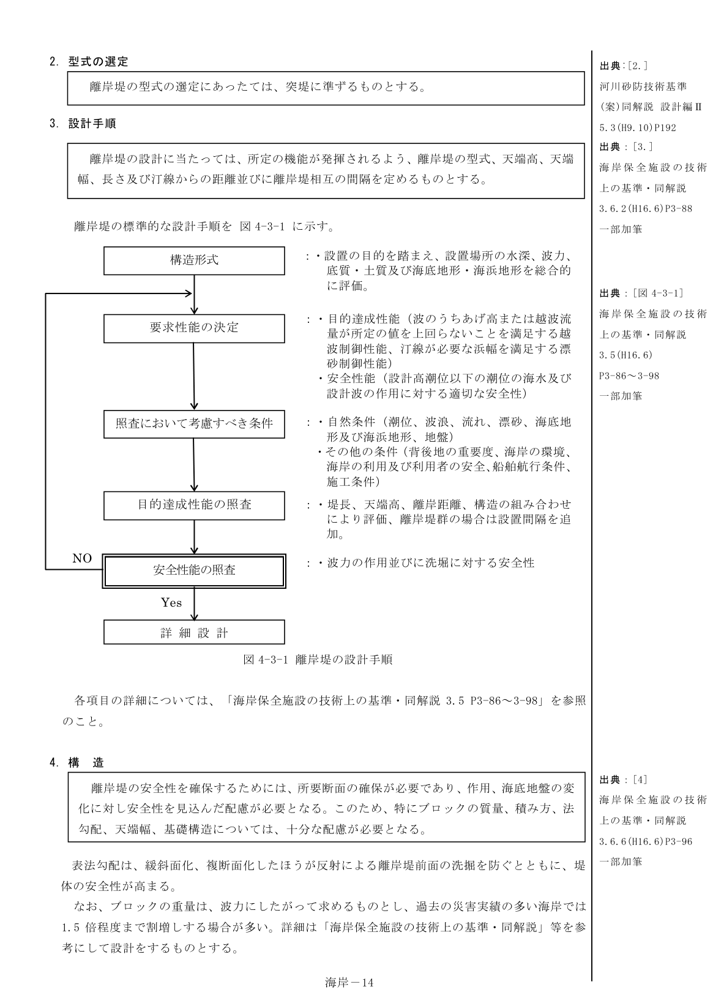

図4-3-1 離岸堤の設計手順

各項目の詳細については、「海岸保全施設の技術上の基準・同解説3.5 P3-86～3-98」を参照のこと。

### 4. 構造

> 離岸堤の安全性を確保するためには、所要断面の確保が必要であり、作用、海底地盤の変化に対し安全性を見込んだ配慮が必要となる。このため、特にブロックの質量、積み方、法勾配、天端幅、基礎構造については、十分な配慮が必要となる。

表法勾配は、緩斜面化、複断面化したほうが反射による離岸堤前面の洗掘を防ぐとともに、堤体の安全性が高まる。なお、ブロックの重量は、波力にしたがって求めるものとし、過去の災害実績の多い海岸では 1.5 倍程度まで割増しする場合が多い。

## 第5節 人工リーフ工（標準）

### 1. 定義

> 人工リーフ工は、自然のサンゴ礁の形態を捨石等の材料を用いて珊瑚礁が高波を砕波、減衰する現象を再現したもので、景観を損なうことなしに波浪の静穏化、海浜の緩勾配化および沿岸漂砂の制御を行い、安定した海浜の形成や海浜でのレクリエーションの促進を図ろうとするものである。

具体的な設置目的は、次のとおりである。

1. 打上高、越波量、あるいは飛沫量を減少させる。
2. 沿岸漂砂量を減少させる。
3. 人工リーフ工の岸側に砂を堆砂させて汀線を前進させる。
4. 人工リーフ工の岸側の砂が沖向きに流出するのを防止する。

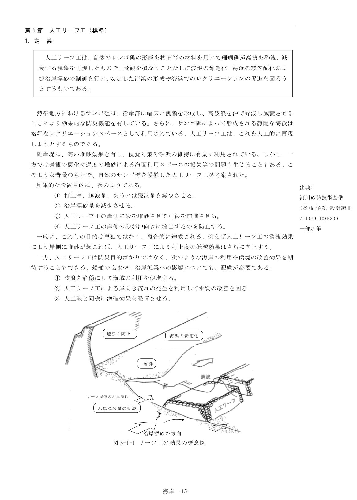

図5-1-1 リーフ工の効果の概念図

### 2. 基本事項

> 基本事項の考え方等は「海岸保全施設の技術上の基準・同解説」および「人工リーフの設計の手引き」に準ずるものとする。

### 3. 設計手順

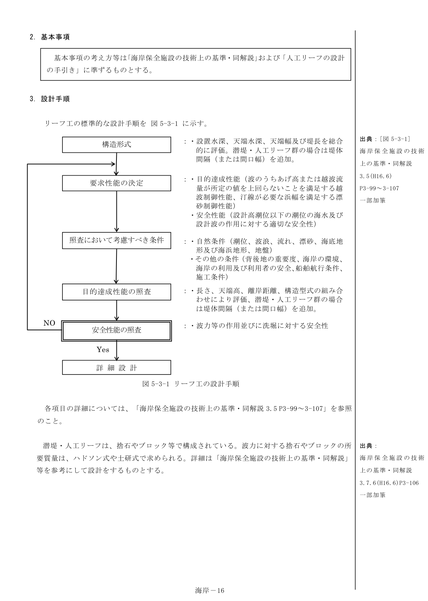

図5-3-1 リーフ工の設計手順

各項目の詳細については、「海岸保全施設の技術上の基準・同解説3.5 P3-99～3-107」を参照のこと。

潜堤・人工リーフは、捨石やブロック等で構成されている。波力に対する捨石やブロックの所要質量は、ハドソン式や土研式で求められる。詳細は「海岸保全施設の技術上の基準・同解説」等を参考にして設計をするものとする。

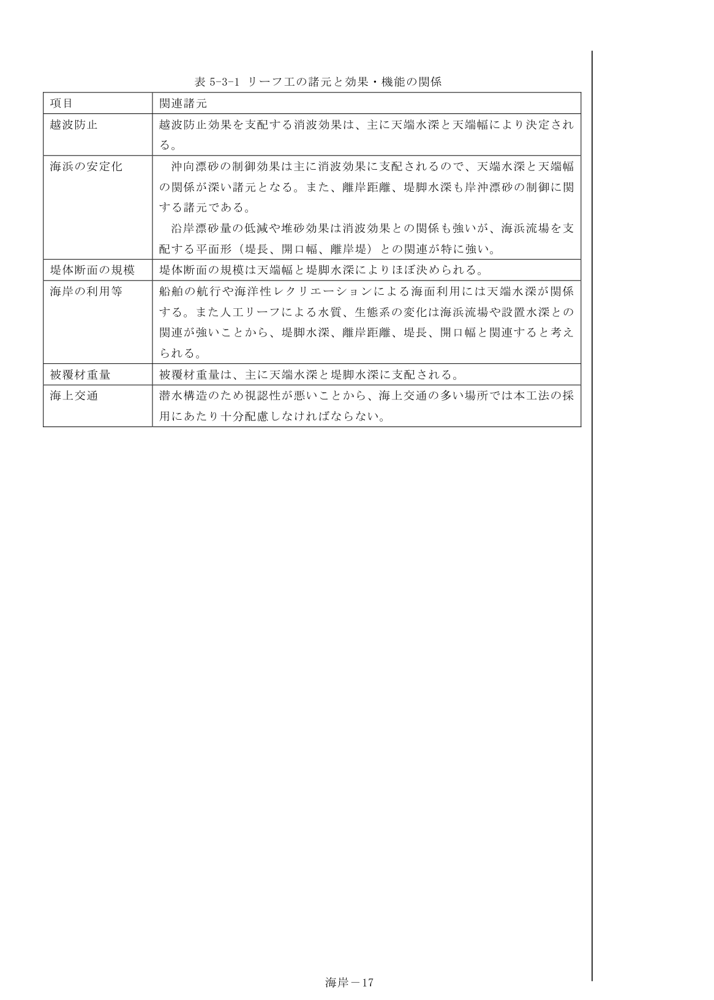

表5-3-1 リーフ工の諸元と効果・機能の関係

{/* 図・表のページ対応表
| 種別 | ファイル名 | 原本ページ |
|---|---|---|
| 図1-3-1 設計のフローチャート | k13-fig-01.png | P2 |
| 表1-3-1 面的防護方式の整備パターン | k13-tbl-01.png | P3 |
| 図1-5-1 面的防護方式の概念図 | k13-fig-02.png | P4 |
| 図2-3-1 海洋堤防各部の名称 | k13-fig-03.png | P6 |
| 図2-3-2 護岸の一般構造 | k13-fig-04.png | P7 |
| 表2-3-1 海洋堤防・護岸の機能 | k13-tbl-02.png | P7 |
| 図2-4-1 堤防・護岸設計のフローチャート | k13-fig-05.png | P8 |
| 表3-2-1 突堤の種類 | k13-tbl-03.png | P9 |
| 図3-2-1 突堤の型式 | k13-fig-06.png | P10 |
| 図3-2-2 突堤の平面形状 | k13-fig-07.png | P10 |
| 図3-2-3 ヘッドランド工法平面配置図 | k13-fig-08.png | P11 |
| 図3-3-1 突堤の設計手順 | k13-fig-09.png | P12 |
| 図4-1-1 離岸堤各部の名称 | k13-fig-10.png | P13 |
| 図4-1-2 トンボロの例 | k13-fig-11.png | P14 |
| 図4-1-3 沿岸漂砂のトンボロ | k13-fig-12.png | P14 |
| 図4-3-1 離岸堤の設計手順 | k13-fig-13.png | P15 |
| 図5-1-1 リーフ工の効果の概念図 | k13-fig-14.png | P16 |
| 図5-3-1 リーフ工の設計手順 | k13-fig-15.png | P17 |
| 表5-3-1 リーフ工の諸元と効果 | k13-tbl-04.png | P18 |
*/}
