## 第1節 基本事項

### 1. 適用範囲

> 本章では、砂防えん堤、床固め工、護岸および水制工、渓流保全工（流路工）、山腹工に関する設計の考え方を示したものである。

本章は、砂防施設配置計画のうち、土砂生産抑制施設配置計画、土砂流送制御施設配置計画について、土砂生産・流送の場とその場で使われる砂防の工種について整理したものである。

表1-1-1 主な砂防施設配置計画と砂防の工種

### 2. 適用基準等

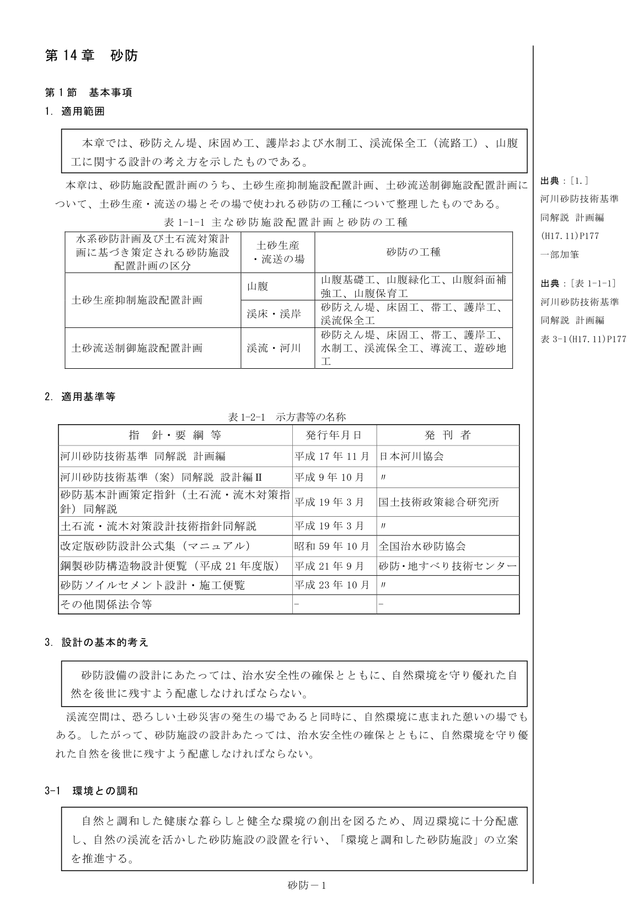

表1-2-1 示方書等の名称

### 3. 設計の基本的考え

> 砂防設備の設計にあたっては、治水安全性の確保とともに、自然環境を守り優れた自然を後世に残すよう配慮しなければならない。

渓流空間は、恐ろしい土砂災害の発生の場であると同時に、自然環境に恵まれた憩いの場でもある。

#### 3-1 環境との調和

> 自然と調和した健康な暮らしと健全な環境の創出を図るため、周辺環境に十分配慮し、自然の渓流を活かした砂防施設の設置を行い、「環境と調和した砂防施設」の立案を推進する。

「環境と調和した砂防施設計画」は、渓流が持つ自然な姿をできるだけ保ち、渓流が本来有している良好な生息環境に配慮し、あわせて美しい自然景観を保全・創出するものである。

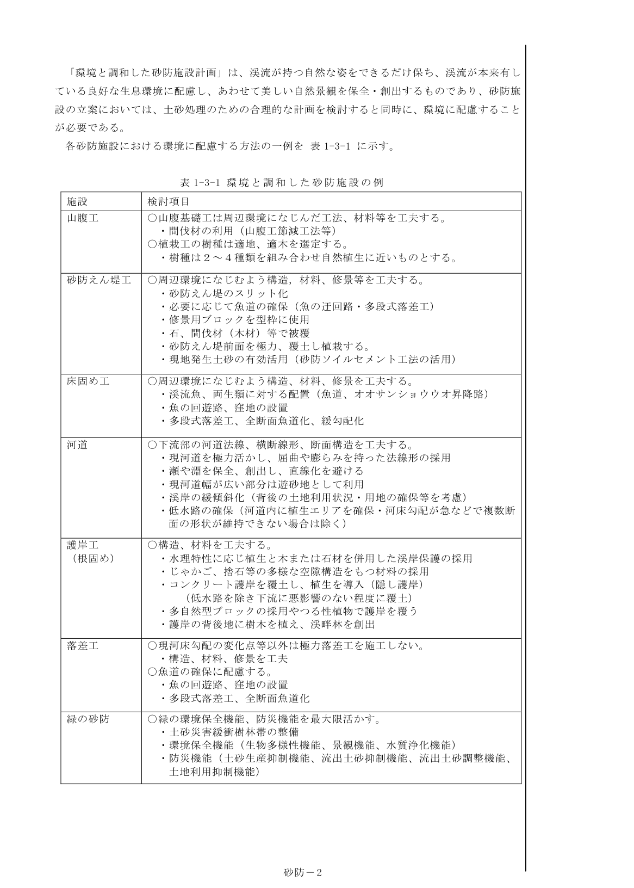

表1-3-1 環境と調和した砂防施設の例

## 第2節 砂防えん堤（標準）

### 1. 砂防えん堤の種類

#### 1-1 砂防えん堤構築材料による分類

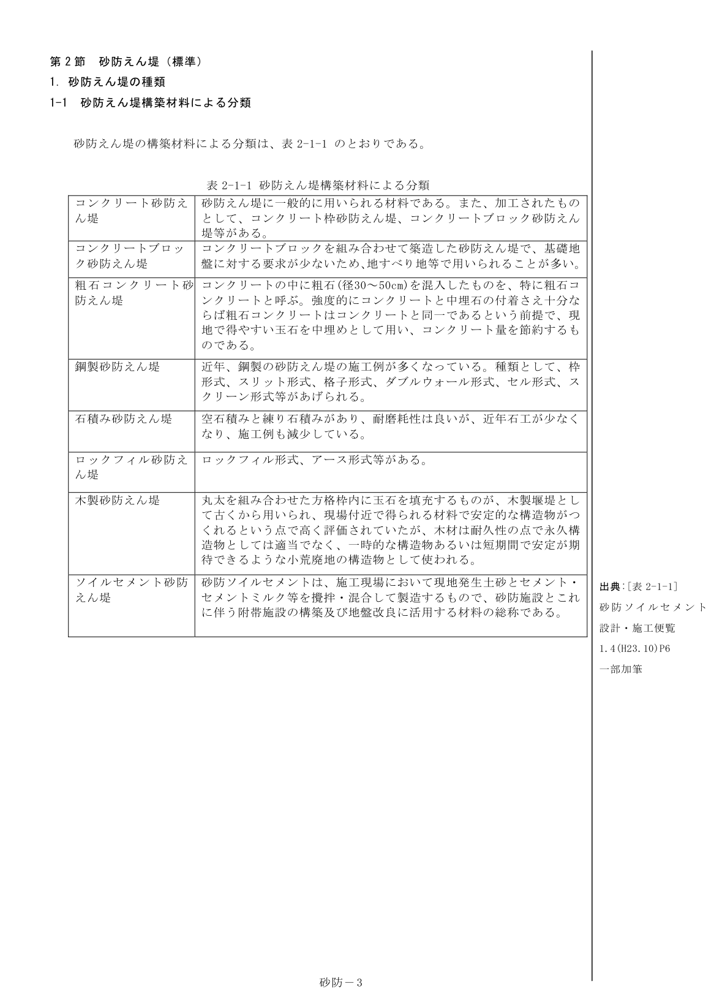

表2-1-1 砂防えん堤構築材料による分類

#### 1-2 砂防えん堤の目的による分類

表2-1-2 砂防えん堤の目的による分類

#### 1-3 砂防えん堤の型式による分類

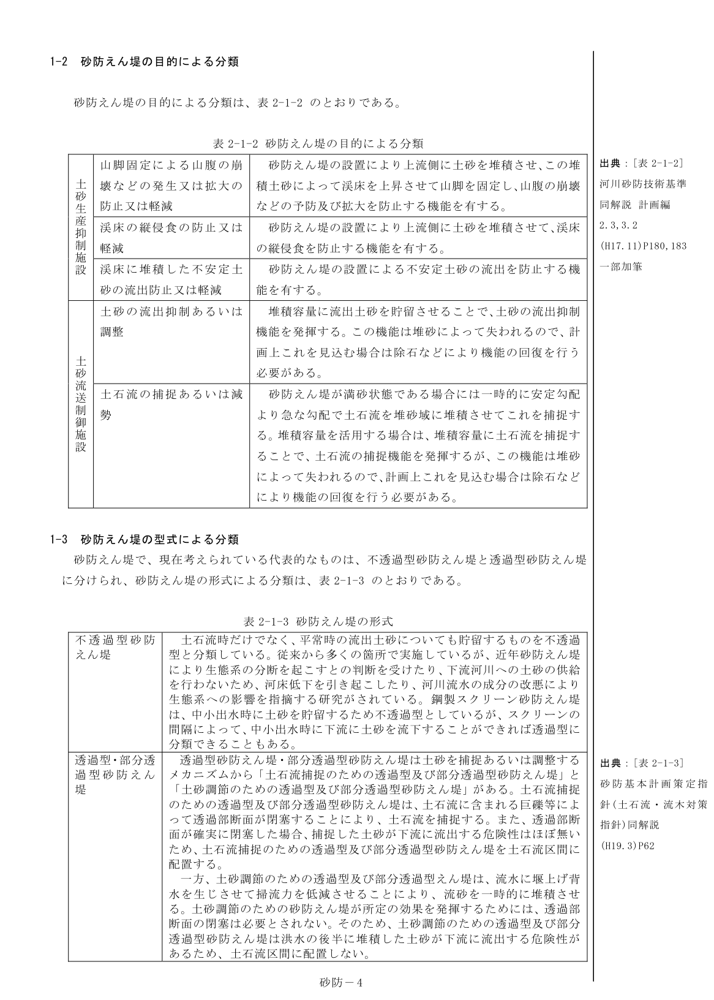

表2-1-3 砂防えん堤の形式

#### 1-4 砂防えん堤の構造形式による分類

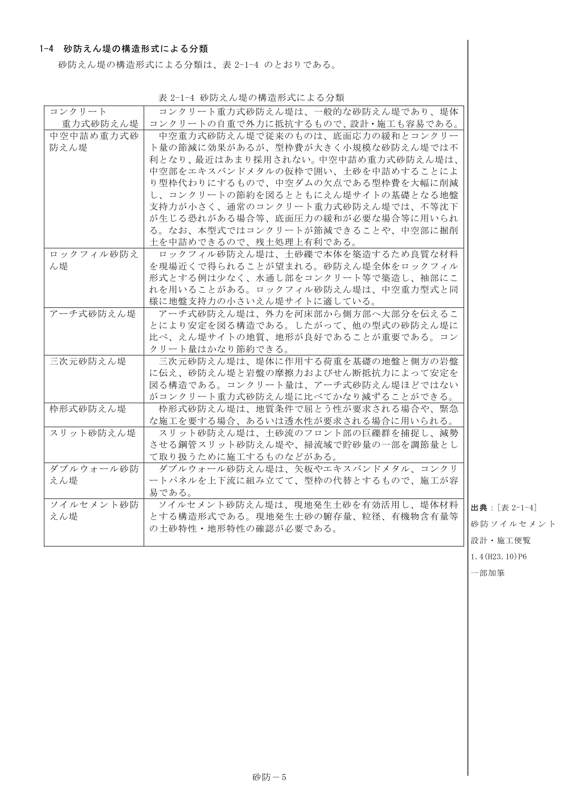

表2-1-4 砂防えん堤の構造形式による分類

### 2. 砂防えん堤の各部の名称

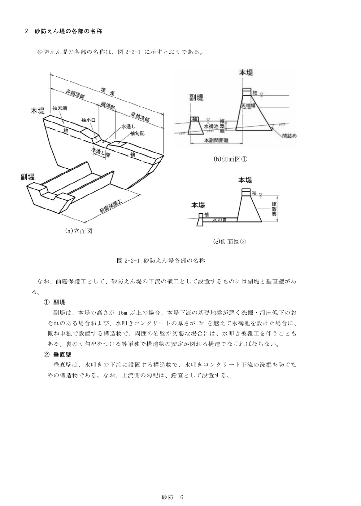

図2-2-1 砂防えん堤各部の名称

なお、前庭保護工として、砂防えん堤の下流の横工として設置するものには副堤と垂直壁がある。

1. **副堤** — 本堤の高さが15m以上の場合、本堤下流の基礎地盤が悪く洗掘・河床低下のおそれのある場合および、水叩きコンクリートの厚さが2mを越えて水褥池を設けた場合に、概ね単独で設置する構造物で、裏のり勾配をつける等単独で構造物の安定が図れる構造でなければならない。
2. **垂直壁** — 水叩きの下流に設置する構造物で、水叩きコンクリート下流の洗掘を防ぐための構造物である。

### 3. 砂防えん堤の配置

#### 3-1 位置

> 土砂生産抑制施設としての砂防えん堤の設置位置は、砂防えん堤に期待する効果と、地形、地質、不安定土砂の状況を勘案して決定する。
>
> 1. 山脚固定による山腹の崩壊などの発生又は拡大の防止又は軽減：原則として崩壊などのおそれがある山腹の直下流
> 2. 渓床の縦侵食の防止又は軽減：原則として縦侵食域の直下流
> 3. 原則として不安定な渓床堆積物の直下流
>
> 土砂流送制御施設としての砂防えん堤の設置位置は、砂防えん堤に期待する効果などを勘案して決定する。
>
> 4. 土砂の流出抑制あるいは調節、土石流の捕捉あるいは減勢：狭窄部でその上流の谷幅が広がっているところや支川合流点直下流部などの効果的な場所に設置するものとする。

### 4. 不透過型砂防えん堤の設計

> 不透過型砂防えん堤の設計においては、「河川砂防技術基準 同解説 計画編」「河川砂防技術基準(案)同解説 設計編II」「改訂版 砂防設計公式集」「砂防基本計画策定指針（土石流・流木対策指針）同解説」「土石流・流木対策設計技術指針同解説」に準ずるものとする。

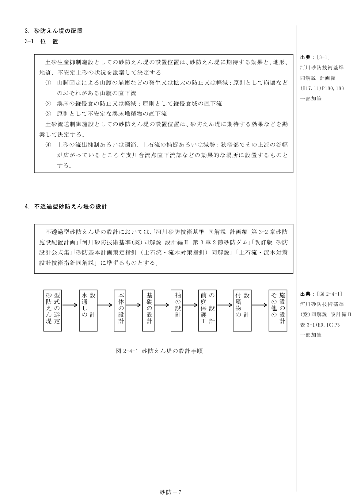

図2-4-1 砂防えん堤の設計手順

#### 4-1 基本事項

##### 4-1-1 設計洪水流量

> 砂防えん堤の設計流量は、土砂移動現象「掃流区間及び土石流区間」に応じて、設計該当地区の降雨量の年超過確率（1/100～1/200）、または既往最大のうち大きい方を採用し、土砂含有率を考慮して定めるものとする。

設計洪水流量の算定は、次に示す合理式が一般に用いられる。

$$Q = Q' \times (1 + \alpha)$$

$$Q' = \frac{1}{3.6} \cdot f \cdot r \cdot A$$

ここに、$Q$：対象流量（m³/s）、$Q'$：合理式によって求めるピーク流量（m³/s）、$\alpha$：土砂混入率、$f$：流出係数、$r$：洪水到達時間内の平均雨量強度（mm/h）、$A$：流域面積（km²）

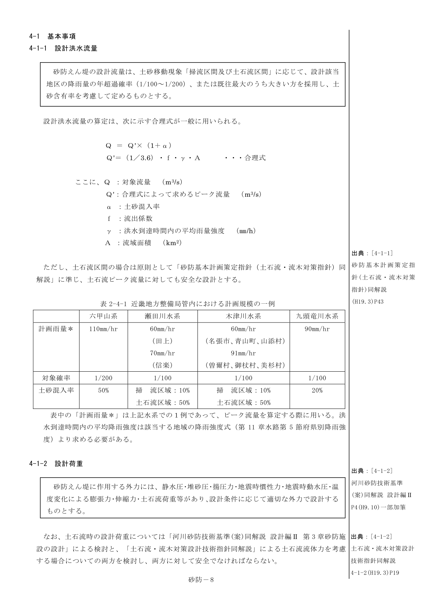

表2-4-1 近畿地方整備局管内における計画規模の一例

##### 4-1-2 設計荷重

> 砂防えん堤に作用する外力には、静水圧・堆砂圧・揚圧力・地震時慣性力・地震時動水圧・温度変化による膨張力・伸縮力・土石流荷重等があり、設計条件に応じて適切な外力で設計するものとする。

#### 4-2 水通しの設計

##### 4-2-1 水通しの位置および断面

> 水通しの中心の位置は、原則として現河床の中央に位置するものとし、砂防えん堤上下流の地形、地質、渓岸の状態、流水の方向等を考慮して定めるものとする。

**(1) 水通しの底幅 B₁** — 水通し幅は現渓床幅程度を基本とし、3m以上を原則とする。

**(2) 水通しの高さ H₃** — 水通しの高さは、逆台形堰の越流公式により求められた対象流量に応じた越流水位 h₃ に、余裕高 h₃' 以上の値を加えて定めるものとする。

表2-4-2 計画流量に対する余裕高

| 計画流量 | 余裕高 |
|---|---|
| 200m³/s未満 | 0.6m |
| 200～500m³/s | 0.8m |
| 500m³/s以上 | 1.0m |

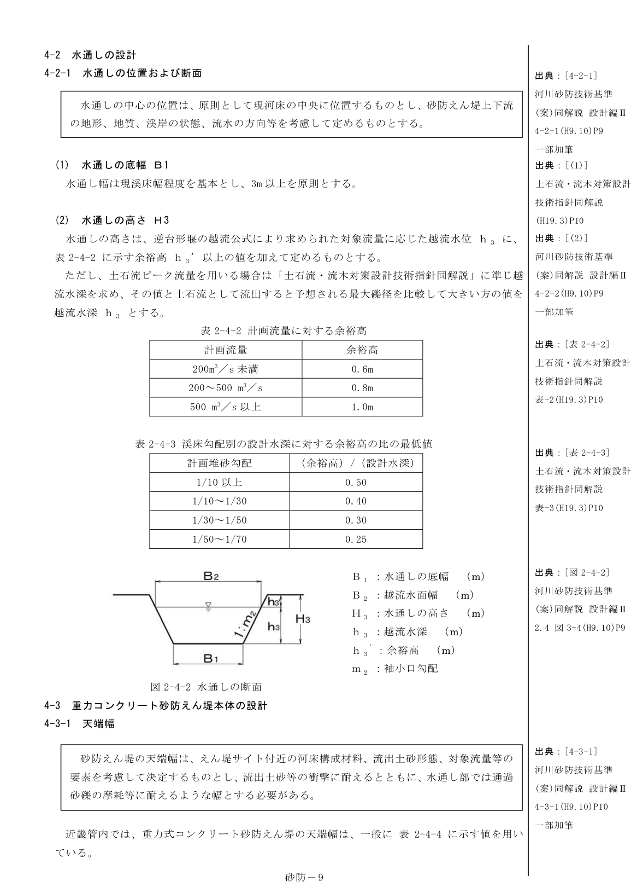

図2-4-2 水通しの断面

#### 4-3 重力コンクリート砂防えん堤本体の設計

##### 4-3-1 天端幅

> 砂防えん堤の天端幅は、えん堤サイト付近の河床構成材料、流出土砂形態、対象流量等の要素を考慮して決定するものとし、流出土砂等の衝撃に耐えるとともに、水通し部では通過砂礫の摩耗等に耐えるような幅とする必要がある。

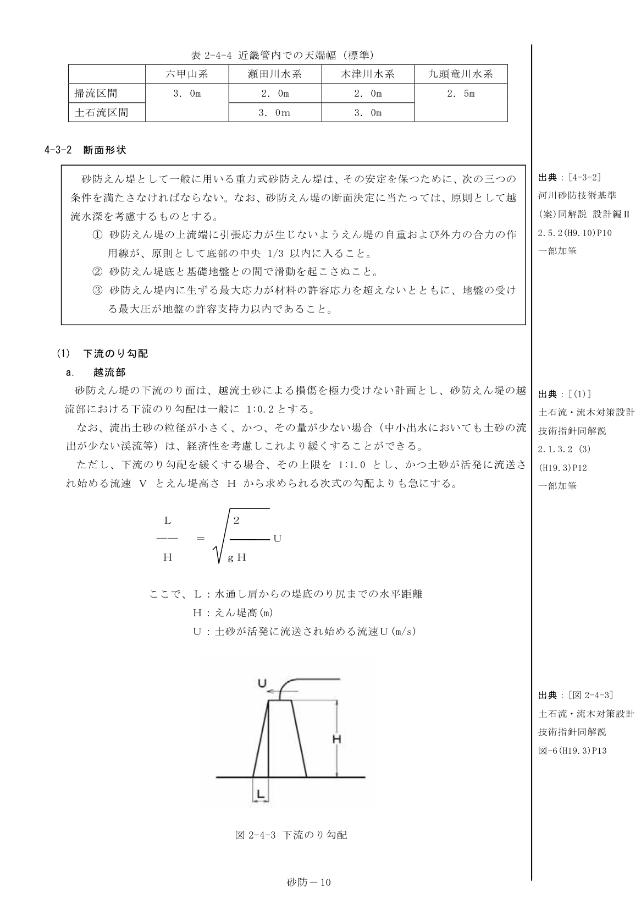

表2-4-4 近畿管内での天端幅（標準）

##### 4-3-2 断面形状

> 砂防えん堤として一般に用いる重力式砂防えん堤は、その安定を保つために、次の三つの条件を満たさなければならない。
>
> 1. 砂防えん堤の上流端に引張応力が生じないようえん堤の自重および外力の合力の作用線が、原則として底部の中央1/3以内に入ること。
> 2. 砂防えん堤底と基礎地盤との間で滑動を起こさぬこと。
> 3. 砂防えん堤内に生ずる最大応力が材料の許容応力を超えないとともに、地盤の受ける最大圧が地盤の許容支持力以内であること。

**(1) 下流のり勾配**

a. 越流部 — 砂防えん堤の下流のり面は、越流土砂による損傷を極力受けない計画とし、砂防えん堤の越流部における下流のり勾配は一般に 1:0.2 とする。

図2-4-3 下流のり勾配

b. 非越流部 — 非越流部の断面は、越流部断面と同一を標準とする。

c. 上流のり勾配 — 重力式コンクリート砂防えん堤の越流部の上流のり勾配を求める場合は、安定計算により定めることとする。

#### 4-4 基礎の設計

> 砂防えん堤の基礎地盤は、安全性等から岩盤が原則である。ただし、計画上やむをえず砂礫基盤とする場合（フローティングえん堤）は、原則として、えん堤高15m未満に抑えるとともに、均一な地層を選定しなければならない。

##### 4-4-1 カットオフ

> カットオフは、砂防えん堤の必要な基礎根入れを確保した上で、パイピングやえん堤下流の対策として設けられる。

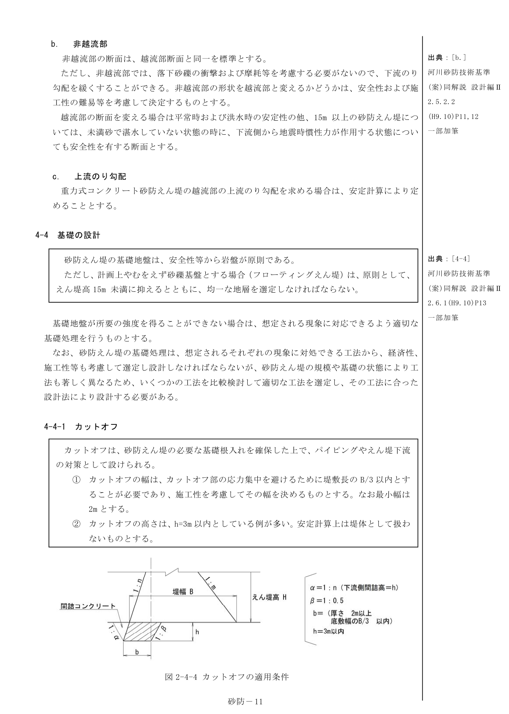

図2-4-4 カットオフの適用条件

##### 4-4-2 段切り

> 岩盤を基礎とした砂防えん堤でえん堤軸直上流側の岩盤河床勾配が急であり、通常の水平なえん堤基礎面では岩盤への根入深が著しく大きくなり不経済となる場合、段切構造とすることができる。

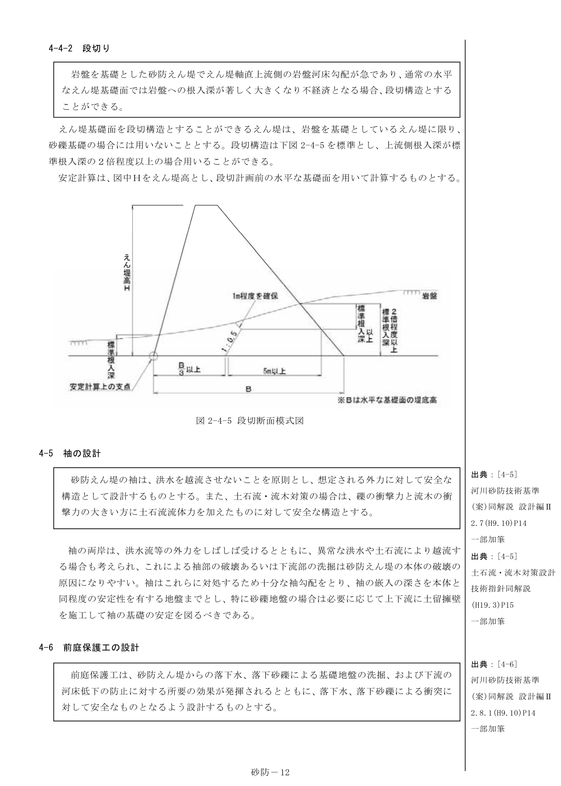

図2-4-5 段切断面模式図

#### 4-5 袖の設計

> 砂防えん堤の袖は、洪水を越流させないことを原則とし、想定される外力に対して安全な構造として設計するものとする。

#### 4-6 前庭保護工の設計

> 前庭保護工は、砂防えん堤からの落下水、落下砂礫による基礎地盤の洗掘、および下流の河床低下の防止に対する所要の効果が発揮されるとともに、落下水、落下砂礫による衝突に対して安全なものとなるよう設計するものとする。

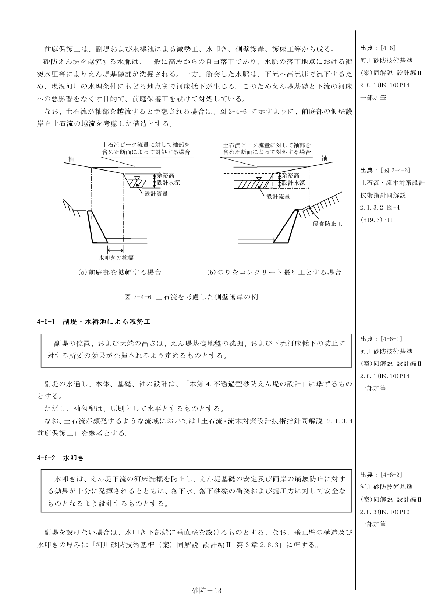

図2-4-6 土石流を考慮した側壁護岸の例

##### 4-6-1 副堤・水褥池による減勢工

> 副堤の位置、および天端の高さは、えん堤基礎地盤の洗掘、および下流河床低下の防止に対する所要の効果が発揮されるよう定めるものとする。

##### 4-6-2 水叩き

> 水叩きは、えん堤下流の河床洗掘を防止し、えん堤基礎の安定及び両岸の崩壊防止に対する効果が十分に発揮されるとともに、落下水、落下砂礫の衝突および揚圧力に対して安全なものとなるよう設計するものとする。

##### 4-6-3 側壁護岸

> 側壁護岸は、砂防えん堤の水通し天端より落下する流水によって、本堤と副堤または垂直壁との間において発生する恐れのある側方侵食を防止しうる構造として設計するものとする。

##### 4-6-4 護床工

> 護床工は、副堤、垂直壁の下流河床の洗掘を防止しうる構造として設計するものとする。

#### 4-7 付属物の設計

> 砂防えん堤の付属物である水抜き、間詰め、流木止め等は、その機能および安全性が得られる構造として設計するものとする。

**(1) 水抜き** — 砂防えん堤には必要に応じ水抜き暗渠を設ける。

**(2) 間詰め** — 基礎および袖の嵌入部における掘削部は間詰めにより保護しなければならない。

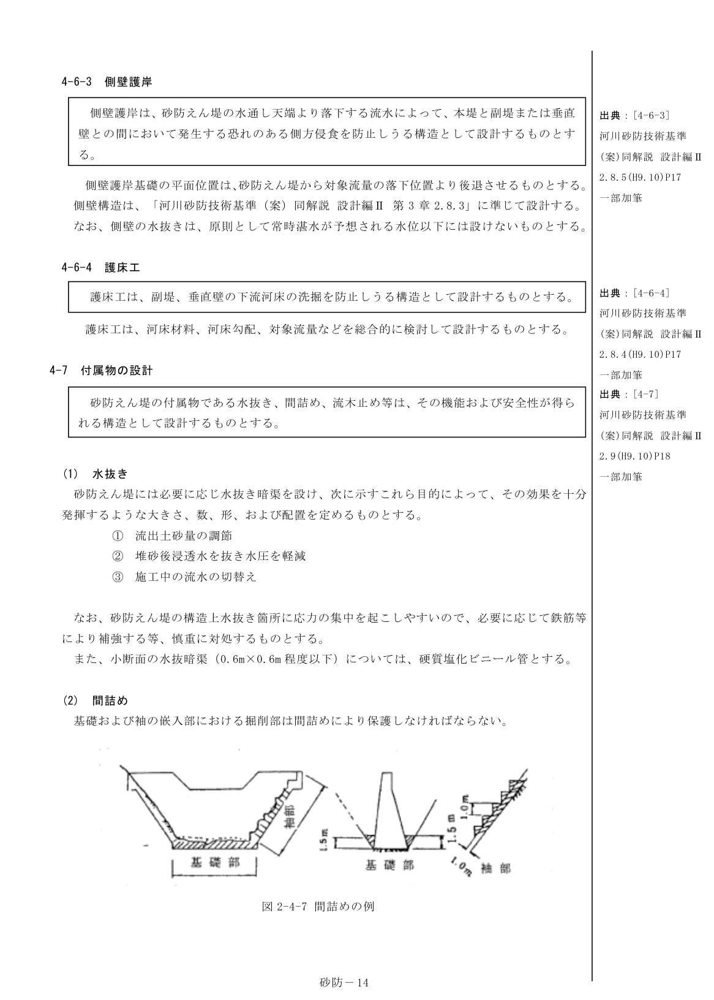

図2-4-7 間詰めの例

**(3) 堤冠保護工** — 水通し部は、細流土砂や石礫により摩耗や欠損されることが考慮される場合には、これを防止するため堤冠部を保護するものとする。

図2-4-8 堤冠保護工施工範囲

**(4) 流木止め** — 流木の流下の恐れがある場合には、必要に応じて流木止めを設けるものとする。

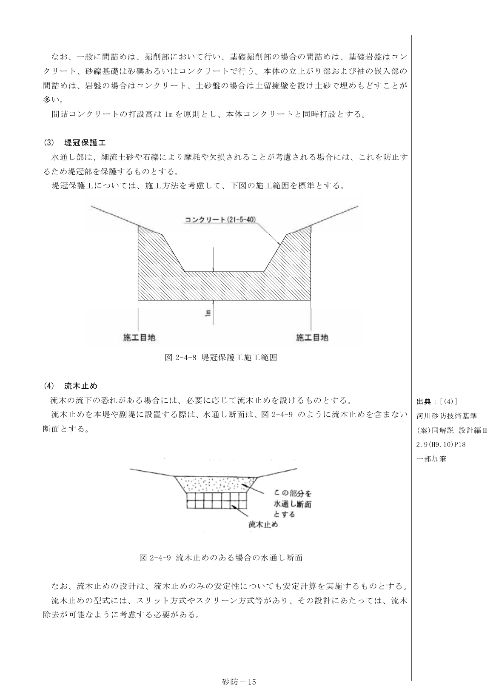

図2-4-9 流木止めのある場合の水通し断面

#### 4-8 堤体腹付け補強対策

既設堤体コンクリートの強度が不足している部分は撤去等の処理を行うとともに、無視できない漏水についても止水、グラウト等の処理を行う。腹付け補強厚さは、施工上必要な幅として1.5mを最小とする。

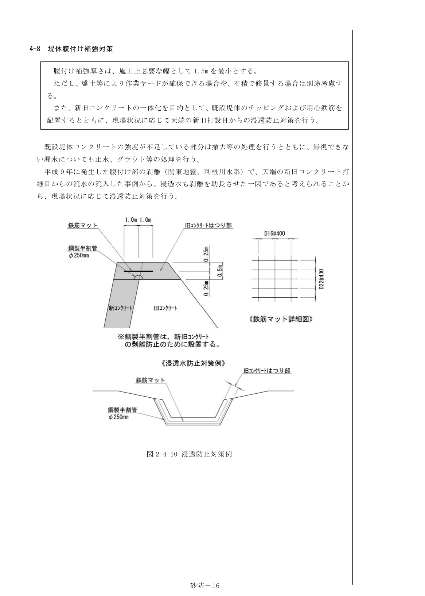

図2-4-10 浸透防止対策例

### 5. 透過型砂防えん堤の設計

> 透過型砂防えん堤は、機能面から土石流を直接捕捉するタイプと掃流の堰上げによって出水中の土砂の流出を遅らせるタイプに分けられる。

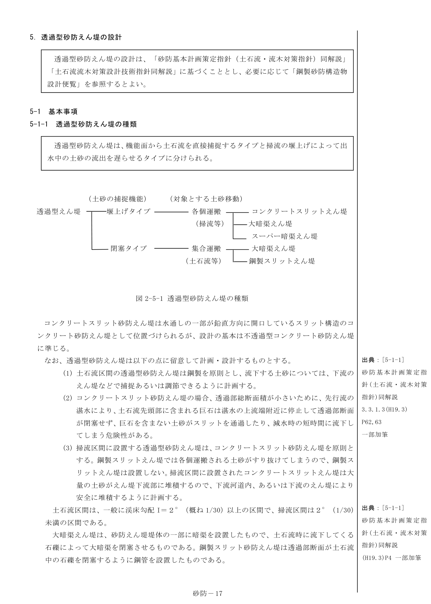

図2-5-1 透過型砂防えん堤の種類

#### 5-1 基本事項

##### 5-1-1 透過型砂防えん堤の種類

透過型砂防えん堤は以下の点に留意して計画・設計するものとする。

1. 土石流区間の透過型砂防えん堤は鋼製を原則とし、流下する土砂については、下流のえん堤などで捕捉あるいは調節できるように計画する。
2. 掃流区間に設置する透過型砂防えん堤は、コンクリートスリット砂防えん堤を原則とする。

##### 5-1-2 設計流量

> 土石流区間の設計流量は、土石流ピーク流量とする。なお、掃流区間の場合は、「本章4.不透過型砂防えん堤の設計」と同様とする。

##### 5-1-3 設計荷重

> 基本的には「本章4.不透過型砂防えん堤の設計」と同様とする。ただし、透過構造に応じた設計外力が作用するものとする。

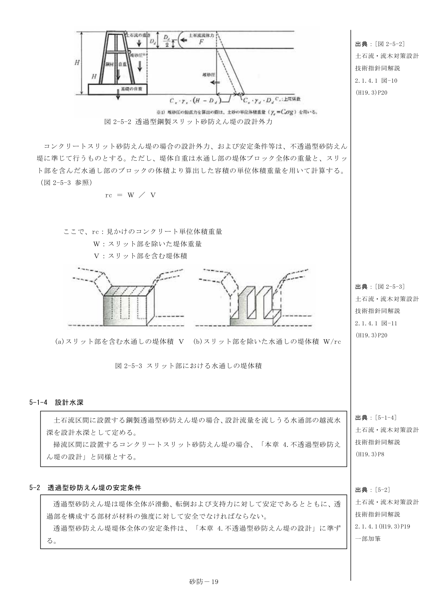

図2-5-2 透過型鋼製スリット砂防えん堤の設計外力

##### 5-1-4 設計水深

> 土石流区間に設置する鋼製透過型砂防えん堤の場合、設計流量を流しうる水通部の越流水深を設計水深として定める。

#### 5-2 透過型砂防えん堤の安定条件

> 透過型砂防えん堤は堤体全体が滑動、転倒および支持力に対して安定であるとともに、透過部を構成する部材が材料の強度に対して安全でなければならない。

#### 5-3 本体構造

> 透過部の部材は、設計外力に対し安全でなければならない。一部の部材が破損したとしても砂防えん堤全体が破壊につながらないよう、フェールセーフの観点から、できるだけ冗長性（リダンダンシー）の高い構造とする。

##### 5-3-1 水通し

> 水通し断面は、原則として「本章4.不透過型砂防えん堤の設計」によるが、透過部閉塞後も安全に土石流を流せる断面とする。

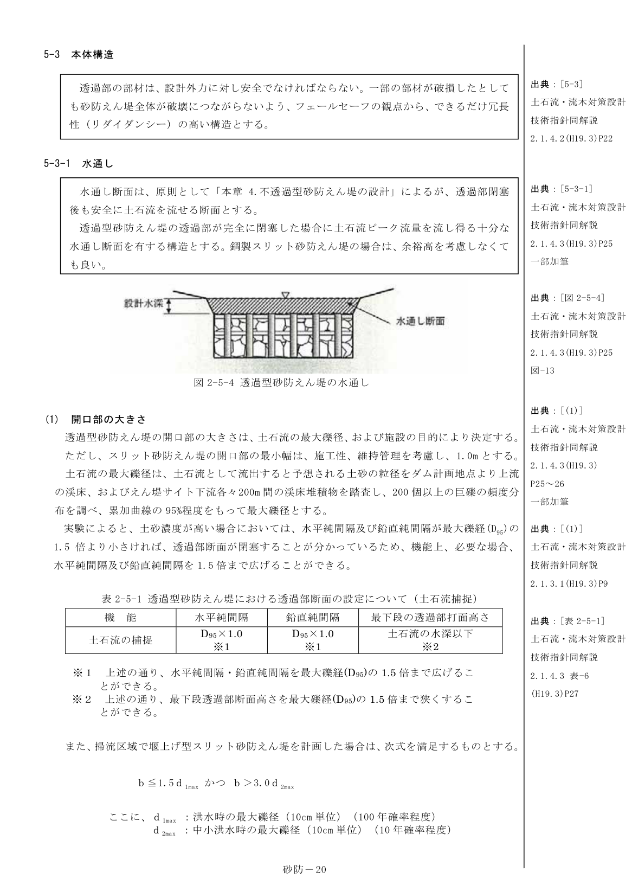

図2-5-4 透過型砂防えん堤の水通し

#### 5-4 スリットの構造

##### 5-4-1 鋼製スリットの選定

> 鋼製スリットの選定については、設計耐力等の性能規定、経済性及び環境面等を考慮して現場にあった最適なものを選定する。

##### 5-4-2 スリットの数

> スリットの数は、スリット部の流下能力が中小洪水流量以上になることを原則とし、スリット密度およびスリット幅の総和を勘案し決定する。

##### 5-4-3 スリットの深さ

> スリットの敷高は、上流側の現河床高程度を下限とし、砂防えん堤の基礎根入れ深さを確保するものとする。

##### 5-4-4 スリットの配置

> スリットの配置は、単スリットでは水通しの中央を原則とする。複スリットでは渓岸に悪影響を与えないように決定する。

#### 5-5 袖の安定性、および構造

> 不透過型砂防えん堤と同様とする。

#### 5-6 前庭保護工

> 透過型砂防えん堤の前庭保護工は、透過部が閉塞した状態について設計流量に対してえん堤本体の安定性が維持できるよう必要に応じて計画する。

{/* 図・表のページ対応表
| 種別 | ファイル名 | 原本ページ |
|---|---|---|
| 表1-1-1 砂防施設配置計画と工種 | k14-tbl-01.png | P2 |
| 表1-2-1 示方書等の名称 | k14-tbl-02.png | P2 |
| 表1-3-1 環境と調和した砂防施設の例 | k14-tbl-03.png | P3 |
| 表2-1-1 構築材料による分類 | k14-tbl-04.png | P4 |
| 表2-1-2 目的による分類 | k14-tbl-05.png | P5 |
| 表2-1-3 砂防えん堤の形式 | k14-tbl-06.png | P5 |
| 表2-1-4 構造形式による分類 | k14-tbl-07.png | P6 |
| 図2-2-1 砂防えん堤各部の名称 | k14-fig-01.png | P7 |
| 図2-4-1 砂防えん堤の設計手順 | k14-fig-02.png | P8 |
| 表2-4-1 計画規模の一例 | k14-tbl-08.png | P9 |
| 図2-4-2 水通しの断面 | k14-fig-03.png | P10 |
| 表2-4-4 天端幅（標準） | k14-tbl-09.png | P11 |
| 図2-4-3 下流のり勾配 | k14-fig-04.png | P11 |
| 図2-4-4 カットオフの適用条件 | k14-fig-05.png | P12 |
| 図2-4-5 段切断面模式図 | k14-fig-06.png | P13 |
| 図2-4-6 側壁護岸の例 | k14-fig-07.png | P14 |
| 図2-4-7 間詰めの例 | k14-fig-08.png | P15 |
| 図2-4-8 堤冠保護工施工範囲 | k14-fig-09.png | P16 |
| 図2-4-9 流木止め水通し断面 | k14-fig-10.png | P16 |
| 図2-4-10 浸透防止対策例 | k14-fig-11.png | P17 |
| 図2-5-1 透過型砂防えん堤の種類 | k14-fig-12.png | P18 |
| 図2-5-2 設計外力 | k14-fig-13.png | P20 |
| 図2-5-4 透過型えん堤の水通し | k14-fig-14.png | P21 |
*/}
