## 第1節 設計一般

### 1. 適用の範囲（標準）

#### 1-1

この設計便覧は国土交通省近畿地方整備局管内の道路橋の上部工の設計に適用する。

上部工の設計は、道路橋示方書及び通達が全てに優先するが、内容の解釈での疑問点等は、その都度担当課と協議すること。なお、平成24年度の道路橋示方書改訂版では、設計にあたり使用目的との適合性、構造物の安全性、耐久性、施工品質の確保、維持管理の確実性及び容易さ、環境との調和、経済性を考慮することが記載されている。また、構造設計上の配慮事項として、維持管理を想定した次の事項が記載されているので留意すること。

1. 橋の一部の部材の損傷等が原因となって、崩壊などの致命的な状態となる可能性。
2. 供用期間中の点検及び事故や災害時における橋の状態を評価するために行う調査、並びに計画的な維持管理を適切に行うために必要な維持管理設備の設置。
3. 供用期間中に更新することが想定される部材については、維持管理の方法等の計画において、あらかじめ更新が確実かつ容易に行える構造。

#### 1-2

この設計便覧に示していない事項については、次の示方書等が参考にできる。

| 示方書・指針等 | 発行年月 | 発行者 |
|---|---|---|
| 道路構造令の解説と運用 | 平成16.2 | 日本道路協会 |
| 立体横断施設技術基準・同解説 | 昭和54.1 | 〃 |
| 自転車道等の設計基準解説 | 昭和49.10 | 〃 |
| 道路の標準幅員に関する基準（案） | 昭和50.7 | 建設省道路局・都市局 |
| 道路橋示方書・同解説（Ⅰ共通編・Ⅱ鋼橋編） | 平成14.3 | 日本道路協会 |
| 〃・同解説（Ⅰ共通編・Ⅲコンクリート橋編） | 平成14.3 | 〃 |
| 〃・同解説（Ⅰ共通編・Ⅳ下部構造編） | 平成14.3 | 〃 |
| 〃・同解説（Ⅴ耐震設計編） | 平成14.3 | 〃 |
| プレキャストブロック工法によるプレストレストコンクリートＴげた道路橋設計・施工指針 | 平成4.10 | 〃 |
| コンクリート標準示方書 各編 | 平成20.3 | 土木学会 |
| コンクリート道路橋設計便覧 | 平成6.2 | 日本道路協会 |
| コンクリート道路橋施工便覧 | 平成10.1 | 〃 |
| 鋼道路橋設計便覧 | 昭和55.8 | 〃 |
| 鋼道路橋施工便覧 | 昭和60.2 | 〃 |
| 道路橋耐風設計便覧（平成19年度改訂版） | 平成20.1 | 〃 |
| 鋼道路橋塗装防食便覧 | 平成17.12 | 〃 |
| 鋼道路橋塗装・防食便覧資料集 | 平成22.9 | 〃 |
| 鋼道路橋設計ガイドライン（案） | 平成7.10 | 建設省道路局国道課 監修 |
| 鋼橋の疲労 | 平成9.5 | 日本道路協会 |
| 鋼道路橋の疲労設計指針 | 平成14.3 | 〃 |
| 道路橋支承便覧（改訂版） | 平成16.4 | 〃 |
| 防護柵の設置基準・同解説 平成20年改訂版 | 平成20.1 | 〃 |
| 車両用防護柵標準仕様・同解説 平成16年 | 平成16.3 | 〃 |
| アスファルト舗装工事共通仕様書解説（改訂版） | 平成4.12 | 〃 |
| 舗装の構造に関する技術基準・同解説 | 平成13.9 | 〃 |
| 舗装設計施工指針 平成18年度版 | 平成18.2 | 〃 |
| 舗装施工便覧 平成18年度版 | 平成18.2 | 〃 |
| 舗装設計便覧 平成18年度版 | 平成18.2 | 〃 |
| 道路土工要綱 | 平成21.6 | 〃 |
| 改定 解説・河川管理施設等構造令 | 平成12.1 | 日本河川協会 |
| 道路橋床版防水便覧 | 平成19.3 | 日本道路協会 |
| 小規模吊橋指針・同解説 | 昭和59.4 | 〃 |
| 建設省制定土木構造物標準設計 第5巻 | 昭和60.2 | 全日本建設技術協会 |
| 〃 第13巻～第17巻 | 平成6.3 | 〃 |
| 〃 第18巻～第20巻 | 平成8.3 | 〃 |
| 〃 第23巻～第28巻 | 平成6.4 | 〃 |
| 〃 第29巻～第31巻 | 平成3.3 | 〃 |

注）道路橋示方書・同解説（H24.4以降に改訂版発刊予定）の改訂内容は反映されていないため、内容が便覧と異なった場合は便覧の内容を読み替えること。

### 2. 用語の定義

- **橋長** …橋台のパラペット前面間の距離
- **径間長** …隣り合う橋脚の中心線間の距離、橋台パラペット前面から橋脚中心までの距離
- **支間長** …支承の中心間距離
- **桁遊間** …橋台のパラペット前面から桁端までの距離、桁端から桁端までの距離

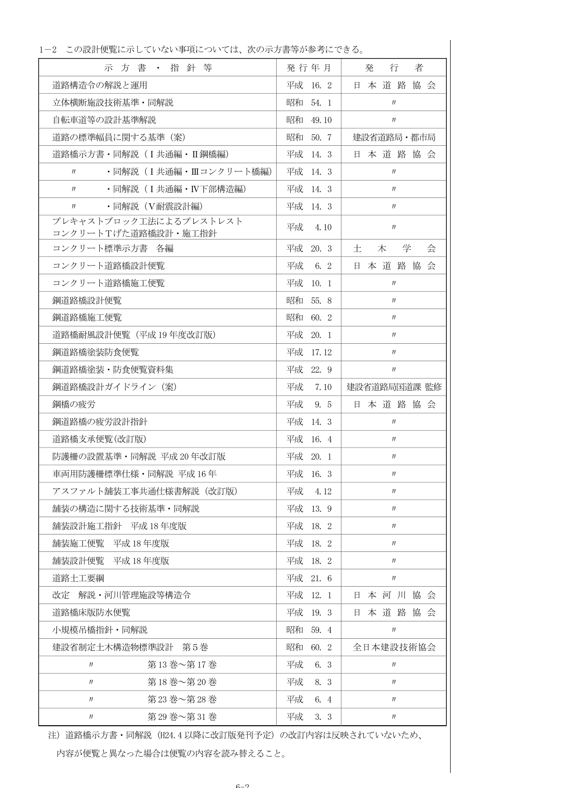

図6-1-1 橋長等の距離の取り方

{/* 図6-1-1: Page 4 */}

- **直橋** …斜橋の対語で、橋軸が直線で橋軸と支承線とのなす角が直角な橋
- **斜橋** …直橋の対語で、橋軸と支承線とのなす角が直角でない橋
- **直線橋** …曲線橋の対語で、橋軸が直線の橋。直線橋には直橋と斜橋がある
- **曲線橋** …橋軸が曲線の橋
- **曲線桁** …軸線が曲線の桁

### 3. 橋の設計自動車荷重

#### 3-1

橋は、その設計に用いる設計自動車荷重を245kNとし、当該橋における大型の自動車の状況を勘案して、安全な交通を確保することができる構造とするものとする。

#### 3-2

活荷重は、自動車荷重（Ｔ荷重、Ｌ荷重）、群集荷重および軌道の車両荷重とし、大型の自動車の交通の状況に応じてＡ活荷重およびＢ活荷重に区分する。高速自動車国道、一般国道、都道府県道およびこれらの道路と基幹的な道路網を形成するその他の橋の設計にあたっては、Ｂ活荷重を適用するものとする。その他の橋の設計にあたっては、大型の自動車の交通の状況に応じてＡ活荷重またはＢ活荷重を適用するものとする。

### 4. 調査（標準）

橋の合理的かつ経済的な設計・施工を行うために、橋の建設予定地点の状況、構造物の規模等に応じて必要な調査を行わなければならない。

### 5. 計画（標準）

#### 5-1 架橋位置と形式の選定

橋の計画にあたっては、路線線形や地形、地質、気象、交差条件等の外部的な諸条件、路線の特性、使用目的との適合性、施工性、維持管理の容易さ、環境との調和、経済性を考慮して、架橋位置及び橋の形式の選定を行わなければならない。

#### 5-2 構造規格

橋の幅員構成、建築限界、線形などの構造規格は道路構造令の規定によるものとする。

#### 5-3 交差物件との関係

架橋位置、支間割、橋脚位置、橋脚形状、桁下空間などは交差物件の管理者と十分協議して定めるものとする。

#### 5-4 橋梁形式

耐震性、維持管理、走行性の各面で有利な連続形式または連続ラーメン形式を基本とする。

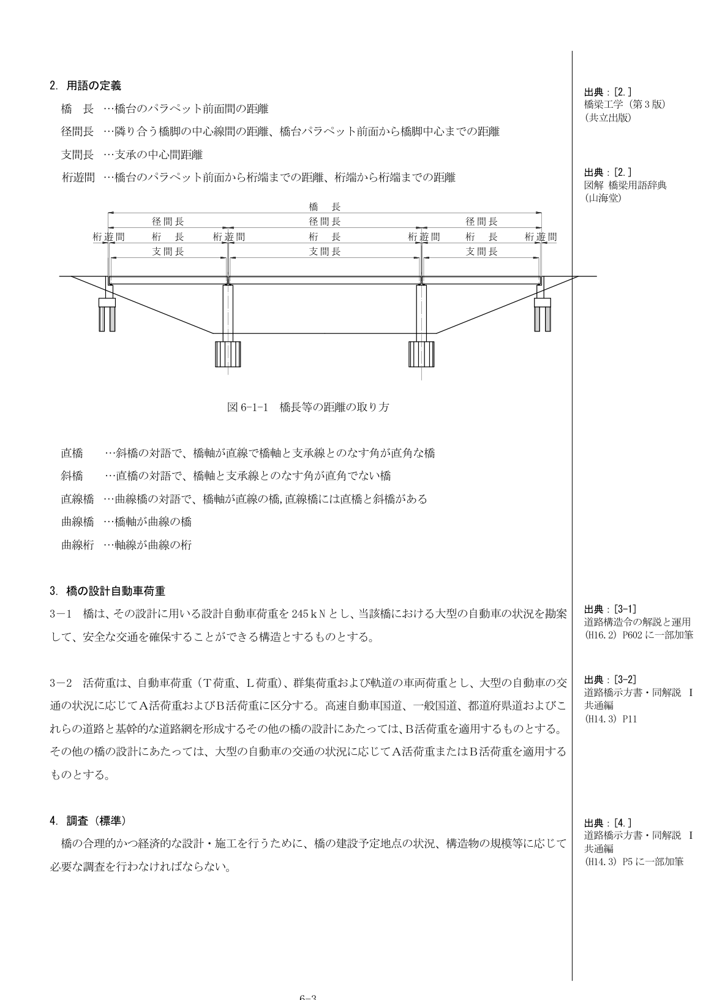

図6-1-2 形式選定のフローチャート

{/* 図6-1-2: Page 5 */}

### 6. 設計の基本理念（標準）

1. 橋の設計にあたっては、使用目的との適合性、構造物の安全性、耐久性、施工品質の確保、維持管理の容易さ、環境との調和、経済性を考慮しなければならない。
2. 設計計算には、関連示方書による他、理論的な妥当性を有する手法、実験等による検証がなされた手法等によるなど、適切な知見に基づいて行うものとする。

### 7. 上部工の形式

#### 7-1 一般的な形式

道路橋に一般的に用いられている形式と、その支間について下表に示す。鋼橋の合成桁については、床版は主桁の一部として抵抗する重要な構造部材であることから、斜角70度以上での使用を基本とする。

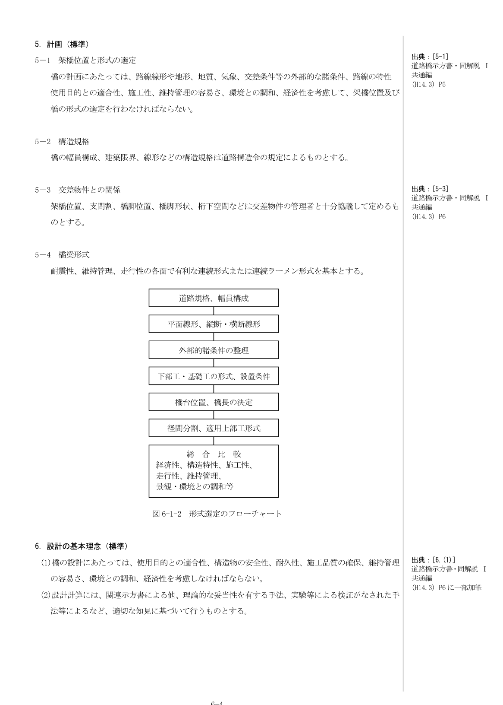

表6-1-1(a) 鋼橋の標準適用支間

{/* 表6-1-1(a): Page 6 */}

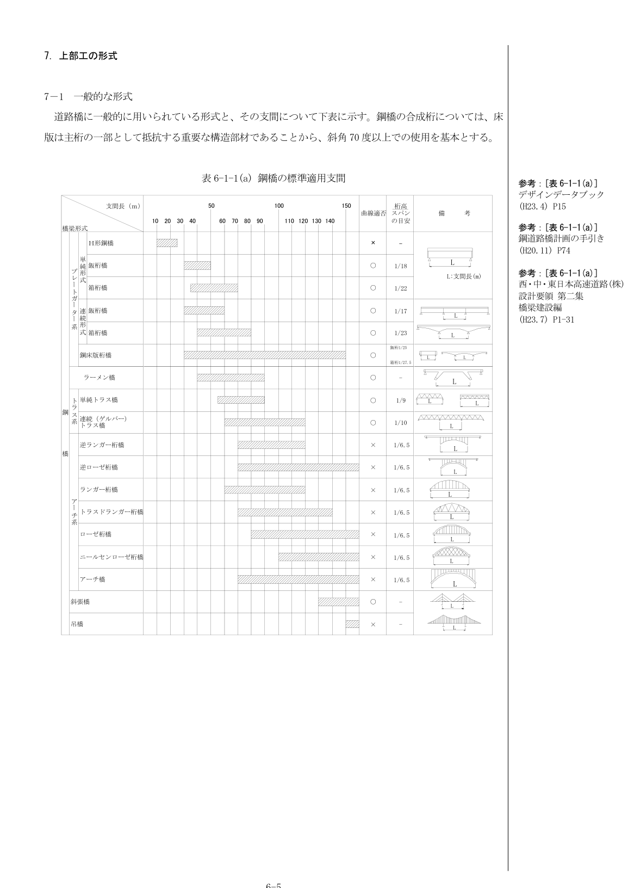

表6-1-1(b) コンクリート橋の標準適用支間

{/* 表6-1-1(b): Page 7 */}

（注）
1. トラス、アーチ形式の桁高は、主構高またはアーチライズを表す。
2. 曲線適否 ・○印は、主構造を曲線に沿って曲げられるもの。・×印は、主構造を曲線に沿って曲げられないもの。

#### 7-2 その他の橋梁形式（採用にあたっての留意事項）

**(1) 鋼少数鈑桁橋**

「少数鈑桁」とは、通常のＩ形断面のプレートガーダー橋がＲＣ床版を使用し、主桁間隔が4m以下であるのに対し、ＰＣ床版または合成床版等を採用することにより床版支間を拡張し、主桁本数を2～3本とした構造である。採用する場合の条件及び留意事項を以下に記す。

- (ｲ) 主桁高が従来のＲＣ床版プレートガーダーより高くなるため、縦断のコントロールになる箇所に用いる場合は、注意を要する。
- (ﾛ) 主桁間隔は、最大6m程度とする。
- (ﾊ) 直線橋が望ましいが、止むを得ない場合でも斜角75°以上、Ｒ＝1000m程度を限界とする。
- (ﾆ) 主桁本数が少ないため、架設時の安全性、床版打設時の横倒れ座屈など、施工時の安全性に配慮を要する。
- (ﾎ) ＰＣ床版または合成床版等の耐久性に優れた床版の使用となるため、ＲＣ床版を使用した従来形式に比べて、床版の補修頻度を極力少なくしたい路線条件においての適合性に富む。しかし将来の床版損傷時において、2主桁橋の場合は車線規制・部分交通開放による床版打ち替え（部分的な打ち替えを含む）が困難であるため、採用にあたっては補完性、代替性の確保を含め検討を行うこと。

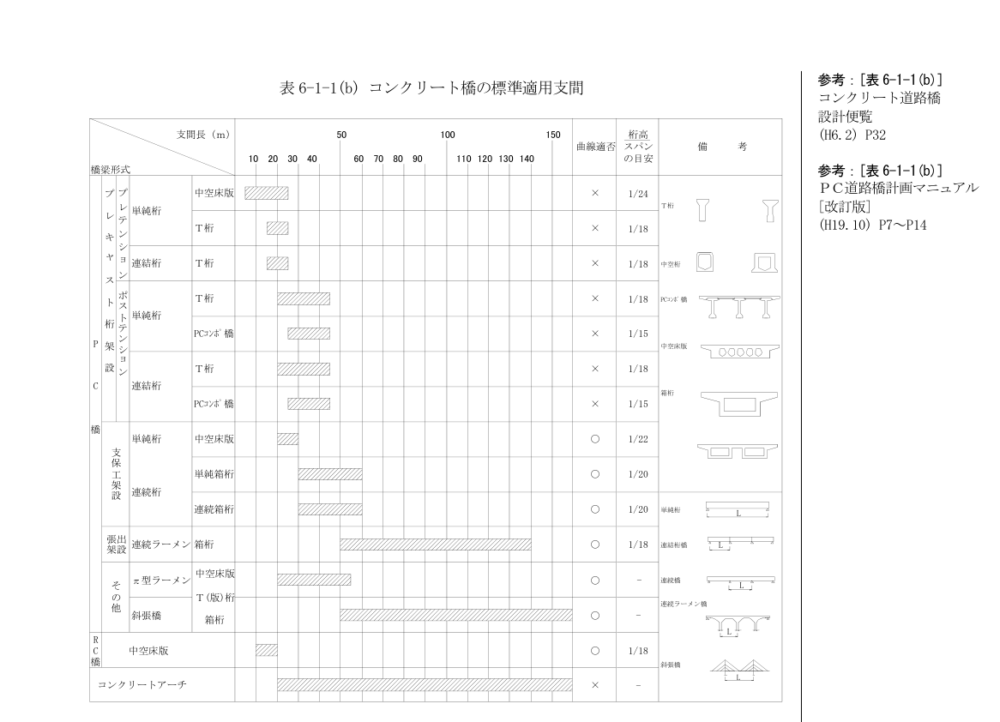

図6-1-3(a) 鋼少数鈑桁

{/* 図6-1-3(a): Page 8 */}

**(2) 鋼細幅箱桁橋**

「細幅箱桁橋」とは、箱主桁断面を従来箱桁より狭くし、フランジを厚板化することにより縦リブ数の低減および横リブの省略が可能となり箱内構造を簡略化し、ＰＣ床版または合成床版等を用いて床版支間を大きくすることで床組構造を省略し合理化を図った箱桁橋である。

適用範囲は従来箱桁と変わらないが、ＰＣ床版または合成床版等の使用となるため、将来の床版損傷時において、2主桁橋の場合は車線規制・部分交通開放による床版打ち替え（部分的な打ち替えを含む）が困難であるため、採用にあたっては補完性、代替性の確保を含め検討を行うこと。

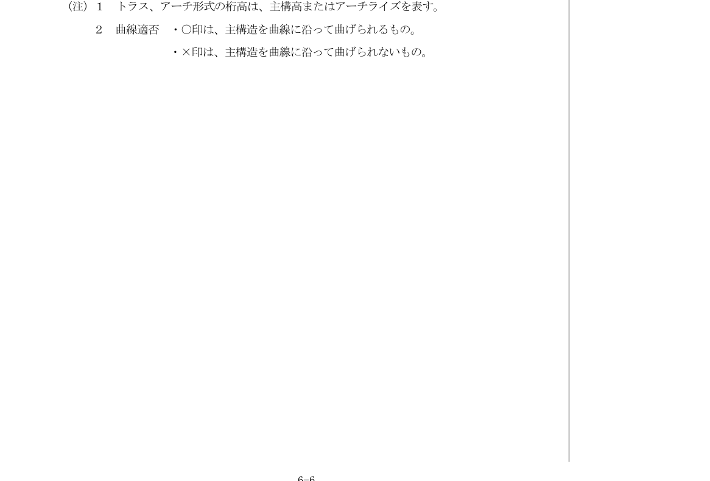

図6-1-3(b) 鋼細幅箱桁橋

{/* 図6-1-3(b): Page 8 */}

**(3) ＰＲＣ構造**

ＰＲＣ構造の採用にあたっては、本局担当課と協議すること。ＰＲＣ構造の留意事項は、「2001年制定コンクリート標準示方書 構造性能照査編 土木学会」及び「設計要領第二集 東・中・西日本高速道路株式会社」を参照するとよい。

### 8. 設計一般（標準）

#### 8-1 構造規格

橋は道路の本体としての一構造物であるから、橋の幅員構成、建築限界、線形などの構造規格は、道路構造令の規定によるものとする。

#### 8-2 河川との関係

「河川管理施設等構造令」による。

#### 8-3 鉄道との関係

道路鉄道交差に関する協定の解説と運用（平成元年3月）
- 第1章 道路と鉄道とが交差する場合等における道路側と鉄道側との協議事項について（通達）
- 第2章 「道路と鉄道との交差に関する運輸省・建設省制定及び細目協定」の解説と運用による。

#### 8-4 荷重

**(1) 中央分離帯のある場合の活荷重の載荷方法**

中央分離帯のある橋で、構造物が上・下線一体になっている構造の場合、Ｌ荷重は次のように載荷する。

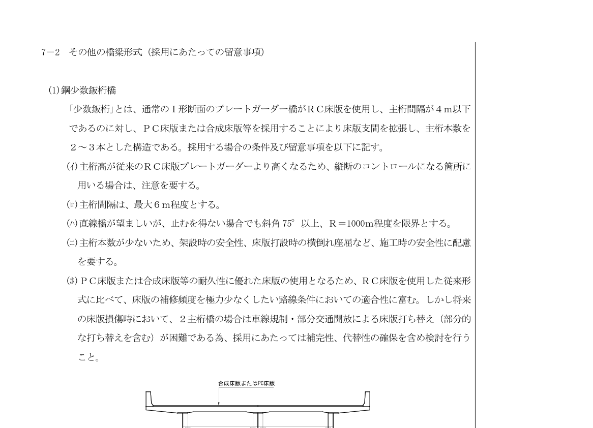

図6-1-4(a) 上下線一体構造のL荷重載荷方法

{/* 図6-1-4(a): Page 9 */}

ただし、上・下線が別々の構造の場合はそれぞれ5.5mずつ主載荷重を載せる。

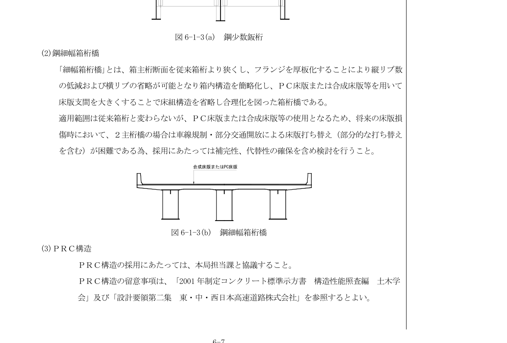

図6-1-4(b) 上下線分離構造のＬ荷重載荷方法

{/* 図6-1-4(b): Page 9 */}

**(2) 車両用防護柵の衝突荷重**

衝突荷重は、「防護柵設置基準・同解説」及び「車両用防護柵標準仕様・同解説」によるものとする。

**(3) 遮音壁の設計荷重**

「第13章2節 遮音壁」による。

#### 8-5 橋梁用防護柵

**(1) フロリダ型壁高欄**

- (a) コンクリート製壁型防護柵は、フロリダ型を用いることを標準とする。
- (b) 寸法及び荷重は、図6-1-5及び表6-1-2によるものとする。
- (c) 壁高欄と建築限界線との関係は、表6-1-3によること。
- (d) 配筋は、図6-1-6及び表6-1-4を参照のこと。
- (e) 使用材料は表6-1-5を基本とする。
- (f) 寒冷地では、消雪・融雪設備の設置について確認したうえで、壁高欄の計画を行うこと。

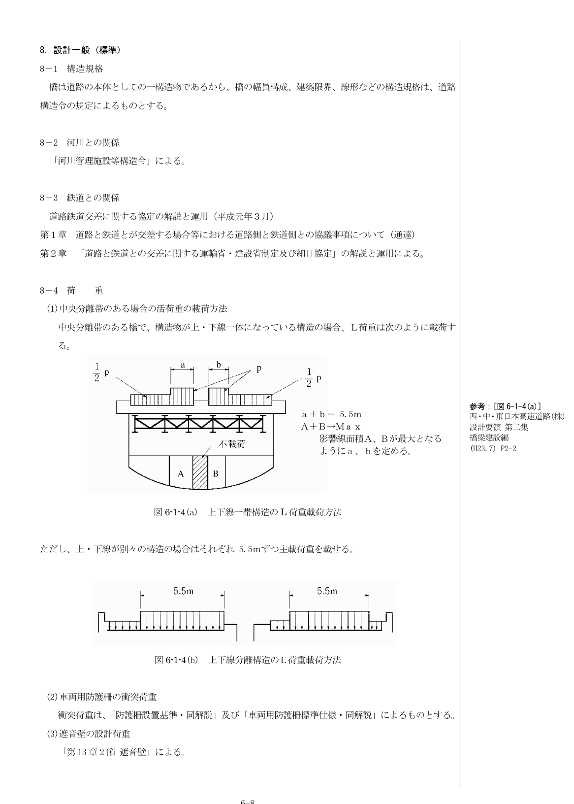

図6-1-5 フロリダ型壁高欄の形状

{/* 図6-1-5: Page 10 */}

表6-1-2 フロリダ型の場合の寸法及び荷重

| 種別 | Ｈ (mm) | Ｌ (mm) | Ｗ (mm) | Ｓ (mm) | 衝突荷重Ｆ (kN) | 天端線荷重Ｐ (kN/m) |
|---|---|---|---|---|---|---|
| SS | 1100 | 890 | 465 | 90 | 138 | 45 |
| SA | 1000 | 790 | 455 | 80 | 88 | 32 |
| SB | 900 | 690 | 445 | 70 | 58 | 22 |
| SC | 800 | 590 | 435 | 60 | 35 | 13 |

注）
1. 形状は路側用に使用する場合で、中分側に使用する場合の形状は、「車両用防護柵標準仕様・同解説」によるものとする。
2. 自歩道用壁高欄は、歩道路面から1100mmの高さが必要なため、SSのタイプの形状を参考とした。

表6-1-3 フロリダ型壁高欄を使用する場合の建築限界線

| 種別 | 中小橋 L1 | 長大橋 L2 |
|---|---|---|
| SS | 465 | 340 |
| SA | 455 | 330 |
| SB | 445 | 320 |
| SC | 435 | 310 |

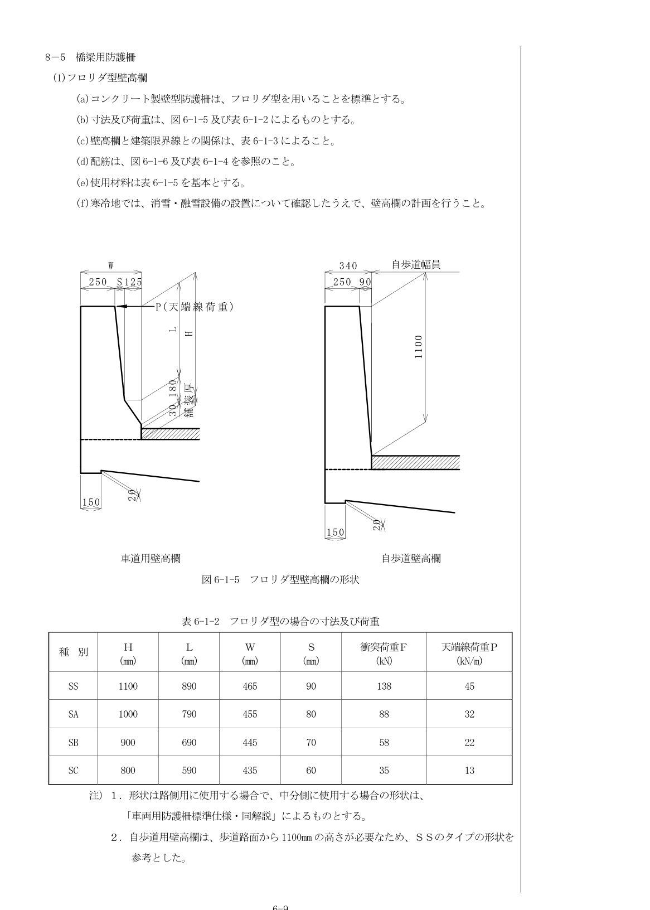

図6-1-6 フロリダ型壁高欄の配筋

{/* 図6-1-6: Page 11 */}

表6-1-4 フロリダ型壁高欄の配置鉄筋

| 種別 | 縦方向鉄筋 | 横方向鉄筋（遮音壁高さＨ≦5m） 本数 | n |
|---|---|---|---|
| SS | D13@125（D16@125） | 8 | 4 |
| SA | D13@125（D16@125） | 7 | 3 |
| SB | D13@125（D16@125） | — | — |
| SC | D13@125（D16@125） | 6 | 2 |

注）縦方向鉄筋の（ ）は端部1mの範囲の配置とする。

表6-1-5 壁高欄の使用材料

| 項目 | 規格 |
|---|---|
| コンクリート強度 | 24 N/mm² |
| 鉄筋強度 | SD345 |

**(2) フロリダ型壁高欄を使用する場合の留意事項**

- 従来型タイプと総幅員が異なる。
- 橋梁の全幅員は、建築限界や橋梁の横断勾配、設置する遮音壁の高さや視距等を考慮して定める。遮音壁高さと建築限界との関係は、図6-1-7及び表6-1-7を参考にできるが、使用に際しては、設計対象橋梁の条件で数値を確認すること。
- 横断勾配は、1つの橋梁の中でも異なることがあるが、全幅員の設定にあたってはその内最も大きな値を考慮し、1橋毎に同一とする。なお橋梁の全幅員は、50mm単位で設定することを原則とする。

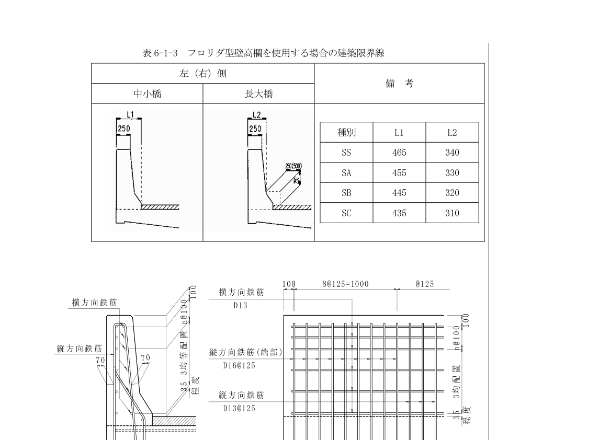

図6-1-7 遮音壁高と建築限界との関係[参考]

{/* 図6-1-7: Page 12 */}

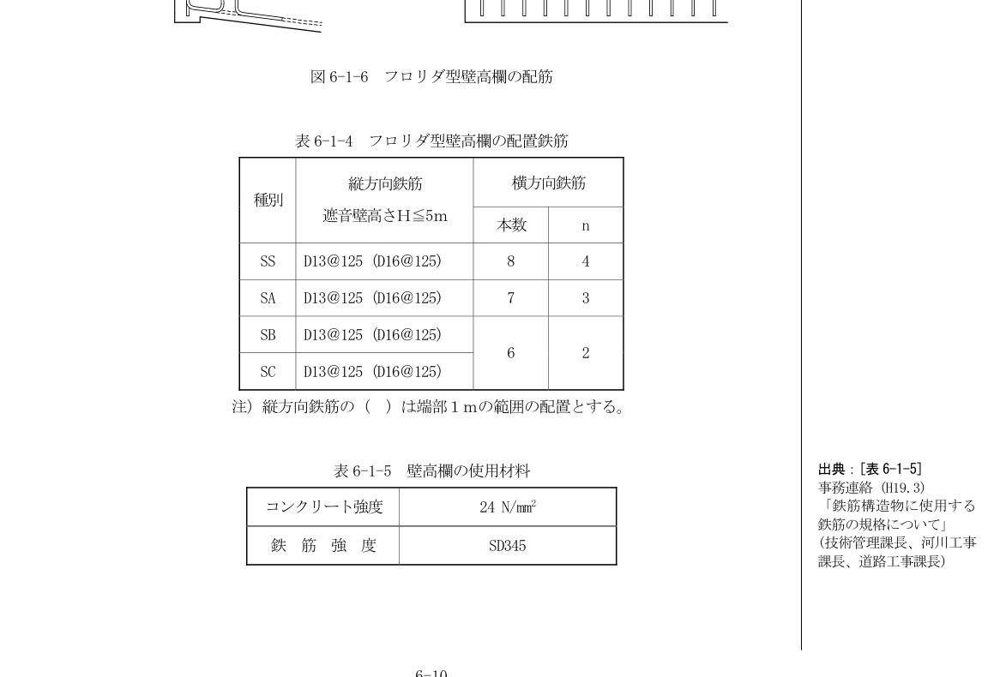

表6-1-6 遮音壁高と建築限界との関係（参考）

{/* 表6-1-6: Pages 12-13 */}

**(3) 連続桁ＲＣ床版の地覆、壁高欄の目地について**

**(a) ＲＣ床版**

連続桁の地覆、壁高欄の目地は中間支点上付近に伸縮目地（瀝青繊維質板10mm）また、支間部には間隔10m程度で収縮目地（Ｖカット）を設置する。

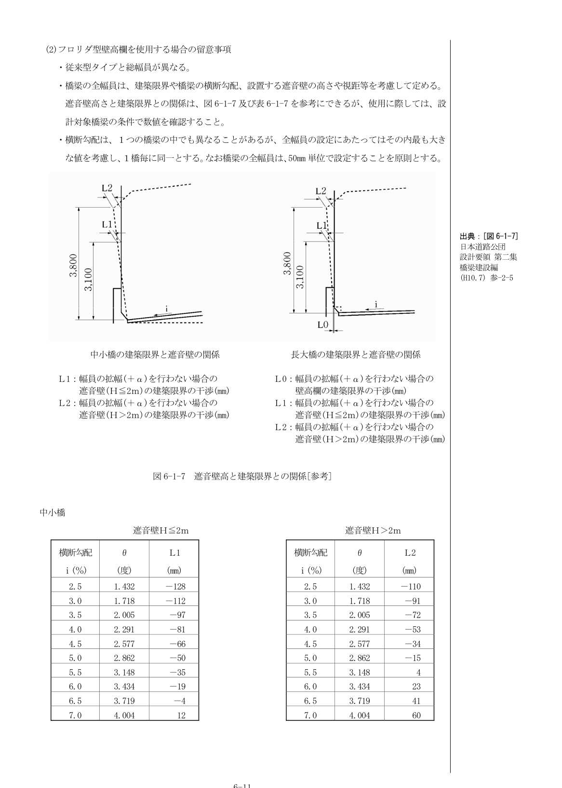

図6-1-8 中間支点上の伸縮目地と支間部の目地

{/* 図6-1-8: Page 13 */}

**(b) 鋼床版**

鋼床版上の鉄筋コンクリート高欄および中央分離帯には、ひびわれ対策として伸縮目地を10m程度の間隔で設置する。伸縮目地部については、高欄端部と同様に考えて補強構造とし、目地部には瀝青繊維質板を設置する。

#### 8-6 その他の高欄と地覆

地覆の形状寸法は表6-1-7を標準とする。

表6-1-7 地覆の形状寸法

| 寸法 | 車道に接する地覆 | 歩道に接する地覆 |
|---|---|---|
| b1 | 600mm | 400mm |
| b2 | 250mm | —— |
| b3 | 250mm | 100mm |

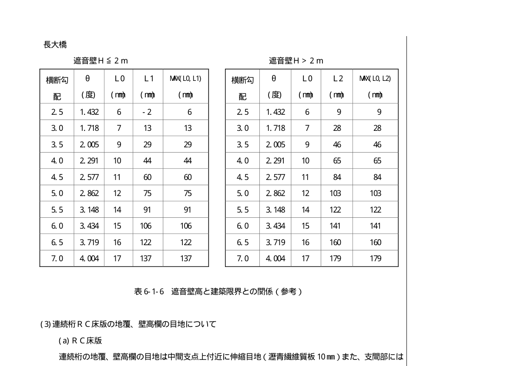

図6-1-9 地覆の形状寸法

{/* 図6-1-9: Page 14 */}

#### 8-7 遮音壁

遮音壁は必要に応じて設置するものとする。なお、将来遮音壁が必要になると考えられる場所については「第13章2節」にかかげる荷重を考慮して設計するものとする。

#### 8-8 橋面舗装

1. 橋面舗装はアスファルト舗装を標準とする。
2. コンクリート床版上の舗装構成は下記による。
   - (a) 舗装厚は最小8.0cmとし、2層式（表層4.0cm＋レベリング層）を原則とする。
   - (b) 表層、基層（レベリング層）ともに、密粒度アスファルトを標準とする。
   - (c) 歩道舗装は、細粒度アスファルトで厚さ4.0cmを標準とする。

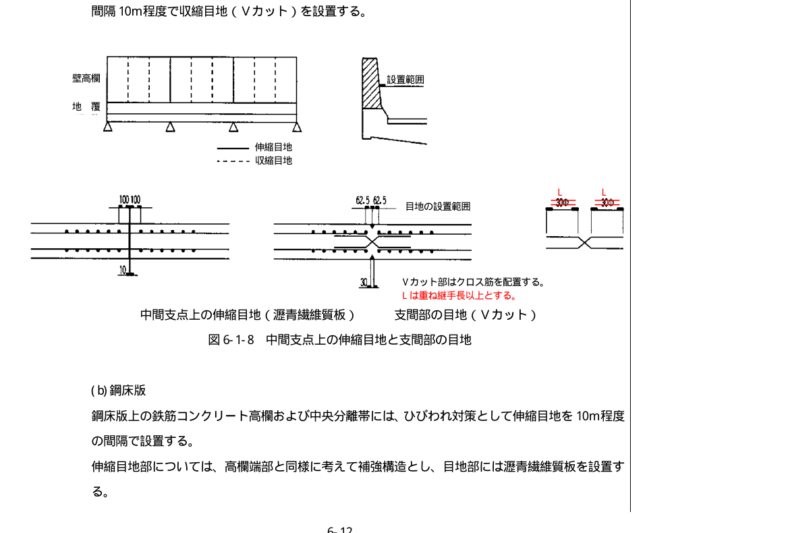

図6-1-10 橋面舗装構成

{/* 図6-1-10: Page 14 */}

3. 鋼床版上の舗装構成は下記による。
   - (a) 舗装厚は最小8.0cmとし、2層式（表層4.0cm＋レベリング層）を原則とする。
   - (b) 表層は密粒度アスファルト、基層（レベリング層）はグースアスファルトを標準とする。
4. 歩道部の形式はセミフラット式を基本とする。なおセミフラット式を適用するに当たっては、「第15章 歩道及び自転車歩行者道」によるほか、歩道有効幅員の取り方や歩車境界防護柵の床版への定着方法に留意して計画を行うこと。
5. 排水性舗装を採用する場合は、床版面での滞水に対して特に留意する必要があり、床版防水層を必ず適用するとともに、「舗装施工便覧（平成18年版）」の「付録-7 排水性舗装の排水処理例」を参考に水抜き孔や導水設備などの排水処理について十分に検討しなければならない。

### 9. 橋面防水層

#### 9-1 コンクリート床版

1. 防水層は、桁形式及び床版形式にかかわらず、車道部の全面に施工するものとする。
2. 歩道部については、フラット型（セミフラット型、フルフラット型）について防水層を施工するものとする。

#### 9-2 鋼床版

基層にグースアスファルトを施工する場合を除き、コンクリート床版と同様とする。

#### 9-3 防水層の種類

防水層は、塗膜系、シート系の使用を標準とする。なお一般的な防水層の特徴を表6-1-8に、防水層の選択基準の目安を表6-1-9に示す。

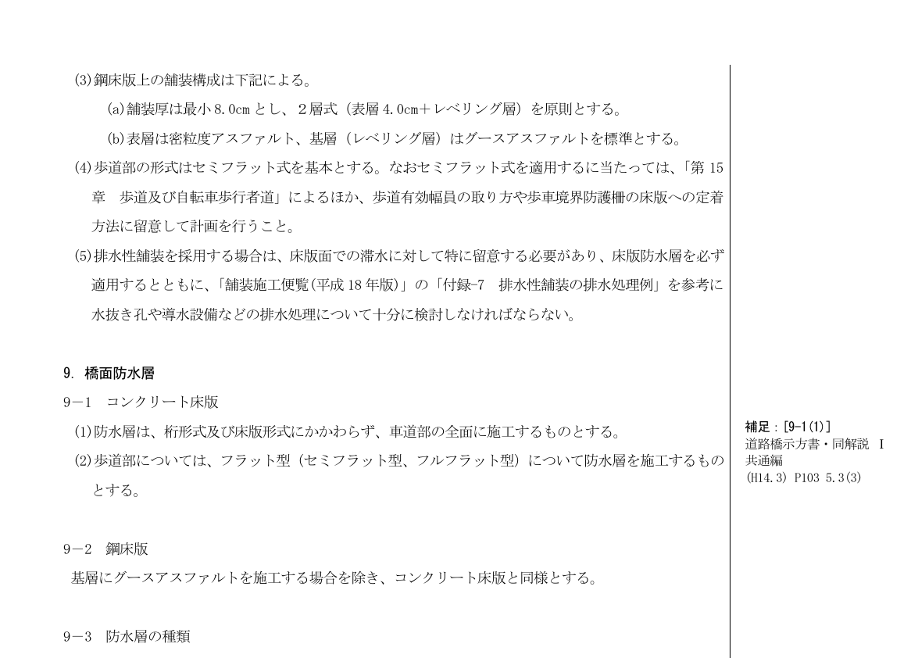

表6-1-8 各防水層の特徴

{/* 表6-1-8: Page 16 */}

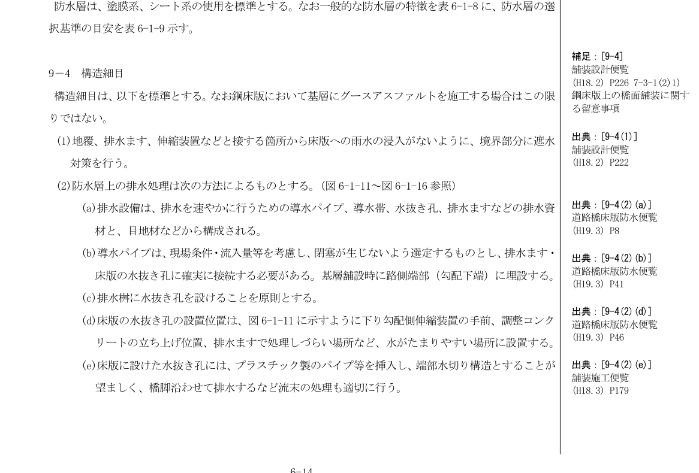

表6-1-9 防水層の選択基準の目安

{/* 表6-1-9: Page 16 */}

#### 9-4 構造細目

構造細目は、以下を標準とする。なお鋼床版において基層にグースアスファルトを施工する場合はこの限りではない。

1. 地覆、排水ます、伸縮装置などと接する箇所から床版への雨水の浸入がないように、境界部分に遮水対策を行う。
2. 防水層上の排水処理は次の方法によるものとする。（図6-1-11～図6-1-16参照）
   - (a) 排水設備は、排水を速やかに行うための導水パイプ、導水帯、水抜き孔、排水ますなどの排水資材と、目地材などから構成される。
   - (b) 導水パイプは、現場条件・流入量等を考慮し、閉塞が生じないよう選定するものとし、排水ます・床版の水抜き孔に確実に接続する必要がある。基層舗設時に路側端部（勾配下端）に埋設する。
   - (c) 排水桝に水抜き孔を設けることを原則とする。
   - (d) 床版の水抜き孔の設置位置は、図6-1-11に示すように下り勾配側伸縮装置の手前、調整コンクリートの立ち上げ位置、排水ますで処理しづらい場所など、水がたまりやすい場所に設置する。
   - (e) 床版に設けた水抜き孔には、プラスチック製のパイプ等を挿入し、端部水切り構造とすることが望ましく、橋脚沿わせて排水するなど流末の処理も適切に行う。

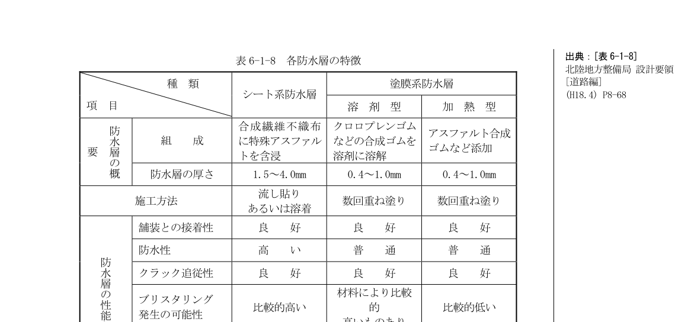

図6-1-11 排水処理の設置例

{/* 図6-1-11: Page 17 */}

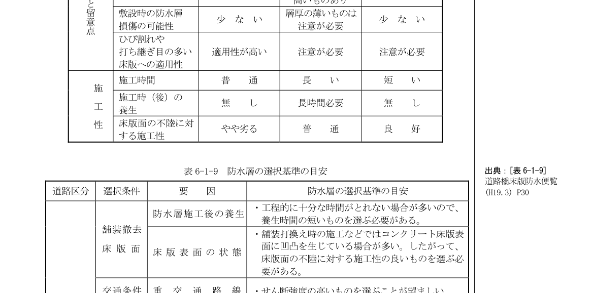

図6-1-12 導水パイプを用いる場合の設置例

{/* 図6-1-12: Page 17 */}

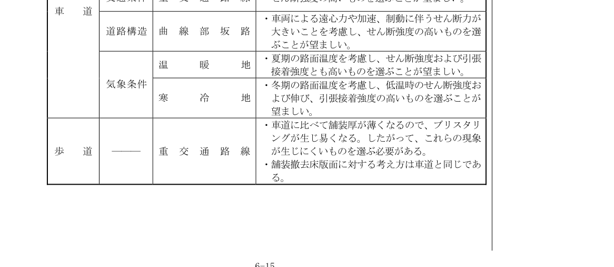

図6-1-13 導水帯と導水パイプを用いる場合の設置例（ポーラスアスファルト混合物を用いた場合）

{/* 図6-1-13: Page 17 */}

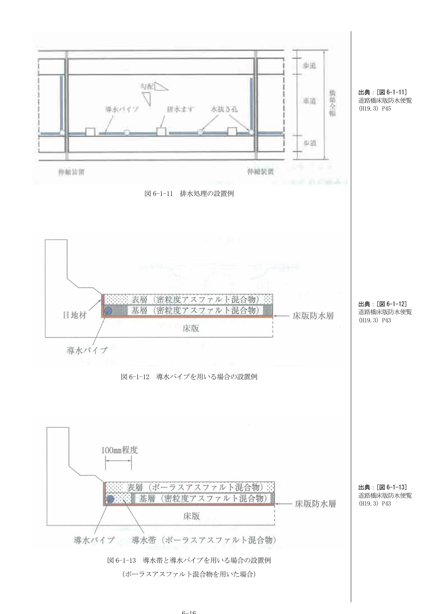

図6-1-14 導水パイプと排水桝の接続例

{/* 図6-1-14: Page 18 */}

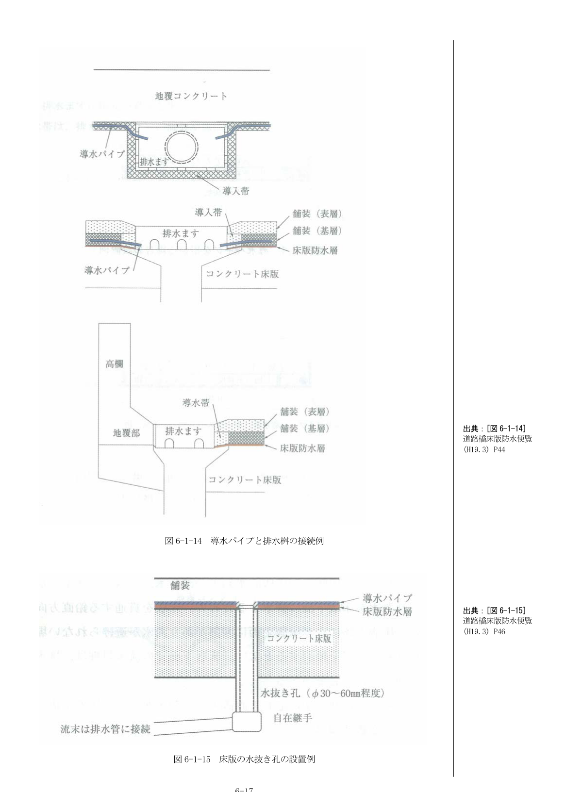

図6-1-15 床版の水抜き孔の設置例

{/* 図6-1-15: Page 18 */}

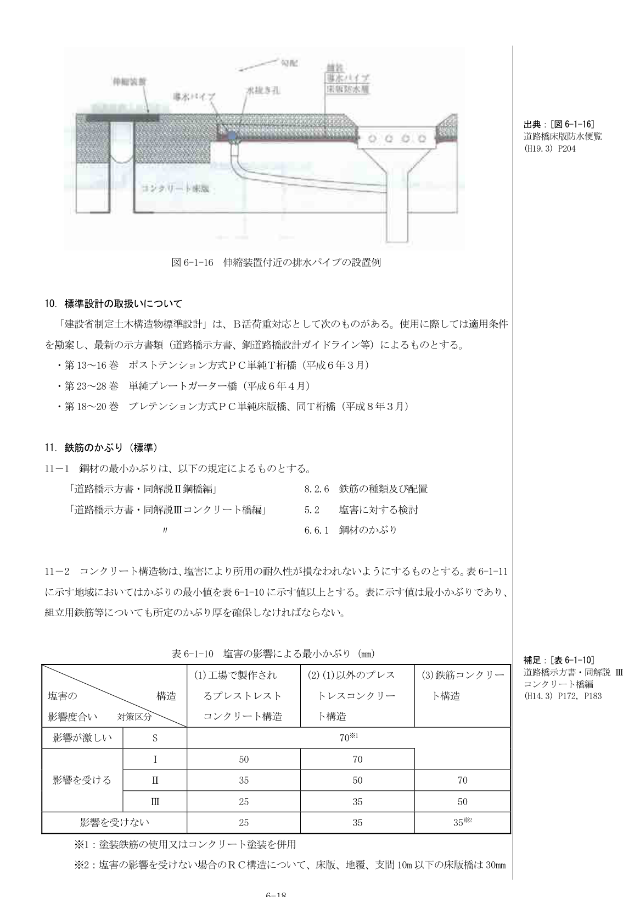

図6-1-16 伸縮装置付近の排水パイプの設置例

{/* 図6-1-16: Page 19 */}

### 10. 標準設計の取扱いについて

「建設省制定土木構造物標準設計」は、Ｂ活荷重対応として次のものがある。使用に際しては適用条件を勘案し、最新の示方書類（道路橋示方書、鋼道路橋設計ガイドライン等）によるものとする。

- 第13～16巻 ポストテンション方式ＰＣ単純Ｔ桁橋（平成6年3月）
- 第23～28巻 単純プレートガーター橋（平成6年4月）
- 第18～20巻 プレテンション方式ＰＣ単純床版橋、同Ｔ桁橋（平成8年3月）

### 11. 鉄筋のかぶり（標準）

#### 11-1

鋼材の最小かぶりは、以下の規定によるものとする。

- 「道路橋示方書・同解説Ⅱ鋼橋編」 8.2.6 鉄筋の種類及び配置
- 「道路橋示方書・同解説Ⅲコンクリート橋編」 5.2 塩害に対する検討
- 〃 6.6.1 鋼材のかぶり

#### 11-2

コンクリート構造物は、塩害により所用の耐久性が損なわれないようにするものとする。表6-1-11に示す地域においてはかぶりの最小値を表6-1-10に示す値以上とする。表に示す値は最小かぶりであり、組立用鉄筋等についても所定のかぶり厚を確保しなければならない。

表6-1-10 塩害の影響による最小かぶり（mm）

| 塩害の影響度合い・対策区分 | (1) 工場で製作されるプレストレストコンクリート構造 | (2) (1)以外のプレストレスコンクリート構造 | (3) 鉄筋コンクリート構造 |
|---|---|---|---|
| 影響が激しい S | 70※1 | — | — |
| Ⅰ | 50 | 70 | — |
| Ⅱ | 35 | 50 | 70 |
| 影響を受ける Ⅲ | 25 | 35 | 50 |
| 影響を受けない | 25 | 35 | 35※2 |

※1：塗装鉄筋の使用又はコンクリート塗装を併用
※2：塩害の影響を受けない場合のＲＣ構造について、床版、地覆、支間10m以下の床版橋は30mm

表6-1-11 塩害の影響地域

| 地域区分 | 地域 | 海岸線からの距離 | 区分 | 影響度合い |
|---|---|---|---|---|
| Ｂ（福井県） | 海上部及び海岸線から100mまで | S | 影響が激しい |
| | 100mをこえて300mまで | Ⅰ | |
| | 300mをこえて500mまで | Ⅱ | |
| | 500mをこえて700mまで | Ⅲ | 影響を受ける |
| Ｃ（上記以外の地域） | 海上部及び海岸線から20mまで | S | 影響が激しい |
| | 20mをこえて50mまで | Ⅰ | |
| | 50mをこえて100mまで | Ⅱ | |
| | 100mをこえて200mまで | Ⅲ | 影響を受ける |

1. 図6-1-17のように、組立用鉄筋についても所定のかぶりを確保し、かつその鉄筋と他の鉄筋とのあきを確保しなければならない。なお、その他の部位について、同じかぶり厚とする必要は無い。適用部位は場所打ちコンクリート橋の中空床版橋、箱桁の主桁(主版)下面および張出床版下面とする。

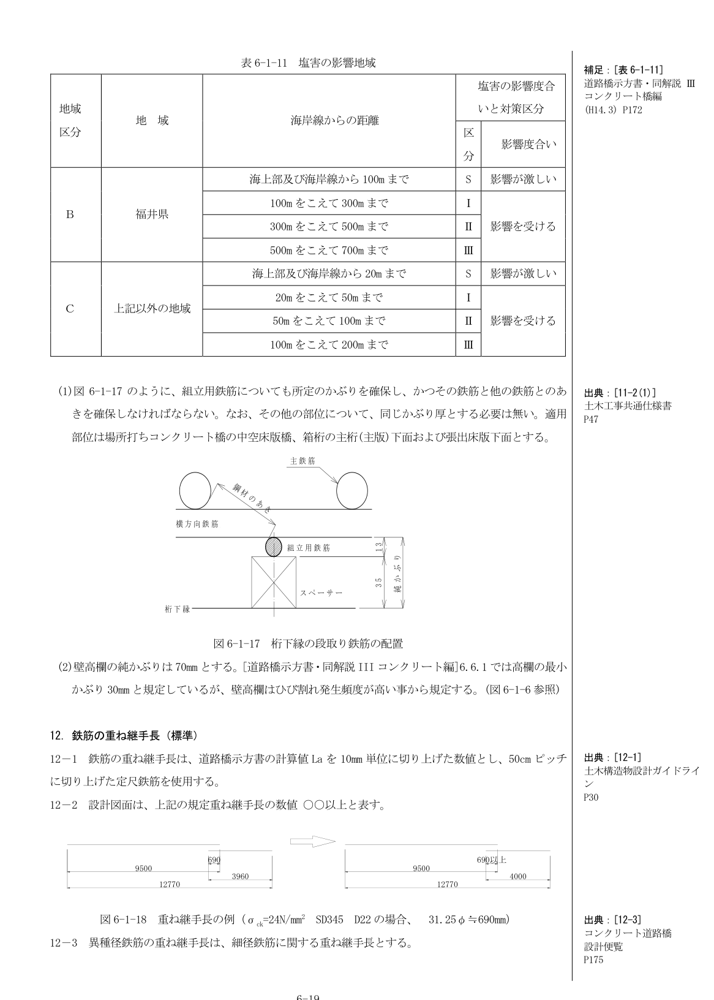

図6-1-17 桁下縁の段取り鉄筋の配置

{/* 図6-1-17: Page 20 */}

2. 壁高欄の純かぶりは70mmとする。道路橋示方書・同解説Ⅲコンクリート編 6.6.1では高欄の最小かぶり30mmと規定しているが、壁高欄はひび割れ発生頻度が高い事から規定する。（図6-1-6参照）

### 12. 鉄筋の重ね継手長（標準）

#### 12-1

鉄筋の重ね継手長は、道路橋示方書の計算値Laを10mm単位に切り上げた数値とし、50cmピッチに切り上げた定尺鉄筋を使用する。

#### 12-2

設計図面は、上記の規定重ね継手長の数値「○○以上」と表す。

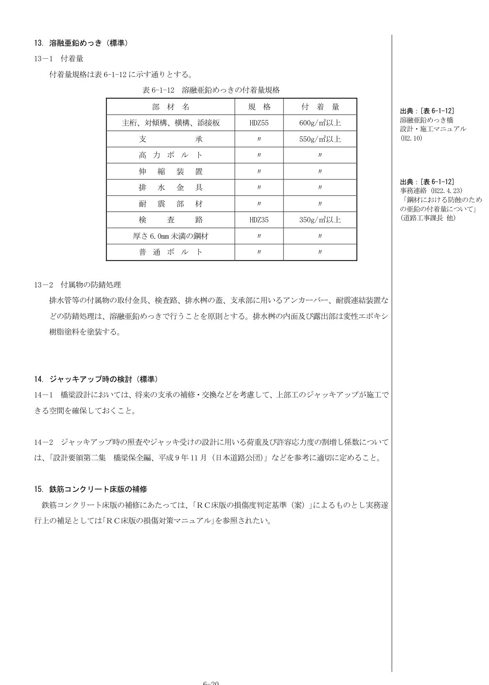

図6-1-18 重ね継手長の例（σck=24N/mm² SD345 D22の場合、31.25φ≒690mm）

{/* 図6-1-18: Page 20 */}

#### 12-3

異種径鉄筋の重ね継手長は、細径鉄筋に関する重ね継手長とする。

### 13. 溶融亜鉛めっき（標準）

#### 13-1 付着量

付着量規格は表6-1-12に示す通りとする。

表6-1-12 溶融亜鉛めっきの付着量規格

| 部材名 | 規格 | 付着量 |
|---|---|---|
| 主桁、対傾構、横構、添接板 | HDZ55 | 600g/m²以上 |
| 支承 | 〃 | 550g/m²以上 |
| 高力ボルト | 〃 | 〃 |
| 伸縮装置 | 〃 | 〃 |
| 排水金具 | 〃 | 〃 |
| 耐震部材 | 〃 | 〃 |
| 検査路 | HDZ35 | 350g/m²以上 |
| 厚さ6.0mm未満の鋼材 | 〃 | 〃 |
| 普通ボルト | 〃 | 〃 |

#### 13-2 付属物の防錆処理

排水管等の付属物の取付金具、検査路、排水桝の蓋、支承部に用いるアンカーバー、耐震連結装置などの防錆処理は、溶融亜鉛めっきで行うことを原則とする。排水桝の内面及び露出部は変性エポキシ樹脂塗料を塗装する。

### 14. ジャッキアップ時の検討（標準）

#### 14-1

橋梁設計においては、将来の支承の補修・交換などを考慮して、上部工のジャッキアップが施工できる空間を確保しておくこと。

#### 14-2

ジャッキアップ時の照査やジャッキ受けの設計に用いる荷重及び許容応力度の割増し係数については、「設計要領第二集 橋梁保全編、平成9年11月（日本道路公団）」などを参考に適切に定めること。

### 15. 鉄筋コンクリート床版の補修

鉄筋コンクリート床版の補修にあたっては、「ＲＣ床版の損傷度判定基準（案）」によるものとし実務遂行上の補足としては「ＲＣ床版の損傷対策マニュアル」を参照されたい。

### 16. 橋梁支点部の延命化対策

詳細設計業務を行うものについては、下記の対策を実施するものとする。

- (a) 伸縮装置からの漏水防止対策として、非排水型の伸縮装置を採用する。
- (b) 橋座面の滞水防止対策として、橋座部には排水勾配を設置、排水溝と排水管を設置する。
- (c) 桁端部の湿潤防止対策として、支承台座を高くとり、漏水の排水性・通風性を向上させる。
- (d) 維持管理の作業空間対策として、パラペットと桁端部との空間を確保し、支承交換作業等の作業性を向上させる。
- (e) 予防保全対策として、桁端部の塗装仕様を重防食塗装とし、鋼材の耐食性を向上させる。

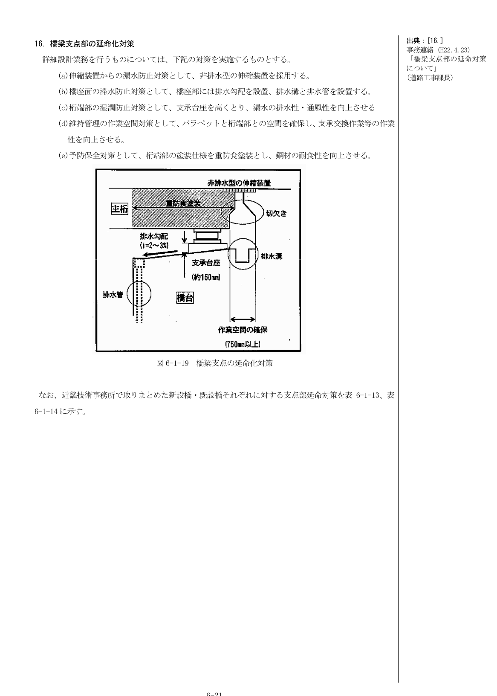

図6-1-19 橋梁支点の延命化対策

{/* 図6-1-19: Page 22 */}

なお、近畿技術事務所で取りまとめた新設橋・既設橋それぞれに対する支点部延命対策を表6-1-13、表6-1-14に示す。

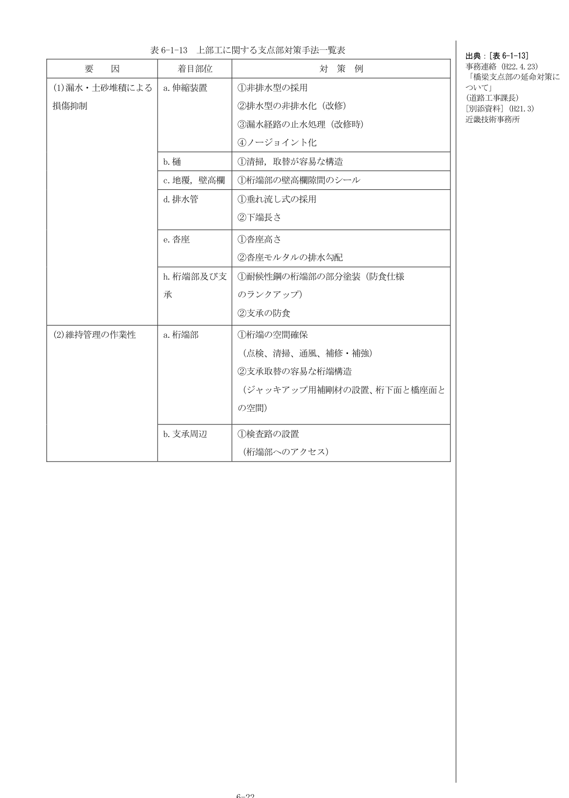

表6-1-13 上部工に関する支点部対策手法一覧表

{/* 表6-1-13: Page 23 */}

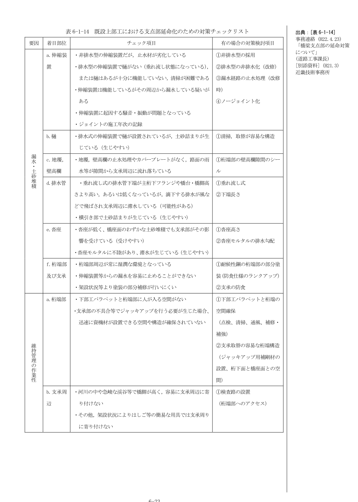

表6-1-14 既設上部工における支点部延命化のための対策チェックリスト

{/* 表6-1-14: Page 24 */}
