## 第1節 設計一般（標準）

この設計便覧は国土交通省近畿地方整備局管内の道路橋基礎工の設計に適用する。基礎工の設計は示方書および通達が全てに優先するので、示方書類の改訂、新しい通達などにより内容が便覧と異なった場合は便覧の内容を読み変えること。また、内容の解釈での疑問点などはその都度担当課と協議すること。

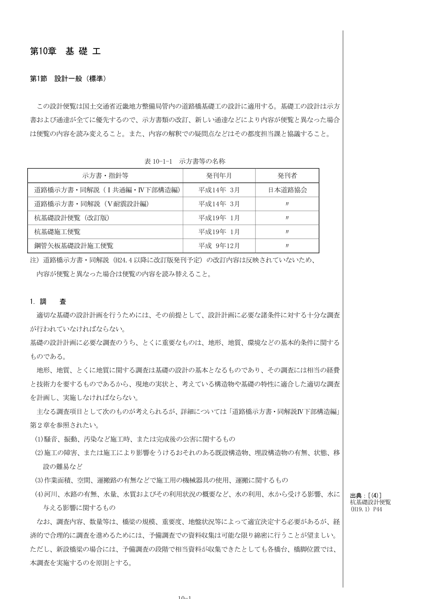

表10-1-1 示方書等の名称

注）道路橋示方書・同解説（H24.4以降に改訂版発刊予定）の改訂内容は反映されていないため、内容が便覧と異なった場合は便覧の内容を読み替えること。

### 1. 調査

適切な基礎の設計計画を行うためには、その前提として、設計計画に必要な諸条件に対する十分な調査が行われていなければならない。

基礎の設計計画に必要な調査のうち、とくに重要なものは、地形、地質、環境などの基本的条件に関するものである。

地形、地質、とくに地質に関する調査は基礎の設計の基本となるものであり、その調査には相当の経費と技術力を要するものであるから、現地の実状と、考えている構造物や基礎の特性に適合した適切な調査を計画し、実施しなければならない。

主なる調査項目として次のものが考えられるが、詳細については「道路橋示方書・同解説IV下部構造編」第2章を参照されたい。

(1) 騒音、振動、汚染など施工時、または完成後の公害に関するもの

(2) 施工の障害、または施工により影響をうけるおそれのある既設構造物、埋設構造物の有無、状態、移設の難易など

(3) 作業面積、空間、運搬路の有無などで施工用の機械器具の使用、運搬に関するもの

(4) 河川、水路の有無、水量、水質およびその利用状況の概要など、水の利用、水から受ける影響、水に与える影響に関するもの

なお、調査内容、数量等は、橋梁の規模、重要度、地盤状況等によって適宜決定する必要があるが、経済的で合理的に調査を進めるためには、予備調査での資料収集は可能な限り綿密に行うことが望ましい。ただし、新設橋梁の場合には、予備調査の段階で相当資料が収集できたとしても各橋台、橋脚位置では、本調査を実施するのを原則とする。

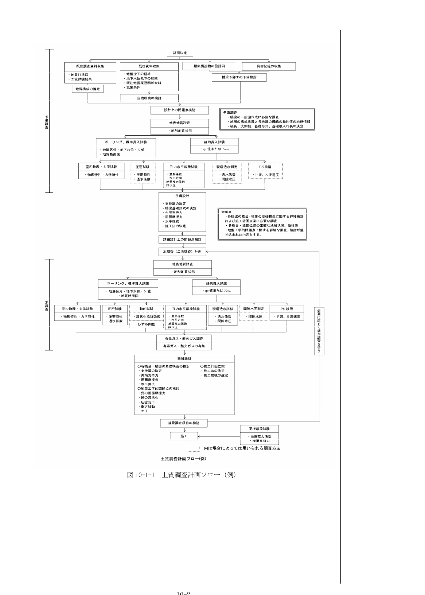

図10-1-1 土質調査計画フロー（例）

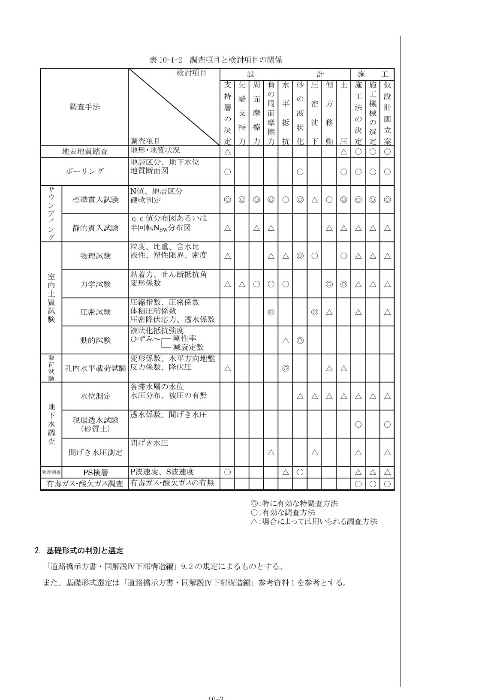

表10-1-2 調査項目と検討項目の関係

### 2. 基礎形式の判別と選定

「道路橋示方書・同解説IV下部構造編」9.2の規定によるものとする。

また、基礎形式選定は「道路橋示方書・同解説IV下部構造編」参考資料1を参考とする。

### 3. 支持層の選定と根入れ深さ

(1) 「道路橋示方書・同解説IV下部構造編」9.3の規定によるものとする。

(2) 直接基礎の根入れ深さ

直接基礎の支持層に対する根入れは、図10-1-2を標準とする。

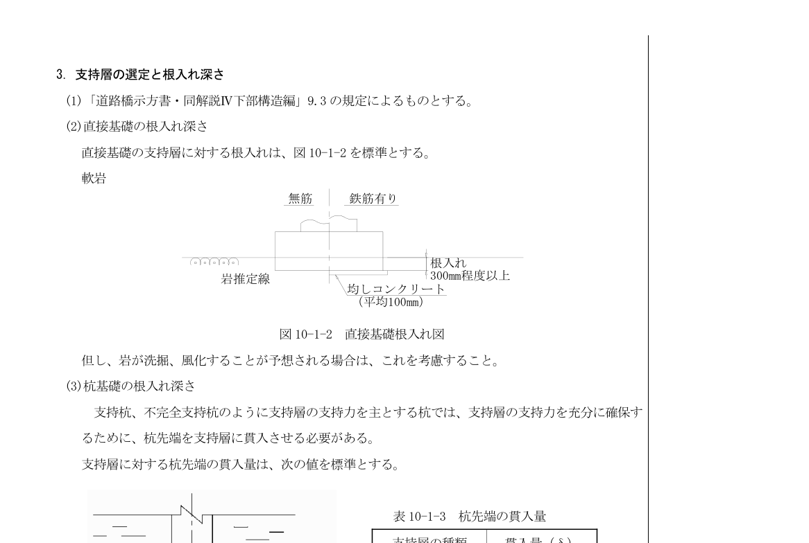

図10-1-2 直接基礎根入れ図

但し、岩が洗掘、風化することが予想される場合は、これを考慮すること。

(3) 杭基礎の根入れ深さ

支持杭、不完全支持杭のように支持層の支持力を主とする杭では、支持層の支持力を充分に確保するために、杭先端を支持層に貫入させる必要がある。

支持層に対する杭先端の貫入量は、次の値を標準とする。

表10-1-3 杭先端の貫入量

| 支持層の種類 | 貫入量（δ） |
|---|---|
| 硬岩 | 0 |
| 軟岩 | 0.3m |
| 砂質土、粘性土 | δ≧D |

支持層が傾斜している場合は貫入量は最も小さい部分δをとる。D：杭径

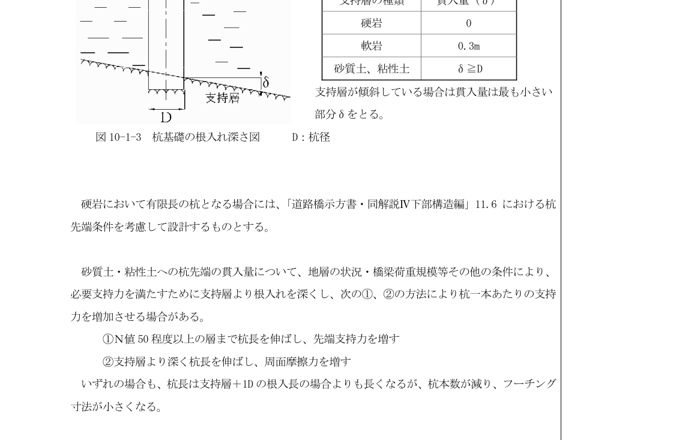

図10-1-3 杭基礎の根入れ深さ図

硬岩において有限長の杭となる場合には、「道路橋示方書・同解説IV下部構造編」11.6における杭先端条件を考慮して設計するものとする。

砂質土・粘性土への杭先端の貫入量について、地層の状況・橋梁荷重規模等その他の条件により、必要支持力を満たすために支持層より根入れを深くし、次の方法により杭一本あたりの支持力を増加させる場合がある。

- N値50程度以上の層まで杭長を伸ばし、先端支持力を増す
- 支持層より深く杭長を伸ばし、周面摩擦力を増す

いずれの場合も、杭長は支持層＋1Dの根入長の場合よりも長くなるが、杭本数が減り、フーチング寸法が小さくなる。

よって、図10-1-4のように支持層＋1Dの根入れの方法と支持層以深の根入れを深くする方法について、経済性・杭打設の施工性等を検討比較のうえ、杭基礎の根入れ深さを決定するのがよい。

なお、N値50程度以上の層への杭先端の貫入量は、杭径程度に抑えるのがよい。また、場所打ち杭の場合、一部の特殊なビットを用いることにより、支持層が岩であっても比較的容易に掘削が可能となる場合がある。そのような施工法を用い、杭を支持層に杭径以上根入れし、周面摩擦抵抗を期待するという設計も考えられるが、ここで示したように期待できる周面摩擦力に関する事例データは整理されていない。したがって、そのような場合には、載荷試験を行い周面摩擦抵抗を評価した上で設計を行う必要がある。

※ここで、支持層とは、N値30程度以上の砂層、砂れき層またはN値20程度以上の粘性土層を指す。

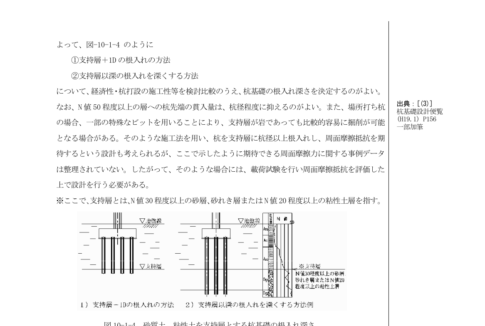

図10-1-4 砂質土、粘性土を支持層とする杭基礎の根入れ深さ

(4) 一連の構造物の基礎

（参考：鉄道構造物等設計標準・同解説 基礎構造物・抗土圧構造物 H.12.6 鉄道総合研究所）

一連の構造物の基礎は、できるだけ同一の支持条件になるように支持層を選定することが望ましい。これは地盤沈下や地震時の水平変位などが構造物に及ぼす影響をできるだけ同程度にそろえるためである。したがって、一連の構造物の基礎は図10-1-5のようにすることが望ましい。

支持層の深さや性状の変化、また構造物の荷重規模の差異などにより、やむを得ず支持条件が同一にできない場合には、支持性状の差が構造物の変状や機能低下につながらないよう検討を行う必要がある。

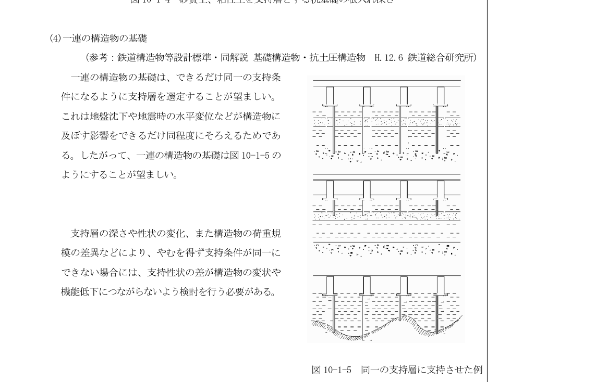

図10-1-5 同一の支持層に支持させた例

## 第2節 直接基礎の設計（標準）

### 1. 設計の基本（標準）

「道路橋示方書・同解説IV下部構造編」10.1の規定によるものとする。

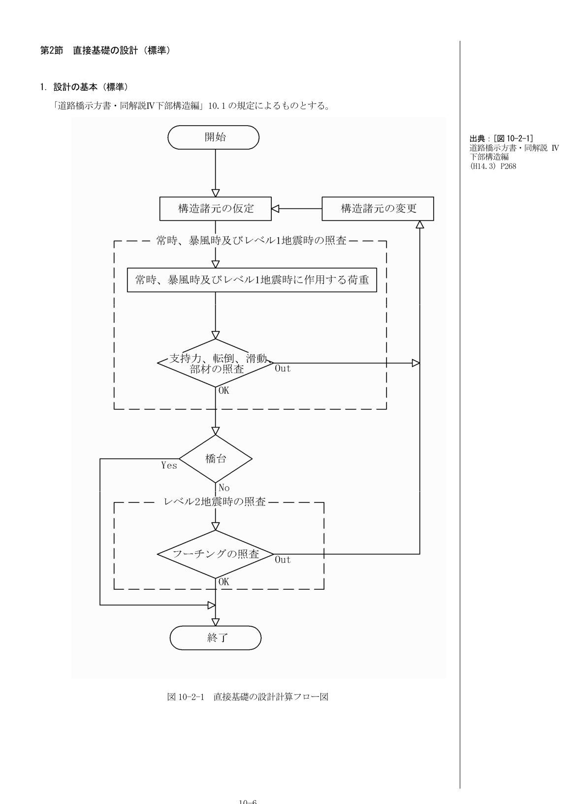

図10-2-1 直接基礎の設計計算フロー図

### 2. 斜面上の直接基礎

#### 2-1 鉛直方向極限支持力の計算

(1) 斜面上の基礎の鉛直支持力は次式から求める。

$$R_U = A' q_f$$

ここに、$A'$：有効載荷面積（m²）、$q_f$：荷重の偏心傾斜および斜面上の基礎で天端余裕幅を考慮した基礎地盤の極限鉛直支持力度（kN/m²）

$$q_f = q_{bo} + \frac{q_d - q_{bo}}{R} \times \frac{b}{B'}$$

$q_d$：水平地盤における極限支持力度（kN/m²）

$q_{bo}$：斜面上の基礎において荷重端が法肩にある状態（b=0）での極限鉛直支持力度（kN/m²）。基礎地盤が平坦な場合には $q_f = q_{bo}$ となる。ただし、段切り基礎の場合、$q_{bo}$ は次式から求める。

$$q_{bo} = \eta \left( \alpha c N_c (c^*)^\lambda + \beta \gamma' \frac{B'}{2} N_\gamma (B^*)^\mu \right)$$

$R$：水平地盤におけるすべり面縁端と荷重端との距離と載荷幅との比（R=γ'/B'）。せん断抵抗角φより求める。（図10-2-2参照、値は図10-2-3から求める。）

$b$：斜面上の基礎における前面余裕幅（m）

$B'$：有効載荷幅（m） $B' = B - 2e_B$

$e_B$：偏心距離

$N_c, N_\gamma$：図10-2-4〜5に示す荷重傾斜を考慮した支持力係数で基礎地盤のせん断抵抗角（φ）、荷重の傾斜（θ）、斜面傾斜（β）より求まる。

α、β：基礎の形状係数。「道路橋示方書・同解説IV下部構造編」表-解10.3.3による。

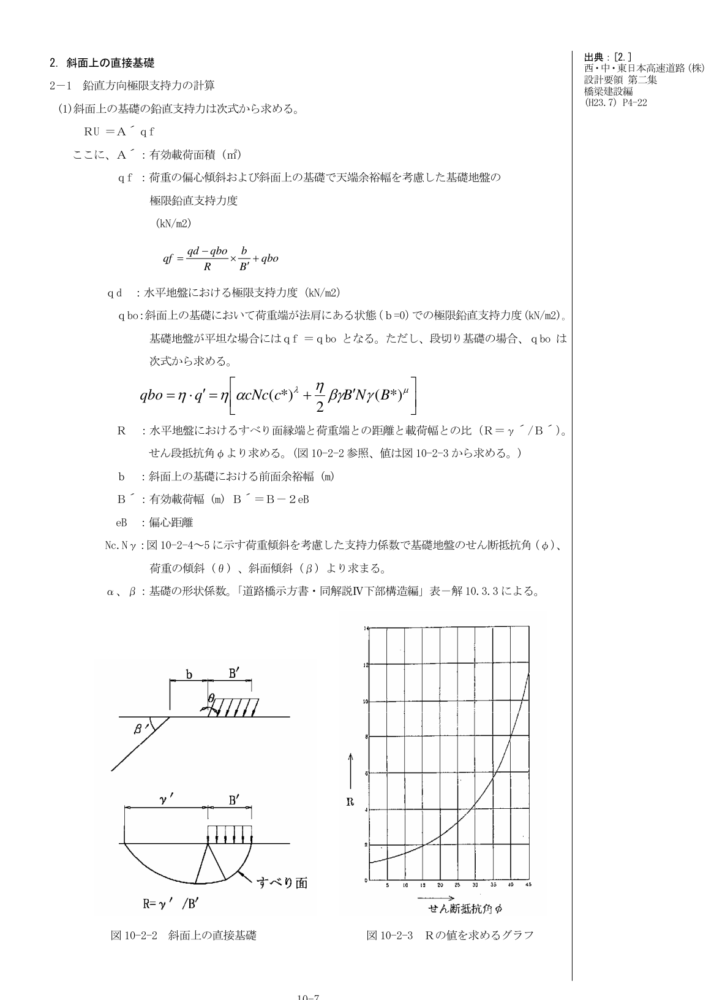

図10-2-2 斜面上の直接基礎 / 図10-2-3 Rの値を求めるグラフ

η：段切り基礎を用いる場合の補正係数で次式から求める。

$$\eta = 1 - m \cot(\omega)$$

ただし、基礎底面が平坦な場合η=1、η・B'≦aの場合、η・B'=aとする。

$m$：段切り高さ（h）のフーチング幅（B）との比、$m = \Sigma h / B$

$\omega = \pi/4 + \phi/2 - \theta$

θ：荷重の傾斜角度、c：地盤の粘着力（kN/m²）

$c^* = c / c_0$（ただし $1 \leq c^* \leq 10$）、$c_0 = 10$（kN/m²）

$B^* = B' / B_0$、$B_0 = 1.0$（m）

λ, μ：基礎の寸法効果に対する補正係数 λ=μ=-0.3とする。

ただし、せん断抵抗力φを道示等より推定する場合 $C^* = B^* = 1$ とする。

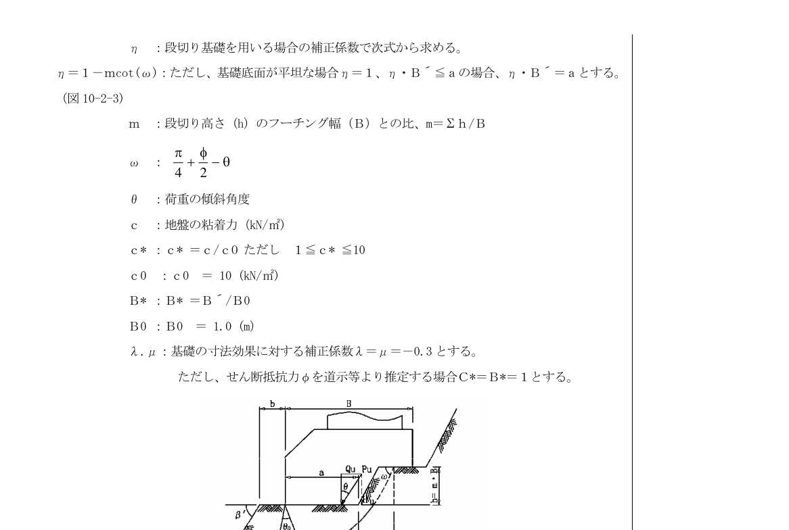

図10-2-4 段切り基礎のすべり面

β'：斜面傾斜角（°）ただし、地震時は次のように震度を考慮した角度（βe）とする。

$$\beta_e = \beta' + \tan^{-1} k_h$$

$k_h$：基礎地盤の震度

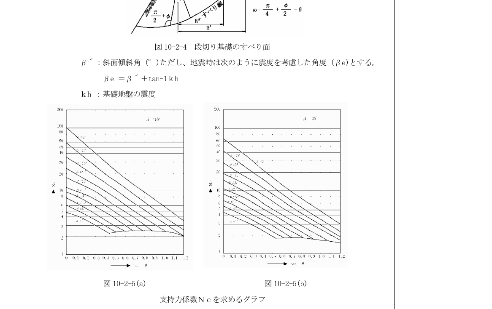

図10-2-5(a)〜(f) 支持力係数Ncを求めるグラフ

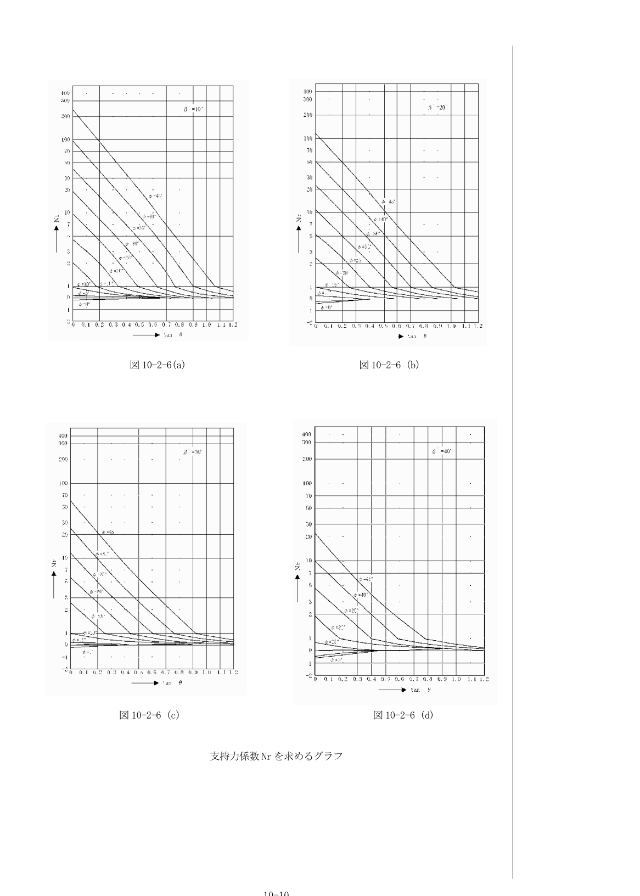

図10-2-6(a)〜(f) 支持力係数Nγを求めるグラフ

(2) 斜面上に基礎を設ける場合、上式により支持力を算出すると同時に、斜面の安定についても検討しなければならない。

#### 2-2 段差フーチング基礎

(1) 支持力及び転倒に対する照査

- 図10-2-7に示す仮想底面I-I（基礎幅B）によって行う。
- 荷重は躯体から伝達される荷重及び基礎自重、慣性力、基礎に作用する土圧等を考慮する。
- 仮想底面I-Iとフーチング底面間の地盤の重量は無視してよい。

(2) 滑動に対する安定

水平力に対する滑動の照査は図10-2-7に示す底面幅B″に生じる鉛直力V'により算出される滑動抵抗によって全水平力を負担するものとする。

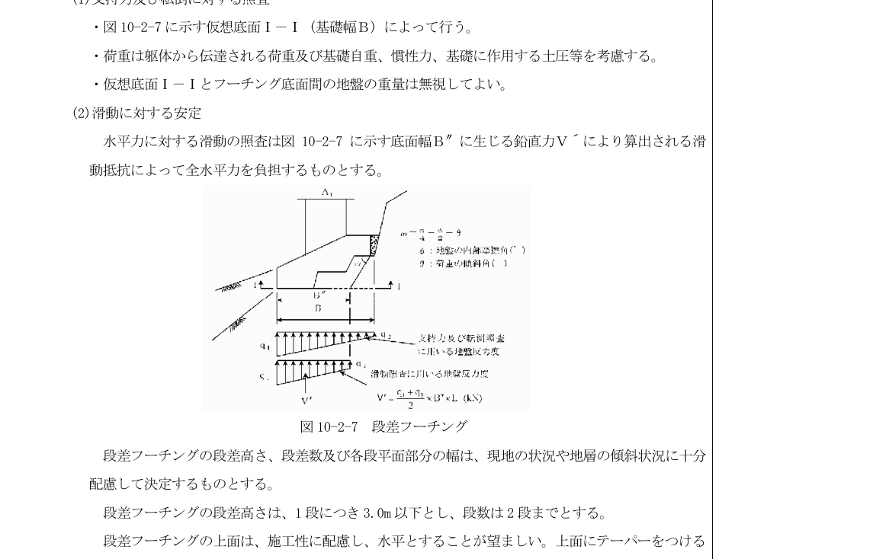

図10-2-7 段差フーチング

段差フーチングの段差高さ、段差数及び各段平面部分の幅は、現地の状況や地層の傾斜状況に十分配慮して決定するものとする。

段差フーチングの段差高さは、1段につき3.0m以下とし、段数は2段までとする。

段差フーチングの上面は、施工性に配慮し、水平とすることが望ましい。上面にテーパーをつける場合は、柱幅外に設けるものとする。

#### 2-3 置換えコンクリート基礎

(1) 本体の安定計算は置換えコンクリートを支持地盤と見なして行う。

(2) 置換えコンクリートの安定計算に用いる荷重は次のようにして求め、置換えコンクリート底面で安定計算を行う。

$V'$：滑動抵抗上の鉛直力および支持力照査用鉛直荷重（kN）= $W_V + N'$

$H_o'$：II-II断面の滑動力（kN）= $H_o + W_H$

$W_V$：置換えコンクリートの自重（kN）

$W_H$：置換えコンクリートの慣性力

$B_s$：最下段位置における置換え幅

$B_1$：フーチング底面位置における置換え幅

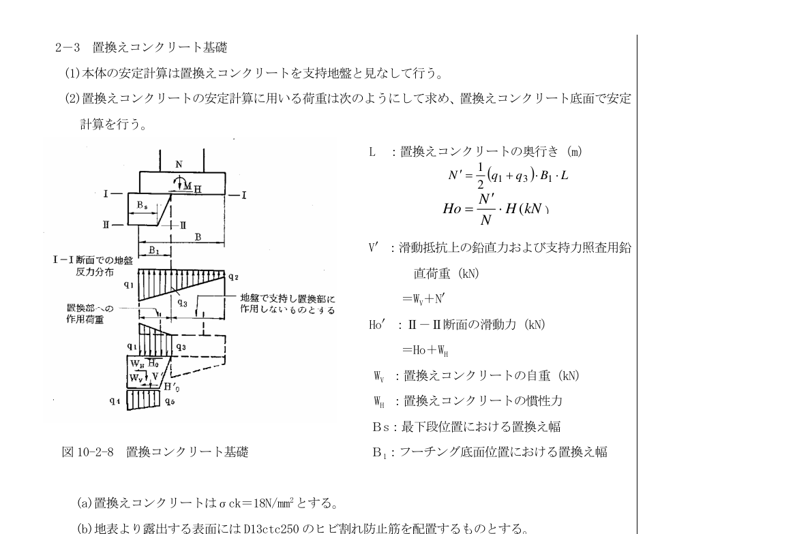

図10-2-8 置換コンクリート基礎

(a) 置換えコンクリートは $\sigma_{ck}$ =18N/mm²とする。

(b) 地表より露出する表面にはD13ctc250のヒビ割れ防止筋を配置するものとする。

(c) 置換えコンクリートとフーチングの摩擦は明確でないため、この面で滑動が発生しないよう差し筋を設置する。差し筋は差し筋のせん断耐力のみで置換えコンクリートと岩盤との摩擦力を下回らないものとする。

(d) 置換え基礎は、不良地盤に替わるコンクリート基礎であるため、その割合を大きくすることは好ましくない。よって、置換え基礎の範囲は次の程度を目安とする。

- 一方向の場合：1/3（置換え面積と基礎面積の比）以下
- 二方向の場合：1/4（置換え面積と基礎面積の比）以下
- 置換え基礎の全高：3.0m以下とし段数は1段までとする。
- 置換え面積：フーチング下端における置換えコンクリートの面積

なお、支持地盤の傾斜が激しいと考えられる斜面においては、ボーリング数を多くし、支持地盤の確認を行うことが望ましい。

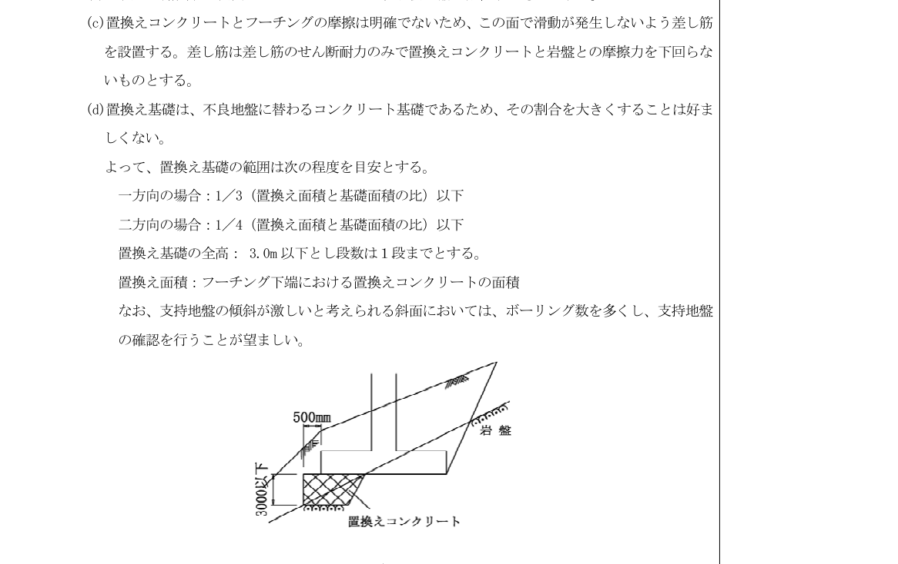

図10-2-9 置換えコンクリート

## 第3節 杭基礎の設計（標準）

### 1. 設計の基本

「道路橋示方書・同解説IV下部構造編」12.1の規定によるものとする。

(1) 杭基礎は良質な支持層に支持させる支持杭とすることが望ましい。

(2) 摩擦杭の採用にあたっては、「道路橋示方書・同解説IV下部構造編」12.4.1の規定によるものとする。

(3) 支持層の層厚は、杭先端から支持層に伝達された荷重強度がその下層に対して悪影響を及ぼさない程度以上の層圧を有することが必要である。層厚が十分でない場合には、「H19杭基礎設計便覧 参考資料6 薄層に支持された場所打ち杭」等を参照して基礎の安定性を検討しなければならない。

(4) 圧密沈下が生じる恐れがある場合は、負の周面摩擦力を考慮し、その支持力・杭体応力及び杭頭沈下量について検討しなければならない。なお、検討対象荷重は死荷重とする。

(5) 圧密沈下により杭が突出する場合は、杭打設後の沈下量を適切に評価し、突出杭として設計を行う。

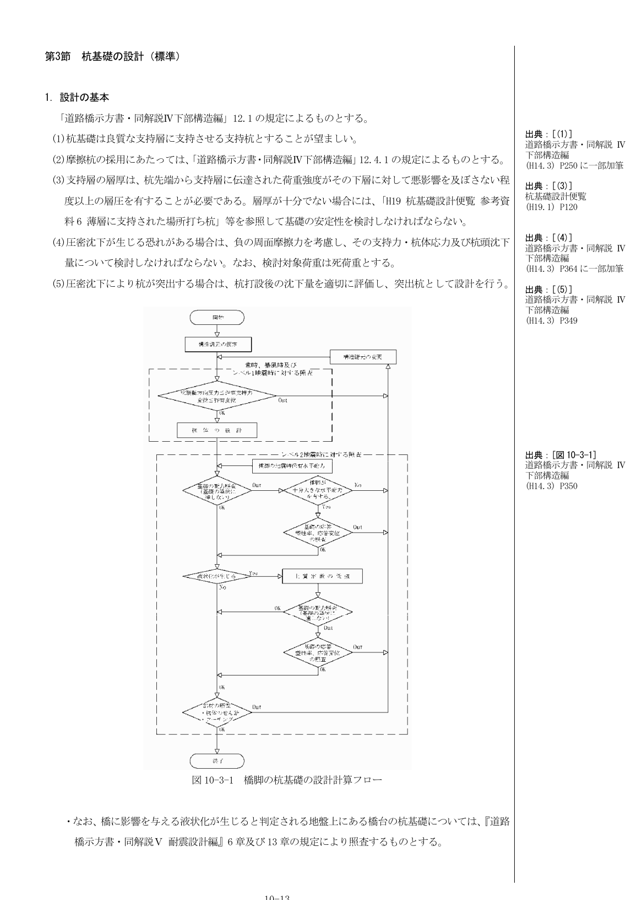

図10-3-1 橋脚の杭基礎の設計計算フロー

なお、橋に影響を与える液状化が生じると判定される地盤上にある橋台の杭基礎については、「道路橋示方書・同解説V 耐震設計編」6章及び13章の規定により照査するものとする。

### 2. 杭の配列

(1) 杭は原則として長期の持続荷重に対して均等に荷重を受けるように配列するものとする。

(2) 主荷重または主荷重と温度変化の影響の組合せに対し、原則として杭に負反力を生じさせてはならない。

(3) 杭の最小中心間隔は、原則として杭径の2.5倍とする。最外周の杭中心とフーチング縁端距離は、打込み杭・中掘り杭及びプレボーリング杭にあっては杭径の1.25倍、場所打ち杭では1.0倍、鋼管ソイルセメント杭では、ソイルセメント柱径の1.0倍としてよい。

(4) 縁端距離は一般に場所打ち杭では1.0D（D=杭径）とするが、山岳地で多用される深礎杭の場合には、地形を改変する掘削範囲をできるだけ縮小することが求められる。このため、深礎杭の縁端距離は、杭の水平方向押抜きせん断に対する安全性を確保することを前提として0.25mを最小としてよい。照査の方法は、（社）日本道路協会 道路橋の耐震設計に関する資料 H10.1 p8-45を参考としてよい。

### 3. 許容変位量

(1) 常時、暴風時及びレベル1地震時

下部構造から決まる許容変位量は杭径の1%とするが、杭径1,500mm以下の杭については、これまでの実績を考慮して15mmとする。また、基礎幅5mを超える大型の弾性体基礎（大口径深礎杭・ケーソン基礎・鋼管矢板基礎・地中連続壁基礎等）の許容変位量は50mmとする。なお、許容変位は、設計上の地盤面で照査することを原則とする。また、水平方向地盤反力係数算定式にレベル1地震時のKhが設定されることにより、許容変位量は従来のようにレベル1地震時、常時の区別なく同じ値とする。橋台基礎の場合は、基礎幅によらず、常時においてのみ15mmとする。

(2) レベル2地震時

基礎の塑性化を考慮した設計をする場合、過大な残留変位を防止する観点から基礎に生じる変位を制限する。橋脚基礎の場合、許容変位として、基礎天端あるいはフーチング底面における回転角0.02rad程度を目安としてよい。なお、基礎が降伏に達しないことを照査する場合には過大な残留変位が生じないものと考えられるため、許容変位に対する照査を行う必要はない。

(3) 許容変位量の緩和

基礎の水平変位に大きく影響する深度において、軟弱な地盤が支配的である場合、上記の許容変位を満足するように弾性解析法により設計を行い基礎の剛性を確保すると、杭頭反力や杭体の応力が小さくなりバランスを欠く設計となるケースが出てくる。よって、特に軟弱な沖積粘性土地盤（N値が4程度以下の粘性土を想定）に計画される橋脚の杭基礎の常時、暴風時およびレベル1地震時の設計は、杭基礎設計便覧に示される手順により、水平変位の制限値を杭径の3.5%に緩和してよい。

なお、制限値を緩和することができる対象杭種は、鋼管杭、鋼管ソイルセメント杭、PHC杭およびSC杭とし、場所打ち杭は対象としない。

### 4. 杭の選定

#### 4-1 杭径と杭種

杭種と杭径の使用範囲は、下記表10-3-1を目安とする。

表10-3-1 杭種と杭径の使用範囲

| 杭種 | 杭径（mm） |
|---|---|
| RC杭 | 300〜600 |
| PHC杭・SC杭 | 300〜1,000 |
| 鋼管杭（打込み・プレボーリング） | 400〜 |
| 鋼管杭（中掘り） | 500〜1,000 |
| 鋼管ソイルセメント杭（ソイルセメント柱径） | 700〜1,500 |
| 鋼管ソイルセメント杭（鋼管径） | 500〜1,200 |
| 場所打ちコンクリート杭 | 1,000〜 |
| 深礎杭 | 2,000〜 |

注）中掘り工法を採用する場合には、中間層のレキ径によっては、中掘り不能となるため、RC・PHC杭においては、500mm以上を使用することが望ましい。

### 5. 軸方向許容押込み支持力

杭の軸方向許容押込み支持力は、杭に対する地盤の強さから定められる許容支持力、構造物の安全または、使用上から定まる許容沈下量、および、杭の強度から定めるものとする。

#### 5-1

杭の支持力を求めるには、支持力公式（「道路橋示方書IV下部構造編」第12章杭基礎の設計）によって推定する。なお、N値の取り扱い、又中掘り杭工法でのN値および摩擦力度には特に注意すること。

#### 5-2 中掘り杭の極限支持力度および根固め方法

「道路橋示方書・同解説IV下部構造編」表-解12.4.2の規定によるものとする。ここで、コンクリート打設方式の場合、先端根固めは $\sigma_{ck}$ =18N/mm²を使用する。

### 6. 杭本体の設計

「道路橋示方書・同解説IV下部構造編」12.9.1の規定によるものとする。

### 7. 許容応力度

#### 7-1 RC杭・PHC杭

「道路橋示方書・同解説IV下部構造編」4.2の規定によるものとする。

#### 7-2 鋼管杭

「道路橋示方書・同解説IV下部構造編」4.4の規定によるものとする。

#### 7-3 場所打ちコンクリート杭

「道路橋示方書・同解説IV下部構造編」4.2および4.3の規定によるものとする。

#### 7-4 鋼管ソイルセメント杭

「道路橋示方書・同解説IV下部構造編」4.4の規定によるものとする。

#### 7-5 SC杭

「道路橋示方書・同解説IV下部構造編」4.2および4.4の規定によるものとする。

### 8. 構造細目

#### 8-1 PHC杭の仕様

「道路橋示方書・同解説IV下部構造編」12.11.1の規定によるものとする。

#### 8-2 鋼管杭の仕様

「道路橋示方書・同解説IV下部構造編」12.11.4の規定によるものとする。

ただし、杭を構成する鋼管はJISA5525（鋼管ぐい）に規定するものとする。原則としてミリサイズを使用する。

鋼管杭板厚は1mm毎とし、腐蝕しろは外径1mmを標準とし、設計計算はあらかじめ腐蝕しろを減じて行うものとする。

#### 8-3 鋼管ソイルセメント杭の仕様

「道路橋示方書・同解説IV下部構造編」12.11.5の規定によるものとする。

#### 8-4 SC杭の仕様

「道路橋示方書・同解説IV下部構造編」12.11.6の規定によるものとする。

#### 8-5 場所打ちコンクリート杭の配筋

(1) 「道路橋示方書・同解説IV下部構造編」12.11.3の規定によるものとする。

杭頭結合部においてはフーチング下面鉄筋と杭主鉄筋が交差し、特に鉄筋間隔が密となる。この主鉄筋を太径とすると、両者が干渉し、現場での鉄筋組立てが困難となるおそれがある。そこで、杭頭結合部における主鉄筋は、本便覧に示す一般的な鉄筋の径以下（フーチング下面鉄筋はD38、杭主鉄筋の配置はD35-1段）とすることが望ましい。（深礎杭を除く）

制約条件が伴いやむを得ず一般的な径より太径の鉄筋を使用する場合には、設計段階にてフーチング下面鉄筋と杭主鉄筋が干渉しないことを照査し、必要に応じ鉄筋配置の見直しを行うことが望ましい。

(2) 主鉄筋の配置は表10-3-2を標準とする。

表10-3-2 杭外縁から軸方向鉄筋の中心位置

| 工法 | かぶり |
|---|---|
| オールケーシング工法・リバース工法・アースドリル工法 | 杭主鉄筋中心までの距離 160mm |
| 深礎工法 | 純かぶり 70mm以上 |

図10-3-2 軸方向鉄筋中心までの距離

(3) 軸方向引張主鉄筋

- 材料：異形鉄筋
- フック：なし
- 配置：一段鉄筋
- 継手：重ね継手を標準とする。施工上その他の理由により、軸方向鉄筋の継手に重ね長をとれない場合は、アーク溶接やガス圧接等による継手を採用しなければならないことがあるが、その場合、現場作業の安全性、施工性、継手の確実性について十分検討を行うこと。
- 継手配置：千鳥配置を標準とする。（配置間隔は、1mあるいは定着長の長い方とする。）
- 継手長：「道路橋示方書・同解説IV下部構造編」式（7.8.1）より算出される重ね継手長以上とする。

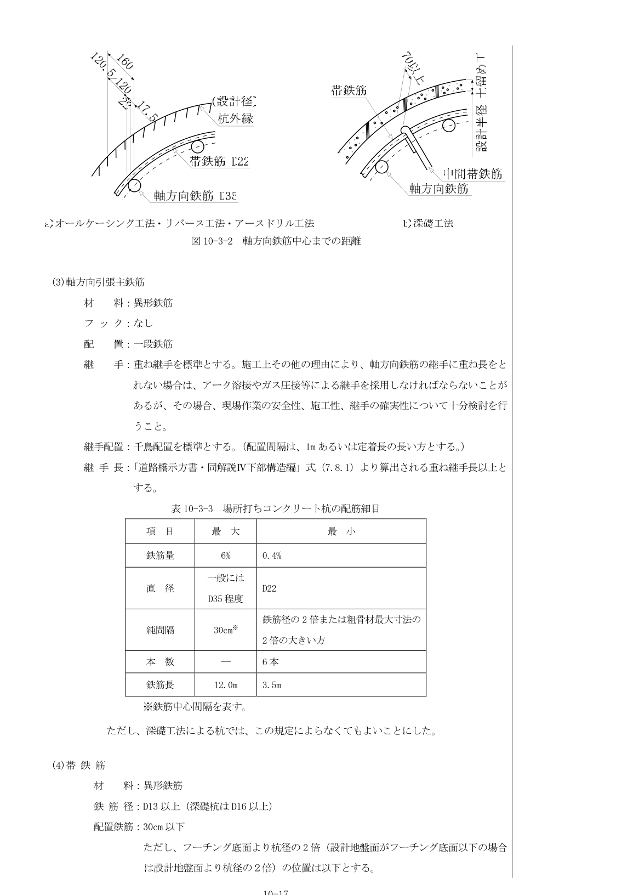

表10-3-3 場所打ちコンクリート杭の配筋細目

ただし、深礎工法による杭では、この規定によらなくてもよいことにした。

(4) 帯鉄筋

- 材料：異形鉄筋
- 鉄筋径：D13以上（深礎杭はD16以上）
- 配置鉄筋：30cm以下。ただし、フーチング底面より杭径の2倍（設計地盤面がフーチング底面以下の場合は設計地盤面より杭径の2倍）の位置は以下とする。

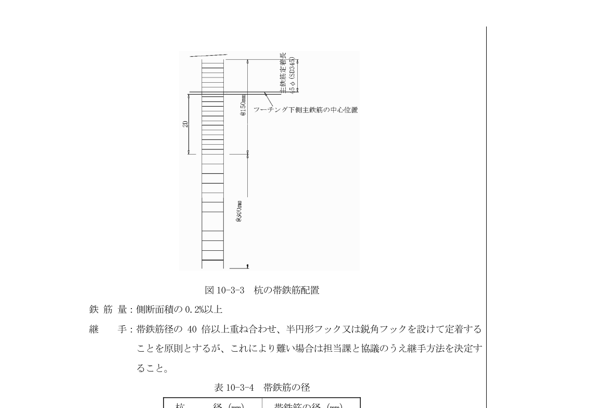

図10-3-3 杭の帯鉄筋配置

鉄筋量：側断面積の0.2%以上

継手：帯鉄筋径の40倍以上重ね合わせ、半円形フック又は鋭角フックを設けて定着することを原則とするが、これにより難い場合は担当課と協議のうえ継手方法を決定すること。

表10-3-4 帯鉄筋の径

| 杭径（mm） | 帯鉄筋の径 |
|---|---|
| 0.8 | D13 |
| 1.0 | D16 |
| 1.2 | D16 |
| 1.5 | D19 |
| 2.0 | D22 |

(5) 鉄筋篭

杭の最下端には、井げた状に組んだ鉄筋を配置するものとする。（深礎杭を除く）

鉄筋径：D22、鉄筋間隔：150〜200mm

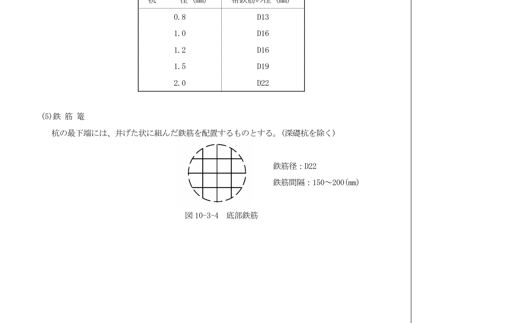

図10-3-4 底部鉄筋

#### 8-6 杭の断面変化位置

杭の断面変化は、杭の地中部の曲げモーメントの値が最大曲げモーメント（杭頭固定の場合と杭頭ヒンジの場合の大きい方）の1/2となる位置を標準とする。

(1) 場所打ち杭：「杭基礎設計便覧」III.2-6-6 p197およびIII.7-4 p334の規定によるものとする。

(2) 鋼管杭・鋼管ソイルセメント杭：「杭基礎設計便覧」III.2-6-2の規定によるものとする。

(3) PHC杭：「杭基礎設計便覧」III.2-6-3の規定によるものとする。

(4) RC杭：「杭基礎設計便覧」III.2-6-4の規定によるものとする。

(5) SC杭：「杭基礎設計便覧」III.2-6-5の規定によるものとする。

#### 8-7 杭の継手構造

(1) 鋼管杭：「道路橋示方書・同解説IV下部構造編」12.11.4の規定によるものとする。

(2) 既製コンクリート杭：「道路橋示方書・同解説IV下部構造編」12.11.1の規定によるものとする。

(3) 場所打ち杭：「道路橋示方書・同解説IV下部構造編」12.11.3の規定によるものとする。

(4) 鋼管ソイルセメント杭：「道路橋示方書・同解説IV下部構造編」12.11.5の規定によるものとする。

(5) SC杭：「道路橋示方書・同解説IV下部構造編」12.11.6の規定によるものとする。

#### 8-8 杭頭部とフーチングの結合部構造

杭頭部の結合方式としては、一般に剛結合とヒンジ結合が考えられ、どの方式を採用するかは、構造物の形式、機能、フーチングの形状、寸法、杭の種類、地盤条件、施工の難易等を考慮して決定する必要がある。ただし、橋梁基礎においては原則として剛結合とし、その結合方法は方法Bとする。

また、一般の擁壁では杭本体を経済的に設計できるヒンジ結合を採用するものとする。ただし、地震時の設計を行う場合や、変位量を小さくする必要のある場合、軟弱地盤上に擁壁を設置する場合などには剛結合とすることが望ましい。

**(1) 剛結とヒンジの比較**

(a) 軸方向押込み力に対して差異はない。

(b) 軸直角方向力を受けた場合の杭頭の移動量はヒンジと考えた場合には、剛結と考えた場合の約2倍となる。したがって、杭頭の移動量が制限される場合にはヒンジと考えた場合の許容荷重は剛結の約1/2となる。

**(2) 剛結合**

杭頭部の結合方式は次の方法による。

- **方法A**：フーチングの中に杭を一定長さだけ埋込み、埋込んだ部分によって杭頭曲げモーメントに抵抗する方法。杭頭部の埋込み長は杭径以上とする。鋼管杭、鋼管ソイルセメント杭、PHC杭、鉄筋コンクリート杭、SC杭に適用することができる。
- **方法B**：フーチング内の杭の埋込み長さは最小限度に留め、主として鉄筋で補強することにより杭頭曲げモーメントに抵抗する方法。杭頭部の埋込み長は10cmとする。鋼管杭、鋼管ソイルセメント杭、PHC杭、鉄筋コンクリート杭、SC杭、場所打ちコンクリート杭に適用することができる。

剛結合として取扱う場合の注意事項：

(a) 曲げモーメント、せん断力、軸力のすべてに対して抵抗できるように設計しなければならない。またラーメン隅角部等の断面急変部と同様、応力集中が考えられるから、用心鉄筋を入れておくのが望ましい。

(b) 軸方向押込み力に対しては、杭頂面の支圧力で持たせ、フーチング内に埋込まれている杭頭部周面の付着力は期待しないほうがよい。

(c) 軸方向引抜き力を受ける杭では、十分に鉄筋を配置するとともに、鉄筋の付着長も十分とれるよう特に注意をしなければならない。

(d) 押込み力PとモーメントMまたは引抜力PtとモーメントMが作用する場合には、鉄筋コンクリート断面を仮定して鉄筋とコンクリートの応力度を検討する。

**(3) ヒンジ結合**

(a) 杭頭部は、軸力とせん断力に対して安全であるように設計し、フーチングと杭頭は曲げモーメントが伝わらないよう回転できる構造としなければならない。一般に、杭頭部はフーチングに10cm程度埋込む。

(b) 杭頭ヒンジの場合、理論的には杭頭曲げモーメントは零であるが、完全なヒンジ構造は一般には期待できないので、杭頭固定端モーメントによる影響を考慮する。

(c) 軸力に対する配慮は剛結合の場合と同様である。

**(4) 橋脚と大口径深礎との接合部の配筋**

橋脚躯体と大口径深礎の接合部の配筋は「東・中・西日本高速道路（株）設計要領 第二集」を参考として良い。

#### 8-9 杭頭部とフーチングの結合部の設計手法

(1) 鋼管杭・PHC杭・RC杭・場所打ち杭・鋼管ソイルセメント杭・SC杭：「杭基礎設計便覧」III.6-3の規定によるものとする。

(2) 構造細目

(a) 「道路橋示方書・同解説IV下部構造編」12.9.3の規定によるものとする。

(b) 方法Aにより杭頭部を処理する場合に、杭によってフーチング下側主鉄筋が切断されるので、図10-3-5に示すように配筋する。

補強のため斜めに入れる主鉄筋は次の断面が有効となる。

$$A_{ste} = A_{st}' \cdot \cos\theta$$

ここに、$A_{ste}$：斜めに入れた主鉄筋の有効断面積（mm²）、$A_{st}'$：斜めに入れた主鉄筋の断面積（mm²）、θ：図10-3-6に示す主鉄筋の角度

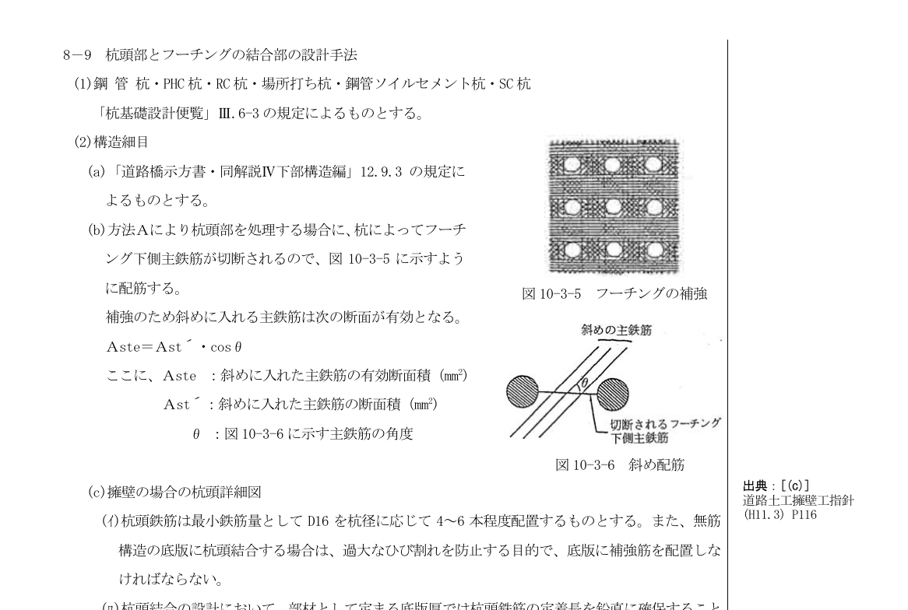

図10-3-5 フーチングの補強 / 図10-3-6 斜め配筋

(c) 擁壁の場合の杭頭詳細図

- (ｲ) 杭頭鉄筋は最小鉄筋量としてD16を杭径に応じて4〜6本程度配置するものとする。また、無筋構造の底版に杭頭結合する場合は、過大なひび割れを防止する目的で、底版に補強筋を配置しなければならない。
- (ﾛ) 杭頭結合の設計において、部材として定まる底版厚では杭頭鉄筋の定着長を鉛直に確保することが困難な場合がある。この場合は、底版厚を増加させることなく、杭頭鉄筋に曲げ加工を施すなど十分な定着力を発揮する構造を採用してもよい。
- (ﾊ) 杭頭鉄筋の定着長は、地震時において橋梁のような大きな振動が生じにくいと考えられることから、これまでの規定と同じ35φ（φ：杭頭鉄筋径）を確保すればよい。
- (ﾆ) 擁壁工で杭頭剛結合を採用する場合においても、これまでの規定と同じ35φを確保すればよい。
- (ﾎ) ヒンジ結合用の杭頭鉄筋は、鉄筋かご径dが200mm以上の場合には、結合部において曲げ加工を施し鉄筋かごを鉄筋径程度までしぼり込むものとする。鉄筋かご径dが200mm未満の場合には、直筋としてよい。
- (ﾍ) 中詰コンクリートは躯体コンクリートと同等のものを使用するものとする。

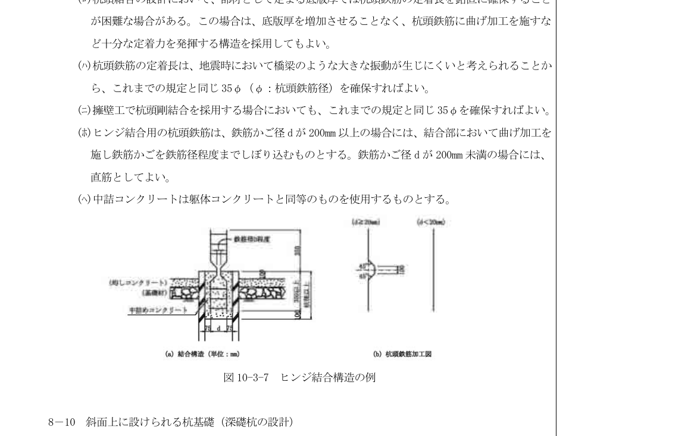

図10-3-7 ヒンジ結合構造の例

#### 8-10 斜面上に設けられる杭基礎（深礎杭の設計）

斜面上に設けられる杭基礎（深礎杭）の設計は、「杭基礎設計便覧」III.4-2によるものとする。

## 第4節 ケーソン基礎の設計（標準）

ケーソン基礎の設計は、「道路橋示方書・同解説IV下部構造編」第11章の規定によるものとする。

## 第5節 鋼管矢板基礎（標準）

鋼管矢板基礎の設計は、「道路橋示方書・同解説IV下部構造編」第13章の規定によるものとする。

## 第6節 地中連続壁基礎（標準）

地中連続壁基礎の設計は、「道路橋示方書・同解説IV下部構造編」第14章の規定によるものとする。

## 第7節 近接基礎の設計（参考）

### 1. 総則

#### 1-1 適用範囲

本要領は、既設の道路構造物に近接して橋梁基礎構造の設計施工を行う場合、その施工に起因して生じる既設構造物の変位・変形の検討に適用する。

#### 1-2 用語の定義

1. **近接基礎工事** — 既設構造物の近傍において新設構造物の基礎の施工を実施することによって周辺地盤に変位が生じ、そのため既設構造物の安全性や機能に影響を与える恐れのある工事。

2. **近接程度の範囲** — 既設構造物と新設構造物の近接程度を工学的に表わしたもので影響外範囲I、要注意範囲II、影響範囲IIIに分けられる。

3. **影響外範囲I** — 一般に、新設構造物の施工による地盤変位の影響が及ばないと考えられる範囲。

4. **影響範囲III** — 新設構造物の施工による地盤変位の影響が及ぶと考えられる範囲で、既設構造物がこの範囲にある場合は必要に応じて適切な対策工を実施すると同時に、施工中における既設構造物、仮設構造物、周辺地盤等の変位・変形の観測を行わなければならない。

5. **要注意範囲II** — 新設構造物の施工に伴う直接の影響は受けないが、影響範囲IIIの領域の土塊が変位することに伴う間接的な影響をうけて変位を生ずる可能性のある範囲で、既設構造物がこの範囲内にある場合には、特に対策工を実施する必要はないが、既設構造物の変位・変形観測のための現場計測を実施しなければならない。

#### 1-3 近接工事の設計・施工

既設構造物に近接して橋梁基礎構造の施工を計画する場合には、あらかじめ既設構造物へ与える影響について検討し、必要に応じて対策工の実施や施工中の変位・変形の観測等、適切な措置を構ずるものとする。

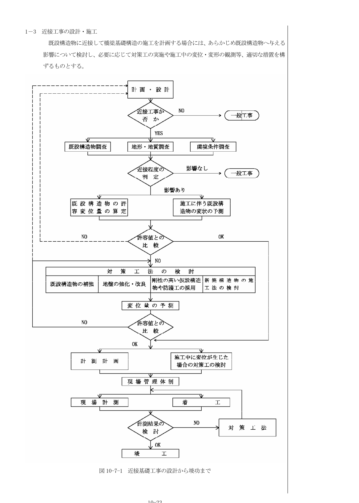

図10-7-1 近接基礎工事の設計から竣功まで

### 2. 調査

近接工事を計画する場合には、原則として次の調査を行う。

(1) 地盤に関する調査：ボーリング、サンプリング、サウンディング、土質試験、地下水調査

(2) 既設構造物に関する調査：基礎構造物、下部工躯体、上部構造についての資料調査、施工実態や老朽の程度についての現場調査

### 3. 近接程度の判定

#### 3-1 近接程度の判定方法

(1) 近接程度は、既設構造物が新設構造物の形式や施工法と地盤条件から決まる次の3つの範囲のいずれに属するかによって判定する。

- 影響外範囲 I
- 要注意範囲 II
- 影響範囲 III

(2) 近接程度の判定は、新設構造物の施工方法を考慮し、最も危険と考えられる段階ごとに行うものとする。

> **（解 説）**
>
> 1 近接程度の判定は、条文にあるように既設構造物が影響外範囲I、要注意範囲II、影響範囲IIIのいずれに属するかによって行う。この3つの範囲は、主として新設構造物の形式や施工法と地盤条件から決まるものであり、それぞれの範囲の意味は1-2で定義したとおりである。
>
> また、既設構造物が2つの範囲にまたがって存在する場合は、地盤条件や基礎本体の剛性を考慮して、総合的に判断しなければならないが、一般的には次のように判断してよい。
>
> (1) 影響外範囲Iと要注意範囲IIにまたがる場合 — 要注意範囲IIとする。
>
> (2) 影響範囲IIIにまたがる場合 — ｲ) 既設構造物が直接基礎またはケーソン基礎の場合、影響範囲IIIと他の領域を区分する境界線が既設基礎底面を通る場合は影響範囲IIIとする。その他の場合は要注意範囲IIとする。ﾛ) 既設構造物が杭基礎の場合、影響範囲IIIと他の領域を区分する境界線が基礎底面を通る場合、または影響IIIにかかる領域が基礎全体の概ね1/3以上になる場合は影響範囲IIIとする。

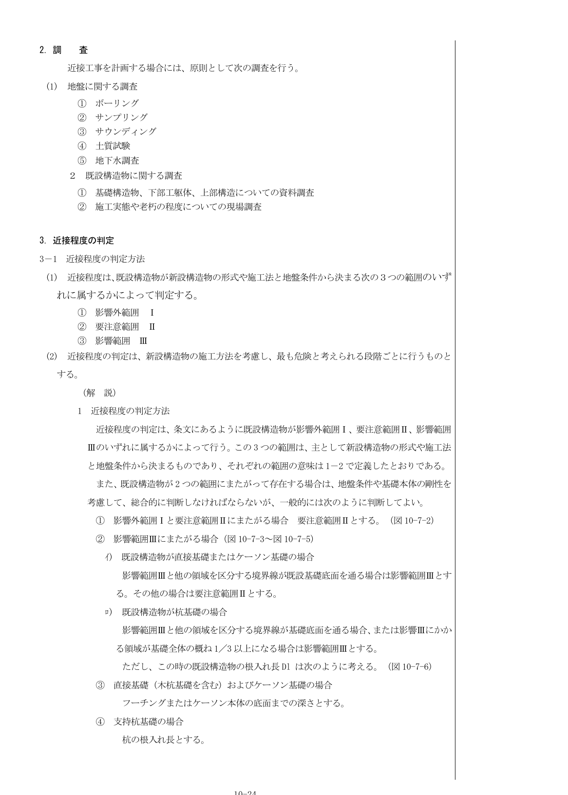

図10-7-2〜図10-7-6 近接程度の判定

#### 3-2 近接程度の判定

**(1) 新設基礎が開削工法の場合の影響範囲**

新設基礎が開削工法の場合は、(1)土留め壁のたわみ変形に起因する影響範囲、(2)土留め壁の引抜きによる影響範囲、(3)ヒービングに対する影響範囲についてそれぞれ検討を行う。

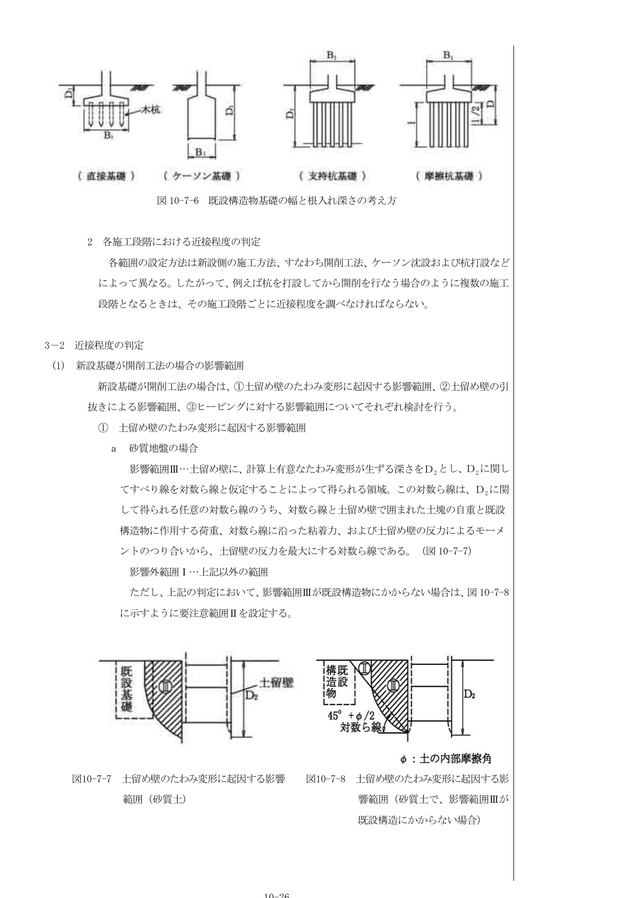

図10-7-7〜図10-7-11 開削工法の影響範囲

**(2) 新設基礎がケーソン基礎の場合の影響範囲**

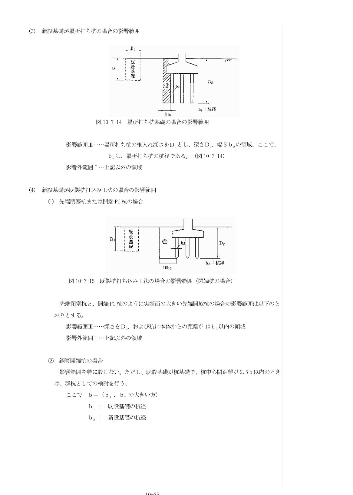

図10-7-12〜図10-7-13 ケーソン基礎の影響範囲

**(3) 新設基礎が場所打ち杭の場合の影響範囲**

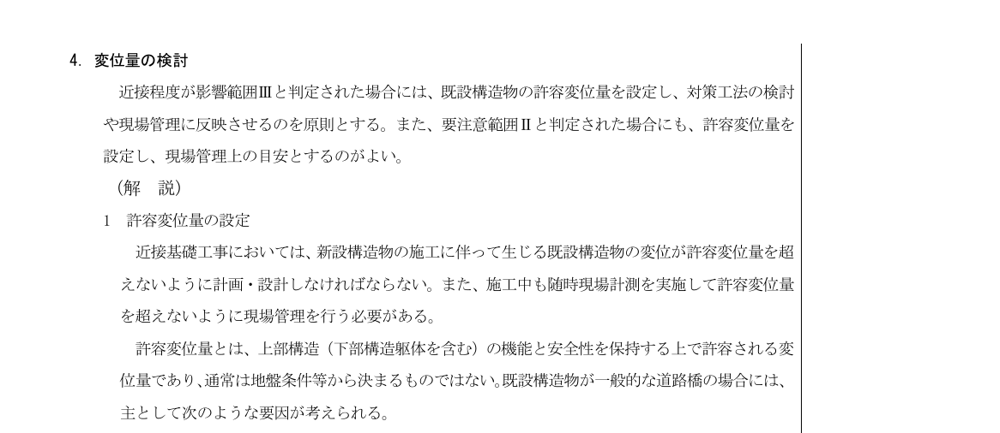

図10-7-14 場所打ち杭基礎の場合の影響範囲

**(4) 新設基礎が既製杭打込み工法の場合の影響範囲**

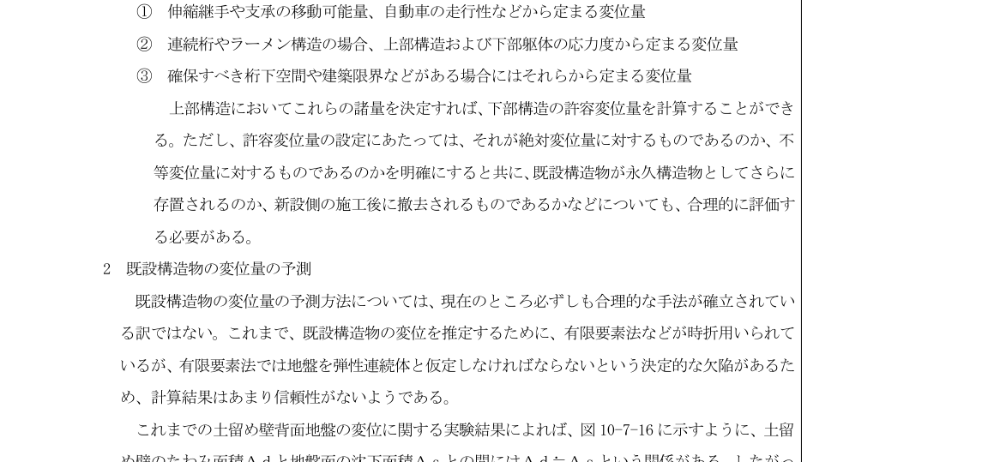

図10-7-15 既製杭打ち込み工法の場合の影響範囲

### 4. 変位量の検討

近接程度が影響範囲IIIと判定された場合には、既設構造物の許容変位量を設定し、対策工法の検討や現場管理に反映させるのを原則とする。また、要注意範囲IIと判定された場合にも、許容変位量を設定し、現場管理上の目安とするのがよい。

> **（解 説）**
>
> 1 許容変位量の設定
>
> 近接基礎工事においては、新設構造物の施工に伴って生じる既設構造物の変位が許容変位量を超えないように計画・設計しなければならない。また、施工中も随時現場計測を実施して許容変位量を超えないように現場管理を行う必要がある。
>
> 許容変位量とは、上部構造（下部構造躯体を含む）の機能と安全性を保持する上で許容される変位量であり、通常は地盤条件等から決まるものではない。
>
> 2 既設構造物の変位量の予測
>
> 既設構造物の変位量の予測方法については、現在のところ必ずしも合理的な手法が確立されている訳ではない。これまでの現場計測結果によれば、既設構造物が「要注意範囲II」と判定された場合には、既設構造物の変位は0〜5mm程度の沈下となった例が多く、「影響範囲III」と判定された場合には、地盤の変位量の分だけ既設構造物も変位することを見込んでおくのがよいようである。

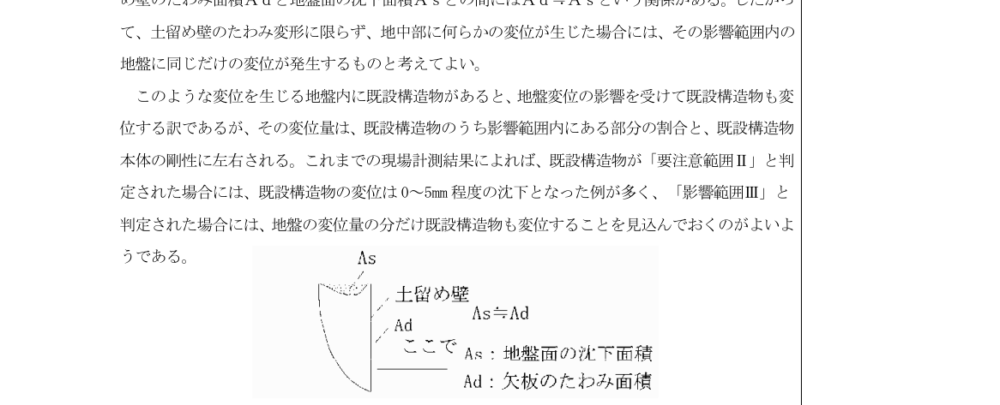

図10-7-16 土留め壁のたわみ面積と地盤面の沈下面積の関係

### 5. 対策工法

既設構造物が影響範囲内にある場合には適切な対策工法を講じなければならない。

> **（解 説）**
>
> 対策工法は主として次の4つに分類されるが、それぞれの現場に応じて最も適切な工法を選択しなければならない。
>
> 1. 既設構造物、特に下部構造、基礎構造を補強し、変形に対する抵抗力を高める。
> 2. 地盤の強化、改良を行って、変位の伝播を抑える。
> 3. 新設側構造物の本体あるいは仮設構造物の剛性を高め、原因となる変形を抑える。
> 4. 新設構造物の施工法に関して各種別ごとに適切な工法を選択すると共に状況に応じて工法上の配慮をする。

{/* 図・表のページ対応表
--- 図 ---
図10-1-1 土質調査計画フロー（例） → r10-fig-01 (p3)
表10-1-2 調査項目と検討項目の関係 → r10-tbl-02 (p4)
図10-1-2 直接基礎根入れ図 → r10-fig-02 (p5)
図10-1-3 杭基礎の根入れ深さ図 → r10-fig-03 (p5)
図10-1-4 砂質土、粘性土を支持層とする杭基礎の根入れ深さ → r10-fig-04 (p6)
図10-1-5 同一の支持層に支持させた例 → r10-fig-05 (p6)
図10-2-1 直接基礎の設計計算フロー図 → r10-fig-06 (p7)
図10-2-2, 図10-2-3 斜面上の直接基礎, Rの値を求めるグラフ → r10-fig-07 (p8)
図10-2-4 段切り基礎のすべり面 → r10-fig-08 (p9)
図10-2-5(a)〜(f) 支持力係数Ncを求めるグラフ → r10-fig-09 (p9-10)
図10-2-6(a)〜(f) 支持力係数Nrを求めるグラフ → r10-fig-10 (p11-12)
図10-2-7 段差フーチング → r10-fig-11 (p12)
図10-2-8 置換コンクリート基礎 → r10-fig-12 (p13)
図10-2-9 置換えコンクリート → r10-fig-13 (p13)
図10-3-1 橋脚の杭基礎の設計計算フロー → r10-fig-14 (p14)
図10-3-2 軸方向鉄筋中心までの距離 → r10-fig-15 (p18)
図10-3-3 杭の帯鉄筋配置 → r10-fig-16 (p19)
図10-3-4 底部鉄筋 → r10-fig-17 (p19)
図10-3-5, 図10-3-6 フーチングの補強, 斜め配筋 → r10-fig-18 (p22)
図10-3-7 ヒンジ結合構造の例 → r10-fig-19 (p22)
図10-7-1 近接基礎工事の設計から竣功まで → r10-fig-20 (p24)
図10-7-2〜図10-7-6 近接程度の判定 → r10-fig-21 (p25-26)
図10-7-7〜図10-7-11 開削工法の影響範囲 → r10-fig-22 (p27-29)
図10-7-12〜図10-7-13 ケーソン基礎の影響範囲 → r10-fig-23 (p30)
図10-7-14 場所打ち杭基礎の場合の影響範囲 → r10-fig-24 (p31)
図10-7-15 既製杭打ち込み工法の場合の影響範囲 → r10-fig-25 (p31)
図10-7-16 → r10-fig-26 (p31)

--- 表 ---
表10-1-1 示方書等の名称 → r10-tbl-01 (p2)
表10-1-2 調査項目と検討項目の関係 → r10-tbl-02 (p4)
表10-3-3 場所打ちコンクリート杭の配筋細目 → r10-tbl-03 (p18)
*/}
