## 第1節 設計一般（標準）

この設計便覧は国土交通省近畿地方整備局管内の道路付属構造物の設計に適用する。

道路付属構造物の設計は、各節の冒頭に記述する示方書等によるほか、この設計便覧によるものとする。なお、示方書および通達が全てに優先するので示方書の改訂、新しい通達等により内容が便覧と異なる場合は、便覧の内容を読み変えること。また、内容の解釈での疑問点はその都度担当課と協議すること。

## 第2節 中央帯の構造（標準）

中央帯の幅員及び中央分離帯の基本的構造条件は、「道路構造令の解説と運用」（平成16年2月 日本道路協会）によるものとする。

また、中央分離帯の具体的な構造は、以下に挙げる設置目的が達成できるものとする。

1. 上下車道の交通分離
2. 対向車線への逸走防止による安全確保
3. 分離帯進入車の乗員の安全確保（進入車の分離帯内停車またはコントロール確保）
4. 側方余裕の確保（建築限界、視距確保等のために必要な余裕幅）
5. 排水等の施設設置の場所
6. 車道端または線形の明示
7. Uターン防止
8. 対向車の眩光防止

### 1. 防護柵の設置

防護柵の設置は、「防護柵の設置基準・同解説」（平成20年1月 日本道路協会）によるものとする。

### 2. 植樹

中央分離帯に植樹を設ける場合は、遮光効果、視線誘導効果とともに、道路景観、都市景観の形成に寄与できる計画とする。樹木等の選定は、排気ガス等に対して抵抗力があり、維持が容易な品種を選定する必要がある。

また、交差点等は、交通流が複雑にふくそうする場所であるから、植栽等の設置にあたっては、特に交通視距の確保に障害とならない場所とする必要がある。（第13章 環境保全(案)参照）

### 3. 遮光

(1) 目的

眩光防止施設は夜間に対向車道を走行中の車両がおよぼす眩光を防止する目的で中央帯に防眩柵や網等を設置するものとする。

(2) 設置場所

4車線以上の分離された道路で高速通行や大型車の通行が多く、植樹による眩光防止が困難な所に必要に応じ設置することができる。

(3) 設置高さ

標準としては舗装面から1.4m程度とする。なお、交差点部分に対しては見通しの確保に留意し、適切に設定するものとする。

## 第3節 バス停車帯（標準）

バス停車帯の設計は、「道路構造令の解説と運用」によるほか、この設計便覧によるものとする。

### 1. 設置要領

#### 1-1 第3種第1級の道路

第3種第1級の道路のバス停車帯は原則として図11-3-1の構造とする。

なお、延長諸元、幅員諸元は、「道路構造令の解説と運用」によるものとする。

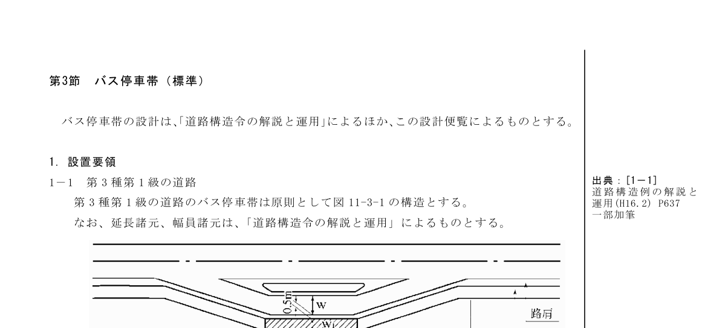

図11-3-1 第3種1級の道路のバス停車帯

注1）乗降場幅（W1）は前後の歩道幅員に合わせるものとするが、最低2.00mは確保する。

注2）バス停に屋根やベンチなどを設置する場合の施設帯幅は、W1に含めないものとする。

注3）積雪地域については、外側分離帯をマーキング処理する。

#### 1-2 その他の道路

第3種1級をのぞく第3種、第4種の道路のバス停車帯は図11-3-2の構造とする。

なお、延長諸元、幅員諸元は、「道路構造令の解説と運用」によるものとする。

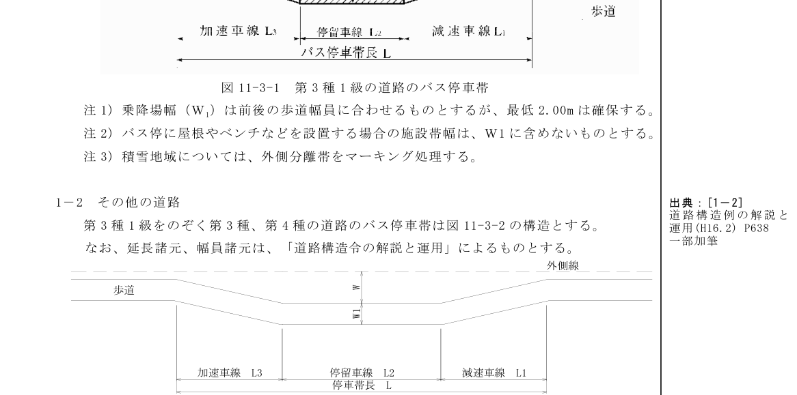

図11-3-2 第3種（第1級を除く）、第4種の道路のバス停車帯

注1）乗降場幅（W1）は前後の歩道幅員に合わせるものとするが、最低2.0mは確保する。

注2）バス停に屋根やベンチなどを設置する場合の施設帯幅は、W1に含めないものとする。

**（参考）**

十分な停車帯延長が確保できない箇所で、身障者への配慮が求められる場合は、図11-3-3に示す形状の適用について検討する。

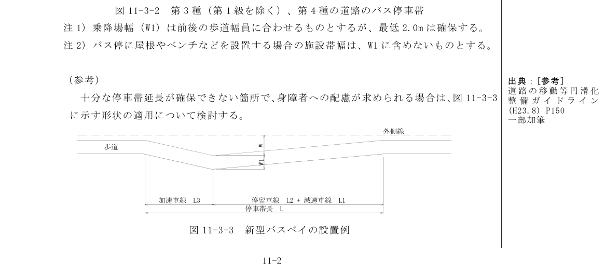

図11-3-3 新型バスベイの設置例

#### 1-3 既存の道路

既存の道路で、地形地物等の諸条件により前項の諸元値がどうしても確保困難な場合の最低値は表11-3-1とする。

表11-3-1（単位:m）

| 設計速度（km/h） | 減速車線長 L1 | 停留車線長 L2 | 加速車線長 L3 | 停車線幅 W | 乗降場幅 W1 |
|---|---|---|---|---|---|
| 40 | 10 | 15 | 10 | 3.0 | 2.0 |
| 50 | 10 | 15 | 10 | 3.0 | 2.0 |
| 60 | 10 | 15 | 10 | 3.0 | 2.0 |

注）バス停に屋根やベンチなどを設置する場合の施設帯幅は、W1に含めないものとする。

### 2. バス停車線の舗装

第9章第11節を参照。

## 第4節 駐車場（参考）

自動車駐車場の駐車区画と車路は、設計車両に応じて無理のない駐車および発進が可能なよう、その寸法と配置を定めるものとする。

また、駐車場の有効活用を図るため、駐車場施設の計画とともに、駐車場案内システムの設置または再配置にも留意して計画するものとする。

駐車場の設計は、表11-4-1の示方書等によるものとする。

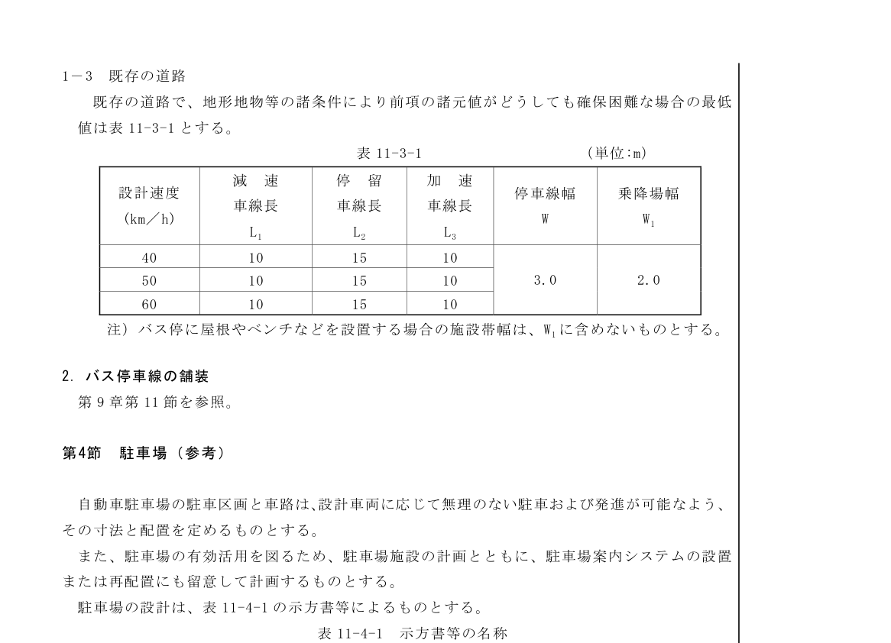

表11-4-1 示方書等の名称

## 第5節 駐輪場（参考）

自転車駐車場の駐車区間・通路は、円滑な出入りができるよう、構造形式、駐輪形式、寸法・施設配置（通路、柵、上屋、照明等）を定めるものとする。

駐輪場の設計は、表11-5-1の示方書等によるものとする。

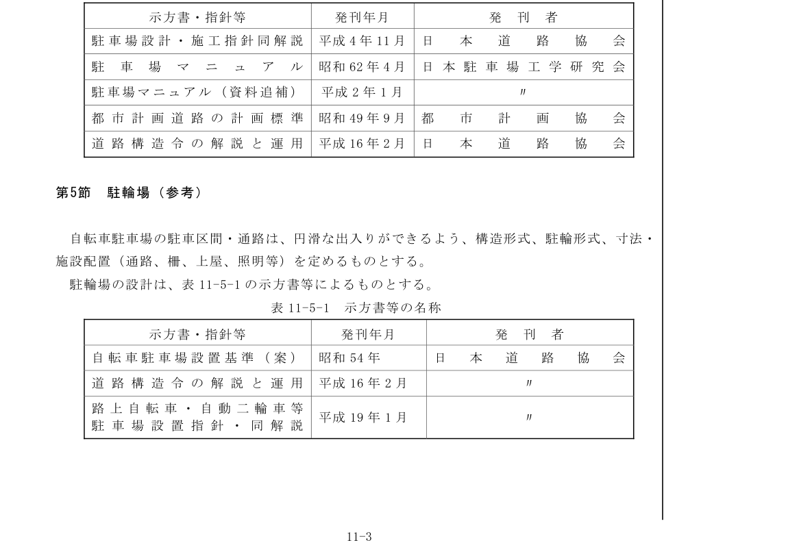

表11-5-1 示方書等の名称

## 第6節 非常駐車帯（標準）

非常駐車帯の設計は、「道路構造令の解説と運用」によるほか、この設計便覧によるものとする。

1. 第1種第1級、第2級の道路で、左側路肩の幅員が2.50m未満の区間が長い場合には、非常駐車帯を設置するものとする。

2. 第1種第3級、第4級、第2種、第3種第1級の道路で左側路肩の幅員が2.50m未満の区間が長い場合には、計画交通量が少ない場合を除き、非常駐車帯を設置するものとする。

3. 第3種第2級、第3級、第4級の道路においても交通量が多く必要と認められる場合には、非常駐車帯を設置するものとする。

4. 非常駐車帯の配置と寸法は、道路規格および区分に応じ適切に定めなければならない。

非常駐車帯の設計は、道路の区分、計画交通量等に応じたサービス水準を確保するため、路線全体を俯瞰し「道路構造令の解説と運用」にある間隔、寸法諸元を参考として計画する。

**(1) 配置間隔**

道路区分に応じ、表11-6-1の値を標準とする。

表11-6-1 非常駐車帯の設置間隔

| 道路区分 | 設置間隔（m） |
|---|---|
| 第1種 1,2,3,4級（土工・橋梁部） | 500 |
| 第1種 1,2,3,4級（トンネル部） | 750 |
| 第2種 1,2級 | 300 |
| 第3種 1級 | 500 |
| 第3種 2,3,4級 | 500（特に必要な場合のみ） |

**(2) 非常駐車帯の配置**

非常用施設配置、交通管理の効率化等を勘案し、両方向同一箇所に配置することが望ましい。ただし、用地の取得ができない場合、長大橋梁、トンネル等構造上の制約がある場合においてはその限りでない。特に、対向2車線のトンネルにおいては、トンネル断面の過大化を抑えるために、千鳥配置で計画することが妥当である。（図11-6-1参照）

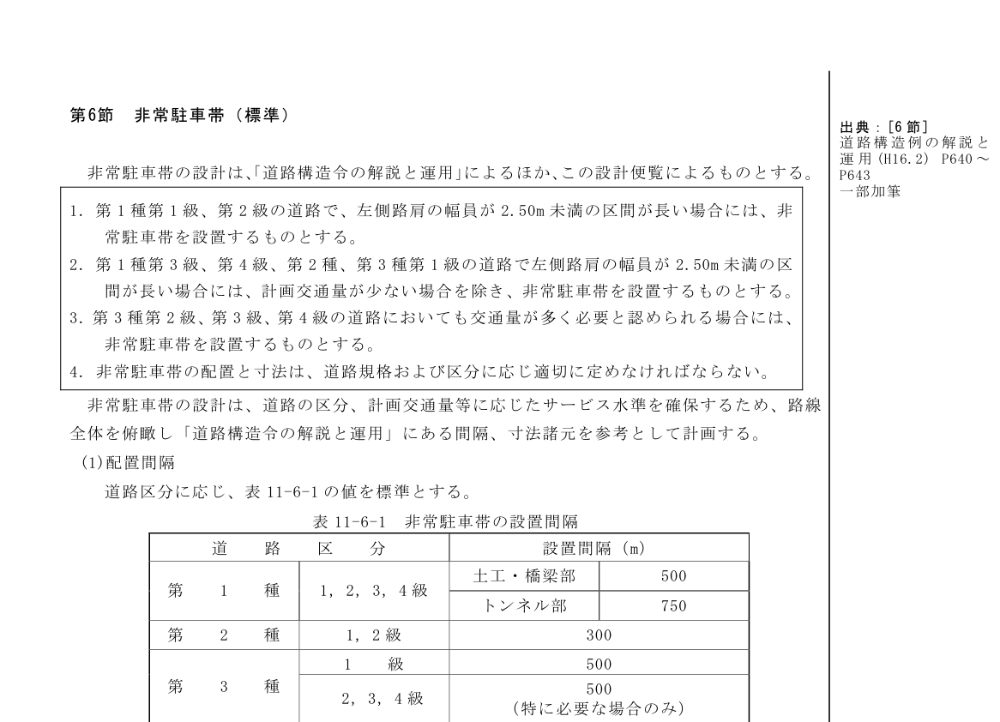

図11-6-1 対向2車線トンネルの非常駐車帯配置（暫定2車線の場合）

**(3) 非常駐車帯の幅員**

3mを基本とするが、大型車の混入状況が著しく多い場合、別途考慮する。

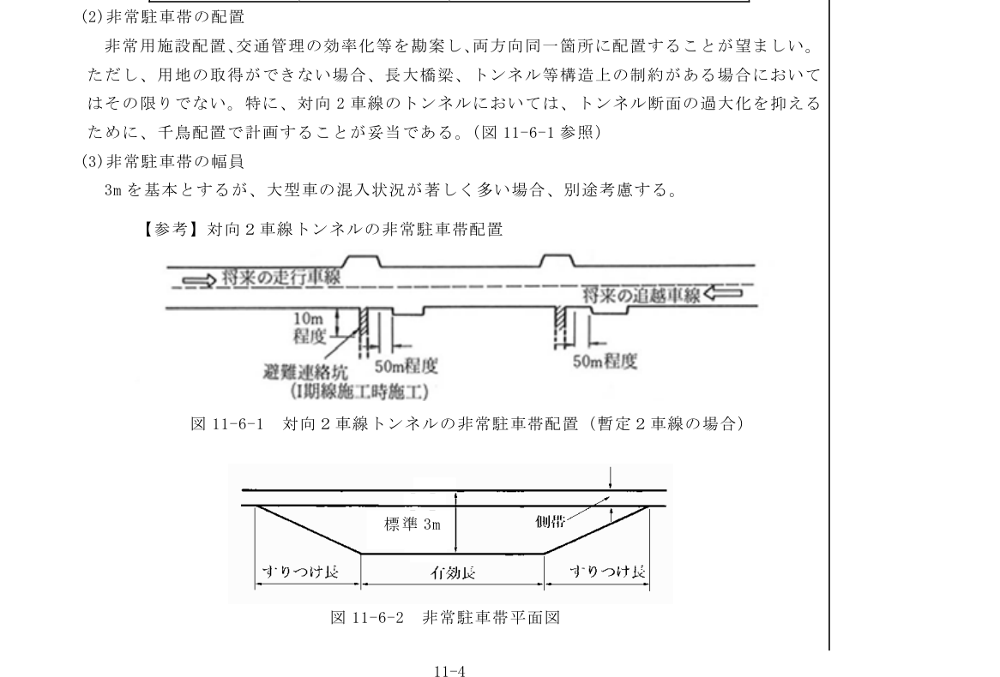

図11-6-2 非常駐車帯平面図

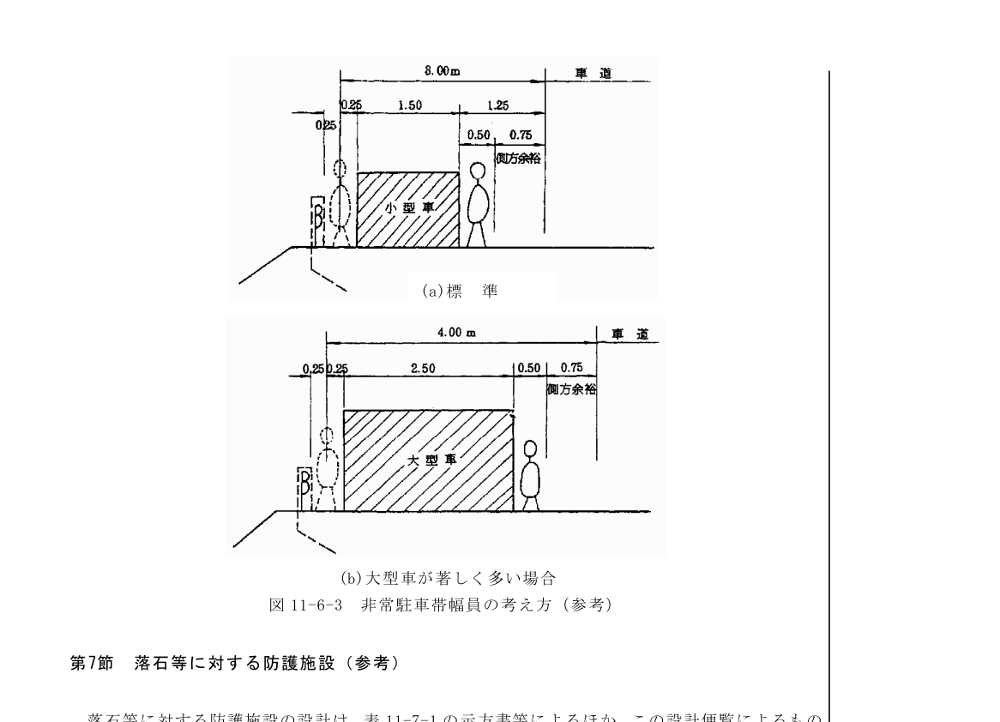

図11-6-3 非常駐車帯幅員の考え方（参考）

## 第7節 落石等に対する防護施設（参考）

落石等に対する防護施設の設計は、表11-7-1の示方書等によるほか、この設計便覧によるものとする。

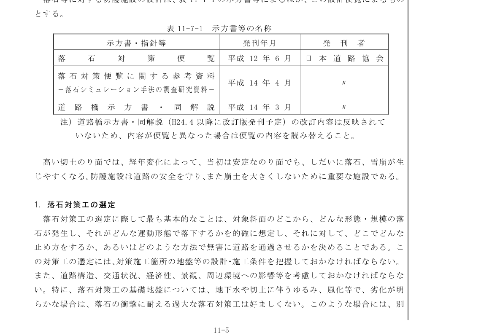

表11-7-1 示方書等の名称

注）道路橋示方書・同解説（H24.4以降に改訂版発刊予定）の改訂内容は反映されていないため、内容が便覧と異なった場合は便覧の内容を読み替えること。

高い切土のり面では、経年変化によって、当初は安定なのり面でも、しだいに落石、雪崩が生じやすくなる。防護施設は道路の安全を守り、また崩土を大きくしないために重要な施設である。

### 1. 落石対策工の選定

落石対策工の選定に際して最も基本的なことは、対象斜面のどこから、どんな形態・規模の落石が発生し、それがどんな運動形態で落下するかを的確に想定し、それに対して、どこでどんな止め方をするか、あるいはどのような方法で無害に道路を通過させるかを決めることである。この対策工の選定には、対策施工箇所の地盤等の設計・施工条件を把握しておかなければならない。また、道路構造、交通状況、経済性、景観、周辺環境への影響等を考慮しておかなければならない。

特に、落石対策工の基礎地盤については、地下水や切土に伴うゆるみ、風化等で、劣化が明らかな場合は、落石の衝撃に耐える過大な落石対策工は好ましくない。このような場合には、別の落石対策工を複合するなどして、現地に適する工法を選定しなければならない。また、機械搬入の制約等、仮設工事を含めた施工方法の難易性を十分検討し、確実性、経済性等に配慮して、落石対策工を選定しなければならない。

落石対策工を大別すると、「発生源対策としての落石予防工」および「発生した落石の対策としての落石防護工」の2種類があり、その効果は次のように要約される。

1. 発生の原因となる風化浸食を防止する。
2. 落石の発生を止める。
3. 落下エネルギーを吸収する。
4. 落下方向を変えて無害なところに導く。
5. 衝撃に抵抗して落石運動を止める。
6. なだれ防止の効果を兼ねる。

各種の対策工の機能、耐久性、施工性、経済性、維持管理上の問題等をよく検討して、現地の道路状況、斜面状況に最も適した工種とその組合わせを選択しなければならない。

なお、具体的な工種の選定については、落石対策便覧によるものとする。

### 2. 落石防止工法

(1) 落石等を生じないようにのり面を固める方法による。（のり覆、のり張り等）

(2) 浮石が生じてもこれがただちに落下しないようにネットでのり面を押えておく覆式あるいはポケット式工法による。

(3) 落石をのり面の途中、あるいはすそで落石防護柵により止める方法による。

### 3. 落石防護柵の設計

#### 3-1 一般事項

(1) 落石防護柵は、原則として小規模落石対策用に設置するものとし、大規模な落石のおそれがある場所には、落石防護網を併用する。

(2) 形式はワイヤーロープ金網式を標準とする。形状は図11-7-1の通り。

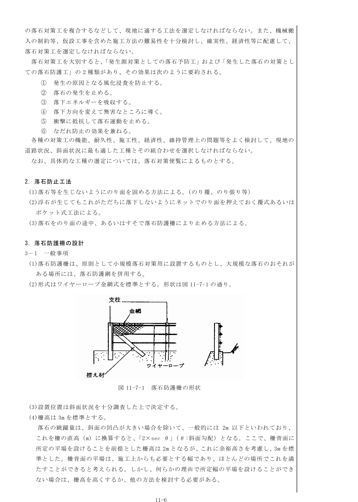

図11-7-1 落石防護柵の形状

(3) 設置位置は斜面状況を十分調査した上で決定する。

(4) 柵高は3mを標準とする。

落石の跳躍量は、斜面の凹凸が大きい場合を除いて、一般的には2m以下といわれており、これを柵の直高（m）に換算すると、$2 \times \sec\theta$（θ: 斜面勾配）となる。ここで、柵背面に所定の平場を設けることを前提とした柵高は2mとなるが、これに余裕高さを考慮し、3mを標準とした。

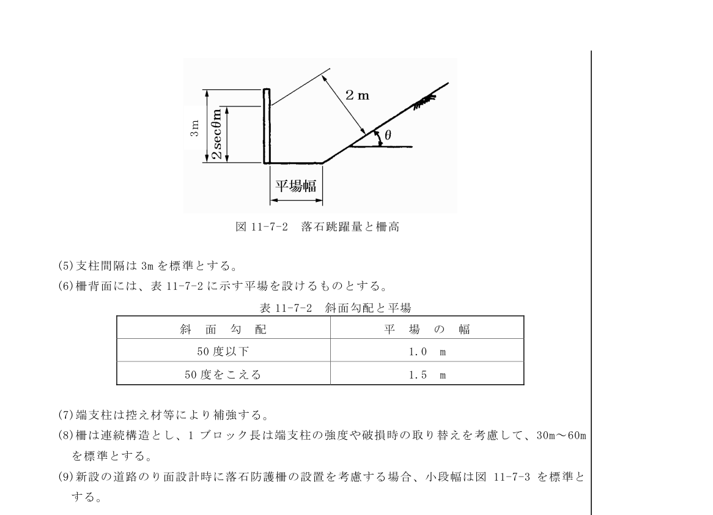

図11-7-2 落石跳躍量と柵高

(5) 支柱間隔は3mを標準とする。

(6) 柵背面には、表11-7-2に示す平場を設けるものとする。

表11-7-2 斜面勾配と平場

| 斜面勾配 | 平場の幅 |
|---|---|
| 50度以下 | 1.0m |
| 50度をこえる | 1.5m |

(7) 端支柱は控え材等により補強する。

(8) 柵は連続構造とし、1ブロック長は端支柱の強度や破損時の取り替えを考慮して、30m〜60mを標準とする。

(9) 新設の道路のり面設計時に落石防護柵の設置を考慮する場合、小段幅は図11-7-3を標準とする。

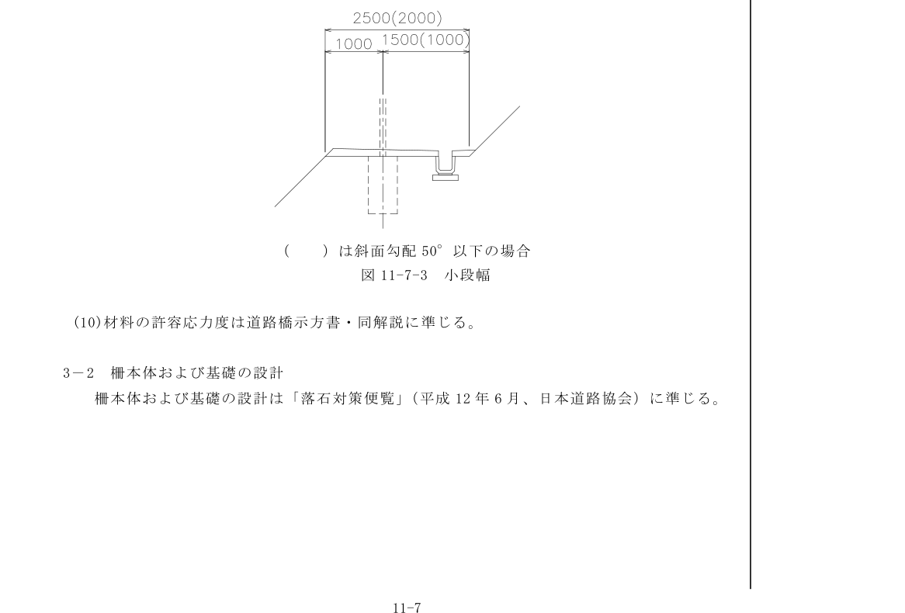

図11-7-3 小段幅

（ ）は斜面勾配50°以下の場合

(10) 材料の許容応力度は道路橋示方書・同解説に準じる。

#### 3-2 柵本体および基礎の設計

柵本体および基礎の設計は「落石対策便覧」（平成12年6月、日本道路協会）に準じる。

## 第8節 防災覆工（参考）

防災覆工の設計は、表11-8-1の示方書等によるほか、この設計便覧によるものとする。

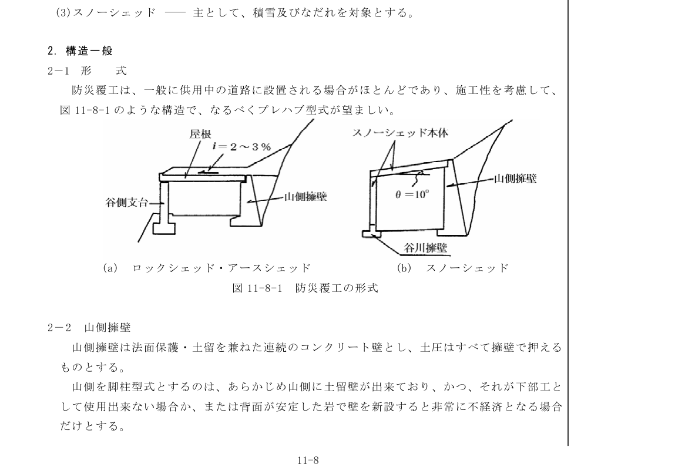

表11-8-1 示方書等の名称

注）道路橋示方書・同解説（H24.4以降に改訂版発刊予定）の改訂内容は反映されていないため、内容が便覧と異なった場合は便覧の内容を読み替えること。

### 1. 一般事項

#### 1-1 許容応力度

防災覆工における各部材の許容応力度は、「道路橋示方書・同解説」に準じるものとする。尚、落石時、崩土時及びなだれ時における許容応力度の割増しは、地震時と同様とする。

#### 1-2 防災覆工の種類

(1) **ロックシェッド** — 主として落石を対象とする。

(2) **アースシェッド** — 主として崩土の堆積を対象とする。

(3) **スノーシェッド** — 主として、積雪及びなだれを対象とする。

### 2. 構造一般

#### 2-1 形式

防災覆工は、一般に供用中の道路に設置される場合がほとんどであり、施工性を考慮して、図11-8-1のような構造で、なるべくプレハブ型式が望ましい。

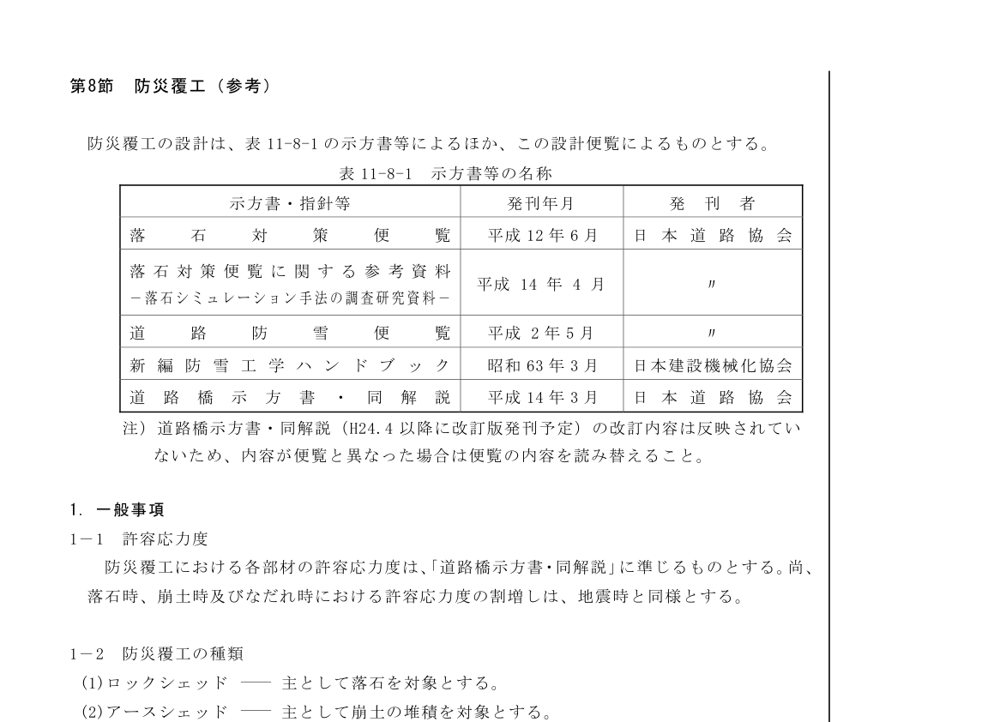

図11-8-1 防災覆工の形式

#### 2-2 山側擁壁

山側擁壁は法面保護・土留を兼ねた連続のコンクリート壁とし、土圧はすべて擁壁で押えるものとする。

山側を脚柱型式とするのは、あらかじめ山側に土留壁が出来ており、かつ、それが下部工として使用出来ない場合か、または背面が安定した岩で壁を新設すると非常に不経済となる場合だけとする。

#### 2-3 アンカー工

土圧が非常に大きく、山側擁壁を通常の断面では自立させることができない場合に断面を大きくすると、結局、山すそを大きく切り取ることになり、そのため山の斜面を荒らすことになる。このような場合はアンカー工法を採用するとよい。また、背面が良好な岩で無理に切り取る必要のない場合も同様である。

いずれの場合も、アンカー工には短期の水平力だけを負担させるものとし、短期の鉛直荷重及び長期荷重（水平、鉛直方向共）はすべて壁本体で支持させるものとする。

#### 2-4 谷側支台

谷側支台の形状は、明り採りを十分考慮したものでなければならない。

谷側支台の基礎は、特別な場合を除きRCの連続フーチングとする。

谷側支台は車両の接触による損傷事故が多い。これを防ぐため谷側支台の車道側に幅25cm、高さ25cmの地覆を設けるものとする。

#### 2-5 屋根

**(1) 屋根勾配**

山側擁壁に土圧がかかる場合は、屋根勾配を付すと土圧が大きくなり不利な面があるが、山側が岩で土圧が殆どかからない場合は堆積土が少なくなり、初期の崩落時に衝撃をやわらげる等の効果があるので、現地の条件を十分検討のうえ勾配を決めるものとする。

いずれの場合も屋根上の排水を考慮して、2〜3%の勾配を最小限付すものとする。

スノーシェッドの屋根の勾配は10°を標準とする。ただし、なだれの経路となる斜面の勾配が急な場合は、屋根勾配を大きくとった方が非常に有利となることもあるので十分検討を要する。

**(2) クッション材の載せ方**

ロックシェッドの場合は、あらかじめ屋根にクッション材を乗せておくものとする。厚さは90cmを標準とする。

アースシェッドの場合で多量の土砂が同時に落ちてくるような場所は、崩落時の衝撃をやわらげるため斜面と屋根面をなじみよく土砂ですりつけるものとする。その他の場合には擁壁の背面を良質な材料で埋戻しておくだけでよい。

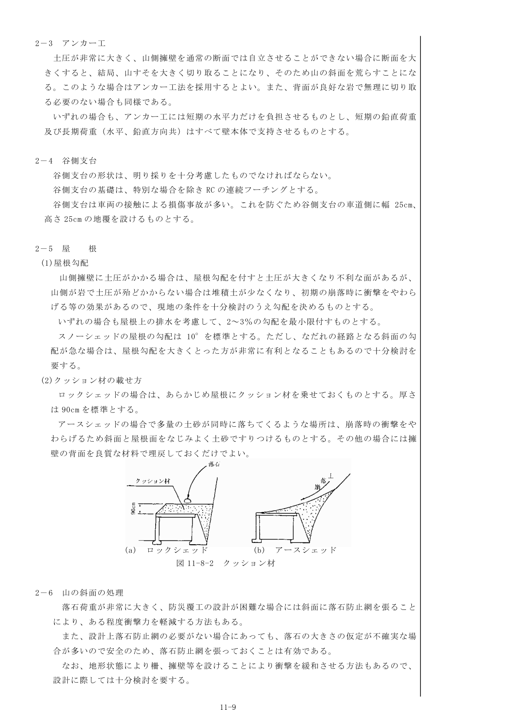

図11-8-2 クッション材

#### 2-6 山の斜面の処理

落石荷重が非常に大きく、防災覆工の設計が困難な場合には斜面に落石防止網を張ることにより、ある程度衝撃力を軽減する方法もある。

また、設計上落石防止網の必要がない場合にあっても、落石の大きさの仮定が不確実な場合が多いので安全のため、落石防止網を張っておくことは有効である。

なお、地形状態により柵、擁壁等を設けることにより衝撃を緩和させる方法もあるので、設計に際しては十分検討を要する。

### 3. 附属施設

#### 3-1 排水施設

屋根上の雨水が直接、谷側法面に落ちないよう、排水施設を設けなければならない。排水管の径は150mmを標準とし、必ず流末処理を設けるものとする。

山側擁壁背面の排水についても、十分考慮するものとする。

#### 3-2 管理施設

防災覆工の管理のために、屋根上に上る階段等の必要な設備を完備しておくものとする。

#### 3-3 ハンドレール

谷側支台の支柱間に設けるハンドレールは、歩行者の退避場確保のため支柱の谷側に取付けるものとする。

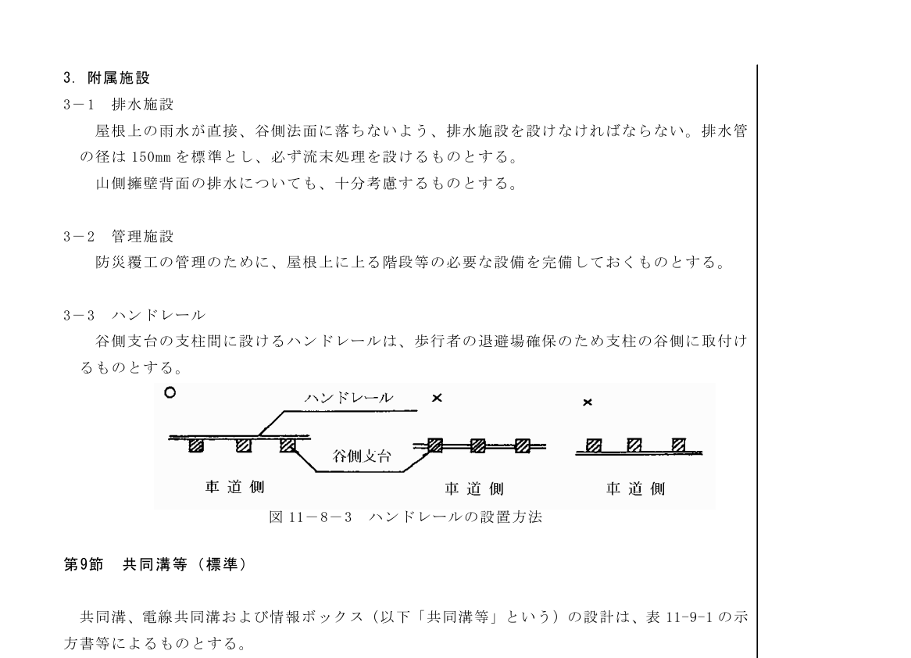

図11-8-3 ハンドレールの設置方法

## 第9節 共同溝等（標準）

共同溝、電線共同溝および情報ボックス（以下「共同溝等」という）の設計は、表11-9-1の示方書等によるものとする。

なお、共同溝等の設置については、担当課と十分協議すること。

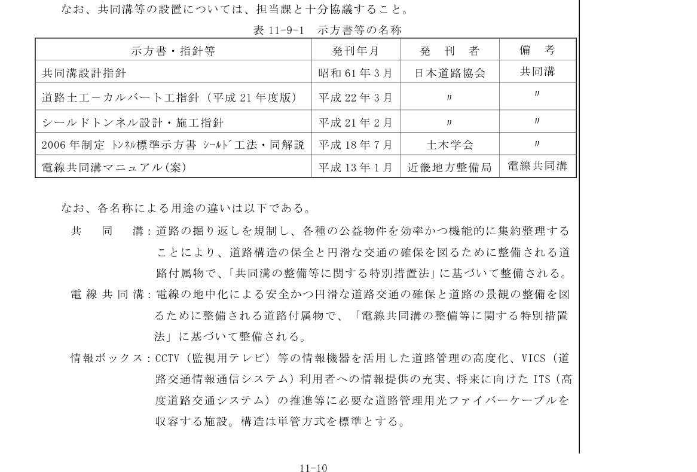

表11-9-1 示方書等の名称

なお、各名称による用途の違いは以下である。

- **共同溝** — 道路の掘り返しを規制し、各種の公益物件を効率かつ機能的に集約整理することにより、道路構造の保全と円滑な交通の確保を図るために整備される道路付属物で、「共同溝の整備等に関する特別措置法」に基づいて整備される。
- **電線共同溝** — 電線の地中化による安全かつ円滑な道路交通の確保と道路の景観の整備を図るために整備される道路付属物で、「電線共同溝の整備等に関する特別措置法」に基づいて整備される。
- **情報ボックス** — CCTV（監視用テレビ）等の情報機器を活用した道路管理の高度化、VICS（道路交通情報通信システム）利用者への情報提供の充実、将来に向けたITS（高度道路交通システム）の推進等に必要な道路管理用光ファイバーケーブルを収容する施設。構造は単管方式を標準とする。

## 第10節 その他

### 1. 休憩施設（資料）

休憩施設の設計は、表11-10-1の示方書等によるものとする。

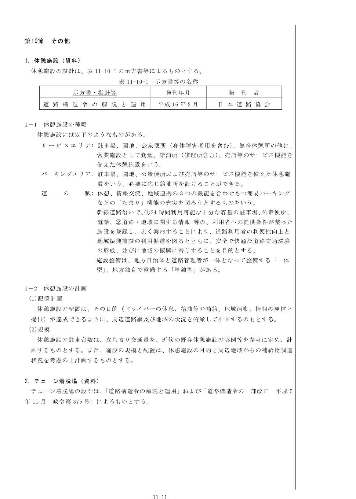

表11-10-1 示方書等の名称

#### 1-1 休憩施設の種類

休憩施設には以下のようなものがある。

- **サービスエリア** — 駐車場、園地、公衆便所（身体障害者用を含む）、無料休憩所の他に、営業施設として食堂、給油所（修理所含む）、売店等のサービス機能を備えた休憩施設をいう。
- **パーキングエリア** — 駐車場、園地、公衆便所および売店等のサービス機能を備えた休憩施設をいう。必要に応じ給油所を設けることができる。
- **道の駅** — 休憩、情報交流、地域連携の3つの機能を合わせもつ簡易パーキングなどの「たまり」機能の充実を図ろうとするものをいう。幹線道路沿いで、(1)24時間利用可能な十分な容量の駐車場、公衆便所、電話、(2)道路・地域に関する情報等の、利用者への提供条件が整った施設を登録し、広く案内することにより、道路利用者の利便性向上と地域振興施設の利用促進を図るとともに、安全で快適な道路交通環境の形成、並びに地域の振興に寄与することを目的とする。施設整備は、地方自治体と道路管理者が一体となって整備する「一体型」、地方独自で整備する「単独型」がある。

#### 1-2 休憩施設の計画

(1) 配置計画

休憩施設の配置は、その目的（ドライバーの休息、給油等の補給、地域活動、情報の発信と提供）が達成できるように、周辺道路網及び地域の状況を俯瞰して計画するものとする。

(2) 規模

休憩施設の駐車台数は、立ち寄り交通量を、近傍の既存休憩施設の実例等を参考に定め、計画するものとする。また、施設の規模と配置は、休憩施設の目的と周辺地域からの補給物調達状況を考慮の上計画するものとする。

### 2. チェーン着脱場（資料）

チェーン着脱場の設計は、「道路構造令の解説と運用」および「道路構造令の一部改正 平成5年11月 政令第375号」によるものとする。

### 3. 防雪施設および除雪・融雪施設（資料）

防雪施設および除雪・融雪施設の設計は、表11-10-2の示方書等によるものとする。

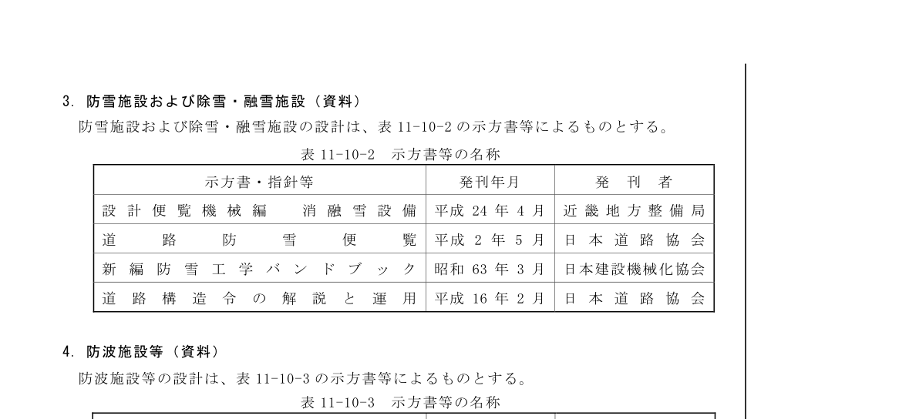

表11-10-2 示方書等の名称

### 4. 防波施設等（資料）

防波施設等の設計は、表11-10-3の示方書等によるものとする。

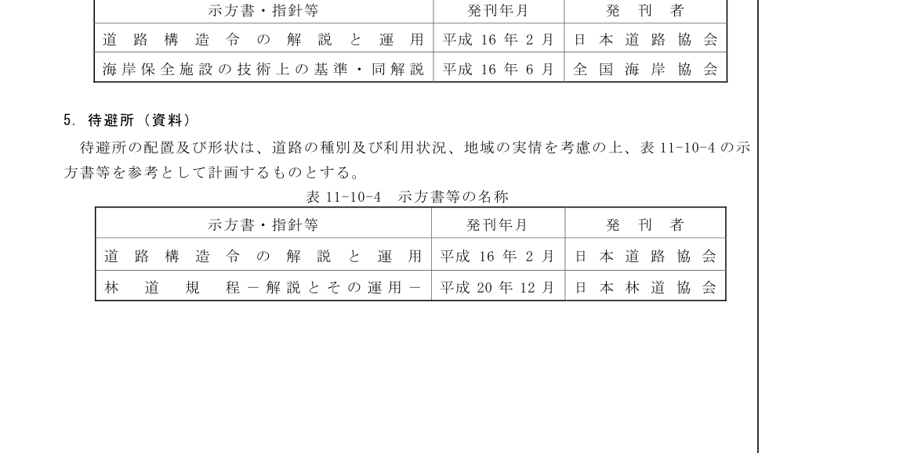

表11-10-3 示方書等の名称

### 5. 待避所（資料）

待避所の配置及び形状は、道路の種別及び利用状況、地域の実情を考慮の上、表11-10-4の示方書等を参考として計画するものとする。

表11-10-4 示方書等の名称

## 第11節 落石防護柵の設計例

落石防護柵として一般によく用いられるワイヤーロープ金網式の計算例を記述する。\[落石対策便覧第5章参照（日本道路協会H12.6発行）\]

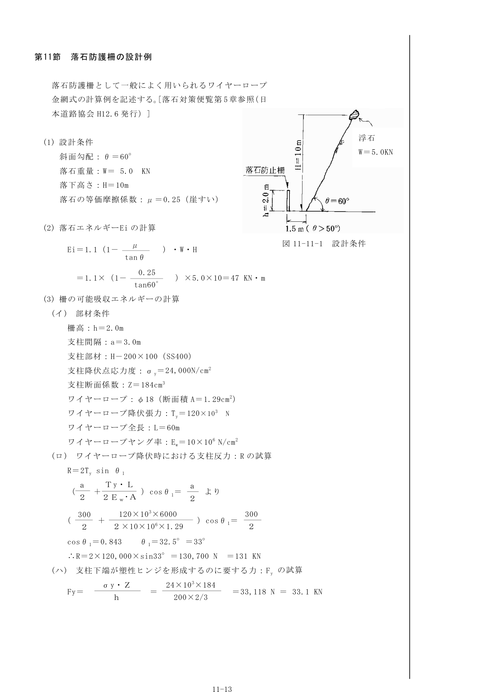

図11-11-1 設計条件

**(1) 設計条件**

- 斜面勾配：θ=60°
- 落石重量：W=5.0 kN
- 落下高さ：H=10m
- 落石の等価摩擦係数：μ=0.25（崖すい）

**(2) 落石エネルギーEiの計算**

$$E_i = 1.1 \left(1 - \frac{\mu}{\tan\theta}\right) \cdot W \cdot H = 1.1 \times \left(1 - \frac{0.25}{\tan 60°}\right) \times 5.0 \times 10 = 47 \text{ kN·m}$$

**(3) 柵の可能吸収エネルギーの計算**

(イ) 部材条件

- 柵高：h=2.0m、支柱間隔：a=3.0m
- 支柱部材：H-200×100（SS400）
- 支柱降伏点応力度：$\sigma_y$ =24,000 N/cm²
- 支柱断面係数：Z=184 cm³
- ワイヤーロープ：φ18（断面積A=1.29 cm²）
- ワイヤーロープ降伏張力：$T_y$ =120×10³ N
- ワイヤーロープ全長：L=60m
- ワイヤーロープヤング率：$E_w$ =10×10⁶ N/cm²

(ロ) ワイヤーロープ降伏時における支柱反力：Rの試算

$$R = 2 T_y \sin\theta_1$$

$\cos\theta_1 = 0.843$、$\theta_1 = 33°$

$R = 2 \times 120{,}000 \times \sin 33° = 130{,}700$ N = 131 kN

(ハ) 支柱下端が塑性ヒンジを形成するのに要する力：Fyの試算

$$F_y = \frac{\sigma_y \cdot Z}{h} = \frac{24 \times 10^3 \times 184}{200 \times 2/3} = 33{,}118 \text{ N} = 33.1 \text{ kN}$$

(ニ) RとFyの比較

R=131 kN > Fy=33.1 kN → 支柱が先に塑性変形をする。Fyを用いて設計する。

(ホ) 支柱吸収エネルギーEpの試算

$$E_p = 0.54 \cdot h \cdot F_y = 0.54 \times 200 \times 2/3 \times 33.1 = 2{,}383 \text{ kN·cm} = 23.8 \text{ kN·m}$$

(ヘ) ワイヤーロープ吸収エネルギーERの試算

金網の吸収エネルギー：$E_N$ = 25 kN·m

T=43.3 kN より

$$E_R = \frac{L}{E_w \cdot A}(T^2 - T_0^2) = \frac{6{,}000}{10 \times 10^6 \times 1.29} \times (43.3^2 \times 10^6 - 5^2 \times 10^6) = 8.60 \text{ kN·m}$$

（$T_0$：初期張力=5.0 kN）

(チ) 全吸収エネルギーETの試算

$$E_T = E_R + E_P + E_N = 8.60 + 23.8 + 25.0 = 56.8 \text{ kN·m}$$

$E_i = 47$ kN·m < $E_T = 56.8$ kN·m → OK

**(4) 基礎の計算**

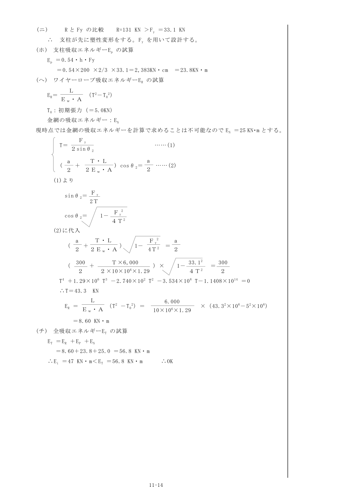

図11-11-2 防止柵支柱の設置

支柱の根入れ深さ：d=80 cm

基礎のコンクリート設計基準強度：$\sigma_{ck}$ =21 N/mm²（$\sigma_{ca}$ =7.0 N/mm²、$\tau_{ca}$ =0.36 N/mm²）

基礎の天端幅：B=40 cm

(イ) 曲げモーメントに対して

$$M = F_y \left(\frac{2}{3}h + \frac{d}{2}\right) = 32{,}488 \times \left(\frac{2}{3} \times 200 + \frac{80}{2}\right) = 5{,}631{,}253 \text{ N·cm}$$

$\sigma = 580$ N/cm² < $\sigma_{ca}$ = 700 N/cm² → OK

(ロ) せん断力に対して

$\tau = 14.6$ N/cm² < $\tau_{ca}$ = 36 N/cm² → OK

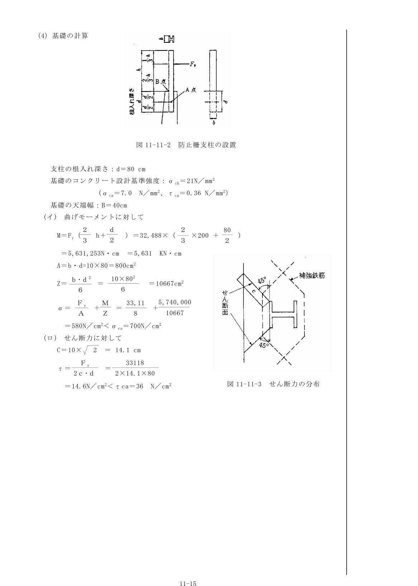

図11-11-3 せん断力の分布

{/* 図・表のページ対応表
--- 図 ---
図11-3-1 第3種1級の道路のバス停車帯 → r11-fig-01 (p3)
図11-3-2 第3種（第1級を除く）、第4種の道路のバス停車帯 → r11-fig-02 (p3)
図11-3-3 新型バスベイの設置例 → r11-fig-03 (p3)
図11-6-1 対向2車線トンネルの非常駐車帯配置 → r11-fig-04 (p5)
図11-6-2 非常駐車帯平面図 → r11-fig-05 (p5)
図11-6-3 非常駐車帯幅員の考え方 → r11-fig-06 (p6)
図11-7-1 落石防護柵の形状 → r11-fig-07 (p7)
図11-7-2 落石跳躍量と柵高 → r11-fig-08 (p8)
図11-7-3 小段幅 → r11-fig-09 (p8)
図11-8-1 防災覆工の形式 → r11-fig-10 (p9)
図11-8-2 クッション材 → r11-fig-11 (p10)
図11-8-3 ハンドレールの設置方法 → r11-fig-12 (p11)
図11-11-1 設計条件 → r11-fig-13 (p14)
図11-11-2 防止柵支柱の設置 → r11-fig-14 (p15)
図11-11-3 せん断力の分布 → r11-fig-15 (p16)

--- 表 ---
表11-4-1 示方書等の名称 → r11-tbl-01 (p4)
表11-5-1 示方書等の名称 → r11-tbl-02 (p4)
表11-7-1 示方書等の名称 → r11-tbl-03 (p6)
表11-8-1 示方書等の名称 → r11-tbl-04 (p9)
表11-9-1 示方書等の名称 → r11-tbl-05 (p11)
表11-10-1 示方書等の名称 → r11-tbl-06 (p12)
表11-10-2 示方書等の名称 → r11-tbl-07 (p13)
表11-10-3 示方書等の名称 → r11-tbl-08 (p13)
表11-10-4 示方書等の名称 → r11-tbl-09 (p13)
*/}
