## 第1節 設計一般（標準）

この設計便覧は国土交通省近畿地方整備局管内の交通安全施設の設計に適用する。

交通安全施設の設計は、表14-1-1の示方書等によるほか、この設計便覧によるものとする。なお、示方書および通達が全てに優先するので示方書の改訂、新しい通達等により内容が便覧と異なる場合は、便覧の内容を読み変えること。また、内容の解釈での疑問点はその都度担当課と協議すること。

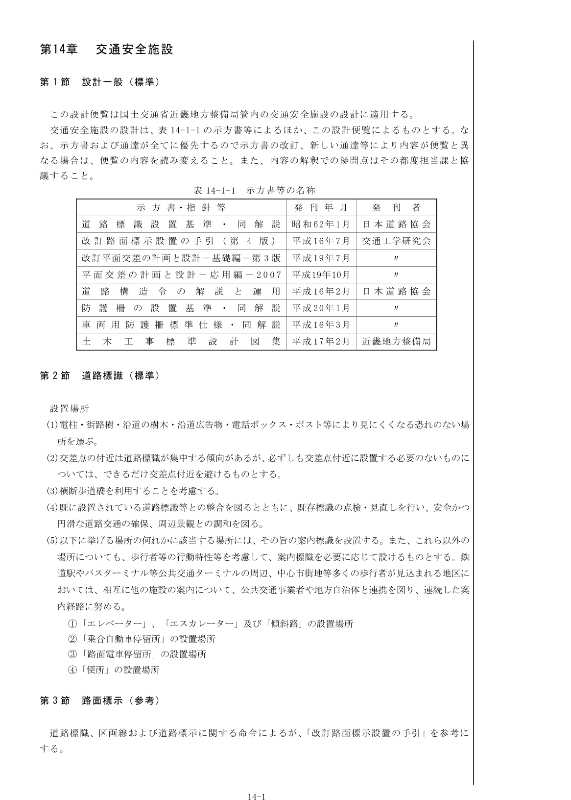

表14-1-1 示方書等の名称

## 第2節 道路標識（標準）

**設置場所**

1. 電柱・街路樹・沿道の樹木・沿道広告物・電話ボックス・ポスト等により見にくくなる恐れのない場所を選ぶ。
2. 交差点の付近は道路標識が集中する傾向があるが、必ずしも交差点付近に設置する必要のないものについては、できるだけ交差点付近を避けるものとする。
3. 横断歩道橋を利用することを考慮する。
4. 既に設置されている道路標識等との整合を図るとともに、既存標識の点検・見直しを行い、安全かつ円滑な道路交通の確保、周辺景観との調和を図る。
5. 以下に挙げる場所の何れかに該当する場所には、その旨の案内標識を設置する。また、これら以外の場所についても、歩行者等の行動特性等を考慮して、案内標識を必要に応じて設けるものとする。鉄道駅やバスターミナル等公共交通ターミナルの周辺、中心市街地等多くの歩行者が見込まれる地区においては、相互に他の施設の案内について、公共交通事業者や地方自治体と連携を図り、連続した案内経路に努める。
   - ①「エレベーター」、「エスカレーター」及び「傾斜路」の設置場所
   - ②「乗合自動車停留所」の設置場所
   - ③「路面電車停留所」の設置場所
   - ④「便所」の設置場所

## 第3節 路面標示（参考）

道路標識、区画線および道路標示に関する命令によるが、「改訂路面標示設置の手引」を参考にする。

### 1. 区画線の幅・間隔

区画線の幅・間隔は「道路標識、区画線及び道路標示に関する命令」（標識令）による。

### 2. 区画線の設置位置の原則

区画線の設置位置の原則を図14-3-1に示す。

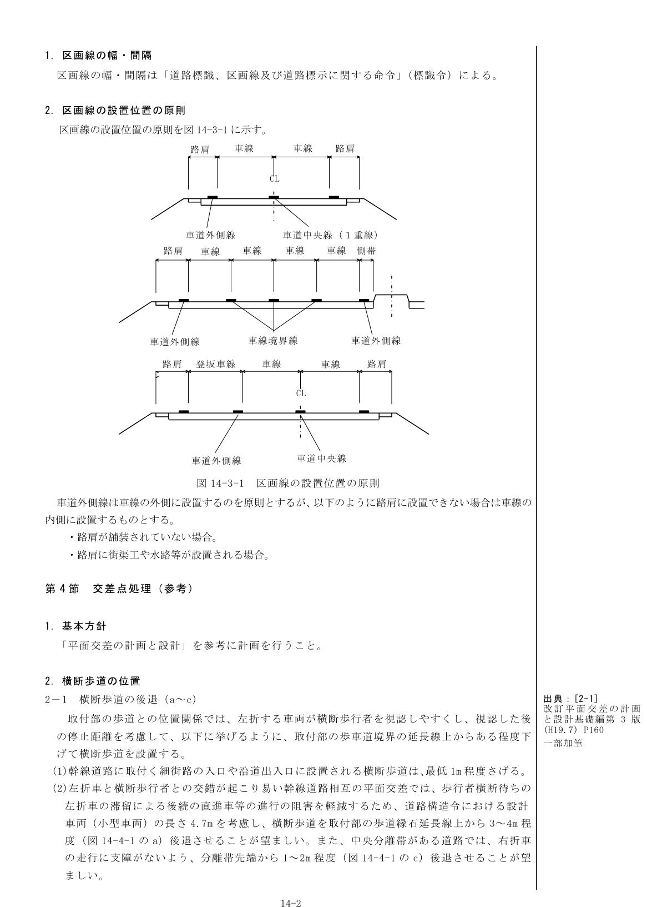

図14-3-1 区画線の設置位置の原則

車道外側線は車線の外側に設置するのを原則とするが、以下のように路肩に設置できない場合は車線の内側に設置するものとする。

- 路肩が舗装されていない場合。
- 路肩に街渠工や水路等が設置される場合。

## 第4節 交差点処理（参考）

### 1. 基本方針

「平面交差の計画と設計」を参考に計画を行うこと。

### 2. 横断歩道の位置

#### 2-1 横断歩道の後退（a～c）

取付部の歩道との位置関係では、左折する車両が横断歩行者を視認しやすくし、視認した後の停止距離を考慮して、以下に挙げるように、取付部の歩車道境界の延長線上からある程度下げて横断歩道を設置する。

1. 幹線道路に取付く細街路の入口や沿道出入口に設置される横断歩道は、最低1m程度さげる。
2. 左折車と横断歩行者との交錯が起こり易い幹線道路相互の平面交差では、歩行者横断待ちの左折車の滞留による後続の直進車等の進行の阻害を軽減するため、道路構造令における設計車両（小型車両）の長さ4.7mを考慮し、横断歩道を取付部の歩道縁石延長線上から3～4m程度（図14-4-1のa）後退させることが望ましい。また、中央分離帯がある道路では、右折車の走行に支障がないよう、分離帯先端から1～2m程度（図14-4-1のc）後退させることが望ましい。

#### 2-2 歩道巻き込み部（e）

歩道等の巻き込み部は、隣接する横断歩道間で生じやすい信号等を無視しての歩行者の渡りを防止するために、防護柵もしくは植裁を設ける部分を確保するものとする。特に、自転車横断帯を設置する場合は、自転車を左折車の巻き込み事故等から守るために、縁石等による分離を行う。

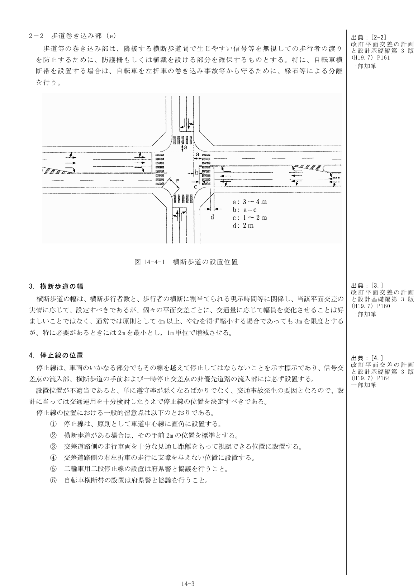

図14-4-1 横断歩道の設置位置

### 3. 横断歩道の幅

横断歩道の幅は、横断歩行者数と、歩行者の横断に割当てられる現示時間等に関係し、当該平面交差の実情に応じて、設定すべきであるが、個々の平面交差ごとに、交通量に応じて幅員を変化させることは好ましいことではなく、通常では原則として4m以上、やむを得ず縮小する場合であっても3mを限度とするが、特に必要があるときには2mを最小とし、1m単位で増減させる。

### 4. 停止線の位置

停止線は、車両のいかなる部分でもその線を越えて停止してはならないことを示す標示であり、信号交差点の流入部、横断歩道の手前および一時停止交差点の非優先道路の流入部には必ず設置する。

設置位置が不適当であると、単に遵守率が悪くなるばかりでなく、交通事故発生の要因となるので、設計に当っては交通運用を十分検討したうえで停止線の位置を決定すべきである。

停止線の位置における一般的留意点は以下のとおりである。

1. 停止線は、原則として車道中心線に直角に設置する。
2. 横断歩道がある場合は、その手前2mの位置を標準とする。
3. 交差道路側の走行車両を十分な見通し距離をもって視認できる位置に設置する。
4. 交差道路側の右左折車の走行に支障を与えない位置に設置する。
5. 二輪車用二段停止線の設置は府県警と協議を行うこと。
6. 自転車横断帯の設置は府県警と協議を行うこと。

### 5. 付加車線

付加車線の設計は、「道路構造令の解説と運用」によるものとする。新設交差点の例を図14-4-2、既設道路の改良で用地幅の制約がある場合の例を図14-4-3に示す。

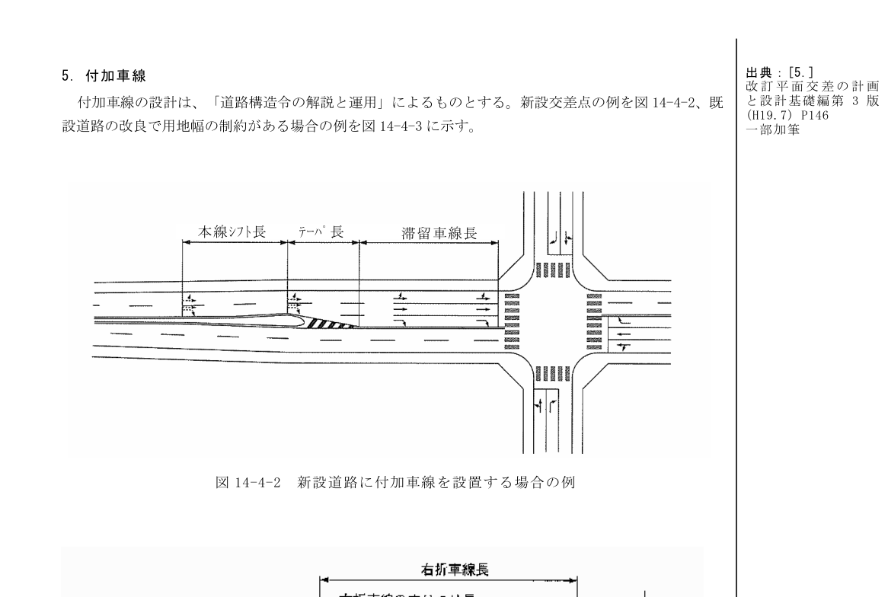

図14-4-2 新設道路に付加車線を設置する場合の例

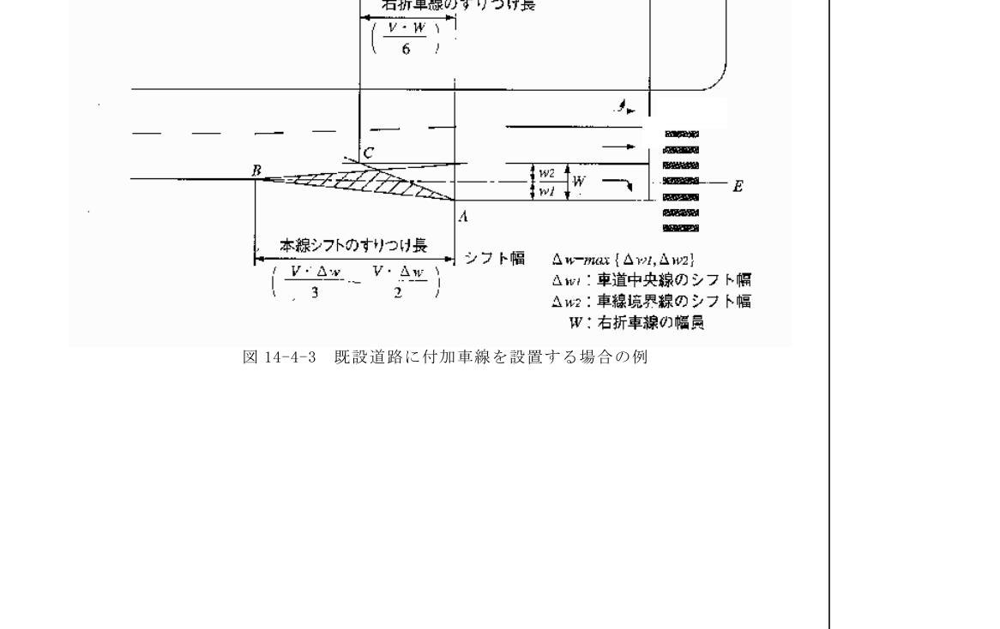

図14-4-3 既設道路に付加車線を設置する場合の例

## 第5節 防護柵設置（標準）

### 1. 防護柵の設計に用いる示方書等

防護柵の設置は、「防護柵の設置基準・同解説」（平成20年11月 日本道路協会）および「車両用防護柵標準仕様・同解説」（平成16年3月 日本道路協会）によるほか、この設計便覧によるものとする。

### 2. 車両用防護柵

#### 2-1 設置場所

それぞれの車両用防護柵を設置する場所については、「防護柵の設置基準・同解説」によるものとする。

#### 2-2 種別の適用条件

車両用防護柵の種別及びその適用条件は表14-5-1による。

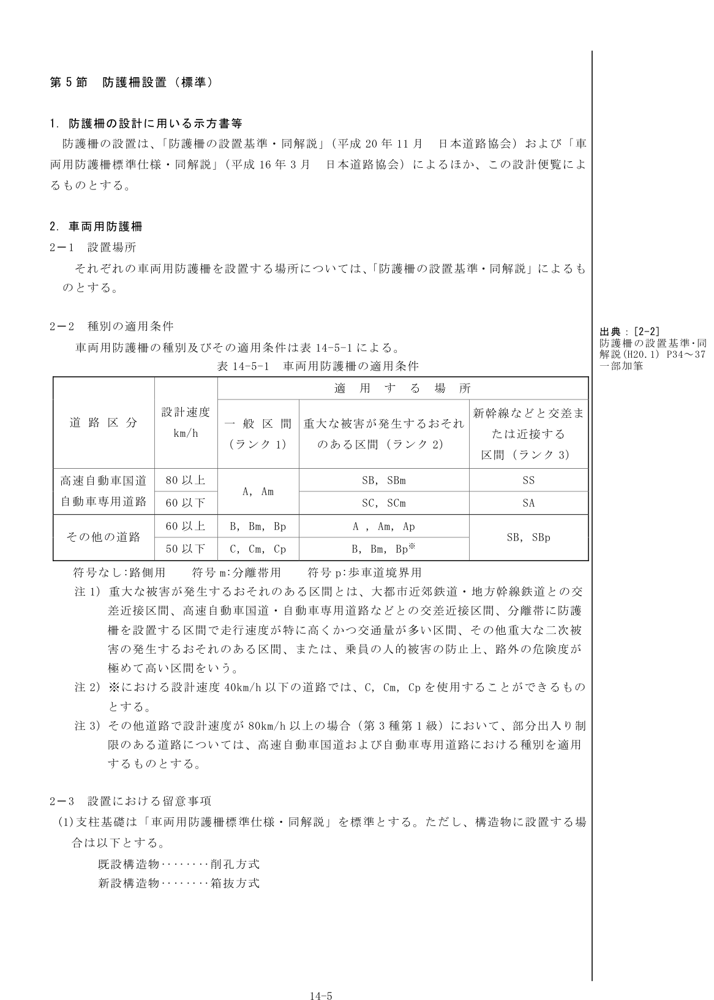

表14-5-1 車両用防護柵の適用条件

#### 2-3 設置における留意事項

**(1)** 支柱基礎は「車両用防護柵標準仕様・同解説」を標準とする。ただし、構造物に設置する場合は以下とする。

- 既設構造物：削孔方式
- 新設構造物：箱抜方式

**(2) 設置位置の考え方**

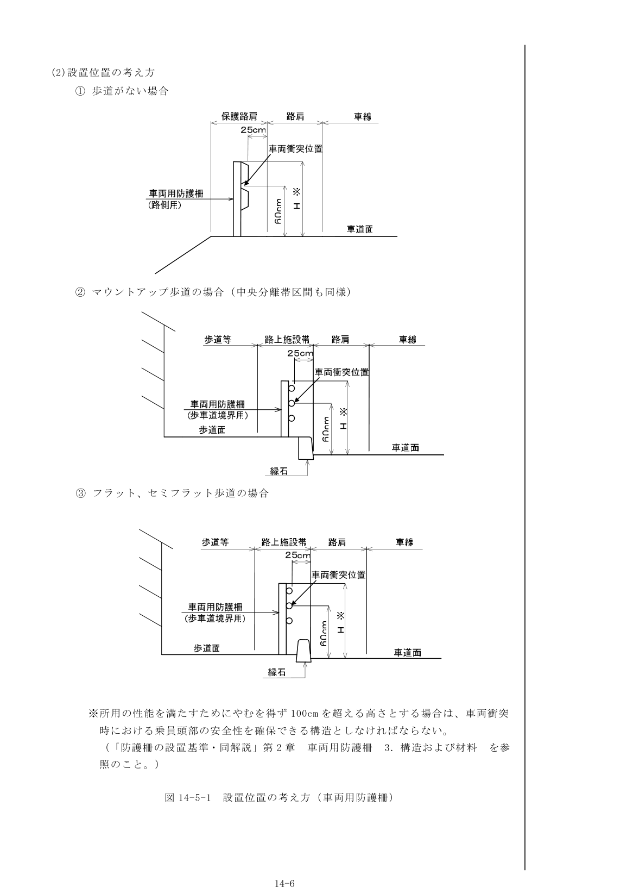

図14-5-1 設置位置の考え方（車両用防護柵）

※所用の性能を満たすためにやむを得ず100cmを超える高さとする場合は、車両衝突時における乗員頭部の安全性を確保できる構造としなければならない。（「防護柵の設置基準・同解説」第2章 車両用防護柵 3.構造および材料を参照のこと。）

**(3) たわみ性防護柵の種類及び形式の選定**

たわみ性防護柵の選定に当たっては、「車両用防護柵標準仕様・同解説」の標準型を基本とする。なお、標準型以外については、下記のような仕様にすること。

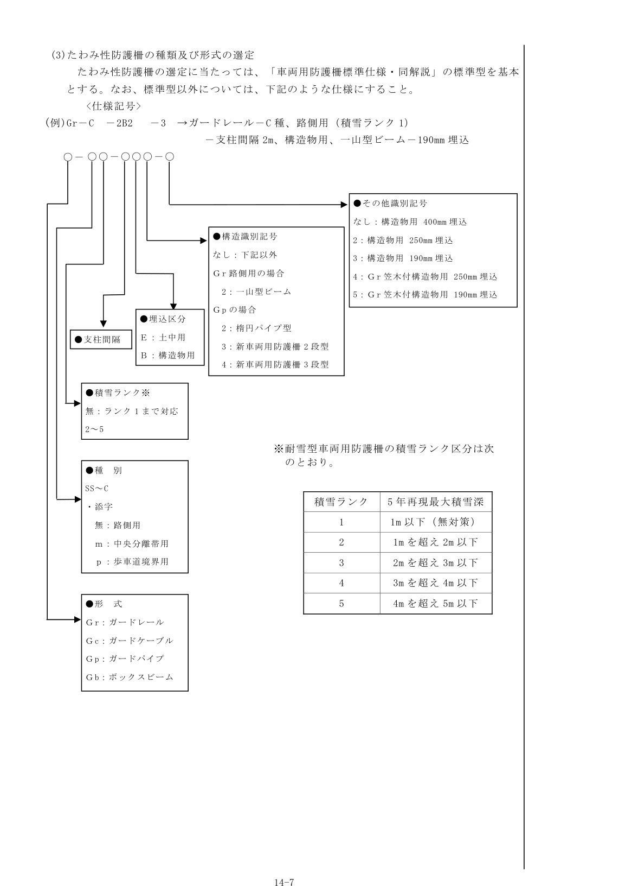

たわみ性防護柵の仕様記号

### 3. 歩行者自転車用柵

#### 3-1 設置場所

下記のいずれかに該当する区間または箇所においては、道路および交通の状況を踏まえ、必要に応じ歩行者自転車用柵を設置するものとする。

**(1)** 歩行者の転落防止を目的として路側または歩車道境界に歩行者自転車用柵を設置する区間。【種別PおよびSP】

- ①歩道等、自転車専用道路、自転車歩行者専用道路および歩行者専用道路の路外が危険な区間などで、歩行者等の転落を防止するため必要と認められる区間。
- ②張出し歩道および組立歩道の区間
- ③路面までの垂直高さが下記に示す値以上の擁壁、水路等のある区間、または在来地盤から歩道面までが盛土法面となる区間で、垂直高さ1.5m以上の区間。

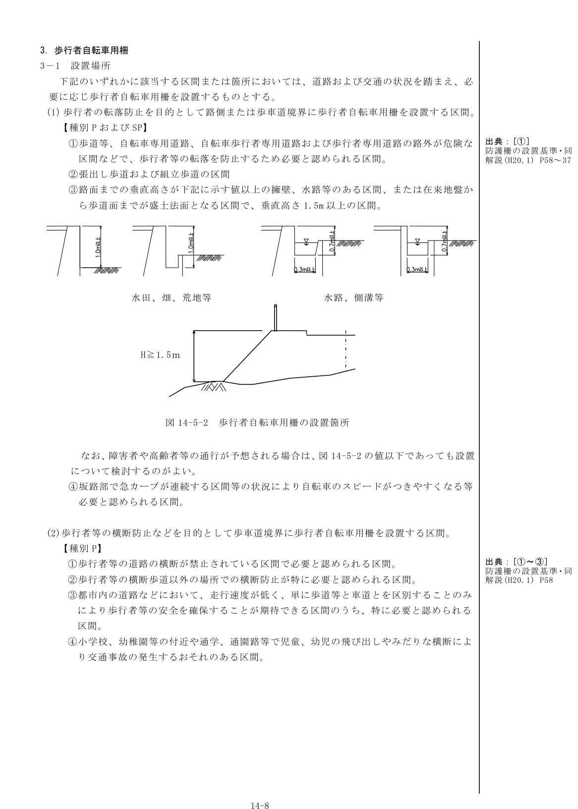

図14-5-2 歩行者自転車用柵の設置箇所

なお、障害者や高齢者等の通行が予想される場合は、図14-5-2の値以下であっても設置について検討するのがよい。

- ④坂路部で急カーブが連続する区間等の状況により自転車のスピードがつきやすくなる等必要と認められる区間。

**(2)** 歩行者等の横断防止などを目的として歩車道境界に歩行者自転車用柵を設置する区間。【種別P】

- ①歩行者等の道路の横断が禁止されている区間で必要と認められる区間。
- ②歩行者等の横断歩道以外の場所での横断防止が特に必要と認められる区間。
- ③都市内の道路などにおいて、走行速度が低く、単に歩道等と車道とを区別することのみにより歩行者等の安全を確保することが期待できる区間のうち、特に必要と認められる区間。
- ④小学校、幼稚園等の付近や通学、通園路等で児童、幼児の飛び出しやみだりな横断により交通事故の発生するおそれのある区間。

#### 3-2 種別の適用条件

歩行者自転車用柵の種別及びその適用条件は表14-5-2による。

| 種別 | 設置目的 | 設置高(cm) | 適用する場所 |
|---|---|---|---|
| P | 転落防止 | 110 | 下記以外の区間 |
| P | 横断防止 | 80 | 下記以外の区間 |
| SP | 転落防止 | 110 | 歩行者の滞留が予想される区間および橋梁、高架の区間 |

注1）設置高とは、歩道等の路面から柵の上端までの高さをいう。

注2）横断防止用柵の設置高は、歩行者が容易に乗り越えられるものであってはならない。しかし、必要以上に高いと威圧感を与え、また止むを得ない理由で柵を乗り越えることもあり、これらを考慮して80cmを標準とする。

注3）転落防止用柵の設置高は、歩行者および自転車が柵より少々身を乗り出しても重心は柵の内側に残り、転落を防止できる高さとして110cmを標準とする。

#### 3-3 設置における留意事項

1. 歩行者自転車用柵は、人および自転車交通量が多い区間に設置され、常に人と身近に接するものであるため、その地域の特性、街並みに合った形状を用いることが望ましく、単に機能本位で形状を統一することは好ましくない。しかし、同じ地域内（それも狭い範囲）であまり多種多様な形状を設けてもかえって美観を損なう結果ともなりかねないので設置にあたっては十分検討しなければならない。
2. 横断防止用柵は、車両の出入口や歩行者、自転車の道路横断のため、柵を切断しなければならない場合があるが、柵の性能上できるだけ連続することが望ましい。ただし、車両出入口等で切断する場合には、車両の積荷等により端部が破損されている実例があるため、開口幅を考慮すること。
3. 支柱の基礎形式および埋込み深さは、「防護柵の設置基準・同解説」によるものとする。ただし、構造物に設置する場合は以下とする。
   - 既設構造物：φ80程度の削孔方式
   - 新設構造物：箱抜方式
4. 設置位置の考え方

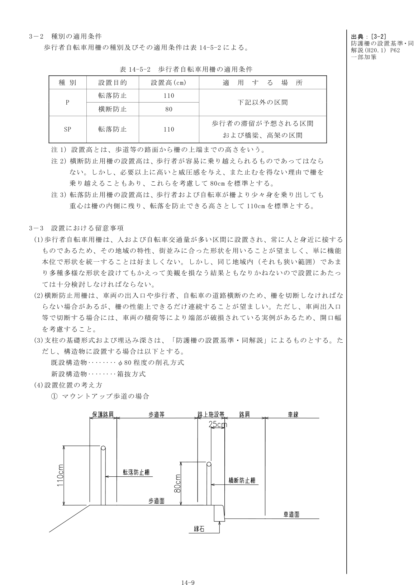

図14-5-3 設置位置の考え方（歩行者自転車用柵）

### 4. 橋梁、高架に設置する場合

#### 4-1 橋梁、高架における設置の考え方

橋梁、高架に設置する車両用防護柵および歩行者自転車用柵の選定にあたっての考え方は、「防護柵の設置基準・同解説」によるものとする。

同基準による標準的な選定フローチャートを図14-5-4に示す。

なお、種別の選定にあたっては、大型車の混入率の高い区間、橋梁下が高い等のため危険度が大きい区間、車両の橋梁外逸脱が当該車両の被害にとどまらず二次的事故を引き起こすおそれがある区間等では、より上級の種別の防護柵を設置することが望ましい。

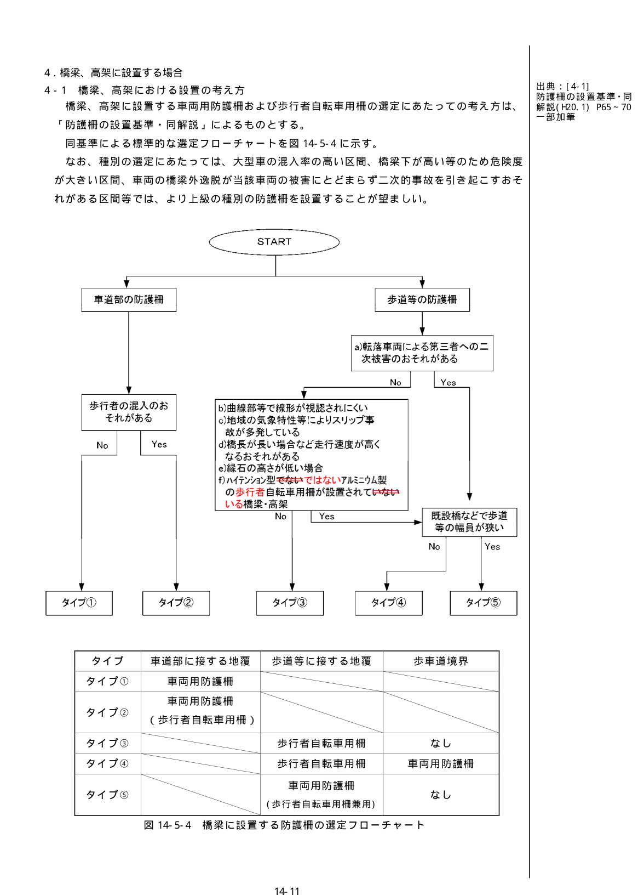

図14-5-4 橋梁に設置する防護柵の選定フローチャート

注1）図14-5-4の「転落車両による第三者への二次的被害が発生するおそれがある」とは、次のような場合をいう。

- a）道路が鉄道等または他の道路と接近もしくは立体交差していて、路外に逸脱した車両が鉄道等または他の道路に進入し、二次的事故を起こすおそれのある区間にある場合。
- b）その他車両の転落による二次的事故のおそれが想定される場合。

注2）図14-5-4の「線形が視認されにくい曲線部等、車両の路外逸脱が生じやすい」とは、次のような場合をいう。

- a）曲線半径が小さい区間にある橋梁で、防護柵の設置によりその効果があると認められる場合。
- b）下り急勾配区間の橋梁で、防護柵の設置によりその効果があると認められる場合。
- c）車道幅員が急激に狭くなっている道路にある橋梁で、防護柵の設置によりその効果があると認められる場合。
- d）変形交差のある橋梁のうち、防護柵の設置によりその効果があると認められる場合。
- e）トンネル等の前後の橋梁で、特に必要と認められる場合。
- f）橋梁そのものは直橋であるが前後の取り付け部が曲線である場合で、特に必要と認められる場合。
- g）橋梁上で事故が多発している橋梁または多発するおそれのある橋梁で、防護柵の設置によりその効果があると認められる場合。
- h）気象状況によって、特に必要と認められる場合。

注3）図14-5-4の「既設橋などで歩道等の幅員が狭い」とは、歩車道境界に車両用防護柵を設置すると、歩行者等の通行を妨げるおそれのある場合をいう。

#### 4-2 設計荷重

橋梁本体の設計に用いる防護柵等（剛性防護柵を除く）の死荷重は0.6 kN/mとする。

また、橋梁本体の設計に用いる防護柵等の設計推力は、道路橋示方書・同解説 I共通編5.1によるものとする。

#### 4-3 防護柵の基礎構造

橋梁に設置する防護柵の基礎構造は、「車両用防護柵標準仕様・同解説」によるものとする。なお、支柱の埋込み深さは250mmを標準とする。

## 第6節 取付道路（標準）

**小規模道及び農道の取付**

取付道路幅員5.5m未満の場合は、図14-6-1の構造とする。

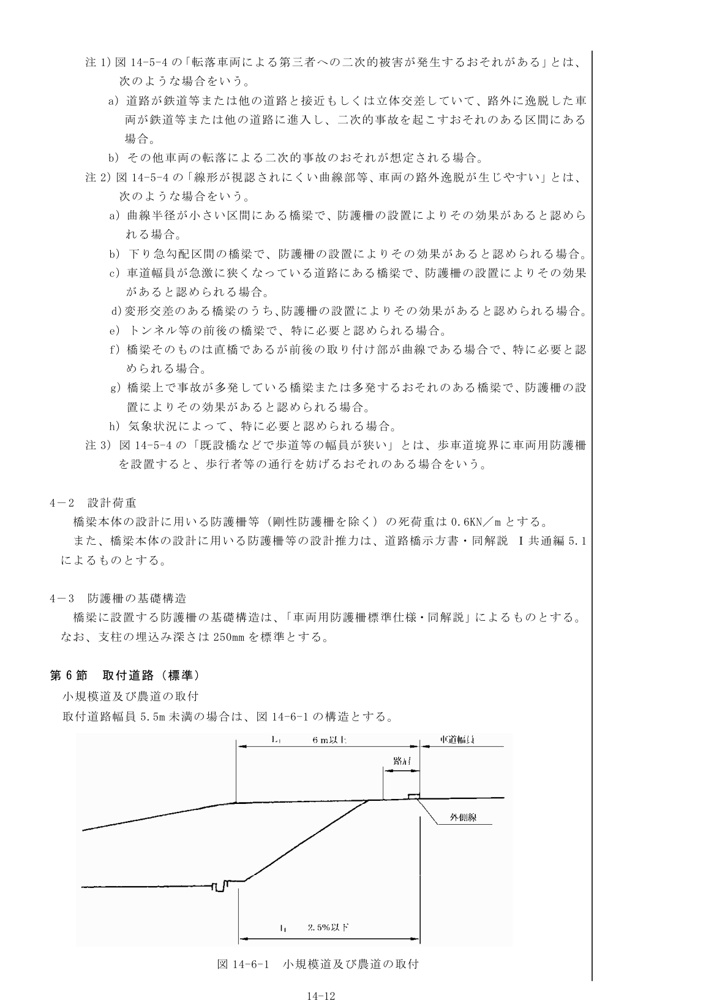

図14-6-1 小規模道及び農道の取付

{/* 図・表のページ対応表
- 表14-1-1 示方書等の名称 → r14-tbl-01.png（p2）
- 図14-3-1 区画線の設置位置の原則 → r14-fig-01.png（p3）
- 図14-4-1 横断歩道の設置位置 → r14-fig-02.png（p4）
- 図14-4-2 新設道路に付加車線を設置する場合の例 → r14-fig-03.png（p5）
- 図14-4-3 既設道路に付加車線を設置する場合の例 → r14-fig-04.png（p5）
- 表14-5-1 車両用防護柵の適用条件 → r14-tbl-02.png（p6）
- 図14-5-1 設置位置の考え方（車両用防護柵） → r14-fig-05.png（p7）
- たわみ性防護柵の仕様記号 → r14-fig-06.png（p8）
- 図14-5-2 歩行者自転車用柵の設置箇所 → r14-fig-07.png（p9）
- 図14-5-3 設置位置の考え方（歩行者自転車用柵） → r14-fig-08.png（p10-11）
- 図14-5-4 橋梁に設置する防護柵の選定フローチャート → r14-fig-09.png（p12）
- 図14-6-1 小規模道及び農道の取付 → r14-fig-10.png（p13）
*/}
