## 第4節 無停電電源装置（UPS）

### 1. 一般事項

#### 1-1 適用範囲

本規程は、近畿地方整備局において施工する無停電電源装置に適用する。（官庁営繕を除く）

> **（解説）**
>
> 1. 無停電電源装置を指す名称としてのUPS（Uninterruptible Power System）は、近年従来からのCVCF（Constant Voltage Constant Frequency）に代わり一般的に使用されるようになってきた。
> 2. 本便覧では方式を常時運転方式とし、名称は無停電電源装置（UPS）に統一する。

#### 1-2 設置基準

UPSは、商用電源停電時においても良好な交流電源を必要とする負荷設備が設置されている箇所に設置する。

- (1) 防災用UPS：各種防災設備などが設置されている箇所
- (2) 一般用UPS：各種操作制御設備などが設置されている箇所
- (3) 小容量UPS：各種事務用設備などが設置されている箇所

#### 1-3 対象負荷と供給電圧

対象負荷と供給電圧（公称値）の標準は、いずれも1φ2W 100Vとする。

#### 1-4 負荷運転モードと停電補償時間

| 種別 | 運転モード | 停電補償時間 | 蓄電池温度 | 保守率 |
|---|---|---|---|---|
| 防災用UPS | 連続運転 | 5分間以上 | 5℃ | 0.8 |
| 一般用UPS | 連続運転 | 5分間以上 | 5℃ | 0.8 |
| 小容量UPS | 連続運転 | 5分間以上 | 25℃ | 1.0 |

#### 1-5 周囲温度及び相対湿度

- 防災用UPS：-5℃～+40℃、90%以下
- 一般用UPS：-5℃～+40℃、90%以下
- 小容量UPS：0℃～+40℃、90%以下

#### 1-6 換気設備および保有距離

UPSの火災予防条例は直流電源装置（第3節 1-5）に準じる。

#### 1-7 給電方式別の特徴及び適用

**1. 常時商用給電方式**

商用給電からインバータ給電への切換時に電源瞬断があるため、瞬断が許容されるトンネル照明やその他の交流機器に適用可能。運転効率が高く、小型・軽量で経済的。

**2. ラインインタラクティブ方式**

常時商用給電方式に電圧調整機能を付加したもので、定常時は安定した商用電源を供給できる。停電時は電源瞬断が発生する。

**3. 常時インバータ給電方式**

切換が無瞬断で負荷に定電圧かつ定周波数の安定な電源を供給できるため全ての負荷に適用できる。交流入力側からの電源ノイズを抑制でき、高品質で高信頼な電源を供給できる。

### 2. 防災用UPS

#### 2-1 用途、装置方式・定格

防災用UPSは、高度な信頼性が要求される防災システム等に適用する。

- (1) 運転方式：商用同期常時インバータ給電
- (2) 整流方式：高力率コンバータ
- (3) 蓄電池接続方式：フローティング
- (4) インバータ方式：高周波PWM
- (5) 装置定格：100%連続

#### 2-2 入出力仕様

- (1) 入力電圧：3φ3W 200V（直送入力は1φ2W 200V又は100V）
- (2) 出力電圧：1φ2W 100V、又は1φ3W 200V/100V
- (3) 出力容量：10kVA、15kVA、20kVA、30kVA、50kVA
- (4) 蓄電池：MSE 52～54セル（20kVA以下）、又はメーカ標準セル数

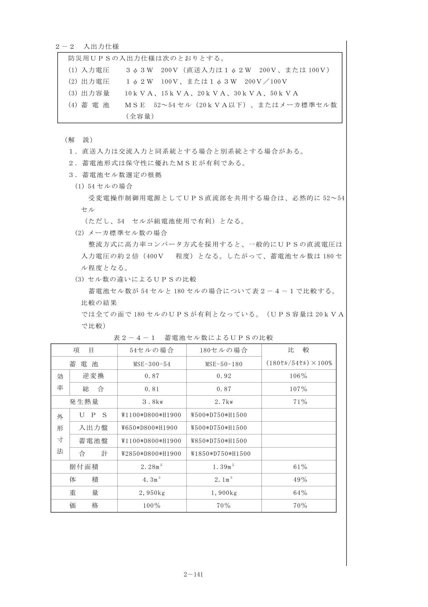

#### 2-3 容量算定

**出力容量の算出**

UPSの出力容量は、次の3つの式をすべて満たす容量以上が必要である。

(1) 定常状態からの条件：$P \geq \alpha \cdot \beta \cdot (P_1 + P_2)$

(2) 過電流耐量からの条件：$P \geq \frac{P_3 + P_4}{1.2}$

(3) 過渡電圧変動からの条件：$P \geq \frac{P_4}{0.5 \sim 1.0}$

- $P$：必要とするUPS容量（kVA）
- $P_1$：負荷容量の総和（kVA）
- $P_2$：将来増負荷容量（kVA）
- $P_3$：ベース負荷容量（kVA）
- $P_4$：最大突入負荷容量（kVA）
- $\alpha$：負荷の需要率（通常0.9程度）
- $\beta$：高調波電流による余裕度（高周波PWM方式では1.0が可能）

**2-3-1 常時商用給電方式**

**1. インバータ容量の算定**

- $P_{C1} = P_{LN}$（定常負荷容量）
- $P_{C2} = P_{LN} \times PF_L / PF_I$（定常負荷電力）
- $P_{C3} = P_{LP} / \beta$（瞬時最大負荷容量）

**2. 整流器容量の算定**

整流器容量（A）= インバータ待機時制御電流（A）+ 蓄電池容量（Ah）/ 15

**2-3-3 常時インバータ給電方式**

インバータ容量の算定は常時商用給電方式に同じ。

#### 2-4 発生熱量の算出

$$Q = 860 \times \left(\frac{1}{\eta_{AA}} - 1\right) \times P_L \times PF_L$$

- $Q$：発生熱量（kcal/h）
- $\eta_{AA}$：UPS総合効率

#### 2-5 換気量の算出

$$V_{FH} = \frac{Q - Q_D}{\Delta T \times T_A \times D_A}$$

#### 2-6 蓄電池形式及び蓄電池容量

防災用UPSに使用する蓄電池形式、蓄電池容量は第3節2-5に同じとする。蓄電池形式はMSEを原則とする。

#### 2-7 蓄電池

**1. 蓄電池の選定**

- 常時インバータ給電方式の一般形：制御弁式据置鉛蓄電池MSE形又は長寿命MSE形
- 常時インバータ給電方式の汎用形：小形制御弁式鉛蓄電池
- 常時商用給電方式：小形制御弁式鉛蓄電池又は制御弁式据置鉛蓄電池

**2. 蓄電池容量の算定**

$$C = \frac{1}{L}[K \times I]$$

- $C$：蓄電池容量（Ah/定格時間率）
- $L$：保守率 = 0.8
- $K$：容量換算時間
- $I$：放電電流（A）

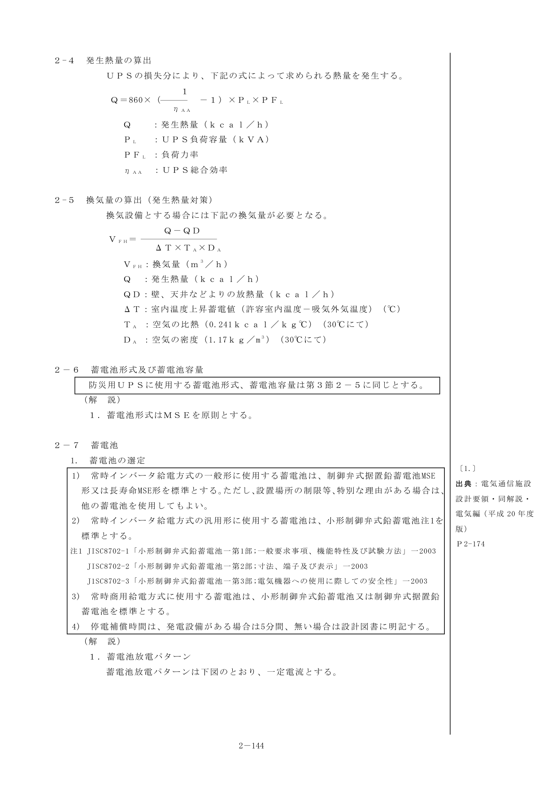

図2-4-1 蓄電池放電パターン

#### 2-9 蓄電池放電電流の算出

$$I = \frac{P\text{(VA)} \times \cos\varphi}{\eta \times E\text{(V)}}$$

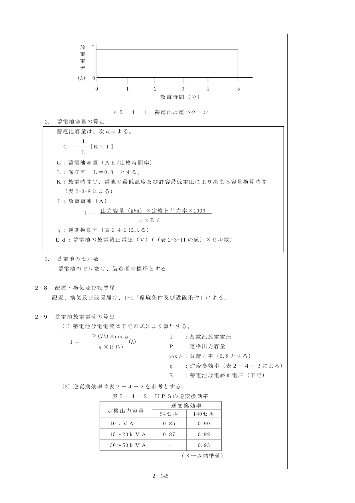

**計算例**

1. 出力容量の算出：過電流耐量の条件より20kVAを選定
2. 入力容量：25.3kVA
3. 蓄電池容量：MSE-50-12 30個（180セル）を選定

### 3. 一般用UPS

#### 3-1 用途、装置方式・定格

一般用UPSは、事務所等の河川・道路管理システム等に適用する。

- (1) 運転方式：商用同期常時インバータ給電
- (2) 整流方式：高力率コンバータ
- (3) 蓄電池接続方式：フローティング
- (4) インバータ方式：高周波PWM
- (5) 装置定格：100%連続

#### 3-2 入出力仕様

- (1) 入力電圧：3φ3W 200V（全容量）、又は1φ2W 200V（10kVA以下）
- (2) 出力電圧：1φ2W 100V
- (3) 出力容量：7.5kVA、10kVA、15kVA、20kVA
- (4) 蓄電池：MSEとする。セル数はメーカ標準。

#### 3-3 蓄電池形式及び蓄電池容量

一般用UPSに使用する蓄電池形式、蓄電池容量は第3節2-5に同じとする。

#### 3-4 蓄電池容量の算出

- (1) 蓄電池の最低温度：5℃
- (2) 保守率：0.8
- (3) 放電時間：5分間
- (4) 負荷力率：遅れ0.8

### 4. 小容量UPS

#### 4-1 用途、装置方式・定格

小容量UPSは、端末設備のバックアップ用に適用する。

- (1) 運転方式：商用同期常時インバータ給電
- (2) 整流方式：サイリスタ全波整流又は同等以上の方式
- (3) 蓄電池接続方式：メーカ標準
- (4) 装置定格：100%連続

#### 4-2 入出力仕様

- (1) 入力電圧：1φ2W 100V
- (2) 出力電圧：1φ2W 100V
- (3) 出力容量：1kVA、1.5kVA、2kVA、3kVA、5kVA
- (4) 接続蓄電池：メーカ標準

#### 4-3 蓄電池形式、蓄電池容量

蓄電池形式、容量ともにメーカ標準とする。算出根拠は蓄電池最低温度25℃、保守率1.0、放電時間5分間。

---

## 第5節 太陽光発電

### 1. 太陽電池

太陽電池には、単結晶、多結晶、アモルファス等が有るので、使用目的によって選定を行う。

### 2. 蓄電池

蓄電池には、シール形鉛蓄電池、クラッド式鉛蓄電池、長寿命形クラッド式鉛蓄電池等が有るので、施設の規模、メンテの可否等使用条件によって選定を行う。

### 3. 設計手順

太陽光発電には独立電源システムとハイブリッドシステム、系統連系システムがあり、設置条件や負荷などのシステムにより適切なタイプを選定する。

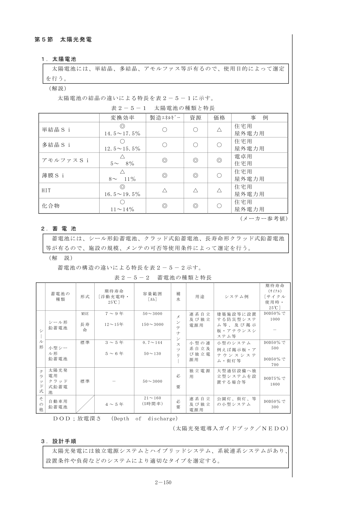

図2-5-1 太陽光発電システム分類図

#### 3-1 独立電源システム

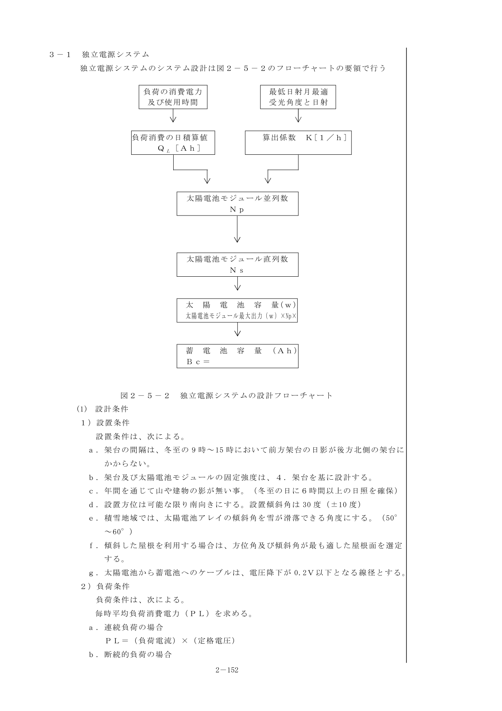

図2-5-2 独立電源システムの設計フローチャート

**(1) 設計条件**

**1) 設置条件**

- 架台の間隔は、冬至の9時～15時において前方架台の日影が後方北側の架台にかからない
- 年間を通じて山や建物の影が無い事（冬至の日に6時間以上の日照を確保）
- 設置方位は可能な限り南向きにする。設置傾斜角は30度（±10度）
- 積雪地域では、傾斜角を雪が滑落できる角度にする（50°～60°）

**4) 太陽電池容量**

太陽電池モジュール直列数：$N_s = (V_f + V_{wd}) / V_{pm}$

必要太陽電池出力：$P_s = K \times P_L \times 24\text{[h]} \times N_s$

**5) 蓄電池容量**

$$B_c = \frac{P_L \times 最大無日照継続時間}{電圧 \times 容量補正係数}$$

**(2) 計算例**

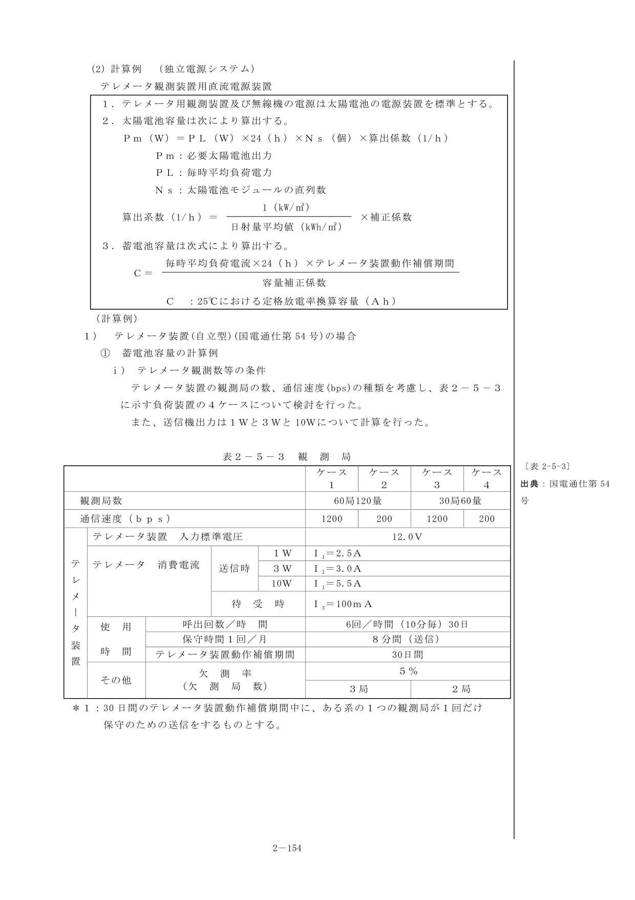

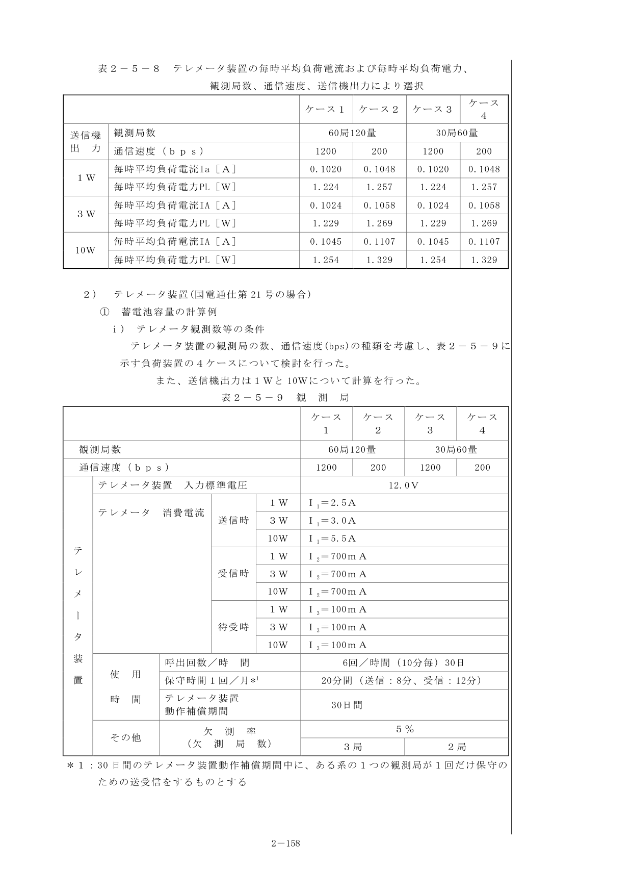

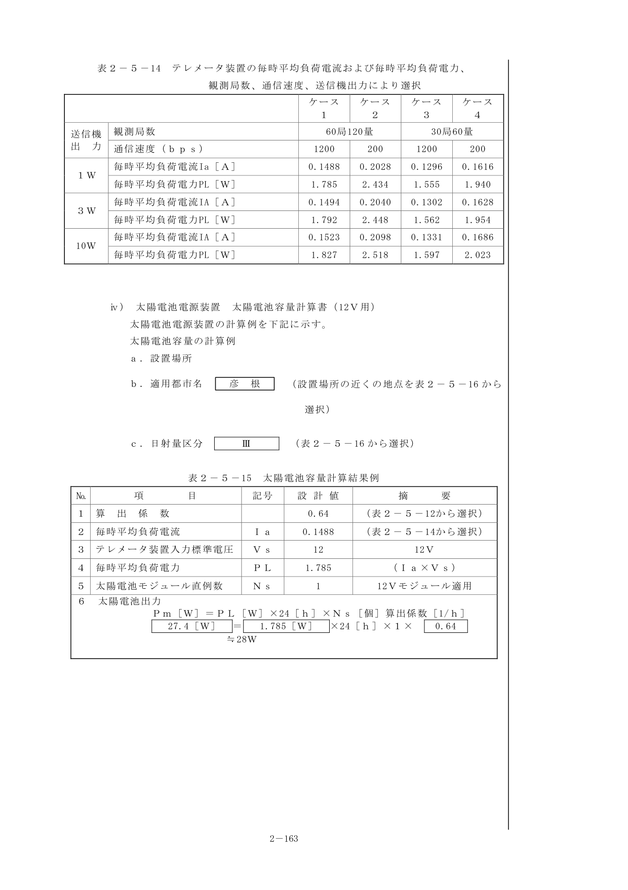

#### 3-2 ハイブリッドシステム

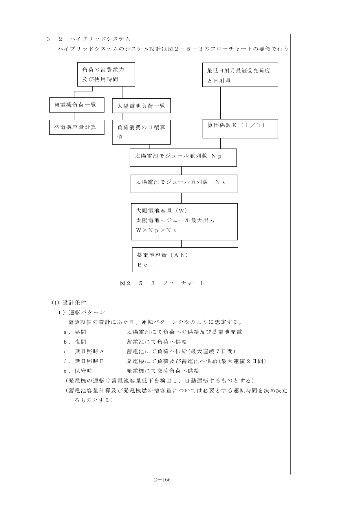

図2-5-3 ハイブリッドシステム フローチャート

**運転パターン**

- 昼間：太陽電池にて負荷への供給及び蓄電池充電
- 夜間：蓄電池にて負荷へ供給
- 無日照時A：蓄電池にて負荷へ供給（最大連続7日間）
- 無日照時B：発電機にて負荷及び蓄電池へ供給（最大連続2日間）
- 保守時：発電機にて交流負荷へ供給

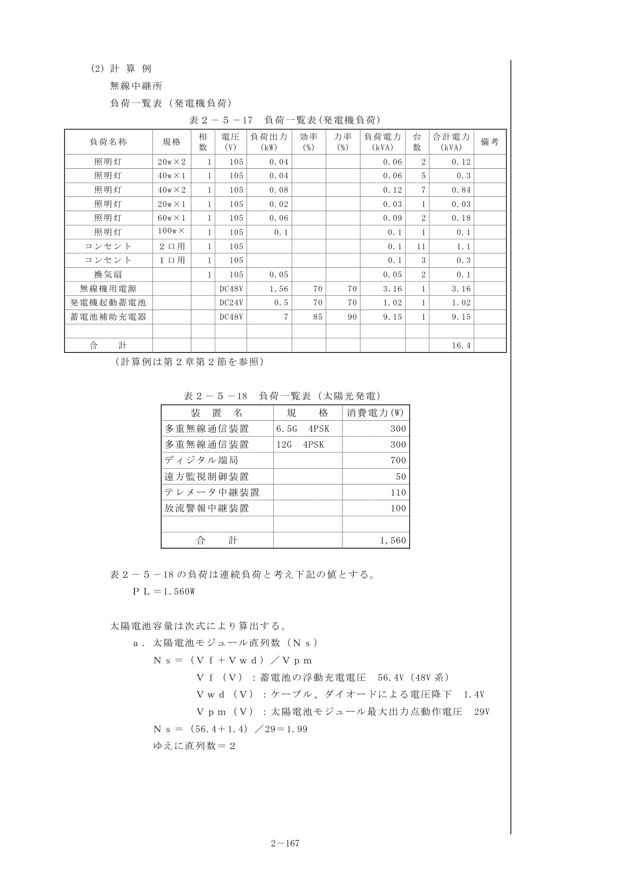

#### 3-3 系統連系システム

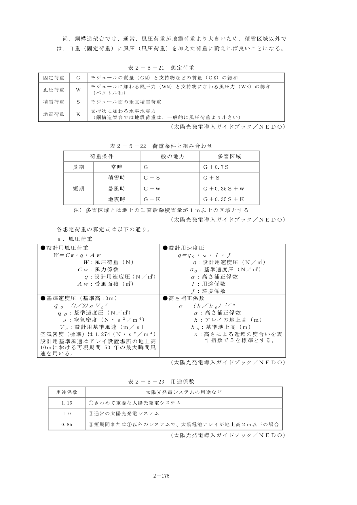

図2-5-4 系統連系システム フローチャート

**パワーコンディショナ**

パワーコンディショナの効率は、定格出力時で90%以上、部分負荷（定格出力の10%）においても80%以上を標準とする。

### 4. 架台

太陽電池アレイの架台は、風速60m/s の風圧に耐え、太陽電池モジュールの受光面への積雪荷重等に十分耐える強度を有するものとする。

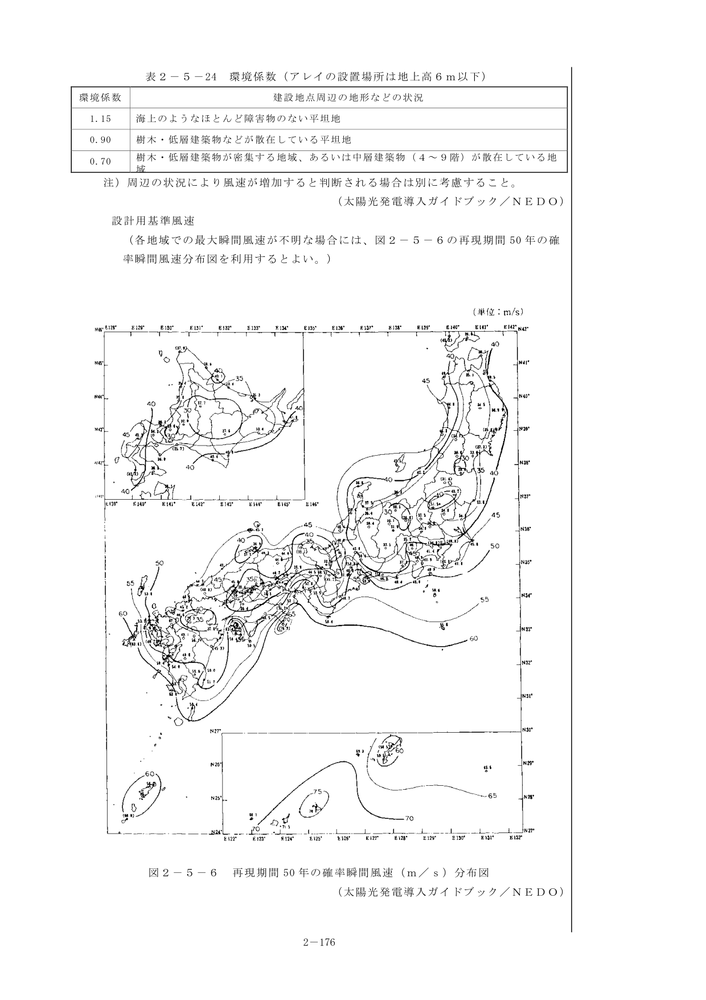

### 5. 関連法規

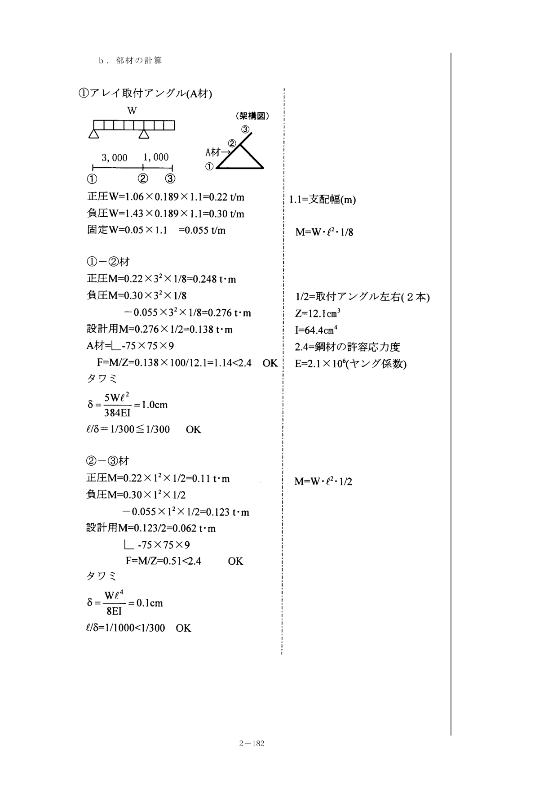

{/* <!-- 図・表のページ対応表
=== 第2章 電源設備 第4節・第5節 ===
[図]
e02-fig-28.png: 図2-4-1 蓄電池放電パターン (p145)
e02-fig-29.png: 図2-5-1 太陽光発電システム分類図 (p151-152)
e02-fig-30.png: 図2-5-2 独立電源システムの設計フローチャート (p153)
e02-fig-31.png: 図2-5-3 ハイブリッドシステム フローチャート (p166)
e02-fig-32.png: 図2-5-4 系統連系システム フローチャート (p176)
[表]
e02-tbl-44.png: 表2-4-1 蓄電池セル数によるUPSの比較 (p142)
e02-tbl-45.png: 表2-4-2～3 UPSの逆変換効率・容量換算時間 (p146-147)
e02-tbl-46.png: 表2-5-1 太陽電池の種類と特長 (p151)
e02-tbl-47.png: 表2-5-2 蓄電池の種類と特長 (p151)
e02-tbl-48.png: 表2-5-3～8 テレメータ装置の計算例 (p155-158)
e02-tbl-49.png: 表2-5-9～14 テレメータ装置（国電通仕第21号）の計算例 (p159-164)
e02-tbl-50.png: 表2-5-15～16 太陽電池容量計算結果・各地点ごとの算出係数 (p164-165)
e02-tbl-51.png: 表2-5-17～21 ハイブリッドシステムの計算表 (p168-175)
e02-tbl-52.png: 架台に関する参考表 (p177-182)
e02-tbl-53.png: 太陽光発電関連法規 (p183-186)
--> */}
