## 第1節 配線設計

### 1. 電線

#### 1-1 電線の種類

電線路に使用する電線は次表により選定するものとする。

**1. 引込電線**

- 高圧：架橋ポリエチレン絶縁ビニルシースケーブルトリプレックス形（CVT）
- 低圧：600Vビニル絶縁ビニルシースケーブル（VVR）もしくは、絶縁電線

**2. 架空電線（電技解釈 第65条・第66条）**

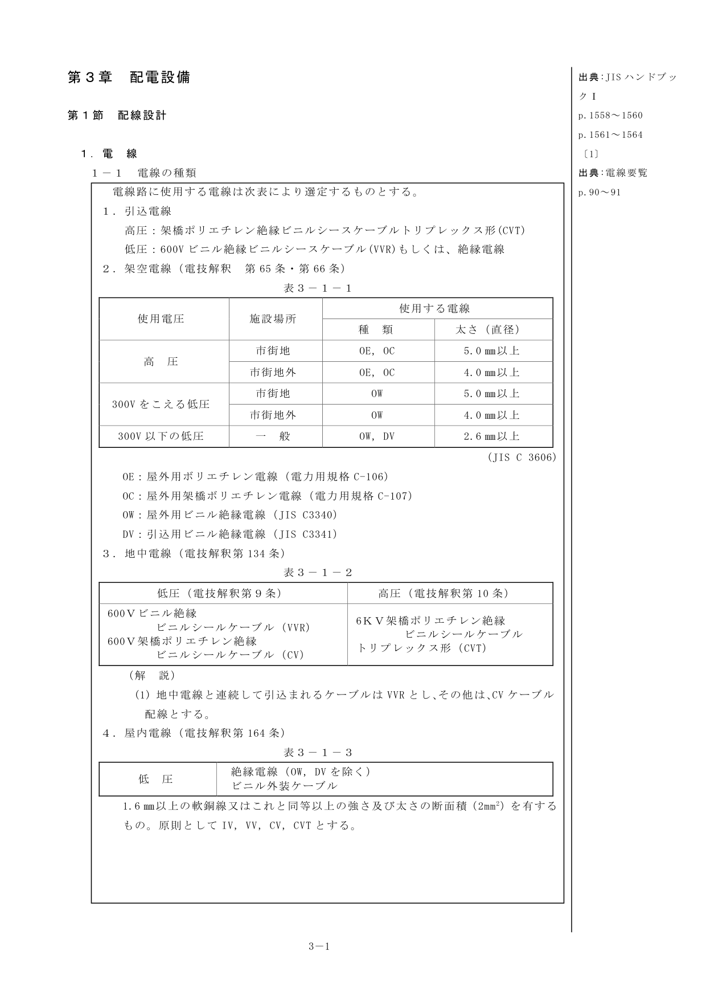

表3-1-1 架空電線の種類

- OE：屋外用ポリエチレン電線（電力用規格C-106）
- OC：屋外用架橋ポリエチレン電線（電力用規格C-107）
- OW：屋外用ビニル絶縁電線（JIS C3340）
- DV：引込用ビニル絶縁電線（JIS C3341）

**3. 地中電線（電技解釈第134条）**

表3-1-2 地中電線の種類

> **（解 説）**
>
> 地中電線と連続して引込まれるケーブルはVVRとし、その他は、CVケーブル配線とする。

**4. 屋内電線（電技解釈第164条）**

表3-1-3 屋内電線の種類

原則としてIV、VV、CV、CVTとする。

#### 1-2 電線の許容電流

電線の許容電流は、次表にするものとする。

**1. 屋外用絶縁電線の許容電流**

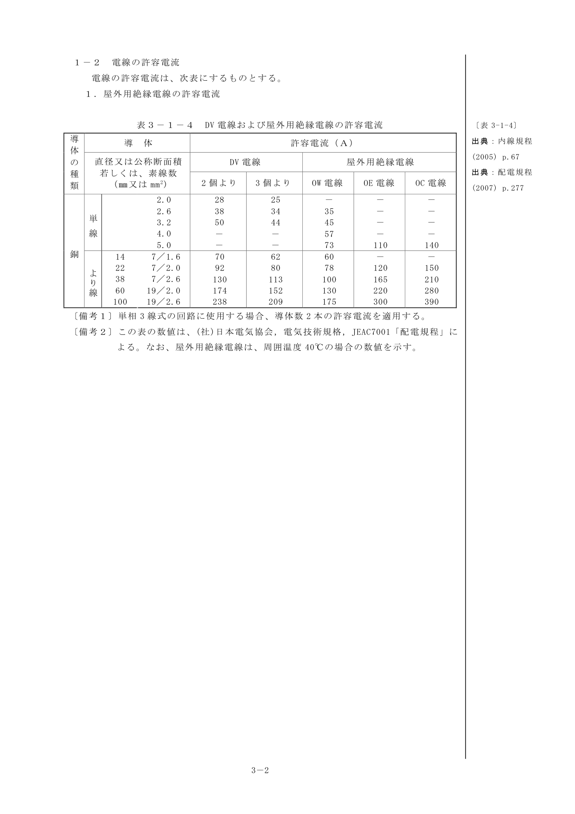

表3-1-4 DV電線および屋外用絶縁電線の許容電流

**2. IV、VVケーブルを電線管等に収める場合の許容電流**

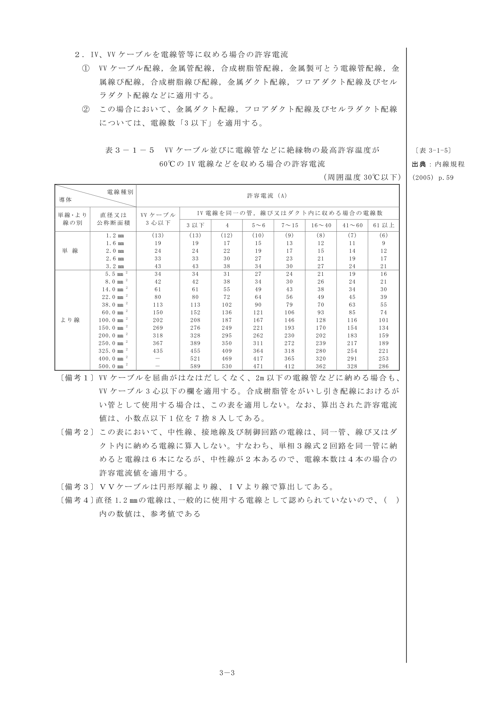

表3-1-5 VVケーブル並びに電線管などに絶縁物の最高許容温度が60℃のIV電線などを収める場合の許容電流（周囲温度30℃以下）

**3. 低圧ケーブル（CV）を布設する場合の許容電流**

表3-1-6 600V架橋ポリエチレン絶縁ビニル外装ケーブルの許容電流値（単心、2心、3心）

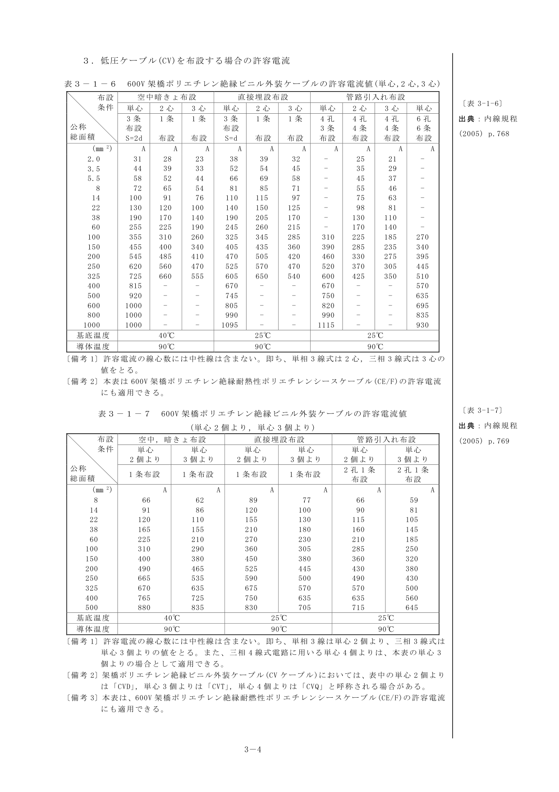

表3-1-7 600V架橋ポリエチレン絶縁ビニル外装ケーブルの許容電流値（単心2個より、単心3個より）

**4. 高圧ケーブル（CV・CVT）を布設する場合の許容電流**

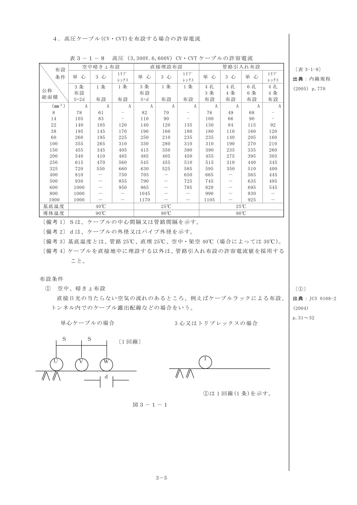

表3-1-8 高圧（3,300V, 6,600V）CV・CVTケーブルの許容電流

図3-1-1～3 ケーブル布設条件

:::note[布設条件]
1. 空中、暗きょ布設：直接日光の当たらない空気の流れのあるところ（ケーブルラック布設、トンネル内露出配線等）
2. 直接埋設布設：L=1.2m以上（又は0.6m以上）の深さに埋設して配線する場合
3. 管路引入れ布設：管路をコンクリート等で巻き車輛等の荷重に耐え、水等が侵入しないように施設する場合
:::

#### 1-3 電圧降下の許容範囲

1. 低圧配線中の電圧降下は、幹線及び分岐回路において、それぞれ標準電圧の2%以下とすること。但し、電気使用場所内の変圧器により供給される場合の幹線の電圧降下は、3%以下とすることが出来る。（勧告）

2. 供給変圧器の二次側端子から最遠端の負荷に至る電線のこう長が60mを超える場合の電圧降下は、前項にかかわらず、負荷電流により計算し、表3-1-9によることができる。（勧告）

表3-1-9 こう長が60mを超える場合の電圧降下

| こう長（m） | 電気使用場所内に設けた変圧器から供給する場合 | 電気事業者から低圧で電気の供給を受けている場合 |
|---|---|---|
| 120以下 | 5%以下 | 4%以下 |
| 200以下 | 6%以下 | 5%以下 |
| 200超過 | 7%以下 | 6%以下 |

#### 1-4 電線の太さ

##### 1-4-1 幹線及び分岐点

電線の太さは電線の許容電流、電線の電圧降下の許容範囲、その回路を保護する保安装置の定格電流、最低限の太さの各項によって決定する。

> **（解 説）**
>
> **1. 電線の許容電流による場合（電技解釈第170条）**
>
> (1) ΣIM ≦ ΣIL の場合：IA ≧ ΣIM ＋ ΣIL
>
> (2) ΣIM ＞ ΣIL の場合：IA ≧ KΣIM ＋ ΣIL
>
> ここで IA：電線の許容電流、IM：その幹線に接続される電動機の定格電流、IL：その幹線に接続される電動機以外の電気使用機器の定格電流、K：定数でΣIM ≦ 50Aの場合は1.25、ΣIM ＞ 50Aの場合は1.1とする。

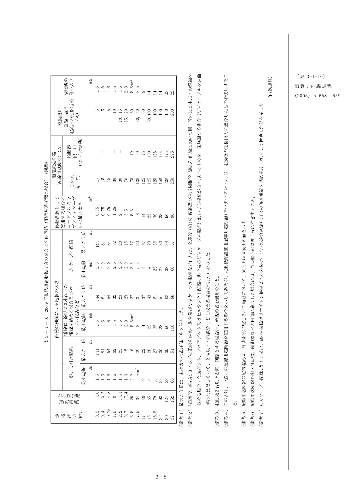

表3-1-10 三相誘導電動機を使用する場合の最小電線の太さ（200V）

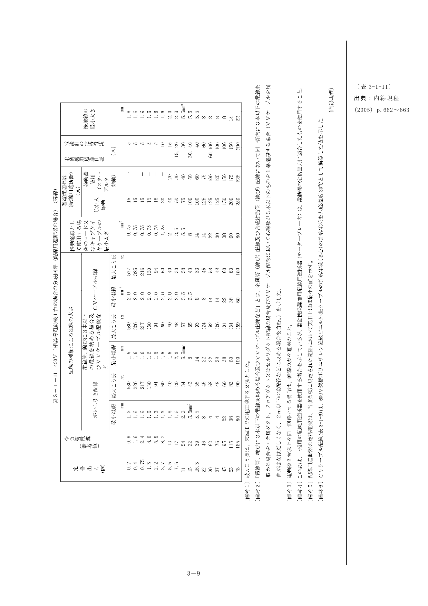

表3-1-11 三相誘導電動機を使用する場合の最小電線の太さ（200V）

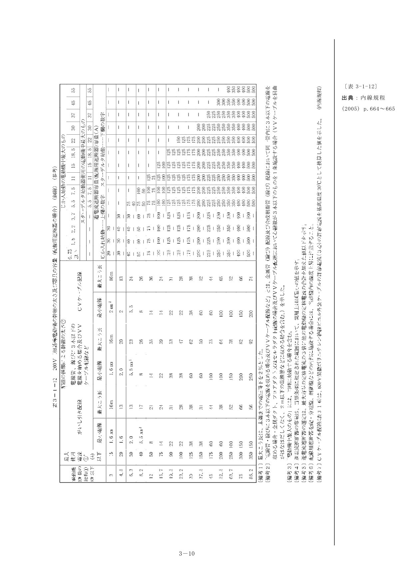

表3-1-12 三相誘導電動機を使用する場合の最小電線の太さ（400V）

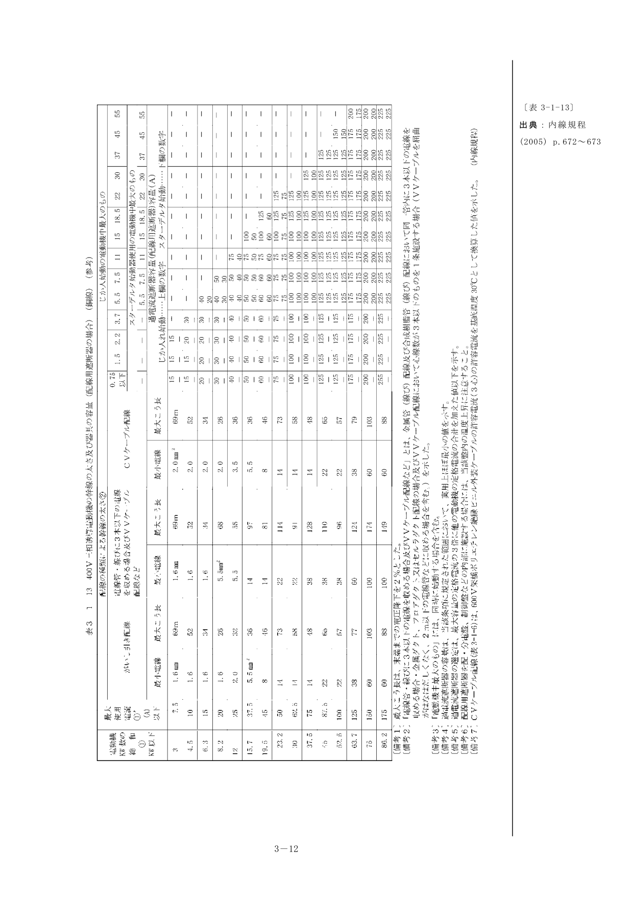

表3-1-13 三相誘導電動機を使用する場合の最小電線の太さ（400V）

**2. 電圧降下計算式**

(1) 幹線など、電線こう長が長く、大電流を扱う場合には、以下の計算式により電圧降下値を計算することが望ましい。

$$e = K_1 I (R \cos\theta_r + X \sin\theta_r) L$$

ここに、

- $e$：電圧降下（V）
- $K_1$：配線方式による係数（下表による）
- $I$：通電電流
- $R$：電線1kmあたりの交流導体抵抗（Ω/km）
- $X$：電線1kmあたりのリアクタンス（Ω/km）
- $\cos\theta_r$：負荷端力率
- $L$：線路のこう長（km）

| 配線方式 | K₁ | 備考 |
|---|---|---|
| 単相2線式 | 2 | 線間 |
| 単相3線式 | 1 | 大地間 |
| 三相3線式 | √3 | 線間 |
| 三相4線式 | 1 | 大地間 |

(2) 屋内配線など比較的に電線こう長が短く、また、電線が細い場合など、表皮効果や近接効果などによる導体抵抗値の増加分やリアクタンス分を無視しても差し支えない場合は、以下の簡略式による。

| 配線方式 | 電圧降下 | 対象電圧降下 |
|---|---|---|
| 単相2線式 | $e = \frac{35.6 \times I \times L}{1000 \times A}$ | 線間 |
| 単相3線式・三相3線式 | $e = \frac{30.8 \times I \times L}{1000 \times A}$ | 線間 |
| 単相3線式・三相4線式 | $e = \frac{17.8 \times I \times L}{1000 \times A}$ | 大地間 |

ここに、$e$：電圧降下（V）、$I$：負荷電流（A）、$L$：電線のこう長（m）、$A$：使用電線の断面積（mm²）。回路の各外側線又は各相電線の平衡した場合に対するものである。また、電線の導電率は97%としている。

**3. 電動機の始動方式**は、原則として表3-1-14による。但し、可変速運転を行う場合は除く。

表3-1-14 標準始動方式

| 供給電圧 | 直入始動 | Y-Δ始動装置による始動 |
|---|---|---|
| 200V | 11kW未満 | 11kW以上 |
| 400V | 30kW未満 | 30kW以上 ※1 |
| 6.6kV | — | すべて ※2 |

注）※1：変圧器容量、負荷の特性等により支障がない場合は、直入始動としても良い。
※2：小容量の高圧電動機の場合は、電源容量、負荷の特性等を考慮の上、直入始動としても良い。

**4. 電気溶接機（アーク溶接機）**

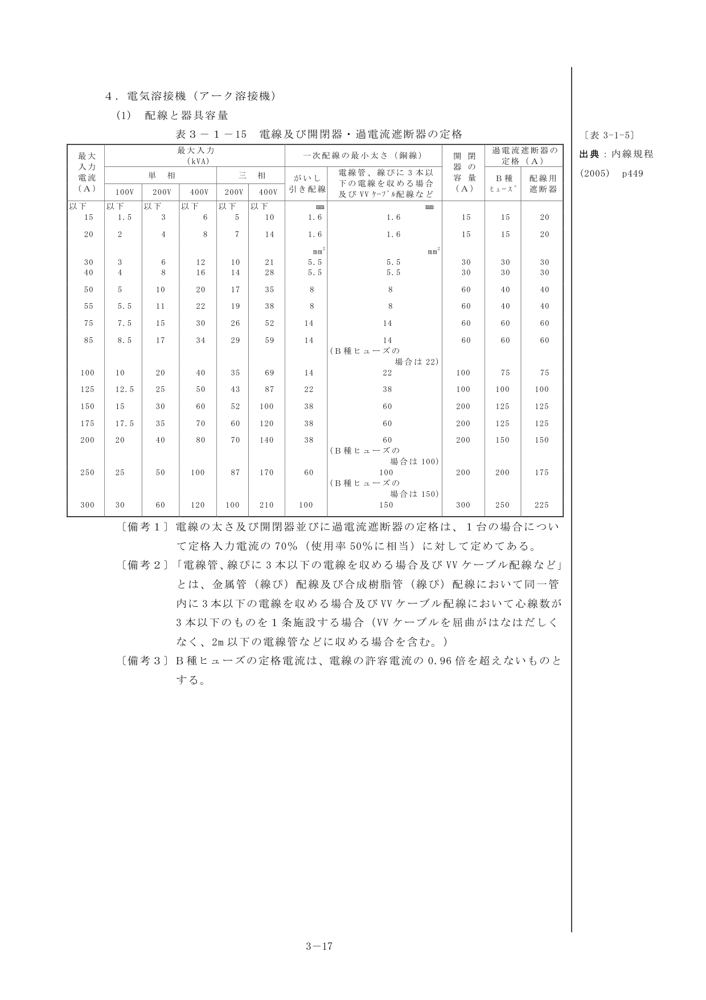

表3-1-15 電線及び開閉器・過電流遮断器の定格

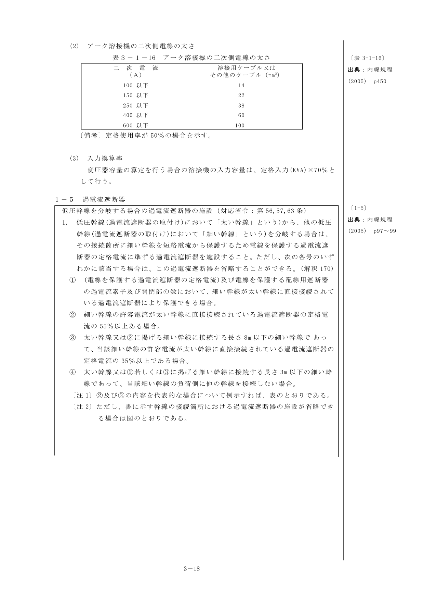

表3-1-16 アーク溶接機の二次側電線の太さ

#### 1-5 過電流遮断器

低圧幹線を分岐する場合の過電流遮断器の施設（対応省令：第56,57,63条）

1. 低圧幹線から他の低圧幹線を分岐する場合は、その接続箇所に細い幹線を短絡電流から保護するため過電流遮断器を施設すること。ただし、次の各号のいずれかに該当する場合は、この過電流遮断器を省略することができる。

    - ① 細い幹線が太い幹線に直接接続されている過電流遮断器により保護できる場合。
    - ② 細い幹線の許容電流が太い幹線に直接接続されている過電流遮断器の定格電流の55%以上ある場合。
    - ③ ②に掲げる細い幹線に接続する長さ8m以下の細い幹線であって、許容電流が太い幹線に直接接続されている過電流遮断器の定格電流の35%以上である場合。
    - ④ ②若しくは③に掲げる細い幹線に接続する長さ3m以下の細い幹線であって、負荷側に他の幹線を接続しない場合。

図 低圧幹線の過電流遮断器の施設

2. 分岐回路で機械器具を保護する過電流遮断器（電技解釈第171条）

    定格電流の選定（分岐回路）：If = 1.3 × IL

**3. 配線用遮断器の定格（MCCB）**

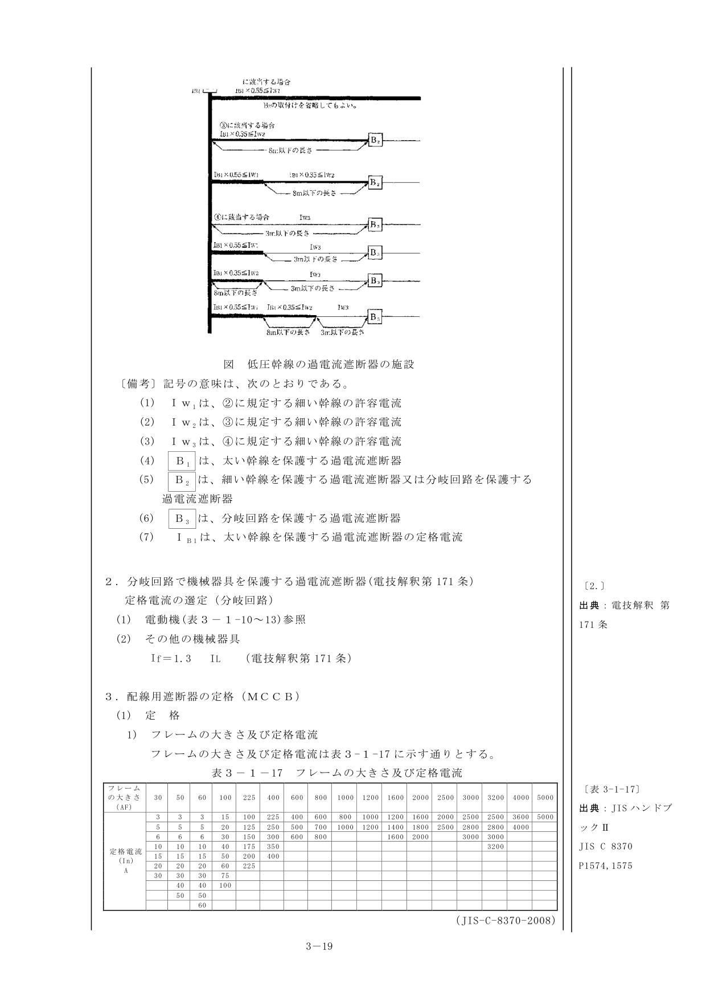

表3-1-17 フレームの大きさ及び定格電流（JIS C 8370-2008）

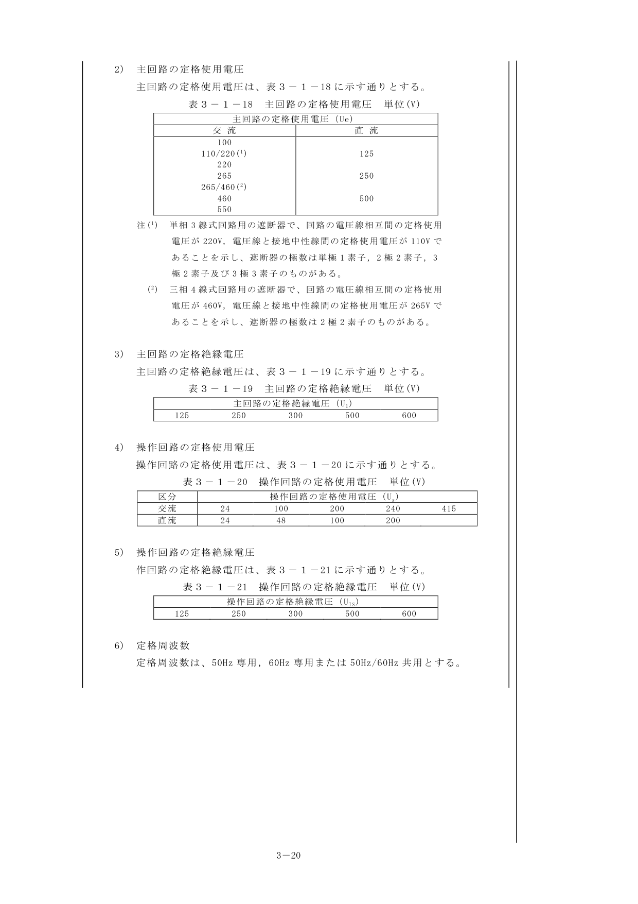

表3-1-18～22 主回路の定格使用電圧・定格絶縁電圧・定格遮断容量

**4. ヒューズの定格**

定格電流：1, 3, 5, 10, 15, 20, 30, 40, 50, 60, 75, 100, 125, 150, 200, 250, 300, 400, 500, 600, 700, 800, 900, 1000（A）

> **（解 説）**
>
> **配線用遮断器の選定について**
>
> 1. 配線用遮断器の定格電流Ifは次式を満足すること。想定最大負荷電流 ≦ If ≦ 電源の許容電流。
> 2. 配線用遮断器（MCB）の定格電流は、周囲温度40℃の時の数値である。
> 3. 周囲温度が高温となる恐れのある場所に設置する場合、定格電流値は表3-1-24の逓減率を乗じた値に減ずるものとする。

表3-1-24 温度逓減率

| 周囲温度 | 40℃ | 50℃ | 60℃ |
|---|---|---|---|
| 逓減率（%） | 100 | 90 | 80 |

#### 1-6 漏電遮断器（電技解釈第40条 及び労働安全衛生規則）

漏電遮断器の施設場所、方法は次表による。

表3-1-25 漏電遮断器の施設場所

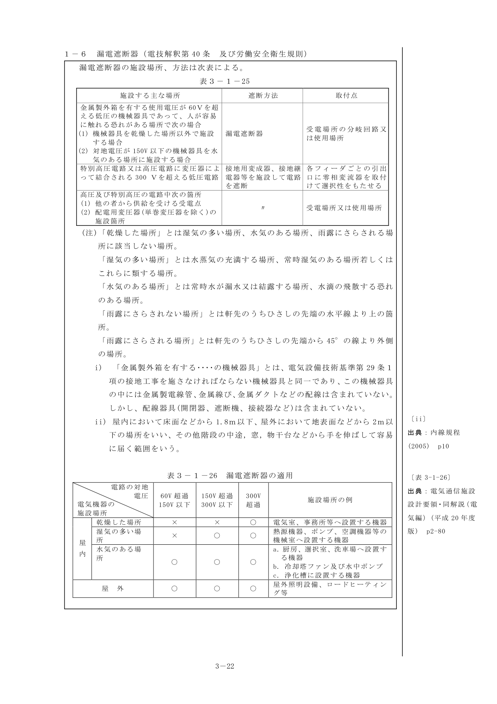

表3-1-26 漏電遮断器の適用

> **（参 考）**
>
> **1. 漏電遮断器などの取付け（対応省令：第4,5,10,11,15,56,59,64条）**
>
> 人が容易に触れるおそれがある場所に施設する使用電圧が60Vを超える低圧の金属製外箱を有する機械器具に電気を供給する電路には、漏電遮断器を施設すること。ただし、次のいずれかに該当する場合はこの限りでない。
>
> - ① 変電室又は受電室などで電気取扱者以外の者が立入らない場所に施設する場合
> - ② 乾燥した場所に施設する場合
> - ③ 対地電圧が150V以下の機械器具を水気のある場所以外の場所に施設する場合
> - ④ C種接地工事又はD種接地工事の接地抵抗値が3Ω以下の場合
> - ⑤ 二重絶縁の構造の機械器具を施設する場合
> - ⑥ 定格容量が3kVA以下の絶縁変圧器を施設し、かつ電路を接地しない場合

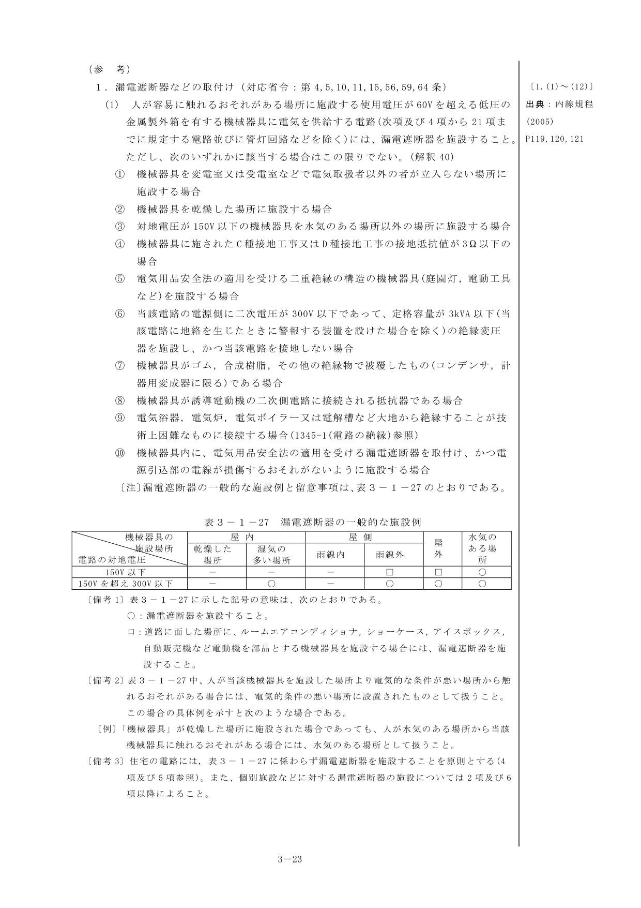

表3-1-27 漏電遮断器の一般的な施設例

**2. 漏電しゃ断器の感度電流の選定**

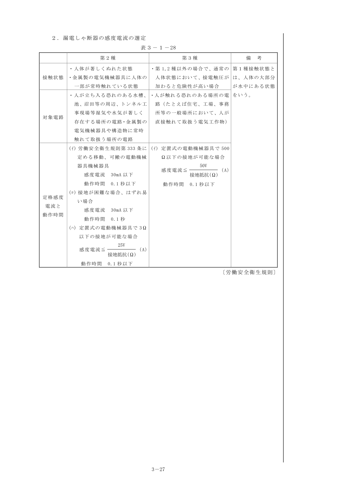

表3-1-28 漏電遮断器の感度電流の選定

**3. 定格電流**

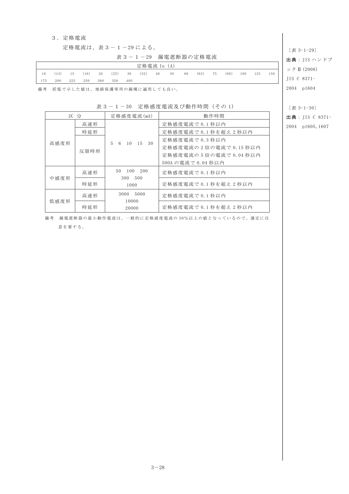

表3-1-29 漏電遮断器の定格電流 / 表3-1-30 定格感度電流及び動作時間

#### 1-7 低圧進相コンデンサ

容量の算出は、第2章6-2進相コンデンサと同じである。

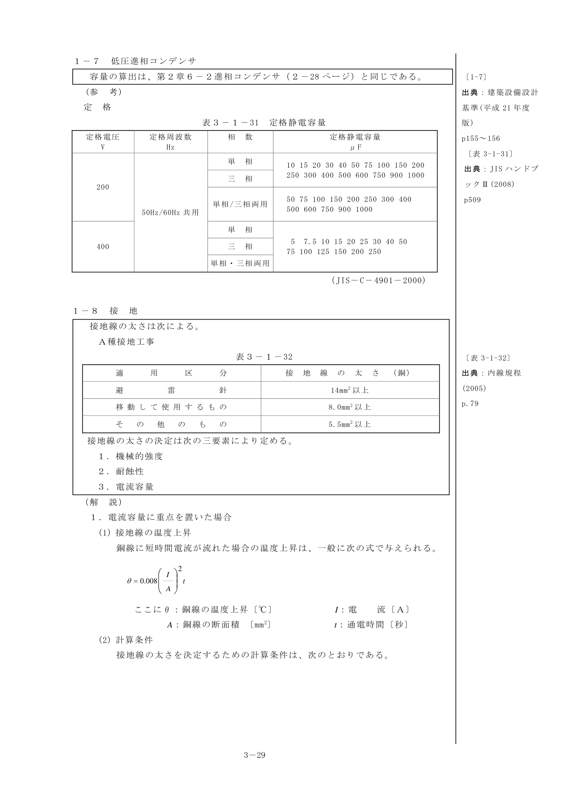

表3-1-31 定格静電容量（JIS C 4901-2000）

#### 1-8 接地

接地線の太さは次による。

**A種接地工事**

表3-1-32 A種接地工事の接地線の太さ

| 適用区分 | 接地線の太さ（銅） |
|---|---|
| 避雷針 | 14mm²以上 |
| 移動して使用するもの | 8.0mm²以上 |
| その他のもの | 5.5mm²以上 |

> **（解 説）**
>
> 接地線の太さの決定は次の三要素により定める。1.機械的強度、2.耐蝕性、3.電流容量
>
> 電流容量に重点を置いた場合の接地線の太さは A = 0.0521In（In：過電流遮断器の定格電流）

**B種接地工事**

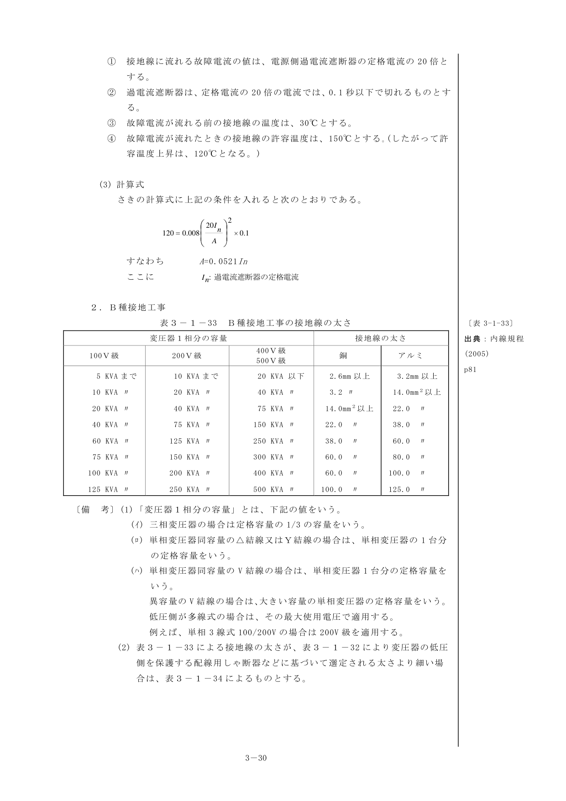

表3-1-33 B種接地工事の接地線の太さ

**C種及びD種接地工事**

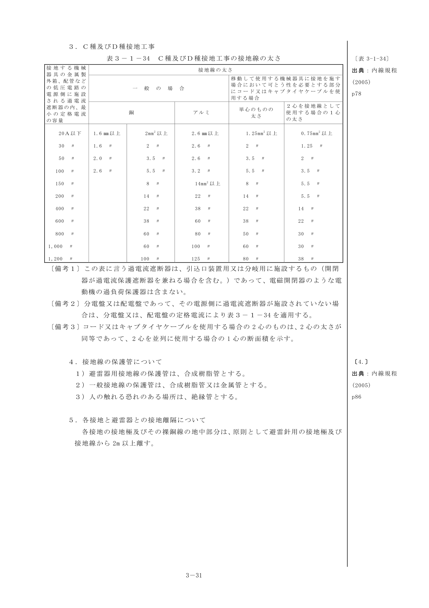

表3-1-34 C種及びD種接地工事の接地線の太さ

**4. 接地線の保護管について**

1）避雷器用接地線の保護管は、合成樹脂管とする。
2）一般接地線の保護管は、合成樹脂管又は金属管とする。
3）人の触れる恐れのある場所は、絶縁管とする。

**5. 各接地と避雷器との接地離隔について**

各接地の接地極及びその裸銅線の地中部分は、原則として避雷針用の接地極及び接地線から2m以上離す。

**6. 電気設備の接地**

表3-1-35 電気設備の接地（1/2）

表3-1-35 電気設備の接地（2/2）

**7. 接地抵抗**

| 接地工事の種類 | 接地抵抗値 |
|---|---|
| A種接地工事 | 10Ω以下 |
| B種接地工事 | 150/I Ω以下（I：1線地絡電流） |
| C種接地工事 | 10Ω以下 |
| D種接地工事 | 100Ω以下 |

### 2. 配管

#### 2-1 電線管の太さ

1. 電線を同一管内におさめる場合の管の太さは、被覆絶縁物を含む断面積の総和が管の内断面積の32%以下になるように選定しなければならない。
2. 管の長さが6m以下で途中の屈曲がなく、容易に電線を引き替えることができる場合は、前項にかかわらず断面積総和が管の内断面積の48%以下とすることができる。
3. ケーブルを管内におさめる場合の管の太さは、ケーブル仕上がり外径の1.5倍以上でなければならない。又、ケーブルを2条以上同一管内におさめる場合は、ケーブルを集合した場合の外接円の直径の1.5倍以上とする。
4. 1区間の屈曲箇所は4箇所以内とし、曲げ角度の合計は270度以内とする。
5. IV電線2本以上を同一管内におさめる場合は、断面積に次の補正係数を用いる。

| 電線太さ | 補正係数 |
|---|---|
| 単線 1.6・2.0mm | 2.0 |
| 単線 2.6・3.2mm / より線 5.5・8mm² | 1.2 |
| より線 14mm²以上 | 1.0 |

> **（解 説）**
>
> ケーブルと電線が混在する場合は、相互の外接円の直径の1.5倍以上とする。

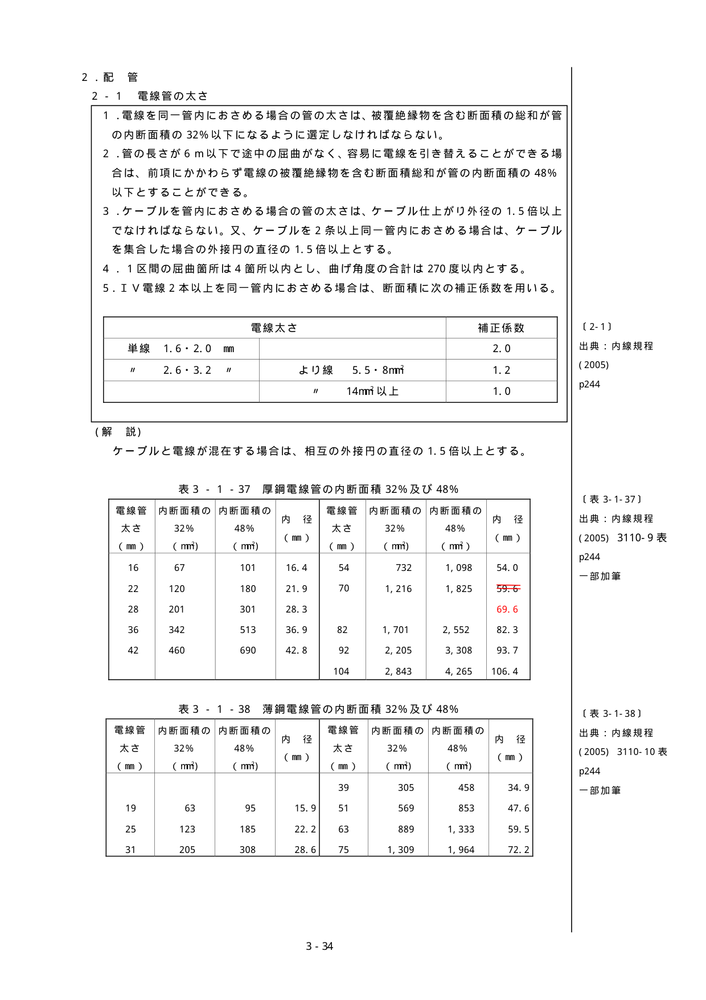

表3-1-37～42 各種電線管の内断面積32%及び48%

#### 2-2 使用場所による管路の種類

表3-1-43 使用場所による管路の種類（電技解釈第174条～180条）

| 使用場所 | 管路の種類 |
|---|---|
| 露出配管 | 屋外：厚鋼 / 屋内：薄鋼（但し、衝撃を受ける恐れのある箇所では厚鋼） |
| コンクリート埋設 | 屋外：HIVE 屋内：CD 波付硬質合成樹脂管（FEP） |
| 地中埋設 | 硬質ビニール電線管 / 波付硬質合成樹脂管（FEP） |
| 防爆工事 | 厚鋼電線管 |

> **（解 説）**
>
> 露出から地中への配管で、共同溝設備の場合では一般用鋼管（SGP）とする。

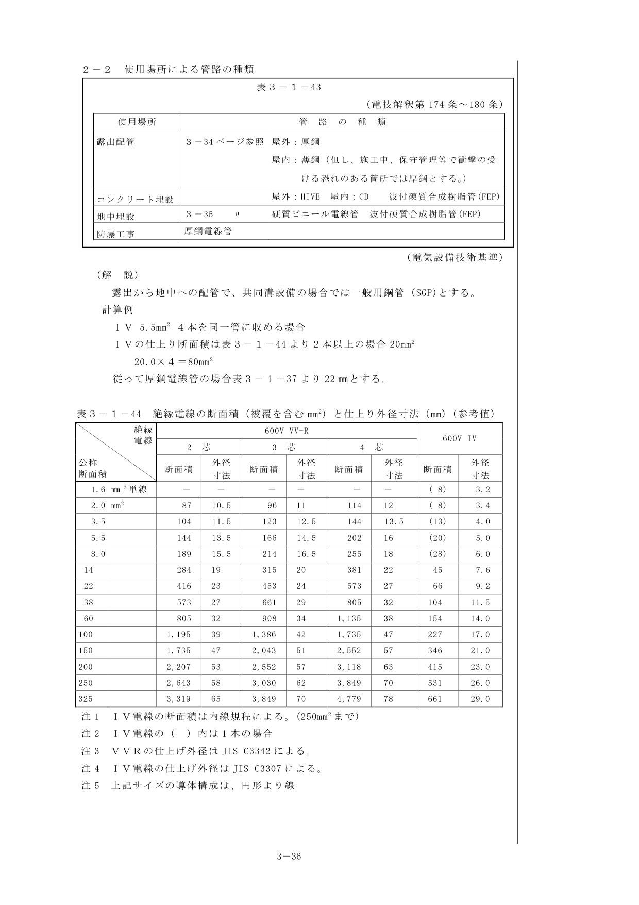

表3-1-44 絶縁電線の断面積（被覆を含むmm²）と仕上り外径寸法（mm）

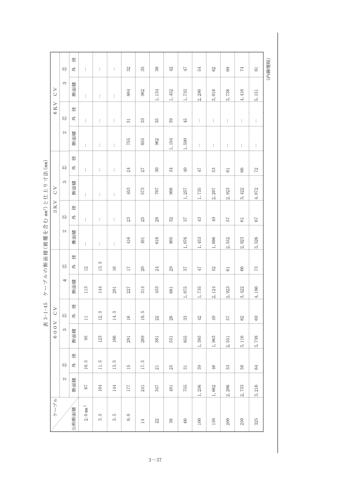

表3-1-45 ケーブルの断面積（被覆を含むmm²）と仕上り寸法（mm）

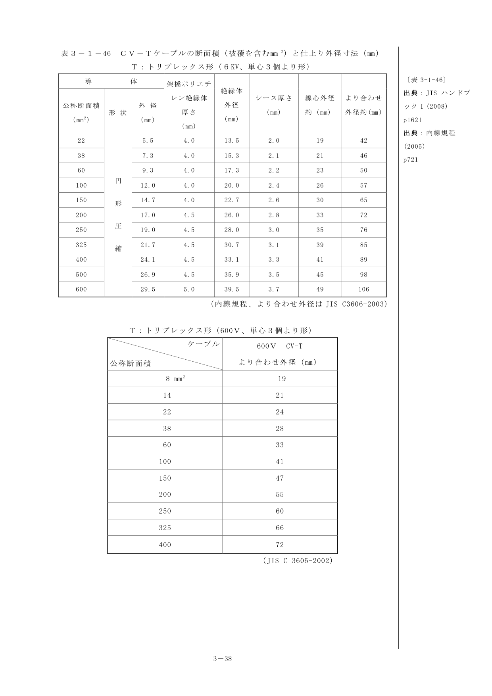

表3-1-46 CV-Tケーブルの断面積（被覆を含むmm²）と仕上り外径寸法（mm）

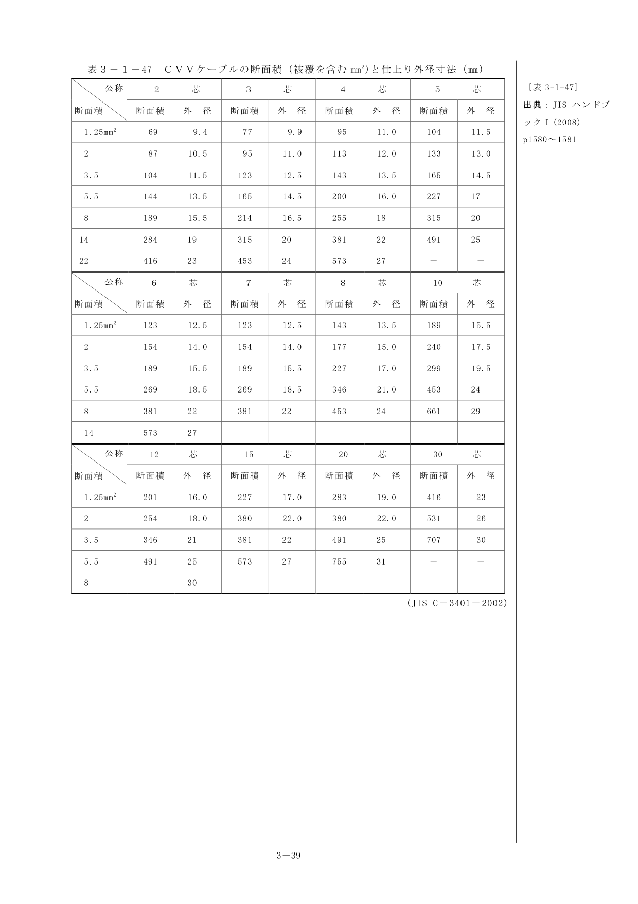

表3-1-47 CVVケーブルの断面積（被覆を含むmm²）と仕上り外径寸法（mm）

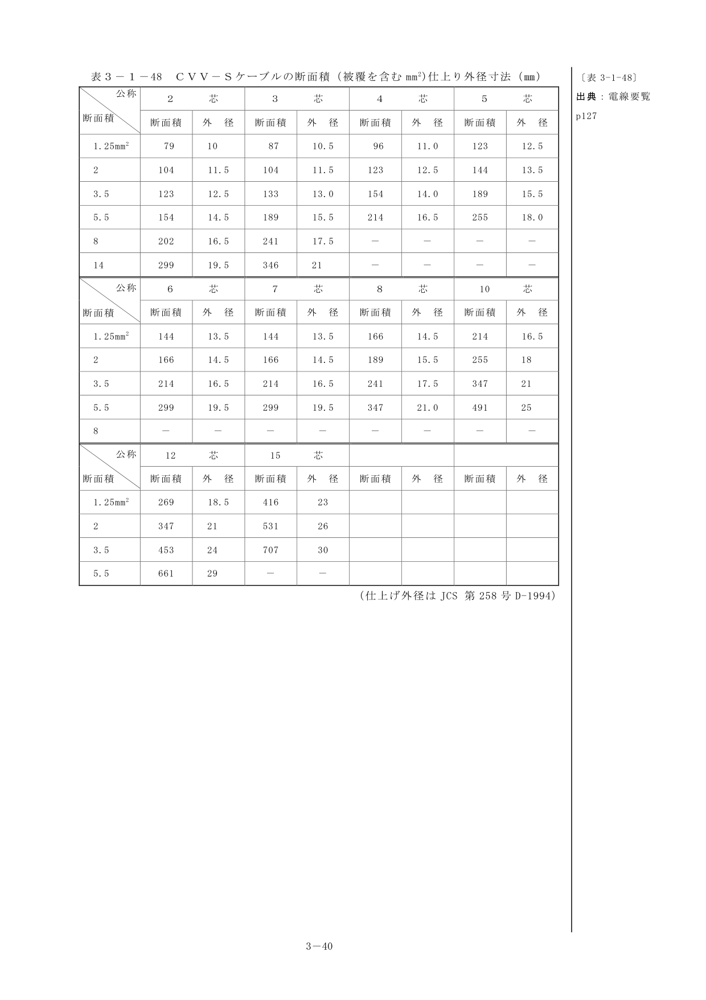

表3-1-48 CVV-Sケーブルの断面積（被覆を含むmm²）と仕上り外径寸法（mm）

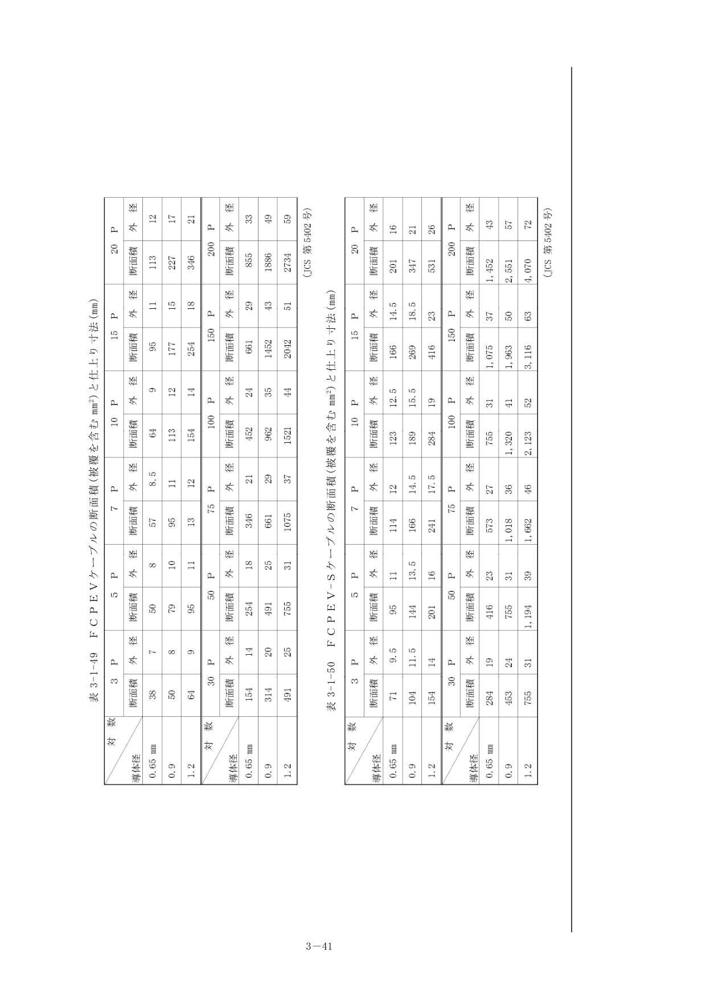

表3-1-49～50 FCPEV / FCPEV-Sケーブルの断面積（被覆を含むmm²）と仕上り寸法（mm）

{/* <!-- 図・表のページ対応表
=== 第3章 配電設備（1/2）===
[図]
e03-fig-01.png: 図3-1-1～3 ケーブル布設条件 (p6-7)
e03-fig-02.png: 図 低圧幹線の過電流遮断器の施設 (p20)
[表]
e03-tbl-01.png: 表3-1-1 架空電線の種類 (p2)
e03-tbl-02.png: 表3-1-2 地中電線の種類 (p2)
e03-tbl-03.png: 表3-1-3 屋内電線の種類 (p2)
e03-tbl-04.png: 表3-1-4 DV電線および屋外用絶縁電線の許容電流 (p3)
e03-tbl-05.png: 表3-1-5 VVケーブル並びにIV電線の許容電流 (p4)
e03-tbl-06.png: 表3-1-6 600V CVケーブルの許容電流値（単心,2心,3心） (p5)
e03-tbl-07.png: 表3-1-7 600V CVケーブルの許容電流値（単心2個より,3個より） (p5)
e03-tbl-08.png: 表3-1-8 高圧CV・CVTケーブルの許容電流 (p6)
e03-tbl-09.png: 表3-1-10 三相誘導電動機の最小電線の太さ（200V-1） (p9)
e03-tbl-10.png: 表3-1-11 三相誘導電動機の最小電線の太さ（200V-2） (p10)
e03-tbl-11.png: 表3-1-12 三相誘導電動機の最小電線の太さ（400V-1） (p11)
e03-tbl-12.png: 表3-1-13 三相誘導電動機の最小電線の太さ（400V-2） (p13)
e03-tbl-13.png: 表3-1-15 電線及び開閉器・過電流遮断器の定格 (p18)
e03-tbl-14.png: 表3-1-16 アーク溶接機の二次側電線の太さ (p19)
e03-tbl-15.png: 表3-1-17 フレームの大きさ及び定格電流 (p20)
e03-tbl-16.png: 表3-1-18～22 配線用遮断器の各種定格 (p21-22)
e03-tbl-17.png: 表3-1-25 漏電遮断器の施設場所 (p23)
e03-tbl-18.png: 表3-1-26 漏電遮断器の適用 (p23)
e03-tbl-19.png: 表3-1-27 漏電遮断器の一般的な施設例 (p24)
e03-tbl-20.png: 表3-1-28 漏電遮断器の感度電流の選定 (p28)
e03-tbl-21.png: 表3-1-29～30 漏電遮断器の定格電流・感度電流 (p29)
e03-tbl-22.png: 表3-1-31 定格静電容量 (p30)
e03-tbl-23.png: 表3-1-33 B種接地工事の接地線の太さ (p31)
e03-tbl-24.png: 表3-1-34 C種及びD種接地工事の接地線の太さ (p32)
e03-tbl-25.png: 表3-1-35 電気設備の接地（1/2） (p33)
e03-tbl-26.png: 表3-1-35 電気設備の接地（2/2） (p34)
e03-tbl-27.png: 表3-1-37～42 各種電線管の内断面積 (p35-36)
e03-tbl-28.png: 表3-1-44 絶縁電線の断面積と仕上り外径寸法 (p37)
e03-tbl-29.png: 表3-1-45 ケーブルの断面積と仕上り寸法 (p38)
e03-tbl-30.png: 表3-1-46 CV-Tケーブルの断面積と仕上り外径寸法 (p39)
e03-tbl-31.png: 表3-1-47 CVVケーブルの断面積と仕上り外径寸法 (p40)
e03-tbl-32.png: 表3-1-48 CVV-Sケーブルの断面積と仕上り外径寸法 (p41)
e03-tbl-33.png: 表3-1-49～50 FCPEV/FCPEV-Sケーブルの断面積と仕上り寸法 (p42)
--> */}
