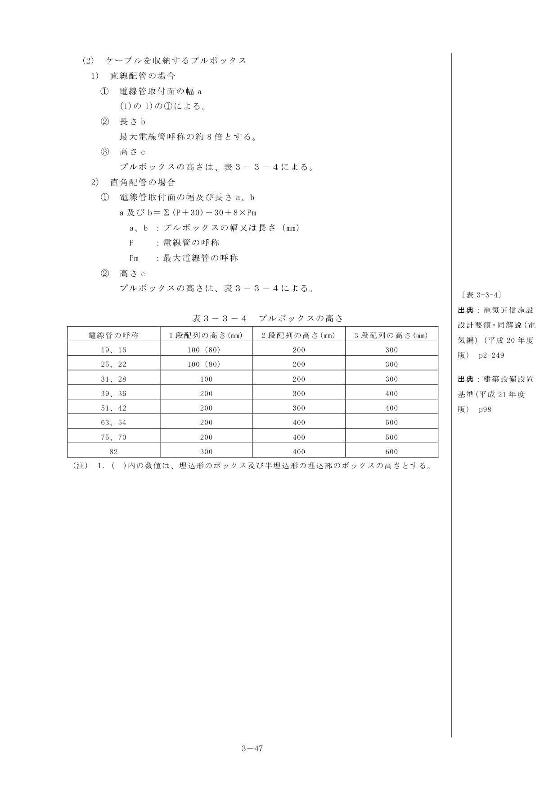
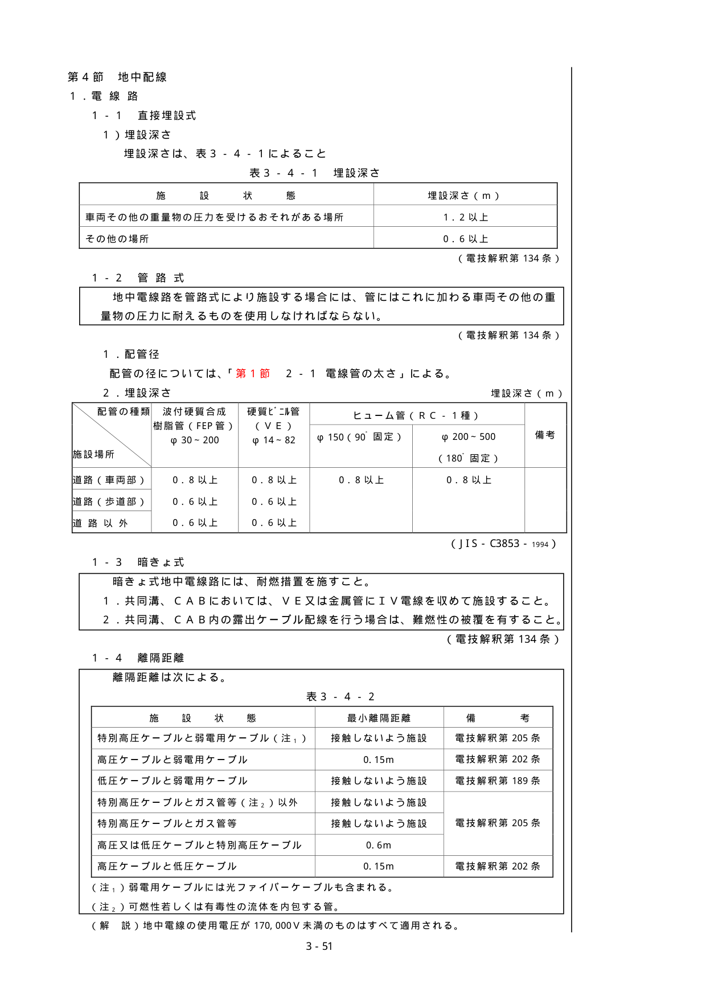
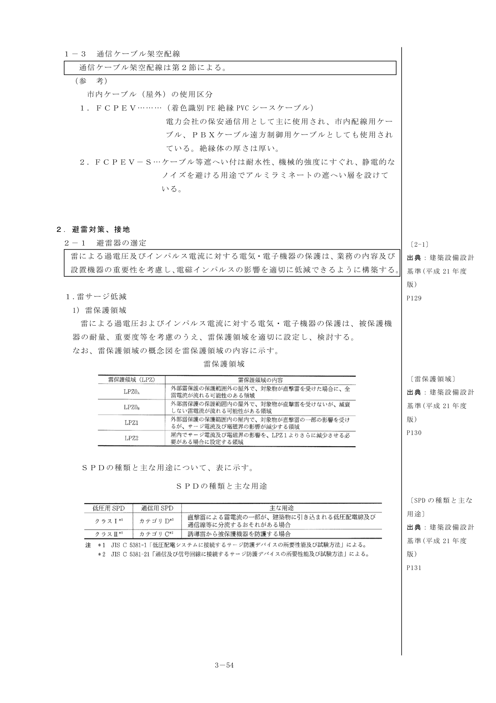
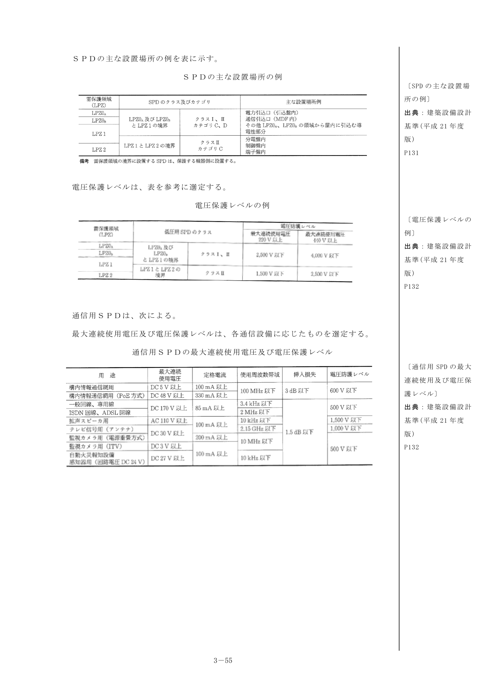

## 第2節 架空配線

### 1. 電線路

#### 1-1 低高圧架空電線の地表上の高さ

低高圧架空電線の地表上の高さは次表による（電技解釈第68条）

表3-2-1 低高圧架空電線の地表上の高さ

| 施設箇所 | 高さ | 備考 |
|---|---|---|
| 道路横断 | 地表上6m以上 | 農道、その他交通のはげしくない道路は除く |
| 鉄道又は軌道横断 | レール面上5.5m以上 | |
| 横断歩道橋（低圧） | 路面上3.0m以上 | |
| 横断歩道橋（高圧） | 路面上3.5m以上 | |
| 上記以外 | 地表上5m以上 | 低圧を道路以外の場所に施設する場合は4m以上 |
| 水面上 | 船舶の航行等に支障のない高さ | |

#### 1-2 離隔距離

離隔距離は次による。

**1. 建造物との離隔距離**

表3-2-2 建造物との最小離隔距離

| 施設場所 | 高圧 | 低圧 | 備考 |
|---|---|---|---|
| 造営物の上部 | 2m（1m） | 2m（1m） | 電技解釈第76条 |
| 造営物の側方、下方 | 1.2m（0.4m） | 1.2m（0.4m） | 電技解釈第76条 |
| 高圧、低圧架空線の接近 | 0.8m（0.4m） | 0.8m（0.4m） | 電技解釈第82～83条 |
| アンテナ | 0.8m（0.4m） | 0.6m（0.3m） | 電技解釈第79条 |
| 植物 | 接触しないよう | 接触しないよう | 電技解釈第86条 |

（ ）内はケーブルを使用する場合

**2. 架空電線と他の架空電線との離隔距離**

表3-2-3 架空電線と他の架空電線との最小離隔距離

| 施設状態 | 最小離隔距離 | 備考 |
|---|---|---|
| 高低圧電線の併架 | 0.5m | 電技解釈第72条 |
| 低圧相互（接近又は交さ） | 0.6m（0.3m） | 電技解釈第81条 |
| 高圧と低圧（接近又は交さ） | 0.8m（0.4m） | 電技解釈第82条 |
| 高圧相互（接近又は交さ） | 0.8m（0.4m） | 電技解釈第83条 |

特別高圧架空電線との接近・交さについては解釈127条参照のこと。（ ）内はいずれか一方がケーブルを使用する場合

**3. 弱電流電線等との離隔距離**

表3-2-4 弱電流電線等との最小離隔距離

| | 高圧 | 低圧 | 備考 |
|---|---|---|---|
| 弱電流電線路と併行 | 2m | 2m | 電技解釈第64条 |
| 弱電流電線等の接近 | 0.8m（0.4m） | 0.6m（0.3m） | 電技解釈第78条 |

> **（解 説）**
>
> 架空弱電流電線等とは、架空弱電流電線又は光ファイバーケーブルをいう。（ ）内はケーブルを使用する場合

### 2. 支持物

#### 2-1 支持物の種類

架空電線路の支持物には、鉄柱、鉄筋コンクリート柱または鉄塔を使用しなければならない。

#### 2-2 支持物の基礎

電線路の支持物の基礎は、次のいずれかにより施設しなければならない。（電技解釈第58条）

1. 支持物が耐えるべきものとされた荷重が加わる場合における基礎の安全率が2以上となるように施設すること。ただし、異常時想定荷重に対する鉄塔の基礎強度の安全率は、1.33以上とすることができる。
2. 鋼板組立柱、鋼管柱もしくは鉄筋コンクリート柱であってその全長が16m以下であり、かつ、設計荷重が6.87kN以下のもの、または木柱を次により施設すること。
    - a 全長が15m以下の場合は根入れを全長の1/6以上とすること。
    - b 全長が15mをこえる場合は、根入れを2.5m以上とすること。
    - c 水田、その他地盤が軟弱な箇所では、特に堅ろうに根かせを施すこと。
3. 鉄筋コンクリート柱であって、その全長が14m以上20m以下であり、且つ、設計荷重が6.87kNを超え、9.81kN以下のものを水田その他地盤が軟弱な箇所以外の箇所に、根入れを上記の最低根入れに30cmを加えた値とすること。

### 3. 支線

#### 3-1 支線の適用

架空電線路の支持物に施設する支線は次の各号によること。（電技解釈63条）

1. 支線の安全率は、2.5以上であること。許容引張荷重の最低は、4.31kNとする。
2. 支線をより線とした場合は次によること。
    - イ 素線3条以上をより合わせたものであること。
    - ロ 素線に直径が2mm以上及び引張強さ0.69kN/mm²以上の金属線を用いること。

支線の根かせは、支線の引張荷重に十分耐えるように施設すること。

## 第3節 露出配線

### 1. 露出配管

**1. 配管の支持**

表3-3-1 電線管の支持間隔

| 種別 | 標準支持点間距離 | 摘要 |
|---|---|---|
| 金属管 | 2m以下 | 管端、管相互の接続点及び管とボックスとの接続点では接続点に近い箇所に固定すること |
| 合成樹脂管 | 1.5m以下 | |
| 造営材の側面又は下面において水平方向 | 1m以下 | 人が触れる恐れのあるところ：1m以下 |
| 金属製可とう電線管（接続箇所） | 接続箇所から0.3m以下 | |
| 金属製可とう電線管（その他） | 2m以下 | |

**2. 配管の種類と用途**

表3-3-2 配管の種類と用途

| 種別 | 使用場所 |
|---|---|
| 金属管 | 屋外：厚鋼 / 屋内：薄鋼。但し、衝撃を受ける恐れのある箇所では厚鋼。引込部で露出配管が地中配線で連続する場合は、ケーブル保護用合成樹脂被服鋼管とする。 |
| 合成樹脂管 | 金属管を使用するのに不適当な箇所（例：水気の多いところ、避雷器用接地線の保護用） |
| 可とう電線管 | 伸縮部分、接続するボックス、機器などが多少動いたり振動したりするところ |

**3. 垂直配管内の電線**

垂直に配管した金属管内の電線は表3-3-3の間隔以下ごとにこれを適当な方法により支持しなければならない。

表3-3-3 電線の太さと支持点間の間隔

| 電線の太さ（mm²） | 支持点間の間隔（m） |
|---|---|
| 38以下 | 30以下 |
| 100以下 | 25以下 |
| 150以下 | 20以下 |
| 250以下 | 15以下 |
| 250以上 | 12以下 |

**4. プルボックス**

湿気の多い場所、または屋外に使用するプルボックスは、耐食性のある材質を使用するものとする。

> **（解 説）**
>
> 1. 耐食性のある材質としては、例えば亜鉛メッキ加工、硬質ビニール製等がある。
> 2. 設置の目的：(a)曲線が多い場合（3箇所を超える直角又はこれに近い屈曲を設けないこと）、(b)配管こう長が30mを超える場合、(c)垂直配管を中間で支持する場合、(d)電線の接続、分岐接続を行なう場合など。

> **（参 考）**
>
> **プルボックスの寸法の算定**
>
> (1) 電線を収納するプルボックス
>
> 1）直線配管の場合：幅 a = Σ(P＋30)＋(30×2)、長さ b = 最大電線管呼称の6倍以上
>
> 2）直角配管の場合：a 及び b = Σ(P＋30)＋30＋3×Pm（ただし、a 及び b ≧ 200）
>
> (2) ケーブルを収納するプルボックス
>
> 1）直線配管の場合：長さ b = 最大電線管呼称の約8倍
>
> 2）直角配管の場合：a 及び b = Σ(P＋30)＋30＋8×Pm

表3-3-4 プルボックスの高さ

### 2. ケーブルラック配線

ケーブルラックとケーブルラック配線は次による。

**1. ケーブルラックの支持点間の距離**

表3-3-5 ケーブルラックの支持点間の距離

| 施設の区分 | 標準支持点間距離 | 摘要 |
|---|---|---|
| 水平部（鉄製） | 2m | |
| 水平部（アルミ製） | 1.5m | |
| 垂直部 | 3m | |
| 垂直部（配線室内等） | 6m | 直線部と直線以外との接続点に近い箇所で支持する |

**2. ケーブルラック上の配線**

表3-3-6 ケーブルの支持間隔

| 施設の区分 | 標準支持点間距離 |
|---|---|
| 水平部 | 3.0m |
| 垂直部 | 1.5m |

- ケーブルの配列をよく考え、途中の分岐点などでケーブルが交差しないように布設する。
- 電力ケーブルは原則として積み重ねを行わないこと。

**3. ケーブルラック上のケーブル相互の離隔距離**

表3-3-7 ケーブル相互の最小離隔距離

| 施設状態 | 最小離隔距離 | 備考 |
|---|---|---|
| 高圧ケーブル相互 / 高圧と低圧ケーブル / 高圧と弱電用ケーブル | ※ 0.15m | 電技解釈第202条 |
| 低圧ケーブルと弱電流ケーブル | 接触しない様に布設 | 電技解釈第189条 |
| （がいし引き工事の時） | ※ 0.1m | 電技解釈第189条 |

※間に耐火製の隔壁、または耐火性の管に収めて施設する場合は除く。

**4. ケーブルラックの接地工事**

表3-3-8 ケーブルラックの接地工事

| 使用電圧 | 種類 | 備考 |
|---|---|---|
| 高圧 | A種 | 電技解釈第29条 |
| 低圧 300V超過 | C種 | |
| 低圧 300V以下 | D種 | |

> **（参 考）**
>
> **算出方法**
>
> 使用回路別に区分されたケーブルの本数から必要ラック幅を算出し、使用する標準ラック幅で除することによって段数を決定する。
>
> $Wr = \sum_{i=1}^{n} N_i \cdot D_i / a$
>
> $X \geq 1.2 \times Wr / Ws$
>
> ここに、Wr：必要ラック幅（mm）、X：ラック段数（段）、Di：各ケーブル外径（mm）、Ni：Diのケーブル本数、a：ケーブルの段積数、Ws：標準ラック幅（mm）、1.2：裕度

### 3. ピット内配線

ピット内配線は次による。

1. ピットの大きさは、電線の被覆を含む断面積の総和がピットの内断面積の20%以下となるように選定しなければならない。
2. 高圧ケーブルと低圧ケーブルを同じピットに収める場合セパレータにより隔離すること。
3. ケーブルが直接ピットの底につかないようにすること。

### 4. ケーブル配線

ケーブル配線は次による。

**1. ケーブルの屈曲**

原則としてケーブル仕上り外径の5倍以上とする。

**2. ケーブルの支持**

表3-3-9 ケーブルの支持点間の距離

| 施設の区分 | 標準支持点間の距離（m） | 備考 |
|---|---|---|
| 造営材の側面又は下面において水平方向に施設するもの | 2 | ケーブル相互、ケーブルとボックス器具などの接続点に近い場所で支持する |
| 垂直に施設するもの | 6 | |

（電技解釈第187条）

### 5. 金属ダクト・トラフ

金属ダクト・トラフの占積率は、下記による。

1. 電力ケーブルは、20%以下
2. 制御、計装ケーブルは、50%以下

（電技解釈第181条）

## 第4節 地中配線

### 1. 電線路

#### 1-1 直接埋設式

表3-4-1 埋設深さ

| 施設状態 | 埋設深さ（m） |
|---|---|
| 車両その他の重量物の圧力を受けるおそれがある場所 | 1.2以上 |
| その他の場所 | 0.6以上 |

（電技解釈第134条）

#### 1-2 管路式

地中電線路を管路式により施設する場合には、管にはこれに加わる車両その他の重量物の圧力に耐えるものを使用しなければならない。（電技解釈第134条）

**1. 配管径**

配管の径については、「第1節 2-1 電線管の太さ」による。

**2. 埋設深さ**

管路式の埋設深さ

#### 1-3 暗きょ式

暗きょ式地中電線路には、耐燃措置を施すこと。

1. 共同溝、CABにおいては、VE又は金属管にIV電線を収めて施設すること。
2. 共同溝、CAB内の露出ケーブル配線を行う場合は、難燃性の被覆を有すること。

（電技解釈第134条）

#### 1-4 離隔距離

表3-4-2 地中配線の離隔距離

| 施設状態 | 最小離隔距離 | 備考 |
|---|---|---|
| 特別高圧ケーブルと弱電用ケーブル | 接触しないよう施設 | 電技解釈第205条 |
| 高圧ケーブルと弱電用ケーブル | 0.15m | 電技解釈第202条 |
| 低圧ケーブルと弱電用ケーブル | 接触しないよう施設 | 電技解釈第189条 |
| 特別高圧ケーブルとガス管等以外 | 接触しないよう施設 | |
| 特別高圧ケーブルとガス管等 | 接触しないよう施設 | |
| 高圧又は低圧ケーブルと特別高圧ケーブル | 0.6m | 電技解釈第205条 |
| 高圧ケーブルと低圧ケーブル | 0.15m | 電技解釈第202条 |

> **（解 説）**
>
> 地中電線の使用電圧が170,000V未満のものはすべて適用される。

### 2. 配管

#### 2-1 配管の種類

配管は標準として硬質ビニル電線管（VE）、波付硬質合成樹脂管（FEP）等とする。ただし、車道横断にあってはヒューム管又は波付硬質合成樹脂管（FEP）を用いるものとする。また、引込露出配管から地中ハンドホールへのケーブル配線の配管はケーブル保護用として合成樹脂被覆鋼管を使用するものとする。

> **（参 考）**
>
> ヒューム管の最小太さは150mmとする。ただし、断面積計算で、必要によりそれ以上の太さとすることができる。

#### 2-2 ハンドホール又はマンホールの施設

ハンドホール又はマンホールの施設は、次の箇所に施設するものとする。

1. ケーブルの引入れ、引抜きなどの作業を必要とする箇所
2. ケーブルの分岐、接続などを行う箇所
3. ケーブルの引入れ時に張力がケーブルの許容張力を超過する箇所
4. 管路のこう配が大きく、ケーブルのずり落ち防止を必要とする箇所

> **（参 考）**
>
> 1. 次の場合には、ケーブルの引入れ時に張力がケーブルの許容張力を超過しないものと考えることができる。
>    - 1）直線管路の長さが、150m以下の場合
>    - 2）直角曲がり1カ所をもつ管路の長さが100m以下の場合
>
> 2. ハンドホールの大きさは、ケーブルの引入れ、引抜き、接続、分岐などの工事、点検その他の保守作業が容易にできること。

表3-4-3 ケーブルの許容曲げ半径

| ケーブルの種類 | 単心 | 多心 |
|---|---|---|
| 低圧 | 8D | 6D |
| 高圧 | 10D | 8D |

Dは、ケーブルの仕上り外径を示す。なお、トリプレックスケーブルなどの単心より形ケーブルは、多心とする。

**3. ハンドホール又はマンホールの蓋の耐荷重**

| 記号 | 通常の呼び方 | 通過車両の許容範囲 |
|---|---|---|
| T-25 | 公道用 | 大型トレーラ、13トン貨物 |
| T-20 | 公道用 | 大型トレーラ、11トン貨物 |
| T-14 | 重耐重 | 大型バス、5トン貨物 |
| T-4 | 中耐重 | 2トン貨物、大型乗用車 |
| T-1 | 軽耐重 | 小型乗用車 |

#### 2-3 埋設標識シート

道路等の地中埋設管路には、埋設幅に応じた埋設標識シートを敷設すること。埋設標識シートの埋設管路の1/2hの深さに設置する。舗装等により1/2h位置に敷設できない場合は、路盤の直下とする。

## 第5節 通信配線

### 1. 配線設計

#### 1-1 配線設計

配線設計は第1節～第4節による。「光ファイバーケーブルは、第9章による。」

#### 1-2 管内通線

管の太さは、ケーブルの引入れ及び引抜きが円滑に行える寸法のものを選定すること。

(1) 管内に布設するケーブルが1条の場合の管の内径は、ケーブル仕上り外径の1.5倍以上を標準とする。

(2) 管内に布設するケーブルが2条以上の場合の管の内径は、ケーブルを集合した場合の外径円の直径の1.5倍以上を標準とする。

> **（解 説）**
>
> - JIS C 3653-2004の電力ケーブルの地中埋設の施工方法に準拠する。
> - 1本の管に3条のケーブルを布設する場合、管内径とケーブル外径の比が「ジャムレシオ」すなわちD/dが2.85～3.15の範囲に入る状態になると張力が増大し、ケーブルの配列が一直線となり引入れ不能となることがある。
> - ハンドホールの設置は施設構内については50m間隔、道路上については250m間隔とする。

#### 1-3 通信ケーブル架空配線

通信ケーブル架空配線は第2節による。

> **（参 考）**
>
> **市内ケーブル（屋外）の使用区分**
>
> 1. FCPEV：着色識別PE絶縁PVCシースケーブル。電力会社の保安通信用として主に使用され、市内配線用ケーブル、PBXケーブル遠方制御用ケーブルとしても使用されている。絶縁体の厚さは厚い。
> 2. FCPEV-S：ケーブル等遮へい付は耐水性、機械的強度にすぐれ、静電的なノイズを避ける用途でアルミラミネートの遮へい層を設けている。

### 2. 避雷対策、接地

#### 2-1 避雷器の選定

雷による過電圧及びインパルス電流に対する電気・電子機器の保護は、業務の内容及び設置機器の重要性を考慮し、電磁インパルスの影響を適切に低減できるように構築する。

**1. 雷サージ低減**

雷による過電圧およびインパルス電流に対する電気・電子機器の保護は、被保護機器の耐量、重要度等を考慮のうえ、雷保護領域を適切に設定し、検討する。

雷保護領域の概念図 / SPDの種類と主な用途

SPDの主な設置場所の例 / 電圧保護レベルの例

通信用SPDの最大連続使用電圧及び電圧保護レベル

#### 2-2 接地の方法

接地の方法は第1節 1-8 接地による。

> **（参 考）**
>
> 1）接地極は、原則として共用することを考慮し、建築構造体を利用する。
> 2）接地抵抗は第1節 1-8「接地」によるほか下記による。

表3-5-1 接地抵抗

| 接地工事の種類 | 記号 | 接地抵抗 |
|---|---|---|
| A種接地工事 | EA | 10Ω以下 |
| B種接地工事 | EB | 150/I Ω以下 ※1 |
| C種接地工事 | Ec | 10Ω以下 |
| D種接地工事 | ED | 100Ω以下 |
| 漏電遮断器回路 | EELCB | 500Ω以下 ※2 |
| 高圧避雷器（A種接地工事） | ELH | 10Ω以下 |
| 陽極 | Et | 10Ω以下 |
| 構内交換機・本配線盤の保安装置 | EAt | 10Ω以下 |
| 電話引込口の保安器・アンテナ保安器 | ELt | 100Ω以下 |
| 拡声用増幅器 | EDt | 100Ω以下 |
| 測定用補助接地極 | E0 | - |

注 ※1 電気事業者に確認する。
※2 高感度高速形（定格感度電流30mA以下、漏電引き外し動作時間0.1秒以内）の場合を示す。

{/* <!-- 図・表のページ対応表
=== 第3章 配電設備（2/2）===
[図]
e03-fig-03.png: 雷保護領域の概念図・SPDの種類と主な用途 (p55)
e03-fig-04.png: SPDの主な設置場所の例・電圧保護レベルの例 (p56)
e03-fig-05.png: 通信用SPDの最大連続使用電圧及び電圧保護レベル (p56)
[表]
e03-tbl-34.png: 表3-3-4 プルボックスの高さ (p48)
e03-tbl-35.png: 管路式の埋設深さ (p52)
--> */}
