## 第1節 総則

### 1. 適用範囲（標準）

> **〔解 説〕**
>
> 換気設備および非常用施設に適用する。
>
> 関連諸法規等は以下のとおりである。

| 示方書・指針等 | 発刊年月 | 発刊者 |
|---|---|---|
| 道路トンネル技術基準（換気編）・同解説 | 平成20年10月 | (社)日本道路協会 |
| 道路の交通容量 | 昭和59年9月 | 〃 |
| 道路構造令の解説と運用 | 昭和58年2月 | 〃 |
| 道路トンネル非常用施設設置基準・同解説 | 平成13年10月 | 〃 |
| 道路機械設備遠方操作監視技術マニュアル(案) | 平成16年6月 | (社)日本建設機械化協会 |

### 2. 計画（標準）

> **〔解 説〕**
>
> 道路トンネルの換気計画は、トンネル建設の全体計画の一環として綿密に行わなければならない。
>
> 計画及び設計にあたっては、下記の事項を考慮し、各段階を進めていくものとする。

#### 2-1 景観設計

地域特性を調査・検討し、景観に十分配慮した設計を行っていくものとする。

#### 2-2 コスト・メンテナンス性

1. 新技術などの導入を検討し、総合的なコスト縮減を考慮する。
2. 各機器の設計においては、それぞれのライフサイクルを考慮すること。
3. メンテナンス性の向上・維持管理費の縮減を考慮すること。

#### 2-3 換気計画

1. 換気計画は、交通方式、防災計画（非常用施設）との関連、周辺環境等に与える影響など、より広い立場からの検討が必要であり、トンネル全体として合理的なものでなければならない。
2. 交通の推移によって段階建設される場合は、対面交通から一方向交通への変更を考慮した最終段階での計画と整合されたものとする。この際、一方向交通トンネルの利点を十分に考慮するものとする。
3. 換気設備の更新に当たっては、更新時期以降の交通状況の変化を調査・予測し、換気計画を見直すものとする。

**(4) 計画の手順**

換気設備の計画、設計および施工は次の項目、順序によって行う。

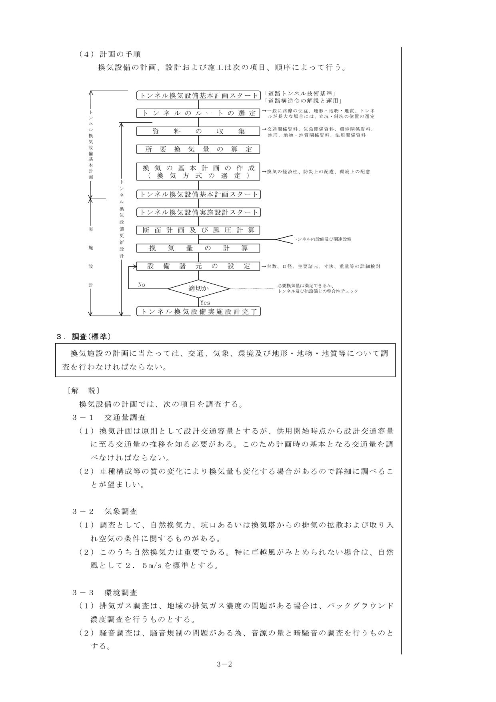

換気設備の計画・設計フロー

### 3. 調査（標準）

> **〔解 説〕**
>
> 換気施設の計画に当たっては、交通、気象、環境及び地形・地物・地質等について調査を行わなければならない。
>
> 換気設備の計画では、次の項目を調査する。

#### 3-1 交通量調査

1. 換気計画は原則として設計交通容量とするが、供用開始時点から設計交通容量に至る交通量の推移を知る必要がある。このため計画時の基本となる交通量を調べなければならない。
2. 車種構成等の質の変化により換気量も変化する場合があるので詳細に調べることが望ましい。

#### 3-2 気象調査

1. 調査として、自然換気力、坑口あるいは換気塔からの排気の拡散および取り入れ空気の条件に関するものがある。
2. このうち自然換気力は重要である。特に卓越風がみとめられない場合は、自然風として2.5m/s を標準とする。

#### 3-3 環境調査

1. 排気ガス調査は、地域の排気ガス濃度の問題がある場合は、バックグラウンド濃度調査を行うものとする。
2. 騒音調査は、騒音規制の問題がある為、音源の量と暗騒音の調査を行うものとする。

#### 3-4 地形・地物・地質調査

地形・地質調査は、換気用立坑、斜坑の配置計画の基礎資料とする。坑口付近の環境調査では、地形の他構造物の影響も検討する場合がある。

## 第2節 トンネル内設備および関連設備

### 1. トンネル内設備（参考）

トンネル内には、次の諸設備が取付られている。

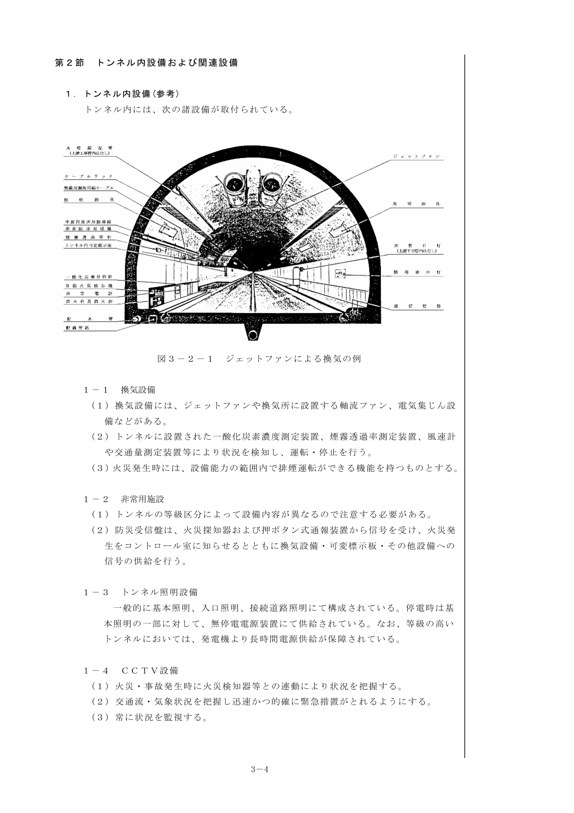

図3-2-1 ジェットファンによる換気の例

#### 1-1 換気設備

1. 換気設備には、ジェットファンや換気所に設置する軸流ファン、電気集じん設備などがある。
2. トンネルに設置された一酸化炭素濃度測定装置、煙霧透過率測定装置、風速計や交通量測定装置等により状況を検知し、運転・停止を行う。
3. 火災発生時には、設備能力の範囲内で排煙運転ができる機能を持つものとする。

#### 1-2 非常用施設

1. トンネルの等級区分によって設備内容が異なるので注意する必要がある。
2. 防災受信盤は、火災探知器および押ボタン式通報装置から信号を受け、火災発生をコントロール室に知らせるとともに換気設備・可変標示板・その他設備への信号の供給を行う。

#### 1-3 トンネル照明設備

一般的に基本照明、入口照明、接続道路照明にて構成されている。停電時は基本照明の一部に対して、無停電電源装置にて供給されている。なお、等級の高いトンネルにおいては、発電機より長時間電源供給が保障されている。

#### 1-4 CCTV設備

1. 火災・事故発生時に火災検知器等との連動により状況を把握する。
2. 交通流・気象状況を把握し迅速かつ的確に緊急措置がとれるようにする。
3. 常に状況を監視する。

#### 1-5 無線通信補助設備

1. 維持管理車輌とコントロール室との情報交換、災害・交通事故等緊急時の指示連絡がどこからでも安定して確保できるようにする。
2. トンネル等級により考慮する。

### 2. 関連設備（標準）

#### 2-1 可変標示板設備

1. 的確な道路情報を随時ドライバーに提供し、火災・事故発生時には後続車や対向車に警報を発して、人や車を安全に避難誘導するものである。
2. この他、速度を規制する可変式速度規制標識がある。

#### 2-2 道路通信設備

1. 道路の安全かつ円滑な交通量を確保するための電送交換手段として、増大する通信需要に対応することを目的とした通信システムである。
2. 光ファイバーによる大容量電送、インターフェイス機能および柔軟なシステム構成が利用されている。

#### 2-3 通信線路設備

信号・情報の伝達のために光信号による光ファイバーケーブルや電気信号によるメタリックケーブルを使用している。

#### 2-4 受配電・自家用発電設備

各設備に安定した電源を供給する設備で、容量は、設備全体の負荷容量に変動率を考慮して決定するものとする。

#### 2-5 遠方監視制御設備

コントロール室の電力卓および交通卓等により監視・操作・測定を安全かつ円滑に集中管理するものである。

#### 2-6 気象観測設備

全線の気象状況を一括把握すると共にCRT表示データ処理装置を設置して道路気象管理に役立てる。

#### 2-7 消火設備

自動車火災を迅速有効に消火し、または火災の拡大を防ぐために設ける。

## 第3節 換気方式

### 1. 換気施設の必要性の検討（標準）

> **〔解 説〕**
>
> 換気施設の必要性は、トンネルの延長、勾配、交通条件、気象条件等を考慮して検討するものとする。

#### 1-1 自然換気の限界

1. 自然換気の限界は、トンネル幾何条件、交通条件（交通方向、交通量、車種構成、走行速度）および気象条件によって異なる。
2. 特に気象条件は、トンネル個所毎に異なり、時間的、季節的にも変化が著しい。

**(3) 対面交通の場合**

1. 交通風は、上り下り別の交通量の変動により時々刻々変化するため、自然換気の効果を定量的に決めることは難しい。
2. 主なトンネルの延長と交通量との関係と機械換気施設の有無の別を図3-3-1(a)に示す。
3. 機械換気を行っているトンネルは次式で示される程度以上である。

$$L \cdot N = 1000 \quad \cdots\text{(3-1-1)}$$

ここに、$L$：トンネル延長(km)、$N$：時間交通量(台/h)

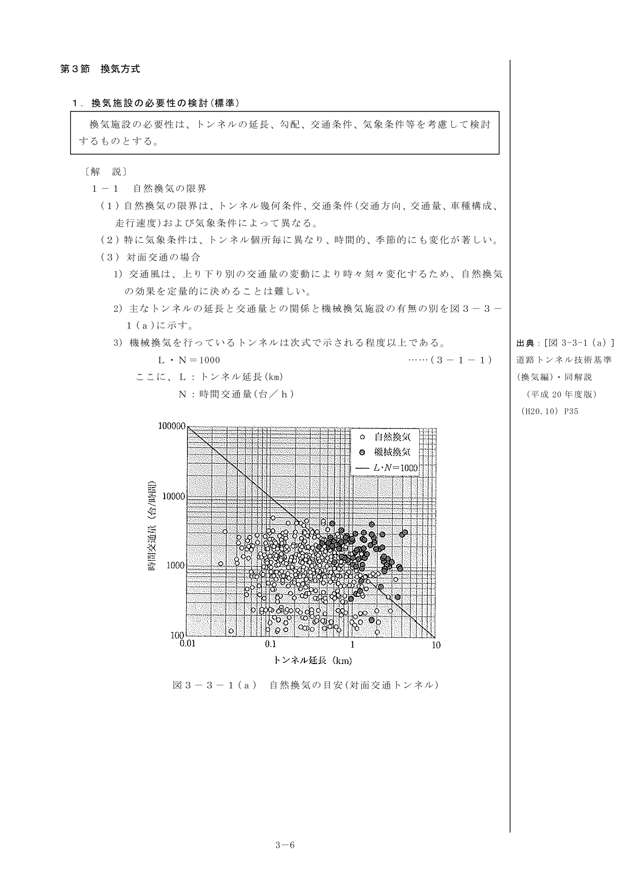

図3-3-1(a) 自然換気の目安（対面交通トンネル）

**(4) 一方向交通の場合**

1. 主なトンネルの延長と交通量との関係と機械換気施設の有無の別を図3-3-1(b)に示す。
2. 機械換気を行っているトンネルは次式で示される程度以上である。

$$L \cdot N = 3{,}000 \quad \cdots\text{(3-1-2)}$$

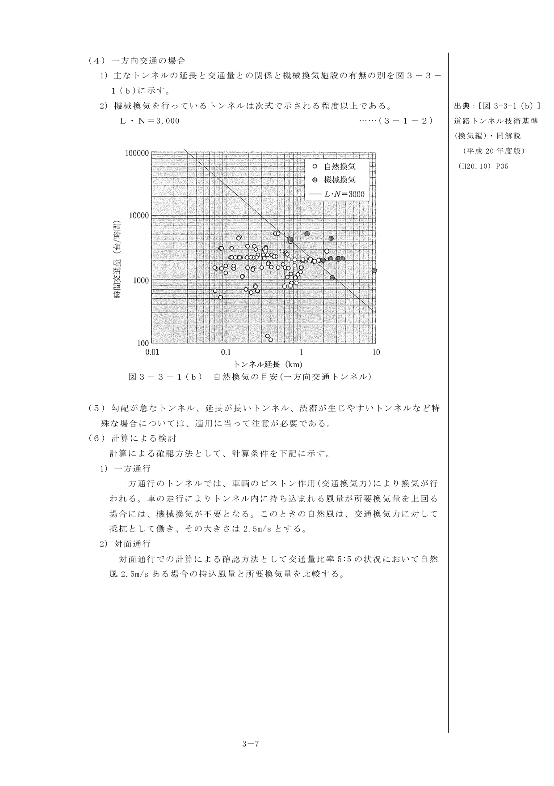

図3-3-1(b) 自然換気の目安（一方向交通トンネル）

**(5)** 勾配が急なトンネル、延長が長いトンネル、渋滞が生じやすいトンネルなど特殊な場合については、適用に当って注意が必要である。

**(6) 計算による検討**

計算による確認方法として、計算条件を下記に示す。

1. **一方通行** — 一方通行のトンネルでは、車輌のピストン作用（交通換気力）により換気が行われる。車の走行によりトンネル内に持ち込まれる風量が所要換気量を上回る場合には、機械換気が不要となる。このときの自然風は、交通換気力に対して抵抗として働き、その大きさは2.5m/s とする。
2. **対面通行** — 対面通行での計算による確認方法として交通量比率5:5 の状況において自然風2.5m/s ある場合の持込風量と所要換気量を比較する。

### 2. 換気方式の選定（標準）

> **〔解 説〕**
>
> 換気方式は、その特徴を十分生かし、トンネルの延長、地形・地物・地質、交通条件、気象条件、環境条件等に応じ、有効かつ経済的な方式を選定するものとする。

#### 2-1 機械換気方式の種類

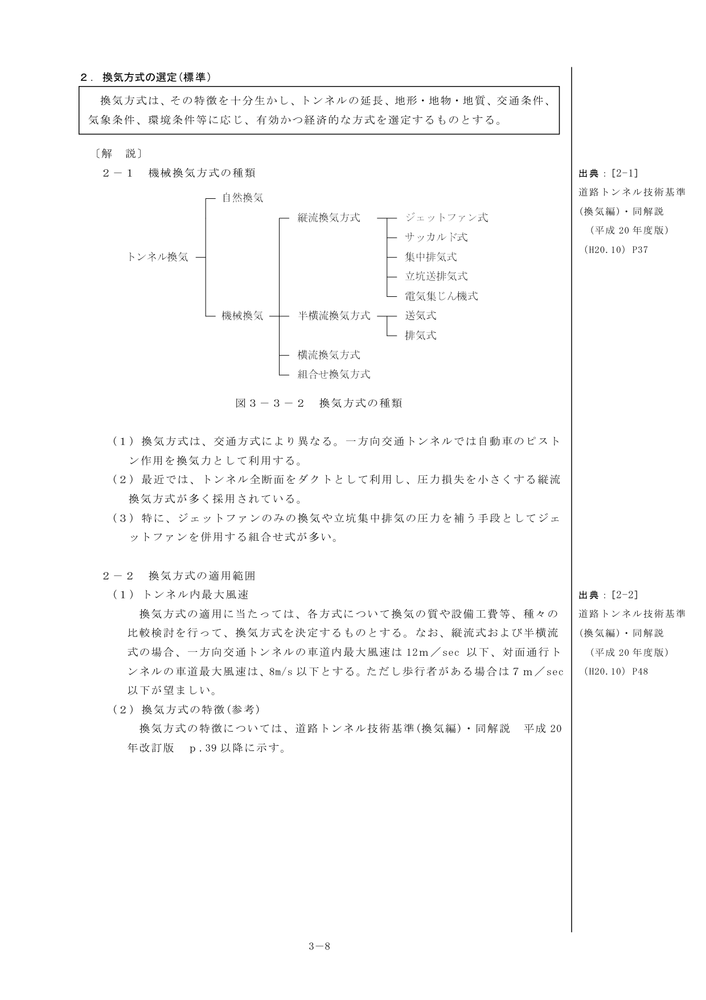

図3-3-2 換気方式の種類

1. 換気方式は、交通方式により異なる。一方向交通トンネルでは自動車のピストン作用を換気力として利用する。
2. 最近では、トンネル全断面をダクトとして利用し、圧力損失を小さくする縦流換気方式が多く採用されている。
3. 特に、ジェットファンのみの換気や立坑集中排気の圧力を補う手段としてジェットファンを併用する組合せ式が多い。

#### 2-2 換気方式の適用範囲

**(1) トンネル内最大風速**

換気方式の適用に当たっては、各方式について換気の質や設備工費等、種々の比較検討を行って、換気方式を決定するものとする。なお、縦流式および半横流式の場合、一方向交通トンネルの車道内最大風速は12m/sec 以下、対面通行トンネルの車道最大風速は、8m/s 以下とする。ただし歩行者がある場合は7m/sec 以下が望ましい。

**(2) 換気方式の特徴（参考）**

換気方式の特徴については、道路トンネル技術基準（換気編）・同解説 平成20年改訂版 p.39 以降に示す。

### 3. 換気計画上の注意事項（標準）

> **〔解 説〕**
>
> 換気計画は、火災時の運用、渋滞時の運用、段階建設、維持管理および環境上のことを十分考慮しなければならない。

#### 3-1 火災時の運用（参考）

1. 火災発生時には人命の確保を主目的とする。
   - 防災受信盤からの火災信号で換気機を停止または火災モードとし、避難行動が容易になるよう煙を坑内上方にとどめ、横断面内での擾乱を防ぎ、縦断面への拡散を抑制する。
   - 避難完了後の消火活動のために、消防責任者の指示により排煙を目的とした運転を行う。
2. 火災時の煙の動き及び拡散状態は、換気方式、送気方向、換気区分、交通形態、トンネル内自然風、車両換気風によって大きく異なる。したがって換気機の運転方法は、トンネルの諸条件をよく検討して決定しなければならない。

#### 3-2 渋滞時の運用

1. 渋滞には、自然渋滞と事故渋滞とがある。自然渋滞の場合は煤煙よりCOが検討の対象となることが多い。
2. 換気施設の設計・運用には、渋滞時に必要な換気量を検討しなければならない。

#### 3-3 段階建設

トンネルの換気の設計に際し、常に段階建設について考慮しなくてはならない。ここでいう段階建設とは、次の場合に大別できる。

1. トンネル本体の増設（対面交通から一方向交通へ）に伴なう換気上の段階建設。
2. 交通量の伸びによる換気量増加のための換気上の段階建設。
3. 両者併用の段階建設。

#### 3-4 維持管理

1. トンネルの機械設備は、保守点検作業の簡易化、点検間隔の長期化などを目指し、維持管理費の縮減をはかる。
2. 遠隔監視装置を拡充し、広域的なトンネル機械設備の監視体制を作ることで、保守工数を縮減し広くは道路網の計画的・経済的な保守管理に資するものとする。
3. 大型送・排風機を用いる換気設備では、本体と駆動用主電動機をはじめとする各部の温度管理（各種軸受け温度、潤滑油温度）、振動値管理などをきめ細かく行うことで機器の状態を継続的に監視することで予防保全をはかる。
4. ジェットファン設備は、設置される坑内環境によって故障箇所や寿命が大きく左右される。新設に当たっては、類似の坑内状況にある既設トンネルの保守来歴を勘案して対策を考慮する必要がある。
5. ジェットファンは、点検作業に交通規制を必要とするため、出来るだけ遠隔監視の出来る工夫をして、点検時期を延長する考慮が必要である。遠隔管理の方法には下記の方法が試行された例がある。
   - 軸受け振動センサーの取り付けによる振動監視・警報発信と記録装置の設置。振動センサーの経年データを分析することで回転体の予防保全を期待することができる。
   - 吊り金具荷重センサーの取り付けによる荷重不平衡の監視・警報発信と記録装置の設置。本設備は、ターンバックルの緩みと回転体の偏心感知を期待することができる。

#### 3-5 取入空気の汚染状態

換気方式や換気量の決定にも影響するので、換気塔を設ける場合、バックグラウンド濃度調査を行う必要がある。また排気の吸込がないように注意すること。

#### 3-6 都市トンネルにおける換気の設計濃度と換気量

坑口周辺の立地および環境条件により吐出される排気量、あるいは濃度が制限を受ける場合があるので注意する必要がある。

## 第4節 換気計画

### 1. 設計一般（標準）

> **〔解 説〕**
>
> 換気施設の設計は、その各段階に応じ、必要かつ十分な精度で行われなければならない。

#### 1-1 換気計画の概要

設計は、下記項目について検討が行われなければならない。

- 換気量の設計
- 自然換気の計算
- 機械換気の設計
- 換気方式による換気区分、換気ダクトおよび連絡ダクト等の換気系に関する設計
- 換気機、関連電気設備および換気所等の設計
- 換気運用、その他の検討および設計
- 環境対策（坑口付近および換気口の騒音・煤煙等）の検討および設計

#### 1-2 設計条件

条件は下記項目について明示されていなければならない。

1. トンネルを含む路線決定と道路規格
2. 地形区分（山地、平地、市街地）
3. トンネル延長、断面積、代表寸法および縦断勾配
4. 標高
5. 計画交通量（台/日）
6. 設計車速（km/h）
7. 大型車混入率
8. ディーゼル車混入率
9. 許容濃度（煤煙、CO）
10. 一方向、対面の交通方向区分

### 2. 換気の対象物質および濃度（標準）

> **〔解 説〕**
>
> 換気施設の設計の対象とする有害物質は、煤煙及び一酸化炭素とする。
>
> 換気施設の設計に用いる煤煙及び一酸化炭素の設計濃度は、トンネル内の交通の安全性及び快適性並びに維持管理作業の安全性を確保するために必要な値とするものとする。
>
> 当該道路の設計速度に応じ、次の表に示す値を標準とする。

| 設計速度 | 煤煙の設計濃度（100m透過率） | 一酸化炭素の設計濃度 |
|---|---|---|
| 80 km/h 以上 | 50 % | 100 ppm |
| 60 km/h 以下 | 40 % | 100 ppm |

なお、交通が渋滞をする場合、完成時4車線を暫定供用で対面交通2車線の場合は煤煙の設計濃度を30%まで下げても止むを得ない。

また、渋滞時のCO設計濃度は、通行者のトンネル内滞在時間が長い場合（1時間程度）は、CO設計濃度を低く押さえる必要がある。また、維持修繕工事に長時間にわたり従事する作業員に対する労働衛生面に配慮する必要がある。

図3-4-2 吸収したCO濃度、時間および動作と血液中のCO-Hb生成との関係

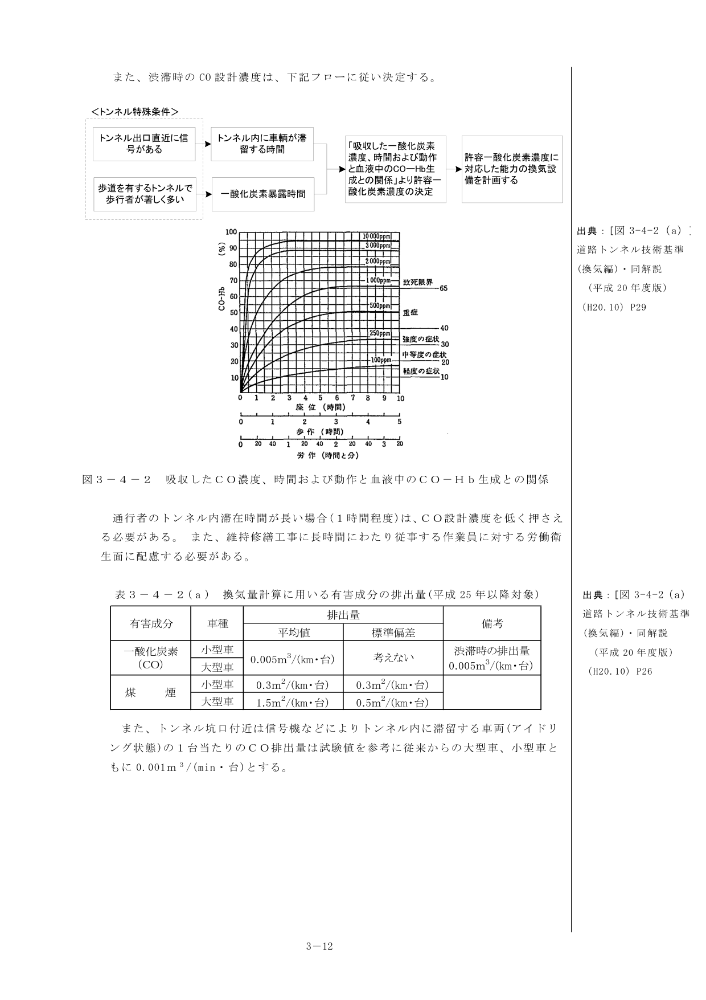

表3-4-2(a) 換気量計算に用いる有害成分の排出量（平成25年以降対象）

また、トンネル坑口付近は信号機などによりトンネル内に滞留する車両（アイドリング状態）の1台当たりのCO排出量は試験値を参考に従来からの大型車、小型車ともに0.001m³/(min・台)とする。

### 3. 交通量（標準）

> **〔解 説〕**
>
> 換気施設の設計に用いる交通量は、当該トンネルの設計交通容量を用いることを原則とする。ただし、当該道路の設計時間交通量が設計交通容量を大幅に下まわる場合には、交通量として設計時間交通量を用いることができる。

#### 3-1 計算のフロー

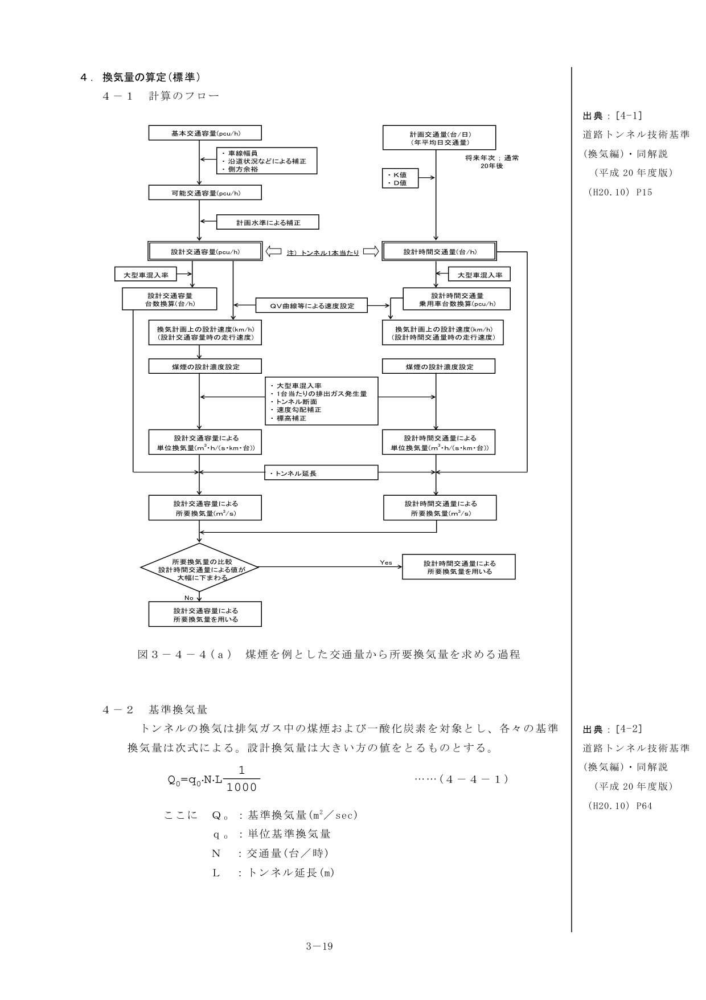

図3-4-4(a) 煤煙を例とした交通量から所要換気量を求める過程

#### 3-2 設計交通量

**(1) 基本交通容量**

- 多車線道路の基本交通容量 …… 1車線当り 2200 PCU/h
- 2方向2車線道路の基本交通容量 …… 往復合計で 2500 PCU/h

**(2) 可能交通容量**

$$C = C_B \times \gamma_L \times \gamma_C \times \gamma_I \quad \cdots\text{(4-3-1)}$$

ここに、$C$：道路可能交通容量(PCU/h)、$C_B$：基本交通容量(PCU/h)、$\gamma_L, \gamma_C, \gamma_I$：各種の補正率

**1) 車線幅員（$\gamma_L$）**

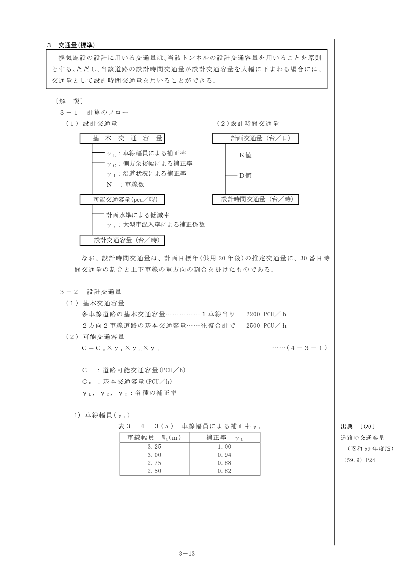

表3-4-3(a) 車線幅員による補正率 $\gamma_L$

**2) 側方余裕（$\gamma_C$）**

表3-4-3(b) 車線余裕幅による補正率 $\gamma_C$

**3) 沿道状況（$\gamma_I$）**

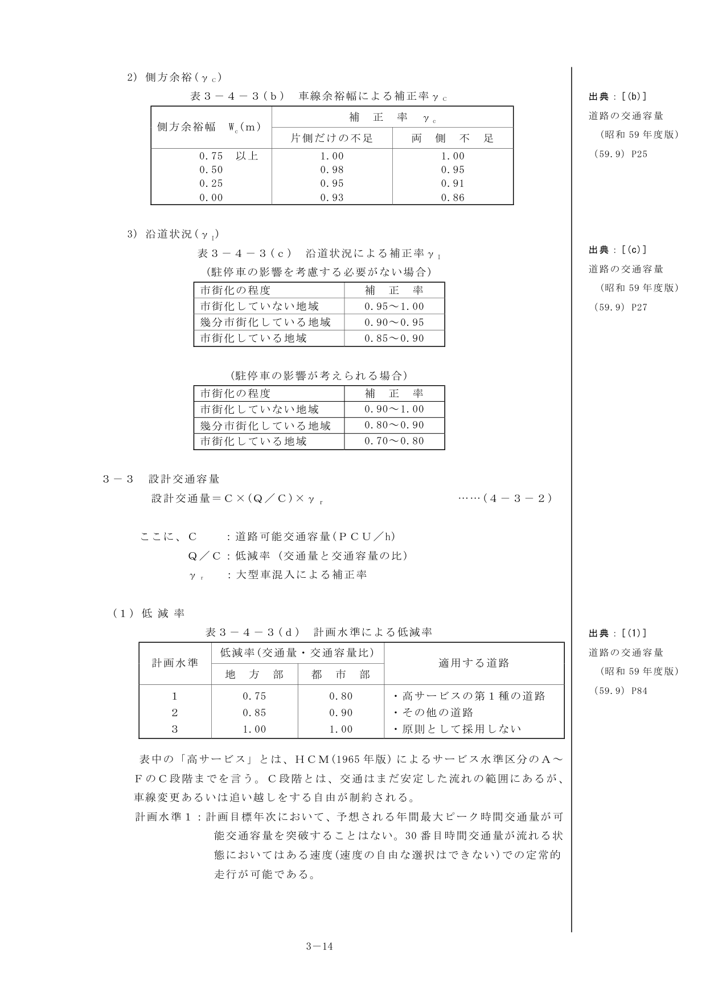

表3-4-3(c) 沿道状況による補正率 $\gamma_I$

#### 3-3 設計交通容量

$$\text{設計交通量} = C \times (Q/C) \times \gamma_r \quad \cdots\text{(4-3-2)}$$

ここに、$C$：道路可能交通容量(PCU/h)、$Q/C$：低減率（交通量と交通容量の比）、$\gamma_r$：大型車混入による補正率

**(1) 低減率**

表3-4-3(d) 計画水準による低減率

**(2) 大型車混入による補正係数**

$$\gamma_r = \frac{100}{(100 - r_L) + E_r \cdot r_L} \quad \cdots\text{(4-3-3)}$$

ここに、$\gamma_r$：大型車混入による補正率、$E_r$：大型車の乗用車換算係数、$r_L$：大型車混入率(%)

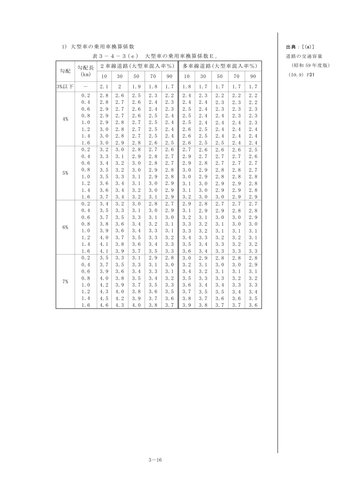

表3-4-3(e) 大型車の乗用車換算係数 $E_r$

#### 3-4 設計時間交通量

1. 設計時間交通量は、計画交通量から、その路線の交通量の変動特性を考慮して求めるものとする。
2. 設計時間交通量は、計画目標年における30番目時間交通量とすることを標準とする。

設計時間交通量は次の式による。

**1) 2車線道路の場合**

設計時間交通量 ＝ 計画交通量 × K/100 （両方向合計 台/h）

**2) 多車線道路の場合**

設計時間交通量 ＝ 計画交通量 × K/100 × D/100 （重方向合計 台/h）

ここに、$K$：計画交通量に対する設計時間交通量（通常は30番目時間交通量）の割合(%)、$D$：往復合計の交通量に対する重方向交通量の割合(%)

**K値**

| 区分 | K値 |
|---|---|
| 山地部 | 14 |
| 平地部 | 12 |
| 都市部 | 9 |

**D値**

換気の設計にあたって、当該路線におけるD値が不明な場合は次を標準とする。

| 区分 | D値 |
|---|---|
| 山地部 | 55 |
| 地方部 | 60 |

**大型車混入率** — 大型車混入率は、原則として計画交通量推計時に用いられた年平均大型車混入率を用いる。路線特有の事情が有る場合は、類似路線を設定し、その値を準用・予測するものとする。

#### 3-5 交通量選定留意点

換気設備の設計交通量は、設計交通容量とすることを原則とする。設計時間交通量が大幅に下回る場合には、設計交通量として設計時間交通量とすることができる。

設計時間交通量が設計交通容量を上回る場合は、設計交通容量を選定する。

### 4. 換気量の算定（標準）

#### 4-1 計算のフロー

#### 4-2 基準換気量

トンネルの換気は排気ガス中の煤煙および一酸化炭素を対象とし、各々の基準換気量は次式による。設計換気量は大きい方の値をとるものとする。

$$Q_0 = q_0 \cdot N \cdot L \cdot \frac{1}{1000} \quad \cdots\text{(4-4-1)}$$

ここに、$Q_0$：基準換気量(m³/sec)、$q_0$：単位基準換気量、$N$：交通量(台/時)、$L$：トンネル延長(m)

**(1) 単位基準換気量**

**1) 煤煙排出量**

煤煙の排出量の平均値、標準偏差および微粒子率は、実態調査および自動車排出ガス規制の動向をもとに表3-4-4(a)の値を用いることとした。

表3-4-4(a) 煤煙の1台当たりの排出量【平成25年以降対象】

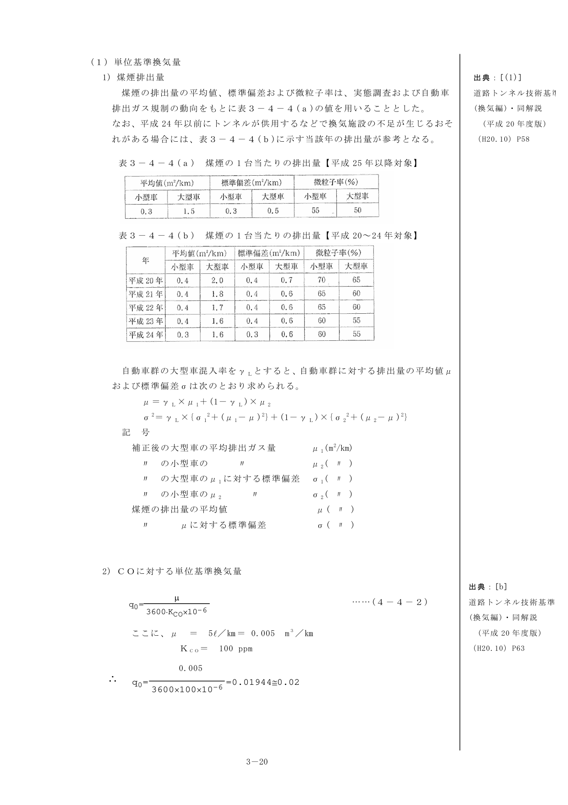

表3-4-4(b) 煤煙の1台当たりの排出量【平成20〜24年対象】

**2) COに対する単位基準換気量**

$$q_0 = \frac{\mu}{3600 \cdot K_{CO} \cdot 10^{-6}} \quad \cdots\text{(4-4-2)}$$

ここに、$\mu = 5 \text{ mL/km} = 0.005 \text{ m}^3\text{/km}$、$K_{CO} = 100 \text{ ppm}$

$$\therefore q_0 = \frac{0.005}{3600 \times 100 \times 10^{-6}} \fallingdotseq 0.02$$

#### 4-3 所要換気量と補正係数

**(1) 煤煙排出量の補正**

煤煙の排出量の平均値μおよび標準偏差σを求めるための補正は、表3-4-4(a)の排出量に走行速度による補正係数($k_v$)、縦断勾配による補正係数($k_L, k_S$)、標高による補正係数($k_h$)を用いて次式により行う。

$$\mu_1 = \{\mu_L \times R_L \times k_v \times k_L \times k_h\} + \mu_L \times (1 - R_L)$$

$$\sigma_1 = \{\sigma_L \times R_L \times k_v \times k_L \times k_h\} + \sigma_L \times (1 - R_L)$$

$$\mu_2 = \{\mu_S \times R_S \times k_v \times k_S \times k_h\} + \mu_S \times (1 - R_S)$$

$$\sigma_2 = \{\sigma_S \times R_S \times k_v \times k_S \times k_h\} + \sigma_S \times (1 - R_S)$$

**1) 縦断勾配および走行速度による煤煙排出量の補正**

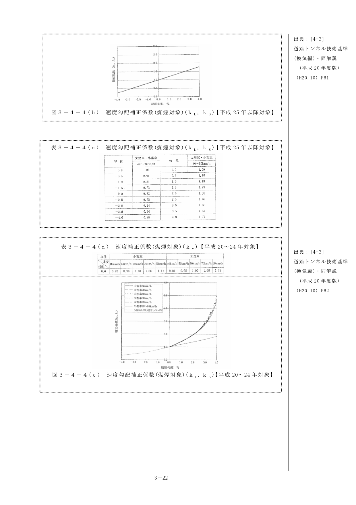

図3-4-4(b) 速度勾配補正係数（煤煙対象）($k_L, k_S$)【平成25年以降対象】

表3-4-4(c)(d)(e) 速度勾配補正係数

**2) 標高による煤煙排出量の補正**

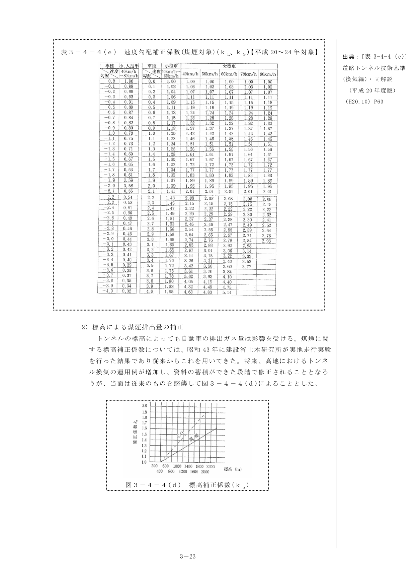

図3-4-4(d) 標高補正係数($k_h$)

{/* <!-- 図・表のページ対応表
=== 第3章 トンネル機械設備（1/3）===
[図]
m03-fig-01.png: 換気設備の計画・設計フロー (p3)
m03-fig-02.png: 図3-2-1 ジェットファンによる換気の例 (p5)
m03-fig-03.png: 図3-3-1(a) 自然換気の目安（対面交通トンネル） (p7)
m03-fig-04.png: 図3-3-1(b) 自然換気の目安（一方向交通トンネル） (p8)
m03-fig-05.png: 図3-3-2 換気方式の種類 (p9)
m03-fig-06.png: 図3-4-2 吸収したCO濃度・時間および動作と血液中のCO-Hb生成との関係 (p13)
m03-fig-07.png: 図3-4-4(a) 煤煙を例とした交通量から所要換気量を求める過程 (p20)
m03-fig-08.png: 図3-4-4(b) 速度勾配補正係数（煤煙対象）【平成25年以降対象】 (p23)
m03-fig-09.png: 図3-4-4(d) 標高補正係数(kh) (p24)
[表]
m03-tbl-01.png: 表3-4-2(a) 換気量計算に用いる有害成分の排出量 (p13)
m03-tbl-02.png: 表3-4-3(a) 車線幅員による補正率γL (p14)
m03-tbl-03.png: 表3-4-3(b) 車線余裕幅による補正率γC (p15)
m03-tbl-04.png: 表3-4-3(c) 沿道状況による補正率γI (p15)
m03-tbl-05.png: 表3-4-3(d) 計画水準による低減率 (p15)
m03-tbl-06.png: 表3-4-3(e) 大型車の乗用車換算係数Er (p17)
m03-tbl-07.png: 表3-4-4(a) 煤煙の1台当たりの排出量【平成25年以降対象】 (p21)
m03-tbl-08.png: 表3-4-4(b) 煤煙の1台当たりの排出量【平成20〜24年対象】 (p21)
m03-tbl-09.png: 表3-4-4(c)(d)(e) 速度勾配補正係数 (p23-24)
--> */}
