## 第4節 換気計画（続き）

### 5. 自然換気力および交通換気力（標準）

#### 5-1 自然換気力

**(1)** トンネル内に自然風 $U_n$ が吹いている状態では、次式で定義される圧力差が、両坑口間に作用していることとなる。

$$\Delta P_{MTW} = \left(1 + \zeta_e + \frac{\lambda L}{D_r}\right) \frac{\rho}{2} U_n^2 \quad \text{(Pa)} \quad \cdots\text{(4-5-1)}$$

ここに、$\Delta P_{MTW}$：坑口間自然換気力(Pa)、$\zeta_e$：トンネル入口損失係数(0.6)、$\lambda$：トンネル壁面摩擦損失係数(0.025)、$L$：トンネル延長(m)、$D_r$：トンネル代表寸法（等価円直径）(m)、$U_n$：自然風によるトンネル内平均風速(m/s)（特に資料がない場合は2.5m/s を標準）、$\rho$：空気の密度(1.2 kg/m³)

$$D_r = \frac{4 \times \text{トンネル断面積}}{\text{トンネル周長}}$$

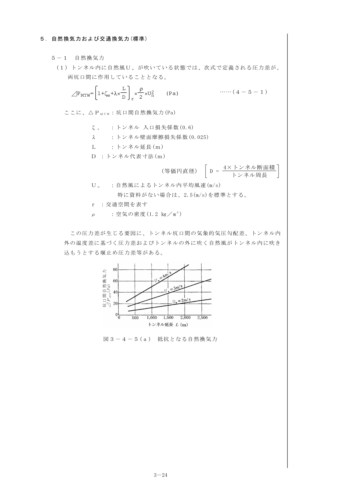

図3-4-5(a) 抵抗となる自然換気力

#### 5-2 交通換気力

**(1)** 一般にトンネル内を走行する自動車のピストン作用による交通換気力は、定常状態において次式により求めることができる。

$$\Delta P_t = \frac{A_m}{A_r} \cdot \frac{\rho}{2} \left[ n_+ \left( V_{t(+)} - U_r \right)^2 - n_- \left( V_{t(-)} + U_r \right)^2 \right] \quad \cdots\text{(4-5-2)}$$

ここに、$\Delta P_t$：交通換気力、$\rho$：トンネル内空気密度(1.2 kg/m³)、$A_m$：自動車等価抵抗面積(m²)、$A_r$：車道断面積(m²)、$n_+$：車道内の風向と同方向に向う自動車の台数、$n_-$：車道内の風向と逆方向に向う自動車の台数、$V_{t(+)}$：車道内の風向と同方向に向う自動車の速度(m/sec)、$V_{t(-)}$：車道内の風向と逆方向に向う自動車の速度(m/sec)、$U_r$：車道内風速(m/sec)

| 車種 | 自動車前面投影面積(m²) |
|---|---|
| 大型車 | 6.88 |
| 小型車 | 2.45 |

占積率と自動車抵抗係数の関係：

$$\xi_{CL} = 0.0309x + 0.724 \quad \cdots\text{(3.3.4)}$$

$$\xi_{Cs} = 0.0140x + 0.308 \quad \cdots\text{(3.3.5)}$$

ここに、$\xi_{CL}$：大型車の自動車抵抗係数、$\xi_{Cs}$：小型車の自動車抵抗係数、$x$：占積率(%)

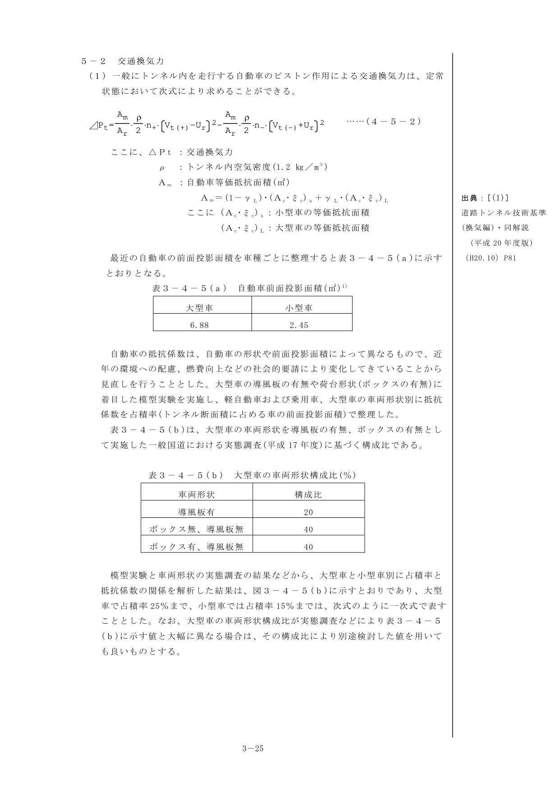

図3-4-5(b) 占積率と自動車抵抗係数の関係

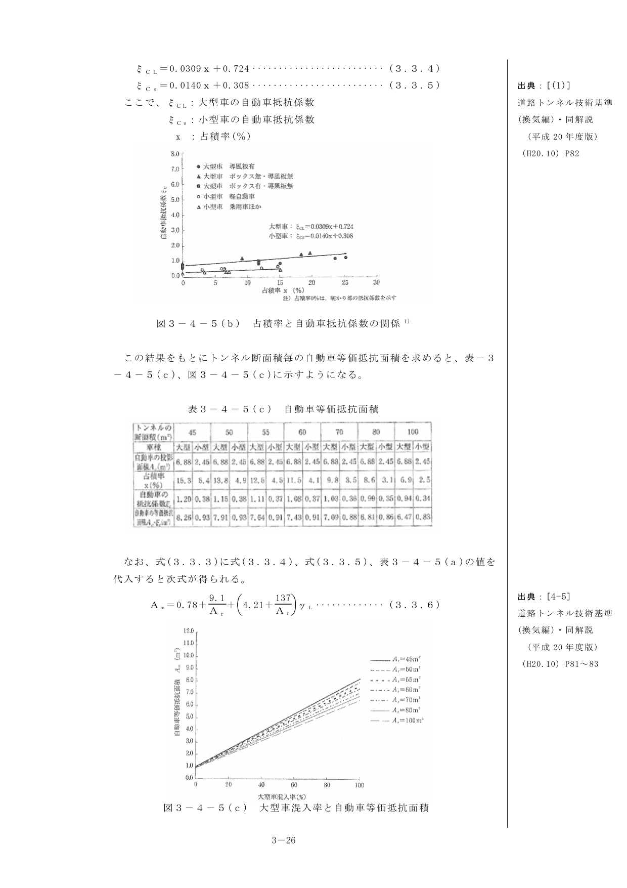

表3-4-5(c) 自動車等価抵抗面積

図3-4-5(c) 大型車混入率と自動車等価抵抗面積

**(2)** 対面交通のトンネルでは互いに打消し合って逆に抵抗となって作用することがある。

#### 5-3 交通換気図

自然換気力と交通換気力によって生じるトンネル内の圧力上昇は両者の組合せにより次式のとおりとなる。

$$\left(1 + \zeta_e + \frac{\lambda L}{D_r}\right) \frac{\rho}{2} U_r^2 = \Delta P_t + \Delta P_{MTW} \quad \cdots\text{(4-5-3)}$$

**(1) 一方向交通トンネルの場合**

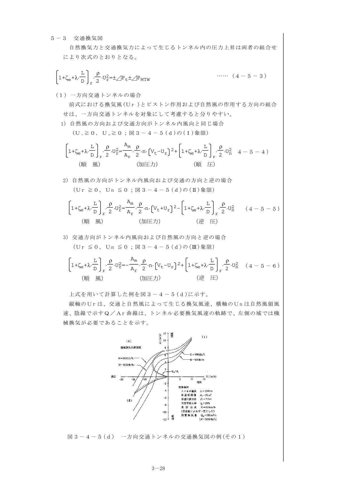

図3-4-5(d) 一方向交通トンネルの交通換気図の例（その1）

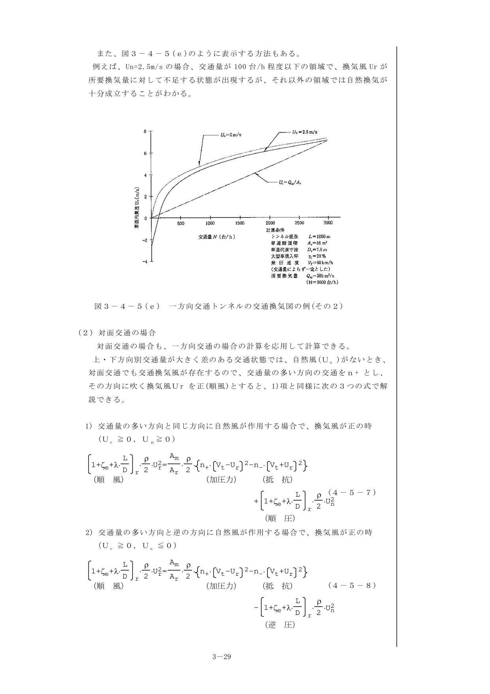

図3-4-5(e) 一方向交通トンネルの交通換気図の例（その2）

**(2) 対面交通の場合**

対面交通の場合も、一方向交通の場合の計算を応用して計算できる。上・下方向別交通量が大きく差のある交通状態では、自然風($U_n$)がないとき、対面交通でも交通換気風が存在する。

### 6. その他の検討

#### 6-1 交通渋滞と自然換気

1. 延長が短いトンネルでも短い区間をおいて連続していたり、坑口の前後が深い堀割構造であって清浄でない空気がトンネル内に流入するおそれのある場合は検討をする必要がある。
2. また、渋滞が発生し、トンネル内に車両が滞留したことがある、あるいはそのおそれがある場合も検討をする必要がある。
3. 渋滞には、走行・停止を繰り返す渋滞走行状態と事故などによる停止渋滞が考えられる。渋滞時の許容一酸化炭素濃度は、一酸化炭素暴露時間より決定する。

**1) 渋滞走行**

- 一酸化炭素排出量：7 L/(台・km)
- 車速：20 km/h

**2) 停止渋滞**

- 一酸化炭素排出量：1 L/(min・台)
- 車速：0 km/h

## 第5節 換気方式の採用と計算

換気方式には、縦流式、横流式、半横流式、組合せ換気方式等がある。最近では、建設費、維持費の関係から、縦流式換気方式が多く採用されている。また、長大トンネルにおいても電気集じん機の採用により縦流式の採用が可能になってきた。

本項では縦流式換気方式の代表としてジェットファン（ブースターファン）による換気と、立坑集中排気方式を中心に行う。

### 1. ジェットファン（ブースターファン）による換気（標準）

- **ジェットファン** — 正方向と逆方向の風量が同じであり、対面交通において重方向率が変わった場合や自然風の風向が変わった場合、火災排煙時に逆方向に同一性能で使いたい時に有利。
- **ブースターファン** — 正方向のみがジェットファンと同一風量で逆方向は、正方向の約50%の風量しか得られない。電動機の動力はジェットファンより小さい。卓越風があるトンネルや、一方向のみが流れを主にしているトンネルでは有利。

なお、一方向交通トンネルで換気/排煙のためブースターファンとジェットファンを併用することが多い。

#### 1-1 ジェットファン換気方式の計算

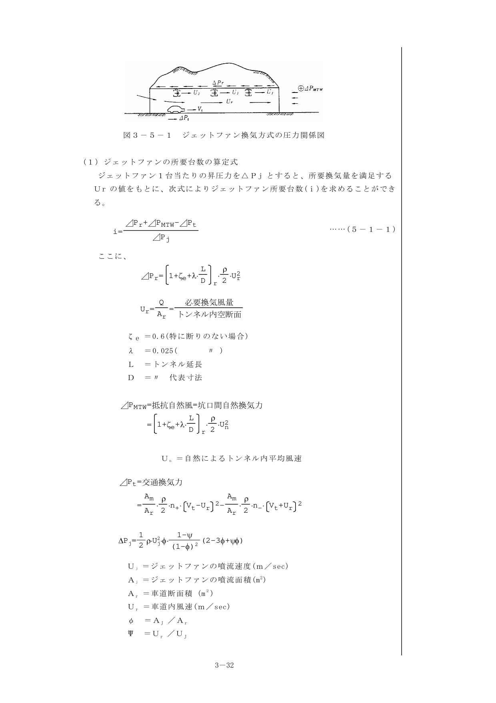

図3-5-1 ジェットファン換気方式の圧力関係図

通気抵抗($\Delta P_r$) ＋ 抵抗自然風($\Delta P_{MTW}$) ＝ 交通換気力($\Delta P_t$) ＋ ジェットファン昇圧力($\Delta P_j$)

**(1) ジェットファンの所要台数の算定式**

$$i = \frac{\Delta P_r + \Delta P_{MTW} - \Delta P_t}{\Delta P_j} \quad \cdots\text{(5-1-1)}$$

ここに、$\zeta_e = 0.6$、$\lambda = 0.025$、$L$：トンネル延長、$D$：トンネル代表寸法、$U_n$：自然によるトンネル内平均風速、$U_j$：ジェットファンの噴流速度(m/sec)、$A_j$：ジェットファンの噴流面積(m²)、$A_r$：車道断面積(m²)、$U_r$：車道内風速(m/sec)

**(2) 計算に使用する条件（参考）**

| 条件 | 一方向交通 | 対面交通 |
|---|---|---|
| 自然風 | 2.5 m/s で不利な方向 | 2.5 m/s で不利な方向 |
| 重方向の交通量率 | — | 50:50 |

**(3)** ジェットファンの台数と口径は次の事項を検討し選定する。

1. トンネル内の建築限界外の空間に取付けることを原則とする
2. 縦方向の取付け間隔と設置台数
3. 交通量の変化と運転台数

表3-5-1(a) ジェットファン昇圧計算に用いる数値

| 形式 | 口径 | $A_j$(m²) | $U_j$(m/s) |
|---|---|---|---|
| JF 600 | 630mm | 0.27 | 30 |
| JF 1000 | 1,030mm | 0.83 | 30 |
| JF 1250 | 1,250mm | 1.227 | 30 |
| JF 1500 | 1,530mm | 1.83 | 30 |

> 注）
> 1. ブースターファン（BF）は、BF1250、BF1500 の2種類があり $A_J \cdot U_J$ は正方向のみJFと同値とする。
> 2. JF400（口径400〜450mm）の実績もあるが、これはJF600 以上が建築限界等の関係で取付けられないためで、採用にあたっては噴流速度に注意をする必要がある。
> 3. 低騒音型として消音筒を長くしたJF600 とJF1000 がある。
> 4. JF600〜1250 については、吹出速度($U_j$)を35(m/s)とした機種が作られている。

#### 1-2 ジェットファンの取付間隔

**(1)** 延長方向の取付間隔は、噴流エネルギーが換気風エネルギーに十分置換されるようなミキシング距離を確保する。

表3-5-1(b) ジェットファンの取付間隔

| 形式 | 坑口からの距離(m) | ジェットファンの相互間(m) |
|---|---|---|
| JF 400 | 80 * | 80 * |
| JF 600 | 80 | 80 |
| JF 1000 | 140 | 140 |
| JF 1250 | 160 | 160 |
| JF 1500 | 180 | 180 |

> 注）JF400 は既設トンネルの設置実験であり、検討を行い上記値より小さい値を採用してもよい。

**(2) 断面取付位置と昇圧効果の減少**

取付方式は天井からの吊下げ式が一般的であり、ジェットファン外径と天井壁面までの離間距離はほぼ0.5D（Dはジェットファン口径）を標準としている。

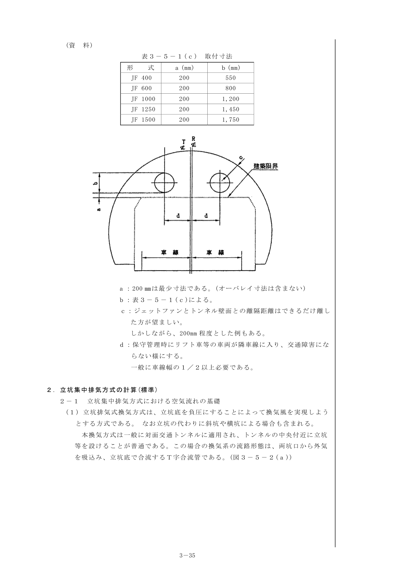

表3-5-1(c) 取付寸法

### 2. 立坑集中排気方式の計算（標準）

#### 2-1 立坑集中排気方式における空気流れの基礎

1. 立坑排気式換気方式は、立坑底を負圧にすることによって換気風を実現しようとする方式である。なお立坑の代わりに斜坑や横坑による場合も含まれる。
2. 一方向交通トンネルにおいて出口側の坑口からの吐出空気量を軽減する意図から使用される例などがある。

図3-5-2(a) 立坑排気換気方式の模式図（合流形）

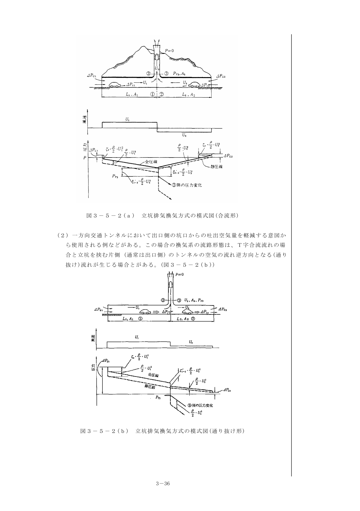

図3-5-2(b) 立坑排気換気方式の模式図（通り抜け形）

#### 2-2 立坑集中排気方式の計算

**(3) 合流および分岐損失係数**

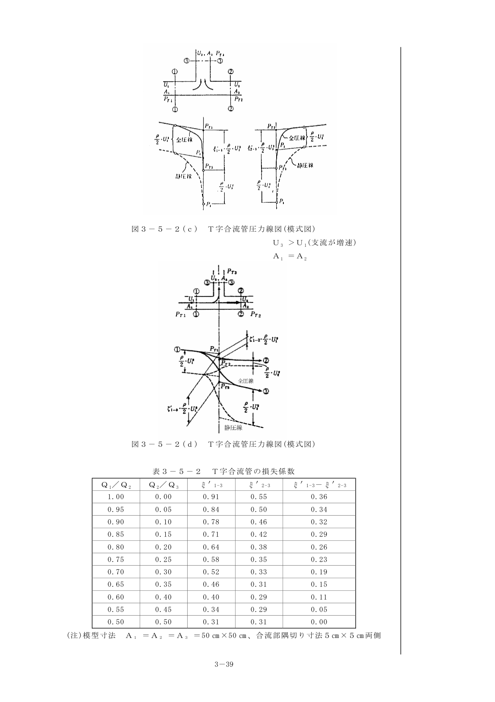

表3-5-2 T字合流管の損失係数

図3-5-2(e) 合流損失係数

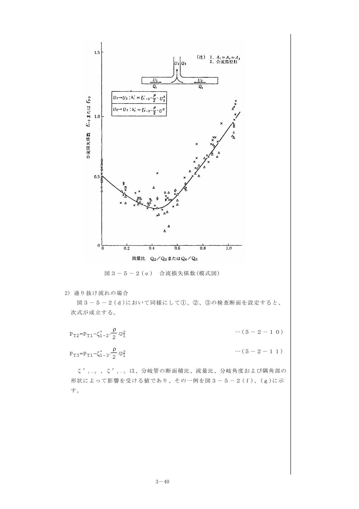

図3-5-2(f)(g) 分岐損失係数

#### 2-3 立坑下の区間補正（参考）

対面交通で、交通量が同一であっても「区間距離」「勾配」が違えば必要換気量が異なる。また、一方向交通では交通換気力の影響を受けるなど立坑下の左右の圧力状況は同一であることは少なく、バランスを補正する。

1. 換気風量の少ない側区間に必要以上の風量を流し、反対側区間と同じ圧力になるようにする。
2. 左右の圧力差をジェットファンの昇圧力で補正する。
3. じゃま板によって片側に抵抗をつける。

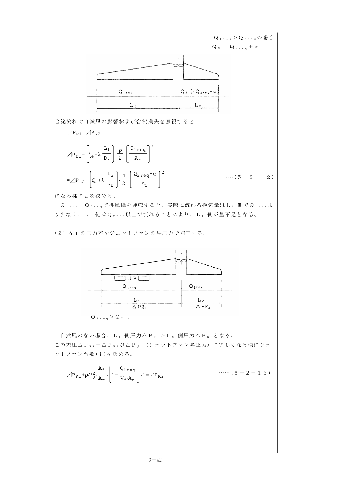

図3-5-2(h)(i)(j) じゃま板の種類と影響

## 第6節 換気機

本節では、ジェットファン、送・排風機および電気集じん機と付属装置の3項目に大別する。

### 1. ジェットファン（ブースターファン）（標準）

> **〔解 説〕**
>
> 換気機は、使用上の条件に合致し、経済的かつ合理的となるよう計算しなければならない。

ジェットファンは、正転・逆転とも同一噴流速度（吹出平均風速）であるが、ブースターファンは、正転の噴流速度を決めている。

#### 1-1 仕様一覧（参考）

#### 1-2 ジェットファンの構造図

新規製作機は下記を標準材質とする。既設機は、状況に応じて適宜必要箇所の材質を変更する。

- 本体ケーシング … SUS304
- 消音筒 … SUS304
- パンチングメタル … SUS304
- 羽根車 … アルミニウム合金鋳物
- カバー … SUS304
- 吸音材 … グラスウール
- 本体吊り金具 … SUS304
- 電動機

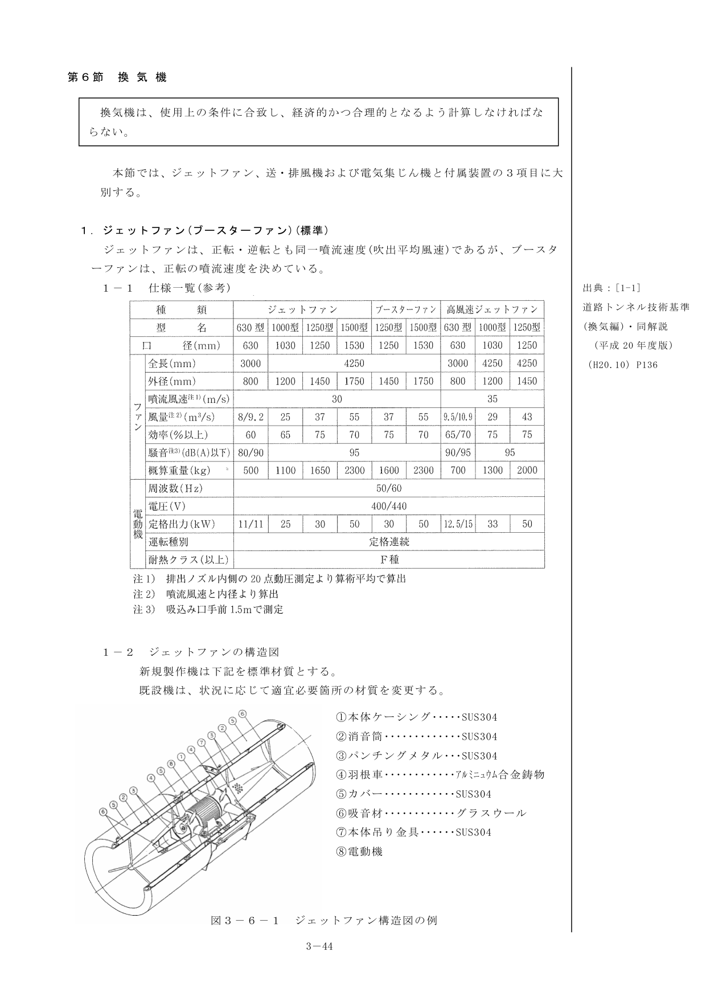

図3-6-1 ジェットファン構造図の例

#### 1-3 ジェットファンの取付方法

1. ファンの取付方法には、固定式および自由吊り下げ式がある。
2. 取付けにあたって、基礎ボルト（打込み方式を標準とする）を含め、ファン本体の保持強度は実荷重の15倍以上をとる。
3. コンクリート巻厚が250mm以下になる場合は、取付金具（基礎ボルト）の支持方法について検討するものとする。
4. ジェットファンの配置については、維持管理性、火災時の排煙運用等を考慮し、配置場所及び配列を検討するものとする。

### 2. 送・排風機（標準）

#### 2-1 送・排風機の型式

> **〔解 説〕**
>
> トンネル換気用として使用される送・排風機（以下送風機という）は、普通、大風量、低風圧のものであるので、これに適した軸流送風機を採用することを原則とする。
>
> 1. 軸流式は遠心式に比べて、形状が小型であり、管路の一部に容易に組入れることができ、効率も他のものに比べて優れている。しかし、高価で騒音が大きい。
> 2. 遠心式は圧力上昇を容易に行える形式のもので、風圧が高くなるほど、小型になってくる。目安として、必要送風機全圧が5000Pa 程度に達する場合は、軸流式と遠心式を比較検討する必要がある。
> 3. 火災時の排煙等に関しては、軸流式は正逆運転により排気が比較的容易であり、遠心式はダクトの切替えが必要な欠点がある。

#### 2-2 送・排風機の台数

> **〔解 説〕**
>
> 1換気系に対し、送・排風機は2〜3台の並列運転を原則とする。

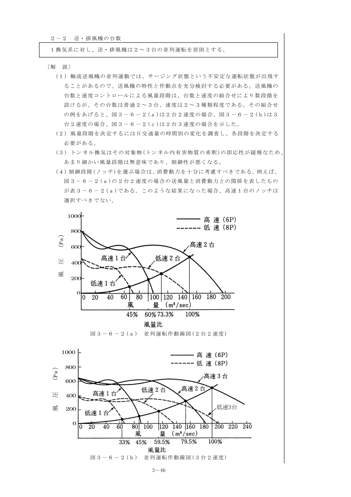

図3-6-2(a)(b)(c) 並列運転作動線図

#### 2-3 軸流送風機の選定

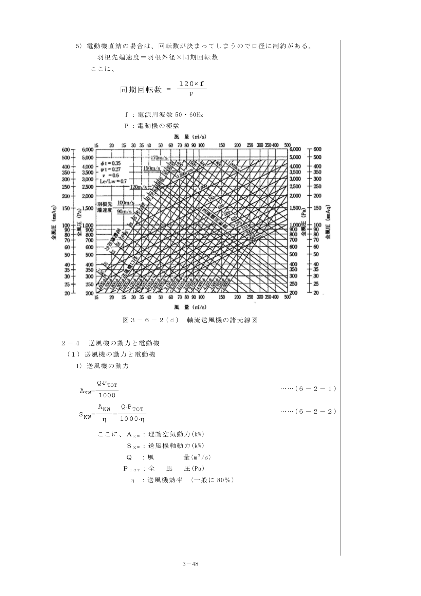

図3-6-2(d) 軸流送風機の諸元線図

#### 2-4 送風機の動力と電動機

**(1) 送風機の動力**

$$A_{KW} = \frac{Q \cdot P_{TOT}}{1000} \quad \cdots\text{(6-2-1)}$$

$$S_{KW} = \frac{A_{KW}}{\eta} = \frac{Q \cdot P_{TOT}}{1000 \cdot \eta} \quad \cdots\text{(6-2-2)}$$

ここに、$A_{KW}$：理論空気動力(kW)、$S_{KW}$：送風機軸動力(kW)、$Q$：風量(m³/s)、$P_{TOT}$：全風圧(Pa)、$\eta$：送風機効率（一般に80%）

**(2)** 送風機の軸動力は温度および大気圧に対して次式により補正する。

$$S_{KW1} = S_{KW0} \cdot \frac{273 + t_0}{273 + t_1} \cdot \frac{P_1}{P_0} \quad \cdots\text{(6-2-3)}$$

**(3)** 電動機出力および入力

$$M_{KW} = S_{KW1} \cdot (1 + \alpha) \quad \cdots\text{(6-2-5)}$$

$$M_1 = M_{KW} / \eta_m \quad \cdots\text{(6-2-6)}$$

ここに、$\alpha$：電動機余裕係数（一般に5〜10%）、$\eta_m$：電動機効率（一般に90〜95%）

#### 2-5 送風機の据付・配置

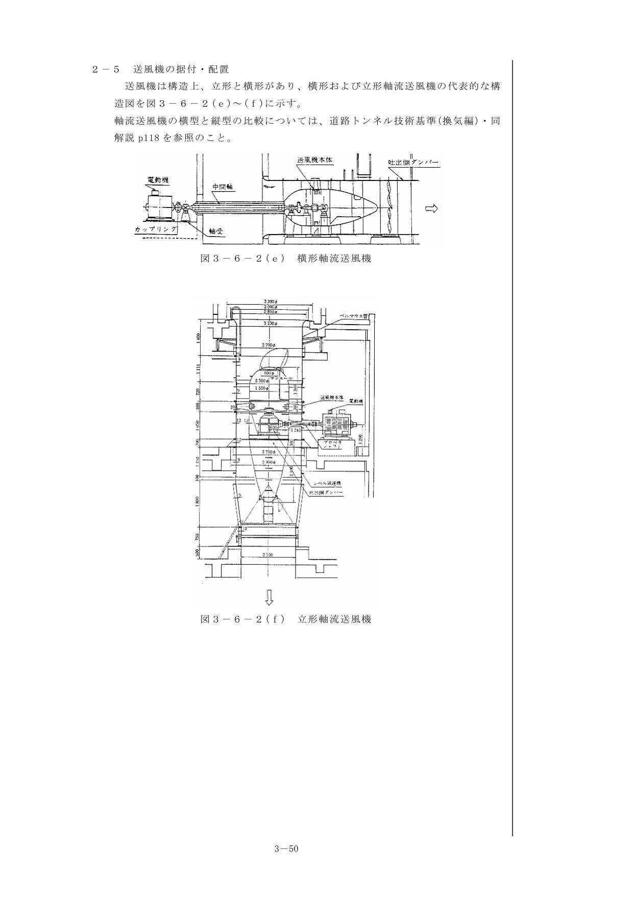

図3-6-2(e)(f) 横形・立形軸流送風機

#### 2-6 風量制御の方法と段階

風量制御の方法には次の種類がある。

- 回転数制御法
- 動翼可変制御法
- 台数制御法

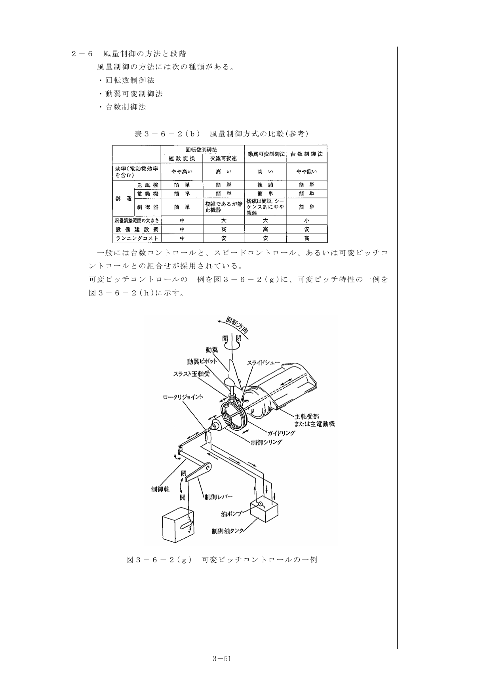

表3-6-2(b) 風量制御方式の比較（参考）

#### 2-7 送風機の発生騒音

**(1) 送風機の騒音**

$$L_A = L_{SA} + 10 \log_{10} Q \cdot P^2 \quad \cdots\text{(6-2-7)}$$

ここに、$L_A$：騒音レベル dB(A)、$L_{SA}$：比騒音レベル dB(A)（軸流送風機では10 dB(A)程度）、$Q$：風量 m³/min、$P$：全風圧 Pa

**(2)** 基本周波数は次式で求められる。

$$F = \frac{N \cdot Z}{60} \quad \cdots\text{(6-2-8)}$$

ここに、$F$：基本周波数(Hz)、$N$：送風機の回転数(rpm)、$Z$：羽根の枚数

### 3. 電気集じん機および付属装置

1. 電気集じん機はトンネル内の煤煙の一部を除去して煤煙濃度を改善するものである。しかし、CO濃度の改善はできない。
2. このためCO濃度が限界に達する地点で空気の入れ替えを行わなければならない。
3. 電気集じん機を縦流換気方式に適用することにより適用トンネル延長の拡大が可能になった。

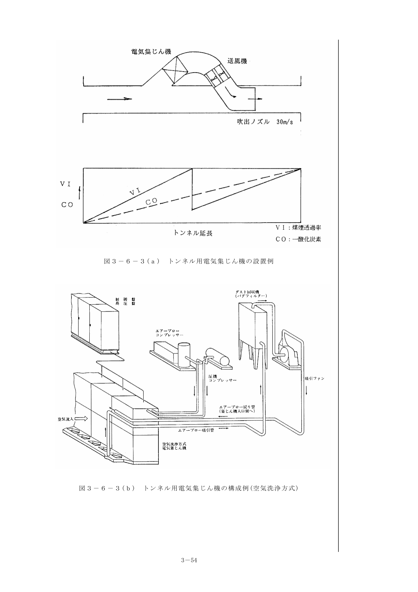

図3-6-3(a)(b) トンネル用電気集じん機の設置例・構成例

## 第7節 換気所

> **〔解 説〕**
>
> 換気所は、機能的な構造とし、位置の選定及び外観は特に維持管理及び環境上の配慮をして設計するものとする。
>
> 1. 換気機、電気設備、制御設備、補助機器、吸・排気口、連絡ダクトを備えた構造とする。
> 2. 吸気口の位置と構造は、排気口あるいはトンネル坑口から排出される汚染空気を吸い込まないようにする。
> 3. また、トンネル本体に近く、保守点検が容易にできる位置に設置することが望ましい。

### 1. 坑口換気所（標準）

1. 坑口換気所は横流式や半横流式換気に多く設けられている。
2. 設置する位置はトンネル坑口部と立坑等の坑口に設ける場合に大別され、さらにトンネル坑口部は路上と路側に設ける場合がある。
3. トンネル坑口の路上の場合はトンネルに進入する運転手に威圧感を与えないようにする。

### 2. 地下換気所（標準）

1. 地下換気所は坑口に換気所を設けることが困難な場合に立坑底とトンネルの間に設ける場合がある。
2. 地下換気所は坑口換気所に比べ一般に工事費が高くなる。
3. 特に換気所内の温度調節、防塵、防湿等に留意する必要がある。
4. 地下換気所は立坑集中排気方式や立坑送排気方式に多く設けられている。

### 3. 換気所の付帯設備（標準）

次の設備がある。

1. **ダクト** — トンネルと換気所を結ぶ送排気ダクトである、ダクト内流速は、一般に20m/s 以下としている。
2. **ダンパ** — 送・排風機の停止時の仕切用に設置される。
3. **コーナーベーン** — ダクト内の曲り部に取付けられ損失軽減の為に設備される。
4. **サイレンサ** — 送・排風機の騒音を減音するものである。
5. **除じんフィルター** — トンネル内の排気ガスをそのまま外部に排出する場合に問題があるとき設備する。
6. **搬入・搬出装置** — 保守・維持管理の為に所内に設備する。
7. **空気調和機** — 電気室等の除湿のために設ける。

{/* <!-- 図・表のページ対応表
=== 第3章 トンネル機械設備（2/3）===
[図]
m03-fig-10.png: 図3-4-5(a) 抵抗となる自然換気力 (p25)
m03-fig-11.png: 図3-4-5(b) 占積率と自動車抵抗係数の関係 (p26)
m03-fig-12.png: 図3-4-5(c) 大型車混入率と自動車等価抵抗面積 (p27)
m03-fig-13.png: 図3-4-5(d) 一方向交通トンネルの交通換気図の例（その1） (p29)
m03-fig-14.png: 図3-4-5(e) 一方向交通トンネルの交通換気図の例（その2） (p30)
m03-fig-15.png: 図3-5-1 ジェットファン換気方式の圧力関係図 (p33)
m03-fig-16.png: 図3-5-2(a) 立坑排気換気方式の模式図（合流形） (p37)
m03-fig-17.png: 図3-5-2(b) 立坑排気換気方式の模式図（通り抜け形） (p37)
m03-fig-18.png: 図3-5-2(e) 合流損失係数 (p41)
m03-fig-19.png: 図3-5-2(f)(g) 分岐損失係数 (p41)
m03-fig-20.png: 図3-5-2(h)(i)(j) じゃま板の種類と影響 (p43-44)
m03-fig-21.png: 図3-6-1 ジェットファン構造図の例 (p45)
m03-fig-22.png: 図3-6-2(a)(b)(c) 並列運転作動線図 (p47-48)
m03-fig-23.png: 図3-6-2(d) 軸流送風機の諸元線図 (p49)
m03-fig-24.png: 図3-6-2(e)(f) 横形・立形軸流送風機 (p51)
m03-fig-25.png: 図3-6-3(a)(b) トンネル用電気集じん機の設置例・構成例 (p55-56)
[表]
m03-tbl-10.png: 表3-4-5(c) 自動車等価抵抗面積 (p27)
m03-tbl-11.png: 表3-5-1(c) 取付寸法 (p36)
m03-tbl-12.png: 表3-5-2 T字合流管の損失係数 (p40)
m03-tbl-13.png: 表3-6-2(b) 風量制御方式の比較 (p52)
--> */}
