## 第8節 環境対策設備

### 1. 騒音対策設備（標準）

> **〔解 説〕**
>
> 騒音の対策にあたっては、諸基準に合致するよう、経済性、安全性、効果、維持管理等を十分検討のうえ実施することが望ましい。
>
> 換気機を音源とする換気所騒音は、換気所吸・排気口から伝搬するものと、換気所外壁を透過あるいは漏洩して外部へ漏れるものに大別できる。

### 2. 排気ガス対策

1. 都市トンネルなどでは、坑口又は排気口周辺の排気ガスによる影響を考慮しなければならない。
2. 排気ガスの拡散計算を行い、周辺地域への排気ガスの影響を予測する。
3. 当該周辺地域の有害ガス濃度（バックグラウンド濃度）を調査する。
4. 上記(2)および(3)を勘案し、排気ガス対策の必要性の有無を検討する。

## 第9節 換気制御

> **〔解 説〕**
>
> 換気機の運転・制御は、効果的かつ経済的に行わなければならない。
>
> 換気制御は、トンネル内の視環境や空気の汚染状態を、目標水準の範囲内になるように、交通量、自然換気力、CO計、VI計等の信号に基づいて、最小限の所要動力で運転することが目的である。

### 1. 制御方式（標準）

制御方式は自動制御を原則とするが、機器の故障や試験・調整の場合に備えて、最小限の手動制御も可能な方式とする。また、火災発生時等の異常事態への対応を考慮した運転制御も必要である。

#### 1-1 自動制御

自動制御は、制御装置により換気風量の調節を行うために、必要な一連の機器類を自動的に制御する方式である。一般に、煙霧透過率測定装置（VI計）、一酸化炭素濃度測定装置（CO計）、車種別交通量計数装置（TC計）、風向・風速測定装置（AV計）などからの信号により自動的に風量制御を行っている。

**(1) フィードバック制御**

トンネル内の汚染濃度（煙霧透過率、一酸化炭素濃度など）を一定範囲に保つよう計測結果をフィードバックし風量制御を行う方式で、多くのトンネルで採用されている。

この方法は換気プロセスの時定数が大きいために時間遅れが10〜30分となる場合、交通条件、自然風等の影響に対して後追い制御する形となる。既設トンネルでは、時期を見て制御設定値の見直しを行うことが必要である。

**(2) フィードフォワード制御**

交通状況（交通量・車種など）あるいはトンネル内汚染濃度を予測的にとらえ風量制御を行う方式で、後追い制御時に生じるハンチング現象を避けることができる。

**(3) プログラム制御**

時間帯毎に予め定められたプログラムによって運転風量を制御する方式で、交通流パターンの変動が小さくその影響の少ないトンネルに適用される。

**(4) エキスパートシステム**

AI（人工知能）の一分野であるエキスパートシステムは、換気制御でも今後の適用拡大が期待されている。この方式は、制御の内容を数式ではなく「IF〜THEN〜」形式のルールで記述し、これを基にプロセスデータを判断または推論して制御を行うものである。

**(5) ファジー制御**

ファジー理論を基にした制御で、換気機の操作量の決定には、予見ファジーすなわち、種々な操作案の仮定のもとに制御対象の将来状態を予測し、この中から最適な操作案を選択する方法である。

**(6) 交通量予測簡易ファジー制御**

上記制御の発展形として交通量計付きファジー制御（拡散予測制御方式）がある。坑口付近に置いた交通量計からの交通状況変動情報を入力し、近い将来の交通状況を予測し、換気量の予測計算と必要ジェットファンの運転台数の出力を行い、換気設備の効率的運転を行おうとする制御方法である。

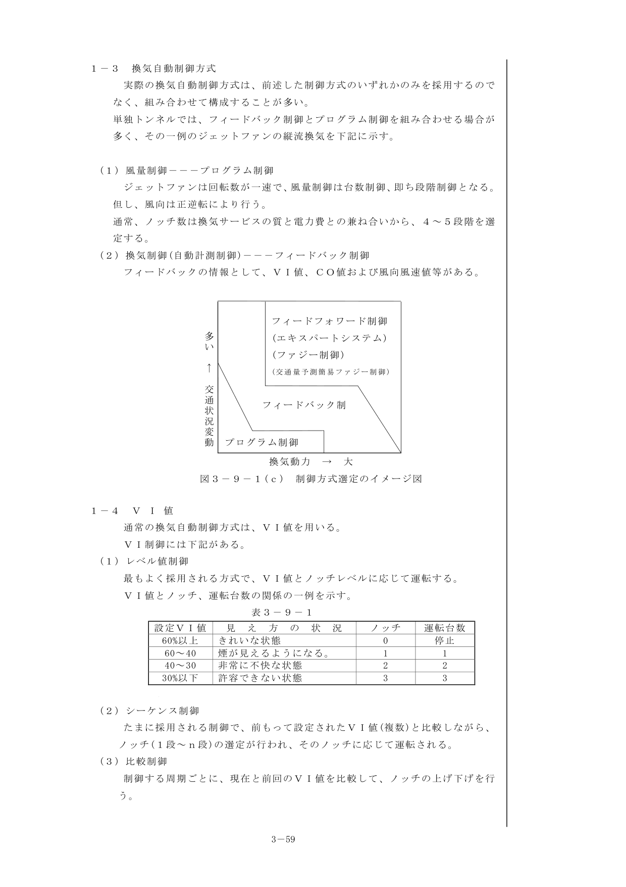

図3-9-1(c) 制御方式選定のイメージ図

#### 1-2 手動制御

手動制御は、人手によって機器類を運転し風量を制御する方式である。

**(1) 単独制御** — 各機器を個別に人手によって制御する。自動および連動制御系が故障その他により制御不可能になったときや、各機器を個別に試験するときに利用される。

**(2) 連動制御** — あらかじめ定められた風量段階（ノッチ）のボタンを押すことにより、ワンタッチで所定の風量が得られるように関連機器を連動させる制御をいう。

#### 1-3 換気自動制御方式

実際の換気自動制御方式は、前述した制御方式のいずれかのみを採用するのでなく、組み合わせて構成することが多い。

**(1) 風量制御 — プログラム制御**

ジェットファンは回転数が一速で、風量制御は台数制御、即ち段階制御となる。但し、風向は正逆転により行う。通常、ノッチ数は換気サービスの質と電力費との兼ね合いから、4〜5段階を選定する。

**(2) 換気制御（自動計測制御） — フィードバック制御**

フィードバックの情報として、VI値、CO値および風向風速値等がある。

#### 1-4 VI値

通常の換気自動制御方式は、VI値を用いる。

**(1) レベル値制御** — 最もよく採用される方式で、VI値とノッチレベルに応じて運転する。

表3-9-1 VI値とノッチ、運転台数の関係の一例

| 設定VI値 | 見え方の状況 | ノッチ | 運転台数 |
|---|---|---|---|
| 60%以上 | きれいな状態 | 0 | 停止 |
| 60〜40 | 煙が見えるようになる | 1 | 1 |
| 40〜30 | 非常に不快な状態 | 2 | 2 |
| 30%以下 | 許容できない状態 | 3 | 3 |

**(2) シーケンス制御** — 前もって設定されたVI値（複数）と比較しながら、ノッチ（1段〜n段）の選定が行われ、そのノッチに応じて運転される。

**(3) 比較制御** — 制御する周期ごとに、現在と前回のVI値を比較して、ノッチの上げ下げを行う。

#### 1-5 CO値

通常、100ppm になると、前記VI制御に割り込み、最高ノッチ運転される。

#### 1-6 風向風速値

運転開始のノッチの吹き出し方向決定、換気サービスの質および電力費等を評価するためのデータとして使用する。

### 2. 制御装置（標準）

#### 2-1 制御装置の構成

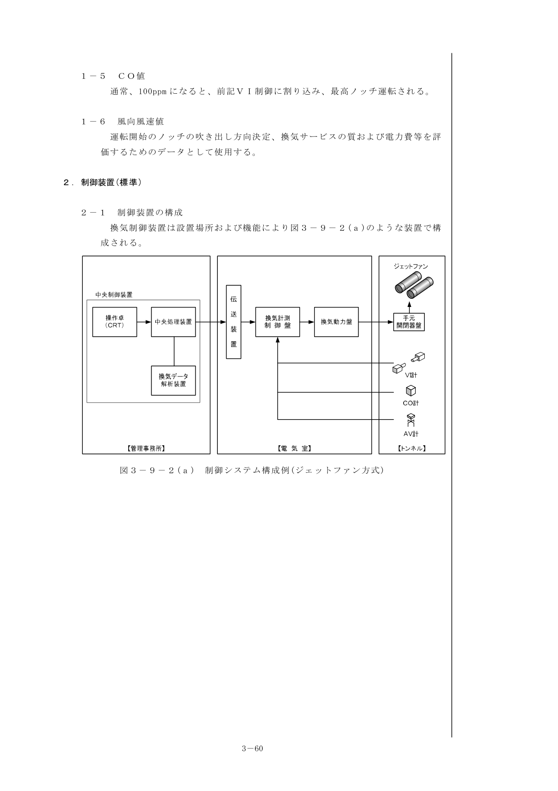

図3-9-2(a) 制御システム構成例（ジェットファン方式）

#### 2-2 計測装置

トンネル内の換気状態を監視する計測装置には、次のものがある。

**(1) 煙霧透過率測定装置（VI計）**

1. 投光部と受光部は一般に100m離して設置する。
2. 光学的な測定計器のため、汚れ等のため指示値に狂いが生じやすいので適宜較正する必要がある。
3. トンネル出入口近傍では、100m程度以上内部に入った位置に受光部を設置する。

**(2) 一酸化炭素濃度測定装置（CO計）**

大気中のCO濃度を測定する方式は、「大気中の一酸化炭素自動計測器」（JIS B7951）に、赤外線吸収方式あるいは定電位電解方式と規定されている。トンネルのような定置式に適している「赤外線方式」を使用する。

**(3) 交通量測定装置（TC計）**

車両検知器には、検出方式によりループコイル式、超音波式などがある。

**(4) 風向風速測定装置（AV計）**

超音波式が一般的に使用されている。2組の超音波速受波器により2成分の風速を測定し、トンネル軸方向風速として指示記録する。

#### 2-3 換気動力盤・補機盤

換気動力盤は、電動機の起動・停止回路、速度変速回路を組み込んだもの。補機盤は、補機の制御回路を組み込んだものであり、両者が一面構成のものもある。

#### 2-4 現場操作盤（機側盤）

換気機の近くに設置され、機械を単独運転・調整する場合の操作盤である。

#### 2-5 換気計測制御盤

VI計、CO計、AV計等の各計測装置の指示装置を収納する盤であり、自動制御装置は、トンネル換気状態計測装置からの信号をもとに自動的に換気量を決定し換気機に対して運転指令を出す自動制御リレー盤と、運転状態を監視し手動運転指令を出す監視制御から構成されている。

#### 2-6 監視操作制御設備

トンネル換気設備・消火設備の監視操作制御設備は、換気方式、規模、管理および運用体制に対応し、信頼性および安全性が高く、操作制御性に優れたものとする。

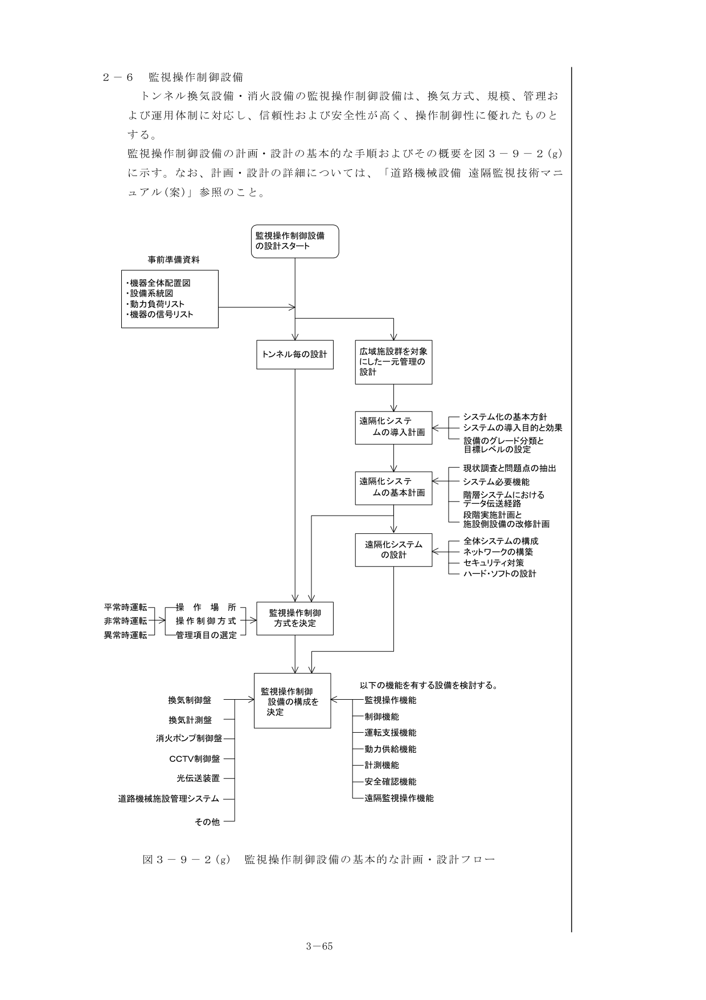

図3-9-2(g) 監視操作制御設備の基本的な計画・設計フロー

#### 2-7 遠隔化システムの計画（標準）

1. 遠隔化システムの計画・設計にあたっては、運用体制を考慮し、信頼性、安全性が高いこと、操作性、耐久性、経済性に優れていること、緊急時対応や維持管理が容易であることを基本的な要件とする。
2. 遠隔化システムの全体構成、設備仕様を設計する際には、以下に示す基本的な項目を検討するものとする。
   - 現状調査と問題点の抽出
   - 運用管理体制の検討
   - システムの必要機能の検討
   - システムの基本設計
   - 実施計画の作成

### 3. 制御上の留意事項（標準）

#### 3-1 火災時の運転

一般に、火災時の換気運転モードとして、火災発生直後に火点付近の利用者が避難できるような視界を確保するため煙の拡散を極力防止することを目的とした換気運転モードと、避難後の本格的消火活動を行うのに便利なよう必要地点の作業環境を確保することを目的とした運転モード（排煙運転モード）を二つに大別できる。

（参考）

**(1) 火災時パターン制御**（ジェットファン補正立坑集中排気縦流換気方式での実施例）

火災発生時に煙の拡散を極力小さくし、避難しやすくすることを目的として、火災発生区域をブロック別けし、火災発生区域と換気機の運転をパターン化し排煙を行う。

**(2) 風速抑制**（電気集じん機付立坑送排気縦流換気方式での実施例）

火災発生時に煙の拡散抑制を行い、避難環境を確保することを目的としてトンネル内の風速を抑制するよう換気機を運転する。

**(3) 内圧制御**（双設トンネルでの実施例）

火災発生時の避難路として相互への連絡坑が設けられた双設トンネルで、どちらかのトンネルでの火災発生時に煙が避難路を通って相手側トンネルに移動しないようにすることを目的として相手側トンネルに内圧をかけるよう換気機を運転する。

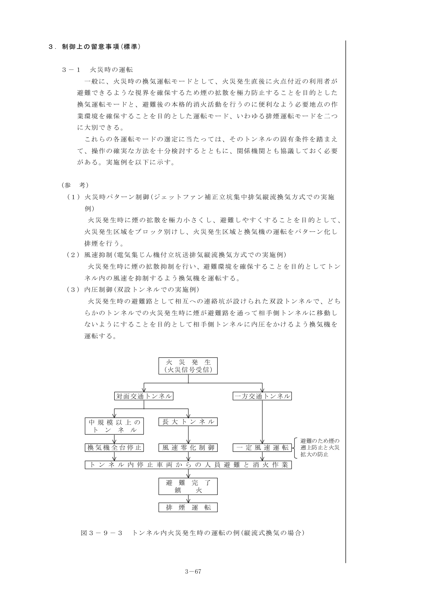

図3-9-3 トンネル内火災発生時の運転の例（縦流式換気の場合）

#### 3-2 制御系の変更

供用後の交通状況を把握したのちに、制御方法を確立するのが適当である場合が多い。このような場合に対処できるように、制御系の制御幅が広く、設定値の変更が容易な方式を採用することが望ましい。

## 第10節 非常用施設

### 1. トンネル等級区分

トンネルの非常用施設設置のための等級区分は、その延長および交通量に応じて図3-10-1に示すように区分する。

ただし、高速自動車国道等設計速度が高い道路のトンネルで延長が長いトンネルまたは平面線形、もしくは縦断線形の特に屈曲している等見通しの悪いトンネルにあっては一階級上位の等級とすることが望ましい。

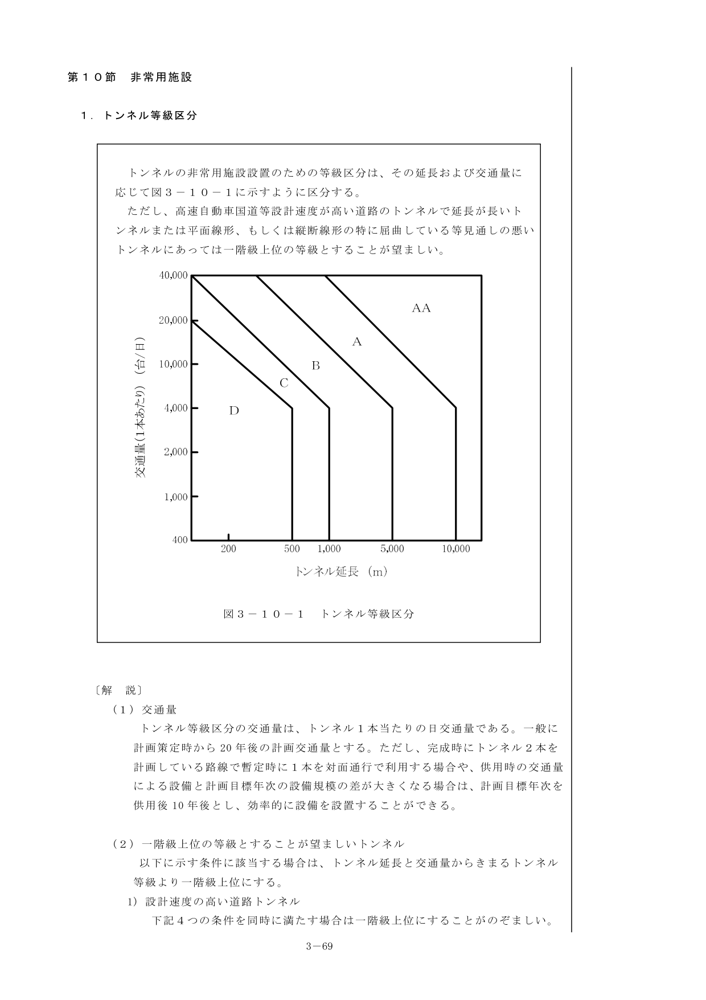

図3-10-1 トンネル等級区分

> **〔解 説〕**
>
> **(1) 交通量** — トンネル等級区分の交通量は、トンネル1本当たりの日交通量である。一般に計画策定時から20年後の計画交通量とする。
>
> **(2) 一階級上位の等級とすることが望ましいトンネル** — 高速自動車道路・自動車専用道路などで設計速度が80km/h 以上であること、トンネル延長が3000m 以上であること、交通方式が対面通行トンネルであること、トンネルの交通量が4000台/日以上であること、の4条件を同時に満たす場合。

### 2. 等級区分別の施設設置計画

トンネルには、火災その他の非常の際の連絡や危険防止、事故の拡大防止のため、トンネル等級区分に応じて、表3-10-2に示す施設を設置するものとする。

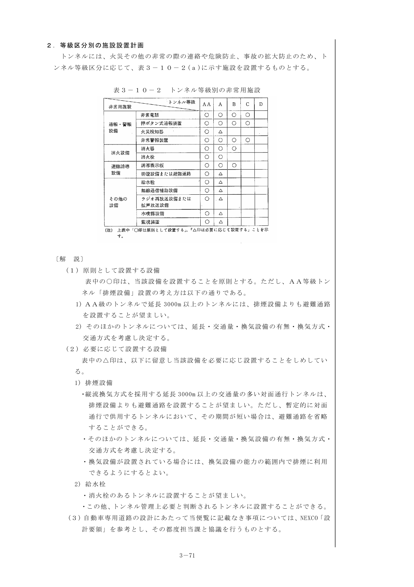

表3-10-2 トンネル等級別の非常用施設

> **〔解 説〕**
>
> **(1) 原則として設置する設備** — 表中の○印は、当該設備を設置することを原則とする。
>
> **(2) 必要に応じて設置する設備** — 表中の△印は、以下に留意し当該設備を必要に応じ設置することを示す。
>
> **(3)** 自動車専用道路の設計にあたって当便覧に記載なき事項については、NEXCO「設計要領」を参考とし、その都度担当課と協議を行うものとする。

### 3. 消火設備（標準）

> **〔解 説〕**
>
> 消火設備は、トンネルにおける自動車火災を迅速有効に消火し、または火災の拡大を防ぐために設けるものである。

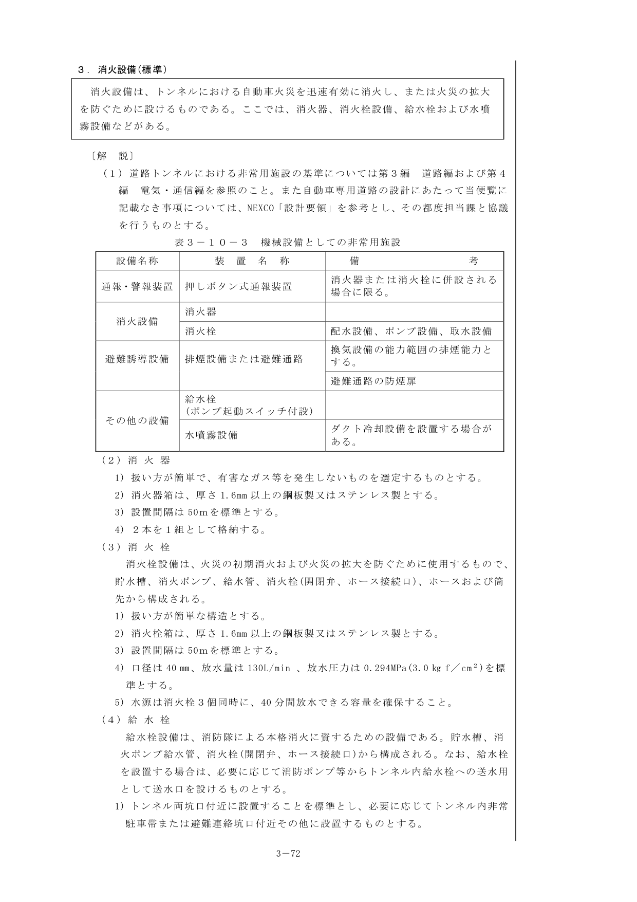

表3-10-3 機械設備としての非常用施設

**(2) 消火器**

1. 扱い方が簡単で、有害なガス等を発生しないものを選定する。
2. 消火器箱は、厚さ1.6mm以上の鋼板製又はステンレス製とする。
3. 設置間隔は50mを標準とする。
4. 2本を1組として格納する。

**(3) 消火栓**

1. 扱い方が簡単な構造とする。
2. 消火栓箱は、厚さ1.6mm以上の鋼板製又はステンレス製とする。
3. 設置間隔は50mを標準とする。
4. 口径は40mm、放水量は130L/min、放水圧力は0.294MPa を標準とする。
5. 水源は消火栓3個同時に、40分間放水できる容量を確保すること。

**(4) 給水栓**

1. トンネル両坑口付近に設置することを標準とし、必要に応じてトンネル内非常駐車帯または避難連絡坑口付近その他に設置する。
2. 口径は65mm、放水量は400L/min、放水圧力は2個同時放水した場合で0.294MPa を標準とする。
3. 水源は2個同時放水した場合、40分間放水できる容量を確保すること。
4. ポンプ起動スイッチを近傍に設置する。

**(5) 送水口** — トンネル両坑口に設置するものとし、口径65mm、双口型を標準とする。

**(6) 配水設備** — 消火ポンプ又は送水口からの消火用水を、消火栓及び給水栓に送水するための管路及び付帯設備で構成される。

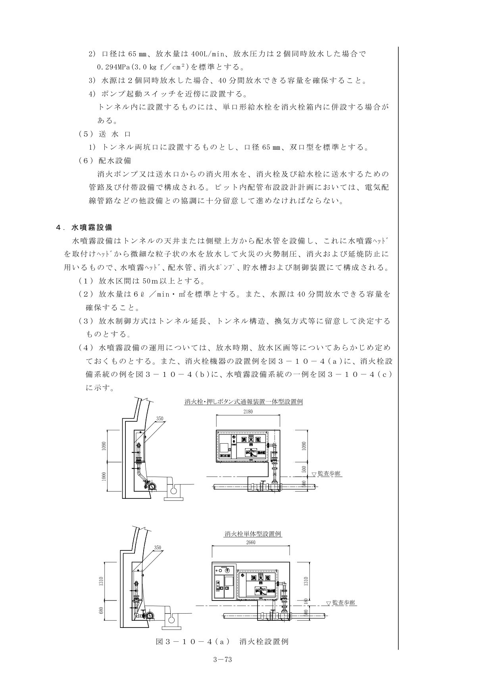

図3-10-4(a) 消火栓設置例

### 4. 水噴霧設備

水噴霧設備はトンネルの天井または側壁上方から配水管を設備し、水噴霧ヘッドから微細な粒子状の水を放水して火災の火勢制圧、消火および延焼防止に用いるものである。

1. 放水区間は50m以上とする。
2. 放水量は6 L/min・m²を標準とする。また、水源は40分間放水できる容量を確保すること。
3. 放水制御方式はトンネル延長、トンネル構造、換気方式等に留意して決定する。
4. 水噴霧設備の運用については、放水時期、放水区画等についてあらかじめ定めておく。

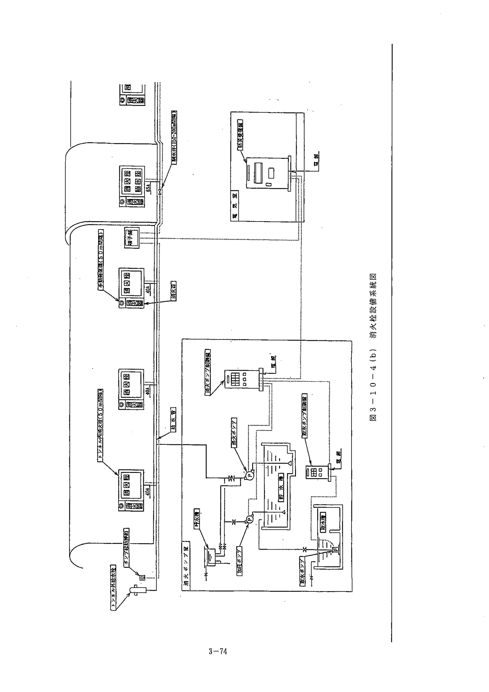

図3-10-4(b)(c) 消火栓設備系統・水噴霧設備系統の例

### 5. 消火システムについて（参考）

#### 5-1 非常用施設のフロー

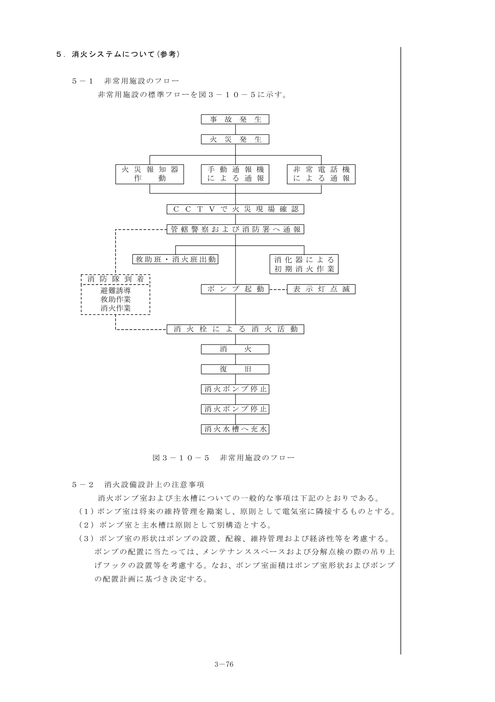

図3-10-5 非常用施設のフロー

#### 5-2 消火設備設計上の注意事項

消火ポンプ室および主水槽についての一般的な事項は下記のとおりである。

1. ポンプ室は将来の維持管理を勘案し、原則として電気室に隣接するものとする。
2. ポンプ室と主水槽は原則として別構造とする。
3. ポンプ室の形状はポンプの設置、配線、維持管理および経済性等を考慮する。
4. 主水槽の容量は、消火栓、給水栓および水噴霧設備等用水を同時に放水可能なものとし、余裕は20%程度考える。
   - 消火栓：同時3箇所分の水量
   - 水噴霧：同時2区画分の水量
   - 給水栓：同時2箇所分の水量
   - 余裕：20%
   - 上記合計の40分使用可能な容量
5. 主水槽は鉄筋コンクリート製が一般である。
6. 呼水槽は火災時における消火活動を迅速に行うために配水主管を常時満水にし、併せて自動弁動作圧の保持およびポンプの呼水用として設置するものである。
7. 取水設備および水源 — 水源は公共用上水道によることを標準とするが、上水道による水源使用が困難な場合は、トンネル湧水、河川水等によるものとする。
8. 凍結防止設備 — 凍結防止対策は、一般的にトンネル入口1,000m、出口500m程度としている。

## 第11節 修繕工事への対応（参考）

### 11-1 トンネル機械設備修繕（更新）計画

設備の修繕には、部品の交換等で設備システムへの影響の無い小規模な修繕と主要構成機器の更新等で設備システムに影響を与える大規模な修繕がある。

いずれの修繕方法を取るかは、緊急性、予算面を踏まえ、以下に示すような要求事項を整理することで修繕の位置づけ、どの準拠基準を適用するべきかが明確になる。

1. **修繕の目的** — 老朽化等による機能低下（過去の故障・修繕履歴）、要求機能アップ等
2. **修繕の目標** — 今後の供用期間、他要因での改修計画を踏まえた修繕目標
3. **既設施設の経過年数**、土木関連構造物も含めた施設全体の健全度評価
4. **施設目的に適合した信頼性の確保**（施設の種別、規模、地域性）
5. **手戻りの無い修繕計画**
6. **費用対効果**（経済性）

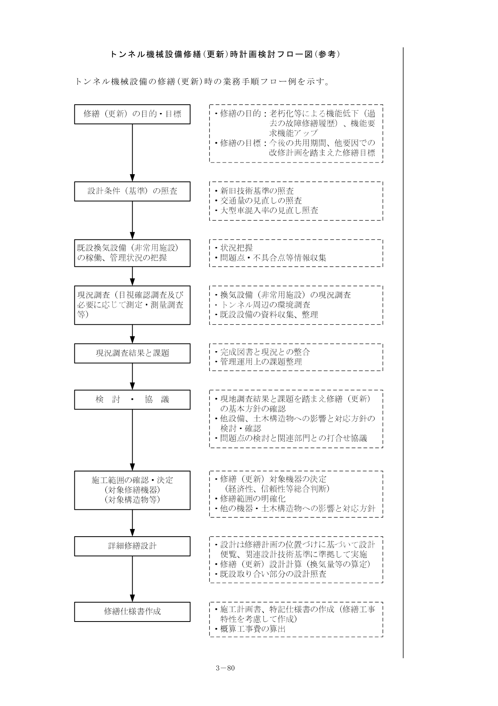

トンネル機械設備修繕（更新）時計画検討フロー図（参考）

{/* <!-- 図・表のページ対応表
=== 第3章 トンネル機械設備（3/3）===
[図]
m03-fig-26.png: 図3-9-1(c) 制御方式選定のイメージ図 (p60)
m03-fig-27.png: 図3-9-2(a) 制御システム構成例（ジェットファン方式） (p61)
m03-fig-28.png: 図3-9-2(g) 監視操作制御設備の基本的な計画・設計フロー (p66)
m03-fig-29.png: 図3-9-3 トンネル内火災発生時の運転の例 (p68)
m03-fig-30.png: 図3-10-1 トンネル等級区分 (p70)
m03-fig-31.png: 図3-10-4(a) 消火栓設置例 (p74)
m03-fig-32.png: 図3-10-4(b)(c) 消火栓設備系統・水噴霧設備系統の例 (p75-76)
m03-fig-33.png: 図3-10-5 非常用施設のフロー (p77)
m03-fig-34.png: トンネル機械設備修繕（更新）時計画検討フロー図 (p81)
[表]
m03-tbl-14.png: 表3-10-2 トンネル等級別の非常用施設 (p72)
m03-tbl-15.png: 表3-10-3 機械設備としての非常用施設 (p73)
--> */}
