## 第3節 設計

### 1. 設計一般（標準）

> **〔解 説〕**
>
> 消雪設備は、取水施設と散水施設に大別される。取水施設は、設置地点の種々状況を勘案し関係法令を守って必要水量及び水圧の安定確保を行えるように、また散水施設は道路等の構造、交通状況、沿道状況に応じて路面上の消雪を効果的に行えるよう計画しなければならない。
>
> ここで扱う消雪設備とは、井戸または河川より取水し路面に散水するまでの施設をいう。消雪設備を設計するに当たって最も重要なことは、消雪に必要な水の安定確保である。

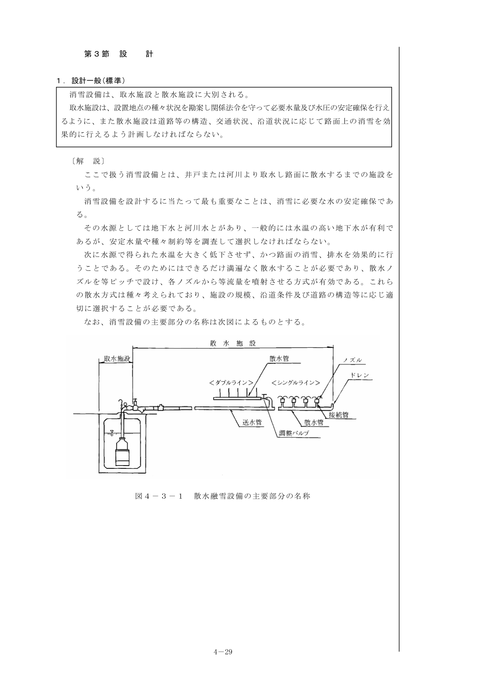

図4-3-1 散水融雪設備の主要部分の名称

### 2. 取水施設（標準）

> **〔解 説〕**
>
> 取水施設の構造は、使用水源により異なるが、所要の水量及び水圧が確保できるよう設計しなければならない。

取水施設の構造は、使用水源により次のように分類できる。

**地下水の場合** — 取水井戸 → 送水（揚水）ポンプ → 送水管

**河川水使用の場合**

1. 横ピット取水 — 河川 → 受水槽 → 送水ポンプ → 送水管
2. 導水路ピット取水 — 河川 → 導水路 → 受水槽 → 送水ポンプ → 送水管

#### 2-1 取水井戸の設計

> **〔解 説〕**
>
> 井戸の設計諸元は、地下水に関する諸データを収集し、帯水層の厚さや位置を推定し、概略の取水可能量を求める。消雪に必要な水量が得られない場合には、さく井場所を変えて再検討することになる。

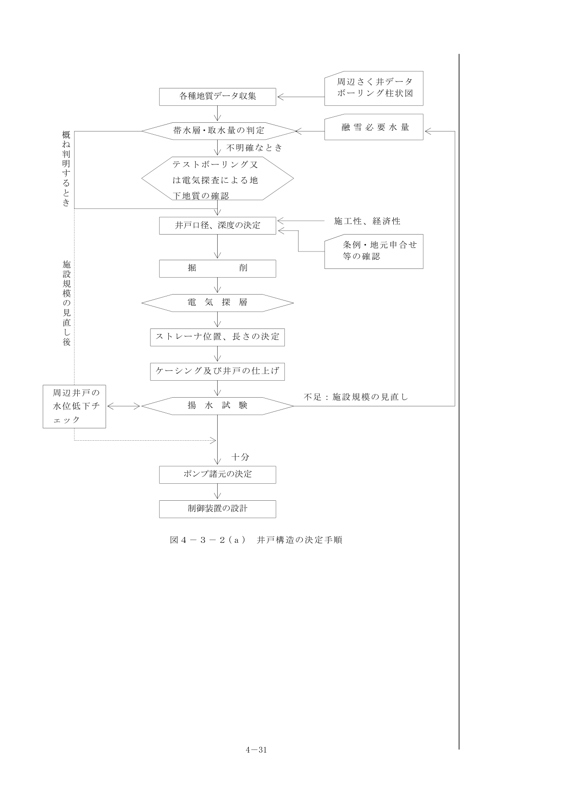

図4-3-2(a) 井戸構造の決定手順

**(2) 井戸口径、深度**

井戸口径とストレーナ長さの関係は次式で表される。

$$B = \frac{Q}{\pi \cdot L \cdot v}$$

ここに、$B$：井戸口径(cm)、$Q$：供給水量(cm³/s)、$L$：井戸ストレーナ長さ(cm)、$v$：井戸ストレーナを通過する水の見掛け流速(cm/s)

水の見掛け流速の範囲：

1. 帯水層の砂の60%が1mm以上のとき — $v < 0.2$ cm/s
2. 帯水層の砂の40%またはそれ以上が0.5mm以下のとき — $v < 0.1$ cm/s
3. 帯水層の砂の40%またはそれ以上が0.25mm以下のとき — $v < 0.05$ cm/s

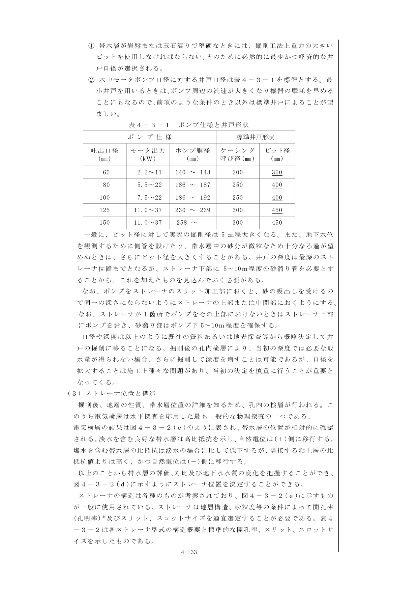

表4-3-1 ポンプ仕様と井戸形状

**(3) ストレーナ位置と構造**

図4-3-2(c)(d) 電気検層結果とストレーナ位置

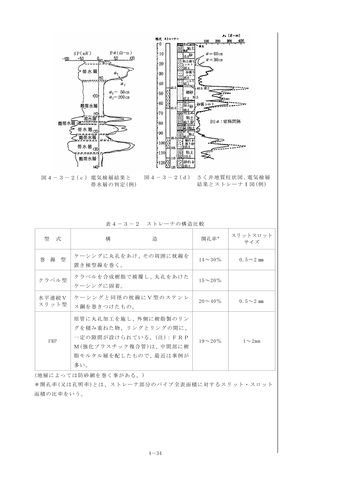

表4-3-2 ストレーナの構造比較

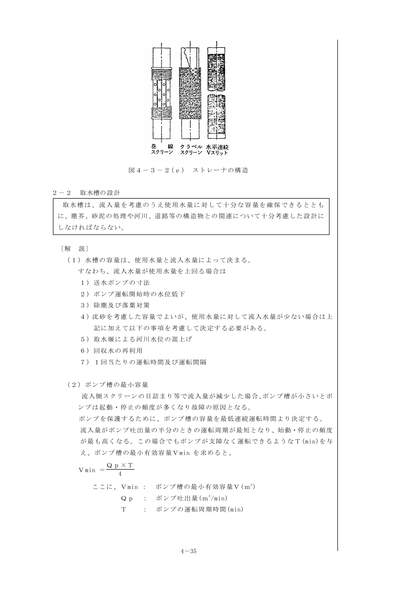

図4-3-2(e) ストレーナの構造

#### 2-2 取水槽の設計

> **〔解 説〕**
>
> 取水槽は、流入量を考慮のうえ使用水量に対して十分な容量を確保できるとともに、塵芥、砂泥の処理や河川、道路等の構造物との関連について十分考慮した設計にしなければならない。

**(2) ポンプ槽の最小容量**

$$V_{min} = \frac{Q_p \times T}{4}$$

ここに、$V_{min}$：ポンプ槽の最小有効容量(m³)、$Q_p$：ポンプ吐出量(m³/min)、$T$：ポンプの運転周期時間(min)（標準5分）

**(3)** 河川水には塵芥が浮遊している。これが取水槽内に入ると、送水ポンプストレーナの目詰まりや散水孔の目詰まりを生じ、正常運転が困難となる場合がある。

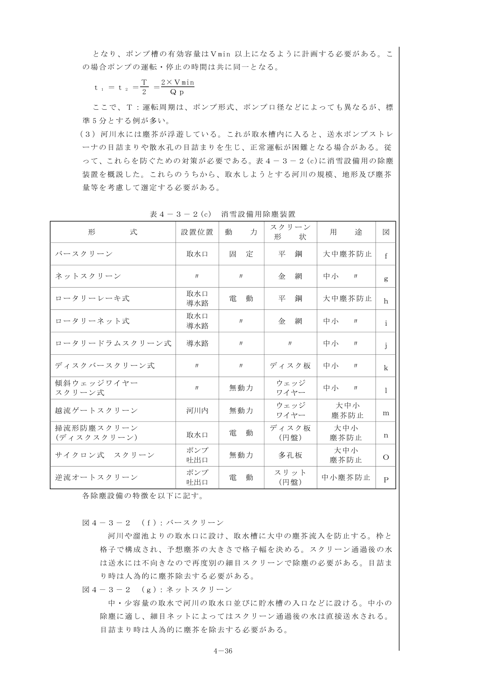

表4-3-2(c) 消雪設備用除塵装置

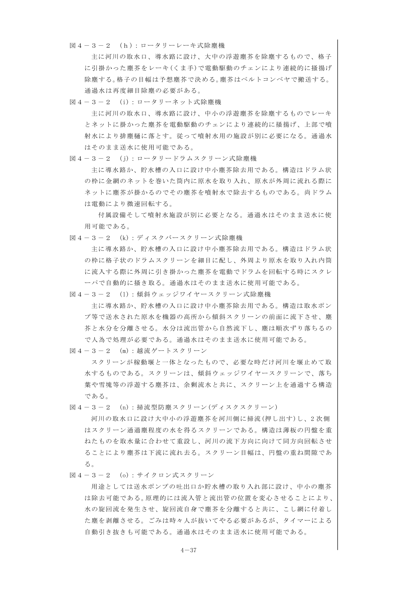

図4-3-2(f)〜(p) 各種除塵装置

**(5) 横ピット式取水による場合**

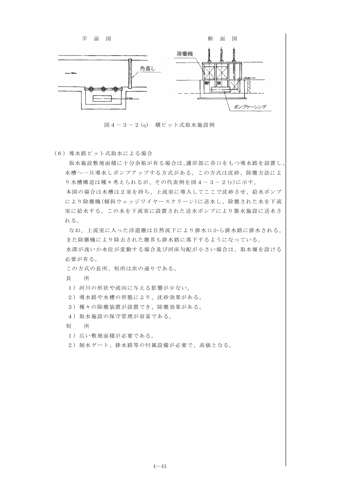

図4-3-2(q) 横ピット式取水施設例

**(6) 導水路ピット式取水による場合**

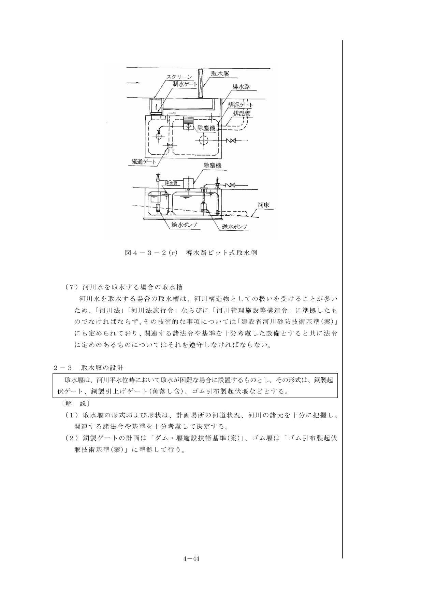

図4-3-2(r) 導水路ピット式取水例

#### 2-3 取水堰の設計

> **〔解 説〕**
>
> 取水堰は、河川平水位時において取水が困難な場合に設置するものとし、その形式は、鋼製起伏ゲート、鋼製引上げゲート（角落し含）、ゴム引布製起伏堰などとする。

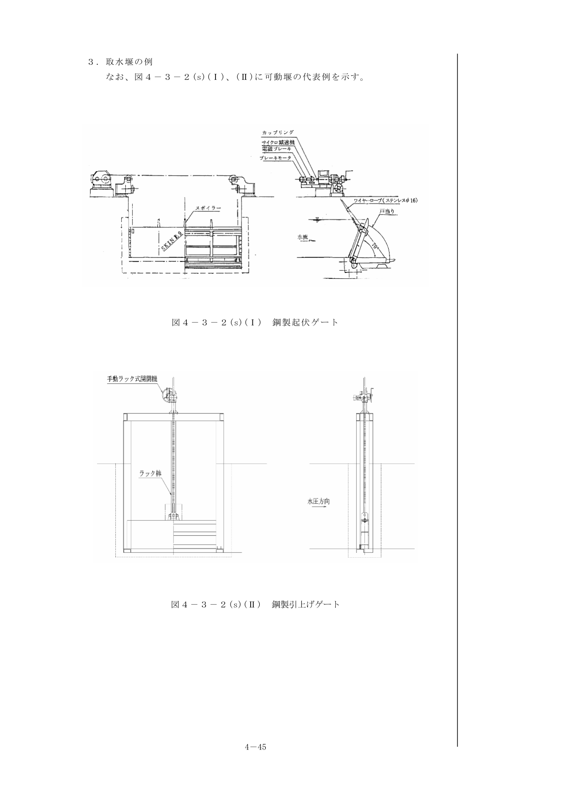

図4-3-2(s) 可動堰の代表例（鋼製起伏ゲート・鋼製引上げゲート・ゴム引布製起伏堰）

### 3. ポンプ設備（標準）

#### 3-1 ポンプ形式及び容量

> **〔解 説〕**
>
> 消融雪用ポンプは電動機駆動とし、形式・容量は吐出量、揚程、吸込性能、運転条件、維持管理の容易性等を考慮して決定する。

**(1) ポンプ形式**

消融雪に使用されるポンプは、ターボ式遠心ポンプがほとんどである。

1. ポンプの形式は、送水量、水質、運転操作方法および維持管理等を勘案して選択するが、据付面積の制約、取扱いの容易さから水中モータポンプを標準とする。
2. 深井戸用ポンプと一般清水用ポンプがあり、現場条件を考慮のうえ選定する。

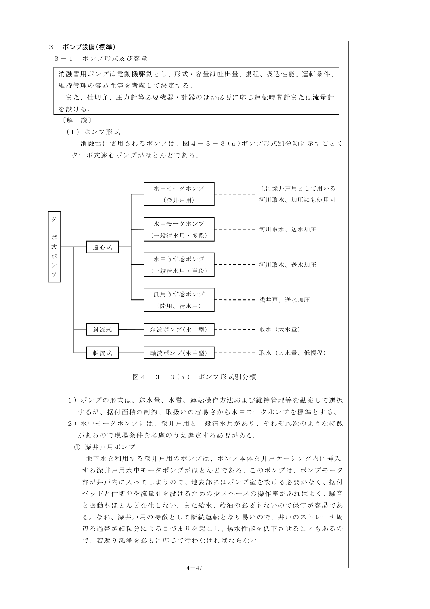

図4-3-3(a)(b) ポンプ形式別分類・型式図

**(2) ポンプ口径**

$$d = 146\sqrt{\frac{Q}{v}}$$

ここに、$d$：ポンプ口径(mm)、$Q$：吐出量（供給必要水量）(m³/min)、$v$：吸込流速(m/s)

**(3) ポンプ容量**

$$P = \frac{0.163 \times \rho \cdot Q \cdot H}{1000 \times \eta_P} \times (1 + \alpha)$$

ここに、$P$：ポンプ軸動力(kW)、$\rho$：水の単位体積当り質量(1000 kg/m³)、$Q$：吐出量(m³/min)、$H$：全揚程(m)、$\eta_P$：ポンプ効率、$\alpha$：余裕率

全揚程は次式で求められる。

$$H = (h_1 + h_2 + h_3) + h_L + h_v \quad \text{(m)}$$

ここに、$h_1$：地面から運転水位までの高さ（地下揚程）、$h_2$：地上からの押し上げ高さと散水に必要な水頭高（地上揚程）、$h_3$：渇水期における水位低下量（推定）、$h_L$：管内の損失水頭、$h_v$：速度水頭

**(4) ポンプ効率**

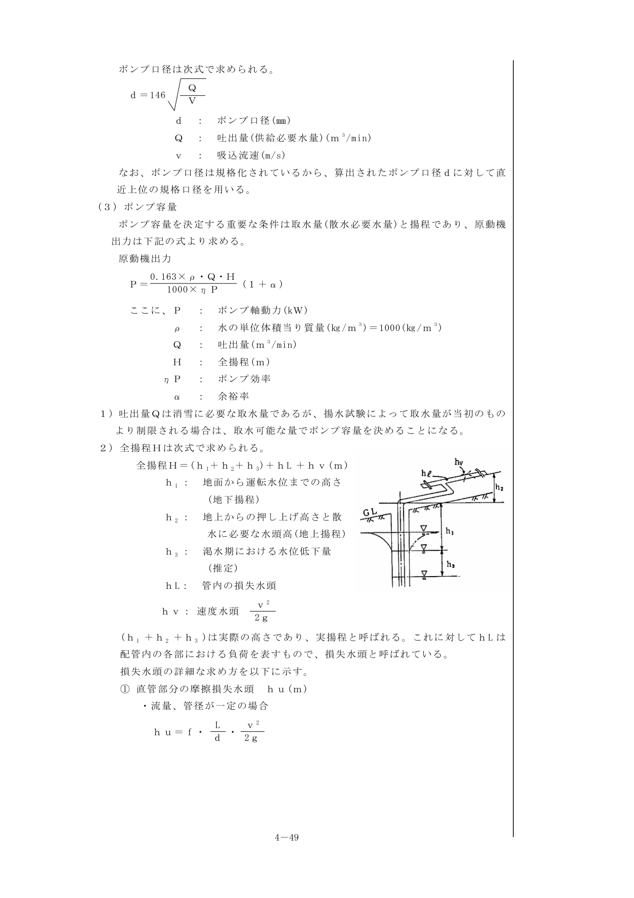

図4-3-3(c) ポンプ効率（JIS B8324 深井戸用水中モータポンプ効率より）

**(5) ポンプ選定図表**

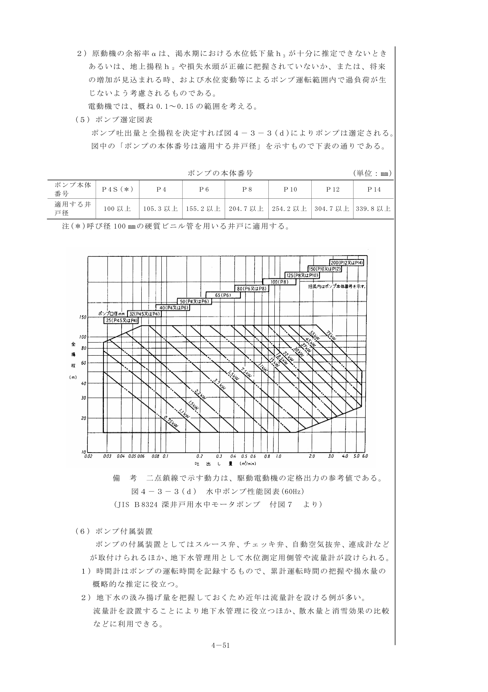

図4-3-3(d) 水中ポンプ性能図表(60Hz)

**(6) ポンプ付属装置**

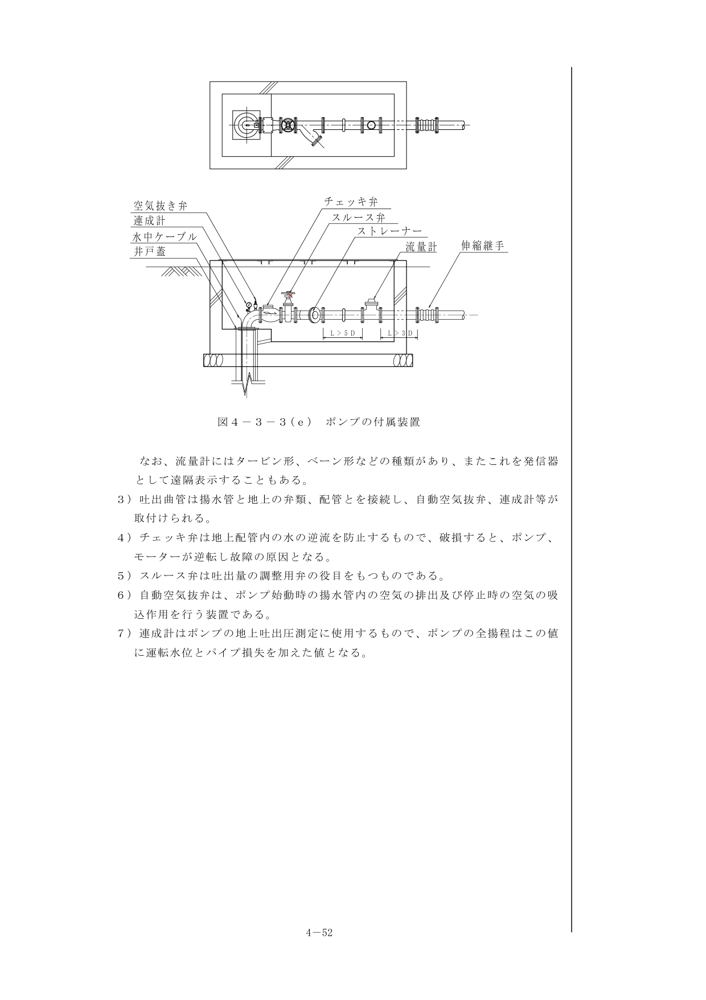

図4-3-3(e) ポンプの付属装置

**資料：管継手類損失係数**

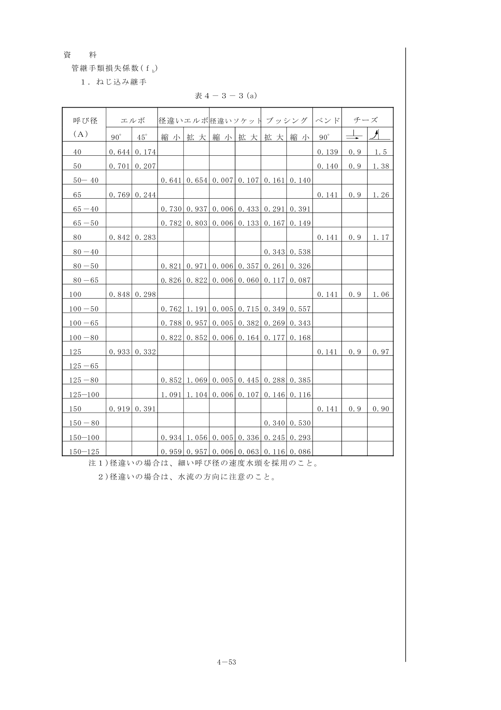

表4-3-3(a)(b) 管継手類損失係数表（ねじ込み継手・溶接継手、弁類）

#### 3-2 ポンプ台数

> **〔解 説〕**
>
> ポンプの設置台数は信頼性及び維持管理等を考慮のうえ決定することが望ましい。

送水ポンプに故障が生じると冬期間の修繕には相当長日数を要し、この間送水ポンプが1台の場合はその間稼動できなくなる。この様に、ポンプ故障の危険分散を考慮して複数台数設置することが望ましい。

### 4. 散水施設（標準）

#### 4-1 送水管の設計

> **〔解 説〕**
>
> 送水管は、配管場所、送水量、水圧、管内流速、耐久性等を考慮し、管径、管厚及び材質の決定を行うものとする。

$$D = 146\sqrt{\frac{Q}{V}}$$

ここに、$D$：管径(mm)、$Q$：散水量(m³/min)、$V$：流速(m/sec)（管内流速は1〜2m/s を標準）

1. 送水管並びに散水管は配管用炭素鋼管を標準とする。
2. 送水管並びに散水管は、ポンプ停止時に管内が完全に水抜きできるように勾配を決めるものとし、配管及び弁等が凍結により破損しないものとする。

#### 4-2 散水管、散水ノズルの設計

> **〔解 説〕**
>
> 散水構造は各種あるが、散水延長、散水場所、交通の種類及び水源の種類などに応じて適切に選択する必要がある。

表4-3-4(a) 散水構造と特徴

**(1) シングルライン用ノズル**

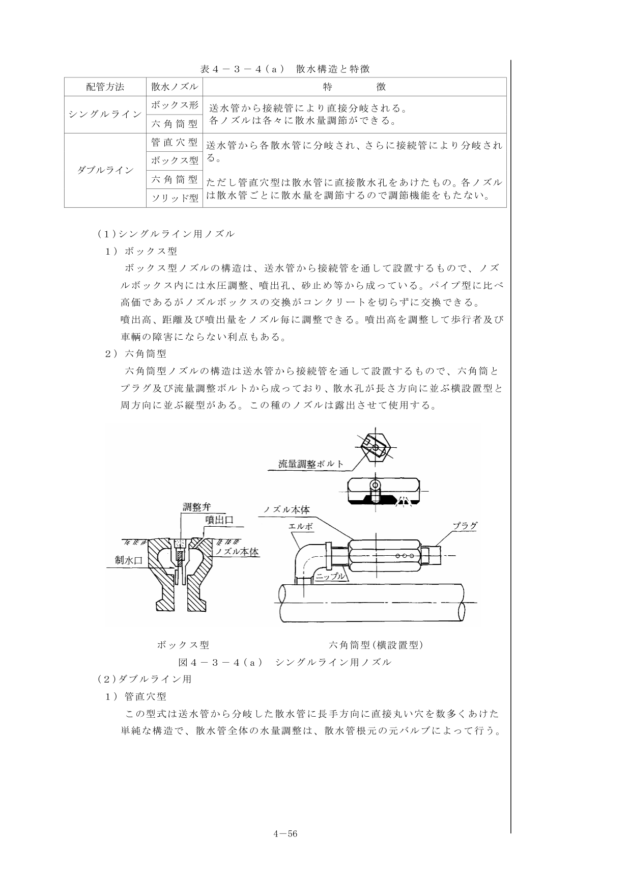

図4-3-4(a) シングルライン用ノズル（ボックス型・六角筒型）

**(2) ダブルライン用**

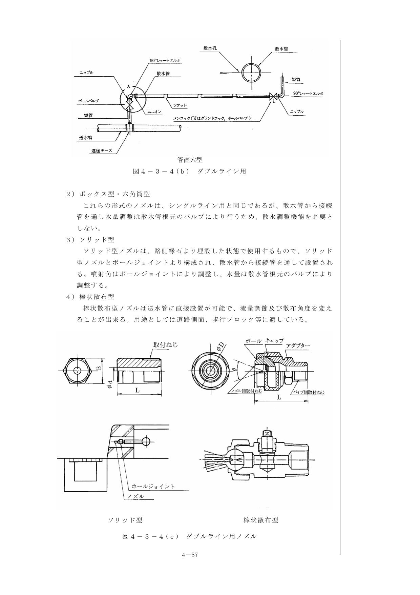

図4-3-4(b)(c) ダブルライン用ノズル（管直穴型・ソリッド型・棒状散布型）

#### 4-3 ノズル諸元の決定

> **〔解 説〕**
>
> ノズルピッチ、孔数、孔径及び噴出角度は、消雪効果、用途別条件を考慮して決めなければならない。

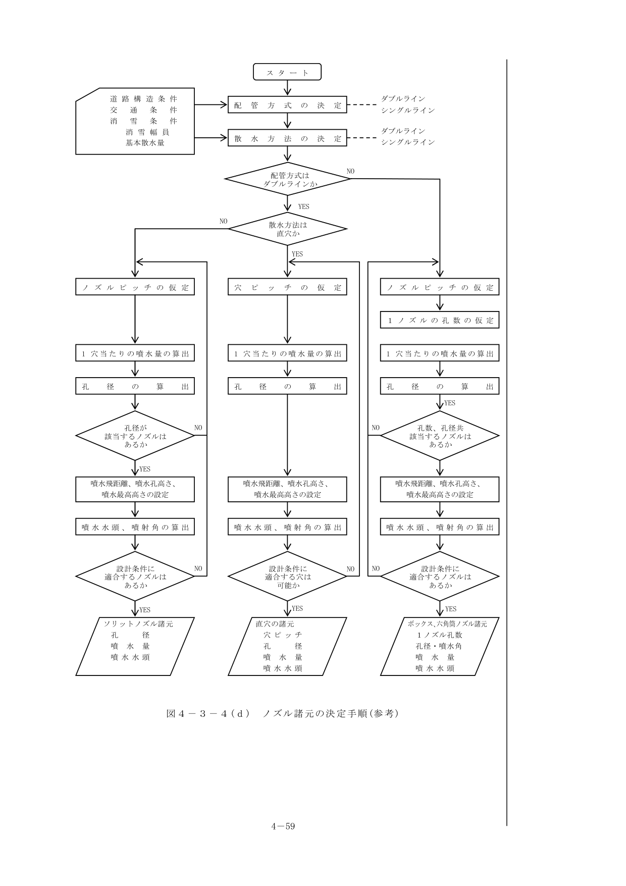

図4-3-4(d) ノズル諸元の決定手順（参考）

**(2) ノズル諸元の決定**

1孔当たり噴水量：

$$q_s = \frac{1}{n} \cdot P \cdot q \cdot W$$

ここに、$q$：単位面積当たり必要散水量(L/m²・min)、$W$：融雪幅員(m)、$P$：ノズルピッチ(m)、$n$：1ノズルの孔数

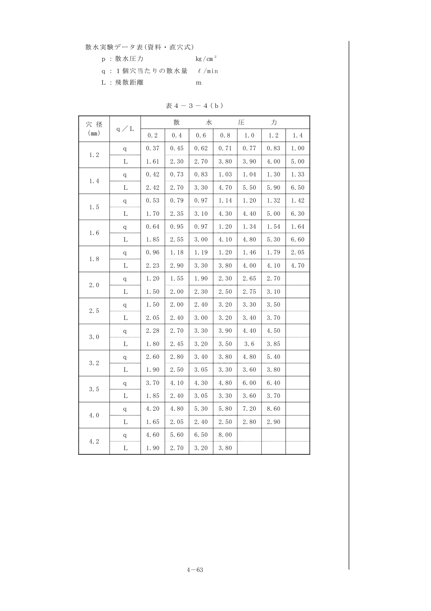

表4-3-4(b) 散水実験データ表（直穴式）

### 5. 排水施設

> **〔解 説〕**
>
> 排水施設は、消雪水及びシャーベット状の雪が路面から排水溝に容易に流下処理できるものであり、それらは路面の横断勾配、排水溝、集水桝、路面状況等を考慮した施設の設計を行うものとする。

表4-3-5 対象道路の横断勾配

| 区分 | 片側1車線の場合 | 片側2車線以上の場合 |
|---|---|---|
| 車道 | 1.5% | 2.0% |
| 歩道及び駐車場等 | 1.5〜2.5% | — |

> ※ブロック舗装には適用しない。

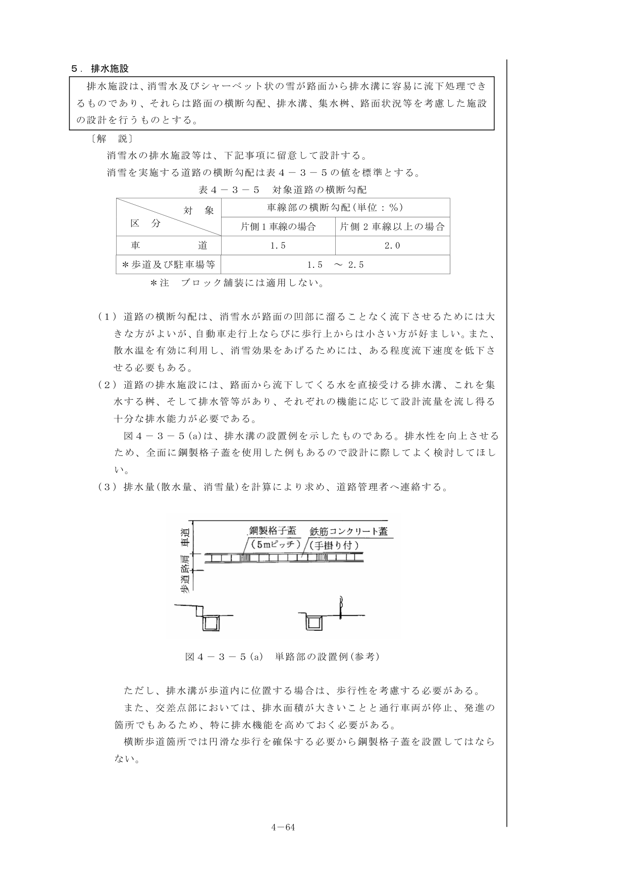

図4-3-5(a)(b) 排水溝の設置例（参考）

{/* <!-- 図・表のページ対応表
=== 第4章 消融雪設備（2/3）===
[図]
m04-fig-07.png: 図4-3-1 散水融雪設備の主要部分の名称 (p30)
m04-fig-08.png: 図4-3-2(a) 井戸構造の決定手順 (p32)
m04-fig-09.png: 図4-3-2(c)(d) 電気検層結果とストレーナ位置 (p35)
m04-fig-10.png: 図4-3-2(e) ストレーナの構造 (p36)
m04-fig-11.png: 図4-3-2(f)〜(p) 各種除塵装置 (p38-43)
m04-fig-12.png: 図4-3-2(q) 横ピット式取水施設例 (p44)
m04-fig-13.png: 図4-3-2(r) 導水路ピット式取水例 (p45)
m04-fig-14.png: 図4-3-2(s) 可動堰の代表例 (p46-47)
m04-fig-15.png: 図4-3-3(a)(b) ポンプ形式別分類・型式図 (p48-49)
m04-fig-16.png: 図4-3-3(c) ポンプ効率 (p50)
m04-fig-17.png: 図4-3-3(d) 水中ポンプ性能図表(60Hz) (p52)
m04-fig-18.png: 図4-3-3(e) ポンプの付属装置 (p53)
m04-fig-19.png: 図4-3-4(a) シングルライン用ノズル (p57)
m04-fig-20.png: 図4-3-4(b)(c) ダブルライン用ノズル (p58)
m04-fig-21.png: 図4-3-4(d) ノズル諸元の決定手順 (p60)
m04-fig-22.png: 図4-3-5(a)(b) 排水溝の設置例 (p65-66)
[表]
m04-tbl-02.png: 表4-3-1 ポンプ仕様と井戸形状 (p34)
m04-tbl-03.png: 表4-3-2 ストレーナの構造比較 (p35)
m04-tbl-04.png: 表4-3-2(c) 消雪設備用除塵装置 (p37)
m04-tbl-05.png: 表4-3-3(a)(b) 管継手類損失係数表 (p54-55)
m04-tbl-06.png: 表4-3-4(a) 散水構造と特徴 (p57)
m04-tbl-07.png: 表4-3-4(b) 散水実験データ表（直穴式） (p64)
--> */}
