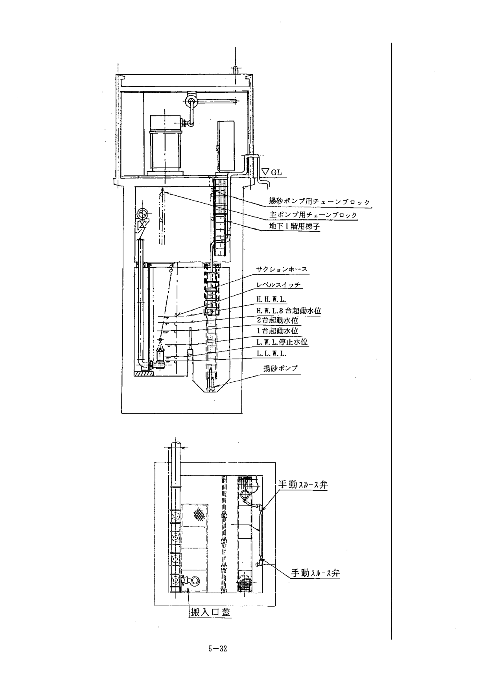
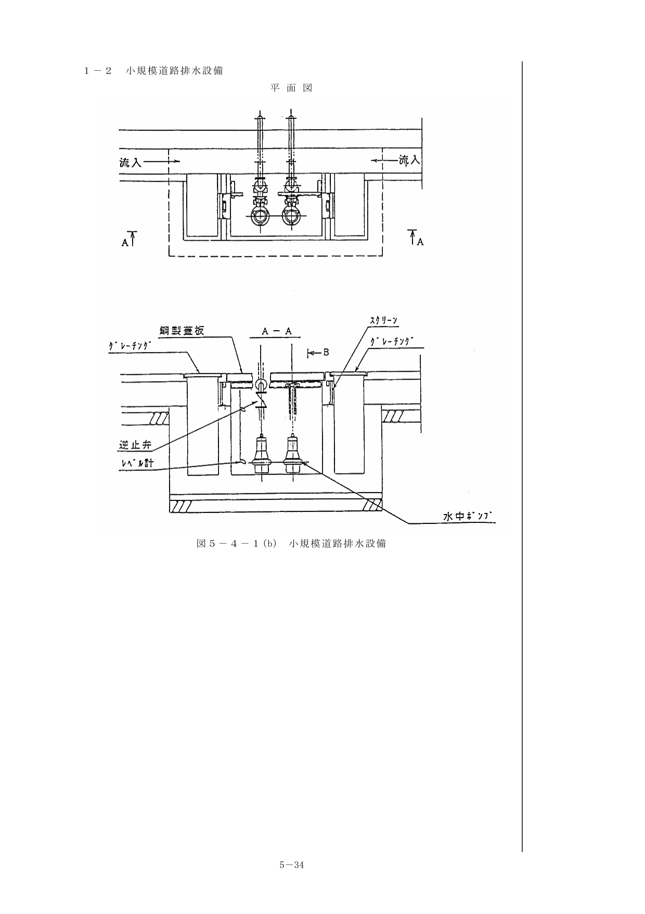
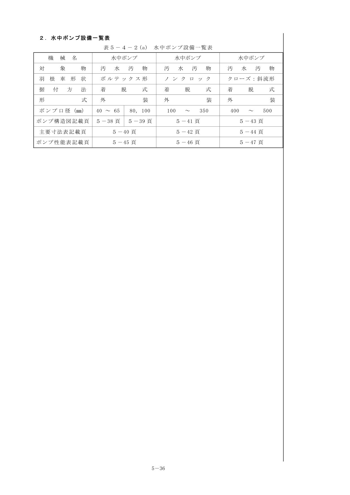

## 第3節 設計（続き）

### 5. 電源操作設備

#### 5-1 電源設備

排水ポンプ設備の運転操作に必要な電力は、商用電源を標準とするが、必要に応じて停電時などの非常時に於いても運転操作が可能な設備とする。

> **（解 説）**
>
> 1. 商用電源での契約電力には、低圧電力と高圧電力がある。
>    - **低圧電力** — 低圧で電気の供給を受けて動力を使用するもので、契約電力が原則として50kW（AC200V）未満であるもの。
>    - **高圧電力** — 高圧で電気の供給を受けて動力を使用するもので、契約電力が原則として50kW（AC6000V）以上であるもの。
> 2. コンパクト型無閉塞道路排水システムに用いるポンプの始動方式はインバータ方式とするため、電源設備において高調波抑制対策を必要とする場合がある。

#### 5-2 予備動力設備

予備動力設備は、ディーゼルエンジン駆動陸用交流発電機（JEM1354）、防音型パッケージ式を標準とする。

> **（解 説）**
>
> 1. 運転時間については、一般的に停電時間は短いと考えられるが、災害時での長時間停電も考慮し、最低24時間を基本にする。
> 2. 燃料タンクの容量算定にあたっては、現場条件あるいは消防法、各条例等を考慮すること。
>
> **自家発電設備の容量計算（インバータ起動の場合）：**
>
> - **PG1（定常時負荷容量による出力）** — 同時運転される機器の組合せの最大を採る。
> - **PG2（過渡時最大電圧降下による出力）** — 始動容量最大の電動機の始動容量から算出。
> - **PG3（過渡時最大短時間耐量による出力）** — ベース負荷の有効電力・無効電力から算出。
> - **PG4（高調波負荷・単相負荷を含む場合の出力）** — 単相負荷の等価逆相容量と高調波負荷容量から算出。

表5-3-5(a) 消防法第9条の三（危険物と指定数量の関係）

| 種別 | 品名 | 指定数量 | 引火点 | 例 |
|---|---|---|---|---|
| 第4類 | 第1石油類 | 200 | 21℃未満 | ガソリン |
| 第4類 | 第2石油類 | 1,000 | 21℃以上 70℃未満 | 軽油 |
| 第4類 | 第3石油類 | 2,000 | 70℃以上 200℃未満 | 重油 |
| 第4類 | 第4石油類 | 6,000 | 200℃以上 | シリンダ油 |

#### 5-3 監視操作制御設備

道路排水設備の監視操作制御設備は、排水システムや設備規模などを検討のうえ決定するものとする。

> **（解 説）**
>
> 1. 排水システム、規模、管理および運用体制に対応し、信頼性および安全性が高く、操作制御性に優れたものとする。
> 2. 遠方監視制御盤等への信号の伝送を光ファイバーケーブルで行う場合は、「電気通信編」を参考に整合をはかること。
> 3. ポンプの自動運転に使用する水位検出方法：

表5-3-5(b) 水位計

| 種類 | 動作 | 特徴 |
|---|---|---|
| 電極式 | 導電性液に電極を入れ、電極間の短絡により液面を検出 | 計測不適。接点のみ取出し可能。可動部なし。警報、ON-OFF運転に広く使用。 |
| フロート式 | 浮力を利用してフロートの変位を取り出し計測 | 計測、接点の取出し可能。液面の波立ちの影響大。 |
| フロートスイッチ式 | フロート内にスイッチを組み込み容器の姿勢により水位を検出 | 接点のみ取り出し可能。排水ポンプのON-OFF運転、水位警報に使用。 |
| 投込圧力式 | 水中に投入した受圧部が水位変化を水頭圧として受ける | 構造が簡単。取扱いが容易。半導体式、水晶式など種類が豊富。 |

> **4. 検出させる水位：**
> - 異常低水位：ポンプの空転防止水位
> - 異常高水位：ポンプ槽満水位
> - ポンプ運転水位：自動運転における起動水位
> - ポンプ停止水位：自動運転における停止水位
>
> **5.** 複数台のポンプの自動運転は交互運転方式を用い、故障したポンプがある場合は飛び越し運転ができるものとする。
>
> **6. 遠隔化システムの基本計画**
> 信頼性、安全性が高いこと、操作性、耐久性、経済性に優れていること、緊急時の対応や維持管理が容易であることを基本的な要件とする。

### 6. その他の設備

#### 6-1 流入路

流入路は、急激な方向変化や甚しい流速変化が生じない構造とする。

> **（解 説）**
>
> 1. 道路排水設備は、路側近くに設置されることが多く、流入路は比較的短くなるため、流入路内での損失水頭については特に考慮しないものとする。
> 2. 流入路は、土砂などが堆積しにくいように形状や流速について考慮するものとする。

#### 6-2 スクリーン

ポンプの吸込側には、除塵用スクリーンを設けるものとする。

> **（解 説）**
>
> 1. 除塵設備の一段目は、道路面の格子形側溝ますふた（グレーチング）によるものとし、二段目スクリーンはポンプ吸込側に設ける。
> 2. 二段目スクリーンの材質は、ステンレス鋼（SUS304）とする。

表5-3-6(a) スクリーン有効目幅

| ポンプ口径 | 40mm | 50 | 80 | 100 | 150 | 200 | 250 | 300 | 400 | 500 |
|---|---|---|---|---|---|---|---|---|---|---|
| 有効目幅 | 25mm | 25 | 35 | 35 | 40 | 40 | 40 | 50 | 50 | 50 |

> - 粗目スクリーンを置く場合は、有効目幅60〜150mmとする。
> - 二段目スクリーンの傾斜角度：手掻き式除塵方式 45〜60°、機械除塵方式 75°前後、小規模 90°
> - コンパクト型無閉塞道路排水システムを採用の場合は、二段目スクリーンを省略することができる。

#### 6-3 排水路・流末

排水路を設ける場合の断面形状及び勾配は、水路内に沈澱物が堆積しないよう適正な流速が確保されるように定めるものとする。

> **（解 説）**
>
> マニングの公式：
>
> 

>
> $$V = \frac{1}{n} \cdot R^{2/3} \cdot I^{1/2}$$
>
> 

>
> 排水路満流時の流速は、0.1〜3.0m/secの範囲とすること。

表5-3-6(b) 粗度係数

| 水路材 | nの範囲 | nの標準値 |
|---|---|---|
| 鋼 | 0.010〜0.014 | 0.012 |
| 鋳鉄 | 0.011〜0.016 | 0.014 |
| コンクリート | 0.010〜0.020 | 0.014 |
| 木材 | 0.012〜0.018 | 0.015 |

#### 6-4 排水設備建屋・防音

排水設備建屋を設ける場合は、ポンプの据付、運転、保守点検に必要な大きさを確保するものとする。

> **（解 説）**
>
> 騒音規制法では生活環境を保全すべき地域を、都道府県知事が指定し、規制基準は環境庁長官の定めた範囲内で定められる。

表5-3-6(c) 特定工場などにおいて発生する騒音の規制基準（単位 dB(A)）

| 区域の区分 | 昼間 | 朝・夕 | 夜間 |
|---|---|---|---|
| 第1種区域 | 45〜50 | 40〜45 | 40〜45 |
| 第2種区域 | 50〜60 | 45〜50 | 40〜50 |
| 第3種区域 | 60〜65 | 55〜65 | 50〜55 |
| 第4種区域 | 65〜70 | 60〜70 | 55〜65 |

#### 6-5 クレーン設備

排水設備の建屋には、排水ポンプの設置および維持点検、整備を考慮して必要に応じてクレーン設備を設けるものとする。クレーン設備は、手動式ギャード・トロリ付チェンブロックを標準とし、必要により電動ホイストとする。

#### 6-6 換気設備

排水設備の建屋には、換気設備を設けるものとする。

> **（解 説）**
>
> 換気装置は、電動機・自家発電設備からの放熱、配電盤からの放熱、内燃機関の燃焼に必要な空気の取り入れ等の目的で設置する。
> - 小規模の機場で自家発電設備を設置しない場合は、自然換気を標準とする。
> - 外気取入口の風速は、2.5〜6m/sec（有効開口通過速度）とする。

#### 6-7 照明設備

排水設備の建屋には、運転及び保守管理に必要な照明設備を設けるものとする。また、必要に応じて停電時の保安灯を設けるものとする。

表5-3-6(f) 建屋内所要照度

| 場所 | 所要照度（lx） |
|---|---|
| 操作室床面 | 300 |
| 電気室床面 | 150 |
| ポンプ据付床面 | 100 |
| 除塵機据付床面 | 50 |
| 吸水路水面 | 30 |

## 第4節 参考資料

### 1. 施設参考図

#### 1-1 大規模道路排水設備

図5-4-1(a) 大規模道路排水設備

#### 1-2 小規模道路排水設備

図5-4-1(b) 小規模道路排水設備

### 2. 水中ポンプ設備一覧表

表5-4-2(a) 水中ポンプ設備一覧表

水中ポンプ構造図、主要寸法表、性能表については参考資料を参照のこと。

## 第5節 修繕工事への対応（参考）

### 5-1 道路排水設備修繕(更新)計画

設備の修繕には、部品の交換等で設備システムへの影響の無い小規模な修繕と主要構成機器の更新等で設備システムに影響を与える大規模な修繕がある。

いずれの修繕方法を取るかは、緊急性、予算面を踏まえ、以下に示すような要求事項を整理することで修繕の位置づけ、どの準拠基準を適用するべきかが明確になる。

1. 修繕の目的 — 老朽化等による機能低下（過去の故障・修繕履歴）、要求機能アップ等
2. 修繕の目標 — 今後の供用期間、他要因での改修計画を踏まえた修繕目標
3. 既設施設の経過年数、土木関連構造物も含めた施設全体の健全度評価
4. 施設目的に適合した信頼性の確保（施設の種別、規模、地域性）
5. 手戻りの無い修繕計画
6. 費用対効果（経済性）

{/* <!-- 図・表のページ対応表
=== 第5章 道路排水設備（2/2） ===
[図]
m05-fig-12.png: 大規模道路排水設備 施設参考図 (p33-34)
m05-fig-13.png: 小規模道路排水設備 施設参考図 (p35-36)
[表]
m05-tbl-02.png: 水中ポンプ設備一覧表 表5-4-2(a) (p37)
m05-tbl-03.png: 水中ポンプ構造図（ボルテックス形 40-65） (p39)
m05-tbl-04.png: 水中ポンプ構造図（ボルテックス形 80-100） (p40)
m05-tbl-05.png: 水中ポンプ主要寸法表（ノンクロッグ形 100-350） (p41-42)
m05-tbl-06.png: 水中ポンプ構造図（クローズ斜流形 400-500） (p43-44)
m05-tbl-07.png: 水中ポンプ性能表（ボルテックス形） (p45)
m05-tbl-08.png: 水中ポンプ性能表（ノンクロッグ形） (p46-47)
m05-tbl-09.png: 水中ポンプ性能表（クローズ斜流形） (p48)
--> */}
