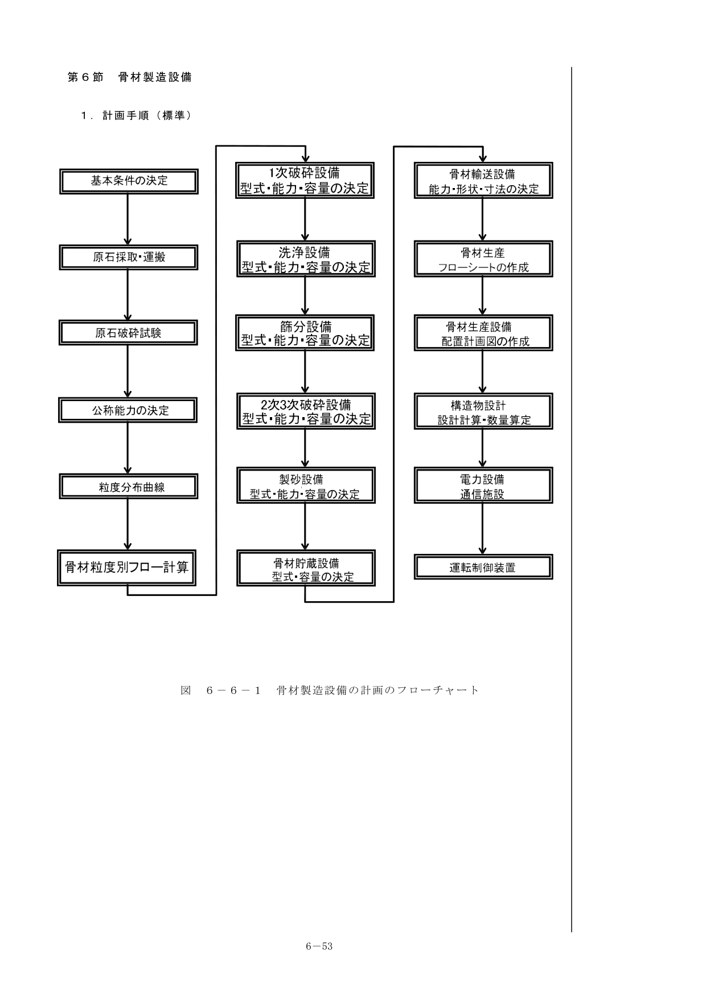

## 第4節 コンクリート製造設備

### 1. 計画一般

1. コンクリート製造設備は、ダムサイトの地形、地質等を勘案して、コンクリート打ち込み設備の近くに配置する。
2. コンクリート製造設備は、諸材料の計量及び練り混ぜを円滑に行い、所定の配合の均質なコンクリートを安定して製造できる設備とする。

> **（解 説）**
>
> コンクリート製造設備は次の機器類で構成される：操作室、諸材料貯蔵ビン、計量装置、記録装置、ミキサ、コンクリートホッパ、試験用コンクリート採取装置等

### 2. 機種の選定

#### 2-1 混合形式

ダムコンクリートは、セメントの使用量を極力少なくし所要の強度を安定して確保することが求められる。

- **(1) 一括練り（Single Mixing:SM）** — 従来工法。SEC工法もある。
- **(2) 分割練り（Double Mixing:DM）** — 上段のボルテックスミキサーによりモルタルを先練りし、下段の2軸強制練ミキサで粗骨材と混ぜる工法。

#### 2-2 生産能力

**(1) ミキサー形式：**

- 重力式（傾胴形） — 所要動力が小さく保守管理が容易
- 強制攪拌式（パン形式・ボルテックス型）
- 2軸強制式（パグミル型） — 練り混ぜ時間が半分で均一な品質が得られ、RCD工法で多用

**(2) コンクリート製造能力：**

$$Q = \frac{3600 \cdot q \cdot N \cdot E}{C_m}$$

ここに、Q：コンクリート製造能力(m³/h)、q：ミキサ容量(m³)、N：ミキサ数、E：作業効率＝0.9、$C_m$：サイクルタイム(sec)

#### 2-3 貯蔵ビン（参考）

骨材ビン容量は一般的にはバッチャープラント運転中の2時間程度の滞留量を確保する。

#### 2-4 計量器

現在は殆どロードセル式計量器となっている。

#### 2-5 水分計

水分計にはRI式、静電容量式、重量式、赤外線式、電磁波式がある。

#### 2-7 騒音対策

ミキサからウエットホッパへのコンクリート落下部にゴムライナを取付け、バッチャープラント建家の壁面に防音材を取り付ける。

## 第5節 セメント輸送および貯蔵設備

### 1. 計画一般

1. セメント輸送および貯蔵設備は、セメントの品質を低下させることなく円滑に輸送および貯蔵できるものとする。
2. 設備は、コンクリート製造設備に隣接して設ける。

### 2. 機種の選定と組合せ

1. セメント貯蔵設備は、鋼製サイロを標準とする。
2. セメント輸送設備は、設計箇所の地形、輸送条件等に適合した機種を選定する。

> **（解 説）**
>
> セメントコンテナ車でダムサイトのセメントサイロまで運搬されたセメントは、コンテナ車に装備するブロワーでセメントサイロに圧送される。セメントサイロからバッチャープラントへのセメント輸送には、スクリューコンベヤ・バケットエレベータ方式と空気輸送方式が最も多く用いられている。

### 3. 所要能力

#### 3-1 セメント輸送設備の所要能力

$$Q = \frac{A_c \cdot C}{1000}(1 + \alpha)$$

ここに、Q：所要能力(t/h)、$A_c$：時間最大打込み量(m³/h)、C：単位セメント量(kg/m³)、$\alpha$：余裕率＝0.5

#### 3-2 セメントサイロ

$$C_s = \frac{V \cdot C \cdot D}{d \cdot 1000} \cdot \alpha$$

ここに、$C_s$：サイロの容量(t)、V：月最大打込み量(m³/月)、D：ストック日数（2〜4日を標準）、d：月最大打込み月当たり作業日数(日/月)、$\alpha$：余裕率（一般に1.1）

サイロ容量の規格：200, 300, 400, 500, 600, 700, 800, 900, 1000(t)。1000t以上必要な場合は2基以上の組合せとする。

## 第6節 骨材製造設備

### 1. 計画手順

図6-6-1 骨材製造設備の計画のフローチャート

### 2. 機種の選定と組合せ

#### 2-2 骨材粒径別製造フロー計算表

骨材生産量粒径別フロー計算表により、原石粒度から各破砕段階を経て製品骨材が生産される過程を計算する。

#### 2-3 骨材プラントの稼働率・ロス率・洗浄水量（参考）

| 設備名 | 稼働率 |
|---|---|
| 1次破砕設備 | 65% |
| 篩分・2次3次破砕設備 | 80% |
| 製砂設備 | 73% |

**ロス率（参考）：**

| 設備名 | ロス率 |
|---|---|
| 1次破砕設備 | 供給量の0.5%〜1.0% |
| 2次破砕設備 | 供給量の0.7%〜2.5% |
| 3次破砕設備 | 供給量の1.0%〜2.8% |
| 製砂設備 | ロッドミル供給量の15〜25% |

#### 2-4 破砕粒度

- **(1) 原石の粒度** — 原石山の横坑試験の結果等により決定
- **(3) 1次破砕粒度** — 1次破砕後の最大粒径は200mm程度以下とするのが一般的
- **(4) 2次破砕粒度** — 配合粒度以上の大径骨材を2次クラッシャに供給し破砕
- **(5) 3次破砕粒度** — 循環方式を採用し3次クラッシャ処理量の修正（割増し）をする

### 3. 所要能力

$$R_P = \frac{G \cdot V}{d \cdot h}$$

$$A_P = \frac{R_P \cdot (1+a)}{(1-L) \cdot k}$$

ここに、$R_P$：骨材製造所要能力(t/h)、$A_P$：1次破砕設備投入量(t/h)、G：コンクリートm³当たり(t/m³)、V：月最大コンクリート打込み量(m³)、a：余裕率（0.15）、d：骨材製造可能日数(日)、h：日当たり実運転時間(h/日)、L：ロス率、k：1次・2次破砕設備の運転時間比率

### 4. 各機械設備能力

#### 4-1 骨材採取機械

ダム用骨材は河川堆積砂礫を利用する場合と、原石山骨材を使用する場合とがある。最近では、クローラドリルを用いたベンチカット工法が一般化している。

#### 4-2 1次破砕設備

1次破砕機の機種としては、通常ジョークラッシャが使用されている。

#### 4-3 骨材洗浄設備

骨材洗浄設備は、岩石に混入する粘土や有害物等を除去するために使用する。

- 粘土分の付着が軽度の場合 — 湿式ふるい
- 粘土、表土を多量に含む場合 — ドラムスクラバ

#### 4-4 サージパイル

サージパイルは、1次破砕の不稼働時間を吸収するため、有効貯蔵量は2〜5日間程度を標準とする。

#### 4-5 篩分設備

骨材の篩分けは振動スクリーンにより行う。篩網には丸棒篩と角孔篩がある。

#### 4-6 2次・3次破砕設備

2次・3次破砕には油圧式コーンクラッシャが使用されている。

#### 4-7 製砂設備

ロッドミルは連続式の横型回転ドラムの中にロッド（鉄棒）を入れ、砂原料との混合を回転させることにより、原料を細砂にする破砕装置である。

## 第7節 骨材貯蔵設備

### 1. 計画一般

骨材貯蔵設備の計画にあたっては、地形地質条件等を考慮しながら必要貯蔵容量及び貯蔵設備形式の選定を行い、骨材生産作業の施工性の向上と品質管理及び保守整備の容易性に配慮するものとする。

### 2. 貯蔵設備の容量

- **原石ビン** — ダンプトラック積載量3〜5台分
- **サージパイル** — 有効貯蔵量は2〜5日間程度
- **砂原料ビン** — 有効貯蔵量は5〜10時間分程度
- **製品骨材ストックパイル** — 有効貯蔵量は細骨材及び粗骨材共3〜5日分程度
- **骨材調整ビン** — バッチャープラント内骨材貯蔵槽容量の3倍以上

### 3. 貯蔵設備の方式

- **野積方式** — 広い設置面積が必要だが基礎工事費用が少なく経済的
- **骨材ビン方式** — 狭い敷地面積にコンパクトに配置可能
- **隔壁方式** — 設置面積は野積と骨材ビンの中間程度

### 4. 品質管理面から見た設計上の留意事項（参考）

- **骨材温度対策** — コンクリートの練上がり温度は25℃以内とする規制があるため、ストックパイル上屋あるいは散水装置の設置を計画
- **雨水流入防止** — ストックパイルおよび貯蔵ビンに上屋を設置

## 第8節 骨材引出し設備

骨材引出し設備は、砂利ビン等の骨材貯蔵設備からベルトコンベヤに確実に骨材を引き出せるものとする。引出し装置の種類にはフィーダ式とカットオフゲート式がある。

## 第9節 骨材輸送設備

### 1. 計画一般

骨材の輸送は、ベルトコンベヤ方式とダンプトラック方式がある。

### 2. 機種の選定

ベルトコンベヤの長所は連続輸送で大量輸送に適し、ダンプトラック方式の長所は機動性に富み設備の転用が容易であることである。

### 3. ベルトコンベヤの設計

- ベルト幅は500mm〜1200mmの間で骨材最大粒径の2.5倍以上とする
- ベルト速度は1.0〜3.0m/secの範囲
- 運搬勾配は15°〜18°以下

{/* <!-- 図・表のページ対応表
=== 第6章 ダム施工機械設備（2/3） ===
[図]
m06-fig-20.png: 骨材製造設備の計画のフローチャート 図6-6-1 (p54)
m06-fig-21.png: 骨材製造フローシート 図6-6-2 (p55)
m06-fig-22.png: 爆破原石粒度分布曲線 図6-6-3 (p58)
m06-fig-23.png: クラッシャの破砕粒度分布 図6-6-4 (p59)
m06-fig-24.png: バッチャープラント側面図 (p44)
[表]
m06-tbl-03.png: 傾胴型ミキサのサイクルタイム 表6-4-1 (p47)
m06-tbl-04.png: 2軸強制練ミキサのサイクルタイム 表6-4-2 (p47)
m06-tbl-05.png: 骨材粒径別製造フロー計算表 (p56-57)
m06-tbl-06.png: ドラムスクラバの所要水量 表6-6-4 (p63)
m06-tbl-07.png: クラッシャ出口間隙通過量 表6-6-1 (p59)
--> */}
