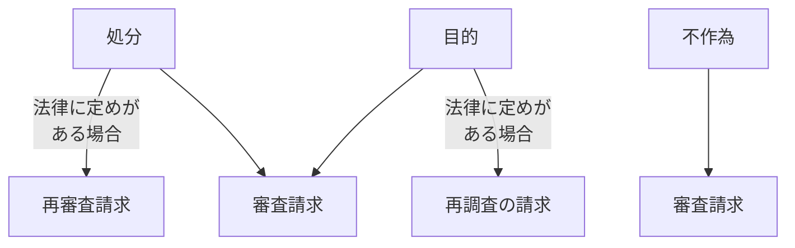

# 行政不服審査法

## 第1節 行政不服審査法総則

### 1 行政救済法の全体像

国や地方公共団体の行政作用により24年国民の権利利益が侵害された場合、国民を救済するための法体系が**行政救済法**です。

行政救済法は、大きく分けて**事前救済**と**事後救済**に分類されます。

#### 行政不服申立てと行政事件訴訟

|  | 行政不服申立て | 行政事件訴訟 |
|---|---|---|
| 審理機関 | 行政機関 | 裁判所 |
| メリット | 簡易迅速・費用がかからない | 慎重な判断が期待できる |
| デメリット | 行政機関自身の判断なので客観性に欠ける | 時間がかかる・費用がかかる |

#### （2）自由による救済

国民は、違法な行政作用によって損害を受けた場合には、国や地方公共団体に対して損害賠償を請求することができます（**国家賠償**）。また、適法な行政作用によって損害を受けた場合には、**損失補償**を請求できます。

#### 行政救済法の全体像

行政救済法は以下のように体系化されます。

- **行政争訟**
  - 行政上の不服申立て（行政不服審査法）
  - 行政事件訴訟（行政事件訴訟法）
- **国家補償**
  - 国家賠償（国家賠償法）
  - 損失補償

---

### 2 行政不服審査法の目的

行政不服審査法の目的は、行政庁の**違法又は不当な処分**その他公権力の行使に当たる行為に関し、国民が簡易迅速かつ公正な手続の下で広く行政庁に対する不服申立てをすることができるための制度を定めることにより、**国民の権利利益の救済**を図るとともに、**行政の適正な運営を確保**することを目的としています（1条1項）。

> **行政不服審査法1条1項**
>
> この法律は、行政庁の違法又は不当な処分その他公権力の行使に当たる行為に関し、国民が簡易迅速かつ公正な手続の下で広く行政庁に対する不服申立てをすることができるための制度を定めることにより、国民の権利利益の救済を図るとともに、行政の適正な運営を確保することを目的とする。

:::tip ポイント
行政事件訴訟法では「不当」な処分は審理対象とならないのに対し、行政不服審査法では**違法だけでなく「不当」な処分**も審理対象となります。これは行政不服審査法の大きな特徴です。
:::

---

### 3 不服申立ての類型

#### （1）審査請求

行政不服審査法は、不服申立ての類型を原則として**審査請求**に一元化しました。

審査請求は、次の処分についての審査請求と、公平を旨として行います。

1. **処分についての審査請求**：行政庁の処分に不服がある者は、審査請求をすることができます（2条）。
2. **不作為についての審査請求**：法令に基づき行政庁に対して処分についての申請をした者は、当該申請から相当の期間が経過したにもかかわらず、行政庁の不作為がある場合には、審査請求をすることができます（3条）。

行政不服審査法で「処分」に不服がある場合、**審査請求**をすることができます（2条）。

:::note 適用除外
行政不服審査法は、国の機関又は地方公共団体その他の公共団体若しくはその機関に対する処分で、これらの機関又は団体がその**固有の資格**において処分の相手方となるものについては適用されません（7条2項）。
:::

#### 行政不服審査法による「処分」についての不服申立て

行政不服審査法上の「処分」には、公権力の行使に当たる事実上の行為で、人の収容、物の留置その他その内容が継続的性質を有するもの（**事実行為**）が含まれます（1条2項）。

:::caution 注意
行政不服審査法における「処分」は行政事件訴訟法における「処分」よりも広い概念です。行政指導など非権力的行為は含まれませんが、事実行為は含まれます。
:::

#### 処分についての審査請求

行政庁の処分に不服がある者は、次に掲げる場合の区分に応じ、当該各号に定める行政庁に対して審査請求をすることができます（4条）。

| 処分庁 | 審査庁 |
|---|---|
| 処分庁が主任の大臣又は宮内庁長官若しくは内閣府設置法に規定する庁の長である場合 | 当該処分庁 |
| 処分庁が上記以外の場合 | 処分庁の最上級行政庁 |
| 法律（条例に基づく処分については条例）に特別の定めがある場合 | 当該法律（条例）に定める行政庁 |

行政庁の処分につき処分庁以外の行政庁に対して審査請求をすることができる場合において、法律に再調査の請求ができる旨の定めがあるときは、当該処分に不服がある者は、処分庁に対して**再調査の請求**をすることもできます（5条1項）。ただし、当該処分について審査請求をしたときは、法律に特別の定めがある場合を除き、審査請求についての裁決を経た後でなければ、再調査の請求をすることができません（5条1項ただし書）。

#### 不作為についての審査請求

不作為についての審査請求は、当該**不作為に係る処分その他の行為を申請した者**に限り行うことができます。

:::info 審査請求をすべき行政庁
- 不作為庁が**主任の大臣**又は宮内庁長官若しくは内閣府設置法等に規定する庁の長のとき → **当該不作為庁**
- 宮内庁長官又は外局の長でない場合 → **主任の大臣**
- 上記以外（法定受託事務の不作為） → **当該不作為庁の最上級行政庁**
- 法律に特別の定めがある場合 → **当該法律に定める行政庁**
:::

#### （2）再調査の請求

行政庁の処分につき処分庁以外の行政庁に対して審査請求をすることができる場合において、法律に**再調査の請求ができる旨の定めがあるとき**は、当該処分に不服がある者は、処分庁に対して再調査の請求をすることができます（5条1項）。

例外として、審査請求をした場合には、法律に特別の定めがある場合を除き、審査請求についての裁決を経た後でなければ、再調査の請求をすることはできません。

再調査の請求は、処分庁が**簡易な手続で事実関係を再調査**して処分を見直す手続です。

#### （3）再審査請求

再審査請求は、**法律に再審査請求ができる旨の定めがある場合**に限り、行うことができます（6条1項）。審査請求の裁決に不服がある場合、さらに行政上の不服申立てをするよりも、行政事件訴訟により裁判所に救済を求めた方が適切なので、再審査請求は、法律に特別の定めがある場合に限り、例外的に認められています。

再審査請求は、原裁決又は当該処分（**原裁決等**）を対象として、**法律の定める行政庁**に対するものとされています（6条2項）。

#### 不服申立ての類型

---

## 第2節 審査請求の要件

### 1 審査請求の流れ

審査を始めるためには、まず、**審査請求の要件**を満たしている必要があります。審査請求の要件を満たしていない場合は、審査請求は**却下**されます。

#### 審査請求の流れ

審査請求 → 要件審査 → 要件を満たす場合は本案審理 → 裁決

要件を満たさない場合は**却下裁決**となります。

---

### 2 審査請求の要件

審査請求の要件は、以下のとおりです。

#### （1）処分又は不作為が存在すること

処分が行われたのにもかかわらず何らについての審査請求にあっては、審査請求の対象となる**処分**が存在しなければなりません。

不作為についての審査請求にあっては、法令に基づく申請がなされたにもかかわらず、相当の期間内に何らかの処分がされていない状態（**不作為**）が存在しなければなりません。

#### （2）主観的要件を満たすこと

審査請求は、**行政庁の処分に不服がある者**が行うことができます（2条）。ただし、不作為についての審査請求は、**法令に基づき行政庁に対して処分についての申請をした者**に限られます（3条）。

:::tip 重要判例
**主婦連ジュース事件**（最判昭53.3.14）

公正取引委員会が行った不当景品類及び不当表示防止法に基づく公正競争規約の認定について、一般消費者団体が不服申立てをした事案。

最高裁は、「不服がある者」とは、当該処分について不服申立てをする**法律上の利益がある者**、すなわち、当該処分により自己の権利若しくは法律上保護された利益を侵害され又は必然的に侵害されるおそれのある者をいうと判示しました。
:::

#### （3）審査庁が正しいこと

審査請求は、法定の**審査庁**に対して行わなければなりません。

#### （4）審査請求期間内であること

審査請求には期間制限があります。

- **主観的審査請求期間**：処分があったことを知った日の翌日から起算して**3か月以内**（18条1項本文）
- **客観的審査請求期間**：処分があった日の翌日から起算して**1年以内**（18条2項本文）

いずれの期間も、**正当な理由**があるときは、期間経過後でも審査請求をすることができます（18条1項ただし書・2項ただし書）。

:::caution 注意
不作為についての審査請求には、審査請求期間の制限はありません。不作為が続いている限り、いつでも審査請求をすることができます。
:::

#### （5）不服申立適格を有すること

審査請求は、**代理人**によってすることができます（12条1項）。

総代は、各自、審査請求人のために、当該審査請求に関する一切の行為をすることができます（11条3項）。ただし、**審査請求の取下げ**は審査請求人本人でなければできません。

#### 審査請求人の地位の承継

審査請求人が死亡したときは、**相続人その他法令により審査請求の目的である処分に係る権利を承継した者**は、審査請求人の地位を承継します（15条1項）。

審査請求人について**合併又は分割**（審査請求の目的である処分に係る権利を承継させるものに限る）があったときは、合併後存続する法人その他の社団若しくは財団若しくは合併により設立された法人その他の社団若しくは財団又は分割により当該権利を承継した法人は、審査請求人の地位を承継します（15条2項）。

:::info 総代
多数人が共同して審査請求をしようとするときは、3人を超えない**総代**を互選することができます（11条1項）。
:::

#### 不作為についての審査請求

不作為については審査請求期間の制限はなく、**審査庁選択制**の定めがある場合には、審査庁選択制の規定に従います。

#### （6）審査請求書の提出

審査請求は、他の法律（条例に基づく処分については、条例）に**口頭**ですることができる旨の定めがある場合を除き、**審査請求書**を提出してしなければなりません（19条1項）。

#### 審査請求書の記載事項

審査請求書には、以下の事項を記載しなければなりません。

| 区分 | 記載事項 |
|---|---|
| 処分についての審査請求 | 審査請求人の氏名・住所、審査請求に係る処分の内容、処分があったことを知った年月日、審査請求の趣旨及び理由、処分庁の教示の有無及びその内容 |
| 不作為についての審査請求 | 審査請求人の氏名・住所、当該不作為に係る処分についての申請の内容及び年月日、審査請求の趣旨及び理由 |

---

### 3 審査請求の成熟

審査請求の提出ができるとしても、本来、その審査請求が審理に値するものでなければなりません。しかし、その審査請求が適法であるかどうかについては、審理手続を進行する上で支障になりません（22条）。
