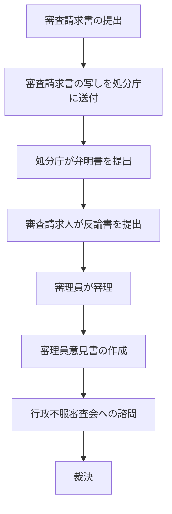
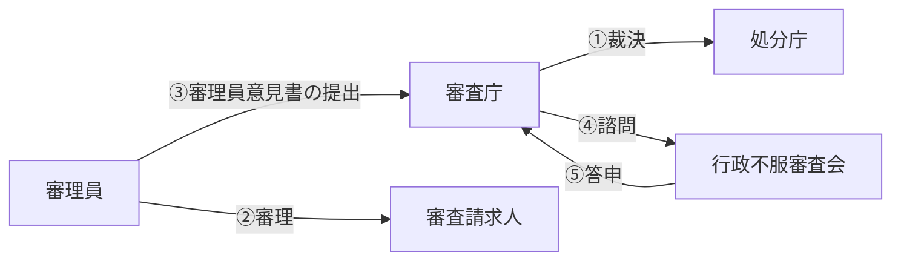

# 行政不服審査法

## 第3節 審査請求の審理手続

### 1 審理手続の流れ

#### （1）審理の分掌

審査請求がなされると、審査庁が審査庁の職員のうちから指名した**審理員**が審理手続を行います（9条1項本文）。

ただし、審査庁が主任の大臣若しくは宮内庁長官若しくは内閣府設置法に規定する庁の長である場合等は、審理員の指名を要しません（9条1項ただし書）。

#### （2）審理の手続

審理員は、審査請求書が提出された場合、まず、**審査請求書の写し**を処分庁等に送付しなければなりません（29条1項）。又は審査請求録取書の写しを処分庁等に送付します。送付を受けた処分庁等は、**弁明書**を提出しなければなりません（29条2項）。

#### 審理の手続の流れ

#### （3）書面審理主義

審査請求の審理は、**書面**により行われるのが原則です（審査請求書、弁明書、反論書等の書面による）。

ただし、審査請求人又は参加人の申立てがあった場合には、審理員は、当該申立てをした者に**口頭で審査請求に係る事件に関する意見を述べる機会**を与えなければなりません（31条1項）。これを**口頭意見陳述**といいます。

口頭意見陳述において、申立人は、審理員の許可を得て、**処分庁等に対して質問を発する**ことができます（31条5項）。

#### （4）証拠調べ

審理員は、**職権**で、以下の証拠調べをすることができます。

- **書類その他の物件の提出要求**（33条）
- **参考人の陳述及び鑑定の要求**（34条）
- **検証**（35条）
- **審理関係人への質問**（36条）

これらは、審理員が**職権でなしうる**ものであり、審査請求人の申立てがなくても行うことができます。

#### （5）前記人制度

審査庁は、審理員以外の審査庁の職員にも審理手続の一部を行わせることができます。

:::info 参加人
利害関係人（審査請求人以外の者であって審査請求に係る処分又は不作為に係る処分の根拠となる法令に照らし当該処分につき利害関係を有するものと認められる者）は、審理員の許可を得て、又は審理員の求めにより、その審査請求に**参加**することができます（13条1項・2項）。
:::

---

### 2 審理手続の承継

相続、合併・分割といった包括承継を行った場合は、審査庁の許可を得なくても、当然に審査請求人の地位が承継されます（15条1項・2項）。

これに対して、審査請求の目的である処分に係る権利のみを譲り受けた**特定承継** の場合、**審査庁の許可**を得なければ、審査請求人の地位を承継することはできません（15条6項）。

---

### 3 審理手続の終結

#### （1）審理手続の終結

審理員は、必要な審理を終えたと認めるときは、審理手続を終結するものとされています（41条1項）。

#### （2）審理員意見書

審理員は、審理手続を終結したときは、遅滞なく、審査庁がすべき裁決に関する意見書（これを**審理員意見書**といいます）を作成しなければならず（42条1項）、審理員意見書を作成したときは、速やかに、これを**事件記録**とともに、**審査庁に提出**しなければなりません（42条2項）。審査請求人と処分庁の主張を公正に審理するため審理員制度を導入したのであり、審査庁の裁決が審理員の判断に基づいてなされるべく、審理員意見書の仕組みが導入されています。

#### （3）行政不服審査会等への諮問

審査庁は、審理員意見書の提出を受けたときは、原則として、**行政不服審査会等**に諮問しなければなりません（43条1項）。審査庁の裁決の内容の公正を図るため、原則として行政不服審査会等への諮問が義務付けられています。

#### 審理手続の終結

---

## 第4節 審査請求の終了

### 1 取下げ

審査請求人は、裁決があるまでは、いつでも審査請求を**取り下げる**ことができます（27条1項）。

審査請求の取下げは、**書面**でしなければなりません（27条2項）。

---

### 2 裁決

#### （1）裁決とは何か

裁決とは、審査請求を受けた審査庁がなした**判断**のことです。

#### （2）裁決の種類

裁決には、**却下裁決**、**棄却裁決**、**認容裁決**の3種類があります。

| 裁決の種類 | 内容 |
|---|---|
| **却下裁決** | 審査請求が不適法である場合に、本案に入ることなく退ける裁決 |
| **棄却裁決** | 審査請求に理由がない場合に、審査請求を退ける裁決 |
| **認容裁決** | 審査請求に理由がある場合に、処分の全部又は一部を取り消し、又は変更する裁決 |

#### 認容裁決の内容

**処分についての審査請求の認容裁決の場合**：

| 区分 | 審査庁の権限 |
|---|---|
| 処分庁の上級行政庁又は処分庁のいずれでもない審査庁 | 処分の全部又は一部の**取消し** |
| 処分庁の上級行政庁である審査庁 | 処分の全部又は一部の**取消し**又は処分の**変更** |
| 処分庁である審査庁 | 処分の全部又は一部の**取消し**又は処分の**変更** |

**不作為についての審査請求の認容裁決の場合**：

| 区分 | 審査庁の権限 |
|---|---|
| 不作為庁の上級行政庁又は不作為庁のいずれでもない審査庁 | 当該不作為が違法又は不当である旨の**宣言** |
| 不作為庁の上級行政庁である審査庁 | 当該不作為が違法又は不当である旨の宣言に加え、当該申請に対して一定の処分をすべき旨を**命じる**ことができる |
| 不作為庁である審査庁 | 当該申請に対して一定の処分をする |

:::tip 事情裁決
審査請求に理由がある場合であっても、処分を取り消し、又は撤廃することにより**公の利益に著しい障害を生ずる場合**において、審査請求人の受ける損害の程度、その損害の賠償又は防止の程度及び方法その他一切の事情を考慮したうえ、処分を取り消し又は撤廃することが**公共の福祉に適合しない**と認めるときは、審査庁は、裁決で、当該審査請求を**棄却**することができます（45条3項）。これを**事情裁決**といいます。

事情裁決をする場合は、裁決の主文で、当該処分が**違法又は不当であることを宣言**しなければなりません（45条3項後段）。
:::

#### （3）裁決の方式

審査庁の判断を慎重にさせるとともに、審査請求人が後に裁決を不服として争う場合の情報を提供するため、裁決は、**理由**を記載し、審査庁が記名押印した**裁決書**によりしなければなりません（50条1項4号）。

#### （4）裁決の効力

##### 1）効力の種類

裁決も行政行為の一種ですから、公定力・不可争力・執行力・不可変更力を有します。

また、関係行政庁に対し、処分を違法・不当とした判断を尊重し、裁決の趣旨に従って行動することを義務付ける効力を有しています（52条1項）。これを**拘束力**といいます。

:::info 拘束力
処分を違法と認め審査請求を棄却する場合は拘束力は生じません。拘束力が生じるのは**認容裁決**の場合に限られます（最判昭49.7.19判旨）。
:::

##### 2）効力発生時期

裁決は、審査請求人に**送達**された時に、その効力を生じます（51条1項）。

裁決の送達は、送達を受けるべき者に**裁決書の謄本** を送付することによって行います（51条2項本文）。

:::info 用語
- **謄本**：原本の内容の全部を写したもの。作成名義人が原本のとおりに作ったものであることを認証したもの。
- 送達を受けるべき者の所在が知れない場合や、外国においてすべき送達につき困難な事情があるときは、**公示の方法**によってすることができます。この場合、その掲示を始めた日の翌日から起算して2週間を経過した時に裁決書の謄本の送達があったものとみなされます（51条3項後段）。
:::
