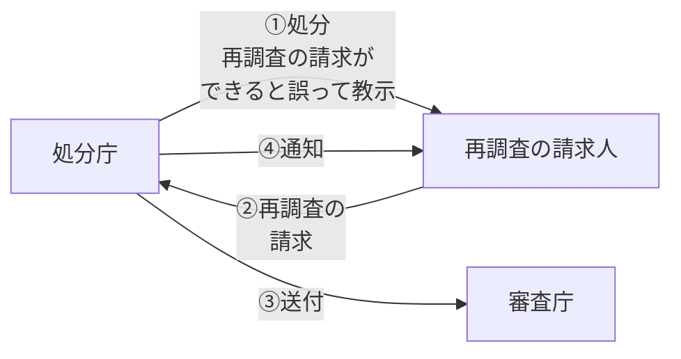

# 行政不服審査法

## 第5節 執行停止

### 1 執行不停止の原則

行政の円滑な運営に支障をきたすことを避けるため、処分の効力、処分の執行又は手続の続行は、審査請求によっては**妨げられない**のが原則です（25条1項）。これを**執行不停止の原則**といいます。

:::tip ポイント
行政事件訴訟法における執行停止の制度と共通する考え方です。行政の円滑な運営を確保するため、不服申立てがなされただけでは処分の効力は停止しません。
:::

---

### 2 執行停止

執行不停止の原則を貫くと、審査請求の審理中に処分の執行により審査請求人に**回復困難な損害**が生じるおそれがあります。そこで、一定の場合に**執行停止**が認められています。

#### 執行停止の内容

執行停止の内容としては、以下のものがあります。

| 内容 | 説明 |
|---|---|
| **処分の効力の停止** | 処分の法的効果の発生を一時的に停止する |
| **処分の執行の停止** | 処分の内容を強制的に実現することを一時的に停止する |
| **手続の続行の停止** | 処分を前提とする後続の手続を一時的に停止する |
| **その他の措置** | 上記以外の暫定的な措置 |

#### 任意的執行停止と義務的執行停止

**任意的執行停止**（審査庁の裁量による執行停止）：

審査庁は、必要があると認める場合には、審査請求人の申立てにより又は**職権**で、処分の効力、処分の執行又は手続の続行の全部又は一部の停止その他の措置をとることができます（25条2項）。

ただし、処分の効力の停止は、処分の効力の停止以外の措置によって目的を達することができるときは、することができません（25条6項）。これを**補充性の要件**といいます。

**義務的執行停止**：

処分、処分の執行又は手続の続行により生ずる**重大な損害を避けるために緊急の必要がある**と認めるときは、審査庁は、審査請求人の**申立て**により、執行停止をしなければなりません（25条4項）。

ただし、以下の場合は義務的執行停止の対象外です。

- **公共の福祉に重大な影響を及ぼすおそれ**があるとき
- 処分の執行若しくは手続の続行ができなくなるおそれがあるとき
- **本案について理由がない**とみえるとき

:::caution 行政事件訴訟法との比較

| | 行政不服審査法 | 行政事件訴訟法 |
|---|---|---|
| 執行停止を行う者 | 審査庁 | 裁判所 |
| 申立要件 | 重大な損害を避けるために緊急の必要があるとき | 重大な損害を避けるため緊急の必要があるとき |
| 職権による執行停止 | **できる**（任意的執行停止） | **できない** |
| 内閣総理大臣の異議 | なし | **あり** |

行政不服審査法における執行停止には、審査庁が処分庁の上級行政庁又は処分庁である場合と、それ以外の場合とで要件が異なります。

審査庁が処分庁の**上級行政庁又は処分庁**である場合：審査請求人の申立てにより又は職権で、処分の効力、処分の執行又は手続の続行の全部又は一部の停止その他の措置をとることができます（25条2項）。

審査庁が処分庁の上級行政庁又は処分庁の**いずれでもない**場合：審査請求人の申立てにより、処分の効力、処分の執行又は手続の続行の全部又は一部の停止（**任意的執行停止**）をすることができます（25条3項）。ただし、処分の効力の停止はできません。
:::

---

### 3 執行停止の取消し

執行停止をした後において、執行停止が**公共の福祉に重大な影響を及ぼす**ことが明らかとなったとき、その他**事情が変更した**ときは、審査庁は、その執行停止を**取り消す**ことができます（26条）。

:::info ポイント
執行停止の取消しは、事後的に事情が変わった場合に認められるものです。当初から執行停止が不適切であった場合とは異なります。
:::

---

## 第6節 教示

### 1 教示とは何か

教示とは、処分の相手方等に対して、当該処分について**不服申立てができるかどうか**、できる場合には不服申立てをすべき行政庁及び不服申立てをすることができる期間を書面で示すことをいいます。

行政上の不服申立ては、行政事件訴訟法上の出訴とは異なり、一般国民にはなじみの薄い制度です。そこで、処分をする際に不服申立ての方法を国民に**教示**することが義務付けられています。

:::tip ポイント
教示についても、行政事件訴訟法の教示の制度が重要です。行政事件訴訟法46条に定める教示の制度と合わせて学習しましょう。
:::

---

### 2 教示の種類

#### （1）書面教示

行政庁は、**審査請求若しくは再調査の請求又は他の法令に基づく不服申立て**をすることができる処分をする場合には、処分の相手方に対し、当該処分につき不服申立てをすることができる旨並びに不服申立てをすべき行政庁及び不服申立てをすることができる期間を**書面で教示**しなければなりません（82条1項）。

ただし、処分を**口頭でする場合**は、教示義務を負いません（82条1項ただし書）。

#### （2）利害関係人への教示

行政庁は、**利害関係人**から、当該処分が不服申立てをすることができる処分であるかどうか並びに当該処分が不服申立てをすることができるものである場合における不服申立てをすべき行政庁及び不服申立てをすることができる期間につき**教示を求められたとき**は、当該事項を教示しなければなりません（82条2項）。

:::note
利害関係人による教示の求めに対しては、**書面による教示は義務付けられていません**。ただし、教示を求めた者が書面による教示を求めたときは、**書面で教示**しなければなりません（82条3項）。
:::

---

### 3 教示に対する救済

行政庁が教示義務を怠った場合や、誤った教示をした場合の救済について、行政不服審査法は以下の規定を設けています。

#### （1）教示義務を怠った場合の救済

行政庁が不服申立てをすべき行政庁を教示しなかったときは、当該処分に不服がある者は、当該処分庁に**不服申立書**を提出することができます（83条1項）。

処分庁は、不服申立書が提出されたときは、速やかに、当該不服申立書を**審査庁となるべき行政庁に送付**しなければなりません（83条2項）。不服申立書が審査庁となるべき行政庁に送付されたときは、はじめから審査庁となるべき行政庁に審査請求がされたものとみなされます（83条3項）。

#### （2）審査請求をすべき行政庁を誤って教示した場合

行政庁が誤って、審査請求をすべき行政庁でない行政庁を審査請求をすべき行政庁として教示した場合において、その教示された行政庁に書面で審査請求がされたときは、当該行政庁は、速やかに、審査請求書を**処分庁又は審査庁となるべき行政庁に送付**し、かつ、その旨を審査請求人に**通知**しなければなりません（22条1項）。

この場合、はじめから審査庁となるべき行政庁に審査請求がされたものとみなされます（22条5項）。

#### （3）再調査の請求ができると誤って教示した場合

処分庁が誤って再調査の請求をすることができる旨を教示した場合において、当該処分庁に再調査の請求がされたときは、処分庁は、速やかに、**再調査の請求書**を審査庁となるべき行政庁に送付し、かつ、その旨を**再調査の請求人に通知**しなければなりません（22条3項）。再調査の請求書が審査庁となるべき行政庁に送付されたときは、はじめから審査庁となるべき行政庁に審査請求がされたものとみなされます（22条5項）。

#### 再調査の請求ができると誤って教示した場合

