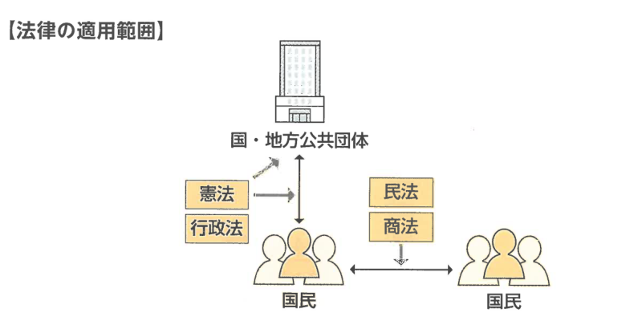
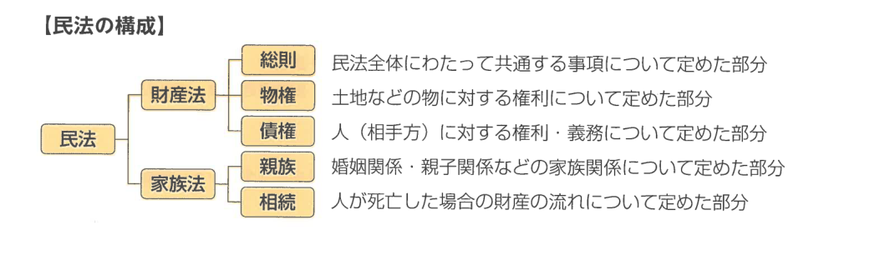
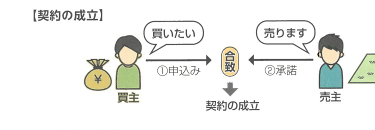
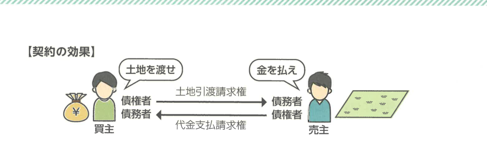
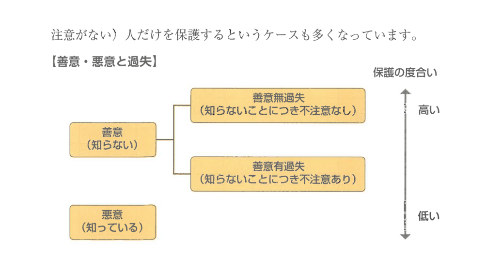

## 1 民法とは何か

### (1) 民法とは何か

今まで学習してきた憲法と行政法は、国・地方公共団体の内部関係や、国・地方公共団体と国民の関係について定めるものでした（いわば縦の関係です）。これに対して、これから学習する民法（商法もです）は、**国民と国民の関係**について定めたものです（いわば横の関係です）。

**【法律の適用範囲】**

**【民法の構成】**

民法は、①総則、②物権、③債権、④親族、⑤相続の5つのまとまりで構成されています。そして、総則・物権・債権をまとめて**財産法**、親族・相続をまとめて**家族法**と呼びます。ただし、行政書士試験は、**財産法を中心**に出題される科目ですから、**財産を守るためのルール**を中心に学習していくことになります。

民法を体系的にいうと民法の各規定で共通するルールを定めたのが「総則」です。

- **民法** ＝ 財産法（総則・物権・債権）＋ 家族法（親族・相続）
- **総則**（総論）は対して各論（物権・債権）に共通するルールを定めたもの
- 人の財産を保護するために定めたもの

### (2) 契約

#### ① 契約とは何か

契約は、民法のあらゆる部分で登場する概念ですので、本格的な学習を始める前に、契約についてしっかりと理解しておきましょう。

**契約**とは、2人の人間の意思の合致により成立するものであり、拘束力を有するものです。たとえば、売買という契約は、例えば、Aがデパートで100万円の宝石を買うことにしたとします。

#### ② 契約の要件

契約とは、一方が「～したい」という**申込み**に対して、相手方が「わかりました」という**承諾**をすることで成立します。たとえば、Aが「1000万円で土地を売ってほしい」と言い、Bが「1000万円でこの土地1000万で売ります」と承諾した場合、土地の**売買契約**が成立します。

**【契約の成立】**

#### ③ 契約の効果

契約が成立すると、契約をした2人の間に、信義誠実の原則に基づいた権利義務関係が発生します。契約の一方当事者からみた権利を**債権**、もう一方当事者からみた権利を**債務**といいます。このように、**債権と債務は表裏一体の関係**にあるのです。また、債権を有する人を**債権者**、債務を有する人を**債務者**といいます。

たとえば、Aの土地の売買契約が成立した場合、以下のような債権と債務が発生します。

**【契約の効果】**

#### ④ 契約の分類

民法上の契約は、その性質に応じて、以下のように分類することができます。

| 類型 | 意味 | 具体例 |
|---|---|---|
| **双務契約** | 当事者が対価的な関係にある債務を互いに負担する契約 | 売買等 |
| **片務契約**（←→双務契約） | 当事者の一方のみが債務を負う契約 | 贈与等 |
| **有償契約** | 対価を伴う契約 | 売買等 |
| **無償契約**（←→有償契約） | 対価を伴わない契約 | 贈与等 |
| **諾成契約** | 合意のみで成立する契約 | 売買等 |
| **要物契約**（←→諾成契約） | 合意のほかに物の引渡しが必要な契約 | 書面によらない消費貸借等 |

### (3) 善意・悪意

#### ① 善意・悪意とは何か

善意・悪意も民法のあらゆる場面で登場する概念ですので、ここで整理しておきましょう。

善意・悪意というと、善い人、悪い人という倫理的な善悪をイメージしがちですが、民法では、善意とは**「ある事実を知らない」**ことをいい、悪意とは**「ある事実を知っている」**ことをいいます。

民法では、契約など関わった人を保護するかどうかを判断する要素として、善意・悪意すなわち**「ある事実を知っていたか知らなかったか」**が重要になってきます。いわば「この注意義務に反する過失があったかどうか」で判断されます。

#### ② 過失とは何か

善意の「ある事実を知らない」人であっても、その**事実を不注意により知らなかった**場合があります。この不注意のことを**過失**といいます。

民法では、**善意無過失**の「ある事実を知らず、知らないことにつき不注意がない」人だけを保護するケースも多くなっています。

**【善意・悪意と過失】**

## 2 出題傾向表

10年間（平成24年度～令和3年度）分の本試験の出題傾向を表にまとめました。

### (1) 総則

| テーマ | 24 | 25 | 26 | 27 | 28 | 29 | 30 | 元 | 2 | 3 |
|---|---|---|---|---|---|---|---|---|---|---|
| 権利の主体・客体 | | | ● | | | | | ● | | |
| 意思表示 | ● | | | ● | ● | | | ● | | ● |
| 代理 | | ● | ● | ● | | ● | | | ● | ● |
| 無効・取消し | | | | | | | | | | |
| 条件・期限 | | | | | | | | | | |
| 時効 | ● | ● | ● | ● | ● | ● | ● | ● | ● | ● |

※ そのテーマから出題。●はおおよその出題です。

### (2) 物権

| テーマ | 24 | 25 | 26 | 27 | 28 | 29 | 30 | 元 | 2 | 3 |
|---|---|---|---|---|---|---|---|---|---|---|
| 物権総論 | | | | ● | | | | ● | ● | |
| 占有権 | | | | | ● | | | | | |
| 所有権 | | | | | | ● | ● | | | |
| 用益物権 | | | | ● | | | | | | |
| 担保物権 | ● | ● | ● | | | ● | ● | ● | ● | ● |

### (3) 債権

| テーマ | 24 | 25 | 26 | 27 | 28 | 29 | 30 | 元 | 2 | 3 |
|---|---|---|---|---|---|---|---|---|---|---|
| 公序の目的 | | | ● | | | | | | | |
| 債務不履行 | | | | | | | ● | | | |
| 責任財産の保全 | ● | | | | | | | | | |
| 多数当事者の債権・債務 | ● | ● | ● | | ● | | | | | |
| 債権譲渡・債務引受 | | | | | | ● | | | | ● |
| 債権の消滅 | | ● | | | | | | ● | | |
| 契約総論 | ● | ● | | ● | ● | ● | | ● | ● | |
| 契約各論 | | | | | | | ● | | | ● |
| 事務管理・不当利得 | | | | | | | | | | |
| 不法行為 | | ● | ● | ● | ● | ● | ● | ● | ● | |
| 配分以外の民法全般問 | | | | | | | | | | |

### (4) 親族

| テーマ | 24 | 25 | 26 | 27 | 28 | 29 | 30 | 元 | 2 | 3 |
|---|---|---|---|---|---|---|---|---|---|---|
| 婚姻 | | | | ● | | | | ● | | |
| 離婚 | | ● | | | | | | | | |
| 親子 | ● | | | | | | | | | |
| 養子 | | | | | | | | | | |
| 親権・扶養 | | | ● | | | | | | | |

※ そのテーマから出題。●はおおよその出題です。

### (5) 相続

| テーマ | 24 | 25 | 26 | 27 | 28 | 29 | 30 | 元 | 2 | 3 |
|---|---|---|---|---|---|---|---|---|---|---|
| 相続人 | ● | | | | | ● | | ● | | |
| 相続分（法定フロー） | | | | | | | ● | | | |
| 遺言 | | ● | | ● | | | | | | |
| 相続の効力 | | | | | | | | | ● | |
| 相続の承認と放棄 | | | ● | | | ● | | | | |
| 配偶者居住権・特別の寄与 | | | | | | | | | | |

## 3 分析と対策

### (1) 学習指針

行政書士試験の民法は、例年、5肢択一式9問（総則2問、物権2問、債権4問、親族・相続1問というパターンが多い）が出題されます。このうち、親族・相続は1問だけですから、民法はいわば**財産法**（総則・物権・債権）のための科目です。もっとも、親族・相続は毎年一定の出題がありますので、捨てるわけにはいきません。

行政書士試験の特徴として、**オリジナル問題を出る程度となりうる必要があります**（行政書士オリジナル問題が出される傾向にあります）。ですから、行政書士試験の対策をする上でTAP式の文章読解シリーズでは、オリジナル問題を加えて「一問一答式点とテーマ別ノウハウ」のTAP式文章読解シリーズをご活用ください。

**まずは財産法をしっかり学習すること**です。親族・相続といった家族法は、例年5肢択一式1問だけの出題ですから、財産法の学習を終えた後に本書を一読して過去問を繰り返せばよいでしょう。

### (2) 行政書士試験の民法

行政書士試験の民法の問われ方は「民法の規定」と「判例」についてです。出題の仕方が似ており、**民法の規定（条文）と判例**をしっかり学ぶ必要があります。

足りずに、具体的な事例の形で出されることもあります。このような出題傾向を踏まえると、民法については具体的な事例から出題される傾向もありますので、こちらの対策もする必要があります。

民法は記述式の問題でも出題されます。記述式では、具体的な事例を提示して、民法の条文を記述させます。記述式は、民法の条文と事例を提示して、その結果がどうなるかを導く出題形式です。具体的な事例の理由付けをもとに**判例の結論を導くことができるよう**に学習しましょう。

### (3) 得点目標

民法では、**7割正解**を目指す必要があります。

**【民法の得点目標】**

| 形式 | 出題数 | 得点目標 |
|---|---|---|
| 5肢択一式 | 9問（36点） | 6問（24点） |
| 記述式 | 2問（40点満点） | 20点 |
