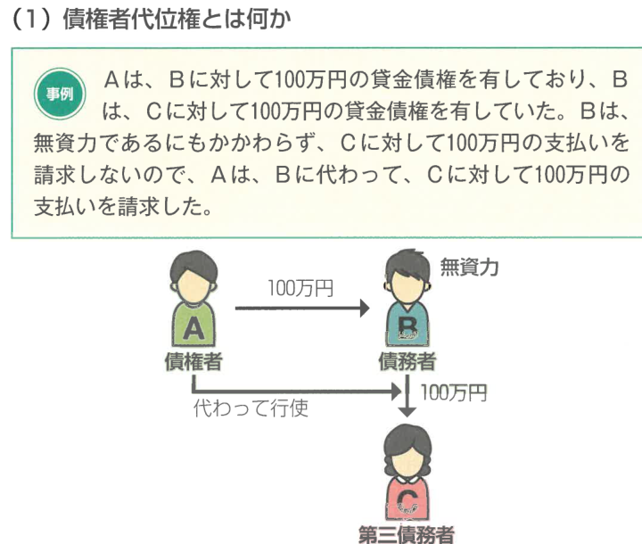
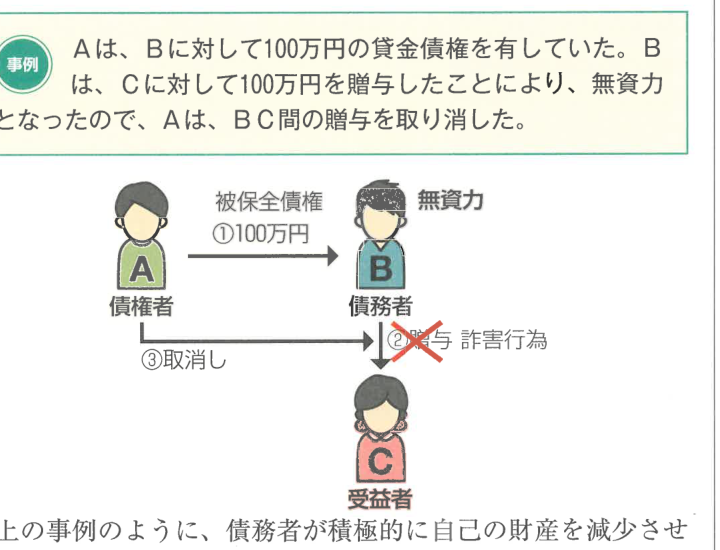

:::tip[学習のPOINT]
責任財産の保全のための制度には、①債権者代位権と②詐害行為取消権の2種類があります。判例からの出題が多い分野ですので、判例を重点的に学習しましょう。
:::

## 1 債権者代位権

### （1）債権者代位権とは何か

例えば、AはBに対して100万円の金銭債権を有しており、BはCに対して100万円の債権を有していたとします。Bは、Cに対して100万円の支払を請求しようとしない、つまり無資力であるにもかかわらず、Cに対して100万円の支払を請求しようとしないものとします。そこで、AはBに代わって、Cに対して100万円の支払を請求することができます。

上の事例のように、債務者（B）が自らの権利を行使しないとき、このままでは債務者の責任財産が不十分となり、強制執行の準備のために債務者の責任財産を保全する必要があります。

### （2）要件

債権者代位権を行使するためには、以下の要件を満たす必要があります。

#### ① 債権保全の必要性

自己の債権を保全するための必要があることが求められます。

債務者に属する権利（**被代位権利**）を行使することができるとされています（423条1項本文）。債権保全の必要性が認められるのは、債務者が無資力であることが要件です。

もっとも、金銭債権の保全以外にも認められる**転用型の債権者代位権**（423条の7）は、債務者の無資力は要件ではありません。

#### ② 被代位権利が債務者の一身専属権及び差押えを禁じられた権利ではないこと

債権者代位権の行使の対象となる権利は、債務者に帰属する権利であって、一身専属権及び差押えを禁じられた権利以外の権利です（423条1項ただし書）。

一身専属権とは、特定の人だけが行使できる権利のことをいい、どのような権利が一身専属権にあたるかは権利の趣旨のことです。どのような権利の性質から個別に判断することになります。例えば、慰謝料請求権は一身専属権にあたると考えられています。

**【債権者代位権の対象】**

| 代位行使することができる | 代位行使することができない |
|---|---|
| 売買代金請求権 | 慰謝料請求権 |
| 所有権に基づく登記請求権 | 親族法上の権利（認知請求権等） |
| 賃借権に基づく妨害排除請求権 | 差押えを禁じられた権利 |

#### ③ 債権の履行期の到来

債権者は、その債権の**期限が到来しない間**は、被代位権利を行使することができません（423条2項本文）。

ただし、**保存行為**については、期限到来前であっても行使することができます（423条2項ただし書）。

#### ④ 債務者が権利を行使していないこと

債権者代位権を行使するためには、債務者自らが自己の権利を行使していないことが必要です。債権者自らが自己の権利を行使している場合には、債権者代位権を行使する必要がないからです。なぜなら、本来債務者だけが自由に行使できる権利に対して債権者が干渉するものであり、その干渉は必要最小限に抑えられるべきだからです。

### （3）行使方法

#### ① 権利行使の名義

代位債権者は、債務者の代理人的な地位にたつわけではなく、**自己の名**において被代位権利を行使することができます。

代位債権者は、被代位権利の目的が可分であるときは、自己の債権の額の限度においてのみ被代位権利を行使することができます（423条の2）。

また、代位債権者は、被代位権利を行使する場合において、**被代位権利の行使に係る相手方**（第三債務者）に対して、直接自己への引渡し・支払いを求めることができます。この場合、代位債権者は、被代位権利の行使に必要な範囲で費用を要求することができます。

#### ② 請求の内容

請求の内容は、どのような権利を代位行使するかによって異なります。以下のとおりに異なります。

**【債権者代位権に基づく請求の内容】**

| 被代位権利 | 請求の内容 |
|---|---|
| 金銭債権 | 代位債権者は、第三債務者に対して直接自己に金銭を支払うことを請求できる（423条の3） |
| 動産の引渡請求権 | 代位債権者は、第三債務者に対して直接自己に動産を引き渡すことを請求できる（423条の3） |
| 登記請求権 | 代位債権者は、第三債務者に対して直接**債務者**への移転登記を請求する |

### （4）効果

債権者が被代位権利を行使した場合は、相手方（第三債務者）のした被代位権利についての処分は、債権者の代位権の行使を妨げるものではありません。

行使の効果は、直接に**債務者**に帰属します。

## 2 詐害行為取消権

### （1）詐害行為取消権とは何か

例えば、AはBに対して100万円の金銭債権を有していたところ、BはCに対して100万円を贈与したことによって、無資力となったので、AはBC間の贈与を取り消した。

上の事例のように、債務者が積極的に自己の財産を減少させるような行為（**詐害行為**）をしたとき、これを取り消す権利を**詐害行為取消権**といいます。

債権者は、債務者が債権者を害することを知ってした行為の取消しを裁判所に請求することができます。これにより、債務者の責任財産を保全することができます。

### （2）要件

#### ① 被保全債権が金銭債権であること

詐害行為取消請求をすることができるのは、被保全債権が**金銭債権**である場合に限られます。

ただし、特定物引渡請求権も究極において損害賠償請求権に変わりうるものであるから、特定物の引渡請求権を有する者も、詐害行為取消請求をすることができます（最大判昭36.7.19）。

#### ② 被保全債権が詐害行為の前に生じたものであること

被保全債権の発生が詐害行為よりも前であることが必要です。詐害行為の後に発生した債権の債権者は、詐害行為取消請求をすることができません（424条3項）。

#### ③ 債権者を害する行為であること

詐害行為取消請求の対象となる行為は、**債権者を害する**行為、すなわち債務者の責任財産を減少させて債権者の債権を満足させることができなくなるような行為です。

行為が債務超過の原因となり、又は債務超過を増大させるような行為である場合、債権者を害することとなります。ただし、一部の債権者への弁済や担保の供与又は債務の消滅に関して行われたものについては詐害行為とならない場合があります（424条の3第1項）。

#### ④ 財産権を目的としない行為ではないこと

**財産権を目的としない行為**については、詐害行為取消請求の対象とはなりません（424条2項）。例えば、養子縁組・相続の放棄などは詐害行為取消請求の対象とはなりません。これは、債権者の責任財産の保全を目的とする制度であるから、財産権を目的としない行為に適用すべきではないからです。

**【詐害行為取消請求の対象】**

| 対象となるもの | 対象とならないもの |
|---|---|
| 不動産の贈与・廉価売却 | 財産権を目的としない行為 |
| 30万円の宝石を5万円で売却 | 婚姻・養子縁組 |
| 特定の債権者への弁済（偏頗行為） | 相続の承認・放棄 |

#### ⑤ 債務者が債権者を害することを知っていたこと

詐害行為取消請求をするためには、債務者が債権者を害することを知っていたことが必要です（424条1項本文）。

#### ⑥ 受益者がその行為の時において債権者を害すべき事実を知っていたこと

詐害行為取消請求は、**受益者**がその行為の時において債権者を害すべき事実を知っていたことが必要です。すなわち、受益者が善意であれば詐害行為取消請求をすることはできません（424条1項ただし書）。

転得者を相手方とする場合、**転得者**がその転得の時において債権者を害すべき事実を知っていた場合に限り、詐害行為取消請求をすることができます（424条の5）。

### （3）行使方法

詐害行為取消請求は、債権者代位権の場合と異なり、**裁判上**（訴え）で行使しなければなりません。

被告は、受益者又は転得者です。債務者を被告とする必要はありませんが、訴えを提起したときは、遅滞なく、債務者に対し、**訴訟告知**をしなければなりません。また、第三者に影響が及ぶので、裁判の確定前の段階で相手方の権利を侵害しないよう配慮する必要があります。

### （4）出訴期間

詐害行為取消請求に係る訴えは、債務者が債権者を害することを知って行為をしたことを債権者が**知った時から2年**を経過したとき、又は行為の時から**10年**を経過したときは、提起することができません（426条）。

### （5）効果

#### ① 詐害行為取消請求の被告

詐害行為取消請求を認容する確定判決は、**債務者及びそのすべての債権者**に対してもその効力を生じます（425条）。したがって、債権者は自己の債権について、詐害行為の取消しを他の一般債権者の利益のためにもすることになります。

#### ② 取消しの範囲

詐害行為の取消しの範囲は、以下のとおりです。

**【取消しの範囲】**

| 行為の区分 | 取消しの範囲 |
|---|---|
| 金銭の贈与 | 自己の債権額の範囲のように分割できる場合、自己の債権額の範囲に限って詐害行為の取消しを請求できる |
| 過大な代物弁済等の財産の処分 | 不可分の場合は、当該行為の目的の価額から適正価額を控除した残額について取消しを請求できる |
| 不動産の贈与などの場合 | 行為の全部の取消しを請求できる |

#### ③ 取消しの内容

債権者は、期間として財産の返還を請求することができますが、財産の返還が困難であるときは、その価額の償還を請求することができます（424条の6第1項・2項）。

**【債権者自己に対する返還請求の可否】**

| | 直接自己に引渡し請求 |
|---|---|
| 不動産 | できない（債務者への返還を請求） |
| 金銭・動産 | できる（424条の9第1項） |

#### ④ 認定判決の効力

詐害行為取消請求を認容する確定判決は、債務者及びそのすべての債権者に対してもその効力を生じます（425条）。したがって、債権者は自己の債権について、詐害行為の取消しを他の一般債権者の利益のためにもすることになります。

なお、債権者代位権と詐害行為取消権のまとめは以下のようになります。

| | 債権者代位権 | 詐害行為取消権 |
|---|---|---|
| 趣旨 | 債務者の責任財産の保全（消極的な減少の防止） | 債務者の責任財産の保全（積極的な回復） |
| 行使方法 | 裁判上・裁判外を問わない | 裁判上（訴えの提起）のみ |
| 被告 | ─ | 受益者又は転得者 |
| 出訴期間 | なし | 知った時から2年、行為の時から10年 |
| 効果の帰属 | 直接、債務者に帰属 | 債務者及びすべての債権者に及ぶ |
