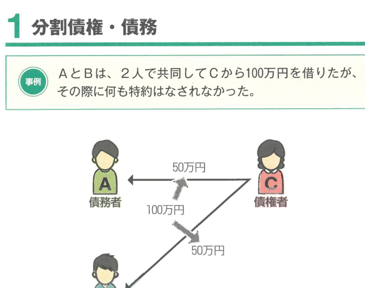
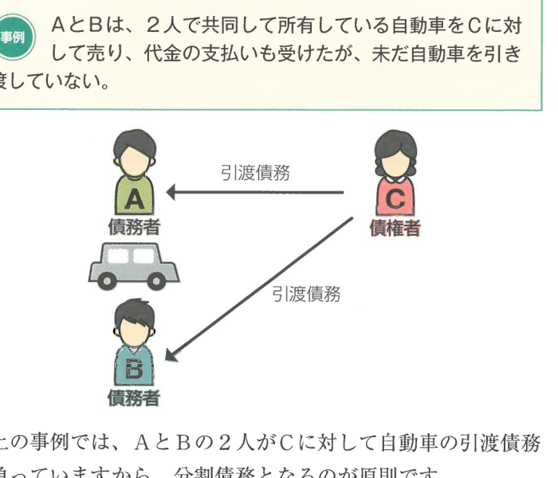
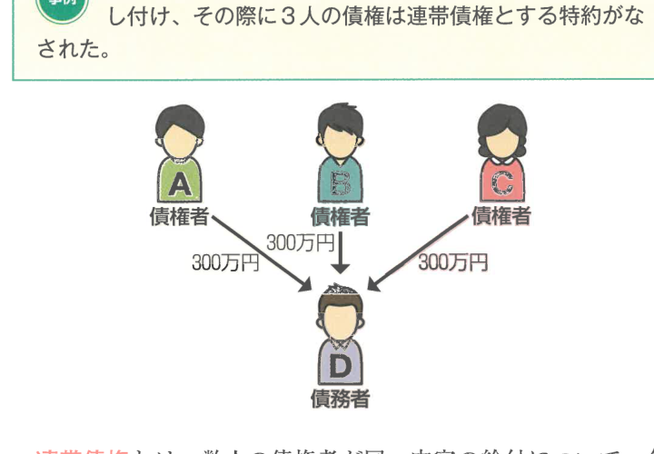
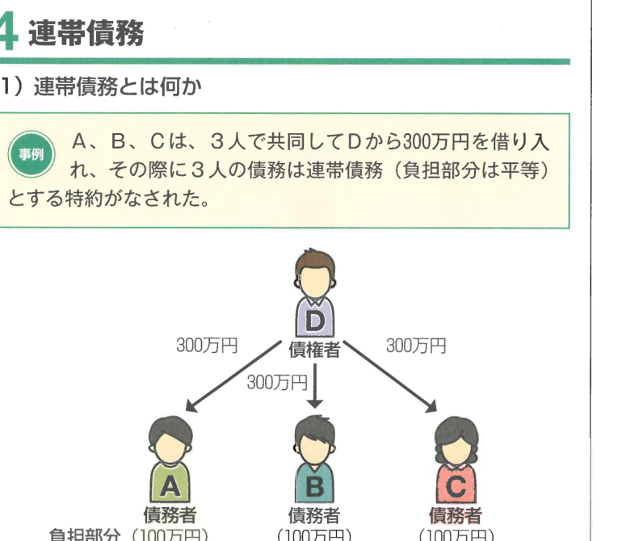
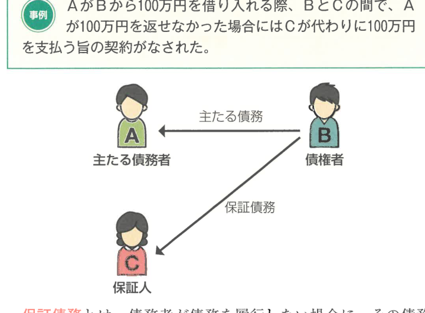

:::tip[学習のPOINT]
多数当事者の債権・債務には、①分割債権・債務、②不可分債権・債務、③連帯債権・債務、④保証債務といった類型があります。条文からの出題が多いので、条文をしっかり押さえましょう。
:::

## 1 分割債権・債務

債権者又は債務者のいずれか一方が複数である債権・債務関係については、平等の割合で分割される**分割債権**又は**分割債務**が原則です（427条）。

例えば、AとBが2人で共同してCから100万円を借りた場合、その際に何も特約はなされなかったとすると、AとBはCに対してそれぞれ50万円ずつの貸金債務を負うことになります。

## 2 不可分債権・債務

上の事例のように、債務の目的が性質上不可分である場合には、分割債務とはならず、債権者は、債務者のうちの1人に対して全部の履行を請求することができます（430条、436条）。これを**不可分債務**といいます（債権者が複数の場合は**不可分債権**となります）。

### 【不可分債権と不可分債務】

| | 不可分債務 | 不可分債権 |
|---|---|---|
| 具体例 | ①共有者の共有物の引渡債務（大判大10.3.18）②共同賃借人の賃料支払義務（大判大11.11.24） | ①共同して賃貸した場合の不動産の賃料債権 ②共有持分権に基づく妨害排除請求権 |
| 対外的効力 | 債権者は債務者の1人に対して全部の履行を請求できる（430条、436条） | 不可分債権者の1人は全ての債務者に対して全部の履行を請求できる（428条） |
| 1人に生じた事由 | 弁済・代物弁済等の満足的事由のみ絶対的効力。他は相対効（430条、435条の2） | 弁済・代物弁済等の満足的事由のみ絶対的効力。他は相対効（428条、429条） |

## 3 連帯債権

### （1）連帯債権とは何か

**連帯債権**とは、数人の債権者が同一内容の給付について、各自独立に全部の給付を請求できる債権をいいます。ただし、そのうちの1人の債権者が弁済を受ければ、他の債権者の債権も消滅することになります。

例えば、A、B、Cは、3人で共同してDに対して300万円を貸し付け、その際に3人の債権は連帯債権とする特約がなされた場合、A、B、Cの3人は、それぞれ100万円ずつの債権を有しているのではなく、それぞれ300万円全額の請求をすることができます。そして、DがA、B、Cのうち1人に対して300万円を支払えば、他の2人の債権も消滅することになります。

### （2）連帯債権の性質

数人が全額請求権を有するうえに、そのうちの1人の債権者に生じた弁済等の事由は他の債権者にも影響を及ぼすことがあり、各債権者のために、全ての債務者のうちの各債権者に対してその全部について履行をする義務を負うことになります。

### （3）連帯債権者の1人に生じた事由

連帯債権者の1人がいわゆる弁済を受けた場合、他の連帯債権者にもその効力を生じないのが原則です（435条の2：相対的効力の原則）。

ただし、**弁済**（履行の提供）（432条）、**更改**（435条1項）は、例外として絶対的効力を生じます。なお、相殺についても、その債権者に対する他の連帯債権者は、その債権者に対して債務の履行を拒むことができ（435条1項）、他の連帯債権者がいわば絶対的効力を生じさせることとされています。

## 4 連帯債務

### （1）連帯債務とは何か

**連帯債務**とは、数人の債務者が同一内容の給付について、各自が独立に全部を給付すべき義務を負担し、そのうちの1人の給付があれば全員の債務が消滅する多数当事者の債務のことです。

例えば、A、B、Cは、3人で共同してDから300万円を借り入れ、その際に3人の債務は連帯債務（負担部分は平等）とする特約がなされた場合、Dは、A、B、Cのそれぞれに対し300万円全額の請求をすることができます。

:::info[重要判例]
連帯債務は、各連帯債務者が、それぞれ100万円ずつの債務を負っているのではなく、それぞれ300万円全額の債務を負っているのです。
:::

また、**負担部分**とは、各連帯債務者が経済的に負担すべき割合のことです。上の事例では、A、B、Cの3人のうち、AがDの300万円全額を支払ったとして、Aは、最終的にはBに100万円、Cに100万円を請求することができます。つまりAの負担部分は100万円です。

さらに、**求償権**とは、各連帯債務者が経済的に負担すべき額を超えて弁済した場合、その超過分の返還を請求する権利のことをいいます。

### （2）連帯債務の性質

数人が連帯債務を負担するときは、債権者は、その連帯債務者の1人に対し、又は同時に若しくは順次に全ての連帯債務者に対し、全部又は一部の履行を請求することができます（436条）。なお、連帯債務者の1人について法律行為の無効又は取消しの原因があっても、他の連帯債務者の債務は、その効力を妨げられません（437条）。なぜなら、連帯債務は各債務者が別個独立の債務を負担しているからです。

### （3）連帯債務者の1人に生じた事由

連帯債務者の1人について生じた事由は、他の連帯債務者に対してその効力を生じないのが原則です（441条本文：**相対的効力の原則**）。

ただし、以下のような例外があります。

### 【連帯債務の絶対的効力】

| 区分 | 事由 | 効力 |
|---|---|---|
| **債務の全額について効力を生じる** | 弁済・代物弁済 | 全額について効力を生じる |
| | 相殺（439条1項） | 他の債務者の反対債権の範囲において満足を得る |
| | 更改（438条） | 他の連帯債務者との関係においても債務は消滅する |
| | 混同（440条） | 弁済をしたものとみなされる |
| **負担部分のみ効力を生じる** | 免除（438条2項） | その連帯債務者の負担部分の限度で効力を生じる |
| | 時効の完成（439条2項） | その連帯債務者の負担部分の限度で他の連帯債務者も債務を免れる |

:::warning[注意]
上記以外の事由（例えば、履行の請求、消滅時効の更新など）は、**相対的効力の原則**（441条本文）により、他の連帯債務者に対してはその効力を生じません。ただし、債権者及び他の連帯債務者の一人が別段の意思を表示したときは、当該他の連帯債務者に対する効力は、その意思に従います（441条ただし書）。
:::

### （4）求償関係

#### ① 求償権

連帯債務者の1人が弁済をしたときは、その連帯債務者は、弁済が自己の負担部分を超えるかどうかにかかわらず、他の連帯債務者に対し、各自の負担部分に応じた**求償権**を有します（442条1項）。

ただし、その償還をすることができない部分は、求償者及び他の資力のある者の間で、各自の負担部分に応じて分割して負担します（444条1項）。ただし、求償者に過失があるときは、他の連帯債務者に対して分担を請求することはできません（444条1項ただし書）。

#### ② 通知を怠った連帯債務者の求償の制限

連帯債務者の1人が弁済する前に他の連帯債務者に対し**事前の通知**をしなかったときに、他の連帯債務者が債権者に対抗できる事由を有していた場合、その事由をもって弁済した連帯債務者に対抗することができます（443条1項）。連帯債務者の1人が弁済の通知を怠り、他の連帯債務者が善意で弁済等をしたときは、その連帯債務者は自己の弁済等を有効とみなすことができます（443条2項）。

また、連帯債務者の1人が弁済をしたことを他の連帯債務者に通知しなかった場合、他の連帯債務者が善意で弁済等をしたときは、その連帯債務者は自己の弁済等を有効とみなすことができます。

なお、1人が事後の通知を怠った場合で、他の連帯債務者が二重に弁済をしたとき、弁済の通知を怠った者に対して求償することで二重弁済されることを防止するという結論をとります。

## 5 保証債務

### （1）保証債務とは何か

**保証債務**とは、債務者が債務を履行しない場合に、その債務者に代わって債務を履行する責任を負う義務のことです。保証債務を負う者を**保証人**といいます。

### （2）保証債務の法的性質

#### ① 付従性

保証債務は主たる債務の存在を前提とします。したがって主たる債務が成立しなければ保証債務も成立せず、主たる債務が消滅すれば保証債務も消滅します。また、主たる債務より重い保証債務は主たる債務の限度に縮減されます（448条1項）。主たる債務の目的又は態様が保証契約の締結後に加重されたときであっても、保証人の負担は加重されません（448条2項）。

:::info[重要判例]
もっとも、保証人は、主たる債務に関する利息、違約金、損害賠償その他その債務に従たる全てのものを包含します（447条1項）。
:::

#### ② 随伴性

主たる債務が譲渡されると、保証債務もそれに伴って譲渡されることになります。この性質を**随伴性**といいます。

#### ③ 補充性

保証人は、主たる債務が履行されないときに初めて自己の債務を履行すれば足ります。この性質を**補充性**といいます。この補充性は、以下の2つの抗弁権の内容として表れます。

| 抗弁権 | 内容 |
|---|---|
| **催告の抗弁権** | 債権者がまず保証人に請求してきた場合、保証人はまず主たる債務者に催告すべきことを請求できる（452条） |
| **検索の抗弁権** | 主たる債務者に弁済の資力があり、かつ執行が容易であることを証明した場合、債権者はまず主たる債務者の財産につき執行しなければならない（453条） |

:::warning[注意]
連帯保証人は催告の抗弁権・検索の抗弁権を有しません（454条）。
:::

### （3）保証債務の成立

#### ① 保証契約

**保証契約**は、保証人と債権者との間の契約です。したがって、債務者の意思に反して保証人になることもできます。

もっとも、保証契約は**書面**（又は電磁的記録）でしなければ、その効力を生じません（446条2項、3項）。この趣旨は、安易に保証契約が成立することを防ぐためです。

通常、保証人となるのには債権者資格を要しませんから、銀行の行為能力者であっても保証人になることができますが、債務者が法律上保証人を立てる義務を負う場合は、保証人は以下の要件を具備する者でなければなりません（450条1項）。

- 行為能力者であること
- 弁済の資力を有すること

#### ② 主たる債務の存在

主たる債務者が行為能力の制限を理由として取り消すことができる場合も、保証人が保証契約の時にこれについてその取消しの原因を知っていたときは、主たる債務と同一の目的を有する独立の債務を負担したものと推定されます（449条）。

### （4）保証人の求償権

保証人がいわば主たる債務者が負う質務の経済的な負担者ではありませんので、保証人が保証債務を履行した場合、主たる債務者に対して求償権を取得します。ただし、目的及び内容は以下のとおりです。

#### 【保証人の求償権】

| | 委託を受けた保証人 | 委託を受けていない保証人 |
|---|---|---|
| **事前求償** | 一定の場合に可能（460条） | 不可 |
| **事後求償の範囲** | 主たる債務の免責額＋免責の日以後の法定利息＋避けることのできなかった費用その他の損害賠償（459条1項、442条2項） | 主たる債務者の意思に反しない場合：弁済額と求償時の主たる債務者の利益のいずれか少ない額（462条1項、459条の2第1項）。主たる債務者の意思に反する場合：求償時に主たる債務者が現に利益を受けている限度（462条2項） |
| **通知** | 事前の通知・事後の通知が必要（463条1項、443条） | 事後の通知が必要（463条3項、443条2項） |

### （5）特殊な保証形態

#### ① 連帯保証

**連帯保証**とは、保証人が主たる債務者と連帯して債務を負担する旨の合意のことです。

連帯保証も保証債務の一種であり主たる債務に従属するので、付従性も有しますが、何を催告するかという点で、連帯保証人は、催告の抗弁権及び検索の抗弁権を有しません（454条）。

:::warning[注意]
連帯保証人について生じた事由の効力については、連帯債務の規定が準用されます（458条、438条、439条1項、440条）。
:::

#### 【主たる債務者と保証人に生じた事由の効力】

| | 連帯保証人についての効力 | 主たる債務者についての効力 |
|---|---|---|
| 主たる債務者に生じた事由（付従性・随伴性・相殺・更改・免除など） | 主たる債務を消滅させる事由は保証債務にも効力を及ぼす | --- |
| 連帯保証人に生じた事由 | --- | 主たる債権者にとっても効力を与える場合あり（更改・混同・相殺） |
| その他の事由 | 原則として相対効 | 原則として相対効 |

#### ② 共同保証

**共同保証**とは、同一の主たる債務について複数人が保証人となる場合をいいます。

各保証人は、債権者に対しては平等の割合で分けて分割された額について、保証債務を負担することになります（456条、427条）。これを**分別の利益**といいます。

ただし、保証人が連帯保証人である場合又は保証連帯（主たる債務が不可分の場合）は、分別の利益はありません（456条）。

#### ③ 根保証

**根保証**とは、一定の期間に生ずる不特定の債務を主たる債務とする保証をいいます。

そして、根保証のうち、保証人が自然人であるものを**個人根保証契約**といいます（465条の2第1項）。個人根保証契約においては、保証契約の締結のときに、極度額の定めをしなければなりません。極度額の定めがない個人根保証契約は無効であり、これは保証人を過大な金額についての責任を負うことのない危険性があるため、保証人を経済的破綻から救済する趣旨です。

### （6）債権者の情報提供義務

保証人は主たる債務者の履行状況を当然に知り得るわけではないため、保証契約締結後も保証人を保護するべく、債権者は主たる債務者の履行状況について**情報提供義務**を課しました。

#### 【債権者の情報提供義務】

| | 保証人の請求があった場合 | 主たる債務者が期限の利益を喪失した場合 |
|---|---|---|
| 保証人の要件 | 委託を受けた保証人に限る（465条の10第1項） | 主たる債務者が個人に限る |
| 相手方 | 債権者 | 保証人（法人も含む） |
| 内容 | 主たる債務の元本・利息等の不履行の有無、残額及びそのうち弁済期が到来しているものの額 | 主たる債務者が期限の利益を喪失したことを知った時から2か月以内に通知 |
| 義務違反の効果 | 規定なし | 通知しなかった場合、期限の利益喪失時から通知するまでの間の遅延損害金の保証債務の履行を請求することができない（465条の10第2項） |

#### ⑦ 事業用融資における個人保証の制限

金融機関による中小企業への融資の際、経営者の親族・友人等の第三者が安易に個人保証を引き受け、結果として予想を超えた多額の保証債務の履行を求められ生活の破綻に陥ることがあり得ることから、個人保証についての制限が設けられています（465条の6）。事業のために負担した貸金等債務を主たる債務とする保証契約又は主たる債務の範囲に事業のために負担する貸金等債務が含まれる根保証契約は、その締結の日前1か月以内に作成された**公正証書**により保証人になろうとする者が保証債務を履行する意思を表示していなければ、その効力を生じません（465条の6第1項）。

:::note[確認テスト]
- [ ] 分割債権・分割債務の原則を説明できるか
- [ ] 不可分債権・不可分債務と分割債権・債務の違いを説明できるか
- [ ] 連帯債権・連帯債務において絶対的効力を生じる事由を列挙できるか
- [ ] 連帯債務者の求償権の要件と範囲を説明できるか
- [ ] 保証債務の付従性・随伴性・補充性を説明できるか
- [ ] 催告の抗弁権と検索の抗弁権の違いを説明できるか
- [ ] 連帯保証と通常の保証の違いを説明できるか
- [ ] 個人根保証契約の要件（極度額の定め）を説明できるか
- [ ] 債権者の情報提供義務について説明できるか
:::
