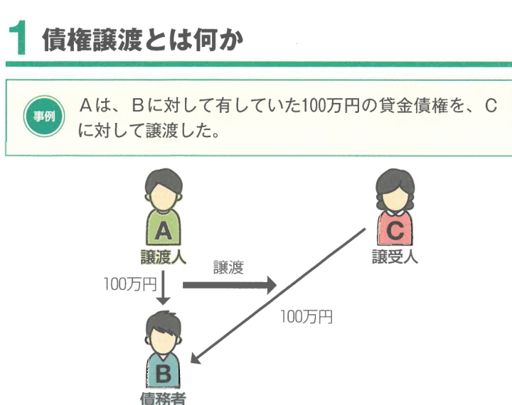
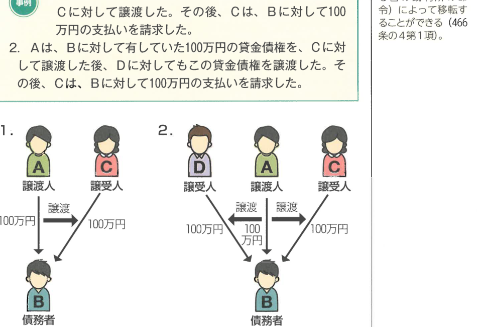
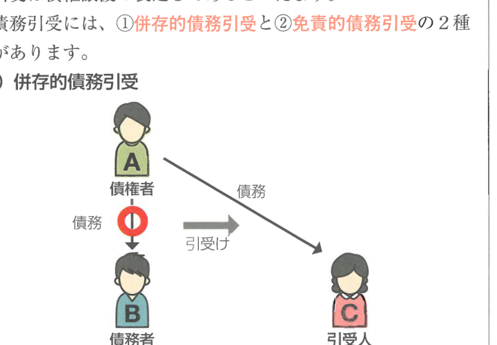
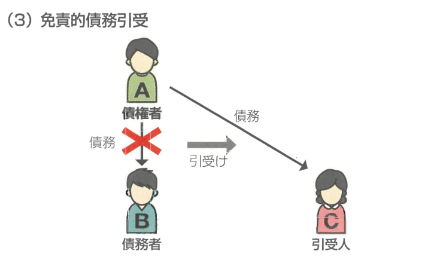
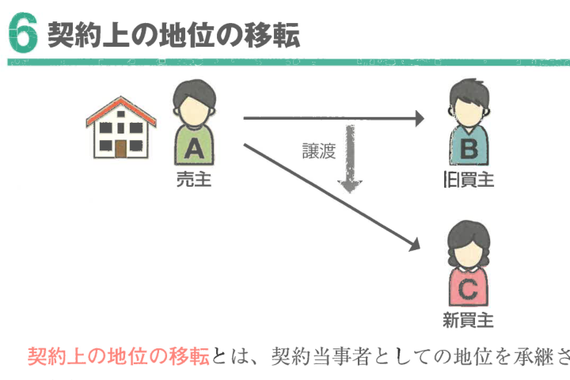

:::tip[学習のPOINT]
債権譲渡は、ほぼ毎年択一式で出題されたことのない大穴のテーマです（2023年は3年連続出題されていますが）。判例が多く出ているところなので、判例を中心に学習しておきましょう。
:::

## 1 債権譲渡とは何か

**債権譲渡**とは、債権の同一性を保ちながら契約によって債権を移転させることです。上の事例の場合、CはBに対して100万円の支払いを請求することができます（466条1項本文）。

## 2 譲渡性の制限

### （1）債権の性質による制限

債権の性質が譲渡を許さないものは、債権譲渡をすることはできません。

これは、債権者・債務者の個人的関係を基礎として発生する債権（扶養請求権など）のことです。

### （2）法律による制限

法律が生活保障の見地から本来の債権者に対してのみ給付させようとする債権については、明文で譲渡が禁止されています。

### （3）譲渡制限特約

当事者が債権譲渡を禁止・制限する旨の意思表示（**譲渡制限特約**）をした場合でも、債権譲渡の効力は妨げられません。

ただし、**悪意又は重過失**の第三者に対抗することができます（466条3項）。

:::info[重要判例]
譲渡制限特約は善意の第三者に対抗することができません（466条3項）。
:::

## 3 債権譲渡の対抗要件

### （1）対抗要件の構造

債権の譲渡は、**譲渡人が債務者に通知**をし、又は**債務者が承諾**をしなければ、債務者その他の第三者に対抗することができません（467条1項）。したがって、Bの承諾によっても、AはCに対して100万円の支払いを請求することができます。

この2人の通知又はBの承諾は、**確定日付のある証書**によってしなければなりません。

確定日付のある証書とは、確定日付のある証書によるAの通知又はBの承諾といい、DはCに対して貸金債権の取得を対抗することができます。

### （2）対抗要件の構造まとめ

| | 通知 | 承諾 |
|---|---|---|
| 主体 | 譲渡人 | 債務者 |
| 債務者に対する対抗要件 | ○ | ○ |
| 第三者に対する対抗要件 | 確定日付のある証書による通知 | 確定日付のある証書による承諾 |

:::warning[注意]
通知は**譲渡人**からしなければならず、譲受人からの通知では対抗要件になりません。また、承諾は**債務者**からしなければなりません。
:::

### （3）優先劣後の決定

債権が二重に譲渡された場合、譲受人相互の間の優劣の決定については、以下のとおりです。

確定日付のある通知が同時に到達した場合、各譲受人は、債務者に対してそれぞれの譲受債権全額の弁済を請求することができます。つまり、先着順ではなく、債務者の側からいずれの譲受人に弁済するかを選択できます。

確定日付のある通知が異なる時期に到達した場合は、**確定日付のある証書の通知の日時又は確定日付のある債務者の承諾の日時の先後**によって決定されます（最判昭49.3.7）。

:::info[重要判例]
譲受人の1人から弁済の請求を受けた債務者は、他の譲受人に対して弁済するまでは弁済を拒絶し、供託をすることが許されます。

同時に到達した場合は、各譲受人は債務者に対し、それぞれ全額の弁済を請求することができます（最判昭55.1.11）。
:::

## 4 債権譲渡の効果

債権譲渡がなされると、債権は同一性を失わずに移転し、各種の抗弁もこれに伴って当然に移転します。

すなわち、債務者は、**対抗要件具備時まで**に譲渡人に対して生じた事由をもって譲受人に対抗することができます（468条1項）。

## 5 債務引受

### （1）債務引受とは何か

**債務引受**とは、債務者の債務を引き受ける行為で自らが債務者となることをいいます。債務引受には、引受人が債務者の債務の履行を担保するために行う場合と、債務引受は引受人が債務者の譲渡を行うものです。つまり、債務引受は債権譲渡の裏返しであるといえます。

債務引受には、**①併存的債務引受**と**②免責的債務引受**の2種類があります。

### （2）併存的債務引受

**併存的債務引受**とは、引受人が債務者と同一内容の債務を引き受けることです。

併存的債務引受は、保証に類似しますから、債務者の意思に反しても行うことができます（470条2項）。なお、債務者と引受人の対外関係については**連帯債務**の規定が準用されます（470条1項）。

引受人は、債務引受がなされた時に債務者が有していた**抗弁**をもって債権者に対抗することができます。

### （3）免責的債務引受

**免責的債務引受**とは、債権の同一性を保ったまま債務が引受人に移転し、債務者が債権債務関係から離脱することです。

免責的債務引受は、債権者と引受人の契約ですることができますし、この場合、債務者と引受人の間でした行為は債権者がその行為を承認した時に遡及して効力を生じます（472条2項）。

免責的債務引受の引受人は、債務者に対して求償権を取得しません（472条の3）。

## 6 契約上の地位の移転

**契約上の地位の移転**とは、契約当事者としての地位を承継させる契約のことです。

契約上の地位の移転をするためには、契約の当事者の一方が第三者との間で契約上の地位を譲渡する旨の合意をし、かつ、**契約の相手方の承諾**が必要です（539条の2）。

:::note[確認テスト]
**1** 当事者が譲渡制限特約をした場合には、債権譲渡の効力は生じない。

**2** 債権の譲渡は、譲渡人が債務者に通知をし、又は債務者が承諾をしなければ、債務者その他の第三者に対抗することができない。

**3** 債権が二重に譲渡された場合、譲受人相互の間の優劣は、通知又は承諾に付された確定日付の先後によって定められる。

**4** 債務者は、対抗要件具備時までに譲渡人に対して生じた事由をもって譲受人に対抗することができる。

---

**解答**

**1** × 債権譲渡の効力は妨げられない（466条2項）。

**2** ○（467条1項）

**3** × 確定日付のある通知が債務者に到達した日時又は確定日付のある債務者の承諾の日時の先後によって決定される（最判昭49.3.7）。

**4** ○（468条1項）
:::
