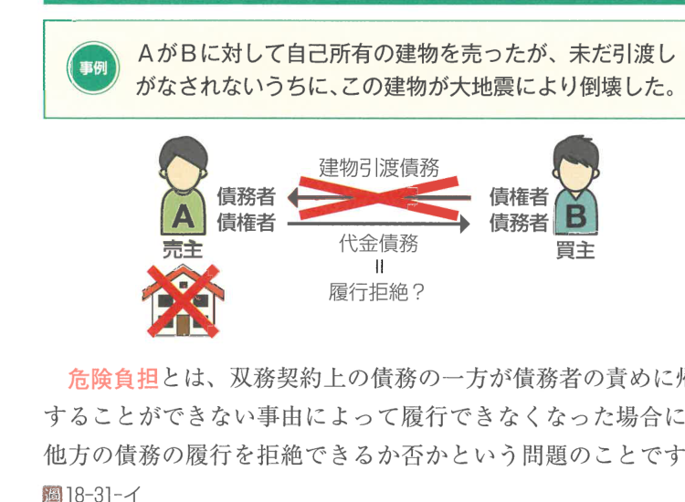
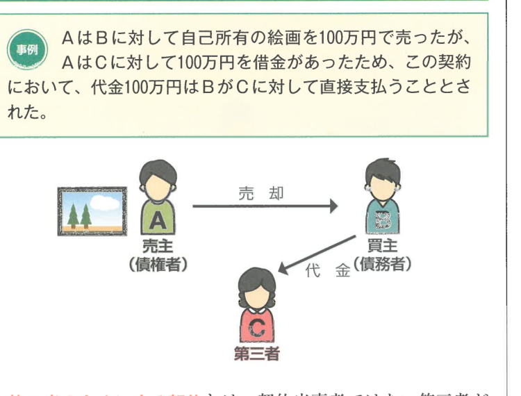

:::tip[学習のPOINT]
ここでは、契約全般に共通する事項について学習していきます。以後の各種契約を学習する前提ともなるところなので、じっくりと学習しておきましょう。
:::

## 1 契約の分類

### （1）双務契約と片務契約

| | 双務契約 | 片務契約 |
|---|---|---|
| **意義** | 契約の当事者双方が対価的な債務を負う契約 | 契約の当事者の一方のみが債務を負う契約 |
| **具体例** | 売買・賃貸借・請負・交換・有償委任・有償寄託・和解・雇用 | 贈与・使用貸借・無償委任・無償寄託 |

:::info[重要]
消費貸借は、利息の合意があっても双務契約ではなく、片務契約に分類されます。これは片務契約はこれに限らないという点に注意しましょう。
:::

### （2）有償契約と無償契約

| | 有償契約 | 無償契約 |
|---|---|---|
| **意義** | 契約の当事者がお互いに対価的な出損をする契約 | 契約の当事者の一方のみが出損をする契約 |
| **具体例** | 売買・賃貸借・請負・交換・有償委任・有償寄託 | 贈与・使用貸借・無償委任・無償寄託 |

有償契約には売買の規定（担保責任など）が準用されます（559条）。

### （3）諾成契約と要物契約

| | 諾成契約 | 要物契約 |
|---|---|---|
| **意義** | 当事者の合意のみで成立する契約 | 合意のほかに目的物の引渡しが必要な契約 |
| **具体例** | 原則としてほぼすべての契約 | 書面によらない消費貸借（587条の2） |

## 2 契約の成立

### （1）申込みと承諾

契約は、**申込み**と**承諾**が合致することで成立します（522条1項）。

なお、承諾者が、申込みに条件を付し、その他変更を加えてこれを承諾したときは、その申込みの拒絶とともに**新たな申込み**をしたものとみなされます（528条）。

### （2）隔地者間の契約

**隔地者間の契約**とは、離れた者どうしがなんらかの通信手段によって行う契約をいいます。なお、対話者間のように申込みと承諾がその場で行われる契約もあります。

この隔地者間の契約の成立については、民法が幾つか特殊な規定を設けています。

#### ① 申込みの撤回

申込みの撤回については、以下のような処理がなされます。

**【申込みの撤回】**

| | 撤回の可否 |
|---|---|
| **承諾期間を定めた申込み** | 承諾期間内は撤回できないのが原則（523条1項） |
| **承諾期間を定めない申込み** | 承諾の通知を受けるのに相当な期間は撤回できないのが原則（525条1項）。ただし、申込者が撤回する権利を留保した場合はこの限りでない（525条1項ただし書） |

:::warning[注意]
申込者が申込みに対して承諾期間内に承諾の通知を受けなかったときは、その申込みは効力を失います。
:::

#### ② 申込後の死亡・行為能力喪失

意思表示は、表意者が通知を発した後に死亡し、意思能力を喪失し、又は行為能力の制限を受けたときであっても、そのためにその効力を妨げられません。

しかし、申込者が申込みの通知を発した後に死亡し、意思能力を喪失し、又は行為能力の制限を受けた場合において、その相手方が承諾の通知を発するまでにその事実を知ったときは、申込みは効力を失います（526条）。ただし、申込者がその事実が生じたとしてもその申込みは効力を有する旨の意思を表示していた場合は、この限りではありません（526条）。

## 3 同時履行の抗弁権

### （1）同時履行の抗弁権とは何か

双務契約の特殊な効力の一つに、相手方がその債務の履行を提供（債務の本旨に従った現実の提供または口頭の提供）するまでは、自己の債務の履行を拒むことができるという権利があり、これを**同時履行の抗弁権**といいます。この制度は、双務契約の当事者の公平を図るために認められたものです（533条）。

:::tip[学習のPOINT]
同時履行の抗弁権は、公平の観点から双務契約の当事者間で認められる重要な制度です。
:::

同時履行の抗弁権が成立するには、以下の要件が必要です。

#### ① 1個の双務契約から生じた相対立する債務が存在すること

本来が双務契約から生じた相対立する債務として、同時履行の抗弁権が認められます。

**【同時履行の関係】**

| 同時履行の関係にある | 同時に履行関係にない |
|---|---|
| 売買契約における目的物引渡しと代金支払い | 賃貸借契約の終了に基づく目的物返還と敷金返還（最判昭49.9.2） |
| 弁済と受取証書の交付（486条） | 賃貸借契約の終了に基づく目的物返還と造作買取代金の支払い（最判昭29.7.22） |
| 請負契約における目的物引渡しと報酬支払い（633条） | |

#### ② 相手方の債務が弁済期にあること

相手方の債務が弁済期（525条）にあることは、同時履行の抗弁権の要件です。

#### ③ 相手方が自己の債務の履行又はその提供をしないで履行を請求すること

双務契約の一方の当事者は、相手方がその債務の履行を提供するまでは、自己の債務の履行を拒むことができます。

### （3）効果

当事者の一方が相手方に対して、訴訟上、債務の履行を請求した場合、同時履行の抗弁権を主張すれば、**引換給付判決**がなされます（大判昭4.12.11）。

なお、留置権と同時履行の抗弁権についてまとめると、以下のようになります。

**【留置権と同時履行の抗弁権のまとめ】**

| | 留置権 | 同時履行の抗弁権 |
|---|---|---|
| **権利の性質** | 法定担保物権 | 抗弁権 |
| **権利を主張できる根拠** | すべての双務契約（ただし、同時履行の抗弁権が適用される場面を除く） | 双務契約の当事者間（533条） |
| **目的物の占有を失った場合** | 行使できなくなる | 行使できる（占有を前提としない） |
| **留置できる給付の内容** | 物の引渡し（物についてのみ）（295条） | 物の引渡しに限らない |
| **担保される自己の債権の内容** | 物に関する債権（295条） | 相手方の給付に対応する自己の給付 |
| **代位制度による満額請求** | あり（304条） | 不問 |
| **訴訟** | 引渡拒付判決はなされない | 引換給付判決がなされる（大判昭4.12.11、最判昭33.3.13） |

## 4 危険負担

**危険負担**とは、双務契約の当事者の一方の債務が、債務者の責めに帰することができない事由によって履行することができなくなったときに、他方の債務の履行を拒絶できるかどうかという問題のことをいいます（536条1項）。

:::info[重要判例]
たとえば事例において、AのBに対する建物引渡債務は履行不能となりますが、BのAに対する代金支払債務の履行を拒めるかどうかが問題となります。
:::

当事者双方の責めに帰することができない事由によって債務を履行することができなくなったときは、債権者は、反対給付の履行を拒むことができます（536条1項）。

また、債権者の責めに帰すべき事由によって債務を履行することができなくなったときは、債権者は反対給付の履行を拒むことができません。この場合において、債務者は、自己の債務を免れたことによって利益を得たときは、これを債権者に償還しなければなりません（536条2項）。

## 5 第三者のためにする契約

**第三者のためにする契約**とは、契約当事者ではない第三者が利益を受けるような内容の契約のことをいいます。

契約当事者はA（要約者）とB（諾約者）ですが、契約によって利益を受けるのは第三者Cです。例えば、AがBに対して自己所有の絵画を100万円で売ったが、AはCに対し100万円を借金があったため、この契約において、代金100万円はBがCに対して直接支払うこととしたような場合です。

第三者のためにする契約においては、第三者の権利は、その第三者が債務者に対して契約の利益を享受する意思を表示した時に発生します（537条3項）。つまり、第三者CがBに対して契約の利益を享受する意思を表した時に、100万円の支払請求権が発生します。

## 6 解除

### （1）解除とは何か

**解除**とは、契約成立後に生じた一定の事由を理由として、契約の効力を、契約の時に遡って消滅させることをいいます。解除は、契約を白紙に戻すための救済手段です。

### （2）要件

解除の要件は、以下のとおり、**相当の期間を定めた催告**が必要な場合とそうでない場合があります。

**【債務不履行による解除の要件】**

| | 要件 |
|---|---|
| **原則** | 相当の期間を定めた催告による解除（541条本文）。ただし、催告期間経過時の不履行がその契約および取引通念に照らして軽微であるときは解除できない（541条ただし書） |
| **例外** | 催告によらない解除（無催告解除）（542条） |

### （3）手続

契約の解除は、相手方に対する**意思表示**によってなされます（540条1項）。この解除の意思表示は、撤回することができません（540条2項）。

解除は、その当事者の一方が数人ある場合には、解除は、その全員から又はその全員に対してのみ、することができます（544条1項）。したがって、解除後は当事者のうちの1人について消滅時効が完成した場合でも、他の者については解除権は消滅しません。ただし、解除権が当事者のうちの1人について消滅したときは、他の者についても消滅します（544条2項）。

### （4）効果

当事者の一方がその解除権を行使したときは、各当事者は、その相手方を**原状に復させる義務**を負います（545条1項本文）。つまり、契約ははじめから無かったことになるので、すでに引渡しを受けた物があるときはこれを返還し、金銭を受領していたときは受領の時からの**利息**を付して返還しなければなりません（545条2項）。

ただし、解除によって**第三者の権利**を害することはできません（545条1項ただし書）。

:::note[確認テスト]
**1.** 契約は、申込みと承諾が合致することで成立する。

**2.** 双務契約の当事者の一方は、相手方がその債務の履行を提供するまでは、自己の債務の履行を拒むことができる。

**3.** 当事者双方の責めに帰することができない事由によって債務を履行することができなくなったときは、債権者は、反対給付の履行を拒むことができない。

**4.** 第三者のためにする契約においては、第三者の権利は、契約当事者が契約をした時に発生する。

---

**解答**

1. ○（522条1項）
2. ○（533条本文）
3. × 反対給付の履行を拒むことができる（536条1項）。
4. × 第三者が債務者に対して契約の利益を享受する意思を表示した時に発生する（537条3項）。
:::
