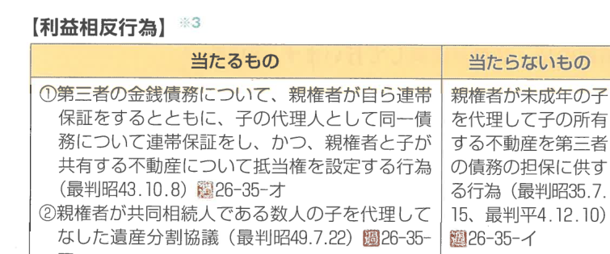

:::tip[学習のPOINT]
親権については、平成23年の民法の改正によって条文が変わっているところがありますので、改正点を中心に学習していきましょう。
:::

## 1 親権とは何か

**親権**とは、親が子を監護教育し財産を管理する権利義務のことです。そして、成年に達しない子は、父母の親権に服します（818条1項）。子が養子であるときは、養親の親権に服します（818条2項）。

## 2 親権の行使者

親権は、父母の婚姻中は、**父母が共同して**行います（818条3項本文）。ただし、父母の一方が親権を行うことができないときは、他の一方が行います（818条3項ただし書）。

## 3 親権の内容

### （1）身上監護権

親権を行う者は、**子の利益のために**子の監護及び教育をする権利を有し、義務を負います（820条）。

### （2）財産管理権

親権を行う者は、子の財産を管理し、かつ、その財産に関する法律行為についてその子を代表します（824条本文）。ただし、その子の行為を目的とする債務を生ずべき場合には、本人の同意を得なければなりません（824条ただし書）。

## 4 利益相反行為

### （1）特別代理人の選任

親権を行う父又は母とその子との利益が相反する行為（**利益相反行為**）については、親権を行う者は、その子のために**特別代理人**の選任を家庭裁判所に請求しなければなりません（826条1項）。これは、親権者が自分に有利になるように子の代理権の行使を親権者にさせないためです。

### （2）利益相反

利益相反に当たるかどうかは、親権者が子を代理してなす**行為自体（外形）**で判断するのであって、その行為の結果が子にとって不利益であるかどうかは問わないものと考えられています。

代理行為を客観的かついわゆる形式的に判断して利益相反となるかどうかにより、親権者の権限の有無を画一的に決定すべきであるとされています。

なお、利益相反行為に当たるかどうかは、以下のとおりです。

**【利益相反行為】**

| 当たるもの | 当たらないもの |
|---|---|
| 親権者が子の財産を自己に譲渡する行為 | 親権者が子を代理して子の財産を第三者に譲渡する行為（動機・目的を問わない） |
| 親権者の債務について子の財産に抵当権を設定する行為 | 親権者が子を代理して子名義で借金する行為 |
| 共同相続人である親権者と子の間の遺産分割協議 | 相続の放棄（親権者と子が共同相続人であっても） |

### （3）利益相反行為の効力

親権が相反する行為について、親権者が子を代理してした場合、その行為は**無権代理行為**となり、子が成年に達した後にこれを追認しない限り、子に対して効力を生じないとされています（大判明11.1.7）。

## 5 親権の喪失

児童虐待の防止を図り、児童の権利利益を擁護する観点から、平成23年の民法の改正により、**親権停止の審判**（834条の2）の制度が新設されました。

これらの要件については、以下のとおりです。

**【親権の喪失の要件】**

| | 親権喪失の審判（834条） | 親権停止の審判（834条の2） |
|---|---|---|
| 要件 | ①父又は母による親権の行使が著しく困難又は不適当であることにより子の利益を著しく害するとき | ①父又は母による親権の行使が困難又は不適当であることにより子の利益を害するとき |
| 消極要件 | 2年以内に、その原因が消滅する見込みがあるときを除く | ― |
| 期間 | 期限なし | 2年以内で、その原因が消滅する見込みがあるときの期間を定める |
| 請求権者 | 子、その親族、未成年後見人、未成年後見監督人又は検察官 | 子、その親族、未成年後見人、未成年後見監督人又は検察官 |

:::note[確認テスト]
1. 親権は、父母の婚姻中であっても、父又は母が単独で行う。
2. 親権を行う者は、子とその子の利益が相反する行為については、その子のために特別代理人を選任することを家庭裁判所に請求しなければならない。
3. 利益相反行為に当たるかどうかについて、親権者が子を代理してなす行為の動機により判断する。

---

**解答**
1. × 父母が共同して行う（818条3項本文）。
2. ○（826条1項）
3. × 行為自体（外形）で判断する（最判昭42.4.20）。
:::
