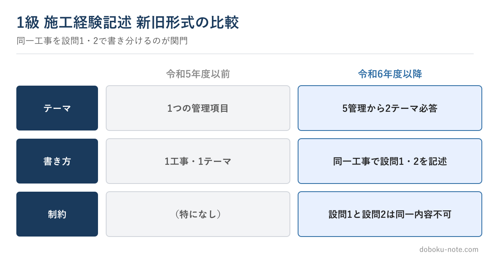

# 【1級土木施工管理技士】令和6年 新形式と「設問1・設問2の書き分け」 — 1級最大の関門

この教材は、技術士（総合技術監理部門）を持つ元・地方自治体の土木職（発注者）がつくっています。1級・2級土木施工管理技士にも自分で合格しており、受験者と同じ答案を書いた当事者です。

総監の5つの管理の視点で記述を分析し、発注者として施工計画書や工事成績評定の書類を審査してきた目で「評価される書き方」を整理しています。

**こんな人のための記事です**

- 1級の施工経験記述で、設問1と設問2をどう書き分けるか分からない
- 令和6年度の新形式（2テーマ必答）への備え方を知りたい
- 同じ工事で2つの管理項目を書くと、内容が似てしまう

**この記事でわかること**

- 1級の新形式（5管理から2テーマ必答）で変わったこと
- 「同一工事で設問1と設問2を書き分け、同一内容にしない」という1級の関門
- どの2テーマが来ても書けるようにする準備の仕方

---

筆者は元・地方自治体の土木職（発注者）で、1級土木施工管理技士を保有しています。1級の施工経験記述は、令和6年度の見直しで形式が変わり、**ここが2級との一番の違い**になりました。

形式の正確な仕様はサイトの無料解説に譲り、この記事では準備の実践に絞ります。

<!-- cta:pack-top -->
まず5管理の完成答案で書き方の型を固めるなら、1級の施工経験記述 完成答案集から始められます。自分の工事に近い想定工事や学科記述まで必要なら、購入後に上位パックを選べます。

https://note.com/dobokunote/m/m150c9db08902

## 1級の新形式で変わったこと

1級は5つの管理項目（品質・安全・工程・施工計画・環境対策）が対象です。令和6年度以降は、このうち**2つのテーマが指定され、両方を必答**します。

しかも、原則として**同一の工事**について設問1・設問2を記述し、**設問1と設問2は同一内容にできません**。同じ工事の、別の管理側面を、それぞれ書き分ける必要があるのです。ここが1級最大の関門です。

## なぜ「書き分け」でつまずくのか

一つの工事を選び、たとえば設問1で品質管理、設問2で安全管理を書くとします。このとき、課題や対応が似通ってしまい「実質同じことを2回書いている」状態になりがちです。これは採点上きびしく見られます。

書き分けのコツは、**同じ工事でも管理項目ごとに「困った場面」が違う**ことを意識することです。

橋梁工事なら、品質は「マスコンクリートの温度ひび割れ」、安全は「橋梁上の高所作業の墜落防止」、工程は「出水期や交通規制による制約」というように、同じ現場でも管理ごとに固有の課題が立ちます。

最初から別の場面・別の数値で組み立てれば、内容は重なりません。

## どの2テーマが来ても書けるようにする

新形式では、どの2つの管理項目が指定されるか分かりません。だから準備の核は、**一つの工事を5管理すべての視点から棚卸ししておく**ことです。

選んだ工事について、品質・安全・工程・施工計画・環境対策それぞれで「困ったこと・判断したこと」を短い骨子にしておく。本番でどの2つが指定されても、用意した骨子から2つを引き出して書き分けられます。

完成文まで作り込む必要はなく、課題→検討→対応の骨子を管理項目の数だけ持っておきます。

## 全組合せを完成形で確認する

5管理から2テーマの組合せは、C(5,2)=10通りあります。この10通りすべてを、同一工事の別現場・別工種で書き分けた完成答案を見ておくと、「どの組合せが来てもこう書ける」という型が身につきます。

その教材として、**2テーマの全10組合せを網羅した完成答案集**を用意しています。各組合せに想定工事のフル模範答案（監理技術者レベル）を収録し、設問1・設問2を別内容で書き分ける構成です。

https://note.com/dobokunote/m/m74cfd7c695d6

5管理それぞれのフル完成答案を管理項目別に読みたい場合は、こちらの完成答案集が対応します。

https://note.com/dobokunote/m/m150c9db08902

## 関連リソース

**施工経験記述 出題傾向と対策**（無料・doboku-note｜令和6年 形式見直しの仕様）

https://doboku-note.com/docs/civil-construction-1-secondary-experience-writing-guide

**1級土木 施工経験記述 2テーマ組合せ大全**（全10組合せ・同一工事で書き分け）

https://note.com/dobokunote/m/m74cfd7c695d6

**1級土木 施工経験記述 完成答案集**（5管理別フル答案）

https://note.com/dobokunote/m/m150c9db08902

設問ごとの書き分けを具体的な文章で確認したい方は[施工経験記述の記述例](https://doboku-note.com/docs/civil-construction-1-secondary-experience-writing-examples?utm_source=note&utm_medium=referral&utm_campaign=c1-essay-r6-split&utm_content=experience-writing-examples)をご覧ください。

---

<!-- cta:civil-mokuji -->
1級・2級土木のほかの記事・経験記述の答案集は「土木もくじ」から一覧できます。

上位資格の分析力・発注者として書類を評価してきた目・合格者の当事者性で、あなたの答案を合格ラインへ引き上げます。

https://note.com/dobokunote/n/n4fde0f62dc20