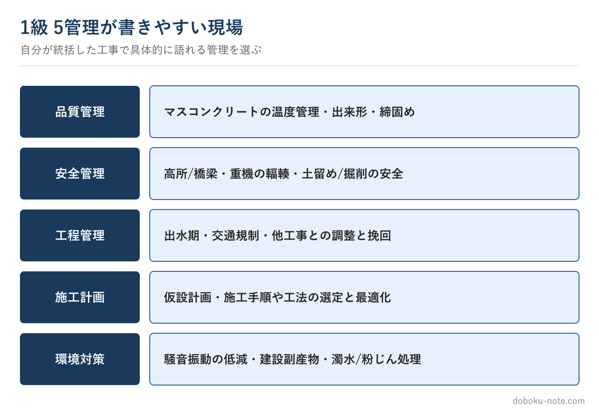

# 【1級土木施工管理技士】施工経験記述は「5管理」どれで書くか — 題材選びで半分決まる

この教材は、技術士（総合技術監理部門）を持つ元・地方自治体の土木職（発注者）がつくっています。1級・2級土木施工管理技士にも自分で合格しており、受験者と同じ答案を書いた当事者です。

総監の5つの管理の視点で記述を分析し、発注者として施工計画書や工事成績評定の書類を審査してきた目で「評価される書き方」を整理しています。

**こんな人のための記事です**

- 1級の施工経験記述を5管理のどれで書くか迷っている
- 品質・安全・工程は書けても、施工計画・環境対策が苦手
- どの工事を題材にすれば書きやすいか分からない

**この記事でわかること**

- 管理項目は「現場の事実」から逆算して選ぶべき理由
- 5管理それぞれが書きやすい現場と、書ける課題の例
- 新形式（2テーマ必答）で有利になる題材の持ち方

---

筆者は元・地方自治体の土木職（発注者）で、1級土木施工管理技士を保有しています。1級は2級と違い、品質・安全・工程に加えて**施工計画・環境対策**を含む5管理が対象です。

題材選び——「どの工事を、どの管理項目で書くか」——で答案の出来は半分決まります。出題形式の基本はサイトの無料解説に譲り、ここでは題材選びに絞ります。

<!-- cta:pack-top -->
自分の工事に近い「想定工事」を選んで5管理すべての完成答案をそろえるなら、想定工事100×5管理を全網羅した完全攻略パックが最短です。

https://note.com/dobokunote/m/m8290970a7f05

## 管理項目は「現場の事実」から逆算する

よくある失敗は、「品質管理で書きたい」と先に決めて、後から課題をひねり出すことです。一般論になり、薄い答案になります。

正しい順序は逆で、まず**自分が統括した工事で実際に苦労したこと**を思い出し、それがどの管理項目に当たるかを後から決めます。実際に判断した出来事には、課題・検討・対応が初めから備わっています。

## 5管理それぞれが書きやすい現場

**品質管理**——マスコンクリートの温度ひび割れ、出来形の精度、盛土の締固め度など、規格・基準に数値で対応した経験が向きます。

**安全管理**——橋梁上の高所作業、重機の輻輳、土留め・掘削の安全など、危険の予測と対策がセットで語れる現場。

**工程管理**——出水期の制約、交通規制下の施工、他工事との調整など、工程上の判断が見える現場。

**施工計画**——仮設備の計画、施工手順・施工方法の選定など、施工計画そのものを検討・最適化した経験。1級ならではの題材です。

**環境対策**——騒音・振動の低減、建設副産物の再資源化、濁水・粉じんの処理など、周辺環境への配慮を判断した経験。

## 新形式では「一つの工事を5管理で語れる」と有利

令和6年度以降は2テーマ必答で、しかも同一工事を設問1・設問2で書き分けます。だから、**一つの工事を5管理すべての視点から棚卸し**しておくと、どの2つが指定されても対応できます。

橋梁工事なら、品質＝温度ひび割れ、安全＝高所作業、工程＝出水期、施工計画＝架設工法の選定、環境＝騒音振動、というように、同じ現場から5つの管理の骨子を引き出しておく。これが新形式での題材準備の核です。

## 5管理の「完成形」をそろえて基準を持つ

苦手な管理項目（施工計画・環境対策など）は、完成答案を見たことがないだけ、という場合が多いです。5管理それぞれの完成形を見ておくと、「自分のあの工事なら、この管理で書けそうだ」という当たりがつきます。

品質・安全・工程・施工計画・環境対策の5管理それぞれに、複数工種のフル完成答案（監理技術者レベル）をまとめた有料マガジンを用意しています。

https://note.com/dobokunote/m/m150c9db08902

## 関連リソース

**施工経験記述 出題傾向と対策**（無料・doboku-note）

https://doboku-note.com/docs/civil-construction-1-secondary-experience-writing-guide

**施工経験記述 改善例**（無料・doboku-note）

https://doboku-note.com/docs/civil-construction-1-secondary-experience-writing-examples

**1級土木 施工経験記述 完成答案集**（5管理別・工種別のフル答案）

https://note.com/dobokunote/m/m150c9db08902

テーマを決める前に[4つの管理（品質・安全・工程・原価）](https://doboku-note.com/docs/civil-construction-1-guide-four-management?utm_source=note&utm_medium=referral&utm_campaign=c1-essay-theme5&utm_content=four-management)の全体像を押さえておくと、どの管理で書くかの判断が速くなります。

---

<!-- cta:civil-mokuji -->
1級・2級土木のほかの記事・経験記述の答案集は「土木もくじ」から一覧できます。

上位資格の分析力・発注者として書類を評価してきた目・合格者の当事者性で、あなたの答案を合格ラインへ引き上げます。

https://note.com/dobokunote/n/n4fde0f62dc20