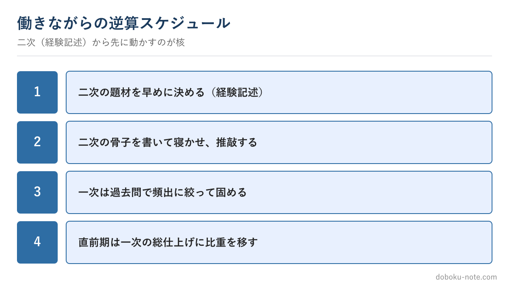

# 【2級土木施工管理技士】働きながら独学で合格する学習設計 — 一次・二次の時間配分

この教材は、技術士（総合技術監理部門）を持つ元・地方自治体の土木職（発注者）がつくっています。1級・2級土木施工管理技士にも自分で合格しており、受験者と同じ答案を書いた当事者です。

総監の5つの管理の視点で記述を分析し、発注者として施工計画書や工事成績評定の書類を審査してきた目で「評価される書き方」を整理しています。

**こんな人のための記事です**

- 働きながら2級土木施工管理技士を独学で受けたい
- 何から手をつければいいか、全体の設計が分からない
- 一次と二次に、どのくらい時間を割けばいいか知りたい

**この記事でわかること**

- 一次（択一）と二次（経験記述）は別物として設計する理由
- 二次から先に手をつけるべき理由と、逆算スケジュール
- 働きながらの現実的な時間配分

---

筆者は元・地方自治体の土木職（発注者）で、1級土木施工管理技士を保有しています。発注者の立場で、部下や周りの技術者が施工管理技士を受けるのを何人も見てきました。そこで感じたのは、**落ちる人の多くは実力ではなく「学習設計」でつまずいている**ということです。

2級土木は範囲が広く、働きながらだと時間が限られます。だからこそ、闇雲に勉強するより、最初に全体を設計するほうが結局は近道です。

この記事では、独学の全体設計を示します。各分野の具体的な対策は、サイトの無料解説に譲ります。

<!-- cta:pack-top -->
まず安全・品質・工程の完成答案で書き方の型を固めるなら、2級の施工経験記述 完成答案集から始められます。自分の工事に近い想定工事を広く探したい場合は、購入後に想定工事バンクへ進めます。

https://note.com/dobokunote/m/m1881a9578027

## 一次と二次は「別物」として設計する

最初に押さえたいのは、第一次検定（択一）と第二次検定（記述）は、求められる力がまったく違うということです。

一次は知識を広く問う暗記中心の試験。二次は、自分の施工経験を文章で説明する記述中心の試験です。

同じ勉強法では両方に対応できません。一次は反復で、二次は型と推敲で攻めます。この2つを分けて設計するだけで、対策の精度が上がります。

## 逆算スケジュール — 二次（経験記述）から先に手をつける

意外に思われますが、**準備は二次の経験記述から先に始める**ことをすすめます。

理由は2つあります。第一に、経験記述は「自分が経験した工事」を題材にするため、どの工事をどの管理項目で書くかを早めに決め、寝かせて推敲する時間が要ります。直前の詰め込みが最も効きにくい分野です。

第二に、経験記述の題材を考える過程で、施工管理の知識が整理され、一次の理解にもつながります。

二次の骨子を早めに固め、一次は試験が近づいてから過去問で仕上げる——この順序が、限られた時間では効率的です。

## 一次（択一）の独学 — 過去問中心で範囲を絞る

一次は範囲が広いので、テキストを最初から通読すると時間が足りません。**過去問を起点に、出るところから固める**のが鉄則です。

過去問を解き、間違えた選択肢について「なぜ誤りか」を確認する。これを繰り返すと、頻出分野とそうでない分野が見えてきます。

出題の薄い分野に深入りせず、頻出分野を確実にする。合格は満点ではなく基準点超えなので、取れるところを落とさない設計が効きます。

## 働きながらの現実的な時間配分

平日にまとまった時間は取れない前提で組みます。平日は通勤や昼休みに一次の過去問を少しずつ、休日にまとまった時間で二次の経験記述を書いて推敲する——この役割分担が現実的です。

経験記述は「書いて、寝かせて、直す」のサイクルが効くので、休日ごとに一稿ずつ進めます。直前期は一次の総仕上げに比重を移します。大事なのは、毎日机に向かう時間より、**二次を早く動かし、一次を頻出に絞る**という設計です。

## まとめ

- 一次と二次は別物。暗記の一次、型と推敲の二次として分けて設計する
- 準備は二次（経験記述）から。題材を早く決めて寝かせる
- 一次は過去問起点で頻出に絞る
- 働きながらは「平日=一次の反復／休日=二次の推敲」の役割分担

経験記述をどう書くかの具体は、別の記事と教材にまとめています。完成した答案を一度見ておくと、二次の準備の解像度が一気に上がります。

## 関連リソース

**施工経験記述 出題傾向と対策**（無料・doboku-note）

https://doboku-note.com/docs/civil-construction-2-secondary-experience-writing-guide

**2級土木施工管理技士の過去問解説・テキスト**（無料・doboku-note）

https://doboku-note.com

**2級土木 施工経験記述 完成答案集**（二次対策のフル答案）

https://note.com/dobokunote/m/m1881a9578027

週単位の配分まで落とし込みたい方は[2級土木の学習計画の立て方](https://doboku-note.com/docs/civil-construction-2-guide-study-plan?utm_source=note&utm_medium=referral&utm_campaign=2c-study-design&utm_content=study-plan)もあわせてご覧ください。

---

<!-- cta:civil-mokuji -->
1級・2級土木のほかの記事・経験記述の答案集は「土木もくじ」から一覧できます。

上位資格の分析力・発注者として書類を評価してきた目・合格者の当事者性で、あなたの答案を合格ラインへ引き上げます。

https://note.com/dobokunote/n/n4fde0f62dc20
