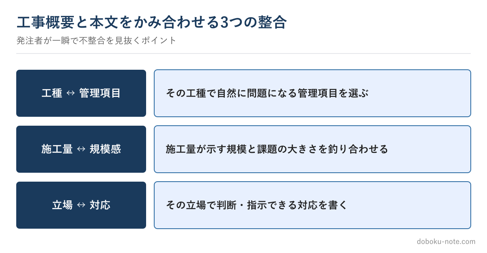

# 【2級土木施工管理技士】施工経験記述「工事概要」の書き方 — なぜ概要欄で減点されるのか

この教材は、技術士（総合技術監理部門）を持つ元・地方自治体の土木職（発注者）がつくっています。1級・2級土木施工管理技士にも自分で合格しており、受験者と同じ答案を書いた当事者です。

総監の5つの管理の視点で記述を分析し、発注者として施工計画書や工事成績評定の書類を審査してきた目で「評価される書き方」を整理しています。

**こんな人のための記事です**

- 施工経験記述の「工事概要」をどう書けばよいか迷っている
- 本文（設問1・2）は書けても、概要欄が埋まらない
- 工事概要が原因で減点されると聞いて不安

**この記事でわかること**

- 工事概要が「本文の前提条件」である理由
- 発注者・採点側が概要欄でチェックしている3つの整合
- 施工量・工期・立場の書き方でやりがちな失敗と直し方

---

筆者は元・地方自治体の土木職（発注者）で、1級土木施工管理技士を保有しています。発注者として工事書類を見ていた経験から言うと、施工経験記述の「工事概要」は、多くの受験者が軽く見て損をしている欄です。

工事名や工期を機械的に埋める欄だと思われがちですが、採点側にとって概要は**本文を読むための前提条件**です。ここがあいまいだったり本文と食い違っていたりすると、その後の答案がどれだけ立派でも信頼が下がります。

記入項目そのものの一覧はサイトの無料解説にまとめてあるので、この記事では「**なぜ概要で減点されるのか**」に絞ります。

<!-- cta:pack-top -->
まず安全・品質・工程の完成答案で書き方の型を固めるなら、2級の施工経験記述 完成答案集から始められます。自分の工事に近い想定工事を広く探したい場合は、購入後に想定工事バンクへ進めます。

https://note.com/dobokunote/m/m1881a9578027

## 工事概要は本文の「前提条件」である

設問本文で語る課題は、「その工事概要なら自然に起こりうること」でなければなりません。

たとえば本文で「狭隘な現場で重機の輻輳が課題だった」と書くなら、概要の工種・施工場所・施工量から、その狭さが想像できる必要があります。

概要では広々とした河川敷の工事に見えるのに、本文で急に都市部の狭さを語り出すと、読み手は「概要と話が違う」と感じます。

概要を先に固め、本文の課題はその概要から無理なく出てくるものを選ぶ。この順序を守るだけで、整合性の崩れはほぼ防げます。

## 採点側が概要で見ている3つの整合

発注者として、また採点する立場で概要を見るとき、無意識に次の3点を照合しています。

**工種と管理項目の整合**——書こうとしている管理項目（安全・品質・工程）が、その工種で自然に問題になるか。コンクリート工で品質、土工で工程、というように、工種と課題がかみ合っているか。

**施工量と課題の規模感の整合**——施工量が示す工事の規模と、本文の課題の大きさが釣り合っているか。具体例を挙げます。

概要が「掘削深0.8mの小規模な管布設工」なのに、本文で「土留め支保工の切ばり軸力の計測管理」を課題にすると、浅い掘削に大がかりな支保工は通常不要なので、即座に違和感を持たれます。

**立場と対応の整合**——あなたの立場（現場代理人・主任技術者など）でその対応を判断・指示できるか。立場を超えた対応を書くと、当事者性が薄れます。

この3つがそろっていれば、本文に入る前から答案の土台は安定します。

## 施工量・工期・立場でやりがちな失敗

**施工量を「一式」で済ませる**——規模感が伝わらず、本文の課題が宙に浮きます。悪い例は「護岸工　一式」。直すなら「**ブロック積護岸　延長120m、掘削土量1,500m3**」のように、工種に応じた数量を必ず入れます。

延長・面積・体積・本数のどれかが入るだけで、規模が一気に伝わります。

**工期と内容が合わない**——3か月の工期なのに本文で大規模な再施工を語る、あるいは長い工期なのに課題が小さい、といったズレに注意します。

**立場を盛りすぎる**——実際より上位の立場を書くと、対応との整合が取れなくなります。施工経験記述は「自分が経験した工事」が大前提で、経験していない工事と判明すれば失格です。背伸びをしないことが、結局いちばん減点されません。

## 発注者は「概要の3行」で本文の予想がつく

一つ、見る側の感覚を共有します。発注者として施工計画書を見るとき、私は工事名・工種・施工量の3行を読んだ時点で、「この工事ならこういう苦労があったはずだ」と中身を予想します。経験豊富な採点者も同じです。

だから概要と本文が食い違うと、予想が裏切られて「この人は本当にこの工事をやったのか」という疑いが生まれます。逆に、概要から予想したとおりの課題が本文に出てくると、「現場を知っている人の答案だ」と一気に信頼されます。

概要は、その信頼の入り口なのです。

## 概要から本文まで一貫した答案を見て掴む

工事概要でつまずく人の多くは、「概要と本文が一本でつながった答案」を見たことがありません。完成した答案を見ると、「概要のこの施工量があるから、本文のこの課題が自然に出てくるのか」という前提のつながり方が体でわかります。

安全・品質・工程の3管理それぞれに、工事概要から本文までを一貫させたフル完成答案をまとめた有料マガジンを用意しています。各答案に置換ガイドと採点者視点のチェックポイントを付けています。

https://note.com/dobokunote/m/m1881a9578027

## 関連リソース

**施工経験記述 出題傾向と対策**（無料・doboku-note｜記入項目の一覧と要領）

https://doboku-note.com/docs/civil-construction-2-secondary-experience-writing-guide

**施工経験記述 改善例**（無料・doboku-note）

https://doboku-note.com/docs/civil-construction-2-secondary-experience-writing-examples

**2級土木 施工経験記述 完成答案集**（概要〜本文まで一貫したフル答案）

https://note.com/dobokunote/m/m1881a9578027

工事概要が固まったら、答案全体の進め方は[2級 第2次検定のはじめ方](https://doboku-note.com/docs/civil-construction-2-secondary-getting-started?utm_source=note&utm_medium=referral&utm_campaign=2c-essay-outline&utm_content=secondary-getting-started)にまとめています。

---

<!-- cta:civil-mokuji -->
1級・2級土木のほかの記事・経験記述の答案集は「土木もくじ」から一覧できます。

上位資格の分析力・発注者として書類を評価してきた目・合格者の当事者性で、あなたの答案を合格ラインへ引き上げます。

https://note.com/dobokunote/n/n4fde0f62dc20