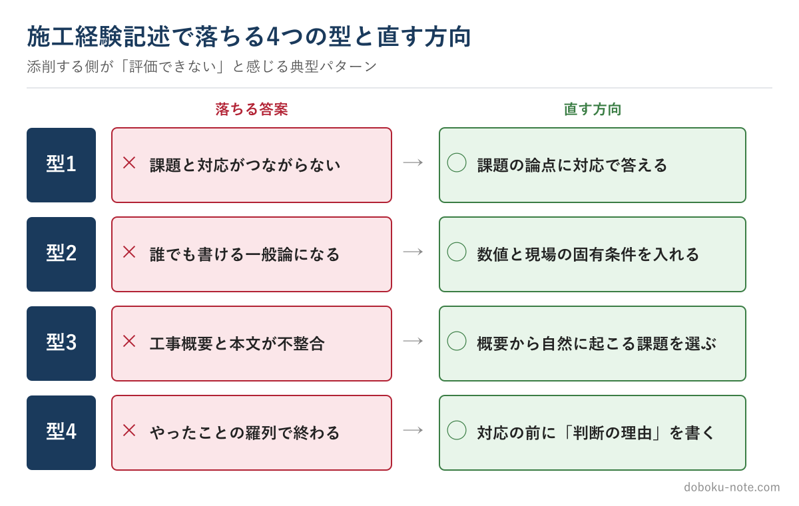

# 【2級土木施工管理技士】施工経験記述で落ちる答案の共通点 — 添削する側から見た4つの型

この教材は、技術士（総合技術監理部門）を持つ元・地方自治体の土木職（発注者）がつくっています。1級・2級土木施工管理技士にも自分で合格しており、受験者と同じ答案を書いた当事者です。

総監の5つの管理の視点で記述を分析し、発注者として施工計画書や工事成績評定の書類を審査してきた目で「評価される書き方」を整理しています。

**こんな人のための記事です**

- 2級土木の第2次検定（施工経験記述）の対策をしている
- 自分の答案が「これで通るのか」が分からず不安
- 何度書いても薄い答案になってしまう

**この記事でわかること**

- 施工経験記述で落ちる答案に共通する4つの型
- それぞれを「悪い例→直した例」で具体的に
- 採点する側が「これは評価できない」と感じる瞬間

---

筆者は元・地方自治体の土木職（発注者）で、1級土木施工管理技士を保有しています。発注者として施工計画書や工事書類を数多く確認してきましたし、自分自身も施工管理技士の試験を通ってきました。

その立場から言うと、施工経験記述で落ちる答案には、毎年ほぼ同じ「型」があります。

書き方を教える記事は多いのですが、この記事では逆に「**なぜ落ちるのか**」を、見る側の視点で4つに整理し、それぞれを悪い例と直した例で示します。出題形式や記入要領といった基本は、サイトの無料解説に譲ります（末尾にリンクを置きます）。

落ちる4つの型と、直す方向を先に一覧にします。

<!-- cta:pack-top -->
まず安全・品質・工程の完成答案で書き方の型を固めるなら、2級の施工経験記述 完成答案集から始められます。自分の工事に近い想定工事を広く探したい場合は、購入後に想定工事バンクへ進めます。

https://note.com/dobokunote/m/m1881a9578027

## 型1：課題と対応がつながっていない

最も多い落ち方です。(1)で挙げた「技術的課題」と、(2)で書いた「対応処置」が、論理的につながっていない。

たとえば、課題に「**軟弱地盤で施工機械の支持力が不足した**」と書いておきながら、対応が「工程に余裕がなかったので作業員を増員した」になっている。読み手は「支持力の話はどこへ行ったのか」と感じます。

増員は支持力不足の答えになっていないからです。

直すなら、課題で立てた論点にまっすぐ答えます。「軟弱地盤で支持力が不足した」が課題なら、対応は「**サンドマットを敷設し表層を安定処理して支持力を確保し、施工機械の沈下を防いだ**」のように、同じ土俵で返す。

課題→対応が一本の線でつながって初めて評価されます。

書き終えたら、(1)と(2)だけを続けて音読してみてください。話が飛んでいたら、それが落ちる原因です。

## 型2：誰が書いても同じ「一般論」になっている

「品質管理を徹底した」「安全に配慮して施工した」——この種の文は、その現場に行っていなくても書けます。だから評価されません。

悪い例：「コンクリートの品質を確保するため、品質管理を徹底した」。これは何も言っていないに等しい文です。

直した例：「**日平均気温が4℃を下回る寒中コンクリートとなったため、初期凍害を防ぐ目的で給熱養生を行い、コンクリート表面の温度を5℃以上に保って所定の養生日数を確保した**」。

気温・凍害という現場固有の条件、給熱養生という具体策、5℃以上という数値が入ることで、当事者が書いた答案になります。

一般論を疑うコツは、「この文は教科書のどのページにも書ける文ではないか」と自問することです。書けてしまうなら、数値か現場の固有条件を一つ足します。

## 型3：工事概要と本文がかみ合っていない

意外に多いのが、冒頭の「工事概要」と、設問本文の食い違いです。

たとえば、工事概要が「延長20mの小規模な排水路工」なのに、本文では「大規模な山留め支保工の沈下計測と再施工」を語っている。発注者として書類を見ていると、この種の不整合は一瞬で目につきます。

「この規模の工事で、その課題は起きないだろう」と引っかかった瞬間、答案全体の信頼が下がります。

工事概要は飾りではなく、本文の前提条件です。本文で語る課題が「その工事概要なら自然に起こりうる」かを必ず確認します。概要の施工量・工種から無理なく出てくる課題を選ぶ——これだけで不整合はほぼ防げます。

## 型4：「やったこと」だけで「なぜそうしたか」がない

対応処置を、作業手順の羅列で終えてしまう答案です。「足場を設置し、安全帯を使用させた。」——動作は書けているのに、「なぜその方法を選んだのか」がありません。

施工管理は判断の仕事です。直すなら、対応の前に判断の理由を一文加えます。

「**高さ5mでの作業で墜落の危険が高かったため、足場の組立時にも作業員が無防備にならないよう手すり先行工法を採用した**」。こう書くと、危険の予測と、工法選択の理由と、対策が一続きになり、主任技術者としての力量が伝わります。

「〜だったため、〜と判断し」という一文を入れるだけで、答案の格が変わります。

## 発注者・添削する側は「密度」で見ている

最後に、見る側の感覚を一つ共有します。採点は字数の多さではなく、**当事者にしか書けない一文があるか**で評価が決まります。

私が書類を見ていて「薄い」と感じるのは、決まって次の瞬間です。最後まで読んでも具体的な数値が一つも出てこない。課題が2つも3つも並んでいて焦点がない。どの現場にも当てはまる言葉だけで埋まっている。

逆に、たった一行でも「その気温で、その土質で、こう判断した」という文があれば、答案は一気に当事者のものになります。

字数を埋めることと、評価される密度を出すことは別物です。落ちる4つの型は、どれも「密度の不足」の現れ方が違うだけ、とも言えます。

## 落ちる型を抜けるいちばんの近道

4つの型は、文章術の問題というより「完成した答案を見たことがない」ことから来ています。手本なしに自己流で書くと、たいていどれかに落ちます。

近道は、課題→検討→対応が一本でつながり、固有条件と数値が入り、概要と整合した**完成答案を一度、頭から終わりまで通して読む**ことです。「評価される答案はこういう密度なのか」が体でわかると、自分の答案の薄さに自分で気づけるようになります。

その教材として、安全・品質・工程の3管理それぞれに複数工種のフル完成答案をまとめた有料マガジンを用意しています。

各答案に「自分の現場への置換ガイド」と「採点者が減点する箇所」を付けています（丸写しは失格につながるため、必ず自分の経験に置き換える前提の教材です）。

https://note.com/dobokunote/m/m1881a9578027

## 関連リソース

**施工経験記述 出題傾向と対策**（無料・doboku-note）

https://doboku-note.com/docs/civil-construction-2-secondary-experience-writing-guide

**施工経験記述 改善例**（無料・doboku-note）

https://doboku-note.com/docs/civil-construction-2-secondary-experience-writing-examples

**2級土木 施工経験記述 完成答案集**（安全・品質・工程／フル完成答案）

https://note.com/dobokunote/m/m1881a9578027

落ちる型を避けたうえで何から始めるかは、[2級 第2次検定のはじめ方](https://doboku-note.com/docs/civil-construction-2-secondary-getting-started?utm_source=note&utm_medium=referral&utm_campaign=2c-essay-fail&utm_content=secondary-getting-started)に順序立ててまとめています。

---

<!-- cta:civil-mokuji -->
1級・2級土木のほかの記事・経験記述の答案集は「土木もくじ」から一覧できます。

上位資格の分析力・発注者として書類を評価してきた目・合格者の当事者性で、あなたの答案を合格ラインへ引き上げます。

https://note.com/dobokunote/n/n4fde0f62dc20