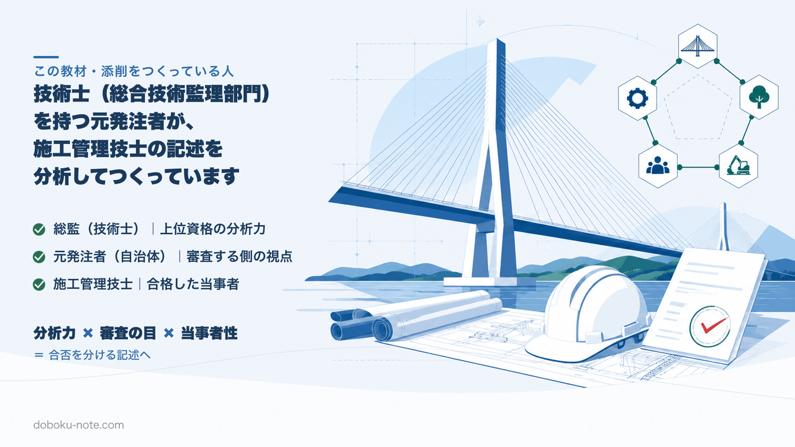

# 今週のお題｜安全管理 — 墜落・重機・崩壊による労働災害の防止

> これは会員専用の「週次お題」です。完成した模範答案は載せていません。**あなたが経験した工事**でお題に答え、添削つきプランで毎週1本の赤入れを受けてください。

> 本記事は1級・2級に共通する論点を練習するための独自予想です。公式問題の再現ではありません。実際の出題テーマと設問構造は、受験する級・年度の問題用紙で確認してください。

## 今週のお題

あなたが経験した工事のうち、**作業員の労働災害が懸念された工事**を1つ選び、「墜落・転落」「建設機械・クレーン」「土砂崩壊」のいずれかの防止について、次に答えてください。

- 練習A：労働災害を防止するために**現場で実施した具体的な措置**
- 練習B：その措置が必要になった**技術的な課題**（作業条件・現場条件）と、**検討・実施した対応**

> 工事概要（工事名・発注者・工事場所・工期・主な工種・施工量・あなたの立場）を先頭に必ず置いてください。

## なぜ今このお題を予想するか

- 安全管理は最頻出。第1週の「公衆災害」に対し、本週は**作業員の労働災害**という王道の切り口で、もう1本の引き出しを作る。
- 墜落・建設機械・崩壊は建設業の重篤災害の中心で、労働安全衛生法・各種規則の根拠を示しやすい。
- 1級の2テーマ必答では、安全をどちらの角度でも書けるようにしておくと本番で強い。

## 書く前の着眼点（採点者はここを見る）

1. **対象を作業員の労働災害に絞る** — 第三者・公衆の話に流れない（それは別のお題）。
2. **措置を法令・設備で具体化** — 墜落は作業床・囲い・手すり等を優先し、それらの設置が困難な場合に親綱や要求性能墜落制止用器具を用いる。車両系建設機械は作業計画・運行経路・立入禁止・誘導、移動式クレーンは定格荷重・アウトリガー・合図・玉掛け資格を分けて整理する。崩壊は土留め・法面勾配・点検を具体化する。
3. **作業条件→課題→措置の筋** — 「高所」「狭隘」「埋設物近接」など現場条件から課題が出る形にする。
4. **立場での判断** — 作業計画の作成・確認、危険箇所の指示など、実際に担当した範囲を書く。作業主任者は対象作業・規模の法定要件を満たし、実際に選任権限があった場合だけ記載する。

## 提出フォーマット（級別の答案形式差に注意）

**共通**：工事概要7項目（工事名・発注者・工事場所・工期・主な工種・施工量・立場）＋本文。

- **1級**：令和6・7年度は、出題側が指定する2テーマにそれぞれ(1)(2)で答える形式です。課題・検討項目・対応処置・評価を整理し、他の管理テーマにも備えてください。
- **2級**：令和6・7年度は、出題側が指定する2テーマに答える形式です。テーマに応じて、現場状況・技術的課題または留意事項と、検討項目・対応処置または対策と理由を整理してください。

> 提出前に [経験記述 字数カウントツール](https://doboku-note.com/tools/keiken-charcount?utm_source=note&utm_medium=referral&utm_campaign=civil-membership-odai-safety-labor&utm_content=keiken-charcount) で各段落の字数を確認してください。

## やりがちなNG（先に予告します）

- **公衆災害と混ざる** — 本週は作業員の労働災害。第三者の話を混在させない。
- **「安全教育を徹底」だけ** — 教育・KYの一般論で終わらず、その現場固有の危険源に対する設備的・工学的措置を書く。

## 提出方法

個人名・会社名・工事名などを匿名化し、「工事概要」「練習A」「練習B」を1回500字以内の3コメントに分けて投稿してください。週1本、採点者視点で赤入れして返します。

上位資格の分析力・発注者として書類を評価してきた目・合格者の当事者性で、あなたの答案を合格ラインへ引き上げます。
