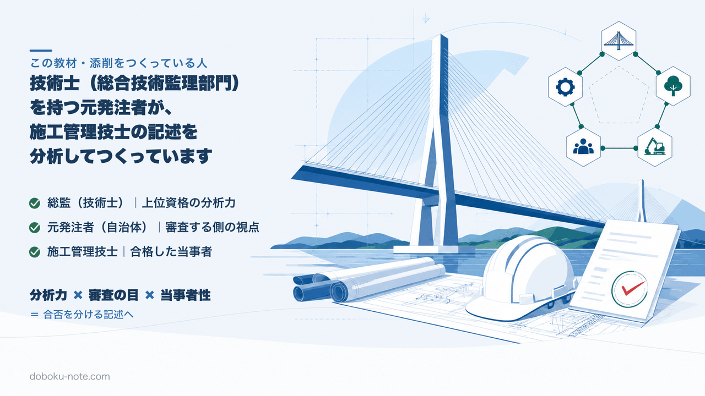

# 添削練習アーカイブ 01｜工事概要を具体化する

この教材は、技術士（総合技術監理部門）を持つ元・地方自治体の土木職（発注者）がつくっています。1級・2級土木施工管理技士にも自分で合格しており、受験者と同じ答案を書いた当事者です。

総監の5つの管理の視点で記述を分析し、発注者として施工計画書や工事成績評定の書類を審査してきた目で「評価される書き方」を整理しています。

**この記事でわかること**

- 工事概要でよくある書き方のあいまいさ（施工量・立場）
- NGの工事概要をOKへ直す手順
- 同じ誤りを本文で繰り返さないための共通ルール

直前に答案を人の目で確かめたいときは、ココナラで個別に受け付けています。書いた答案があれば添削、まだ書けていなければヒアリングから骨子（構成）をつくります。

1級（全5テーマ）

https://coconala.com/services/4418735

https://coconala.com/services/4350199

2級（全3テーマ）

https://coconala.com/services/4418778

https://coconala.com/services/4418785

> これは運用テスト用に作成した架空答案を使う添削練習です。実在する受験者の提出答案・添削実績ではありません。1級・2級の公式7項目に照らして、NGから改善例へ直す考え方を確認します。

## どこが問題だったか

工事概要は本文の前提です。ここが抽象的だと、後ろの記述が良くても「**どんな工事か分からない＝記述の信頼性が落ちる**」として、評価を落とすおそれがあります。この練習では「施工量」「立場」のあいまいさを直します。

## NG → OK

**NG**（架空サンプル）

- 工事名：道路改良工事
- 工種：道路工
- 規模：一式
- 立場：現場担当

問題点：工種が「道路工」では何をしたのか分からない。施工量が「一式」では定量性がない。立場「現場担当」は責任範囲が不明で、自分が実際に行った判断・指示の範囲が伝わりません。

**OK**（書き換え例）

- 工事名：○○線 道路改良工事
- 発注者：○○県○○土木事務所
- 工事場所：○○県○○市○○地内
- 工期：令和○年○月○日〜令和○年○月○日
- 工種：道路改良（路床・路盤工 ○○m、アスファルト舗装 ○○㎡、擁壁工 L=○○m）
- 施工量：延長 ○○m、幅員 ○○m、土工量 約○○m³
- 立場：施工管理担当（出来形・品質管理と日々の作業調整を担当）

なぜ：工種を**具体作業＋数量**で示すと、後段のエピソードに現実味が出る。立場は肩書きを作らず、実際に担当した施工管理上の役割と責任範囲を具体化します。

## 採点者視点の一言

工事概要は答案の「身分証明書」。**工種は数量つきで、立場は責任が分かる呼称で**書くだけで、本文の説得力が一段上がります。次は設問1の措置に同じ密度の数値を入れていきましょう。

## この練習で直す共通の誤り

- 規模を「一式」で済ませる → **延長・面積・土工量のいずれか1つは数値を入れる**
- 立場を「担当」で済ませる → **実際の肩書きと担当した施工管理上の役割**が分かる表現にする

同じ形式で直した自分の工事概要を人の目で確かめたいときは、個人名・会社名・工事名などを匿名化したうえで、冒頭のココナラから依頼できます。

上位資格の分析力・発注者として書類を評価してきた目・合格者の当事者性で、あなたの答案を合格ラインへ引き上げます。

自分の工事に近い想定工事を選んで、完成答案から書き分けを確かめる方法もあります。

1級（想定工事150件×5管理）

https://note.com/dobokunote/m/m8290970a7f05

2級（想定工事60件×5管理）

https://note.com/dobokunote/m/m8554e87ca6ec

以上、今回の添削練習でした。
