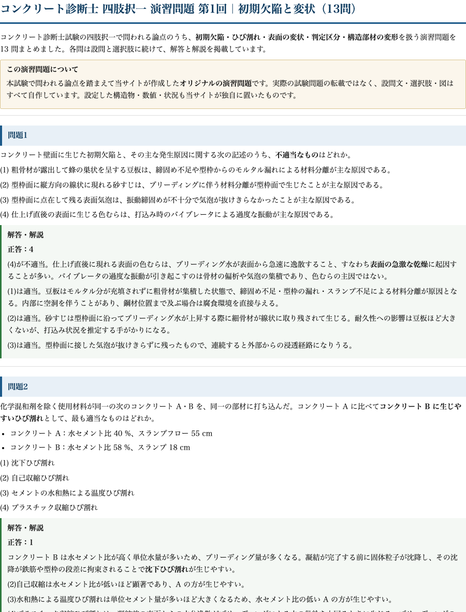

# コンクリート診断士｜四肢択一演習98問 PDF（8回分・全選択肢解説つき）

コンクリート診断士の四肢択一は、用語を覚えるだけでは安定しません。似た選択肢の違いを見抜き、誤っている箇所を説明できるまで反復する必要があります。

この教材は、試験の出題分野を踏まえて作成した**オリジナル演習98問**を、A4印刷用PDFにまとめたものです。実在する過去問題の再録ではありません。

**こんな人のための教材です**

- 体系学習を終え、初見の選択肢で得点力を確かめたい
- 劣化機構から補修・補強までを横断して弱点を見つけたい
- 正答番号だけでなく、4つの選択肢の正誤理由を確認したい
- 紙へ書き込みながら、間違えた問題を繰り返したい

## 収録内容

- 第1回　初期欠陥と変状　13問
- 第2回　劣化機構　14問
- 第3回　火害と複合劣化　13問
- 第4回　非破壊試験と分析　12問
- 第5回　原因推定と劣化予測　12問
- 第6回　特殊環境の劣化　13問
- 第7回　補修工法の選定　10問
- 第8回　電気化学的補修と補強　11問

合計98問です。各問の直後に正答と全選択肢の解説を配置しているため、判断を誤った理由をその場で確認できます。

## 紙面サンプル

問題文、4つの選択肢、正答、各選択肢の理由を同じ流れで読める紙面です。数値問題や組合せ問題も途中の判断を省略せず解説しています。

## この98問で確認できる力

**変状から原因候補を絞る力**

ひび割れ、浮き、剥離、錆汁、漏水などの変状を見て、初期欠陥と供用後の劣化を区別します。

**調査方法を目的に合わせて選ぶ力**

反発度、超音波、電磁誘導、自然電位、分極抵抗、成分分析などについて、何を測り、何が分かるかを整理します。

**診断から対策までつなぐ力**

劣化原因、進行予測、要求性能、補修・補強工法、施工後の確認を一つの流れとして判断します。

---

コンクリート診断士の記述式教材と商品一覧は「コンクリート資格もくじ」で確認できます。

https://note.com/dobokunote/n/nd59f471c9214

## PDF のダウンロードと学習手順

購入後、この記事末尾のファイルカードからA4印刷用PDFをダウンロードできます。

**1周目は時間を測らず、全肢を判定する**

正答を選ぶだけでなく、残り3肢がなぜ誤りかを短く説明します。説明できない肢には印を付けます。

**2周目は印の付いた肢だけを解き直す**

誤答原因を「知識不足」「条件の読み落とし」「用語の混同」「計算手順」に分けると、次に直す箇所が明確になります。

**3周目は8回分を通して解く**

分野をまたいで解き、劣化機構、調査、評価、対策の判断がつながっているかを確認します。

## ご利用上の注意

本教材の設問、選択肢、解答、解説はdoboku-noteが独自に作成したものです。実在する過去問題の再録ではありません。

内容は正確を期して作成していますが、基準や制度は改定される場合があります。受験時は最新の公式情報も確認してください。
