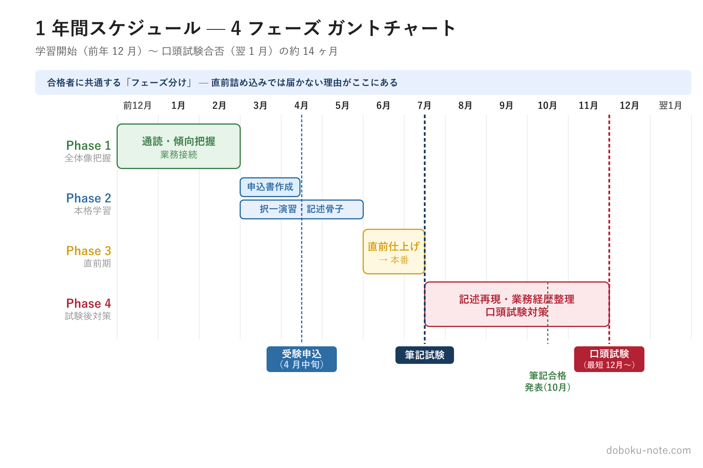
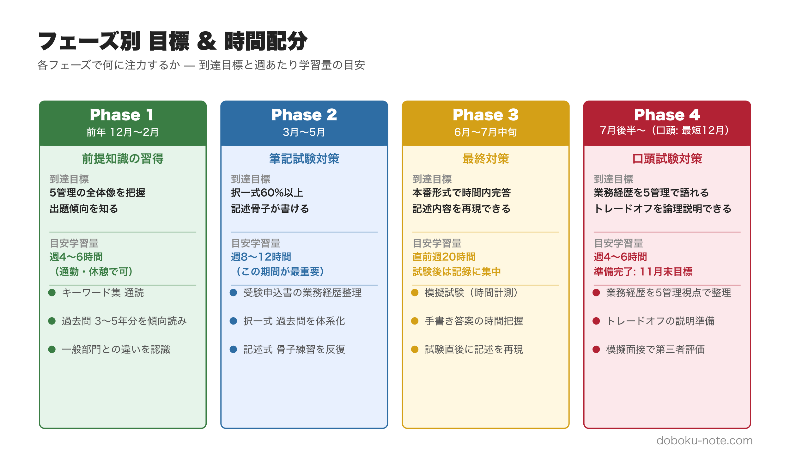
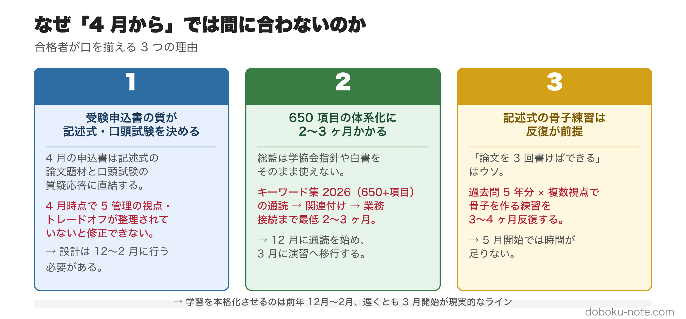
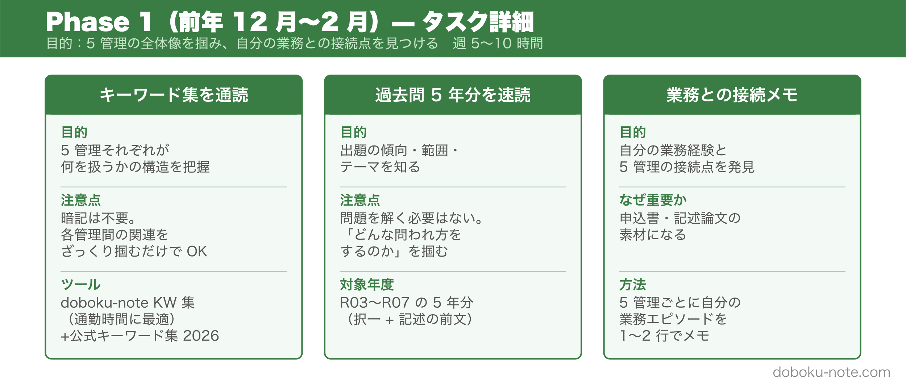
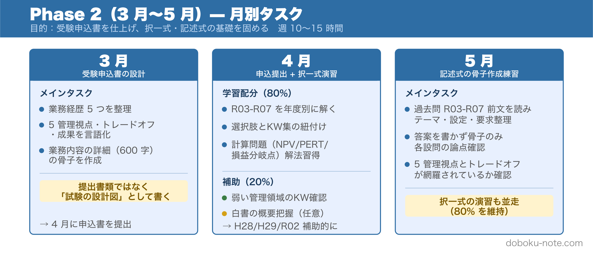
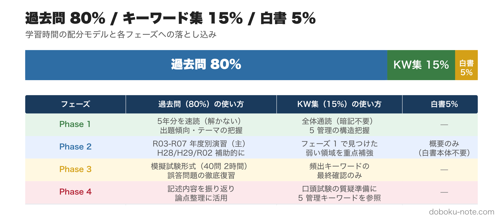
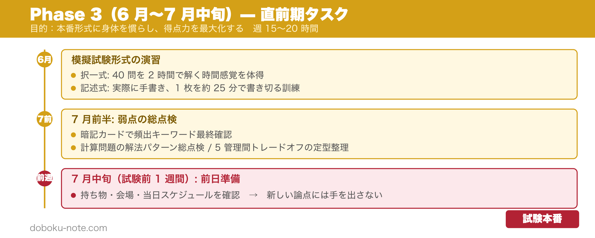
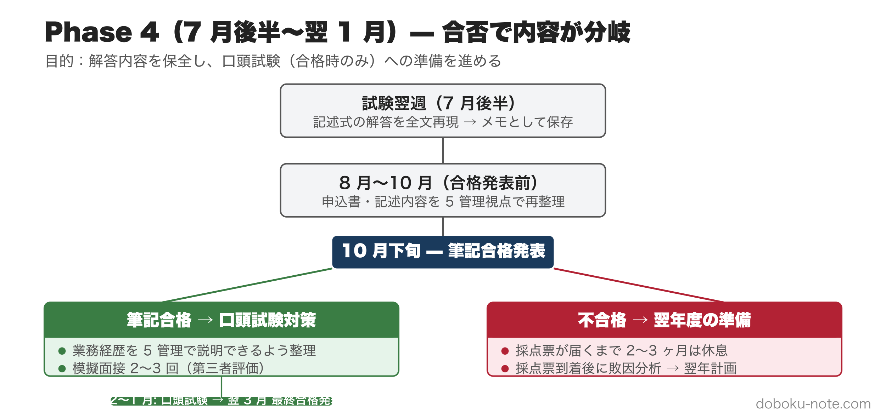
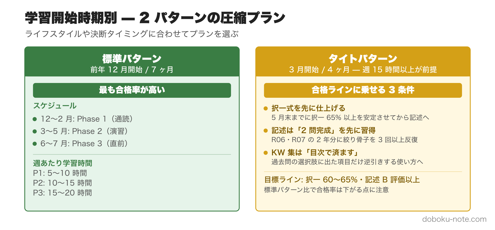
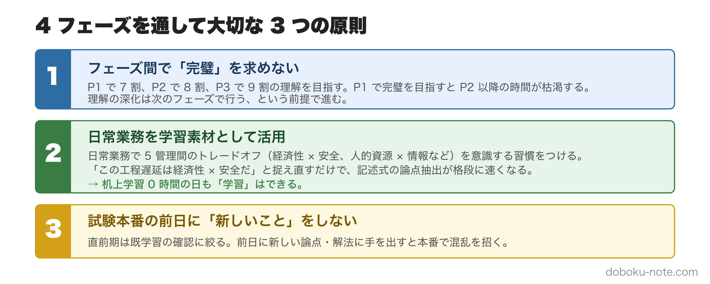

# 総監 二次試験 学習スケジュール完全版｜試験前 6-7 ヶ月を 4 フェーズに分けて合格ラインに届く設計

**この記事でわかること**

- 試験日（7 月中旬）から逆算した **4 フェーズの学習スケジュール**（前年 12 月開始が標準）
- 過去問 80% / キーワード集 15% / 白書 5% の **80/15/5 配分**を各フェーズにどう落とすか
- 開始時期別の代替プラン（**標準: 12 月開始** / **タイト: 3 月開始**）と各フェーズの週あたり学習時間

---

総合技術監理部門（総監）の合格率は一般部門より低く、出題範囲も「5 管理 + キーワード集 650 項目」と広範です。「直前に過去問を回せばなんとかなる」感覚で臨むと、6 月時点で記述式の骨子練習が間に合わず、択一式も伸び悩みます。

それでも今から間に合わせたい方には、5 管理を試験頻出順に整理した精読ガイドがあります（マガジン）。択一・記述に直結する論点を 5 本にまとめており、フェーズ 2 の本格学習を加速できます。

https://note.com/dobokunote/m/m607bf095b02a

合格者に共通するのは「**試験日**（7 月中旬）**から逆算して**、半年以上前から学習設計を組み立てている」という点です。本記事では、試験前 3 フェーズ＋試験後 1 フェーズの**計 4 フェーズ**で学習スケジュールを提案します。

<!-- cta:pack-top -->
> 記述式の型、5管理のトレードオフ、設問(3)の国家施策を一つの流れで固めるなら、[記述式コアパック](https://note.com/dobokunote/m/m6e7de5e4ea3d)から始められます。無料記事や立場別の模範論文を比較したい方は、[総監もくじ](https://note.com/dobokunote/n/n3ed4c77ceed6)で現在地に合う教材を選べます。

## 試験日程の前提

総監二次試験の年間日程は以下のとおりです。本記事のスケジュールは全てこの日程を起点に逆算しています。

- **4 月**：受験申込（業務経歴 5 つと業務内容の詳細を記載）
- 7 月中旬（日曜）：筆記試験（択一式 40 問 2 時間 + 記述式 600 字×5 枚 3 時間 30 分）
- **10 月下旬**：筆記試験合格発表
- **12 月〜翌 1 月**：口頭試験（筆記合格者のみ）
- **翌 3 月**：最終合格発表（技術士登録可）

詳細は [試験インデックス（doboku-note）](https://doboku-note.com/docs/pe-comprehensive-management-exam-index?utm_source=note&utm_medium=referral&utm_campaign=4-phase-learning-strategy) を参照してください。

## なぜ「4 月から」では間に合わないのか

多くの受験案内は「4 月の受験申込から学習を始める」前提で書かれていますが、これは**現実には間に合わない**ケースが大半です。理由は 3 つあります。

**1. 受験申込書の質が記述式・口頭の出来を決める**

4 月に提出する受験申込書（業務経歴 5 つ + 業務内容の詳細）は、記述式試験の論文題材と口頭試験の質疑応答に直結します。申込書を「ただ書いて出す書類」と捉えると、後のフェーズ全てに響きます。**4 月時点で 5 管理の視点・トレードオフ・成果が整理されていない状態**で申込書を書いてしまうと、後で修正できない設計上の弱点を抱えたまま試験を迎えます。

**2. 5 管理 × キーワード集 650 項目の体系化に時間がかかる**

総監は一般部門のような学協会指針や白書をそのまま流用できません。試験出題範囲の中心となる公式参考資料である「総合技術監理 キーワード集 2026」と過去問を起点に、自分で体系を組み立てる必要があります。**通読 → 関連付け → 自分の業務との接続**まで含めると、最低でも 2-3 ヶ月は必要です。

**3. 記述式の骨子練習は反復が前提**

記述式は「論文を 3 回書けば書けるようになる」ものではありません。**過去問 5 年分 × 予想問題** で骨子を作る練習を、3-4 ヶ月かけて反復するのが標準です。

これらを総合すると、**学習を本格化させるのは前年 12 月〜2 月**、遅くとも **3 月開始** が現実的なラインです。

---

## フェーズ 1: 全体像把握（前年 12 月〜2 月 / 試験 5-7 ヶ月前）

**目的**: 5 管理の全体像を掴み、自分の業務との接続点を見つける。

### 主タスク

- **キーワード集を通読**する。暗記不要、5 管理それぞれが何を扱い、相互にどう関連するかの構造を把握する
- **過去問 5 年分を速読**する（R03-R07）。問題を解く必要はなく、出題の傾向・範囲・テーマを知るのが目的
- **自分の業務経験と 5 管理の接続点**をメモする。後の受験申込書と記述式論文の素材になる

### 週あたり学習時間の目安

- 週 5-10 時間（働きながらでも継続可能なペース）
- 主に通勤時間・休日午前の活用が現実的

### このフェーズで完璧を求めない

7 割の理解で次に進むのが鉄則です。キーワード集を完全理解してからフェーズ 2 に進もうとすると、本格学習の時間が削られます。**理解の深化はフェーズ 2 以降で行う**前提で、まずは全体地図を頭に入れます。

> キーワード集 2026 の 650 以上の全項目は [doboku-note のキーワード集ページ](https://doboku-note.com/docs/pe-comprehensive-management-keyword-2026?utm_source=note&utm_medium=referral&utm_campaign=4-phase-learning-strategy) でスマホからも確認できます。通勤時間の通読に最適です。

---

## フェーズ 2: 本格学習（3 月〜5 月 / 試験 2-4 ヶ月前）

**目的**: 受験申込書を仕上げ、択一式・記述式の基礎を固める。学習の中核フェーズ。

### 主タスク

**3 月: 受験申込書の設計**（フェーズ 1 で得た接続点を文書化）

業務経歴 5 つと業務内容の詳細を、5 管理の視点・トレードオフ・成果が見える形で整理します。「提出書類」ではなく「記述式・口頭試験の設計図」として書くのがポイントです。

**4 月: 申込書提出 + 択一式の年度別演習開始**

- 過去問 R03-R07 を年度別に解く（**80%** の学習時間を投入）
- 各選択肢がキーワード集のどの項目に対応するか紐づける
- 計算問題（NPV、PERT、損益分岐点など）は解法パターンを習得

**5 月: 記述式の骨子作成練習**

- 過去問 R03-R07 の前文を読み、テーマ・設定条件・要求事項を整理
- **答案を書かず骨子のみ**作成する。各設問に何を書くか、5 管理の視点とトレードオフが網羅されているかを確認

### 80/15/5 配分の適用

このフェーズが**学習配分の主戦場**です。

- **過去問 80%**: 第 3 期 R03-R07 を主軸、第 2 期 H28-R02 から H28・H29・R02 の 3 年だけ補助的に
- **キーワード集 15%**: フェーズ 1 の通読で見つかった「弱い領域」を重点的に
- **白書 5%**: 国土交通白書・建設白書の概要把握のみ

配分の根拠は以下の記事で詳述しています（無料）。

https://note.com/dobokunote/n/nc360aaa381b0

### 週あたり学習時間の目安

- 週 10-15 時間（平日 1-1.5 時間 + 休日 5-7 時間）

---

## フェーズ 3: 直前期（6 月〜7 月中旬 / 試験 0-2 ヶ月前）

**目的**: 本番形式に身体を慣らし、得点力を最大化する。

### 主タスク

**6 月: 模擬試験形式の演習**

- 択一式: **40 問を 2 時間で**解く時間感覚を身体に覚えさせる
- 記述式: 答案用紙のフォーマットに**実際に手書き**で書く。1 枚を約 25 分で書き切る訓練

**7 月前半: 弱点の総点検**

- 暗記カードで頻出キーワードの最終確認
- 計算問題の解法パターン総点検
- 5 管理間トレードオフの定型フレーム整理

**7 月中旬**（試験前 1 週間）**: 前日準備**

- 持ち物・会場アクセス・服装の確認
- 当日のタイムスケジュールを書き出す（朝食、会場入り、休憩時の過ごし方）
- **新しい論点に手を出さない**（既学習の確認に絞る）

### 週あたり学習時間の目安

- 週 15-20 時間（働きながらの場合は休日全振り）

---

## フェーズ 4: 試験後（7 月後半〜翌 1 月 / 試験後 6 ヶ月）

**目的**: 解答内容を保全し、口頭試験（合格時のみ）への準備を進める。

### 試験翌週

- **記述式の解答を全文再現**する。記憶が新鮮なうちにメモを残すのが最重要
- 自分が「何を」「どの順序で」「どんなトレードオフで」書いたかを記録

### 8 月〜10 月（合格発表前）

- 受験申込書を見直し、**業務経歴の説明を 5 管理の視点で再整理**
- 記述式の論文を改めて読み返し、自分の主張を整理（「なぜその施策を選んだのか」「他の選択肢は何があったか」「トレードオフをどう判断したか」）

### 10 月下旬（筆記合格発表）以降

- **筆記合格時**: 口頭試験対策を本格化。業務経歴の 5 業務それぞれを 5 管理視点で説明できるよう整理、模擬面接を 2-3 回実施
- **不合格時**: 翌年度受験に向けた敗因分析（採点票が届くまで 2-3 ヶ月、その間は休息も含めて）

口頭試験の日程は**最短で 12 月初旬**に割り振られます。合格発表から本番まで約 1 ヶ月しかない場合もあるため、業務経歴の整理と模擬面接は**11 月末までに完了させる**のが安全なラインです。

### 注意：フェーズ 4 は合否で内容が分岐する

口頭試験対策は**筆記合格者のみ**が必要です。10 月末まで何を準備すべきか分からない、という不安があれば、「8-10 月は申込書の再整理」「10 月末以降に口頭対策」と切り分けて考えると進めやすくなります。

---

## 学習開始時期別の代替プラン

ライフスタイルや受験決断のタイミングで、12 月開始ができない人も多いはずです。2 つのパターンに分けて圧縮版を示します。

### 標準パターン（前年 12 月開始 / 試験まで 7 ヶ月）

上記の本編がこのパターンに対応します。**最も合格率が高い**スケジュール。

### タイトパターン（3 月開始 / 試験まで 4 ヶ月）

- 3 月: フェーズ 1 を**圧縮**（キーワード集通読 2 週間 + 過去問速読 2 週間）
- 4-5 月: フェーズ 2 と並走（申込書 + 択一演習 + 記述骨子練習を同時進行）
- 6-7 月: フェーズ 3（直前期は標準と同じ）

このパターンでは**週 15 時間以上**の学習時間確保が前提。働きながらでも、平日 2 時間 + 休日 5 時間で回せる計算。

**合格ラインに乗せるための 3 条件**

1. **択一式を先に仕上げる**。4 月に申込書を出したら 5 月末までに択一式 65% 以上を安定させる。記述骨子練習は 5 月に絞り込む。択一式が伸びきらないまま 6 月に入ると直前期に両方が中途半端になる。

2. **記述式は「全問書く」より「2 問を完成させる」を先に習得する**。4 ヶ月では全設問を徹底的に仕上げる時間がない。R06・R07 の記述問題 2 年分に絞り、各設問の骨子を 3 回以上反復する方が得点に直結する。

3. **キーワード集の通読は「目次で済ます」**。5 管理を暗記しようとすると時間切れになる。過去問の選択肢に出てきた項目だけを逆引きする使い方に切り替える。

**このパターンで現実的な目標ライン**: 択一式 60〜65%・記述式 B 評価以上。ただし標準パターンと比べると記述式の反復回数が少ないため**合格率は下がる**。4 月から始める場合は初年度をリハーサルと割り切り、申込書・試験形式の体験を最優先にするのが現実的です。

---

## 4 フェーズを通して大切な 3 つの原則

### 1. フェーズ間で「完璧」を求めない

フェーズ 1 で 7 割、フェーズ 2 で 8 割、フェーズ 3 で 9 割の理解を目指します。フェーズ 1 で完璧を目指すと、フェーズ 2 以降の時間が枯渇します。

### 2. 日常業務を学習素材として活用

机上学習だけでは限界があります。日常業務で 5 管理間のトレードオフ（経済性×安全、人的資源×情報など）を意識する習慣をつけると、記述式の論点抽出が格段に速くなります。「この工程遅延は経済性×安全だ」「この人事配置は人的資源×情報の両面で検討すべきだ」と日々の業務を捉え直すことが、記述式対策に直結します。

### 3. 試験本番の前日に「新しいこと」をしない

直前期は既学習の確認に絞ります。前日に新しい論点・解法に手を出すと、本番で混乱を招きます。

---

## doboku-note の関連リソース

体系的な解説・過去問演習は doboku-note でカバーしています。

- [総監 試験インデックス](https://doboku-note.com/docs/pe-comprehensive-management-exam-index?utm_source=note&utm_medium=referral&utm_campaign=4-phase-learning-strategy) — 試験日程・出題構成・学習ロードマップの全体像
- [キーワード集 2026](https://doboku-note.com/docs/pe-comprehensive-management-keyword-2026?utm_source=note&utm_medium=referral&utm_campaign=4-phase-learning-strategy) — 650 以上のキーワード解説（フェーズ 1 通読用）
- [記述式試験 戦略ガイド](https://doboku-note.com/docs/pe-comprehensive-management-essay-exam-strategy?utm_source=note&utm_medium=referral&utm_campaign=4-phase-learning-strategy) — 三層構造・600 字×5 枚の時間配分（フェーズ 3 直前用）
- [合格戦略ページ](https://doboku-note.com/docs/pe-comprehensive-management-exam-passing-strategy?utm_source=note&utm_medium=referral&utm_campaign=4-phase-learning-strategy) — 合格率から逆算した得点目標

## フェーズ別のおすすめ note 記事

**フェーズ 1**（全体像把握） — 択一式の出題範囲を 17 年分の傾向で俯瞰します。フェーズ 1 の通読と並行して読むと、何を重点的に押さえるべきかが見えてきます（無料）。

https://note.com/dobokunote/n/n3bcb87efddad

**フェーズ 1**（受験判断） — 一般部門との出題形式・難易度の違いを整理した記事です。総監受験を迷っている段階や、一般部門経験者がギャップを把握したいときに（無料）。

https://note.com/dobokunote/n/n7fb7f92f7841

**フェーズ 2**（5 管理の深掘り） — 択一・記述に直結する 5 管理の精読ガイド（マガジン）は記事末尾で案内します。

---

## 末尾：5 管理を体系化した精読ガイドのご案内

フェーズ 2 の本格学習で **5 管理のキーワードを試験頻出順で押さえたい** 方には、択一・記述に直結する精読ガイドがあります。安全管理・情報管理・経済性管理・人的資源管理・社会環境管理の 5 本を磁石的にまとめた magazine で、各記事は doboku-note の解説ページへの直リンク付きです。

https://note.com/dobokunote/m/m607bf095b02a

---

<!-- cta:tankan-mokuji -->
総監のほかの無料記事・有料マガジンは「総監もくじ」から一覧できます。

https://note.com/dobokunote/n/n3ed4c77ceed6
