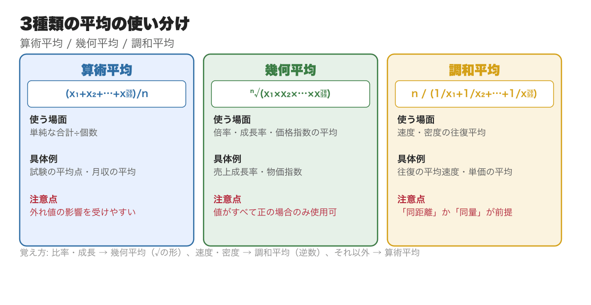
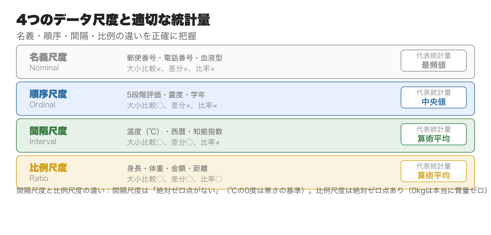
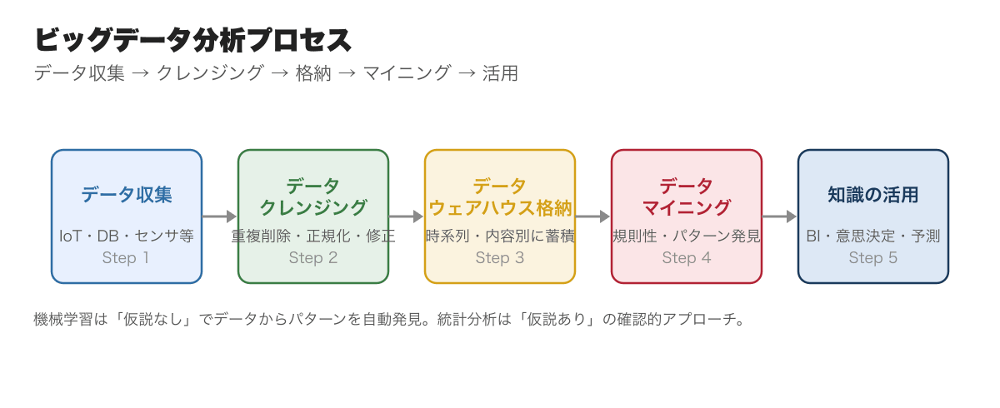
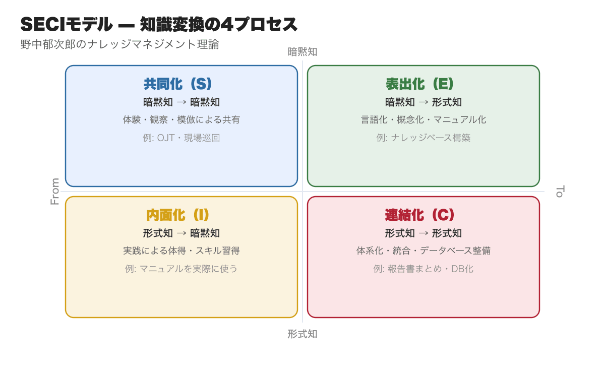
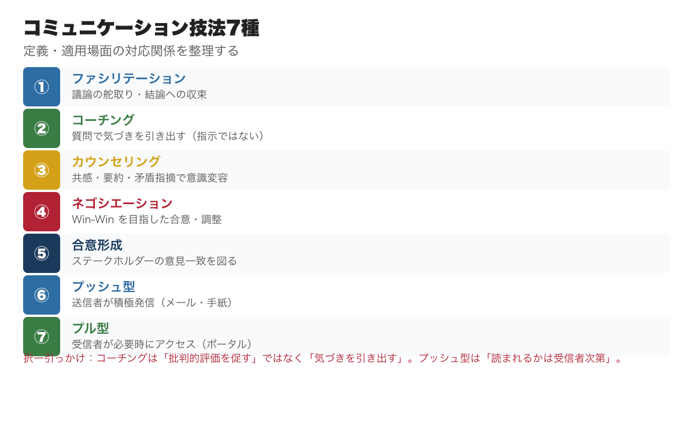
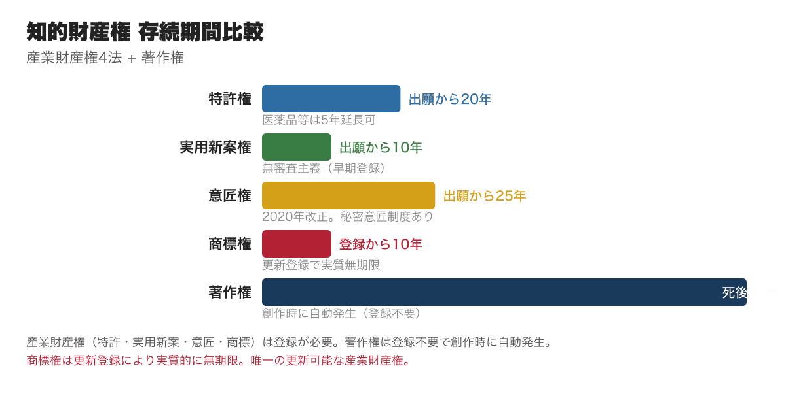
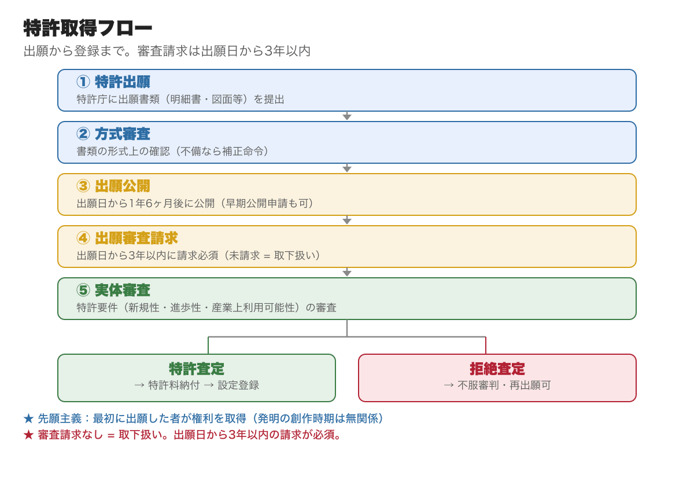
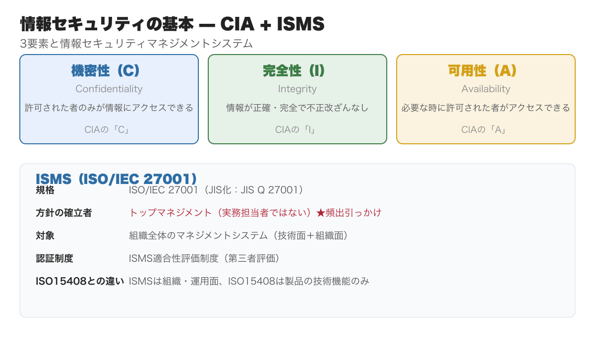
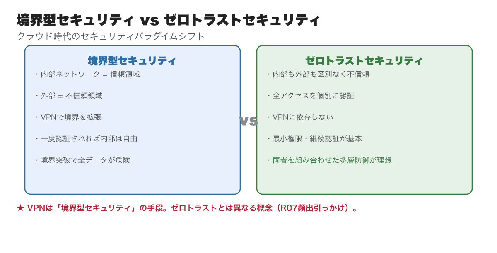

# 情報管理｜総監キーワード精読ガイド｜択一・記述で直結する全論点

**こんな人のための記事です**

- 情報管理の学習を始めたが、統計・知的財産権・情報セキュリティの境界が整理できていない
- 択一で統計手法の使い分けや著作権・特許権の定義問題に引っかかる
- 記述式で情報管理を選択肢に入れているが、AI・データ活用・セキュリティの論点が散漫になっている
- 試験直前に情報管理の全体像を素早く頭に入れ直したい

**この記事でわかること**

- 全**11,000字超**の精読ガイド（キーワード解説リンク・R3〜R7 出題例17件込み）
- 統計分析・知的財産権・情報セキュリティの出題頻度と優先順位
- 択一で繰り返し出る論点と引っかけパターン（手法の定義誤用・権利種別の混同・セキュリティ用語の言い換え）
- 各キーワードの詳細解説ページへの直リンク（クリックで定義・過去問・周辺概念が即確認）
- R3〜R7 の情報管理 過去問から **17件** を本文の論点直後に出題例として埋め込み

---

キーワード集を読んでも論点が頭に入らない、択一の引っかけパターンが見えない、5管理の範囲が広すぎてどこから手を付ければいいか優先順位がつかない──そんな受験者のために、17年分の過去問680問を分析して5管理を体系化した精読ガイドを、5本セット ¥1,980（単品4本分の値段で5本・21%OFF）でまとめ購入できます。

https://note.com/dobokunote/m/m607bf095b02a

情報管理は、5管理の中で**統計・データ分析・知的財産権・情報セキュリティと守備範囲が最も広い分野**です。「情報分析」「コミュニケーションと合意形成」「知的財産権」の3大エリアをカバーし、択一試験での出題比率も安定して高い傾向があります。

出題の核心は「大量の情報をどう収集・分析・保護・共有するか」という組織的な情報活用の体系です。個別の統計公式の暗記よりも、**各手法がいつ・何のために使われるかの文脈理解**を優先してください。

本記事では、択一・記述式の出題視点でポイントを絞り直します。

---

<!-- cta:tankan-mokuji -->
総監のほかの無料記事・有料マガジンは「総監もくじ」から一覧できます。

https://note.com/dobokunote/n/n3ed4c77ceed6

## 情報分析（優先度：最高）

情報分析では、どのような情報がどこにあり、それをどう収集・整理・活用するかを体系的に扱います。扱う情報には秘密情報・開示すべき情報が混在するため、適切な識別管理が求められます。

### 記述統計と代表値の使い分け

[記述統計](https://doboku-note.com/docs/pe-comprehensive-management-descriptive-statistics?utm_source=note&utm_medium=referral&utm_campaign=99-information-management)は収集済みデータの特徴を把握する手法です。代表値には平均値・中央値・最頻値・四分位数があり、それぞれ適した場面が異なります。

**平均値**（算術平均） — 全値を足してデータ数で割った値。すべての値が反映される一方、外れ値の影響を大きく受けます。試験の平均点や月収の集計など「単純な代表値が欲しい」場面で使います。

**中央値**（メディアン） — データを小さい順に並べたときの中央の値。外れ値に強い頑健な統計量です。年収分布など偏りが大きいデータで信頼できる代表値になります。

**最頻値**（モード） — 最も個数が多い値。カテゴリデータ（血液型・都市名など）にも使えます。データ数が少ない場合は信頼性が下がります。

**四分位数** — データを4等分した境界値。第1四分位数（下位25%）・第2四分位数（中央値）・第3四分位数（上位25%）で分布の広がりを把握します。

3種類の平均は場面によって使い分けが必要で、択一問題の定番です。

- **算術平均** — 単純な合計÷個数。一般的な「平均値」
- **幾何平均** — n個の積のn乗根。成長率・倍率・価格指数など比率の平均
- **調和平均** — 逆数の算術平均の逆数。速度・密度の往復平均など

**数値データの4尺度**（頻出）

名義尺度・順序尺度・間隔尺度・比例尺度の4分類と、適切な統計量の対応関係は択一の定番論点です。

- **名義尺度** — 区分・分類のみ（郵便番号・電話番号）。代表値は最頻値
- **順序尺度** — 大小関係はあるが間隔に意味なし（5段階評価・震度）。代表値は中央値
- **間隔尺度** — 等間隔で差に意味あり（温度℃・西暦）。代表値は算術平均（比率には意味なし）
- **比例尺度** — 差も比率も意味あり（身長・体重・距離）。代表値は算術平均

> **【出題例: [R7年度 Ⅰ-1-17](https://doboku-note.com/docs/pe-comprehensive-management-r07-primary?utm_source=note&utm_medium=referral&utm_campaign=99-information-management#1-17)】** 売上高の1年あたり平均倍率・往復の平均速度・試験平均点の3場面に用いるべき平均の組合せ。→ **正答①：倍率＝幾何平均、速度＝調和平均、試験点数＝算術平均。覚え方：比率・成長→幾何平均、速度→調和平均、それ以外→算術平均。**

### 推測統計（信頼区間・仮説検定）

推測統計は母集団から抽出した標本を用いて母集団の特性を推測する手法です。

**信頼区間と信頼係数** — 母集団の平均を推定する際に設ける区間。正規分布の場合、平均の±2σ内に95%、±3σ内に99%が含まれます。**信頼係数が大きいほど区間は広がる**（95%の区間＜99%の区間）という点が択一の頻出引っかけです。

**点推定と区間推定** — 点推定は母集団の特性値を1つの値で推定する手法。区間推定は確率を伴う区間で推定します。標本平均は母平均の最尤推定量（最も尤もらしい推定値）です。

**仮説検定** — 母集団に関する仮説が統計的に成り立つかを判断する手法。帰無仮説（「差がない」という否定的仮説）を設定し、それを棄却できるかを検討します。

> **【出題例: [R5年度 Ⅰ-1-21](https://doboku-note.com/docs/pe-comprehensive-management-r05-primary?utm_source=note&utm_medium=referral&utm_campaign=99-information-management#1-21)】** 5日間の来客数データから母平均μの信頼区間を求める。4.「信頼係数95%の信頼区間は信頼係数99%の信頼区間より広い」→ **正答4：逆。信頼係数が高いほど区間は広くなる**（95%＜99%）**。**

> **【出題例: [R3年度 Ⅰ-1-21](https://doboku-note.com/docs/pe-comprehensive-management-r03-primary?utm_source=note&utm_medium=referral&utm_campaign=99-information-management#1-21)】** 統計分析の記述で最も不適切なもの。2.「相関分析は説明変数が被説明変数に与える効果を分析する」→ **正答2：相関分析は変数間の関連の強さを分析する手法であり、因果関係を仮定しない。因果関係の分析は回帰分析。**

その他の統計手法は以下の通りです。

- **移動平均** — 時系列データの変動を滑らかにして傾向を掴む手法
- **[相関分析](https://doboku-note.com/docs/pe-comprehensive-management-correlation-analysis?utm_source=note&utm_medium=referral&utm_campaign=99-information-management)** — 2変数の関係を散布図で可視化し正・負・無相関を判別
- **[回帰分析](https://doboku-note.com/docs/pe-comprehensive-management-linear-regression?utm_source=note&utm_medium=referral&utm_campaign=99-information-management)** — 説明変数（x）で被説明変数（y）を予測する手法（単回帰・重回帰）
- **最小二乗法** — 誤差の二乗和を最小にして回帰直線を求める方法
- **因子分析** — 観測変数に影響を与えている潜在変数を探索する手法
- **主成分分析** — 相関する複数変数を少数の無相関な合成変数（主成分）に縮約する手法
- **指数化** — 基準値を100として他の値との乖離比率を比較する方法

「択一では手法の名称と定義の対応（特に相関分析＝因果関係を仮定しない）が引っかけになります。記述式論文では「定量的評価に〇〇分析を活用した」という具体的な手法名の挿入が評価されます。

### ビッグデータ分析とデータマイニング

ビッグデータを活用するためのプロセスは「データ収集→[データクレンジング](https://doboku-note.com/docs/pe-comprehensive-management-data-cleansing?utm_source=note&utm_medium=referral&utm_campaign=99-information-management)→[データマイニング](https://doboku-note.com/docs/pe-comprehensive-management-data-mining?utm_source=note&utm_medium=referral&utm_campaign=99-information-management)→知識の活用」という4段階です。

**[データウェアハウス](https://doboku-note.com/docs/pe-comprehensive-management-data-warehouse?utm_source=note&utm_medium=referral&utm_campaign=99-information-management)** — 業務データを時系列・内容別に分類し大量保管する倉庫。BIツールのデータソースになります。

**データクレンジング** — 収集データの重複・誤記・表記揺れを削除・修正・正規化する作業。データ品質の根幹となります。

**データマイニング** — データ群から未知の規則性やパターンを発見する手法の総称。仮説なし手法（機械学習）と仮説あり手法（統計分析）の2種類があります。

**[機械学習](https://doboku-note.com/docs/pe-comprehensive-management-machine-learning?utm_source=note&utm_medium=referral&utm_campaign=99-information-management)** — AIがデータから反復的に学習し、自ら相関関係やパターンを発見する技術。分類・回帰・クラスタリング等の手法が含まれます。混同行列（正解率・適合率・再現率・F値）は機械学習モデルの評価指標として択一に出題されています。

> **【出題例: [R3年度 Ⅰ-1-17](https://doboku-note.com/docs/pe-comprehensive-management-r03-primary?utm_source=note&utm_medium=referral&utm_campaign=99-information-management#1-17)】** 混同行列（4,500データ：真陽性30・偽陰性20・偽陽性70・真陰性4,380）に20個の偽陽性データを追加したとき、どの指標が変化するか。→ **正答1：正解率・適合率・F値は低下するが、再現率は変化しない**（再現率の分母＝実際の陽性数50は変わらない）**。**

> **【出題例: [R6年度 Ⅰ-1-18](https://doboku-note.com/docs/pe-comprehensive-management-r06-primary?utm_source=note&utm_medium=referral&utm_campaign=99-information-management#1-18)】** データ解析・データマイニングの技法に関する記述で最も不適切なもの。→ **主成分分析・ロジスティック回帰・クラスター分析の定義の区別が問われる。技法名と用途の対応を正確に覚える。**

**[BIツール](https://doboku-note.com/docs/pe-comprehensive-management-business-intelligence?utm_source=note&utm_medium=referral&utm_campaign=99-information-management)** — データウェアハウスの情報を可視化し、経営判断を支援するツール。

**[集合知](https://doboku-note.com/docs/pe-comprehensive-management-collective-intelligence?utm_source=note&utm_medium=referral&utm_campaign=99-information-management)** — Web上などで多くの人の知識を体系化する仕組み（Wikipediaが典型例）。

### マーケティング分析（優先度：中〜高）

マーケティング分析の手法は択一の定番論点です。それぞれの目的と構成要素を整理しておきます。

[SWOT分析](https://doboku-note.com/docs/pe-comprehensive-management-swot-analysis?utm_source=note&utm_medium=referral&utm_campaign=99-information-management) — 内部環境（Strengths/Weaknesses）と外部環境（Opportunities/Threats）の4象限で戦略を検討するフレームワーク。

[バリューチェーン分析](https://doboku-note.com/docs/pe-comprehensive-management-value-chain-analysis?utm_source=note&utm_medium=referral&utm_campaign=99-information-management) — 製品・サービスが顧客に届くまでの活動を「主活動」と「支援活動」に分けて付加価値の源泉を特定します。

3C分析 — Customer（顧客）・Competitor（競合）・Company（自社）の3視点で経営環境を整理するフレームワーク。

4C分析 — Customer Value（顧客価値）・Cost（顧客コスト）・Convenience（利便性）・Communication（コミュニケーション）。4Pを顧客視点に置き換えたもの。

[PPM分析](https://doboku-note.com/docs/pe-comprehensive-management-ppm-analysis?utm_source=note&utm_medium=referral&utm_campaign=99-information-management)（プロダクト・ポートフォリオ・マネジメント） — 市場成長率×市場占有率の4象限（花形・金のなる木・問題児・負け犬）で事業ポートフォリオを管理します。

RFM分析 — Recency（最終購買日）・Frequency（購買頻度）・Monetary（購買金額）の3軸で顧客を分類し優良顧客を特定します。

[4P分析](https://doboku-note.com/docs/pe-comprehensive-management-four-p-analysis?utm_source=note&utm_medium=referral&utm_campaign=99-information-management) — Product（製品）・Price（価格）・Place（流通）・Promotion（販促）の4要素でマーケティング戦略を設計します。

### ナレッジマネジメント（SECIモデル）

組織内で生まれる知識を体系的に管理・活用する概念がナレッジマネジメントです。野中郁次郎のSECIモデルが択一・記述両方で頻出です。

**[形式知](https://doboku-note.com/docs/pe-comprehensive-management-explicit-knowledge?utm_source=note&utm_medium=referral&utm_campaign=99-information-management)** — 文章・図表・数値など言語化・形式化できる知識。マニュアル・設計書・規程が典型例。

**[暗黙知](https://doboku-note.com/docs/pe-comprehensive-management-tacit-knowledge?utm_source=note&utm_medium=referral&utm_campaign=99-information-management)** — 言語化や形式化が難しい、個人の経験・直感・技能・人脈など。ベテラン職人の技術が典型例。

**SECIモデル**（4つの知識変換プロセス）

- **共同化**（Socialization） — 暗黙知→暗黙知。体験・観察・模倣による共有（OJT・現場巡回）
- **表出化**（Externalization） — 暗黙知→形式知。言語化・概念化（マニュアル化・ナレッジベース構築）
- **連結化**（Combination） — 形式知→形式知。体系化・統合（データベース整備・報告書まとめ）
- **内面化**（Internalization） — 形式知→暗黙知。実践による体得（マニュアルを読んで実際に試す）

> **【出題例: [R5年度 Ⅰ-1-18](https://doboku-note.com/docs/pe-comprehensive-management-r05-primary?utm_source=note&utm_medium=referral&utm_campaign=99-information-management#1-18)】** ナレッジマネジメントで最も適切なもの。5.「組織的に形式知化された知識を自分自身のものとして採り入れることで、形式知を暗黙知にすることができる」→ **正答5：SECIモデルの内面化**（I）**の正確な説明。形式知を実践で暗黙知に変換する。**

択一では「暗黙知はすべて形式知にすべき」「連結化は非効率」といった誤った記述が選択肢に出ます。SECIモデルは4プロセスが連続する螺旋構造であり、どのプロセスも不可欠です。

---

## コミュニケーションと合意形成（優先度：高）

組織や個人との意思疎通・信頼関係の維持において、コミュニケーション技法と緊急時対応の知識が求められます。

### コミュニケーション技法7種

コミュニケーション技法の7分類は、名称・定義・適用場面の対応関係が択一問題として出題されます。

[パーソナル・コミュニケーション](https://doboku-note.com/docs/pe-comprehensive-management-personal-communication?utm_source=note&utm_medium=referral&utm_campaign=99-information-management)の7技法は以下の通りです。

1. **ファシリテーション技法** — 議論の舵取り役。参加者が発言しやすい環境を作り、結論に向かって収束するよう導く
2. **コーチング技法** — 対話によって相手の自己実現・目標達成を支援。質問で気づきを促す（指示ではなく引き出す）
3. **カウンセリング技法** — 相手の話に共感・要約・矛盾指摘をして意識の変容を試みる
4. **ネゴシエーション技法** — 意見相違を議論で合意・調整する技法。Win-Win関係の実現が理想
5. **合意形成技法** — ステークホルダーの意見の一致を図る技法
6. **プッシュ型コミュニケーション** — 送信者が特定の相手に積極的に情報を発信（メール・手紙）。読まれるかは受信者次第
7. **プル型コミュニケーション** — 受信者が必要な時に情報を取りに行く（ポータル・イントラネット・e-ラーニング）

記述式論文では「プッシュ型で全員に情報を周知し、プル型で詳細な技術情報を参照させる二層構造の情報共有体制を整備した」という表現で使えます。

> **【出題例: [R6年度 Ⅰ-1-20](https://doboku-note.com/docs/pe-comprehensive-management-r06-primary?utm_source=note&utm_medium=referral&utm_campaign=99-information-management#1-20)】** コーチングのモデルに関する記述で最も不適切なもの。→ **コーチングは「自分の主観で批判的に評価させる」ではなく、「気づきを引き出す質問」が核心。「批判的評価」「指示・命令」は誤りの選択肢に頻出。**

### アカウンタビリティと情報開示

[情報開示](https://doboku-note.com/docs/pe-comprehensive-management-information-disclosure?utm_source=note&utm_medium=referral&utm_campaign=99-information-management)は組織が利害関係者に対して適時かつ正確な情報を提供する義務です。

[情報公開法](https://doboku-note.com/docs/pe-comprehensive-management-information-disclosure-act?utm_source=note&utm_medium=referral&utm_campaign=99-information-management)（行政機関の保有する情報の公開に関する法律） — [第3条](https://laws.e-gov.go.jp/law/411AC0000000042#Mp-At_3)に開示請求権が規定され、情報公開制度が設けられています。以下の6種類が[第5条](https://laws.e-gov.go.jp/law/411AC0000000042#Mp-At_5)で不開示情報として規定されています。

1. **個人情報** — 特定の個人を識別できる情報
2. **法人情報** — 法人の正当な利益を害する情報
3. **国家安全情報** — 国の安全、諸外国との信頼関係等を害する情報
4. **公共安全情報** — 公共の安全、秩序維持に支障を及ぼす情報
5. **審議検討等情報** — 意思決定の中立性を不当に害し、国民の混乱を招くおそれのある情報
6. **事務事業情報** — 行政機関等の事務・事業の適正な遂行に支障を及ぼす情報

**適時開示**（タイムリー・ディスクロージャー） — 上場企業が株価に影響する重要情報を、正確性に配慮しつつ速報性を重視して公表する義務。証券取引所によって課せられており、決定事実・発生事実・業績修正等が対象です。

### 社会的受容（パブリック・アクセプタンス）

[社会的受容（パブリック・アクセプタンス）](https://doboku-note.com/docs/pe-comprehensive-management-public-acceptance?utm_source=note&utm_medium=referral&utm_campaign=99-information-management)は技術・施設・事業を地域社会が受け入れるかどうかの問題です。原子力・廃棄物処理場・風力発電などインフラ計画での合意形成プロセスとして、択一・記述の両方で問われます。

最先端分野ほど未知のリスクを内包しており、効能とマイナスリスクを比較して社会的に受容するかを判断するプロセスが必要になります。技術革新が加速するほど一般市民の社会的受容議論への参加の必要性は高まります。「専門家だけで判断すれば十分」「市民の参加の必要性は低下している」という記述は誤りの選択肢の典型です。

> **【出題例: [R7年度 Ⅰ-1-22](https://doboku-note.com/docs/pe-comprehensive-management-r07-primary?utm_source=note&utm_medium=referral&utm_campaign=99-information-management#1-22)】** 科学技術イノベーションの社会的受容で最も不適切なもの。5.「技術革新のスピードは加速しており、専門家ではない一般市民が議論に参加する必要性は低下している」→ **正答5：逆。技術革新が加速するほど市民の参加の必要性は高まっている。**

### デジタルコミュニケーションツールと緊急時対応

**デジタルコミュニケーションツール5種** — 名称と説明の対応が択一問題になります。

1. **テレビ会議** — 双方向通信を使った映像・音声による遠隔会議システム
2. **ファイル共有** — ネットワーク経由で電子ファイルを共有。版管理・アクセス権限設定機能を持つものもある
3. **ビジネスチャット** — ビジネス利用を想定したチャットサービス（Slack・Teams等）
4. **社内SNS** — 組織内のみで情報共有できるSNSシステム
5. **グループウェア** — スケジュール管理・設備予約等の複数機能を統合した組織内情報共有システム

[グループウェア](https://doboku-note.com/docs/pe-comprehensive-management-groupware?utm_source=note&utm_medium=referral&utm_campaign=99-information-management)は5種類の中で最も機能が広範です。ビジネスチャットとの違い（チャット単機能 vs 複数機能統合）が択一の引っかけになります。

**緊急時の情報管理** — 自然災害・危険物紛失・製品異物混入など多様な緊急事態に対応する情報システム。

- **緊急速報サービス** — エリア内の全契約者にエリアメール等で情報伝達
- **安否確認サービス** — 従業員の安否状況を集約し管理者に通知
- **被害予測システム** — 過去の災害データと照合して被害推計を行い、迅速な救援につなげる

**[危機広報](https://doboku-note.com/docs/pe-comprehensive-management-crisis-communication?utm_source=note&utm_medium=referral&utm_campaign=99-information-management)** — 危機発生時に「安全のための広報（迅速性重視）」と「安心のための広報（正確性・社会への安心感）」の2目的を使い分けます。情報を隠さずとも開示しないことで社会的信頼を失う点が択一のポイントです。

[コミュニケーション計画](https://doboku-note.com/docs/pe-comprehensive-management-communication-planning?utm_source=note&utm_medium=referral&utm_campaign=99-information-management)（PMBOK第7版）— 「いつ、誰が、どのようにプロジェクトの情報を管理・発信するか」を記述したコミュニケーション・マネジメント計画書。

---

## 知的財産権（優先度：最高）

知的財産権は**ほぼ毎年1〜2問出題される安定した分野**です。各法律の保護対象・存続期間・取得手続きの対応関係を整理しておくと、択一での得点効率が上がります。

### 知的財産権の体系

[産業財産権](https://doboku-note.com/docs/pe-comprehensive-management-industrial-property-rights?utm_source=note&utm_medium=referral&utm_campaign=99-information-management)（特許法・実用新案法・意匠法・商標法の4法）と著作権法を中心に、知的財産基本法が全体を統括する体系です。

**存続期間**（頻出まとめ）

- **[特許権](https://doboku-note.com/docs/pe-comprehensive-management-patent-rights?utm_source=note&utm_medium=referral&utm_campaign=99-information-management)** — 出願日から20年（医薬品等は最大5年延長可）
- **[実用新案権](https://doboku-note.com/docs/pe-comprehensive-management-utility-model-rights?utm_source=note&utm_medium=referral&utm_campaign=99-information-management)** — 出願日から10年（無審査主義）
- **[意匠権](https://doboku-note.com/docs/pe-comprehensive-management-design-rights?utm_source=note&utm_medium=referral&utm_campaign=99-information-management)** — 出願日から25年（2020年改正で登録日起算から変更）
- **[商標権](https://doboku-note.com/docs/pe-comprehensive-management-trademark-rights?utm_source=note&utm_medium=referral&utm_campaign=99-information-management)** — 設定登録日から10年（更新可能で実質無期限）
- **著作権** — 創作と同時に発生、著作者の死後70年（無登録）
- **半導体集積回路の回路配置に関する法律** — 設定登録の日から10年
- **種苗法** — 品種登録の日から25年（木本植物〈果樹・鑑賞樹等〉は30年）

> **【出題例: [R6年度 Ⅰ-1-22](https://doboku-note.com/docs/pe-comprehensive-management-r06-primary?utm_source=note&utm_medium=referral&utm_campaign=99-information-management#1-22)】** 2023年4月1日出願の産業財産権4種の存続期間の組合せ。→ **正答3：特許20年・実用新案10年・意匠25年・商標10年**（更新可）**。「特許10年」「商標5年」は典型的な誤り選択肢。**

知的財産権の体系は「知的創作物（特許・実用新案・意匠・著作物等）」と「営業上の標識（商標・商号等）」の2軸で構成されています。

### 特許法

特許法の基本は「発明を公開する代わりに一定期間の独占権を与え、期間満了後は社会が活用できるようにする」という交換条件の仕組みです。

**発明の定義** — 「自然法則を利用した技術的思想の創作のうちで高度なもの」

**先願主義** — 発明の創作時期に関わらず、**最初に特許庁に出願した者**に特許権が付与されます。

**発明の分類** — 「物の発明」と「方法の発明」の2種類。プログラム等も「物の発明」に含まれます。

**出願から特許取得までの流れ** — 特許出願→方式審査→出願公開（出願日から1年6ヶ月後）→出願審査請求（出願日から3年以内、[第48条の2](https://laws.e-gov.go.jp/law/334AC0000000121#Mp-At_48_2)）→実体審査→査定（特許査定or拒絶査定）→特許料納付→登録。審査請求しないと取り下げとみなされる点が択一の引っかけです。

**ビジネス関連発明** — ビジネス方法が情報通信技術を利用して実現した発明。特許の対象となり得ます。

**職務発明**（[特許法第35条](https://laws.e-gov.go.jp/law/334AC0000000121#Mp-At_35)） — 従業員が業務上行った発明。企業はあらかじめ規程を整備することで特許権を取得できます。相当の利益として留学機会・ストックオプション・昇進等が認められています。

### 実用新案法・意匠法・商標法

**実用新案法** — 「物品の形状・構造・組合せに係る考案」を保護します。実体審査を省略して早期登録（無審査主義）ができる点が特許法との最大の違いです。考案の要件は産業上利用可能・新規性・進歩性があり、物の形状・構造・組合せに係るものに限定されます。

**意匠法** — 物品・建築物等の「視覚的美感」を保護します。機能ではなくデザイン（美感）が保護対象という点が重要です。秘密意匠制度（登録日から3年以内の期間を秘密にできる）も択一に出ます。

**商標法** — 商品・サービスを識別する「標識」を保護します。更新登録により実質的に無期限で存続できる唯一の産業財産権です。「商標権のみ更新で存続可能」という点が頻出の引っかけです。

> **【出題例: [R5年度 Ⅰ-1-17](https://doboku-note.com/docs/pe-comprehensive-management-r05-primary?utm_source=note&utm_medium=referral&utm_campaign=99-information-management#1-17)】** 不正競争防止法の「不正競争」に該当しないものはどれか。→ **不正競争防止法は営業秘密の侵害・有名商品形態の模倣・品質誤認表示等を規制。商標権・特許権等の権利行使は対象外。**

### 著作権法

[著作権](https://doboku-note.com/docs/pe-comprehensive-management-copyright?utm_source=note&utm_medium=referral&utm_campaign=99-information-management)は産業財産権と異なり、**創作と同時に自動的に発生**します（登録不要）。保護期間は原則として著作者の死後70年です。

**著作者人格権**（譲渡不可・一身専属）

1. **公表権** — 未公表の著作物をいつ・どのように公表するか決める権利
2. **氏名表示権** — 実名・変名・無名表示を選択する権利
3. **同一性保持権** — 著作物の内容・題号を無断で改変されない権利

**著作権**（財産権）（譲渡可能） — 複製権・上演権・演奏権・上映権・公衆送信権・口述権・展示権・頒布権・譲渡権・貸与権・翻訳権・翻案権の12種類。

著作者人格権は**譲渡不可**、著作財産権は**譲渡可能**という区別が択一の最頻出引っかけです。

**制限規定** — 私的使用のための複製（[著作権法第30条](https://laws.e-gov.go.jp/law/345AC0000000048#Mp-At_30)）は個人・家庭内での複製に限り許可されます。企業内教育での複製配付は「私的使用」に該当せず許諾が必要です。近年は[第30条の4](https://laws.e-gov.go.jp/law/345AC0000000048#Mp-At_30_4)（情報解析等の享受を目的としないAI学習目的の利用）が出題されています。

> **【出題例: [R4年度 Ⅰ-1-18](https://doboku-note.com/docs/pe-comprehensive-management-r04-primary?utm_source=note&utm_medium=referral&utm_campaign=99-information-management#1-18)】** 知的財産権に関して最も不適切な事例はどれか。→ **正答3：「従業員教育のため市販書籍を許諾なくコピーして配付」は著作権法の私的使用**（第30条）**に該当せず不適切。個人のバックアップコピー・美術品の原作品展示・保護期間満了著作物の掲載は問題なし。**

> **【出題例: [R7年度 Ⅰ-1-18](https://doboku-note.com/docs/pe-comprehensive-management-r07-primary?utm_source=note&utm_medium=referral&utm_campaign=99-information-management#1-18)】** 肖像権で最も不適切なもの。1.「肖像権は法律上明文化された権利である」→ **正答1：肖像権は法律に明文規定がなく、判例法**（裁判例の積み重ね）**で確立された権利。著作権**（著作権法に明文化）**との違いに注意。**

---

## 情報通信技術と情報セキュリティ（優先度：高）

テキストには収録されていませんが、R03〜R07でコンスタントに出題されるエリアです。ICTの動向と情報セキュリティの基本概念を押さえておきます。

### クラウドコンピューティング

[クラウドコンピューティング](https://doboku-note.com/docs/pe-comprehensive-management-cloud-on-premises?utm_source=note&utm_medium=referral&utm_campaign=99-information-management)とは、ネットワーク経由でコンピューティングリソースをサービスとして提供する技術です。NISTの定義による**5つの基本特性**が択一の出題ポイントです。

1. **オンデマンド・セルフサービス** — 利用者が自動的にリソースをプロビジョニングできる
2. **幅広いネットワークアクセス** — 様々なデバイスからネットワーク越しに利用可能
3. **リソースの共用** — 複数の利用者がリソースを共有するマルチテナントモデル
4. **スピーディな拡張性** — 需要に応じて迅速にリソースを拡縮できる
5. **サービスが計測可能** — 利用量を計測・制御・報告できる（従量課金）

3つのサービスモデル（SaaS・PaaS・IaaS）と4つの実装モデル（パブリック・プライベート・コミュニティ・ハイブリッド）も整理しておきます。

> **【出題例: [R6年度 Ⅰ-1-17](https://doboku-note.com/docs/pe-comprehensive-management-r06-primary?utm_source=note&utm_medium=referral&utm_campaign=99-information-management#1-17)】** NISTのクラウドコンピューティング定義における基本特性で最も不適切なもの。→ **オンデマンド・セルフサービス・幅広いネットワークアクセス・リソース共用・スピーディな拡張性・サービス計測可能の5特性を正確に押さえる。**

また、5Gの「高速・大容量・低遅延・多数同時接続」特性は、遠隔施工・自動化・スマートシティと組み合わせた記述式論文の技術背景として使えます。

### 情報セキュリティの基本

情報セキュリティの基本は**CIAの3要素**です。

- **[機密性**（Confidentiality）**](https://doboku-note.com/docs/pe-comprehensive-management-confidentiality?utm_source=note&utm_medium=referral&utm_campaign=99-information-management)** — 許可された者のみが情報にアクセスできる状態
- **[完全性**（Integrity）**](https://doboku-note.com/docs/pe-comprehensive-management-integrity-security?utm_source=note&utm_medium=referral&utm_campaign=99-information-management)** — 情報が正確かつ完全であり、不正に改ざんされていない状態
- **可用性**（Availability） — 許可された者が必要な時に情報にアクセスできる状態

[ISMS（情報セキュリティマネジメントシステム）](https://doboku-note.com/docs/pe-comprehensive-management-isms-iso27001?utm_source=note&utm_medium=referral&utm_campaign=99-information-management) — ISO/IEC 27001に準拠したマネジメントシステム。情報セキュリティ方針は**トップマネジメント**（経営者）**が確立・発行**する点が択一の引っかけです（実務担当者ではない）。

**[ISO/IEC 15408**（コモンクライテリア）**](https://doboku-note.com/docs/pe-comprehensive-management-common-criteria?utm_source=note&utm_medium=referral&utm_campaign=99-information-management)** — セキュリティ製品・システムの**技術的機能**を評価する国際規格。組織の運用・管理面はISMSの範疇であり、ISO/IEC 15408の評価対象外です。CCRA制度により加盟国間で認証を相互承認できます。

**[プライバシーマーク制度](https://doboku-note.com/docs/pe-comprehensive-management-privacy-mark?utm_source=note&utm_medium=referral&utm_campaign=99-information-management)** — 個人情報保護マネジメントシステム（JIS Q 15001）に準拠した評価制度。ISMSとは別制度です。

> **【出題例: [R5年度 Ⅰ-1-19](https://doboku-note.com/docs/pe-comprehensive-management-r05-primary?utm_source=note&utm_medium=referral&utm_campaign=99-information-management#1-19)】** 情報セキュリティ認証制度の規格番号の組合せ。→ **正答①：ISMS適合性評価＝JIS Q 27001・プライバシーマーク＝JIS Q 15001・ITセキュリティ評価＝ISO/IEC 15408。**

> **【出題例: [R6年度 Ⅰ-1-19](https://doboku-note.com/docs/pe-comprehensive-management-r06-primary?utm_source=note&utm_medium=referral&utm_campaign=99-information-management#1-19)】** JIS Q 27001に基づく情報セキュリティ方針で最も適切なもの。→ **正答5：「必要に応じて利害関係者が入手できるようにする」。情報セキュリティ方針はトップマネジメントが確立・発行する**（「実務管理者が確立」は誤り）**。**

> **【出題例: [R7年度 Ⅰ-1-20](https://doboku-note.com/docs/pe-comprehensive-management-r07-primary?utm_source=note&utm_medium=referral&utm_campaign=99-information-management#1-20)】** 情報セキュリティの認証制度で最も不適切なもの。4.「ISO/IEC 15408は組織面での運用・管理が適切に実装されていることを評価対象とする」→ **正答4：ISO/IEC 15408は製品の技術的機能のみが評価対象。組織の運用・管理面はISMS**（27001）**の範疇。**

### ゼロトラストセキュリティ

[ゼロトラスト](https://doboku-note.com/docs/pe-comprehensive-management-zero-trust?utm_source=note&utm_medium=referral&utm_campaign=99-information-management)は「内部も外部も信頼しない」という性悪説に基づくセキュリティ概念です。クラウド利用の増大・リモートワークの普及により、従来の境界型セキュリティの限界が顕在化したことで注目されています。

**境界型セキュリティ** — 社内（信頼）と社外（不信頼）を境界線で遮断する考え方。[VPN](https://doboku-note.com/docs/pe-comprehensive-management-vpn?utm_source=note&utm_medium=referral&utm_campaign=99-information-management)は境界型セキュリティの代表的な手段です。

**ゼロトラストの主要技術** — [多要素認証](https://doboku-note.com/docs/pe-comprehensive-management-multi-factor-authentication?utm_source=note&utm_medium=referral&utm_campaign=99-information-management)・マイクロセグメンテーション・最小権限の原則・継続的な認証・監視。

ゼロトラストと境界型は排他的ではなく、**両者を組み合わせた多層防御**が推奨されています。「ゼロトラストが境界型に完全に取って代わる」という記述は誤りです。

> **【出題例: [R7年度 Ⅰ-1-24](https://doboku-note.com/docs/pe-comprehensive-management-r07-primary?utm_source=note&utm_medium=referral&utm_campaign=99-information-management#1-24)】** ゼロトラストセキュリティで最も不適切なもの。3.「社外から社内ネットワークにアクセスする際のVPN使用はゼロトラストの考え方に適った対策」→ **正答3：VPNは境界型セキュリティの手段であり、ゼロトラストの概念とは異なる。**

テレワーク環境での情報セキュリティ管理（BYOD・シンクライアント・VPN）は「人的資源管理×情報管理のトレードオフ」として記述式論文に組み込める論点です。

---

## このシリーズを体系的に学ぶ

本記事の論点を体系的に押さえたら、残り4管理も同じ視点で読み通すと得点力が一段階上がります。経済性・人的資源・情報・安全・社会環境の精読ガイド5本セットを、単品4本分の値段（¥1,980）でまとめ購入できます。

https://note.com/dobokunote/m/m607bf095b02a

---

## 関連リソース

**doboku-note — 17年分の過去問 + 約700キーワード解説**（無料）
https://doboku-note.com/category/pe-comprehensive-management?utm_source=note&utm_medium=referral&utm_campaign=99-information-management

- [情報管理ピラーページ](https://doboku-note.com/docs/pe-comprehensive-management-information-management-pillar?utm_source=note&utm_medium=referral&utm_campaign=99-information-management)（関連キーワードの全体マップ）
- 択一式過去問: [R07](https://doboku-note.com/docs/pe-comprehensive-management-r07-primary?utm_source=note&utm_medium=referral&utm_campaign=99-information-management) / [R06](https://doboku-note.com/docs/pe-comprehensive-management-r06-primary?utm_source=note&utm_medium=referral&utm_campaign=99-information-management) / [R05](https://doboku-note.com/docs/pe-comprehensive-management-r05-primary?utm_source=note&utm_medium=referral&utm_campaign=99-information-management)（情報管理の問題を確認）
- [記述式過去問 R04（DX）](https://doboku-note.com/docs/pe-comprehensive-management-r04-secondary?utm_source=note&utm_medium=referral&utm_campaign=99-information-management)

**マガジン購入で割引**（総監テキスト精読ガイド 5管理セット）
- 情報管理（本書）＋ 安全管理 ＋ 経済性管理 ＋ 人的資源管理 ＋ 社会環境管理 = 単品合計 ¥2,500（¥500 × 5本）
- セット価格 **¥1,980**（単品4本分の値段で5本・21% OFF）
