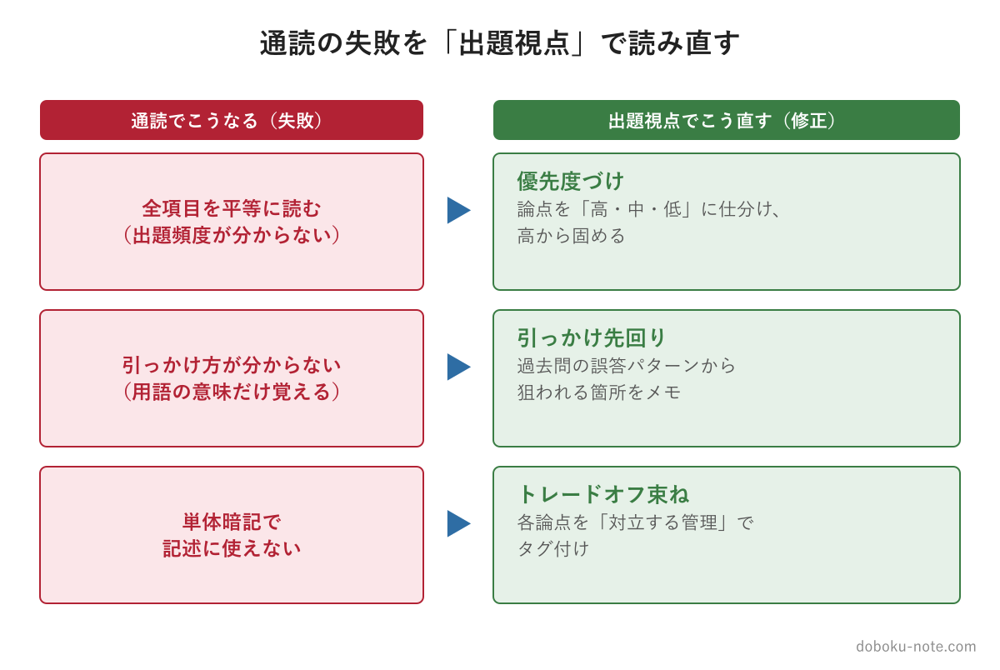
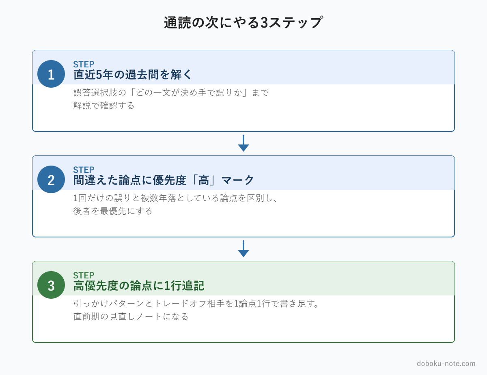

# 【総監択一】キーワード集を1周したのに点が取れない3つの理由｜5管理を「出題視点」で読み直す

**こんな人におすすめ**

- キーワード集を一通り読んだのに、過去問・模試で択一が伸びない
- どの論点を優先して覚えればいいか分からず、全範囲を均等に読んでしまう
- 知っているはずの用語なのに、択一の選択肢で引っかかって落とす
- 択一で覚えた知識が記述式でうまく使えていない気がする

**この記事でわかること**

- キーワード集を通読しても択一の点数が伸びない構造的な理由
- 「出題視点」で5管理を読み直すと何が変わるか
- 通読の次にやるべき3ステップ

---

『総合技術監理 キーワード集 2026』を1周した。用語の意味も一通り頭に入れた。それなのに過去問や模試を解くと、択一の正答が合格ライン（24問前後）に届かない──総監受験者の多くがこの壁にぶつかります。

原因は努力不足ではありません。**キーワード集の「読み方」と、択一試験の「出題のされ方」がそもそも噛み合っていない**からです。この記事では、通読が点に変わらない3つの理由と、その埋め方を整理します。

5管理を出題視点で読み直す作業をまとめて済ませたい方には、17年分の過去問680問を分析して論点を優先度順に再構成した精読ガイドがあります（経済性・人的資源・情報・安全・社会環境の5本セット）。

https://note.com/dobokunote/m/m607bf095b02a

<!-- cta:pack-top -->
> 本番直前の総仕上げは、出題予想6テーマ×三層骨子で「何が出ても書ける型」を最短装填できる[R8予想問題集（2026最終予想）](https://note.com/dobokunote/m/m6854c7437d4d)が決め手。書き方の型から固めるなら、型・設問(3)の弾薬・R8演習を1セットにした[記述式コアパック](https://note.com/dobokunote/m/m6e7de5e4ea3d)が入口に最適です。

## 理由1：キーワード集は「出題頻度順」に並んでいない

キーワード集は5管理の概念体系に沿って項目を並べた本で、各項目が試験で何回問われるかは示していません。だから全項目を平等に通読すると、17年で1回しか出ない項目にも、毎年問われる項目にも同じ時間を使ってしまいます。

たとえば安全管理の[製造物責任法（PL法）](https://doboku-note.com/docs/pe-comprehensive-management-product-liability-act?utm_source=note&utm_medium=referral&utm_campaign=91-keyword-not-scoring)は過去17年中10年で出題される頻出論点です。一方、ほとんど問われない項目も同じ数だけ並んでいます。通読ではこの両者が同じ重みになり、結果として「出る論点が薄いまま」になります。

得点に直結するのは、項目を**出題頻度で「高・中・低」に仕分け、高から固める**読み方です。

## 理由2：キーワード集は「引っかけ方」を教えてくれない

択一の誤答選択肢は、決まったパターンで作られています。

- 用語の定義を逆にする（[信頼性設計 ↔ 保全性設計](https://doboku-note.com/docs/pe-comprehensive-management-reliability-maintainability-design?utm_source=note&utm_medium=referral&utm_campaign=91-keyword-not-scoring)、[X理論 ↔ Y理論](https://doboku-note.com/docs/pe-comprehensive-management-mcgregor-xy-theory?utm_source=note&utm_medium=referral&utm_campaign=91-keyword-not-scoring)）
- 法令の数値を微妙にずらす（労働時間「40時間/週」を「44時間/週」に）
- 「すべて」「のみ」「常に」で例外を消す

キーワード集は用語の正しい意味を載せるだけで、「どこを、どうひっくり返して誤答にするか」は載っていません。引っかけは過去問の解答解説からしか逆算できず、通読だけでは選択肢を切る精度が上がらないのです。

たとえば事業継続（[BCM](https://doboku-note.com/docs/pe-comprehensive-management-business-continuity-plan?utm_source=note&utm_medium=referral&utm_campaign=91-keyword-not-scoring)）の対象範囲は、自社だけでなく委託先・調達先・供給先まで含みます。択一ではここを「自社の人的・物的被害のみ」と範囲を狭めて誤答にする選択肢が出ます。用語を「知っている」だけの受験者は、もっともらしい選択肢として読み飛ばしてしまう。「どこを狭めて誤りにするか」を過去問で押さえているかどうかが、そのまま1問の差になります。

## 理由3：記述式の「トレードオフ視点」で束ねられていない

総監の記述式は、5管理が対立する場面（コスト削減と安全、DX推進と情報セキュリティなど）をどう統合するかを問います。キーワードを単体で暗記しても、「この論点はどの管理と対立するか」という束ね方は通読では身につきません。

択一で覚えた知識を記述でも使うには、各論点に「対立する管理」をタグ付けしておく作業が要ります。

## 「出題視点」で読み直すと何が変わるか

3つの理由は、裏返すと3つの読み直し作業になります。

- **優先度づけ** — 各論点に「高・中・低」を振り、高優先度から固める
- **引っかけ先回り** — 過去問の誤答パターンから「狙われる箇所」を論点ごとにメモする
- **トレードオフ束ね** — 各論点を「どの管理と対立するか」でタグ付けする

この3つを通すと、同じキーワード集が「出題されやすい順に・引っかけ込みで・記述でも使える形」に変わります。点が取れないのは知識不足ではなく、この読み直しが済んでいないだけ、というケースが大半です。

## 具体例：1論点を「出題視点」で読み直す

安全管理の[信頼性設計と保全性設計](https://doboku-note.com/docs/pe-comprehensive-management-reliability-maintainability-design?utm_source=note&utm_medium=referral&utm_campaign=91-keyword-not-scoring)を例に、通読と出題視点で何が変わるかを見てみます。

**通読での扱い**

キーワード集を読むと「信頼性設計＝故障しにくくする設計」「保全性設計＝故障しても直しやすくする設計」と意味を覚えて次に進みます。理解そのものは正しいのですが、ここで止まると択一では足りません。

**出題視点での読み直し**

同じ1論点を、3つの情報まで持っておきます。

- **優先度** — この対は17年で繰り返し問われる定番。優先度「高」で確実に固める論点
- **引っかけ先回り** — 択一では2つの用語を入れ替えた選択肢が定番（「故障しにくくする設計を保全性設計という」など）。「故障の前か後か」という軸で覚えておくと、入れ替えにすぐ気づける
- **トレードオフ束ね** — 信頼性を高めるほどコストは増える。記述式では「安全 × 経済性」のトレードオフ論点として展開できる

通読は「意味の暗記」で終わりますが、出題視点では同じ論点が「優先度・引っかけ・トレードオフ」の3点セットになります。**この差が、知っているのに落とすか・確実に取るかの分かれ目**です。全650項目をこの3点セットに変換しきれれば、択一の安定感は大きく変わります。

## 通読の次にやる3ステップ

1. **直近5年**（R03〜R07）**の択一過去問を解く** — doboku-note で全問が解答解説つきで読めます。正誤だけでなく、誤答選択肢の「どの一文が決め手で誤りなのか」まで解説で確認します
2. **間違えた論点をキーワード集に戻って確認し、優先度「高」マークを付ける** — このとき、1回だけ間違えた論点と複数年で落としている論点を区別し、後者を最優先にします
3. **高優先度の論点に、引っかけパターンとトレードオフ相手を1行ずつ書き足す** — 「信頼性設計：保全性設計と逆転されやすい／経済性と対立」のように、1論点1行で十分です。これがそのまま直前期の見直しノートになります

doboku-note では[キーワード集2026の全項目](https://doboku-note.com/docs/pe-comprehensive-management-keyword-2026?utm_source=note&utm_medium=referral&utm_campaign=91-keyword-not-scoring)をWeb検索でき、17年分の択一過去問も解答解説つきで公開しています。まず過去問を解いて、自分の弱点論点を出題視点で洗い出すところから始めてください。試験全体の進め方は[総合技術監理部門 合格戦略](https://doboku-note.com/docs/pe-comprehensive-management-exam-passing-strategy?utm_source=note&utm_medium=referral&utm_campaign=91-keyword-not-scoring)も参考になります。

## 5管理を出題視点で再構成した精読ガイド

上記の「優先度づけ・引っかけ先回り・トレードオフ束ね」を5管理すべてについて済ませたのが、note の精読ガイドです。

**技術士 総監｜5管理 テキスト精読ガイド**

- 経済性・人的資源・情報・安全・社会環境の5本セット（全13,000〜15,000字 × 5本）
- 各論点を「優先度: 高・中・低」で仕分け、択一の引っかけパターンを明示
- 記述式で使う5管理トレードオフの型を収録
- doboku-note の該当キーワード解説ページへ直リンク（スマホ通勤学習に最適）

https://note.com/dobokunote/m/m607bf095b02a

---

## 総監対策をまとめて進めたい方へ

工程（型 → 設問(3) → 予想演習 → フル模範論文）を一気にそろえたい方には、全部入りの「完全パック」が最もお得です。

https://note.com/dobokunote/m/m171222175fac

各マガジンの全体像と「どれから読むか」は、はじめての方向けのロードマップ記事にまとめています。

https://note.com/dobokunote/n/n3d73729e6cc7

## 関連リソース

**doboku-note — 17年分の過去問 + 650キーワード解説**（無料）
https://doboku-note.com/category/pe-comprehensive-management?utm_source=note&utm_medium=referral&utm_campaign=91-keyword-not-scoring

- 17年分の択一式過去問（全問解答解説つき）
- キーワード集2026の全項目をWeb検索可能
- 650以上のキーワード解説ページ（スマホ対応）

**note のおすすめ記事**

- 【学習優先順位がわかる】総監択一式17年分680問を徹底分析（無料）
- 総監二次試験 学習スケジュール完全版｜試験前6-7ヶ月を4フェーズに分けて設計（無料）

---

<!-- cta:tankan-mokuji -->
総監のほかの無料記事・有料マガジンは「総監もくじ」から一覧できます。

https://note.com/dobokunote/n/n3ed4c77ceed6
