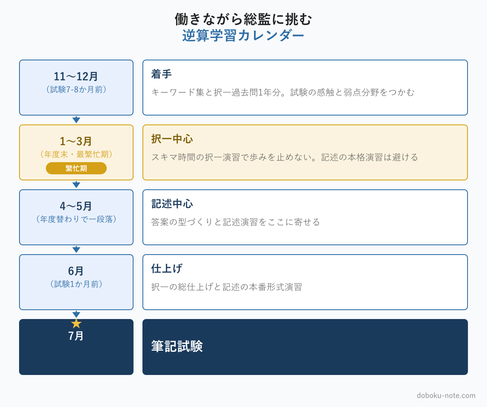

# 【公務員向け】働きながら総監に挑む学習設計｜発注者業務の繁忙期を避ける逆算カレンダー

**こんな人におすすめ**

- 総監の受験を決めたが、忙しい公務員業務と両立できるか不安
- いつから勉強を始めればいいか分からない
- 年度末や出水期で勉強が止まってしまいそうで心配
- 限られた時間で択一と記述をどう配分するか知りたい

**この記事でわかること**

- 公務員の繁忙期を織り込んだ学習カレンダーの作り方
- 択一と記述で学習の進め方を変える理由
- 発注者業務そのものを学習素材にする方法

---

総監の受験を決めたとき、自治体の技術職員が最初にぶつかる不安は「働きながら勉強時間を確保できるのか」です。私も同じ不安を抱えて受験しました。発注業務は待ってくれませんし、家庭の事情もある。机に向かう時間は、意識して作らなければ生まれません。

ただ、公務員には民間にない強みが一つあります。1年の中で「いつ忙しくなるか」がかなり読めることです。繁忙が予測できれば、それを避けて計画を組める。この記事は、その読みやすさを活かして、発注者業務と両立する学習設計の組み方を整理します。

<!-- cta:pack-top-light -->
> 学習計画を教材の順番まで落とし込みたい方は、[総監もくじ](https://note.com/dobokunote/n/n3ed4c77ceed6)で無料記事と教材を段階別に確認できます。

<!-- cta:pack-top -->
> 記述式の型、5管理のトレードオフ、設問(3)の国家施策を一つの流れで固めるなら、[記述式コアパック](https://note.com/dobokunote/m/m6e7de5e4ea3d)から始められます。無料記事や立場別の模範論文を比較したい方は、[総監もくじ](https://note.com/dobokunote/n/n3ed4c77ceed6)で現在地に合う教材を選べます。

## 公務員の1年は「繁忙期」が読める

自治体の技術職員の繁忙には、ある程度決まったパターンがあります。

- **年度末**（1〜3月） — 工事の完成検査、予算の繰越処理、次年度の発注準備が重なる、1年で最も忙しい時期
- **出水期の前後** — 防災・河川関係の部署では、梅雨や台風シーズンの警戒・対応
- **議会の会期** — 答弁の準備や資料作成で、一時的に負荷が跳ね上がる
- **年度当初**（4〜5月） — 人事異動の直後で、新しい担当業務の立ち上げに追われる

民間企業の繁忙が個別案件の受注状況に左右されるのに対し、公務員のこれらはカレンダー上にあらかじめ見えています。来年の1〜3月が忙しいことは、今から分かっている。だからこそ、学習計画にそのまま織り込めるのです。

「忙しくて勉強できなかった」ではなく「忙しい時期はこう過ごす」と、最初から決めておけます。

## 総監の学習は「択一」と「記述」で進め方を変える

総監の筆記は択一式と記述式の2本立てで、この2つは性質が異なり、向いている学習の仕方も違います。

**択一式** — 過去問演習で出題パターンを掴む学習が中心です。1問単位で区切れるため、通勤電車の中、昼休み、寝る前の30分といったスキマ時間に向いています。短い時間を積み重ねる学習なので、繁忙期でも歩みを止めずに続けられます。

**記述式** — 答案の「型」を身につけ、実際に時間を計って書く練習が必要です。600字の答案を組み立てるには、まとまった時間と集中が要ります。細切れの時間では力がつきにくいため、繁忙期は避け、比較的落ち着いた時期に寄せるのが現実的です。

この性質の違いを逆手に取ります。繁忙期は択一中心、閑散期は記述中心——と最初から役割を分けておけば、忙しさに学習が振り回されなくなります。

記述式の「答案の型」を体系的に固めたい方は、5 管理 × 他 4 管理のトレードオフを 20 セル全網羅した「型」のマガジンが土台になります。序章は無料で読めます。

https://note.com/dobokunote/m/m921fbe060575

## 試験（7月）からの逆算カレンダー

総監の筆記試験は例年7月です。そこから逆算した、繁忙期を織り込む学習カレンダーの一例を示します。

- **7〜8か月前**（前年11〜12月） — キーワード集と択一過去問に着手。まず過去問を1年分解き、試験の感触と自分の弱点分野をつかむ。この時期に「敵を知る」ことが、後の計画の精度を決めます
- **4〜6か月前**（1〜3月） — 年度末の最繁忙期。ここで記述の本格演習を予定すると、まず崩れます。スキマ時間の択一演習に絞り、歩みを止めないことだけを目標にする
- **2〜3か月前**（4〜5月） — 年度が替わって一段落する時期。記述式の型づくりと答案演習を、ここに集中して寄せる
- **1か月前**（6月） — 択一の総仕上げと、記述の本番形式での演習。時間配分を体に入れる

ポイントは、最繁忙の年度末に記述演習を置かないことです。多くの受験者は「年度末も計画どおり記述を進める」つもりで予定を組み、そして崩します。崩れること自体より、「計画どおりにできなかった」という焦りと自己嫌悪が、働きながらの受験では地味に消耗します。最初から「1〜3月は択一だけでよい」と決めておけば、その消耗が起きません。

記述の本格演習をこの時期（2〜3 か月前）に寄せるなら、出題が予想されるテーマで実際に書く演習と、過去問のフル模範論文が効きます。自分の立場（道路・河川・下水道など）に合ったペルソナはロードマップから選べます。

https://note.com/dobokunote/n/n3d73729e6cc7

例えば道路担当の方は、以下のマガジンが参考になります。

R8 予想問題集｜6 テーマ × 三層構造解答骨子 × フル模範論文

https://note.com/dobokunote/m/m6854c7437d4d

過去問模範論文｜自治体 道路担当版（R03〜R07 ＋ R8 予想）

https://note.com/dobokunote/m/m52186ffd12ca

## 発注者業務そのものを学習素材にする

働きながらの受験で最も効率的なのは、机に向かう時間以外も勉強に変えることです。総監は、それができる珍しい試験です。

総監の記述式と口頭試験は、受験者自身の業務経験を5管理の視点で論じます。裏を返せば、日常の発注者業務を5管理の言葉で見る癖をつければ、業務時間そのものが答案の素材集めになります。

たとえば、ある工事で工期とコストの板挟みになったとき。それを「経済性管理と工程の問題」と捉え、住民説明で乗り切ったなら「社会環境管理の手当てで調整した」と整理する。打ち合わせの移動中や帰りの車の中で、その日の業務を5管理で振り返るだけでいい。

これを習慣にすると、机に向かえない日でも答案の引き出しが増えていきます。机に向かう時間が限られる公務員ほど、この発想が効きます。

この習慣は、筆記試験の先にある口頭試験でも効きます。口頭試験では、自分の業務経歴を5管理の視点で語ることが求められます。日頃から業務を5管理で振り返っていれば、口頭試験のために改めて経験を棚卸しする負担が大きく減ります。

働きながらの受験では、一つの習慣が複数の場面で効く、こうした「二度おいしい」工夫が時間不足を補ってくれます。机に向かう時間を増やすことばかり考えると行き詰まりますが、すでにある業務時間の"見え方"を変えるだけなら、追加の時間はかかりません。

忙しい公務員にとって、これが現実的に最も効く一手です。

## 計画が崩れたときどうするか

どれだけ繁忙期を織り込んでも、計画は崩れます。急な災害対応、家庭の事情、体調——働きながらの受験では当然起こることです。

大事なのは、崩れたときに「もうだめだ」と全部を投げないことです。崩れたら、択一だけは続ける。1日1問でもいい。学習を完全にゼロにしない限り、再開のハードルは低いままです。逆に一度完全に止めてしまうと、戻るのに大きなエネルギーが要ります。

計画は「守るもの」ではなく「崩れることを前提に、最低ラインを決めておくもの」です。最低ラインさえ割らなければ、試験までたどり着けます。完璧な計画より、崩れても戻れる計画を組んでください。

## まず何から始めるか

学習設計の第一歩は、試験の中身を知ることです。doboku-note では総監の択一式過去問17年分とキーワード集2026の全項目を無料で公開しています。まず過去問を1年分解いて、自分の現在地と弱点分野を確かめてください。学習の進め方の全体像は[総合技術監理部門 合格戦略](https://doboku-note.com/docs/pe-comprehensive-management-exam-passing-strategy?utm_source=note&utm_medium=referral&utm_campaign=96-civil-servant-study-design)にまとめています。

https://doboku-note.com

5管理を出題視点で優先度順に整理した精読ガイド（5本セット）も、繁忙期に効率よく弱点を埋めたいときに使えます。

https://note.com/dobokunote/m/m607bf095b02a

設問(3) の将来課題・国家施策が手薄な方は、11 テーマ × 68 案を答案 1 枚相当で収録した「国家施策バンク」が弾薬になります。

https://note.com/dobokunote/m/m91516dfc27ac

## 記述式対策をまとめて進めたい方へ

工程（型 → 設問(3) → 予想演習 → フル模範論文）を一気にそろえたい直前期の方には、全部入りの「完全パック」が最もお得です。

https://note.com/dobokunote/m/m171222175fac

各マガジンの全体像と「どれから読むか」は、はじめての方向けのロードマップ記事にまとめています。

https://note.com/dobokunote/n/n3d73729e6cc7

## 関連リソース

**doboku-note — 17年分の過去問 + 700キーワード解説**（無料）

https://doboku-note.com

- 17年分の択一式過去問（全問解答解説つき）
- キーワード集2026の全項目をWeb検索可能
- 700以上のキーワード解説ページ（スマホ対応）

**note のおすすめ記事**

- 【総監択一】自治体の技術職員が総監択一でつまずく3つの盲点｜発注者業務と試験範囲のズレ
- 【土木系公務員】自治体の技術職員が技術士総監を取る5つのメリット｜発注者の視点から

---

<!-- cta:tankan-mokuji -->
総監のほかの無料記事・有料マガジンは「総監もくじ」から一覧できます。

https://note.com/dobokunote/n/n3ed4c77ceed6
