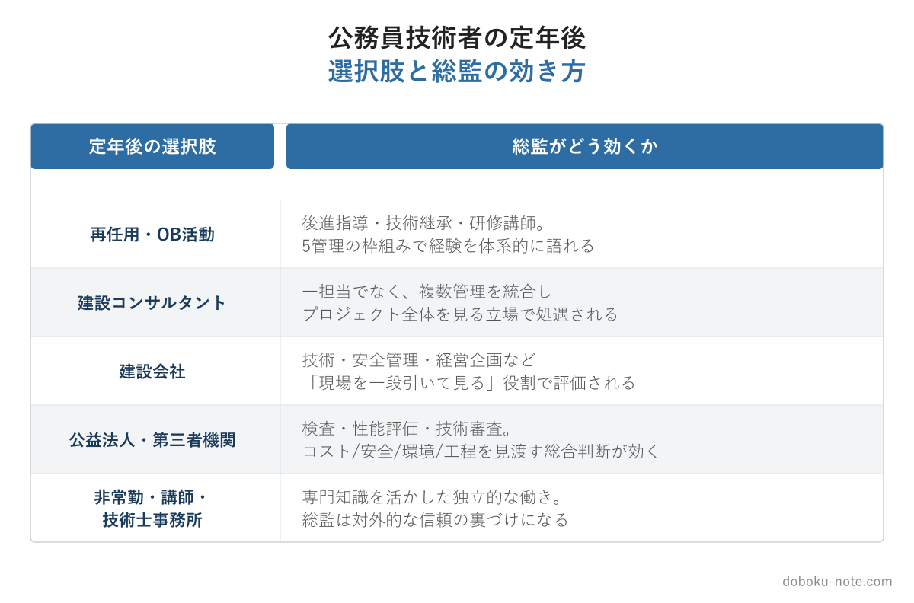

# 【公務員技術者】定年後を見据えた資格戦略｜技術士総監が再就職・OB活動でどう効くか

**こんな人におすすめ**

- 自治体の土木職などで、定年後の働き方を考え始めた
- 再任用か、民間への再就職か迷っている
- 持っている資格（1級土木施工管理技士・技術士）が定年後にどう効くか知りたい
- 総監を取るか迷っていて、定年後の視点で判断したい

**この記事でわかること**

- 公務員技術者の定年後の主な選択肢
- 選択肢ごとに技術士・総監がどう効くか
- 総監を「いつ」取るのが得策か

---

私は地方自治体の土木職を勤め上げ、退職しました。在職中、定年後のことは「まだ先の話」と思っていました。日々の発注業務に追われ、自分のキャリアの終わり方をじっくり考える時間は、なかなか取れないものです。

ところが実際に退職してみると、現役の間にどんな準備をしておいたかで、定年後に選べる道の幅がはっきり変わると痛感しました。とりわけ大きかったのが資格です。役職や担当業務は退職と同時に「過去のもの」になりますが、資格は名刺の上に残り続けます。

この記事は、定年後を見据えて資格戦略を考え始めた自治体の技術職員に向けて、技術士 総合技術監理部門（総監）が定年後にどう効くかを、実際に退職した立場から正直に整理します。

https://note.com/dobokunote/m/m6e7de5e4ea3d

## 公務員技術者の定年後 — 主な選択肢

自治体の技術職員が退職後に取りうる働き方を、まず並べてみます。

- **再任用・再雇用** — 同じ自治体に短時間勤務などで残る
- **建設コンサルタントへの再就職** — 設計・調査・マネジメント業務
- **建設会社への再就職** — 施工側の技術・安全・品質部門
- **公益法人・第三者機関** — 工事検査、性能評価、技術審査など
- **非常勤・講師・技術士事務所** — 専門知識を活かした独立的な働き方

人によって事情はさまざまですが、どの道に進むにせよ共通して言えることがあります。それは、現役時代の役職や肩書きではなく「結局この人は何ができるのか」が問われる、ということです。「○○市の道路課長でした」という経歴は、退職後の世界ではそれほど効きません。代わりに効くのが、能力を客観的に示せる資格です。

## 選択肢別 — 技術士・総監がどう効くか

### 建設コンサルタント

建設コンサルタント業界では技術士が高く評価され、業務を担う体制づくりに深く関わります。一般部門の技術士があれば、再就職先を見つけること自体は難しくありません。

そこに総監が加わると、扱いが一段変わります。特定分野の一担当としてではなく、複数の管理を統合してプロジェクト全体を見るポジション——事業全体の工程・コスト・リスクを見渡す立場——で処遇されやすくなります。

発注者として事業を俯瞰してきた経験と、総監という資格上の裏づけが揃うと、コンサル側から見て「任せやすい人材」になります。

### 建設会社

施工側に進む場合、軸になるのは現役で積んだ施工管理の経験と1級土木施工管理技士です。技術士・総監は、現場の最前線というより、技術部門・安全管理部門・経営企画といった「現場を一段引いて見る」役割で評価されます。

発注者出身の技術者は、施工会社から見ると「発注者の考え方が分かる人」という独自の価値を持ちます。そこに総監があると、安全とコストと工程を統合的に判断できる管理側の人材として位置づけられます。

### 公益法人・第三者機関

工事の検査、性能評価、技術審査などを担う組織では、中立的で偏りのない技術判断と、コスト・安全・環境・工程を同時に見渡す総合的な視点が求められます。

総監の5管理を俯瞰する力は、この種の仕事にそのまま効きます。「一つの管理を深く」ではなく「複数の管理のバランスを見る」のが審査・評価の本質だからです。発注者として培った公正な判断の姿勢とも相性がよく、退職した技術者の受け皿として現実的な選択肢になります。

### 再任用・OB活動

同じ自治体に再任用で残る場合も、求められる役割は現役時代とは変わってきます。第一線で事業を回すというより、後進の指導、技術継承、研修の講師といった「教える・伝える」仕事の比重が増えます。

長年の経験は財産ですが、経験は語れなければ受け継がれません。総監の5管理という枠組みは、自分が積んできた判断を体系立てて若手に語るための共通言語になります。

「あのとき自分はこう判断した」を「これは経済性と安全のトレードオフを、住民合意で調整した事例だ」と言い換えられると、伝わり方がまるで違ってきます。

## なぜ「総監」が定年後に効くのか

ここまでの4つの道に共通するのは、特定の専門技術をひたすら深掘りする立場というより、事業や組織を一段高いところから見て判断・助言する立場だということです。

一般部門の技術士が「専門の深さ」の証明だとすれば、総監は「全体を見て調整できる」ことの証明です。定年後に任される役割の多くは後者を求めます。

現場で手を動かす仕事は若い世代が担い、退職した技術者には「判断」「助言」「調整」「指導」が期待される——この構図がある限り、総監は効きどころが広いのです。

もう一つ付け加えると、総監は名乗ったときの説得力があります。「技術士（総合技術監理部門）」という肩書きは、初対面の相手にも「この人は全体を見られる人だ」という印象を与えます。退職後、これまでの人脈の外で新しく仕事を得るとき、この第一印象は思った以上に効きます。

逆に言えば、一般部門の技術士までで止めると、定年後は「特定分野の専門家」という枠で見られがちです。それも一つの価値ですが、自分の専門分野が退職後の仕事とうまく噛み合わなければ活きにくい、という弱点があります。

総監の「全体を見る力」は分野を選びません。退職後にどの道へ進んでも応用が利く——いわば、つぶしの効き方が違うのです。

私が再就職やOBの活動を通じて感じたのは、退職した技術者に期待されるのは「自分で答えを出すこと」より「若い人が答えを出すのを助けること」だ、ということでした。全体を見て、どこに注意すべきかを示し、判断の筋道を伝える。総監で身につけた5管理の枠組みは、この「助ける側」の仕事に、そのまま道具として使えます。

## 総監は「いつ」取るのが得策か

結論から言えば「現役のうち、できれば早めに」です。理由は3つあります。

**1. 時間の余裕** — 退職直前は、業務の引き継ぎや諸手続きで想像以上に慌ただしくなります。総監の学習には数か月かかるため、定年が見えてからでは間に合わないことが多い。中堅から後半の、比較的落ち着いた時期に取り組むのが現実的です。

**2. 学習体力** — 択一の暗記も記述の答案作成も、学習の習慣があるうちのほうが負担は軽い。年齢が上がるほど、まとまった暗記や長文を書く作業は重く感じられます。これは正直なところです。

**3. 取得後に「こなれる」時間** — 資格は取って終わりではありません。取得後に数年、5管理の視点を実務で使い続けると、知識が借り物でなく自分の言葉になります。定年後に「総監技術士です」と名乗るとき、こなれた経験が伴っているほうが、語りに深みが出ます。

定年が見えてから慌てるより、見え始めた時点で動く。これが、結果的に最も余裕のある選び方です。私自身、もう少し早く動いてもよかったと感じています。

## 受けてみようと思ったら

まずは試験の中身を眺めるところからで十分です。doboku-note では総監の択一式過去問17年分とキーワード集2026の全項目を無料で公開しています。学習の進め方は[総合技術監理部門 合格戦略](https://doboku-note.com/docs/pe-comprehensive-management-exam-passing-strategy?utm_source=note&utm_medium=referral&utm_campaign=94-civil-servant-retirement)にまとめています。

https://doboku-note.com

5管理を体系的に短時間で掴む段階に入ったら、note の精読ガイド（5管理を出題視点で優先度順に整理した5本セット）も用意しています。

https://note.com/dobokunote/m/m607bf095b02a

## 総監対策をまとめて進めたい方へ

工程（型 → 設問(3) → 予想演習 → フル模範論文）を一気にそろえたい方には、全部入りの「完全パック」が最もお得です。

https://note.com/dobokunote/m/m171222175fac

各マガジンの全体像と「どれから読むか」は、はじめての方向けのロードマップ記事にまとめています。

https://note.com/dobokunote/n/n3d73729e6cc7

## 関連リソース

**doboku-note — 17年分の過去問 + 700キーワード解説**（無料）

https://doboku-note.com

- 17年分の択一式過去問（全問解答解説つき）
- キーワード集2026の全項目をWeb検索可能
- 700以上のキーワード解説ページ（スマホ対応）

**note のおすすめ記事**

- 【土木系公務員】自治体の技術職員が技術士総監を取る5つのメリット｜発注者の視点から
- 【総監択一】自治体の技術職員が総監択一でつまずく3つの盲点｜発注者業務と試験範囲のズレ

---

<!-- cta:tankan-mokuji -->
総監のほかの無料記事・有料マガジンは「総監もくじ」から一覧できます。

https://note.com/dobokunote/n/n3ed4c77ceed6
