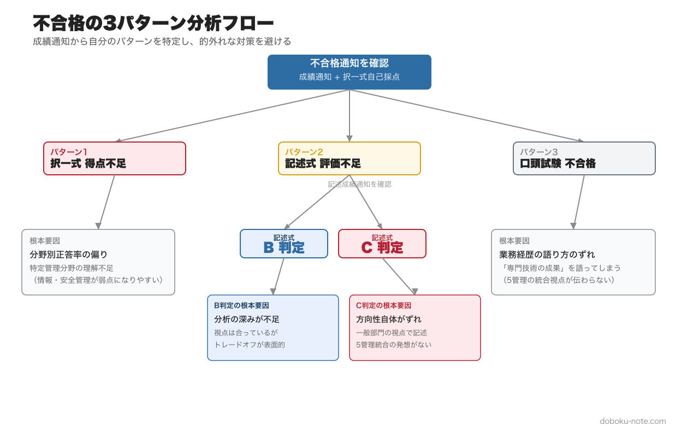
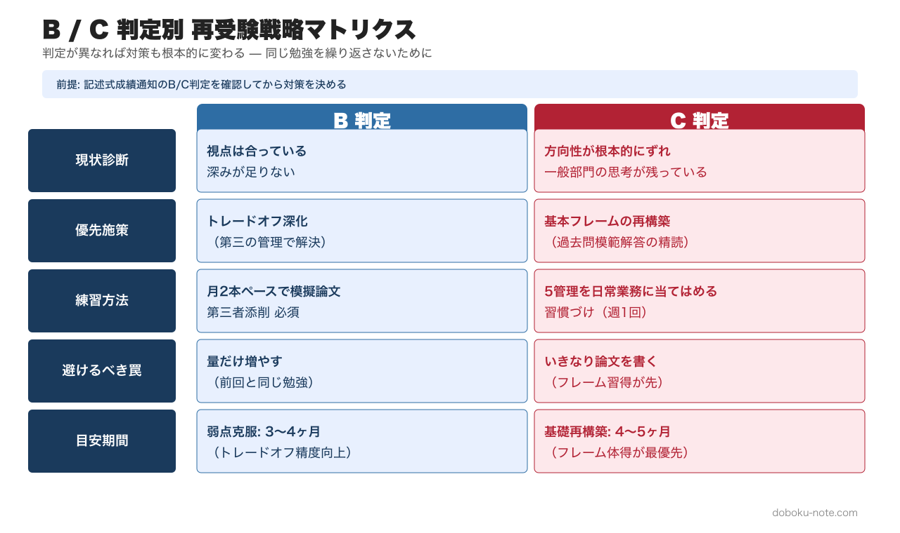

# 【総監再受験者向け】不合格要因を特定する3パターン分析｜B判定とC判定で根本的に異なる再受験戦略

**この記事でわかること**

- 不合格の3パターンと、それぞれの自己分析方法
- 記述式B判定とC判定で対策が根本的に異なる理由
- 再受験のための4フェーズと「前回と同じ勉強をしない」ためのチェックリスト

---

<!-- cta:pack-top -->
> 記述式の型、5管理のトレードオフ、設問(3)の国家施策を一つの流れで固めるなら、[記述式コアパック](https://note.com/dobokunote/m/m6e7de5e4ea3d)から始められます。無料記事や立場別の模範論文を比較したい方は、[総監もくじ](https://note.com/dobokunote/n/n3ed4c77ceed6)で現在地に合う教材を選べます。

## はじめに — 再受験は恥ではない

総合技術監理部門の合格率は例年10〜15%で推移しています。一般部門を一発合格した優秀な技術者でも、総監で2回、3回と再受験するケースは珍しくありません。

理由は明確です。一般部門が「専門技術の深さ」を問うのに対し、総監は「管理技術の広さと統合力」を問います。試験の性質が根本的に異なるため、一般部門の成功体験がそのまま通用しないのです。

ただし、再受験で合格するためには「前回と同じ勉強をしない」ことが欠かせません。同じ方法を繰り返しても結果は変わらないからです。まずは不合格の要因を正確に特定し、そこに集中して対策を打っていきましょう。

---

【ここからマガジン限定】

---

<!-- cta:tankan-mokuji -->
総監のほかの無料記事・有料マガジンは「総監もくじ」から一覧できます。

https://note.com/dobokunote/n/n3ed4c77ceed6

## 不合格の3パターン

総監の不合格は、大きく3つのパターンに分類できます。成績通知を手元に置きながら、自分がどの分岐に当てはまるかを確認してみてください。

**パターン1: 択一式の得点が不足**
筆記試験（択一式+記述式の合計で60%以上）に到達しなかった場合で、主に択一式の得点不足が原因です。択一式が20問以下（50%以下）だと、記述式でカバーするのは極めて困難になります。

**パターン2: 記述式の得点が不足**
択一式はそこそこ取れたものの、記述式の評価が低く合計で60%に届かなかった場合です。記述式の成績通知はA〜Cの3段階で返ってきますが、B判定とC判定では対策が根本的に異なります。

**パターン3: 口頭試験で不合格**
筆記試験は合格したものの、口頭試験（約20分）で不合格になった場合です。口頭試験の合格率は80〜90%と高いのですが、不合格になると翌年は筆記試験からやり直しになるため、精神的なダメージが大きくなります。

まず自分がどのパターンに該当するかを明確にすることが、再受験対策の出発点になります。

---

## パターン別の自己分析方法

### パターン1: 択一式 — 管理分野別の正答率を計算する

択一式40問は、5つの管理分野に8問ずつ均等配分されています。

- **問1〜8**：経済性管理
- **問9〜16**：人的資源管理
- **問17〜24**：情報管理
- **問25〜32**：安全管理
- **問33〜40**：社会環境管理

再受験者がまずやるべきことは、前回の試験で各分野何問正答したかを計算し、**分野別の正答率**を出すことです。

たとえば以下のような結果だったとします。

- 経済性管理: 6/8（75%）
- 人的資源管理: 5/8（63%）
- 情報管理: 3/8（38%）
- 安全管理: 4/8（50%）
- 社会環境管理: 4/8（50%）
- 合計: 22/40（55%）

この場合、情報管理が明らかな弱点であり、安全管理と社会環境管理にも改善の余地があります。経済性管理と人的資源管理は現状維持でよいでしょう。

**弱点分野を特定したら、その分野のキーワード集を重点的に学習しましょう。** 5分野を均等に勉強するのではなく、弱点に時間を集中させるのがポイントです。17年分の過去問を分野別に解いてみると、出題パターンが見えてきます。

弱点分野のキーワード補強には、doboku-noteの[キーワード集2026 全項目](https://doboku-note.com/docs/pe-comprehensive-management-keyword-2026?utm_source=note&utm_medium=referral&utm_campaign=tankan-saijuken-taisaku&utm_content=keyword-2026)が役立ちます。650項目を分野別に絞り込んで読めるので、「情報管理が弱い」とわかった時点から集中インプットに入れます。分野別の出題傾向については、[択一式17年分分析](https://doboku-note.com/docs/pe-comprehensive-management-exam-passing-strategy?utm_source=note&utm_medium=referral&utm_campaign=tankan-saijuken-taisaku&utm_content=exam-passing-strategy)で詳しく解説しています。毎年出る鉄板テーマ10選を押さえるだけでも、10問以上を安定して確保できます。

### パターン2: 記述式 — B判定とC判定の違い

記述式の成績通知は、A（合格相当）、B、Cの3段階で返ってきます。BとCでは対策の方向性が全く異なります。

**B判定: 方向性は合っているが深みが足りない**

B判定は「総監の視点」自体は持っているものの、分析や提言の深さが不足していることを意味します。具体的には以下の傾向があります。

- 5つの管理を列挙しているが、トレードオフの分析が表面的
- 問題点の指摘はできているが、解決策が一般論にとどまる
- 業務への適用が曖昧で、具体性に欠ける

B判定の対策は、**トレードオフの分析を深めること**に尽きます。ある管理間の対立を、第三の管理の視点から解決するパターンを繰り返し練習していきましょう。たとえば、経済性管理と安全管理のトレードオフを、情報管理を活用して改善するといった思考を、自分の業務に当てはめて論述する練習が有効です。

**C判定: 方向性自体がずれている**

C判定は、総監が求めている回答の方向性自体を外していることを意味します。深刻ではありますが、原因を特定できれば対策は明確になります。

- 一般部門の視点で書いている（専門技術の深掘りに終始し、管理間の統合がない）
- 5つの管理のうち1〜2つしか触れていない
- トレードオフの構造を把握できていない
- 問われていないことを長々と書いている

C判定の場合は、まず**総監の記述式で何が求められているかを根本から理解し直す**ことが必要です。過去問の模範解答を読み、「5つの管理を俯瞰的に把握し、トレードオフを改善する」という基本フレームを体に染み込ませることが先決になります。自分の業務を5つの管理で分析する練習を日常的に行うことで、試験時にも自然に総監の視点が出てくるようになります。

B判定とC判定では、目指すべきゴールも練習方法も大きく異なります。自分の判定を確認したうえで、下表を参考に対策の優先順位を決めてください。

この「トレードオフ思考」の具体像は、doboku-noteの[5管理間トレードオフ 頻出パターンと解決フレーム](https://doboku-note.com/docs/pe-comprehensive-management-management-tradeoffs?utm_source=note&utm_medium=referral&utm_campaign=tankan-saijuken-taisaku&utm_content=management-tradeoffs)で10ペアのパターンと解決フレームとともに解説しています。記述式対策の深め方については、[記述式戦略ページ](https://doboku-note.com/docs/pe-comprehensive-management-essay-exam-strategy?utm_source=note&utm_medium=referral&utm_campaign=tankan-saijuken-taisaku&utm_content=essay-exam-strategy)も合わせて参照してください。

### パターン3: 口頭試験 — 業務経歴の語り方を見直す

口頭試験で不合格になる主な原因は、以下の3つに集約されます。

**1. 業務経歴を一般部門の視点で説明している**
口頭試験では、受験申込書に記載した業務経歴について質問されます。このとき、専門技術の成果を語るのではなく、「その業務で5つの管理をどう統合したか」を語ることが求められます。一般部門の延長で「技術的に何を解決したか」だけを語ると、「総監の視点がない」と判断されてしまいます。

**2. トレードオフの質問に即答できない**
「その業務で、安全管理とコストのトレードオフはありましたか?」「他の管理への影響は考慮しましたか?」といった質問に、具体的なエピソードで即答できないと厳しくなります。業務経歴の各項目について、5つの管理間のトレードオフを事前に整理しておきましょう。

**3. 技術士としての倫理観・継続研鑽の姿勢が伝わらない**
技術士法の3義務2責務（信用失墜行為の禁止、秘密保持義務、公益確保の責務、資質向上の責務、名称表示の義務）について質問されることがあります。形式的な回答ではなく、自分の業務経験と結びつけて語れるよう準備しておきましょう。

---

## 再受験のための4フェーズ

再受験者は、初受験者とは異なるスケジュールで準備を進めるのが現実的です。前回の不合格要因を踏まえた4フェーズの計画を以下に示します。

**フェーズ1: 要因分析**（不合格発表直後〜1ヶ月）

最も重要なフェーズです。不合格のショックが残っているうちに、冷静に自己分析を行いましょう。

- 成績通知を確認し、3パターンのどれに該当するか特定する
- 択一式は分野別正答率を計算し、弱点分野を特定する
- 記述式はB/C判定のどちらかを確認し、対策の方向性を決める
- 口頭試験不合格の場合は、質問への回答を振り返り、不十分だった点を書き出す

**フェーズ2: 弱点克服**（分析後〜受験申込）

要因分析で特定した弱点に集中して対策します。前回の合格ライン到達に足りなかった要素を集中的に補強する期間です。

- 択一式の弱点分野のキーワードを集中学習
- 記述式B判定の場合: トレードオフ分析の深化練習（月2本のペースで模擬論文を書く）
- 記述式C判定の場合: 過去問の模範解答を読み込み、総監の記述式フレームを体得
- 口頭試験不合格の場合: 業務経歴を5つの管理の視点で書き直す

**フェーズ3: 総仕上げ**（受験申込〜筆記試験）

弱点克服の成果を確認しながら、全体のバランスを整えていきます。

- 過去問を年度単位で通して解き、時間配分を確認
- 記述式は本番形式で3〜4回分の模擬答案を作成
- 受験申込書の記載内容を口頭試験を見据えて推敲

**フェーズ4: 口頭試験準備**（筆記試験合格発表後〜口頭試験）

筆記試験に合格した場合のみのフェーズです。前回口頭試験で不合格だった場合は、このフェーズに特に時間をかけましょう。

- 業務経歴の各項目について、5管理間トレードオフを3つ以上用意
- 想定問答を50問以上作成し、声に出して練習
- 可能であれば、合格者に模擬面接を依頼する

---

## 「前回と同じ勉強をしない」ためのチェックリスト

再受験者が陥りやすい罠は、「前回より量を増やす」ことで対策したつもりになってしまうことです。量ではなく質を変えなければ、結果は変わりません。

以下のチェックリストで、自分の学習方法が前回と変わっているか確認してみてください。

**択一式の学習方法**

- 前回と弱点分野が変わっているか（同じ分野が弱いなら学習方法自体が合っていない）
- キーワード集を「読む」だけでなく、自分の言葉で説明できるか試しているか
- 計算問題（NPV、PERT、損益分岐点）を手を動かして解いているか
- 直近5年の時事テーマ（BCP、DX、カーボンニュートラル）をカバーしているか
- 過去問を「解いて丸つけ」で終わらず、不正解の選択肢がなぜ誤りかまで確認しているか

**記述式の学習方法**

- 前回の答案を読み返し、具体的にどこが不足していたか特定したか
- トレードオフの分析を「2つの管理の対立」だけでなく「第三の管理による解決」まで書いているか
- 模擬答案を第三者（合格者や予備校講師）に添削してもらっているか
- 自分の業務を5つの管理で日常的に分析する習慣がついているか
- 記述式の時間配分（600字x5枚を2時間半で書く）を実際に計測したか

**口頭試験の準備**

- 業務経歴の語り方が「専門技術の成果」から「管理技術の統合」に変わっているか
- 「なぜその判断をしたのか」を5つの管理の視点で説明できるか
- 技術士としての倫理観を、自分の業務経験と結びつけて語れるか
- 受験申込書の記載内容と口頭試験での説明に矛盾がないか

---

## 再受験者の強み — 経験は資産になる

最後に、再受験者にとって心強い事実を一つお伝えします。

総監の試験は「実務経験に基づく管理能力」を問う試験です。再受験者は、前回の受験から今回の受験までの間にも実務経験を積み重ねています。その1年間の業務経験の中で、5つの管理間のトレードオフに直面した場面があるはずです。

その経験こそが、記述式と口頭試験における最大の武器になります。前回の不合格は、その武器の使い方を知らなかっただけかもしれません。不合格要因を正確に分析し、対策の方向性を変えれば、次の試験では実務経験がそのまま得点に変わっていきます。

日常業務でのトレードオフ思考の実践方法については、doboku-noteの[合格戦略ページ](https://doboku-note.com/docs/pe-comprehensive-management-exam-passing-strategy?utm_source=note&utm_medium=referral&utm_campaign=tankan-saijuken-taisaku&utm_content=exam-passing-strategy)で具体的なフレームワークとともに解説しています。

---

## 関連リソース

**doboku-note — 17 年分の過去問 + 650 キーワード解説**（無料）
https://doboku-note.com/category/pe-comprehensive-management

- 17 年分の択一式過去問（全問解答解説付き）
- 650 以上のキーワード解説ページ
- スマホ対応（通勤中の学習に最適）

**再受験者におすすめの note**（弱点別）
- 計算問題で落とした → 総監択一式 頻出計算問題 5 パターン完全攻略 ¥980
- 記述式で B/C 判定だった → 総監記述式 論文骨子テンプレート（A-1）¥1,980 — テーマ駆動・5 管理横串フレームワーク / トレードオフ思考完全ガイド ¥1,200
- 口頭試験で詰まった → 総監口頭試験 20 分で落ちない「業務経歴」の語り方 ¥1,500
