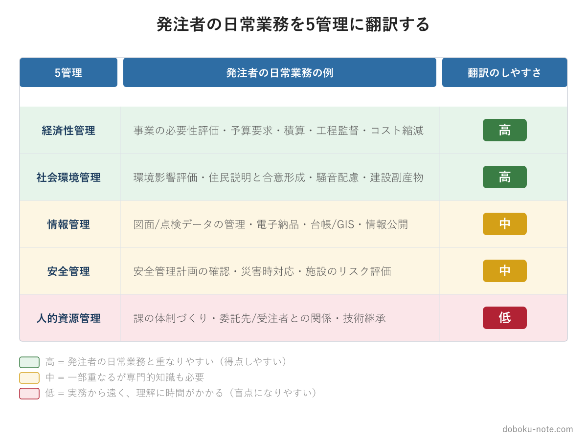

# 【総監対策】発注者の日常を5管理に翻訳する｜「自分の仕事」で総監を腹落ちさせる

**こんな人におすすめ**

- 総監の受験勉強中だが、キーワード集の用語が頭に入らない
- 5管理を覚えても、択一でも記述でも使える気がしない
- 自治体の発注者業務をしているが、それが総監とどうつながるか曖昧
- 記述式・口頭試験の「自分の業務経験」をどう用意するか悩んでいる

**この記事でわかること**

- なぜ「自分の仕事」で5管理を覚えると定着するのか
- 発注者の日常業務を5管理それぞれに翻訳する具体例
- 翻訳を実際に進める3つの手順

---

総監の勉強を始めて、多くの自治体技術職員がぶつかる壁があります。キーワード集の用語が、読んでも読んでも頭に入らないという壁です。

原因は、暗記力ではありません。キーワード集の用語が抽象的で、「自分ごと」になっていないからです。「リスクアセスメント」「ライフサイクルコスト」「合意形成」——言葉として眺めているうちは、いくつ覚えても定着しません。私自身、受験勉強の最初の数週間はこの壁に苦しみました。

この壁を越える方法はシンプルです。発注者である自分の日常業務を、5管理の言葉に翻訳してみることです。この記事では、その翻訳のやり方を具体的に示します。

<!-- cta:pack-top -->
> 記述式の型、5管理のトレードオフ、設問(3)の国家施策を一つの流れで固めるなら、[記述式コアパック](https://note.com/dobokunote/m/m6e7de5e4ea3d)から始められます。無料記事や立場別の模範論文を比較したい方は、[総監もくじ](https://note.com/dobokunote/n/n3ed4c77ceed6)で現在地に合う教材を選べます。

## なぜ「自分の仕事」で覚えると定着するのか

キーワード集は、抽象的な用語の集まりです。それを抽象のまま覚えようとすると、知識は宙に浮いたままになります。試験会場で「リスクアセスメントとは」と問われても、教科書の一文を思い出そうとするだけで、選択肢の微妙な違いを判断できません。

ところが、自分が実際にやった業務に紐づけると、話が変わります。「あの工事前の危険性の洗い出しは、リスクアセスメントそのものだったのか」「あの予算検討で将来の維持費まで含めて考えたのは、ライフサイクルコストの発想だ」——こう結びつくと、用語が一気に具体的な記憶になります。択一でその用語が出たとき、選択肢の意味が立体的に分かり、「実務ではそうはならない」という引っかけにも気づけます。

しかも、この紐づけ作業には、もう一つ大きな効用があります。記述式と口頭試験は、自分の業務経験を5管理の視点で論じる試験です。日常業務を5管理に翻訳しておくことは、そのまま記述・口頭の素材集めになります。択一のためにやった作業が、記述にも口頭にも効く。働きながら受験する公務員にとって、これほど効率のよい勉強はありません。

## 発注者の業務を5管理に翻訳する

では実際に、自治体の発注者業務を5管理それぞれにマッピングしてみます。自分の担当業務を思い浮かべながら読んでみてください。

### 経済性管理

発注者にとって、経済性管理は最も身近な分野です。事業の必要性の評価、予算要求、積算、工程の監督、コスト縮減の検討、完成後の事業評価——いずれも経済性管理そのものです。

たとえば、ある道路改良を「いま実施すべきか、数年先送りにすべきか」と検討した経験を思い出してください。そこでは事業費だけでなく、先送りした場合の安全上のリスクや、将来の物価上昇まで考えたはずです。それは経済性管理における投資判断であり、ライフサイクルの視点です。発注者なら誰もが、気づかぬうちに経済性管理を実践しています。

### 安全管理

工事中の安全管理計画の確認と指導、災害時の応急対応、既存施設の維持管理におけるリスク評価。発注者は、労働安全衛生の現場実務こそ施工者に委ねますが、「事業として安全をどう確保するか」という判断は発注者の仕事です。

災害復旧の現場で「どの路線を優先して復旧するか」を判断した経験があれば、それはリスクの大きさに応じた資源配分——リスクベースの意思決定です。点検で見つかった損傷を、すぐ補修するか経過観察にするかを決めた判断も、安全管理の題材になります。

### 社会環境管理

環境影響評価、住民への説明と合意形成、騒音・振動への配慮、建設副産物の取扱い、景観への配慮。発注者の業務の中で、社会環境管理に触れている部分は実は非常に多いのです。

住民説明会で、事業の必要性を説明しつつ、沿線住民の生活への影響をどう抑えるかを調整した経験。それはまさに合意形成であり、事業の便益と地域への負荷のトレードオフを扱った社会環境管理の実践です。発注者は、この種の経験を豊富に持っています。

### 情報管理

図面・設計データ・点検データの管理、電子納品、台帳やGISの整備、住民・議会への情報提供、近年であればAIやDXの導入検討。発注者の情報管理は「事業に関わる情報を、どう蓄積し、どう活用するか」と言い換えられます。

過去の点検データを蓄積し、それを次の補修計画に活かす——これはデータの収集・分析・活用のサイクルそのものです。台帳の電子化を進めた経験があれば、それは情報管理の高度化の取り組みとして記述に使えます。

### 人的資源管理

発注者は、人事・労務の実務そのものは薄い立場です。しかし、課の体制づくり、委託先や受注者との関係構築、若手への技術継承、研修の企画——「組織で仕事を回す」面は確かにあります。

繁忙期に課内の業務をどう配分したか、経験の浅い職員にどう仕事を任せて育てたか。そうした場面は、組織運営や人材育成として人的資源管理に翻訳できます。ここを意識的に5管理の言葉で見直すと、発注者にとって手薄になりがちな人的資源管理が、少しずつ自分ごとになっていきます。

## 翻訳できない部分こそ「弱点」が見える

この翻訳作業をやってみると、すんなり翻訳できる分野と、しにくい分野があることに気づきます。

翻訳しにくい分野は、自分の実務経験が薄い分野です。そして、それはそのまま総監択一の盲点になります。発注者の場合、安全工学の解析手法や、人的資源管理の動機づけ理論などは、日常業務から翻訳しにくいはずです。上の図でも、人的資源管理の「翻訳のしやすさ」を低く置いたのは、この理由によります。

これは悪い知らせではありません。「どこが自分の弱点か」が、勉強の早い段階で具体的に分かるということです。翻訳できる分野は実務感覚で得点でき、翻訳できない分野は座学で重点的に補う——そう仕分けできれば、限られた勉強時間の配分が自然に決まります。

## 翻訳を実際に進める3つの手順

最後に、翻訳作業を習慣にするための具体的な手順を示します。

**手順1：直近1年の自分の業務を10件ほど書き出す** — 担当した工事、検討した事業、対応した災害、住民対応など、思い出せるものを箇条書きにします。

**手順2：各業務に5管理のタグを付ける** — 1つの業務に複数の管理が絡んでいて構いません。「この道路改良は、経済性・安全・社会環境が絡んでいた」というように、関係する管理をすべて書き添えます。

**手順3：タグの付かない管理を確認する** — 10件書き出しても一度もタグが付かない管理があれば、そこが実務経験の薄い弱点分野です。座学で補う優先対象として印を付けておきます。

この3手順は週末の1時間もあれば終わります。一度やっておくと、その後は日々の業務を5管理で眺める癖がつき、机に向かえない日でも答案の引き出しが増えていきます。

## 5管理を体系的に掴むなら

自分の業務を5管理に翻訳する作業と並行して、5管理の全体像を出題視点で押さえておくと、翻訳の精度が上がります。note の精読ガイドは、17年分の択一過去問680問を分析し、5管理それぞれの論点を「優先度: 高・中・低」で整理した5本セットです。自分の業務から翻訳しにくい弱点分野を、効率よく埋められます。

https://note.com/dobokunote/m/m607bf095b02a

## 総監対策をまとめて進めたい方へ

工程（型 → 設問(3) → 予想演習 → フル模範論文）を一気にそろえたい方には、全部入りの「完全パック」が最もお得です。

https://note.com/dobokunote/m/m171222175fac

各マガジンの全体像と「どれから読むか」は、はじめての方向けのロードマップ記事にまとめています。

https://note.com/dobokunote/n/n3d73729e6cc7

## 関連リソース

**doboku-note — 17年分の過去問 + 700キーワード解説**（無料）

https://doboku-note.com

- 17年分の択一式過去問（全問解答解説つき）
- キーワード集2026の全項目をWeb検索可能
- 700以上のキーワード解説ページ（スマホ対応）

---

日常業務を5管理に翻訳できたら、次は管理間のトレードオフを論じる型を身につけましょう。下記マガジンでは20セルの衝突パターンを網羅し、発注者に多い「社会環境×経済性」「安全×人的資源」など各ペアの解決フレームと答案ひな型をまとめています。

https://note.com/dobokunote/m/m921fbe060575

---

**note のおすすめ記事**

- 【総監択一】自治体の技術職員が総監択一でつまずく3つの盲点｜発注者業務と試験範囲のズレ
- 【総監択一】キーワード集を1周したのに点が取れない3つの理由｜5管理を「出題視点」で読み直す

5 管理どうしがぶつかる場面の整理は、[5 管理のトレードオフ](https://doboku-note.com/docs/pe-comprehensive-management-management-tradeoffs?utm_source=note&utm_medium=referral&utm_campaign=97-translate-5mgmt&utm_content=management-tradeoffs)にまとめています。翻訳した業務をトレードオフとして論じるときの土台になります。

---

<!-- cta:tankan-mokuji -->
総監のほかの無料記事・有料マガジンは「総監もくじ」から一覧できます。

https://note.com/dobokunote/n/n3ed4c77ceed6
