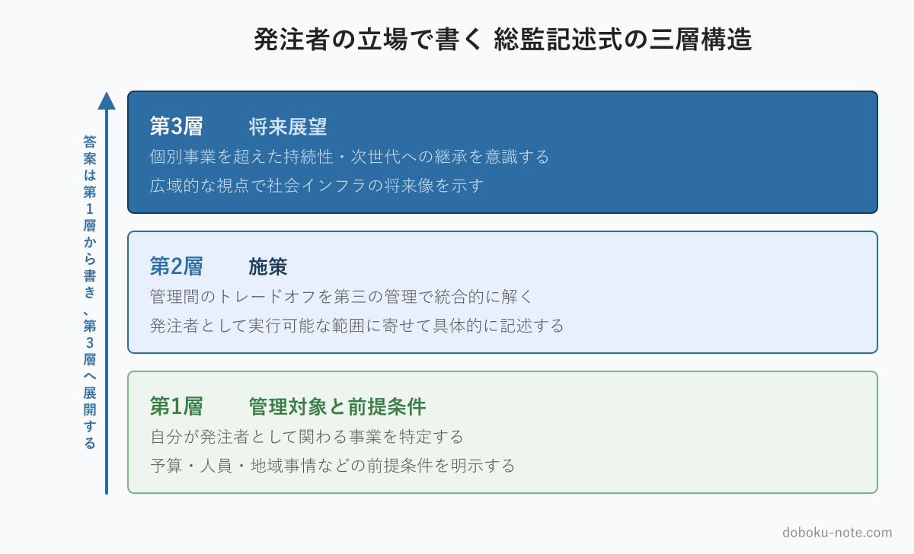

# 【総監記述式】発注者（自治体）の立場で記述式をどう組み立てるか｜三層構造と陥りやすい罠

**こんな人におすすめ**

- 自治体の発注者の立場で総監記述式の対策をしている
- 記述式の答案を、どの視点で組み立てればよいか定まらない
- 民間（施工者・コンサル）と同じ書き方でよいのか不安
- 三層構造を発注者の立場でどう埋めるか知りたい

**この記事でわかること**

- 発注者が総監記述式で本来は有利な理由
- 発注者視点で答案を組み立てるときの中心軸
- 三層構造を発注者の立場で埋める方法と、陥りやすい3つの罠

---

総監の記述式対策を進める自治体の発注者から、よく聞く戸惑いがあります。「参考書や合格答案の例は、施工者やコンサルの立場で書かれているものが多い。発注者の自分は、どう書けばいいのか」という戸惑いです。

結論から言えば、発注者は総監記述式で本来は有利な立場にあります。ただし、その有利さを答案で活かすには、発注者ならではの書き方の軸を意識する必要があり、発注者だからこそ陥りやすい罠もあります。この記事で順に整理します。

<!-- cta:pack-top -->
> 本番直前の総仕上げは、出題予想6テーマ×三層骨子で「何が出ても書ける型」を最短装填できるR8予想問題集が決め手。書き方の型から固めるなら、型・設問(3)の弾薬・R8演習を1セットにした記述式コアパックが入口に最適です。

https://note.com/dobokunote/m/m6854c7437d4d

https://note.com/dobokunote/m/m6e7de5e4ea3d

## 発注者は総監記述式で有利な立場にある

総監の記述式は、特定の専門技術を深掘りする試験ではありません。事業全体を俯瞰し、複数の管理を統合する立場で書くことを求める試験です。

発注者の日常は、まさにそれです。限られた予算の中で、安全を確保し、工程を守り、住民や環境に配慮しながら、事業を前に進める。コスト・安全・環境・工程・関係者を同時に見るのが発注者の仕事です。

一つの工種を深く突き詰めるのではなく、事業全体のバランスを取り続ける——この働き方が、総監の問う「総合的な管理」と重なります。

一般部門の延長で「専門技術の深さ」で勝負しようとする受験者は、総監の土俵に乗り換えるのに苦労します。専門を深掘りするほど高評価だった一般部門の感覚が、総監では通用しないからです。

これに対して発注者は、元から総監の土俵に立っています。日々の発注業務でやっていることを、答案の上で言語化すればよい。この立場の強みを、意識的に活かしてください。

## 発注者視点で書くときの中心軸

発注者の業務範囲を踏まえると、記述式で軸に据えやすいのは「経済性 × 安全 × 社会環境」のトレードオフです。

限られた予算で（経済性管理）、安全を確保し（安全管理）、住民や環境に配慮しながら（社会環境管理）事業を進める——これは発注者の日常そのものです。この3つの管理を主軸に置き、情報管理（データ活用・DX・情報公開）と人的資源管理（執行体制・担い手確保）を補助に回すと、発注者は自分の経験を素直に答案に乗せられます。

ここで大事なのは、無理に5管理を均等に書こうとしないことです。総監の記述式は、5つの管理に同じ字数を割り振る試験ではありません。テーマと自分の立場から自然に書ける管理を主軸に据え、他の管理をそこへどう関係づけるかを示す。

そのほうが、地に足のついた、説得力のある答案になります。発注者が無理に施工現場の労働安全を語ろうとすると、かえって借り物の議論になります。

## 三層構造を発注者の立場で組み立てる

総監の記述式は「管理対象と前提条件 → 施策 → 将来展望」という三層構造で書くのが定石です。発注者の立場で、各層をどう埋めるかを示します。

**第1層：管理対象と前提条件** — 自分が発注者として関わる事業（道路、河川、上下水道、公共施設など）を管理対象に据えます。そして、その事業が置かれた前提——予算の制約、執行体制の人員、地域の事情、施設の老朽化の状況など——を具体的に書きます。発注者は事業の前提を最もよく知る立場です。

ここを具体的に書けることが、発注者の答案の強みになります。抽象的な「我が国のインフラ」ではなく、「自分が担当する地域の、この種の事業」に落として書いてください。

**第2層：施策** — 第1層で示した前提のもとで生じる管理間のトレードオフを特定し、第三の管理を持ち込んで統合的に解きます。たとえば、コスト縮減（経済性）と安全確保（安全）が対立する場面で、点検データの分析（情報管理）を持ち込んで「費用対効果の高い対策に絞り込む」といった解き方です。発注者の施策は「自分が発注者として実行できること」に寄せるのが現実的です。

**第3層：将来展望** — 個別の事業を超えた、持続性や次世代への継承、広域的な視点を示します。発注者は地域全体を見る立場なので、この層も書きやすいはずです。人口減少のなかで維持管理体制をどう持続させるか、といった展望は、発注者の実感を伴って書けます。

### 組み立ての骨組みの例

抽象的に思えるかもしれないので、橋梁の維持管理を題材にした三層の骨組みを、ごく簡単に示します。

- **第1層**：自分の自治体が管理する橋梁群を管理対象に据える。高度経済成長期に集中的に架けられ、点検・補修の予算と体制は限られている、という前提を置く
- **第2層**：すべてを予防保全したいが予算が足りない（経済性管理と安全管理のトレードオフ）。点検データの分析（情報管理）で劣化の進んだ橋を絞り込み、優先順位をつけて投資を集中する、という施策を示す
- **第3層**：個別の橋ではなく、地域の橋梁群全体をどう持続的に管理するか。人口減少下での執行体制のあり方まで展望を広げる

これはあくまで骨組みです。各層を3,000字級のフル答案に肉づけする展開は、後述のマガジンで確認できます。骨組みの段階で「どの管理が対立し、どの管理で解くか」が定まっていれば、本番で書き進めても筋がぶれません。

## 発注者が陥りやすい3つの罠

発注者には強みがある一方で、発注者だからこそ陥りやすい罠もあります。3つ挙げます。

**罠1：施工の技術詳細に逃げる** — 発注者は施工の知識も持っているため、つい工法の細部や技術的な計算を書きたくなります。しかし総監は管理の試験です。技術詳細はそれ自体が減点ではありませんが、そこに字数を使うほど、肝心の管理の議論が薄くなります。「どの工法を選ぶか」より「なぜその判断をしたか、どの管理を優先したか」を書いてください。

**罠2：一般論・評論になる** — 発注者は事業を「一段上から見る」立場であるぶん、当事者性が抜け、評論調になりがちです。「我が国は〜すべきである」と論じるだけでは、総監が求める「自らの管理経験に基づく論述」になりません。「私は発注者としてこう判断した」という主語を、答案の中で保ち続けてください。

**罠3：自分の権限を超えたことを書く** — 国レベルの大きな政策提言など、一担当の発注者の立場とかけ離れた施策を第2層に書くと、答案の現実味が失われます。第3層の将来展望は広く描いてよいのですが、第2層の施策は「自分の立場で実行可能な範囲」に寄せるのが安全です。実行可能性は、総監が見る重要な評価点です。

## 発注者の「フル答案」で組み立て方を確かめる

ここまでは答案の組み立て方——いわば設計図——の話です。実際にこの設計図がどう肉づけされ、3,000字級のフル答案になるのかは、完成形を見るのが一番の近道です。

note のマガジン「総監記述式 模範論文｜自治体 道路担当」は、発注者（自治体 道路担当）の立場で書いた過去5年分のフル模範論文と、R8予想問題への解答を収録しています。

本記事で示した三層構造が、発注者視点で実際にどう展開されるか、3つの罠を避けた答案がどう書かれているかを確認できます。

https://note.com/dobokunote/m/m52186ffd12ca

## 総監対策をまとめて進めたい方へ

工程（型 → 設問(3) → 予想演習 → フル模範論文）を一気にそろえたい方には、全部入りの「完全パック」が最もお得です。

https://note.com/dobokunote/m/m171222175fac

各マガジンの全体像と「どれから読むか」は、はじめての方向けのロードマップ記事にまとめています。

https://note.com/dobokunote/n/n3d73729e6cc7

## 関連リソース

**doboku-note — 17年分の過去問 + 700キーワード解説**（無料）

https://doboku-note.com

- 17年分の記述式・択一式過去問（解答解説つき）
- キーワード集2026の全項目をWeb検索可能
- 700以上のキーワード解説ページ（スマホ対応）

---

記述式で「5管理のトレードオフをどう書くか」に悩んでいる方は、下記マガジンもご覧ください。安全・経済性・情報・人的資源・社会環境の20セルを網羅し、各ペアの衝突パターンと総監フレームの解決策・答案ひな型をまとめています。

https://note.com/dobokunote/m/m921fbe060575

---

**note のおすすめ記事**

- 【総監対策】発注者の日常を5管理に翻訳する｜「自分の仕事」で総監を腹落ちさせる
- 【総監択一】自治体の技術職員が総監択一でつまずく3つの盲点｜発注者業務と試験範囲のズレ

答案全体の組み立て方と時間配分は、[総監 記述式の攻略戦略](https://doboku-note.com/docs/pe-comprehensive-management-essay-exam-strategy?utm_source=note&utm_medium=referral&utm_campaign=98-owner-essay-build&utm_content=essay-exam-strategy)にまとめています。立場の置き方を決めたあとの手順として読んでください。

---

<!-- cta:tankan-mokuji -->
総監のほかの無料記事・有料マガジンは「総監もくじ」から一覧できます。

https://note.com/dobokunote/n/n3ed4c77ceed6
