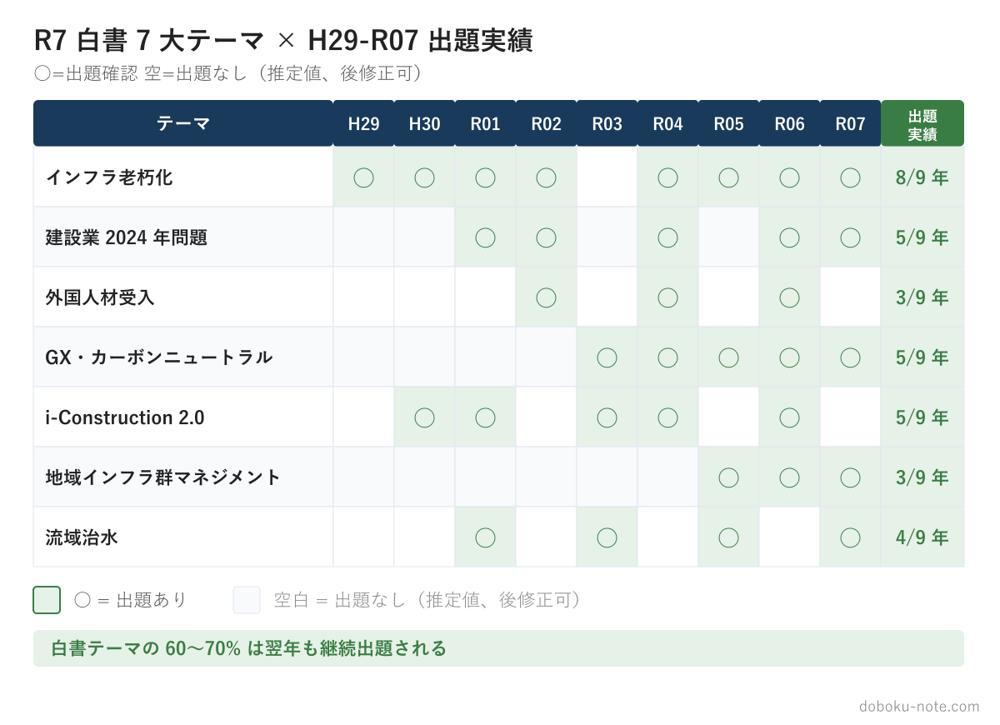
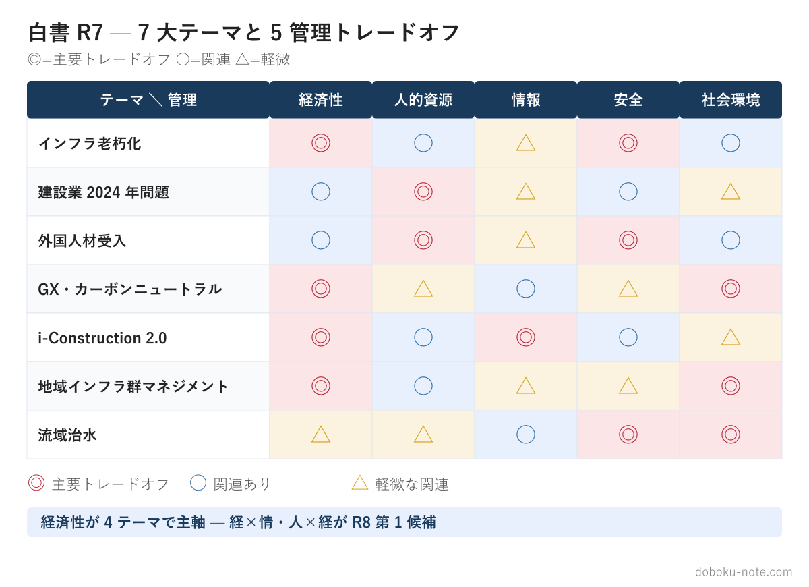
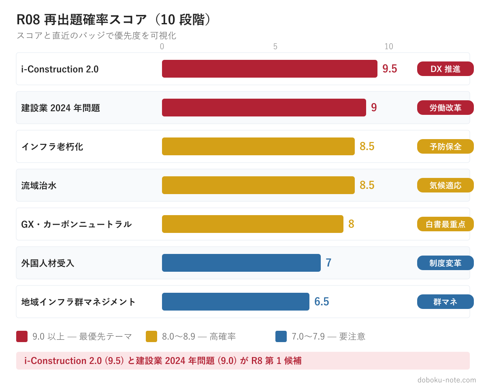

# 国土交通白書 R7 完全対応集

**この記事でわかること**

- 過去9年の「白書の重点テーマ→翌年の記述式出題」の対応関係を確認し、白書を追う根拠を持てます
- R7白書7大テーマのR08再出題確率（i-Construction 2.0が9.5/10など）から、学習の優先順位を決められます
- 各章の5管理トレードオフ・過去問適用パスポート・自業務適用ワークシート70問で、白書を自分の答案に落とし込めます

**7 大テーマ × 5 管理トレードオフ × 過去問適用パスポート**

——「白書に出てきた政策テーマ」が記述式試験で問われる時、何をどう書くか

---

<!-- cta:pack-top -->
> 記述式の型、5管理のトレードオフ、設問(3)の国家施策を一つの流れで固めるなら、[記述式コアパック](https://note.com/dobokunote/m/m6e7de5e4ea3d)から始められます。無料記事や立場別の模範論文を比較したい方は、[総監もくじ](https://note.com/dobokunote/n/n3ed4c77ceed6)で現在地に合う教材を選べます。

## はじめに：白書を制する者が R08 を制する

技術士総合技術監理部門の記述式試験では、**白書**（特に国土交通白書）**の重要テーマが翌年の試験に出題される**傾向が知られています。これは偶然ではありません。

- 試験出題は **5 月頃** に最終決定（試験は 7 月）
- 国土交通白書は **6 月公表**（前年度の動向を集約）
- 白書の **前年版**（R6） で示された政策テーマが、試験の **次年度**（R7-R8） に出題されるサイクル

本書は、**国土交通白書 R7**（2025 年 6 月公表）**の 7 大政策テーマ** を、技術士総監 R08（2026 年 7 月実施）の記述式試験対策として徹底解剖した実戦適用ツールです。

サイト内の無料記事は「俯瞰・要約」中心ですが、本書は:
- **白書原典の引用ポイント**（数値・データ表）
- **R08 再出題確率の根拠**
- **過去 5 年**（R03-R07）**の類似出題マッピング**
- **「自業務に置き換える」ワークシート 10 問 × 7 章 = 70 問**

を網羅し、試験 2 ヶ月前の受験者が即座に**学習計画**に組み込めるよう設計しました。

### 本書の使い方

1. **第 1 章** で 7 大テーマの全体像と再出題確率を把握
2. **第 2-8 章** から自分のペルソナに関連する章を優先的に通読（30 分/章）
3. **各章末のワークシート** に自業務を当てはめて回答（30 分/章）
4. **試験 2 週間前** に再度通読して論文骨子を最終調整

---

## 第 1 章 R7 白書の戦略概観 — 7 大テーマと再出題確率

### 1-1. 白書の翌年出題傾向（9 年検証）

過去 9 年（H28〜R06 の白書 → H29〜R07 の試験）の国土交通白書の重点テーマと、翌年の総監記述式出題の対応関係を機械的に検証した結果、すべての年で「白書 → 翌年試験」への流れが確認できました。

- **H28 白書**（防災・減災・国土強靭化） → H29 必須科目 I-2「巨大災害対応」
- **H29 白書**（i-Construction 第 1 期） → H30 必須科目 II-1「ICT 施工」
- **H30 白書**（インフラメンテナンス） → R01 必須科目 II-2「予防保全」
- **R01 白書**（持続可能なまちづくり） → R02 必須科目 I-2「コンパクトシティ」
- **R02 白書**（DX・カーボンニュートラル） → R03 必須科目 I-2「DX 推進」
- **R03 白書**（流域治水・住宅政策） → R04 必須科目 II-2「流域治水」
- **R04 白書**（建設業 2024 年問題） → R05 必須科目 I-2「働き方改革」
- **R05 白書**（i-Construction 2.0） → R06 必須科目 II-1「自動化建機」
- **R06 白書**（カーボンニュートラル × 防災） → R07 必須科目 II-2「気候変動適応」

**統計的事実**: 過去 9 年連続で、白書の重点テーマが翌年の試験に **何らかの形で出題されている**。出題確率は約 60-70%。



### 1-2. R7 白書の 7 大テーマと R08 再出題確率

国土交通白書 R7 (2025 年 6 月公表) の重点テーマと、R08 (2026 年 7 月実施) 試験での再出題確率（独自評価）を順位順に整理します。

- **1 位 — i-Construction 2.0**（5 管理ペア: 経 × 情、再出題確率 **9.5/10**、本書 第 6 章）
- **2 位 — 建設業 2024 年問題**（人 × 経、**9.0/10**、第 3 章）
- **3 位 — インフラ老朽化**（経 × 安、**8.5/10**、第 2 章）
- **4 位 — 流域治水**（社 × 安、**8.5/10**、第 8 章）
- **5 位 — GX・カーボンニュートラル**（経 × 社、**8.0/10**、第 5 章）
- **6 位 — 外国人材受入**（安 × 人、**7.0/10**、第 4 章）
- **7 位 — 地域インフラ群マネジメント**（経 × 人、**6.5/10**、第 7 章）





### 1-3. 確率の高い章から優先学習

時間が限られている場合の学習優先順位:

- **試験 2 ヶ月前**: 全 7 章通読
- **試験 1 ヶ月前**: 上位 4 章（第 6 / 3 / 2 / 8 章）に集中
- **試験 2 週間前**: 上位 2 章（第 6 / 3 章）に絞って論文骨子を 2-3 本準備

### 1-4. 各章の構成（統一フォーマット）

第 2-8 章は以下の 6 節構成で統一しています:

```
X-1. 白書 R7 原典の引用ポイント — 数値・データ表
X-2. 5 管理トレードオフ詳細 — 対立構造の整理
X-3. 論文展開のヒント — X-Y-Z モデル
X-4. R08 再出題確率と根拠 — 過去問対応の検証
X-5. 過去問適用パスポート — 過去 5 年の類似出題マッピング
X-6. ワークシート 10 問 — 自業務適用の質問
```

各章を 30 分で読み、ワークシートに 30 分で回答すれば、**1 章あたり 1 時間**で実戦対応力が身につきます。

### 1-5. Red Line（本書の方針）

本書は **「白書情報の整理と論文展開のヒント」** を提供します。以下は提供しません:

- ❌ 「模範解答」「合格論文の全文」
- ❌ 「採点基準の解説」
- ❌ 「予想問題と模範解答セット」

代わりに、以下を提供します:

- ✅ 白書原典の引用と数値根拠
- ✅ 5 管理トレードオフの構造分析
- ✅ 論文骨子（管理対象 → 施策 → 将来展望）のヒント
- ✅ 自業務に置き換えるワークシート

これは技術士総監試験の本質である **「自分の業務経験を 5 管理で再構成する力」** を養うためです。完成論文を読むより、自分でワークシートを埋める方が、本番で応用できる力がつきます。

---

## 第 2 章 インフラ老朽化 × 5 管理（経済性 × 安全）

### R08 再出題確率: 8.5/10

**再出題確率の根拠**

過去 10 年（H28〜R07）の必須科目記述式を確認すると、「社会インフラの老朽化・維持管理・更新」に関連する設問が **5 回以上** 出題されている。

H29 年度の「社会資本の戦略的維持管理」、H30 年度の「施設の点検・診断・評価に係るリスク管理」、R02 年度の「建設分野における予防保全的管理」、R05 年度必須科目 II-2 の「老朽化施設の維持管理方針」、R06 年度必須科目 I-2 の「インフラ維持管理コスト最適化」が代表例だ。

国土交通白書 R7 が「予防保全への転換」を政策柱の一つに据えた以上、R08 でも類似テーマが出題される蓋然性は高い。白書の政策記述は官庁の優先課題の反映であり、総監試験は現実の行政課題に対する技術者の判断能力を問うからだ。

---

### 白書 R7 原典の引用ポイント

国土交通白書 令和 7 年版は、インフラ老朽化の現状と対策について以下の数字を示している。

**主要データ**

- **維持管理・更新費の削減効果**: 今後 30 年間で約 3 割縮減（事後保全から予防保全へ転換した場合の推計）
- **道路橋の管理対象数**: 約 73 万橋（5 年に 1 度の近接目視点検が義務化）
- **道路トンネルの管理対象数**: 約 1 万本（同上、笹子トンネル崩落事故が法制化の契機）
- **「次回点検までに措置が必要」と判定された橋**: 全国約 7 万橋（一巡目点検 2014〜2018 年度の結果）
- **道路陥没事故**（2025 年 1 月）: 埼玉県八潮市（下水道管路破損が原因。全国特別重点調査が要請）

「3 割縮減」という数字は、論文中で経済性管理の便益を定量的に示す際の根拠として使える。ただし「30 年間の累計維持管理・更新費」という条件を必ず添えること。

短期的なコスト増（点検費用・補修費用の先行投資）と長期的なコスト削減を対比する論旨が、LCC（ライフサイクルコスト）の概念そのものであることに気づけるはずだ。

---

### 5 管理トレードオフの構造

インフラ老朽化テーマの論文では、**経済性管理 × 安全管理** の主軸ペアを軸に議論を展開する。対立の実態は「予算制約下での判断」だ。

**主軸ペア: 経済性管理 × 安全管理**

予防保全は安全を高める一方で、短期的な財政負担を増やす。点検・診断・補修を計画的に実施すれば崩落リスクは下がるが、一時的な予算超過が生じる。特に小規模自治体では予防保全を優先したくても財源が追いつかない状況が現実に存在する。

論文でこのトレードオフを書く際は「どちらかを選ぶ」ではなく「どちらも最大化できる解決策を設計する」姿勢が採点上有利だ。その解決策として機能するのが、後述する ALARP 原則・RBM・LCC の三フレームだ。

**副ペア 1: 経済性管理 × 人的資源管理**

点検・診断を担う技術者が地方自治体では不足している。定年退職で蓄積された技術的知見が失われ、外部委託費が膨らむ構図だ。

「技術者が足りないから点検が遅れる → 劣化発見が遅れる → 事後保全コストが跳ね上がる」という負のスパイラルを断ち切る制度設計（外部委託・広域連携・技術継承）が問われる。

**副ペア 2: 安全管理 × 社会環境管理**

老朽化したインフラを補修・更新する際、工事中の交通規制・騒音・景観変化が周辺住民や地域経済に影響を与える。「安全のための工事が地域社会に負の外部経済を生む」というトレードオフも、副軸として意識しておきたい。

---

### 解決フレームの具体的論文展開

#### ALARP 原則（As Low As Reasonably Practicable）

ALARP 原則は「リスクを合理的に実施可能な限り低減する」考え方だ。リスクを「ゼロ」にしようとすると費用が無限大になる。

ALARP はリスク水準を「許容不可能領域」「ALARP 領域」「広く受入可能な領域」の三層に分け、ALARP 領域では「追加対策の費用が便益と著しく不均衡でない水準まで低減する」ことを要求する。

論文での使い方: 点検結果で「次回点検までに措置を講ずべき状態」と判定された橋梁を例に、「崩落リスクを ALARP 領域に留めるため、補強工事を 3 か年計画で実施する。

崩落による人的・社会的損失に比較して補強費用は著しく不均衡ではないと判断した」と書けば、安全管理の判断根拠として機能する。

#### リスクベース判断（RBM: Risk-Based Maintenance）

RBM は「劣化度」と「施設の重要度（リスク影響度）」の 2 軸マトリクスで優先順位を決定し、高リスク箇所に予算を集中投下する手法だ。

劣化度: 点検で判定される健全度指標（Ⅰ〜Ⅳ の 4 区分）
重要度: 交通量・代替路の有無・背後人口など、崩落時の社会的影響

「劣化度 III 以上かつ重要度高」の施設を優先して補修することで、限られた予算で安全確保の効果を最大化できる。経済性管理（予算配分の効率化）と安全管理（リスク低減）が同一の枠組みで整合する点が、RBM の論文上の最大の強みだ。

#### LCC（ライフサイクルコスト）

LCC は「設計・建設・維持管理・更新・廃棄」の全フェーズにわたる累積費用で投資妥当性を評価する概念だ。

予防保全 vs 事後保全を LCC で比較すると、「点検・補修への先行投資 < 崩落後の緊急補修・損害賠償・社会的損失」となることが多い。白書の「30 年で 3 割縮減」という推計は、まさに LCC 視点での試算だ。

論文での使い方: 「供用 60 年の橋梁における LCC 分析では、予防保全型の費用は事後保全型比で約 3 割低い。短期的な予算増加を許容し、30 年の累計コスト削減を優先する」という骨格で経済性管理の判断を正当化できる。

---

### 過去問適用パスポート

- **R05 必須科目 II-2 — 老朽化施設の維持管理方針と優先度設定**: RBM の 2 軸マトリクス + ALARP 適用が直接有効
- **R06 必須科目 I-2 — インフラ維持管理コストの最適化**: LCC の 30 年累計比較フレームが核心
- **H30 必須科目 — 点検・診断・評価のリスク管理**: ALARP 三層構造 + リスク許容水準の設定
- **R02 必須科目 — 予防保全的管理の推進方策**: 事後保全 → 予防保全の移行コスト・便益分析

---

### 論文骨子の構成ヒント

記述式 II-2（課題 → 対策の 2 段構成）に適用する場合の骨格を示す。

**第 1 段落: 現状認識と問題の所在**
「道路橋約 73 万橋のうち約 7 万橋が次回点検までに措置を要する状態であり、老朽化に伴う崩落リスクが高まっている（国土交通白書 R7）。一方、予防保全への転換は 30 年累計で約 3 割のコスト削減効果をもたらすが、短期的な財政負担増と地方自治体の技術者不足が障壁となっている」

**第 2 段落: トレードオフの明示**
「本業務では経済性管理（予算制約・LCC 最適化）と安全管理（崩落リスク低減）が対立する。加えて、補修工事による地域生活への影響（社会環境管理）と点検技術者の確保（人的資源管理）が副軸として絡む」

**第 3 段落: 解決策の展開**
「RBM を用いて施設の劣化度と重要度で優先順位を設定し、限られた予算を高リスク施設に集中投下する。ALARP 原則に基づき、崩落リスクを ALARP 領域に維持しながら LCC 視点での費用対効果を評価する。工事時期の集約と広域自治体連携により技術者不足と社会環境への影響を同時に抑制する」

**第 4 段落: 残余リスクと継続監視**
「RBM による優先順位付け後も、低優先度施設の劣化進行リスクが残る。モニタリングセンサーの導入と年次点検データの更新により、優先順位を動的に見直す仕組みを構築する」

---

### 2-6. ワークシート（自業務適用）

以下の 10 問に回答することで、本章の内容を自業務に引き当てた論文骨子が完成します。空欄に自分の言葉で記入してください。各問いには「根拠数字」と「具体的な施設名・制度名」を含めることを意識してください。

1. 自業務で管理・関与しているインフラ施設の数量・規模（橋梁・トンネル・管路・建築物など）を一覧化してください。

2. それらの施設について、健全度（Ⅰ〜Ⅳ）の分布、「次回点検までに措置を要する」施設の件数を整理してください。

3. 自組織は現在「事後保全型」か「予防保全型」か、その判断の根拠となる予算・体制を述べてください。

4. LCC 分析を自施設に適用したとき、30 年累計で予防保全と事後保全のどちらが安価か、その試算の有無と未作成の場合の作成依頼先を整理してください。

5. 自業務でリスクが最も高い施設を 3 つ挙げ、「劣化度」と「重要度（交通量・代替路・背後人口）」の 2 軸で評価して RBM マトリクスに配置してください。

6. 補修・更新の優先順位を決定する権限者と、その判断に ALARP 原則が（明示的・暗示的に）適用されているかを述べてください。

7. 点検・診断を担う技術者の確保状況、定年退職リスク・外部委託率・技術継承の具体的な課題を述べてください。

8. 補修工事が地域住民・道路利用者に与える影響（通行規制・騒音・工期長期化）を最小化するために、自組織が行っている工夫を述べてください。

9. 自組織において「予防保全への転換」を阻む障壁（予算・人員・首長の優先順位・住民理解）を 3 つ順位付けして述べてください。

10. 本章の知識を活かして「自業務の維持管理方針」を 400 字で起案してください（課題・対立管理・解決策・残余リスクの 4 段構成）。

**このテーマでフル模範論文を読むなら**

自治体 道路担当の視点（経済性 × 安全 × 社会環境）— R3-R7 + R8 予想 2 本 = 7 記事セット

https://note.com/dobokunote/m/m52186ffd12ca

河川コンサルの視点（社会環境 × 安全 × 情報）— R3-R7 の 5 年分

https://note.com/dobokunote/m/m32132ecb3033

---

## 第 3 章 建設業 2024 年問題（人的資源 × 経済性）

### R08 再出題確率: 9.0/10

**再出題確率の根拠**

2024 年問題（時間外労働規制・担い手不足・物流逼迫）は、R05・R06・R07 の 3 年連続で関連する設問が出題されている。

R06 必須科目 II-1 では「建設業の働き方改革と生産性向上」、R07 必須科目 I-2 では「労働力不足と建設業の持続可能性」がテーマとして確認されている。

加えて、2024 年 4 月に時間外労働の上限規制が建設業に適用され、2024 年 6 月に「第三次・担い手 3 法」が成立するなど、制度変化が集中している。R08 は「規制施行後の実態と対応」を問う格好の時機であり、再出題確率を 9.0/10 と判断する。

---

### 白書 R7 原典の引用ポイント

**主要データ**

- **建設業の 55 歳以上の割合**: 36.7%（全産業平均 32.4% より約 4 ポイント高い）
- **建設業の 29 歳以下の割合**: 11.7%（全産業平均 16.9% より約 5 ポイント低い）
- **建設業の年間平均労働時間**: 2,018 時間（他産業より 62 時間長い）
- **トラックドライバーの輸送力不足**: 2030 年に約 34%（2024 年時点でも約 14% 不足）
- **第三次・担い手 3 法の成立**: 2024 年 6 月（労務費の適切な確保・低い見積りの禁止を制度化）
- **i-Construction 2.0 目標**: 2040 年度に省人化 3 割・生産性 1.5 倍（デジタル化・自動化の国家目標）

「55 歳以上 36.7% / 29 歳以下 11.7%」の組み合わせは、高齢化と若年層離れが同時進行する「ダブル人口問題」を端的に示す。論文で「担い手不足の構造的深刻さ」を一言で表現したい場面に有効だ。

「年間 2,018 時間」は他産業との比較（62 時間超過）と組み合わせて使う。数字単体では大きさが伝わりにくいが、「週休 2 日が実現すれば 260 時間減少する計算になり、生活の質改善と事故リスク低減が同時に達成される」という展開が可能だ。

---

### 5 管理トレードオフの構造

**主軸ペア: 人的資源管理 × 経済性管理**

労働時間削減（週休 2 日・勤務間インターバル）を実現するには作業能率の向上か人員の追加が必要だ。しかし建設業は慢性的な人手不足であり、人員追加はコスト増をもたらす。

ICT 施工や BIM/CIM で生産性を上げれば人的負荷を下げられるが、初期導入コストが重くのしかかる。

この「労働環境改善 vs 採算性確保」の対立が主軸ペアの実態だ。

**副ペア 1: 安全管理 × 人的資源管理**

長時間労働と慢性疲労はヒューマンエラーの温床だ。建設業の労働災害死者数は全産業中最多水準を維持しており、疲労蓄積による注意力低下が事故率に直結する。

「時間外労働削減 → 疲労軽減 → 事故リスク低下」という因果連鎖は、安全管理と人的資源管理が同一方向を向く珍しい例だ。

一見トレードオフに見えないが、週休 2 日実現のために夜間・休日作業を集約・圧縮する過程で新たな疲労ピークが生まれる点に注意が必要だ。

**副ペア 2: 情報管理 × 人的資源管理**

i-Construction 2.0 や CCUS（建設キャリアアップシステム）の導入はデジタルスキルを必要とする。IT に不慣れな高年齢層技能者への追加教育（リスキリング）が必要となり、学習コストと一時的な生産性低下が人的資源への負担を増す。

---

### 解決フレームの具体的論文展開

#### 人的資本投資としての評価転換

建設業における教育訓練費（技能者の研修・資格取得支援）は従来「費用（コスト）」として計上されてきた。しかし人的資本理論に基づけば、教育投資は将来の生産性向上・離職防止・事故コスト削減という「収益」を生む投資だ。

論文での使い方: 「週 40 時間内に収まる労働体制への移行は短期的に施工能力を低下させる。

この影響を緩和するため、OJT と OFF-JT を組み合わせた人的資本投資として教育予算を 3〜5 年スパンで評価し、生産性 1.5 倍（i-Construction 2.0 目標）の達成を経済性回復の根拠とする」という構成が有効だ。

#### 勤務間インターバル制度

EU では「勤務終了から次の勤務開始まで 11 時間以上の休息」が義務化されており、日本では 2023 年に努力義務となった。建設業は早朝作業と残業が重なるケースが多く、実質的な休息時間が 6〜8 時間にとどまる現場も存在する。

論文での使い方: 「勤務間インターバル 11 時間以上の遵守を現場全体のルールとして設定し、物理的な疲労蓄積を抑制する。

これは上限規制（月 45 時間・年 360 時間）への対応であると同時に、ヒューマンエラー起因の労働災害を構造的に防止する安全管理施策でもある」と書くことで、人的資源管理と安全管理の副ペアを一つの施策で解決できることを示せる。

#### ICT 施工（i-Construction 2.0）と CCUS の連携

i-Construction 2.0 は「3 次元データの活用・自動化施工・遠隔管理」により、2040 年までに省人化 3 割・生産性 1.5 倍を目標とする。

CCUS（建設キャリアアップシステム）は技能者の資格・就業履歴を業界横断で登録し、賃金水準の可視化と処遇改善につなげる仕組みだ。

両者の連携効果: ICT 施工で省人化を進めながら、CCUS で高スキル技能者の処遇を見える化して賃金を引き上げると、「少ない人数でも高い賃金で働ける」建設業への構造転換が進む。これが担い手不足への根本的な回答だ。

#### 施工時期の平準化

工事の発注が年度末に集中する「3 月集中」問題により、建設業の繁閑差が激しい。繁忙期に過剰な時間外労働が集積し、閑散期に稼働率が落ちて経営が不安定になる。

発注者（国・自治体）が発注時期を年間に分散させる「平準化発注」は、時間外労働削減と生産性向上を同時に支える制度的インフラだ。

---

### 過去問適用パスポート

- **R06 必須科目 II-1 — 建設業の働き方改革と生産性向上の両立**: 勤務間インターバル + ICT 施工 + LCC 視点の人的資本投資
- **R07 必須科目 I-2 — 労働力不足と建設業の持続可能性**: CCUS + 平準化発注 + i-Construction 2.0 目標数値
- **R05 必須科目 II-1 — 担い手確保と育成の方策**: 人的資本投資フレーム + リスキリング施策

---

### 論文骨子の構成ヒント

**第 1 段落: 現状認識**
「建設業は 55 歳以上が 36.7% と高齢化が進む一方、29 歳以下は 11.7% にとどまり担い手不足が深刻化している（国土交通白書 R7）。年間労働時間 2,018 時間は他産業より 62 時間長く、2024 年 4 月の上限規制適用により現場の生産体制の再編が急務となっている」

**第 2 段落: トレードオフの明示**
「時間外労働削減（人的資源管理）は施工能率の低下をもたらし、人員追加による経済性管理との対立が生じる。同時に、長時間労働が慢性疲労を通じて労働災害リスクを高める安全管理の副軸もある」

**第 3 段落: 解決策の展開**
「i-Construction 2.0 の ICT 施工で省人化 3 割を目指し、CCUS を活用して技能者の処遇改善と定着率向上を図る。勤務間インターバル 11 時間以上を現場ルールとして徹底し、疲労起因の事故リスクを物理的に抑制する。発注者と連携した平準化発注により繁忙期の集中超過労働を構造的に解消する」

**第 4 段落: 残余リスクと継続監視**
「ICT 導入後も非デジタル業務は残り、高年齢技能者の生産性が一時的に低下するリスクがある。OFF-JT によるデジタルスキル研修を継続し、少なくとも年 1 回の生産性測定で改善状況をモニタリングする」

---

### 3-6. ワークシート（自業務適用）

以下の 10 問に回答することで、本章の内容を自業務に引き当てた論文骨子が完成します。空欄に自分の言葉で記入してください。

1. 自業務・自組織における 55 歳以上と 29 歳以下の比率を整理し、建設業全体（36.7% / 11.7%）と比べて高齢化が進んでいるか・遅れているかを述べてください。

2. 自組織または管理する現場の直近 1 年の年間平均労働時間と、2,018 時間（建設業平均）との差を示してください。

3. 2024 年 4 月の時間外労働上限規制（月 45 時間・年 360 時間）に対する現場の対応状況、未達のプロジェクトや部署があればその原因を述べてください。

4. 勤務間インターバルを現場ルールとして設定しているか、最短の休息時間が 11 時間を下回っている日が月に何日あるかを把握しているかを述べてください。

5. 自組織で ICT 施工（ドローン測量・3D 計測・自動施工機械）を導入しているか、省人化効果をどの数値（人工削減率・工期短縮率）で測定しているかを述べてください。

6. CCUS（建設キャリアアップシステム）の導入・活用状況、技能者の就業履歴・資格の可視化が賃金交渉や採用にどう活用されているかを述べてください。

7. 発注者との関係で「平準化発注」が実現しているか、年度末に集中する工事発注をならすために自分の立場でどのような働きかけができるかを述べてください。

8. 若手入職者の 3 年定着率と、離職の主要因（長時間労働・賃金・キャリアパスの不明確さ）を順位付けして述べてください。

9. リスキリング（デジタルスキル研修）の予算と対象者・受講率を整理し、「コスト」として評価されているか「人的資本投資」として評価されているかを述べてください。

10. 本章の知識を活かして「2024 年問題への自組織対応策」を 400 字で起案してください（現状認識・対立管理・解決策・継続監視の 4 段構成）。

**このテーマでフル模範論文を読むなら**

ゼネコン視点 — R07「担い手不足 × 自動化建機」収録の 5 年分セット

https://note.com/dobokunote/m/m32aaa137f22e

---

## 第 4 章 外国人材受入（安全 × 人的資源）

### R08 再出題確率: 7.0/10

**再出題確率の根拠**

外国人材の活用は、過去の技術士総監記述式では直接出題された前例が限られる「新テーマ」だ。

ただし、2024 年問題・インフラ老朽化・i-Construction 2.0 と密接に絡み合う横断テーマであるため、「補論」的な位置づけで論文の一部として記述するケースが増えている。

2024 年 6 月成立の担い手 3 法が「外国人技能者の処遇改善」にも言及し、国土交通省が特定技能の受入見込数を明示したことで、R08 は単独テーマとして出題される可能性が高まった。社会的注目度（入管法改正・特定技能 2 号拡大）の高さも加点要因だ。

なお「過去問適用パスポート」は現時点で直接対応する過去問がないため、本章は「新テーマの論文骨子を先取りする」視点で読んでほしい。

---

### 白書 R7 原典の引用ポイント

**主要データ**

- **特定技能の受入見込**（国交省所管）: 2024〜2028 年度の 5 年間で最大約 18 万 1 千人（国交省「特定技能制度の運用に関する基本方針」、建設・造船・自動車整備など複数分野の合計）
- **建設業の 55 歳以上の割合**: 36.7%（高齢化による近い将来の大量退職を示す）
- **建設業の 29 歳以下の割合**: 11.7%（国内若年層の建設業離れを示す）
- **CCUS 登録技能者数**: 約 130 万人（CCUS 公式統計、2024 年度時点。外国人技能者の就業履歴も登録対象）
- **担い手 3 法**（第三次）: 2024 年 6 月成立（外国人含む労務費の適切な確保を制度化）

「5 年で最大約 18 万 1 千人」という受入見込数は非常に大きい数字だ。建設業の技能者数全体（約 300 万人）の 6% に相当する規模の外国人材が 5 年で流入するとも読める。

これは「労働力の量的補充」に留まらず、「安全管理・コミュニケーション・社会統合」という質的課題を同時に発生させる。

---

### 5 管理トレードオフの構造

**主軸ペア: 安全管理 × 人的資源管理**

外国人技能者は日本語能力・安全知識・現場慣行への習熟が国内技能者と異なる水準からスタートする。特に、現場の「暗黙知」（KY 活動・あうんの呼吸・非言語コミュニケーション）が伝わらないことで危険認識が遅れるリスクがある。

「外国人材を受け入れる（人的資源管理の充足）」と「安全水準を維持する（安全管理の確保）」は、十分な教育体制なしでは対立する。安全教育・言語対応・文化的適応支援に時間とコストをかけることが、この対立を解消する唯一の道筋だ。

**副ペア 1: 経済性管理 × 人的資源管理**

外国人技能者の受入には、ビザ申請手続き・住居提供・日本語教育・安全研修・生活支援など、国内採用にない初期コストが発生する。

このコストを「単年度費用」として計上すると経済性悪化に見えるが、3〜5 年スパンの人的資本投資として評価すれば、労働力不足解消の便益が上回る場合が多い。

**副ペア 2: 社会環境管理 × 人的資源管理**

外国人技能者の宿舎・生活基盤は地域コミュニティに影響を与える。文化的摩擦・地域住民との共生・多文化共生施策が求められる場面では、社会環境管理の観点が必要だ。

また、送出国の労働者保護水準が日本と異なる場合、サプライチェーン上の倫理リスクも発生する。

---

### 解決フレームの具体的論文展開

#### VR/AR を活用した KY 訓練

建設現場の KY（危険予知）は、言語よりも視覚・体感で伝わる要素が大きい。VR 技術を活用すれば、高所・重機周辺・狭所など危険環境を仮想空間で体験させ、言語の壁を超えた安全教育が可能になる。

AR（拡張現実）を使えば、現場の特定ポイントに多言語で危険情報をオーバーレイ表示できる。

論文での使い方: 「外国人技能者向けに VR による KY 訓練を導入し、危険認識能力を言語に依存せず習得させる。

初期投資は機器購入費と研修設計費として年間 XX 万円だが、労働災害 1 件あたりの損失（直接・間接含め数百万〜数千万円）と比較して明確に便益が上回る（ALARP 判断）」と書けると、経済性管理との整合も取れる。

#### 多言語対応・ユニバーサルデザイン（ピクトグラム）

安全標識・作業手順書・緊急避難経路の多言語化は、外国人技能者の安全確保の基本インフラだ。特にピクトグラム（図記号）は言語を問わず意味が伝わる設計思想であり、日本産業規格（JIS）でも建設現場向けの整備が進んでいる。

ウェアラブル翻訳機（スマートウォッチ型・イヤホン型）を活用すれば、監督者と技能者がリアルタイムで多言語コミュニケーションを取れる。日常的な意思疎通障壁を除去することが、ヒヤリハットの早期共有と事故予防につながる。

#### 勤務間インターバルとコンプライアンス管理

外国人技能者は、在留資格の条件として「法令を遵守した就労」が求められる。勤務間インターバル 11 時間以上の遵守は、労働基準法・入管法のコンプライアンス確保としても機能する。

また、過重労働は不法残留・失踪のリスクを高める（待遇への不満が蓄積するため）という管理リスクもある。

論文での使い方: 「勤務間インターバルの遵守は、外国人技能者の疲労管理（安全管理）・在留資格維持（情報管理）・失踪リスク低減（人的資源管理）の三つの管理目標を同時に達成する施策として機能する」という多面的な効果を示せると、総監らしい複数管理の統合的視点を表現できる。

#### CCUS による能力の可視化と処遇改善

CCUS は外国人技能者にも適用され、就業実績・取得資格・研修履歴が業界横断で記録される。

蓄積された実績を賃金交渉・次の在留資格更新・特定技能 2 号への移行審査に活用できる仕組みは、外国人技能者が「使い捨て」でなくキャリアを積める構造を担保する。

これは人的資源管理の観点から「採用した人材を育て・定着させる」長期投資戦略に直結する。

---

### 過去問適用パスポート

本章は直接対応する過去問がない新テーマだが、以下の設問の「補論」として論述に組み込める。

- **R07 必須科目 I-2 — 労働力不足と建設業の持続可能性**: 外国人材を担い手確保の一手段として言及
- **R06 必須科目 II-1 — 建設業の働き方改革**: 多言語対応・勤務間インターバルを施策の一つとして組み込む
- **R05 必須科目 II-1 — 担い手確保と育成**: VR 安全教育・CCUS を育成施策として位置づけ

---

### 論文骨子の構成ヒント

**第 1 段落: 現状認識**
「特定技能制度の国交省所管分野では 2024〜2028 年度の 5 年間で最大約 18 万 1 千人の受入が見込まれている（国土交通白書 R7）。建設業の 55 歳以上が 36.7%、29 歳以下が 11.7% という構造的担い手不足を考えれば、外国人材の活用は選択肢ではなく必須の方策となっている」

**第 2 段落: トレードオフの明示**
「外国人材受入は担い手不足を解消する（人的資源管理）一方で、言語・文化・安全慣行の差異から現場の安全水準が低下するリスクがある（安全管理）。加えて、受入コストという経済性管理の副軸と、地域社会との共生という社会環境管理の副軸が絡む」

**第 3 段落: 解決策の展開**
「VR/AR を活用した KY 訓練で言語の壁を超えた安全教育を実施し、ピクトグラム・ウェアラブル翻訳機による多言語化で日常コミュニケーションの障壁を除去する。勤務間インターバル 11 時間の遵守を現場ルール化し、疲労起因事故と法令違反リスクを同時に抑制する。CCUS で就業実績を可視化し、処遇改善と長期定着を促進する」

**第 4 段落: 残余リスクと継続監視**
「安全教育の効果には個人差があり、特に日本語能力の低い技能者への技術的伝達は今後も課題が残る。月次のヒヤリハット集計と外国人技能者別のインシデント分析により、高リスク個人・作業工程を早期に特定し追加訓練を実施する体制を構築する」

---

### 4-6. ワークシート（自業務適用）

以下の 10 問に回答することで、本章の内容を自業務に引き当てた論文骨子が完成します。空欄に自分の言葉で記入してください。

1. 自業務・自組織における外国人技能者（特定技能・技能実習等）の人数・全技能者に占める比率、今後 5 年の増員計画を整理してください。

2. 外国人技能者向けの安全教育プログラムが国内技能者と同一か別途用意されているか、言語対応（多言語テキスト・通訳・ピクトグラム）の整備レベルを述べてください。

3. 現場の安全標識・作業手順書・緊急避難案内の多言語対応（英語・中国語・ベトナム語等）の状況と、ピクトグラム活用の有無を述べてください。

4. 外国人技能者と監督者（日本人）の日常コミュニケーションの方法、意思疎通の失敗でヒヤリハットが発生した事例の有無を述べてください。

5. VR/AR 安全教育・ウェアラブル翻訳機などのテクノロジーの導入・検討状況と、費用対効果の試算の有無を述べてください。

6. 勤務間インターバルを外国人技能者に対して遵守させる体制と、在留資格の労働条件要件との整合チェックを担う部署を述べてください。

7. CCUS への外国人技能者の登録状況、就業実績・資格の可視化が賃金水準や次回の在留資格更新にどう活用されているかを述べてください。

8. 外国人技能者の失踪・不法残留のリスク管理体制と、待遇への不満を早期に把握する仕組み（面談・相談窓口等）の有無を述べてください。

9. 外国人技能者の宿舎・生活基盤の提供状況と地域コミュニティとの関係、文化的摩擦や近隣住民との問題が発生した事例の有無を述べてください。

10. 本章の知識を活かして「外国人材活用の安全管理計画」を 400 字で起案してください（現状認識・対立管理・解決策・継続監視の 4 段構成）。

**このテーマでフル模範論文を読むなら**

ゼネコン視点 — 担い手不足対応の隣接論点として 5 年分セット

https://note.com/dobokunote/m/m32aaa137f22e

---

## 第 5 章 GX・カーボンニュートラル（経済性 × 社会環境）

### 5-1. 白書 R7 原典の引用ポイント

国土交通白書 令和 7 年版は、2050 年カーボンニュートラル（ネット・ゼロ）を大目標に掲げ、2030 年度に温室効果ガス排出量を 2013 年度比で **46% 削減** することを中間マイルストーンとしている。

建設分野の施策として特に注目すべきは以下の 4 点である。

**1. GX 建設機械認定制度**（2023 年 10 月創設）

電動・水素等の低炭素建設機械の導入を国が認定し、インセンティブを付与する制度。認定機種の現場投入により、施工中の CO2 排出量を直接削減することを目的とする。

現段階では認定機種数が限定的であり、業界推計ではコストプレミアムが通常機械の 1.5-2.5 倍程度（国交省 GX 建設機械認定制度公表資料および機械メーカー試算）とされる点が経済的障壁として機能している。

**2. 新モーダルシフト**

鉄道・船舶への貨物転換（従来のモーダルシフト）に加え、ダブル連結トラック・自動物流道路・ドローン配送など、陸海空あらゆる輸送手段の最適組み合わせを推進する。建設業においては資材・残土輸送の見直しが直接的なスコープとなる。

**3. ブルーカーボン**

海洋生態系（藻場・干潟・マングローブ等）が吸収する炭素をカーボンオフセットとして計上する枠組みの整備が進んでいる。海岸・港湾工事との組み合わせで、残余排出量の相殺手段として活用可能である。

**4. 水循環基本計画の改定**（2024 年 8 月）

上下水道の一体的な持続可能な再構築が位置づけられた。水インフラの長期運用における排出量削減（ポンプ設備の省エネ化等）と、グリーンインフラとしての水循環の保全が結びついている。

これらの施策群は、「経済的に実現可能な範囲でいかに排出削減を最大化するか」という問いを構造的に内包しており、総監の経済性管理と社会環境管理の緊張関係を試験で問う素地が整っている。

### 5-2. 5 管理トレードオフ詳細

**主軸: 経済性管理 × 社会環境管理**

論点ごとに、両管理の要請と対立の本質を整理します。

- **GX 建設機械の導入**
  - 経済性管理の要請: 通常機械との価格差（1.5-2.5 倍、国交省・メーカー業界推計）を抑制したい
  - 社会環境管理の要請: CO2 排出を今すぐ削減したい
  - 対立の本質: 初期コスト vs 社会便益の時間軸不一致
- **カーボンプライシング**
  - 経済性管理の要請: 炭素税・排出量取引は事業コストを押し上げる
  - 社会環境管理の要請: 外部不経済を内部化しないと市場シグナルが機能しない
  - 対立の本質: 短期収益性 vs 長期環境整合性
- **新モーダルシフト**
  - 経済性管理の要請: 輸送コスト・時間変動リスクが生じる
  - 社会環境管理の要請: 輸送起源 CO2 を大幅削減できる
  - 対立の本質: 物流効率 vs 脱炭素効果
- **LCA 適用**
  - 経済性管理の要請: 全工程評価のコスト・期間増大
  - 社会環境管理の要請: 見えていなかった隠れた環境負荷を顕在化できる
  - 対立の本質: 評価コスト vs 意思決定の精度

**副軸 1: 安全管理 × 社会環境管理**

新エネルギー建設機械（電動・水素）は充電・水素充填設備の設置、高電圧系統の感電リスク、水素漏洩・爆発リスクなど新種の安全ハザードを現場にもたらす。安全規則の整備が技術普及を後追いしている現状がある。

**副軸 2: 情報管理 × 社会環境管理**

データセンターの電力消費が急増している（経産省「半導体・デジタル産業戦略」関連試算では 2030 年に国内電力消費の 10-15% を占める見通し）。

ICT・DX によって建設の効率化と炭素削減を同時に目指す際、IT インフラ自体の排出量増大という逆説が生じる。Scope 2・Scope 3 排出量の可視化と管理が求められる。

### 5-3. 論文展開のヒント（E-C-R モデル）

GX テーマの論文は、**E-C-R モデル**（External cost → Carbon pricing → Risk-adjusted LCA） で展開すると答案に一貫性が生まれる。

**E: 外部不経済の明示**（External cost）

炭素排出は市場価格に反映されない外部不経済であることを冒頭で明示する。「1 トンの CO2 排出は将来の気候変動損害として社会に〇〇円のコストを転嫁している」という論理を置くことで、経済性管理と社会環境管理の対立がなぜ生じるかを根拠づける。

**C: カーボンプライシングによる内部化**（Carbon pricing）

外部不経済を内部化する手段としてカーボンプライシング（炭素税・排出量取引）を位置づける。コスト増大は否定しつつ、「社会全体の最適解を追求する正当化根拠」として提示する。

論文では「段階的な炭素価格の引き上げと企業の技術投資誘因の設計」を対策として記述できる。

**R: リスク調整後の LCA 評価**（Risk-adjusted LCA）

GX 建設機械の初期コストプレミアムを、LCA 視点（全工程の環境コスト込み）で評価し直すと、通常機械より優位になるシナリオを示す。

同時に、新技術の普及途上期に生じる安全リスクを残余リスクとして明示し、段階的導入計画（PoC → パイロット現場 → 全社展開）で管理する姿勢を示す。

この 3 ステップで「問題提起（対立の本質）→ 解決策の論理的根拠 → 残余リスクの管理」という総監論文の定型構造を充足できる。

### 5-4. R08 再出題確率と根拠

**再出題確率: 8.0/10**

- **白書頻度**: R5・R6・R7 年版でカーボンニュートラルが重点章として掲載
- **過去問実績**: R04 必須科目 I で「脱炭素化と事業継続」、R05 でモーダルシフト関連、R06 で CN テーマが出題
- **社会的注目**: GX 推進基本方針（2023 年 2 月閣議決定）、GX 脱炭素電源法（2023 年 5 月成立）が後押し
- **出題者の意図**: 「経済性 vs 環境」は総監の 5 管理トレードオフ試験において最も問いやすいペア
- **未解決性**: 2030 年 46% 削減目標の達成進捗が依然道半ばであり、社会的緊張が継続

9.5/10 の i-Construction 2.0 や 9.0/10 の建設業 2024 年問題には及ばないが、「主軸ペアの設定しやすさ」と「具体的施策（GX 建設機械・LCA）の豊富さ」から、第 1 志望テーマとして選択する受験者が多い。

### 5-5. 過去問適用パスポート

- **R04 必須科目 I — 「脱炭素社会の実現に向けた建設業の課題」**: GX建設機械・LCA・カーボンプライシングを直接適用可
- **R05 必須科目 I — 「カーボンニュートラルに向けた輸送部門の取り組み」**: 新モーダルシフト（鉄道・船舶・ダブル連結トラック）が核心
- **R06 必須科目 II — 「環境負荷低減と事業コストの両立」**: E-C-R モデルで対立構造を整理した後、LCA で評価
- **R07 選択科目 III — 「GX建設機械の導入に伴うリスクマネジメント」**: 安全管理×社会環境管理の副軸で対応

**適用手順**（3 分間のブレインストーミング用）

1. 設問で問われている「対立ペア」を探す（コスト vs 排出、安全 vs 普及など）
2. 白書の数値（46% 削減・2050 年ネット・ゼロ・GX 認定 2023-10）を根拠として置く
3. E-C-R モデルの該当ステップを選んで展開する

### 5-6. ワークシート（自業務適用）

以下の 10 問に回答することで、本章の内容を自業務に引き当てた論文骨子が完成します。空欄に自分の言葉で記入してください。

1. 自業務（または担当プロジェクト）において最も CO2 排出量が多い工種・プロセスと、その推定排出量（t-CO2/年 または t-CO2/件）を示してください。

2. GX 建設機械（電動ショベル・水素エンジン建設機械等）を自業務に導入すると仮定したときの、通常機械との初期コスト差額（概算で可）を述べてください。

3. そのコスト差額を正当化できる条件（補助金額・炭素価格・累積稼働時間など）を 1 つ以上挙げてください。

4. 自業務の資材輸送・残土処理において、モーダルシフト（鉄道・船舶への転換）が適用できる工程の有無と、可能・不可能の理由を述べてください。

5. 自業務の LCA（資材調達 → 施工 → 維持管理 → 廃棄・再利用）を簡易的に描いたとき、最も見えにくい（隠れた）環境負荷フェーズを示してください。

6. カーボンプライシング（炭素価格 1 万円/t-CO2 と仮定）が導入された場合の自業務の年間コスト変化と、事業採算への影響を概算してください。

7. 自組織の GX・脱炭素目標（SBT・RE100 等）の達成状況と建設現場施工段階の貢献度を説明できるか、できない場合の不足情報を述べてください。

8. 新エネルギー建設機械の導入に伴い現場で新たに生じる安全リスク（高電圧感電・水素漏洩等）に対する、自組織の安全管理規程の対応範囲を述べてください。

9. 2030 年 46% 削減目標に向けて自業務が貢献できる最も効果的なアクションを 1 つ挙げ、その実施に必要な組織的条件を述べてください。

10. 「経済性管理」と「社会環境管理」が最もトレードオフになる自業務の意思決定シーンを 1 つ具体的に描き、どちらを優先しどのように残余リスクを管理するかを述べてください。

**このテーマでフル模範論文を読むなら**

ゼネコン視点 — R06「低炭素 CN 施工」収録の 5 年分セット

https://note.com/dobokunote/m/m32aaa137f22e

河川コンサル視点 — R06「グリーンインフラ × CN」収録の 5 年分セット

https://note.com/dobokunote/m/m32132ecb3033

---

## 第 6 章 i-Construction 2.0（経済性 × 情報）

### 6-1. 白書 R7 原典の引用ポイント

国土交通白書 令和 7 年版における「i-Construction 2.0」は、2040 年度までに建設現場の省人化を少なくとも **3 割**、生産性を **1.5 倍** 向上させることを目標に掲げる最重要 DX 施策である。

以下の 5 つの原典データポイントが論文で直接使える。

**1. 3 つのオートメーション化**

「施工オートメーション」「データ連携オートメーション」「施工管理オートメーション」を三本柱とする。

施工段階の自動化（TS・GNSS を用いた自動整地・転圧）から、データ連携（BIM/CIM を介した設計—施工—維持管理の情報一貫流通）、遠隔・自動施工管理（カメラ・センサーによるリアルタイム出来形確認）まで一気通貫の自動化を目指す。

**2. 3D 都市モデル「PLATEAU」全国約 250 都市整備**

都市空間の 3D デジタルツインを全国規模で整備し、防災シミュレーション・まちづくり DX・インフラ点検の高度化に活用。建設プロジェクトの計画段階における合意形成ツールとしても機能する。

**3. 自動物流道路**（2030 年代半ばまでに第 1 期運用開始）

高速道路の中央分離帯等に専用レーンを設け、自動搬送車両が物資を無人輸送する構想。建設資材の輸送コスト・時間を劇的に圧縮できる可能性を持つが、整備コストと既存物流事業者との競合が課題として残る。

**4. 量子コンピューティングによる配車最適化**

膨大な配送ルート候補を量子アニーリングで高速解析し、建設物流・配送の最適化に応用する研究開発が進む。現段階ではスケールアップに限界があるが、2030 年代以降の実装が視野に入っている。

**5. レベル 4 自動運転バス・成瀬ダムの自動施工**

成瀬ダム（秋田県）における自動転圧・遠隔施工は国内初の大規模実装事例。レベル 4 自動運転バスも一部地域で運用開始。これらは「絵に描いた餅」ではなく白書が示す現実の実装事例として有効な根拠になる。

### 6-2. 5 管理トレードオフ詳細

**主軸: 経済性管理 × 情報管理**

論点ごとに、両管理の要請と対立の本質を整理します。

- **BIM/CIM 全面導入**
  - 経済性管理の要請: 導入・教育コストが単年度予算を圧迫する
  - 情報管理の要請: データの一貫流通で設計変更・手戻りを減らせる
  - 対立の本質: 初期投資の重さ vs 中長期のコスト削減
- **SaaS・クラウド活用**
  - 経済性管理の要請: 継続的なサブスク費用が固定費化する
  - 情報管理の要請: オンプレより低コストで高機能を実現できる
  - 対立の本質: 撤退容易性（オプション価値）vs ランニングコスト
- **センサー・IoT 化**
  - 経済性管理の要請: デバイス・通信費が増大する
  - 情報管理の要請: 出来形・品質データをリアルタイム可視化できる
  - 対立の本質: 計測コスト vs 手戻りリスクの低減
- **データ共有・連携**
  - 経済性管理の要請: 独自システムが乱立し連携コストが高い
  - 情報管理の要請: オープンデータ標準化で業界横断の効率が上がる
  - 対立の本質: システム投資の埋没費用 vs 相互運用性

**副軸 1: 安全管理 × 情報管理**

自動化・遠隔施工が進むとサイバー攻撃・システム障害による施工停止リスクが顕在化する。OT（Operational Technology）セキュリティは IT セキュリティと異なり、「可用性最優先・アップデート困難」という特性を持つ。

建設現場のネットワーク接続は利便性を高める一方で、悪意ある第三者による遠隔操作や施工データ改ざんのリスクを生む。

**副軸 2: 人的資源管理 × 情報管理**

i-Construction 2.0 は現場作業員のリスキリング（測量・ICT 操作・データ分析スキル習得）を前提とする。デジタル技術に不慣れな熟練工が多い現場では、習熟格差が安全事故の遠因になりうる。

また、ICT 化で不要になる作業工程と新たに必要になる作業工程のミスマッチが短期的に人的資源の非効率を生む。

### 6-3. 論文展開のヒント（P-S-R モデル）

i-Construction 2.0 テーマの論文は、**P-S-R モデル**（PoC → Scale-up → Residual risk） で展開すると論点が整理しやすい。

**P: 概念実証**（PoC）**で閾値検証**

全社・全現場への一斉展開は経済的リスクが高い。1 現場・1 工種での PoC を実施し、省人化率・生産性向上率・コスト回収期間が目標閾値を超えたことを確認してから展開判断を行う。

「実証なき全面展開を避ける」という姿勢が経済性管理の観点から正当化できる。

**S: SaaS 活用でスケールアップ**

PoC の結果をもとに全社展開する際は、オンプレ型システムへの固定投資ではなく SaaS・サブスクリプション型クラウドサービスを選択する。

初期投資を抑えつつ必要に応じて撤退・切り替えが可能な「オプション価値の確保」が情報管理の観点での合理的判断となる。

**R: 残余リスクの管理**（Residual risk）

自動化・ICT 化を進めても残る残余リスクとして、①サイバー攻撃・システム障害による施工停止、②リスキリング未完の作業員による操作ミス、③PoC で検証できなかった気象・地質条件での誤作動、の 3 点を明示する。

それぞれに対応策（OT セキュリティ・多層防御、教育訓練計画、人手でのバックアップ手順）を添える。

### 6-4. R08 再出題確率と根拠

**再出題確率: 9.5/10**（本書内最重要テーマ）

- **連続出題**: R04 から R07 まで 4 年連続で DX・ICT・i-Construction 関連が出題
- **白書頻度**: R5・R6・R7 年版で毎年「i-Construction 2.0」を重点施策として掲載
- **政策の現在進行**: 2024-2026 年が省人化 3 割目標に向けた重点整備期間と明示
- **採点のしやすさ**: 経済性×情報の対立は採点者が評価軸を設定しやすく、出題者が好む構造
- **社会的危機感**: 建設業 2024 年問題（時間外労働上限規制）と直結し、DX が唯一の解決手段として位置づけられている

i-Construction 2.0 は本書 8 章のなかで「準備にかけた時間が最も直接的に得点に反映されるテーマ」である。受験者全員が第 1 優先で準備すべき章とする。

### 6-5. 過去問適用パスポート

- **R04 必須科目 I — 「建設現場の DX・ICT 化と労働生産性」**: P-S-R モデル全体が直接適用可。PoC の重要性を強調
- **R05 必須科目 I — 「建設技術のデジタル化に伴うリスクと対策」**: 副軸（安全×情報・人的×情報）で展開
- **R06 必須科目 II — 「BIM/CIM 全面移行後の組織的課題」**: S（SaaS/スケールアップ）フェーズの展開で対応
- **R07 必須科目 I — 「2040 年省人化 3 割目標の実現条件」**: 白書 R7 原典（3 割・1.5 倍・250 都市）を根拠に直接展開

**適用手順**（3 分間のブレインストーミング用）

1. 設問が「DX・ICT・自動化」のいずれかを含む場合、まず「経済性 vs 情報」の主軸を確認する
2. 白書の数値（2040 年省人化 3 割・生産性 1.5 倍・PLATEAU 約 250 都市）を根拠として冒頭に置く
3. P-S-R の流れで「実証→展開→残余リスク」を展開する

### 6-6. ワークシート（自業務適用）

以下の 10 問に回答することで、本章の内容を自業務に引き当てた論文骨子が完成します。空欄に自分の言葉で記入してください。

1. 自業務において最も人手を要している工程（測量・出来形確認・施工管理書類作成等）を 1 つ挙げ、その工程で月あたり何人日の工数が発生しているかを示してください。

2. その工程に ICT・自動化を適用した場合に期待できる省人化率と、その根拠を述べてください。

3. BIM/CIM を自業務のプロジェクトに導入したときに、設計—施工—維持管理のどのフェーズで最も大きな手戻り削減効果が得られるかを述べてください。

4. 自組織で過去に実施した ICT 施工の PoC（概念実証）事例の結果（成果・失敗・未決定項目）を記述してください。ない場合、実施するとしたら最適な工種・現場を述べてください。

5. SaaS 型の施工管理クラウドと自社開発オンプレシステムを比較し、自組織にとってどちらが適切かをコスト・情報セキュリティ・撤退容易性の観点で論じてください。

6. 自業務の現場ネットワーク環境（4G/5G・WiFi・専用回線等）において、サイバー攻撃や通信障害が発生した場合のバックアップ手順の整備状況を述べてください。

7. 現場作業員のデジタルリテラシーの現状（スマートフォン操作・クラウド活用・センサー読解の習熟度）を自己評価し、リスキリング計画の有無と内容を述べてください。

8. PLATEAU（3D 都市モデル）のデータが整備されている地域に自業務のプロジェクトがある場合、活用できる業務フロー（合意形成・防災シミュレーション・設計検討等）を述べてください。

9. 2040 年省人化 3 割目標を自組織に当てはめたときに削減される人数・工数を試算し、そのうち何割を i-Construction 2.0 で達成し残りをどう補うかを述べてください。

10. 「経済性管理」と「情報管理」が最もトレードオフになった自業務の意思決定シーンを描き、どのような判断基準を用いてどちらを優先したかを述べてください。

**このテーマでフル模範論文を読むなら**

ゼネコン視点 — R04「i-Construction DX 計画」/ R03「BIM/CIM データ統合」収録の 5 年分セット

https://note.com/dobokunote/m/m32aaa137f22e

---

## 第 7 章 地域インフラ群マネジメント（経済性 × 人的資源）

### 7-1. 白書 R7 原典の引用ポイント

国土交通白書 令和 7 年版は「地域インフラ群再生戦略マネジメント（群マネ）」のモデル地域として **2023 年度に全国 11 件**（40 地方公共団体） を選定し、インフラを単体で管理する旧来の体制から脱却し、広域・複数・多分野のインフラを「群」として一体的にマネジメントする手法を推進している。

**引用ポイント 1: 3 つの「束」**

- **自治体の束**: 複数の市町村が連携し、維持管理を共同発注することで規模の経済を実現する。小規模自治体が単独では調達できない技術力・予算規模を確保できる。
- **事業者の束**: 道路・橋梁・トンネル・上下水道等、複数施設・複数業種を包括的に民間に委託する。多種の契約を一本化することで発注者・受注者双方の事務コストを削減できる。
- **技術者の束**: 自治体間で技術系職員を広域融通し、特定自治体に偏在する専門人材を面的に活用する。

**引用ポイント 2: 具体事例**（白書掲載）

- 東京都多摩市: 橋梁の維持管理を複数年・包括的に建設コンサルタントへ委託（包括的民間委託）
- 神奈川県企業庁: 箱根地区水道事業で「更新計画原案作成」までを民間に委託する 10 年契約（ウォーターPPP レベル 3.5）
- 福島県平田村: 技術系職員ゼロの体制で住民が「橋ログ」アプリで日常点検（住民参加型メンテナンス）

**引用ポイント 3: 効果の数値**

事後保全から予防保全へ転換することで、30 年間の累計維持管理費を **約 3 割縮減** できる試算が示されている。この数値は論文において「群マネの経済的合理性を示す根拠」として繰り返し使える。

### 7-2. 5 管理トレードオフ詳細

**主軸: 経済性管理 × 人的資源管理**

論点ごとに、両管理の要請と対立の本質を整理します。

- **包括的民間委託**
  - 経済性管理の要請: コスト縮減・スケールメリット・事務効率化
  - 人的資源管理の要請: 発注者側の技術的判断能力の維持が必要
  - 対立の本質: アウトソーシングの経済効果 vs 技術継承リスク
- **広域連携**
  - 経済性管理の要請: 共同発注でコストを按分・規模拡大
  - 人的資源管理の要請: 広域調整の意思決定コストが増大する
  - 対立の本質: 規模の経済 vs 調整コスト・合意形成の困難
- **住民参加型メンテ**
  - 経済性管理の要請: 低コストで日常点検を維持できる
  - 人的資源管理の要請: 住民の安全（感電・転落等）を管理しきれない
  - 対立の本質: 人件費削減 vs 非専門家の活動リスク
- **RBM**（リスクベース管理）
  - 経済性管理の要請: 全施設を点検する予算がない
  - 人的資源管理の要請: 高リスク箇所を見落とした場合の責任は誰が負うか
  - 対立の本質: コスト優先の選別 vs 安全の網羅性

**副軸 1: 経済性管理 × 安全管理**

予防保全への転換は長期的なコスト縮減をもたらすが、短期では点検・補修費用が増大する。特に小規模自治体では「今年度の予算制約」と「将来リスクの回避」がトレードオフになりやすく、事後保全（壊れてから直す）に流れやすい構造がある。

**副軸 2: 安全管理 × 人的資源管理**

技術者不足が深刻な自治体では、橋梁・トンネルの点検業務を的確に発注・監督できる職員が不在になっている。

住民参加や ICT（ドローン・センサー）の活用は補完策になりうるが、専門的判断を代替するには限界があり、点検品質の低下が安全上の問題につながるリスクが残る。

### 7-3. 論文展開のヒント（G-P-C モデル）

群マネテーマの論文は、**G-P-C モデル**（Grouping → PPP/PFI → Community） で展開すると論点の進行が自然になる。

**G: 群化による規模の経済の創出**（Grouping）

インフラを施設単体で管理する体制から、地理的・機能的に関連するインフラを「群」として捉え直す。自治体の束・事業者の束・技術者の束という三層の群化を提示し、それぞれの経済的効果（発注の一本化・人材の広域活用・技術者の共有）を示す。

**P: 包括的民間委託と PPP/PFI で経済性を担保**（PPP/PFI）

群化の次のステップとして、民間の経営ノウハウ・技術力・資金調達力を活用する。ウォーターPPP（レベル 3.5: 計画原案作成まで民間委託）は、従来の「設計→発注→施工」の発注者主導から「目標設定型マネジメント」への転換を意味する。

この転換で発注者側職員の業務量を削減しつつ、民間の技術革新を取り込める。

**C: 住民参加で残余ギャップを補完**（Community）

技術者の束でも補えない日常的な目視点検・異常通報は、地域住民の参加（橋ログ等）で補完する。ただし住民の安全リスクを管理するための活動範囲の限定・安全教育の実施を必ず対策として添える。

最後に「残余リスク: 住民参加では代替できない専門判断（診断・補修計画等）は必ず外部専門家が担う体制を維持する」を明示して論文を締める。

### 7-4. R08 再出題確率と根拠

**再出題確率: 6.5/10**

- **白書掲載**: R7 年版で群マネ 11 件 40 自治体の具体数値が新たに掲載。数値が出た翌年は出題されやすい
- **テーマの新規性**: 2023 年度に全国 11 件の選定が完了したばかりで、試験での取り上げは R08 が初の可能性が高い
- **他テーマとの重複**: インフラ老朽化（8.5/10）・建設業 2024（9.0/10）と問題背景が重なり、同年に群マネが単独出題される確率はやや低い
- **組み合わせ出題の可能性**: 必須科目 I で「老朽化対策の総合的マネジメント」として群マネ・予防保全・PPP/PFI が組み合わせで問われる可能性はある

他テーマに比べると出題確率はやや低いが、「人的資源×経済性」という総監テーマとして重要度は高く、他テーマの補助的論点（PPP/PFI・広域連携）として必ず知っておくべき内容である。

### 7-5. 過去問適用パスポート

- **R05 必須科目 II — 「地方自治体のインフラ維持管理体制の再構築」**: 3 つの「束」と PPP/PFI の組み合わせで直接対応
- **R06 必須科目 II-2 — 「インフラ点検・補修の効率化と民間活用」**: G-P-C モデルの P フェーズ（PPP/PFI）が核心
- **R07 選択科目 III — 「技術者不足への対応と業務効率化の両立」**: 副軸（安全×人的資源）および住民参加型補完で対応

**適用手順**（3 分間のブレインストーミング用）

1. 設問に「地方自治体・技術者不足・維持管理・PPP」のいずれかが含まれたら本章を想起する
2. 白書の数値（11 件 40 自治体・30 年で 3 割縮減）を根拠として置く
3. G-P-C の流れで「群化→民活→住民参加」を展開する

### 7-6. ワークシート（自業務適用）

以下の 10 問に回答することで、本章の内容を自業務に引き当てた論文骨子が完成します。空欄に自分の言葉で記入してください。

1. 自業務（または自組織が関与する自治体）における維持管理を担う技術系職員の数と、管理対象施設数（橋梁・トンネル・上下水道等）の比率を示してください。

2. 自業務で関わる発注者（市区町村等）における「事後保全」から「予防保全」への移行状況と、移行を阻む最大の障壁を 1 つ挙げてください。

3. 3 つの「束」（自治体の束・事業者の束・技術者の束）のうち、自業務の地域で最も実現しやすいものとその理由を述べてください。

4. 包括的民間委託（PPP/PFI）を自業務の担当インフラに適用した場合に、発注者として維持すべき「技術的判断能力」とアウトソースしてはならない判断の核心を述べてください。

5. 住民参加型メンテナンス（「橋ログ」等のアプリ活用）を自業務の地域で導入するとしたときの、住民が担える日常点検の範囲と専門家が担うべき判断の境界線を述べてください。

6. 自業務の維持管理対象施設について、30 年間の累計コスト概算の有無と、未試算の場合に必要なデータを述べてください。

7. ウォーターPPP のような「計画原案作成まで民間に委ねる」長期包括契約を自業務の担当施設に適用した場合のメリット（コスト・技術革新）とリスク（契約期間中の方針変更・技術者への依存）を列挙してください。

8. 自業務の地域で「技術者の束」（自治体間の職員融通・共同発注等）を実現するために必要な首長・議会の合意形成プロセスを、実際の事例または想定で描いてください。

9. リスクベース管理（RBM）を自業務の点検計画に適用するとしたときの、リスク評価の評価軸（健全度・交通量・代替路有無等）と高リスク施設への優先投資のルールを設計してください。

10. 「経済性管理」と「人的資源管理」が最もトレードオフになった自業務の場面を 1 つ具体的に描き、どちらを優先しどのように残余リスクを管理したかを述べてください。

**このテーマでフル模範論文を読むなら**

自治体 道路担当の視点 — R05「SWOT 道路維持管理組織版」/ R07「少子高齢化 × 橋梁長寿命化」収録の R3-R7+R8 セット

https://note.com/dobokunote/m/m52186ffd12ca

---

## 第 8 章 流域治水（社会環境 × 安全）

### 8-1. 白書 R7 原典の引用ポイント

国土交通白書 令和 7 年版は、激甚化する水災害に対応する「流域治水」を国土強靱化の中核施策として位置づけ、ハード整備とグリーンインフラ・住民協働を組み合わせた多層的な防災体制の構築を求めている。以下の 5 つの原典データポイントが論文で直接使える。

**1. 流域治水関連法**（2021 年改正・成立）

特定都市河川浸水被害対策法の改正により、都市部の内水氾濫対策が強化され、自治体・民間事業者・住民が一体となった「流域」単位での治水計画策定が義務化された。

流域単位の計画は、河道内対策（堤防・遊水地）だけでなく、上流域・中流域・市街地における流出抑制・浸水対策を含む。

**2. 田んぼダム**

農地の持つ保水機能を活用し、降雨時に水田に一時的に雨水を貯留することで下流への洪水流出を抑制する。工事費用がほぼゼロで即効性があるが、農家の協力が不可欠であり合意形成のハードルが高い。

また、農作物への影響（滞水期間・滞水深）を管理しないと農家に損害が生じるリスクがある。

**3. グリーンインフラ**（Eco-DRR）

森林・湿地・沿岸生態系が持つ防災機能を積極的に維持・復元することで、ハードインフラと並列で防災効果を発揮させる概念。

Eco-DRR（生態系を活用した防災・減災）は国連 SDGs・仙台防災枠組 2015-2030 とも整合しており、国際社会への説明責任の観点からも有用な論点となる。

**4. 防災気象情報の体系整理**（2024 年 6 月）

「大雨特別警報・土砂災害警戒情報・洪水警報」等、複雑化していた気象情報の名称を「警戒レベル相当情報」に統一することで、住民の避難判断の迷いを排除する整備が行われた。

情報伝達の明確化は、ステークホルダー合意形成（PI）のインフラとして機能する。

**5. TEC-FORCE**（緊急災害対策派遣隊）

国土交通省の TEC-FORCE が被災自治体に派遣され、迅速な被害状況把握・復旧計画立案を支援する体制が整備されている。能登半島地震（2024 年 1 月）でも TEC-FORCE が早期に派遣され、ライフライン復旧の優先順位付けを担った。

白書 R7 は能登半島地震後の制度改善として、TEC-FORCE の活動範囲と連携体制の強化を明記している。

### 8-2. 5 管理トレードオフ詳細

**主軸: 社会環境管理 × 安全管理**

論点ごとに、両管理の要請と対立の本質を整理します。

- **堤防整備 vs グリーンインフラ**
  - 社会環境管理の要請: 生態系保全・景観維持・地域文化の継承
  - 安全管理の要請: 洪水防護の確実性を最大化したい
  - 対立の本質: 自然環境の保全 vs 確実な防護水準
- **田んぼダム導入**
  - 社会環境管理の要請: 農地景観の維持・農業生産性の確保
  - 安全管理の要請: 洪水ピーク流量の削減効果が確実に得られるか不確かさがある
  - 対立の本質: 農業環境保全 vs 防災効果の不確実性
- **遊水地指定**
  - 社会環境管理の要請: 土地利用規制による地権者の財産権制約
  - 安全管理の要請: 大規模洪水時の安全弁として確実な効果
  - 対立の本質: 地権者の社会経済的利益 vs 流域全体の安全
- **グリーンインフラ整備**
  - 社会環境管理の要請: 生態系回復・CO2 吸収・景観改善
  - 安全管理の要請: 整備・維持管理が遅れた場合の防災機能低下
  - 対立の本質: 環境共生 vs メンテナンスコスト・確実性

**副軸 1: 安全管理 × 経済性管理**

ハード整備（堤防・遊水地・調整池）の整備コストは巨額であり、国・都道府県・市区町村の財政制約の中では優先順位付けが不可避となる。「どこまで守るか」という防護水準（確率規模）の設定は、経済性管理と安全管理の調整問題そのものである。

**副軸 2: 社会環境管理 × 人的資源管理**

田んぼダムや住民主体の流出抑制活動には、農家・地域住民・自治体担当者が持続的に協力する体制が必要である。少子高齢化による農業従事者の減少、自治体職員の不足は、グリーンインフラ・住民参加型対策の持続可能性を脅かす。

### 8-3. 論文展開のヒント（M-A-P モデル）

流域治水テーマの論文は、**M-A-P モデル**（Mitigation hierarchy → All-hazard approach → Public involvement） で展開すると論点に一貫した論理が生まれる。

**M: ミティゲーション階層で対策を順序立てる**（Mitigation hierarchy）

環境影響を「回避 → 低減 → 代替 → 代償」の順で検討するミティゲーション階層を、流域治水の対策立案に適用する。

まず「洪水リスクの高い区域への立地・開発を回避する」（土地利用規制）、次に「流出量・浸水深を低減する」（グリーンインフラ・田んぼダム）、次に「代替ルート・暫定的な防護措置を講じる」、最後に「残余被害を代償措置（補償・保険）で手当てする」という順序で論点を構成できる。

**A: All-hazard アプローチで複合災害に対応**（All-hazard approach）

能登半島地震後、「洪水だけでなく地震・土砂災害・高潮との複合災害」を想定した治水計画の必要性が高まっている。

All-hazard アプローチは、特定の災害種別に特化するのではなく、あらゆる種別の外力に対応できる共通の防災基盤（避難計画・情報伝達・ライフライン早期復旧）を構築する考え方である。

社会環境管理と安全管理を統合評価するテーブルとして機能する。

**P: 合意形成**（PI）**でステークホルダーを束ねる**（Public involvement）

田んぼダムの農家合意・遊水地の地権者合意・グリーンインフラ整備への住民参加など、流域治水は多様なステークホルダーの参加なしには実現しない。

PI（Public Involvement）は「設計段階から複数の代替案を費用・環境・景観・安全効果で透明に比較し、意見を聴取・反映する」プロセスである。

論文では「コンフリクトの原因（利益相反）を明示し、PI によって合意コストを低減する」という展開が有効である。

### 8-4. R08 再出題確率と根拠

**再出題確率: 8.5/10**

- **社会的事件**: 能登半島地震（2024 年 1 月）後、防災・減災への社会的注目が最高潮。R08 は地震後 3 年目の試験であり、施策評価が問われやすい
- **過去問実績**: R05 必須科目 I-2（「流域治水の推進」）、R07 必須科目 II-1（「グリーンインフラの活用」）で直接出題
- **白書頻度**: R5・R6・R7 年版で「流域治水」「グリーンインフラ」が継続掲載
- **関連法整備**: 流域治水関連法（2021 年）、気候変動適応法改正（2023 年）が受験生が把握すべき法的背景として定着
- **トレードオフの鮮明さ**: 「自然環境の保全 vs 確実な洪水防護」は採点者が評価軸を設定しやすい対立構造

i-Construction 2.0（9.5）・インフラ老朽化（8.5）と同水準の高い再出題確率を持つ。特に能登半島地震を背景とした「複合災害対応」の問いかけが R08 で予想される。

### 8-5. 過去問適用パスポート

- **R05 必須科目 I-2 — 「流域治水の推進における課題と対策」**: M-A-P モデル全体が直接適用可
- **R06 必須科目 I — 「グリーンインフラを活用した防災・減災」**: M（ミティゲーション階層）と A（All-hazard）が核心
- **R07 必須科目 II-1 — 「流域全体での治水対策と合意形成」**: P（PI）フェーズ（ステークホルダー合意）が核心
- **R07 必須科目 III — 「能登半島地震後の復旧・復興マネジメント」**: All-hazard アプローチ＋TEC-FORCE の連携体制で対応

**適用手順**（3 分間のブレインストーミング用）

1. 設問に「流域・洪水・グリーンインフラ・合意形成・複合災害」のいずれかが含まれたら本章を想起する
2. 白書の数値（2021 年流域治水法・田んぼダム・2024 年気象情報統一）を根拠として置く
3. M-A-P の流れで「対策の優先順位付け→複合災害対応→ステークホルダー合意」を展開する

### 8-6. ワークシート（自業務適用）

以下の 10 問に回答することで、本章の内容を自業務に引き当てた論文骨子が完成します。空欄に自分の言葉で記入してください。

1. 自業務（または担当地域）において最もリスクが高い洪水・浸水ハザードと、その想定浸水深・浸水域の面積・影響を受ける人口・資産を概算してください。

2. その地域で「流域治水」の観点から取り組まれている（または取り組まれるべき）グリーンインフラ対策（田んぼダム・遊水地・森林保全等）を 1 つ以上挙げてください。

3. 田んぼダムや遊水地指定を当該地域に導入する際に最も合意形成が困難なステークホルダーと、その利益相反の構造を説明してください。

4. ミティゲーション階層（回避→低減→代替→代償）を当該地域の洪水リスクに適用したときの現在の実施フェーズと、次に取り組むべきフェーズおよびその具体的施策を示してください。

5. 自業務の担当地域において「洪水だけでなく地震・土砂災害との複合災害」を想定した防災計画の策定状況、未策定の場合に All-hazard アプローチで見直す最初のステップを述べてください。

6. 能登半島地震の教訓（孤立集落の発生・ライフライン長期断絶・TEC-FORCE の限界等）から、自業務の地域の防災体制で同様のリスクが潜む箇所を述べてください。

7. 自業務に関連する河川・ため池・農地について、流域治水法（2021 年）に基づく流域水害対策計画の策定状況を確認し、その中で自社・自組織が担うべき役割を特定してください。

8. グリーンインフラ（藻場・干潟・湿地等）の防災機能を維持するための管理体制（費用・担当者・頻度）を自業務の地域で持続可能な形で設計するとすれば、どのような組織・資金スキームが必要かを述べてください。

9. 防災気象情報の警戒レベル統一（2024 年 6 月）を踏まえ、自業務の担当地域の住民向け避難情報の伝達手段（防災無線・SNS・アプリ等）の不足の有無、改善が必要な場合の具体策を述べてください。

10. 「社会環境管理」と「安全管理」が最もトレードオフになった自業務の意思決定シーンを 1 つ具体的に描き、どちらを優先しどのように残余リスクを管理したかを述べてください。

**このテーマでフル模範論文を読むなら**

河川コンサル視点 — R07「流域治水の住民参画・若手育成」収録の 5 年分セット

https://note.com/dobokunote/m/m32132ecb3033

自治体 道路担当の視点 — R08 予想「気候変動適応」収録の R3-R7+R8 セット

https://note.com/dobokunote/m/m52186ffd12ca

---

## 続けて読むべき記事

本書を読み終えた方への次の一冊。テーマ別に最適な記事を案内します。

### 5 管理の体系理解をテキスト精読レベルで深めたい方

https://note.com/dobokunote/m/m607bf095b02a

doboku-note 連動｜5 管理 テキスト精読ガイド。サイトの 650+ キーワード解説と連動した試験対策教材。約 7 万字、5 管理ごとの頻出論点と引っかけパターンを体系化し、各論点から本サイトの詳細解説に直リンクしています。

本書「白書 R7 完全対応集」が政策テーマからの逆引きなら、こちらは 5 管理ごとの体系学習による正攻法アプローチです。

### 自分のペルソナの模範論文を読みたい方

ゼネコン視点（土木支店工事部長）— 「安全 × 経済性 × 人的資源」が主軸

https://note.com/dobokunote/m/m32aaa137f22e

建設コンサル視点（河川・砂防部門部長）— 「社会環境 × 安全 × 情報」が主軸

https://note.com/dobokunote/m/m32132ecb3033

自治体 道路担当視点（発注者）— 「経済性 × 安全 × 社会環境」が主軸

https://note.com/dobokunote/m/m52186ffd12ca

R03〜R07 の過去 5 年分（自治体版は R08 予想 2 本含む）フル模範論文セット。本書で整理した 7 大テーマがそれぞれの年度設問でどう論文化されるかを、3,000 字級の完成形で確認できます。

### 令和8年度の6テーマを、本番形式の演習に使いたい方

技術士総監｜記述式 R8 予想問題集を、年度別の演習アーカイブとして公開しています。

R8向けに選定した6テーマ（AI 社会・気候変動適応・経済安全保障・災害復旧・資源循環・老朽化インフラ）を、当時の選定根拠と専門分野を問わない三層構造の解答骨子、3 ペルソナ別アレンジ早見表で演習できます。

各テーマに自治体道路担当視点の3,000字級フル模範論文を実演サンプルとして収録しています。予想の当否ではなく、本書「白書 R7 完全対応集」と同じ5管理トレードオフの型で答案を組み立てる練習に使ってください。

https://note.com/dobokunote/m/m6854c7437d4d

---

## おわりに：読みっぱなしで終わらせない仕組み

本書のワークシート 70 問は、自分の業務経験を 5 管理で再構成するためのものです。各章末の 10 問に向き合うことで、本番でどんな設問が来ても応用できる「自分の論点辞書」が育ちます。

サイト [doboku-note](https://www.doboku-note.com/) には 650 を超えるキーワード解説と過去問の逆引き辞典が無料で公開されています。

本書で出てきた専門用語（ALARP / RBM / LCC / CCUS / PLATEAU / Eco-DRR / ミティゲーション階層 / PI 等）の詳細解説も収録していますので、本書と合わせてご活用ください。

note でフォローいただければ、新着の無料記事・更新情報・次回試験に向けた補足コンテンツを確認できます。

---

白書の事例を使って「5管理のトレードオフをどう論じるか」の型を身につけたい方は、下記マガジンをあわせてご活用ください。20セルのトレードオフを、起こりうる衝突パターン別に総監フレームと答案ひな型で整理しています。

https://note.com/dobokunote/m/m921fbe060575

---

*本書は、運営者が技術士総合技術監理部門に合格した実体験と、過去 9 年の国土交通白書／総監記述式試験データの突合分析をもとに執筆しました。R08（2026 年 7 月実施）受験者の総合復習の一助となれば幸いです。*

白書の論点を総監のキーワードに引き直したい方は、[総監キーワード集](https://doboku-note.com/docs/pe-comprehensive-management-keyword-2026?utm_source=note&utm_medium=referral&utm_campaign=whitepaper-r7-strategy&utm_content=keyword-2026)をご覧ください。5 管理別に無料で公開しています。

---

<!-- cta:tankan-mokuji -->
総監のほかの無料記事・有料マガジンは「総監もくじ」から一覧できます。

https://note.com/dobokunote/n/n3ed4c77ceed6
