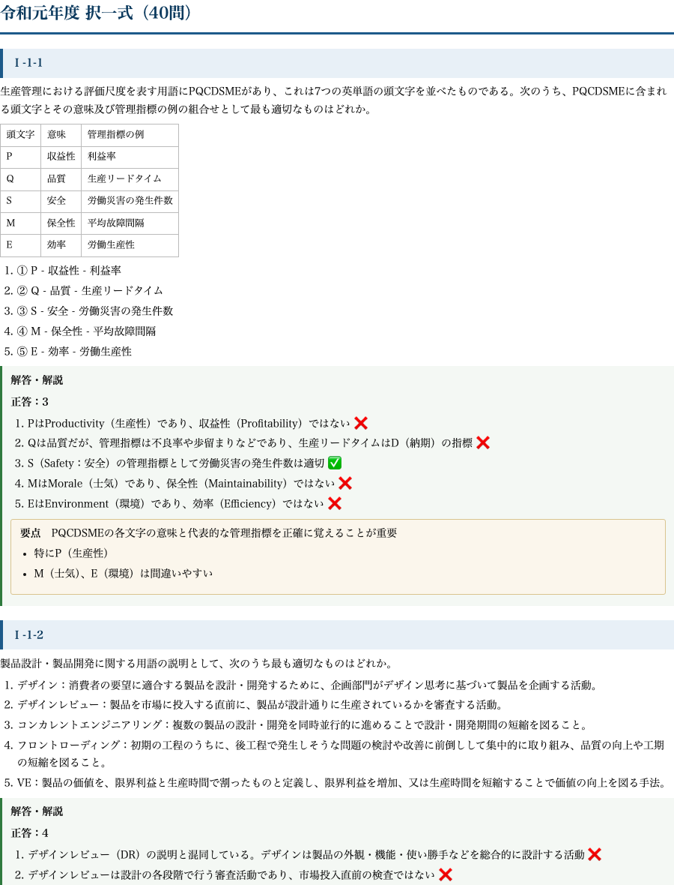

# 技術士 総合技術監理部門｜択一 過去問PDF 令和（令和元〜7年度 全280問・全選択肢解説）

**こんな人のための記事です**

- 総合技術監理部門の択一式（Ⅰ-1〜Ⅰ-2）を、直近の傾向で確実に得点したい
- 5つの管理（経済性・人的資源・情報・安全・社会環境）を横断で回したい
- 正答番号だけでなく、各選択肢がなぜ正しい/誤りなのかを根拠から理解したい

**この記事でわかること**

- 令和元〜7年度の択一 全280問を、5つの管理を横断しながら1冊で通しで回せます
- 各選択肢がなぜ正しい／誤りかを根拠から確認できるので、正答番号の暗記に頼らず本番の初見問題に対応できます
- A4印刷用なので、電波もアプリも要らず、通勤・昼休み・直前期に紙で高速に反復できます

総監の択一式は、5つの管理にまたがる幅広い知識が問われますが、**論点そのものは過去問で繰り返されます**。直近の令和年度は制度改正やガイドライン更新を反映した出題が増えており、平成期より優先度が高い年度群です。

この教材は、**令和元年度から令和7年度までの7年分・全280問**を1問残らず収録し、各選択肢に正誤の理由を付けたA4印刷用PDFです。5管理のどこに属する論点かを意識しながら回せるよう再編集しています。

## 収録内容

- **令和元〜7年度の択一式 全280問**（各年度40問・5管理を横断）
- **全問・全選択肢に正誤の理由を明記**（正しい肢がなぜ正しいか、誤りの肢がどこで誤るか）
- 個数問題・組合せ問題も、選択肢ごとに適否の根拠を提示
- A4・通しページ番号つきの印刷用PDF、出典・著作権・免責を明記
- 直近ガイドライン（事業継続ガイドライン等）を踏まえた出題にも対応

## 中身サンプル

実際の紙面はこの品質です（令和7年度の冒頭）。

たとえば安全管理の事業継続に関する問題は、次のように5肢すべてに根拠が付きます。

> **Ⅰ-1-1　内閣府「事業継続ガイドライン」に示されているBCP・BCMに関する次の記述のうち、最も不適切なものはどれか。**

> 選択肢2　企業におけるBCMは、自社の人的・物的被害の軽減が主である目的であるため、委託先・調達先・供給先などは、BCMの活動や対策の検討範囲には含まれない。

**正答：2**

BCMは自社の被害軽減だけを目的とするものではなく、委託先・調達先・供給先といったサプライチェーン全体の事業継続も検討範囲に含みます。したがって「含まれない」とする肢2が誤りです。他の4肢（BCPの定義、影響度の定量評価、目標復旧時間・レベルの設定、拠点・要員の確保）はいずれもガイドラインに整合します。

このように、正答番号ではなく「2が誤るのはサプライチェーンを検討範囲から外しているから」まで言えるようにするのが、総監択一で崩れない解き方です。全280問がこの粒度で解説されています。

---

<!-- cta:tankan-mokuji -->
総監のほかの無料記事・有料マガジンは「総監もくじ」から一覧できます。

https://note.com/dobokunote/n/n3ed4c77ceed6

## PDF のダウンロードと使い方

ここから先で、全280問・全選択肢解説のA4印刷用PDF（この記事の末尾に添付）をダウンロードできます。以下は、択一を安定得点に変える回し方です。

**5管理でタグ付けしながら1周する**

まず通しで1周し、各問が経済性・人的資源・情報・安全・社会環境のどの管理の論点かを意識します。総監は「管理をまたぐ視点」が問われるため、分野の地図をつくる段階で管理間の関係を掴んでおくと記述式にも効きます。

**誤った肢の理由を管理の原則に紐づける**

2周目は、間違えた肢・根拠を言えなかった肢だけに印をつけ、その論点を各管理の原則（トレードオフ、標準化、最適化など）に紐づけて記憶します。個別の暗記でなく原則に落とすことで、初見の肢にも対応できます。

**直前期は印のついた肢を高速反復**

直前期は印のついた肢だけを高速で回します。紙のPDFなので移動時間でも回せます。択一の底上げは記述式の時間的・精神的余裕にも直結します。

新しい問題集より、この280問を全肢説明できる状態にするほうが、合格に直結します。

## 出典・免責

本教材は、公益社団法人 日本技術士会が実施する技術士第二次試験（総合技術監理部門）の択一式過去問題を出典としています。問題文の著作権は出典元に帰属します。解答・解説および複数年度の編集・再構成は著者（doboku-note）によるものです。

本教材は正確を期して作成していますが、内容を保証するものではありません。法令・基準・ガイドラインは改正されることがあるため、受験にあたっては必ず最新の一次情報をご確認ください。
